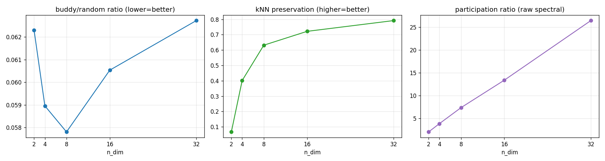
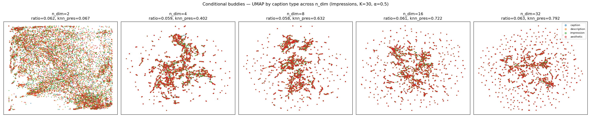
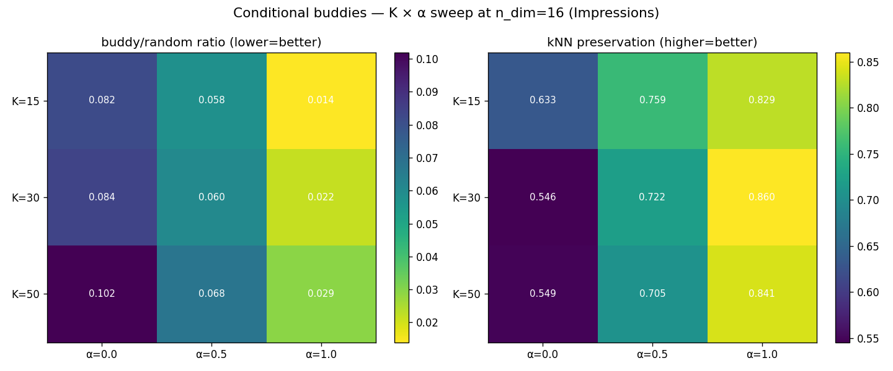

# Conditional Buddies — Dimensionality & Hyperparameter Study

**Date:** 2026-06-09
**Dataset:** Impressions (12,123 image–text pairs)
**Script:** `src/test/20260609_conditional_buddy/dim_hparam_study.py`
**Artifacts:** `docs/reports/assets/{dim_sweep/umap_by_dim.png, dim_sweep_metrics.png, hparam_heatmaps.png, *.csv}`

## What we measured

Three metrics, computed on the final (rank-normalized) init embedding unless noted:

- **buddy/random ratio** — mean distance between strict buddies (mutual NN in *both*
  modalities) ÷ mean distance between random pairs. **Lower = buddies stay closer.**
- **kNN preservation** — for each sample, the fraction of its union-graph neighbours
  that land in its top-15 nearest neighbours *in the embedding*. **Higher = local
  buddy structure is actually retained.**
- **participation ratio** — effective number of dimensions used by the raw spectral
  embedding ((Σλ)²/Σλ²). Tells us whether the structure is genuinely high-dimensional.

## Part A — dimensionality sweep (K=30, α=0.5)




| n_dim | buddy ratio | kNN preservation | participation |
|------:|------------:|-----------------:|--------------:|
| 2  | 0.062 | **0.067** | 1.99 |
| 4  | 0.059 | 0.402 | 3.82 |
| 8  | 0.058 | 0.632 | 7.34 |
| 16 | 0.061 | 0.722 | 13.38 |
| 32 | 0.063 | **0.792** | 26.48 |

**Main takeaway: the 2-D picture is misleading.** The buddy/random ratio is
essentially flat (~0.06) at every dimension — by that metric "buddies are neighbours"
looks equally true everywhere. But **kNN preservation tells the real story**: in 2-D
only **6.7%** of a sample's graph neighbours survive as actual embedding neighbours;
this jumps to 63% at 8-D, 72% at 16-D, and 79% at 32-D. The clean 2-D scatter we used
for the initial sanity check looks reasonable but discards ~93% of the local
neighbourhood structure.

**The structure is genuinely high-dimensional.** Participation ratio grows almost
linearly with n_dim (≈0.83·n_dim), i.e. there's no low-rank shortcut — every added
dimension carries comparable, non-redundant signal. This is expected: the union buddy
graph has average degree ~24 and rich local connectivity that simply cannot be faithfully
laid out in 2-3 dimensions.

**Recommendation: n_dim = 16 is a sound sweet spot** (and matches the model's
`embedding_dim`). It captures 72% neighbourhood preservation; going to 32-D adds only
+7 points. If we ever raise condition capacity, 32-D is marginally better but not
transformative.

**UMAP colouring:** caption types (caption / description / impression / aesthetic) do
**not** separate in the buddy embedding — all four overlap. The geometry is organised by
visual–semantic content (image-dominated, see Part B), not by annotation type. Good to
know: this init encodes "which samples share multimodal context", not "what kind of
caption this is".

## Part B — hyperparameter sweep at n_dim=16



| K \ α | α=0.0 (text) | α=0.5 | α=1.0 (image) |
|---|---|---|---|
| **buddy ratio** (lower=better) | | | |
| K=15 | 0.082 | 0.058 | **0.014** |
| K=30 | 0.084 | 0.060 | 0.022 |
| K=50 | 0.102 | 0.068 | 0.029 |
| **kNN preservation** (higher=better) | | | |
| K=15 | 0.633 | 0.759 | 0.829 |
| K=30 | 0.546 | 0.722 | **0.860** |
| K=50 | 0.549 | 0.705 | 0.841 |

- **α (image/text mix) dominates.** Image-weighted distances are far cleaner on
  Impressions: α=1.0 is best on *both* metrics, α=0.0 (text-only) is worst. This makes
  sense for this dataset — each image carries four very different captions
  (caption/description/impression/aesthetic), so text-space neighbourhoods are noisy
  while image-space neighbourhoods are coherent.
- **K (neighbours) has a mild effect.** K=15–30 are best; K=50 slightly degrades
  preservation (over-broad graph). **K=30 is a fine default.**

**Important caveat before changing α.** α=1.0 throws away text entirely, which
contradicts the whole *cross-modal* premise of "conditional buddies" — and our two
intrinsic metrics both reward image-space self-consistency, so they're biased toward it.
These metrics are *necessary but not sufficient*; the real arbiter is downstream
retrieval. Suggested stance: keep **α≈0.5–0.7** to retain genuine cross-modal signal
(α=0.5 already gives 0.72 preservation), and treat α as the first knob to sweep in the
actual training comparison rather than locking it to the metric-optimal 1.0.

## Recommended configuration (Impressions)

```yaml
train:
  initialization_strategy: buddies
  buddies:
    k: 30
    alpha: 0.5        # 0.5–0.7; α=1.0 is metric-best but image-only (not cross-modal)
    method: spectral
    normalize_method: rank
# n_dim follows model.embedding_dim = 16
```

## Open questions / next steps

1. **Validate against downstream retrieval**, not just intrinsic metrics — especially
   the α choice, where intrinsic metrics favour image-only but the hypothesis wants
   cross-modal.
2. Re-run this study on **COCO** (single caption style per image) — the α picture may
   differ markedly from Impressions, where text is unusually noisy.
3. Consider **n_dim=16 vs 32** in a training A/B given the preservation gap.
