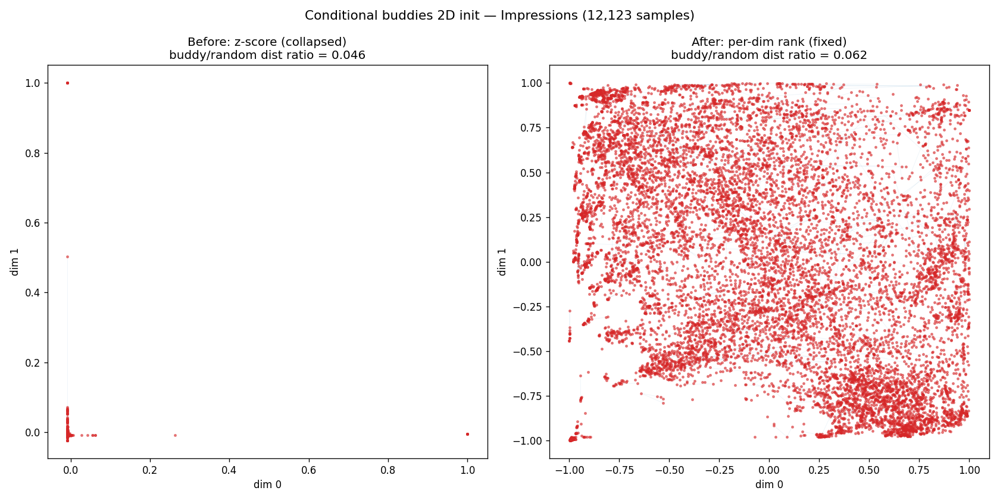

# Weekly Report — Conditional Buddies Initialization

**Week of:** 2026-06-09
**Project:** CoSiR — condition-vector initialization
**Branch:** `experiment/conditional_buddy`

---

## 1. Objective

Give each sample's *condition vector* a meaningful geometric starting point before
training, instead of the existing `imgtxt` initialization (`(image − text)` CLIP
features → PCA). The hypothesis: if samples that share cross-modal context start
**close** in condition space, training has an easier optimization landscape.

The idea — "conditional buddies" — builds a graph from cross-modal
mutual-nearest-neighbours and embeds it into the 16-D condition space, so that
"buddies" (samples that are mutual neighbours in *both* image and text space) begin
near each other.

---

## 2. What we built (from scratch)

A self-contained pipeline (`src/conditional_buddy/`) implementing six steps:

1. **Mutual KNN per modality** — for image and for text features, keep edge *i↔j*
   only if each is in the other's top-K (K=30).
2. **Union graph** — combine the two modalities' mutual graphs (broad connectivity
   for initialization).
3. **Sparse cross-modal distances** — cosine distance on existing edges only.
4. **Rank-normalise & mix** — put both modalities on a comparable scale, then blend
   (α=0.5).
5. **Embed** — Laplacian Eigenmaps (spectral embedding) on the sparse graph into
   N-D.
6. **Normalise & assign** — scale to ~[−1, 1] and write into the condition store.

It plugs into the existing framework as a new `initialization_strategy: buddies`,
a drop-in sibling to `imgtxt`, and reuses the existing template-caching so the
(expensive) graph is computed once per dataset and reused across runs. It is
dataset-agnostic (Impressions, MS-COCO, RedCaps).

---

## 3. Engineering decisions along the way

These are the non-obvious forks we hit and how we resolved them:

| Decision point | What we found | Resolution |
|---|---|---|
| **Nearest-neighbour library** | The reference design used FAISS, but FAISS isn't installed in our environment (and `faiss-gpu` is notoriously fragile to match a specific CUDA build). | The design only used FAISS's *exact* flat index — mathematically identical to a GPU `topk` over normalized features. We implemented exact GPU brute-force `topk` (no new dependency) and left a clean seam to swap in an approximate GPU index (cuVS, already installed) if we ever scale to millions of samples. |
| **Embedding method** | The reference offered SMACOF (MDS) for small datasets. Our scikit-learn (1.8) **removed** the `weight=` argument that SMACOF's missing-edge-aware variant required. | Dropped SMACOF. Spectral embedding works directly on the sparse graph, scales to large N, and covers the use case. |
| **Scale / runtime** | Feature stores are larger than expected (Impressions 12k, COCO 567k, RedCaps 1.55M). Exact KNN is O(N²). | Acceptable because the result is computed **once** and cached as a template: instant on Impressions, ~minutes on COCO, ~1–2 h on RedCaps. The cuVS seam is the escape hatch if RedCaps needs to be fast. |

---

## 4. The collapse problem (and the fix) — main result this week

We deliberately ran a **2-D version first** to visually check whether buddies really
end up as neighbours before committing to the full 16-D run. The metric looked great
(buddies ~20× closer than random), **but the plot told a different story.**

**Left — the problem.** Almost all 12,123 samples collapsed into a single point at
the origin, with a handful of outliers spiking to the corners. As an initialization,
this would start essentially *every* condition at the same place — no better than a
constant init.

**Diagnosis.** We first suspected a disconnected graph, but checked and found it was
**fully connected** (1 component, 0 isolated nodes). The real cause was **eigenvector
localization**: on graphs with uneven node degree, Laplacian Eigenmaps concentrates
its low eigenvectors' mass on a few "hub" nodes. Concretely, 99.8% of points fell
within 1e-3 of the median while a few reached 0.18. The standard z-score
normalization then divides by an outlier-dominated standard deviation, squashing the
bulk to one point. The "good" ratio was an illusion — *everything* had collapsed, so
buddies and random pairs were both near-zero distance.

**Right — the fix.** We replaced the z-score normalization with a **per-dimension
rank normalization** (map each dimension's values to evenly-spaced ranks in
[−1, 1]). This guarantees the points fill the space while preserving neighbourhood
ordering. After the fix the embedding spreads across the full square with visible
local structure, and buddies remain clearly closer than random pairs
(buddy mean distance 0.064 vs random 1.03, ratio ≈ 0.06). z-score is kept as a
non-default option for comparison.

*(Both figures are reproduced from the real Impressions features by
`src/test/20260609_conditional_buddy/make_collapse_comparison.py`; the "before"
panel matches the originally-observed collapsed numbers exactly.)*

---

## 5. Verification

- **Unit tests** (synthetic two-cluster data): graph average degree > 2, mutual-graph
  symmetry, isolated-node repair, output shape (N, 16) within [−1, 1], buddies closer
  than random, and sample-ID reorder correctness — all pass.
- **Integration through the real training path**: initializing the condition store
  for Impressions produces a (12123, 16) array in [−1, 1] with correct sample-ID
  mapping; the template save/load round-trips and correctly rejects a stale template
  when hyperparameters change.
- **Acceptance criteria met** on Impressions: union-graph average degree **23.78**,
  2-D sanity figure produced, no dense N×N matrix allocated on the spectral path.

---

## 6. Next steps

1. Run the full 16-D buddies init on COCO and RedCaps (one-time, cached) and compare
   downstream training curves against the `imgtxt` baseline.
2. If RedCaps KNN runtime becomes a bottleneck, wire the cuVS approximate backend
   behind the existing `mutual_knn(backend=...)` seam.
3. Sweep K (neighbours) and α (image/text mix) on Impressions to see their effect on
   condition-space structure and retrieval.

---

## Appendix — artifacts

- Dimensionality & hyperparameter study: `docs/reports/2026-06-09_buddies_dim_hparam_study.md`
  (key finding: 2-D preserves only ~7% of buddy neighbourhoods vs ~72% at 16-D; α/image-mix
  is the dominant hyperparameter)
- Design spec: `docs/superpowers/specs/2026-06-09-conditional-buddies-init-design.md`
- Code: `src/conditional_buddy/`
- Evidence figures: `docs/reports/assets/{collapse_comparison,collapse_zscore,fixed_rank}.png`
- Repro script: `src/test/20260609_conditional_buddy/make_collapse_comparison.py`
- Session/debug log: `src/test/20260609_conditional_buddy/20260609_conditional_buddy_log.md`
