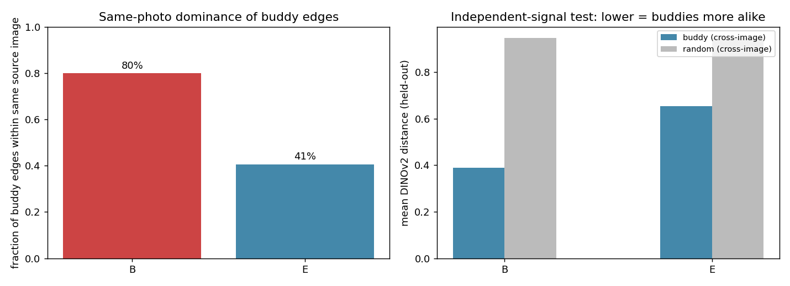
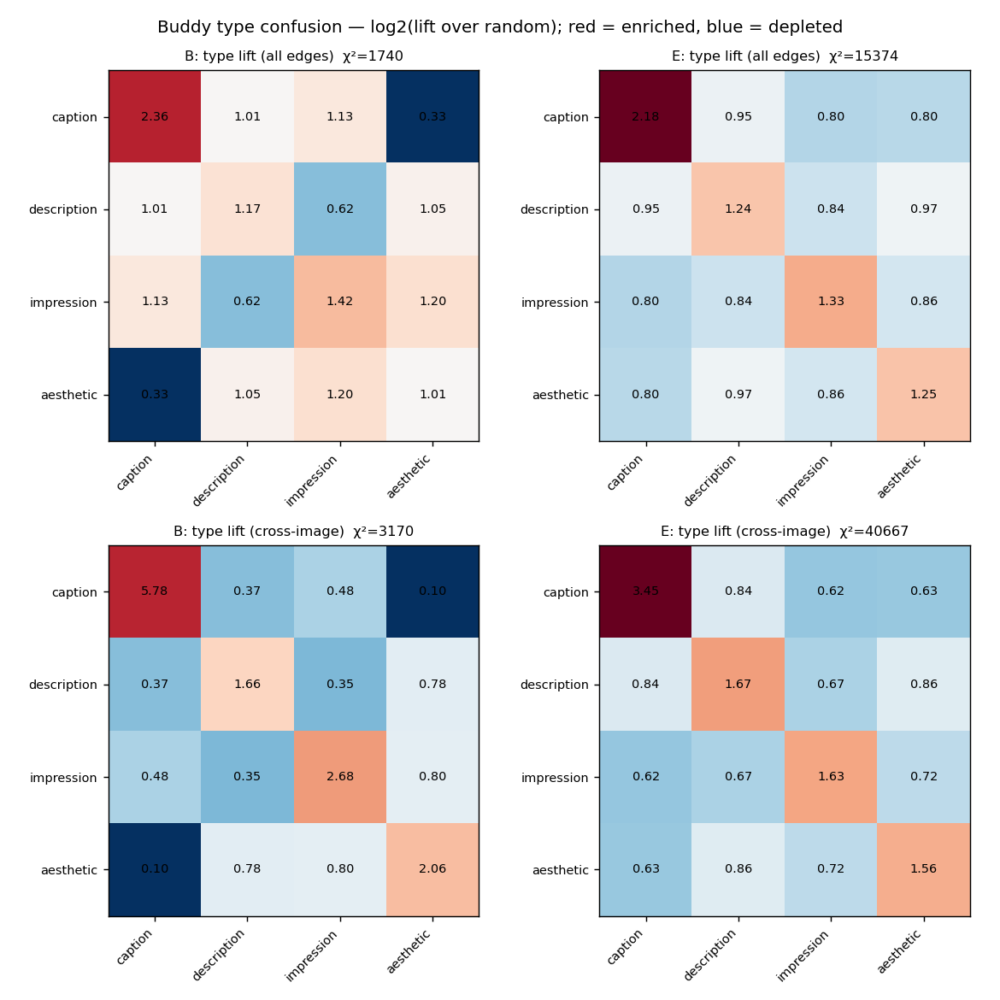
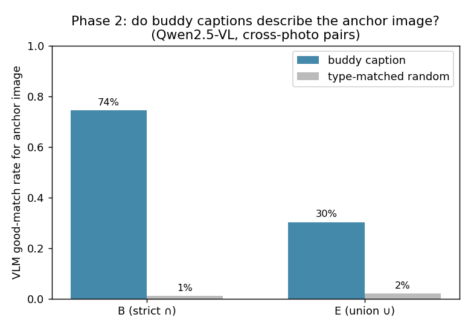

# Are condition buddies meaningful? — Buddy Analysis (Phase 1)

**Date:** 2026-06-22
**Dataset:** Impressions (12,123 samples)
**Branch:** `experiment/conditional_buddy`
**Design:** `docs/superpowers/specs/2026-06-22-buddy-analysis-design.md`
**Code:** `src/test/20260622_buddy_analysis/` · **Stats:** `assets/buddy_analysis/stats.json`

## Question

Condition "buddies" are cross-modal mutual nearest neighbours used to initialize the
condition vectors. We initialize from the **union** graph `E = A_img ∪ A_txt`; the
strict notion is the **intersection** `B = A_img ∩ A_txt` (mutual NN in *both*
image and text CLIP space, K=30). Retrieval looked slightly better with buddy init —
but are the buddies *reasonable*, i.e. do they connect samples that actually share
content?

## The confound we had to control for first

Impressions has only **814 unique source photos** behind its 12,123 records: each
photo is reused 7–56× (median 14) with different captions, and every photo spans
multiple `caption_type`s. Same-photo records sit at CLIP-image cosine **0.82** vs
**0.42** for random pairs.

So the buddy graph (built partly on image features) heavily connects **same-photo
siblings**, which carry *different* caption types. A naive type confusion matrix
would therefore look off-diagonal — not because buddies are meaningless, but because
they are *the same photo in a different caption style*. We handle this two ways:
(1) split every metric into **within-photo** vs **cross-photo** edges, and (2) report
type co-occurrence as **lift over the random base rate**, not raw counts.

This 814-photo identity is itself a free, **finer-than-type ground truth** (4 → 814
classes).

## What buddies are made of (source-photo identity)

| Graph | Edges | Avg degree | Isolated nodes | Edges within same photo |
|-------|-------|-----------|----------------|-------------------------|
| **B** (strict ∩) | 9,589 | 1.58 | 4,327 (36%) | **80%** |
| **E** (union ∪, used for init) | 144,172 | 23.78 | 0 | **41%** |

Strict buddies are overwhelmingly the *same photo* (80%); the union is broader (41%).
This is the expected B-vs-E tradeoff: B is precise but sparse (a third of samples have
no strict buddy); E is dense and fully connected.



## Result 1 — Type confusion matrix (the original ask)

Reported as **lift = observed / expected-under-random** (1.0 = chance; >1 enriched).
Both graphs are massively non-random (χ² ≫ 0, p ≈ 0).



| | diag lift (same-type) | off-diag lift | 
|---|---|---|
| B, all edges | 1.49 | 0.89 |
| E, all edges | 1.50 | 0.87 |
| **B, cross-photo only** | **3.05** | 0.48 |
| **E, cross-photo only** | **2.08** | 0.72 |

**Buddies are type-coherent above chance, and the signal gets *stronger*, not weaker,
once same-photo edges are removed.** Same-type pairs are ~1.5× more likely than chance
overall and 2–3× on genuinely different photos. The structure is interpretable:
`caption↔caption` is the strongest diagonal (lift 5.78 cross-photo in B), while
`caption↔aesthetic` is actively *avoided* (lift 0.10) — short literal captions and
flowery aesthetic text rarely buddy up across photos.

So even though `type` is coarse and carries little structure in the learned condition
space (prior silhouette ≈ 0.019), buddies clearly respect it.

## Result 2 — Independent-signal test (type-free, the stronger evidence)

The graph never saw **DINOv2** (self-supervised, a completely different image
encoder). If buddies are real, cross-photo buddies should still be closer in DINO
space than random cross-photo pairs. Mean held-out DINOv2 cosine distance:

| Graph | buddy, same photo | **buddy, different photos** | random, different photos |
|-------|-------------------|------------------------------|--------------------------|
| **B** | 0.04 | **0.39** | 0.95 |
| **E** | 0.07 | **0.65** | 0.95 |

**Verdict from an encoder the graph never used:** buddies between *different photos*
are far more visually alike than random different-photo pairs (B: 0.39 vs 0.95). This
is type-free confirmation that buddies capture real shared content, not a CLIP
artifact. It also ranks the graphs: **strict B buddies are much tighter (0.39) than
union E buddies (0.65)** — E buys connectivity at the cost of looser neighbours.

## Result 3 — VLM pairwise judgement (Phase 2, the most direct test)

We asked **Qwen2.5-VL-7B** — a model with no role in building the graph — whether each
candidate caption is a GOOD match for an anchor *image*, reusing the existing
`QwenAnnotator` good/bad prompt. For each of ~140 anchors, candidates were the
anchor's **cross-photo buddies' captions** vs **type-matched random cross-photo
captions** (matching caption_type isolates "same content" from "same writing style").



| Graph | buddy caption judged GOOD | type-matched random GOOD | paired diff (95% CI) |
|-------|---------------------------|--------------------------|----------------------|
| **B** (strict ∩) | **74.4%** | 1.0% | **+0.72** [0.65, 0.78] |
| **E** (union ∪) | 30.3% | 2.0% | +0.27 [0.23, 0.32] |

**A vision-language model confirms it directly:** captions belonging to a strict
buddy describe the anchor *image* 74% of the time, versus ~1% for type-matched random
captions of the same style. The ~1–2% random floor shows the type-matched negatives
are genuinely hard (same style, different content), so the buddy signal is about
**content**, not writing style. As with DINO, **B ≫ E** (74% vs 30%): the union graph
that drives initialization mixes in many lower-quality neighbours.

## Overall verdict

Three independent signals — type lift, a held-out encoder (DINOv2), and a VLM judge —
all agree, and all agree that strict **B** is much cleaner than union **E**.

Buddies are **meaningful at three nested granularities**:

1. **Same photo** — most strict-buddy edges (80%) literally connect the same
   underlying image; the dominant signal.
2. **Same scene / content** — cross-photo buddies are far closer than random in an
   *independent* encoder (DINOv2 0.39 vs 0.95 for B), and a VLM judges a strict
   buddy's caption to describe the anchor image 74% of the time (vs ~1% random):
   genuinely different photos that are buddies really are about the same thing.
3. **Same caption type** — cross-photo buddies preserve `caption_type` at 2–3× chance.

The condition-buddy initialization is therefore starting samples that share real
multimodal content near each other — it is reasonable. The strict graph **B** carries
a cleaner signal than the union **E** that currently drives initialization, which is
worth keeping in mind when interpreting the small retrieval gains.

## Caveats & next steps

- "Same photo" dominating B is partly definitional; the *cross-photo* numbers are the
  honest test of whether buddies generalize beyond near-duplicates — and they hold up.
- These metrics describe the **init graph**, not the trained conditions. A natural
  follow-up: do post-training condition vectors preserve buddy proximity, and does
  that correlate with retrieval wins?
- **B ≫ E is the recurring theme.** Initialization uses the union **E** (for full
  connectivity / no isolated nodes), but every quality probe favours the strict
  intersection **B**. Worth testing an init that leans on B where it exists and only
  falls back to E for B-isolated nodes.
- Phase 2 used ~140 anchors × ≤6 buddies per graph at temperature 0; scaling anchors
  would tighten the estimates further but the effect is already unambiguous.

## Reproduce

```bash
conda activate CoSiR
# Phase 1 (offline)
python src/test/20260622_buddy_analysis/extract_dino.py   # held-out DINOv2 (cached)
python src/test/20260622_buddy_analysis/run_phase1.py      # figures + stats.json
# Phase 2 (VLM) — needs the vLLM server
bash src/test/automatic_annotator/launch_vllm.sh           # Qwen2.5-VL-7B on :8000
python src/test/20260622_buddy_analysis/phase2_vlm.py --graph B --n_anchors 150
python src/test/20260622_buddy_analysis/phase2_vlm.py --graph E --n_anchors 150
```
