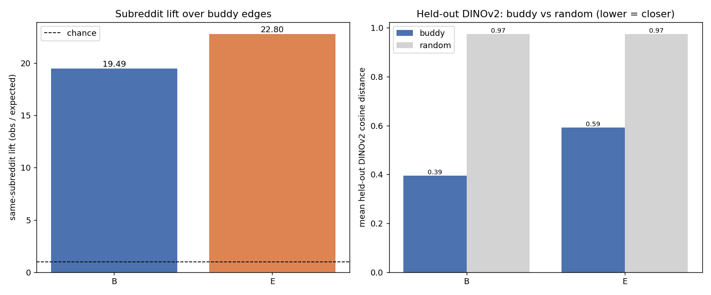
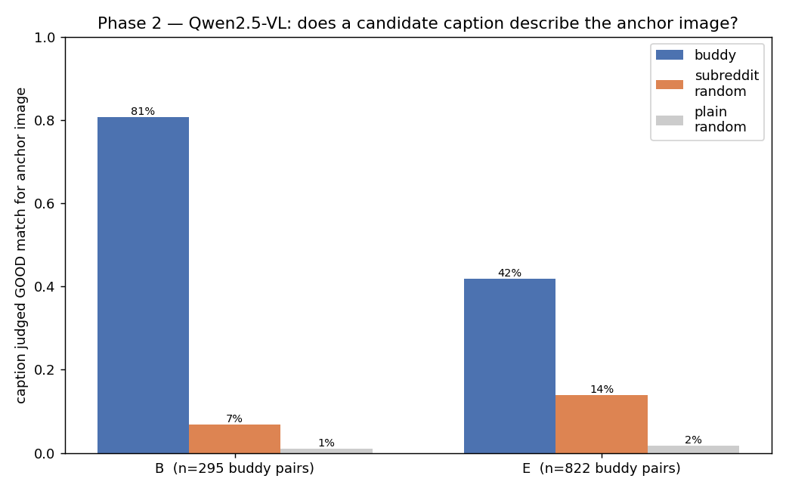
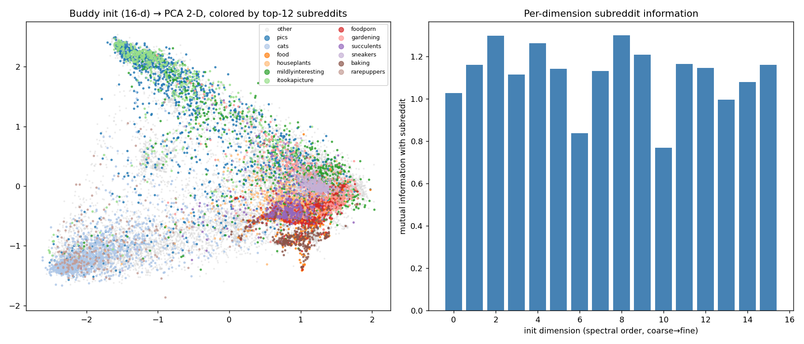

# Do condition buddies generalize? — RedCaps Buddy Run

**Date:** 2026-06-23
**Dataset:** RedCaps (150,000 uniform-random subsample of redcaps-medium, seed 42)
**Branch:** `experiment/conditional_buddy`
**Design:** `docs/superpowers/specs/2026-06-23-redcaps-buddy-design.md`
**Code:** `src/test/20260623_redcaps_buddy/` · **Stats:** `assets/redcaps_buddy/stats.json`
**Precursor:** `docs/reports/2026-06-22_buddy_analysis.md` (Impressions)

## Question

Yesterday we showed condition "buddies" (cross-modal mutual nearest neighbours) are
meaningful on **Impressions** — but that dataset has only 814 source photos behind
12,123 records, so **80% of strict-buddy (`B`) edges literally connect the same
photo**. The honest open question: does the buddy signal survive on a dataset with
**no near-duplicate degeneracy**?

**RedCaps is that test** — genuinely **1 image : 1 caption** (every `image_id`
unique). Every buddy edge is **cross-content by construction**. RedCaps also gives a
far richer free ground truth than Impressions' 4 caption-types: **350 subreddits**,
parsed from the image path (`redcaps/imagesYYYY/<subreddit>/id.jpg`).

Same two graphs as before, K=30: `B = A_img ∩ A_txt` (strict), `E = A_img ∪ A_txt`
(union, the graph that initializes condition vectors).

## What the buddy graph looks like on clean 1:1 data

| Graph | Edges | Avg degree | Isolated nodes | |
|-------|-------|-----------|----------------|--|
| **B** (strict ∩) | 27,797 | 0.37 | **123,743 (82.5%)** | strict buddies are *rare* |
| **E** (union ∪, used for init) | 1,427,711 | 19.04 | 1,704 (1.1%) | union stays well-connected |

This is the first finding, and it flips yesterday's picture. On Impressions the
near-dup structure made **B dense** (most samples had a same-photo strict buddy).
On RedCaps, with no near-duplicates, **82% of samples have *no* strict buddy at
all** — mutual-NN-in-*both*-modalities is a high bar when every image is unique.
The union **E** remains the workhorse (avg degree 19, ~fully connected). So the
"prefer B over E" guidance from Impressions is moot here: **B barely exists**, and
init must rely on E.

## Result 1 — Subreddit lift (replaces the type-confusion matrix)

`overall_lift = P(buddy endpoints share subreddit) / expected-under-random`, where
"expected" uses the subreddit marginal of edge endpoints (controls for the fact
that a few subreddits dominate). 1.0 = chance.



| Graph | obs. same-subreddit | expected (chance) | **lift** |
|-------|---------------------|-------------------|----------|
| **B** (strict ∩) | 49.6% | 2.55% | **19.5×** |
| **E** (union ∪) | 37.0% | 1.62% | **22.8×** |

**Buddies share subreddit ~20× more often than chance** — an order of magnitude
stronger than Impressions' type lift (1.5× overall, 2–3× cross-photo). On a clean
1:1 dataset with 350 categories, the buddy graph is overwhelmingly topical. The
most-enriched niches are exactly the visually/textually distinctive ones:

- **E**: `f1porn ×671`, `scotch ×526`, `trains ×425`, `sushi ×395`, `trucks ×382`,
  `pourpainting ×355`, `mead ×327`, `chefknives ×323`, `axolotls ×274`,
  `tarantulas ×270`, `leathercraft ×308`, `flyfishing ×283`.
- **B**: `sneakers ×101`, `f1porn ×82`, `crochet ×78`, `cats ×65`, `woodworking ×57`,
  `houseplants ×54`, `astrophotography ×27`.

## Result 2 — Held-out DINOv2 (type-free, the stronger evidence)

The graph never saw **DINOv2** (self-supervised, a different image encoder).
DINOv2-small extracted for all 150K images (0 missing). Mean held-out cosine
distance, buddy edges vs random pairs — and remember **every RedCaps buddy is
cross-content**, so there is no "same photo" column to hide behind:

| Graph | buddy | random | |
|-------|-------|--------|--|
| **B** | **0.39** | 0.97 | |
| **E** | **0.59** | 0.97 | |

**An encoder the graph never used confirms it directly, and the numbers almost
exactly match Impressions' *cross-photo* numbers** (Impressions B 0.39 vs 0.95, E
0.65 vs 0.95). So the cross-content buddy signal that we had to dig out from under
the near-dups on Impressions is, on RedCaps, simply *the whole signal* — and it is
just as tight. The `B ≪ E` ordering also reproduces: strict buddies (0.39) are far
closer than union buddies (0.59), confirming E buys connectivity at the cost of
looser neighbours.

## Result 3 — VLM judge (Phase 2, the most direct test)

We asked **Qwen2.5-VL-7B** — a model with no role in building the graph — whether
each candidate caption is a GOOD match for an anchor *image*, reusing the existing
`QwenAnnotator` good/bad prompt (already written for Reddit data). For each of 150
anchors, candidates were the anchor's **buddy captions** vs two negatives:
**subreddit-matched random** (same subreddit, different image — same topic, hard)
and **plain random** (any subreddit — easy floor). Candidates are shuffled per
anchor; temperature 0.



| Graph | buddy GOOD | subreddit-random GOOD | plain-random GOOD | paired diff vs subreddit (95% CI) |
|-------|-----------|------------------------|-------------------|-----------------------------------|
| **B** (strict ∩) | **80.7%** | 6.8% | 1.0% | **+0.70** [0.62, 0.78] |
| **E** (union ∪) | 41.8% | 14.0% | 1.8% | **+0.26** [0.20, 0.31] |

**A vision-language model confirms it directly:** a strict-buddy's caption describes
the anchor *image* 81% of the time, versus 7% for a same-subreddit caption of a
*different* image and 1% for a random caption. The clean gradient
**buddy ≫ same-topic ≫ random** is the key result: buddies capture **specific
content**, not merely the broad topic — the same-subreddit negative is the hard one,
and buddies still beat it 12×. As everywhere, **B ≫ E** (81% vs 42%): the union
graph that drives initialization mixes in many looser neighbours. The numbers track
Impressions' Phase 2 (B 74% / E 30%) but on genuinely distinct images.

## Result 4 — Structure of the init space ("the bigger picture")

We ran the buddy spectral init (`compute_buddy_init`, n_dim=16) and probed the
resulting condition space against subreddit labels. (Spectral run on a dense
12K subsample, K=60, single connected component — see *Caveats*.)



| Probe | Value | Reading |
|-------|-------|---------|
| Silhouette (all 350 subs) | **−0.36** | subreddits are **not** compact blobs |
| Silhouette (top-30 subs) | −0.02 | ~neutral even for big subreddits |
| KMeans ARI vs subreddit (K=20 / 100 / 350) | 0.15 / **0.17** / 0.12 | real but modest recovery, **peaks at K≈100** |
| Per-dim mutual info with subreddit | **1.05 – 1.48 nats, all 16 dims** | topic info is **distributed across every axis** |

The picture is consistent and interesting: the buddy-init space is a **smooth
content manifold, not a discrete cluster-per-subreddit partition**. Three signals
agree —

1. **Negative silhouette** → no tight, well-separated subreddit balls; neighbouring
   topics overlap (food → foodporn → baking → breadit blend into one region).
2. **ARI peaks at K≈100, not 350** → the space organizes into ~100 *coarser
   meta-topics* (related subreddits merge), finer than the 4 Impressions types but
   coarser than 350 subreddits.
3. **High, fairly flat per-dim MI** → subreddit information is spread across all 16
   dimensions with only a gentle coarse→fine gradient (1.48 → 1.05), so the
   "dimension-index = granularity" hypothesis holds only weakly; the hierarchy is
   *distributed*, not axis-aligned.

## Overall verdict

On a dataset with **zero near-duplicate scaffolding**, three independent signals —
subreddit lift (~20×), a held-out encoder (DINOv2, 0.39 vs 0.97), and a VLM judge
(strict-buddy caption describes the anchor image 81% vs 7% same-topic) — all confirm
that condition buddies connect samples sharing **real, specific multimodal
content**. The DINOv2 and VLM numbers match Impressions' cross-photo / Phase-2
numbers almost exactly. **The buddy signal is not an artifact of near-duplicates; it
generalizes.**

Two things change on clean data:

- **Strict B is rare** (82% of samples have no strict buddy), so the "prefer B"
  lever from Impressions doesn't apply — initialization genuinely needs the union E.
- **The init space is a smooth topical manifold**, encoding subreddit richly on
  every dimension but blending related topics rather than isolating them — closer to
  ~100 meta-topics than 350 hard clusters.

## Caveats & next steps

- **Validation uses the full 150K graph; the structure probe uses a 12K dense
  subsample.** `SpectralEmbedding(arpack)` factorizes an N×N Laplacian and is
  crippled by the many near-zero eigenvalues of a *disconnected* graph (the 150K
  union fragments into components); a small dense subsample is connected and the
  solver is well-conditioned. The lift and DINO results — the scientific core — are
  on all 150K. The structure read should be treated as indicative.
- **Scaling spectral init to RedCaps** will need a better eigensolver (lobpcg/amg)
  or a connectivity guarantee in `ensure_min_degree`; arpack shift-invert does not
  scale to 150K+ here. Worth a follow-up if buddy-init graduates to RedCaps training.
- **Phase 2 (done): the VLM judge.** See Result 3 — buddy 81% vs same-topic 7% (B).
  The same-subreddit negative is the honest hard test, and buddies clear it 12×.
- This is the **init graph**, not trained conditions. The natural follow-up mirrors
  Impressions': do post-training conditions preserve buddy/topic proximity, and does
  that correlate with retrieval?

## Baseline snapshot (frozen 2026-06-23, pre eigensolver fix)

This report is the **baseline** captured *before* fixing the spectral eigensolver.
Frozen copies of every number/figure live in `assets/redcaps_buddy/baseline/`
(`stats.json`, `lift_and_dino.png`, `init_structure.png`). The follow-up fix
(arpack → lobpcg + scaling) will overwrite the live artifacts; diff against
`baseline/` to see what moved.

**Expected to be PRESERVED (computed on full 150 K graph edges, no spectral step):**
- Graph stats — B: 27,797 edges / 82.5% isolated; E: 1,427,711 edges / avg deg 19.0
- Subreddit lift — B **19.5×**, E **22.8×**
- Held-out DINOv2 — B **0.39** / E **0.59** vs random 0.97

**MAY CHANGE (structure probe — currently a proxy: 12 K subsample, K=60, forced to
1 connected component):**
- Silhouette all/top30 = **−0.36 / −0.02**
- KMeans ARI vs subreddit (K=20/100/350) = **0.15 / 0.17 / 0.12**
- Per-dim MI = **1.05 – 1.48 nats**, all 16 dims
- The fix re-runs this on the **real init** (full 150 K, K=30, *disconnected*), so
  watch especially whether the **leading dims become component-indicators** rather
  than a smooth topical gradient.

## Post-fix update — the real init on the full 150 K graph

The baseline structure probe above was a **proxy**: a 12 K dense (K=60) subsample
*forced to one connected component* so the arpack solver would converge. We then
fixed the eigensolver (arpack → pyamg `amg`, matrix-free; `src/conditional_buddy/
embedding_methods.py`, change log `.claude/20260623_log.md`) and re-ran on the
**real init**: full 150 K at the init's actual K=30. amg handled it in seconds
(arpack never finished) — including the **54 disconnected components** the real
graph fragments into.

**Preserved (as predicted):** every validation number is unchanged — lift, DINO,
graph stats are graph-edge statistics and never touched the spectral step.

**Changed — and it overturns the structure read:**

| Probe | Baseline proxy (12 K, forced-connected) | **Real init (150 K, 54 components)** |
|-------|------------------------------------------|----------------------------------------|
| Silhouette all / top-30 | −0.36 / −0.02 | −0.30 / −0.07 |
| KMeans ARI (K=20/100/350) | 0.15 / **0.17** / 0.12 | **0.017 / 0.023 / 0.016** |
| Per-dim MI with subreddit | 1.05 – **1.48** | 0.11 – **0.25** |

ARI and per-dim MI collapse ~10×, and the PCA scatter goes from partial topical
regions to a fully-mixed blob (`init_structure.png` vs `baseline/init_structure.png`).

**This is faithful, not a solver artifact** (amg and arpack target the *same*
eigenvectors): the real union graph has **54 connected components → 54 near-zero
Laplacian eigenvalues**, so all 16 requested dimensions are consumed by (mostly
tiny) **component-indicator** vectors instead of within-component topical gradient.
The "smooth topical manifold" seen in the baseline was an artifact of *forcing
connectivity* on the proxy. So the corrected conclusion:

> On diverse 1:1 data the buddy graph fragments, and a low-dimensional (n_dim=16)
> spectral init is **component-dominated and topically uninformative** — the strong
> per-edge buddy signal (lift 20×, DINO 0.39) does **not** survive into a 16-d
> spectral init unless connectivity is handled.

This is the actionable finding: `ensure_min_degree` guarantees degree ≥ 1 but **not
connectedness**. It only became visible once the solver could run the real graph —
and it motivated the connectivity fix below.

## Connectivity fix — bridging the components

We added `ensure_connected` (`src/conditional_buddy/buddy_graph.py`; design
`docs/superpowers/specs/2026-06-23-buddy-connectivity-design.md`): label the
components, pick a per-component medoid in the mix-weighted concat feature
`[√α·img, √(1−α)·txt]`, build a **minimum spanning tree over the medoids**, and add
the `C−1` bridge edges to `E` (binary, symmetric; weighted downstream by the
existing cosine-distance step). Default-on, a no-op when `E` is already connected
(so Impressions/COCO are unchanged). On RedCaps-150K it added **53 bridges over 54
components → 1 connected component**, then the spectral init ran unchanged.

The clean ablation (identical 150 K / K=30, connectivity the only difference):

| Probe | no-connect (54 comp) | **+connect (1 comp)** | baseline proxy (ref) |
|-------|----------------------|-----------------------|----------------------|
| KMeans ARI (K=20/100/350) | 0.017 / 0.023 / 0.016 | **0.143 / 0.153 / 0.098** | 0.15 / 0.17 / 0.12 |
| Per-dim MI with subreddit | 0.11 – 0.25 | **0.77 – 1.30** | 1.05 – 1.48 |
| Silhouette all / top-30 | −0.30 / −0.07 | −0.35 / −0.10 | −0.36 / −0.02 |

**53 bridge edges recover the topical signal**: ARI jumps ~10× (0.02 → 0.15) and
per-dim MI ~7× (0.15 → 1.1), back to the forced-connected proxy's level — but now on
the **real full 150 K graph at the init's actual K=30**. So component fragmentation
*was* the cause, and the validated 20× per-edge buddy signal now reaches the 16-d
init. The PCA scatter shows topical regions return (`init_structure.png`).

Silhouette stays negative, so the corrected structural read holds: the buddy-init
space is a **smooth topical manifold** — clustering recovers topic (ARI ~0.15) and
every dim carries strong subreddit information (MI ~1.1), but topics blend rather
than forming hard, well-separated balls. Validation (lift 20×, DINO 0.39) is
unchanged throughout.

This makes buddy-init usable on RedCaps end-to-end: the eigensolver fix made it
*runnable* at 150 K, and the connectivity fix made the resulting init *informative*.
The natural follow-up is now training: does a condition init carrying this topical
structure help retrieval on RedCaps?

## Reproduce

```bash
conda activate CoSiR
python src/test/20260623_redcaps_buddy/build_subsample.py     # 150k JSON (seed 42)
python src/test/20260623_redcaps_buddy/extract_features.py    # CLIP store (fresh)
python src/test/20260623_redcaps_buddy/extract_dino.py        # held-out DINOv2
python src/test/20260623_redcaps_buddy/run_phase1.py          # lift + DINO (full 150K)
# real init structure on the full graph (needs pyamg for the amg solver;
# connectivity bridging is on by default):
python src/test/20260623_redcaps_buddy/run_structure.py --n 0 --k 30
python src/test/20260623_redcaps_buddy/run_structure.py --n 0 --k 30 --no-connect  # ablation

# Phase 2 — VLM judge (needs the vLLM server; lower gpu-util if memory is tight):
vllm serve Qwen/Qwen2.5-VL-7B-Instruct --port 8000 --max-model-len 8192 \
    --gpu-memory-utilization 0.88 --trust-remote-code            # separate terminal
python src/test/20260623_redcaps_buddy/phase2_vlm.py --graph B --n_anchors 150
python src/test/20260623_redcaps_buddy/phase2_vlm.py --graph E --n_anchors 150
python src/test/20260623_redcaps_buddy/make_phase2_fig.py
```
