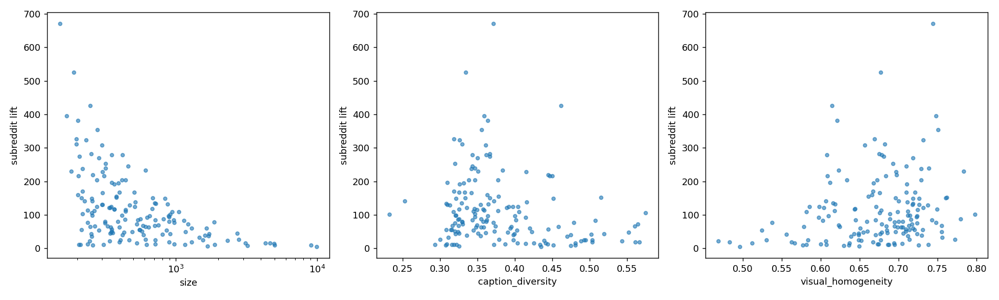

# What predicts buddy-signal strength across RedCaps subreddits? — Experiment 9

**Date:** 2026-08-24 · **Dataset:** RedCaps-150k (`redcaps_150k.json`, same cache as `2026-06-23_redcaps_buddy.md`) · **Branch:** `experiment/buddy_init_ablation`
**Code:** `src/test/20260824_redcaps_subreddit_correlates/analyze_subreddit_correlates.py` (analysis), `src/test/20260623_redcaps_buddy/redcaps_buddy.py` (`subreddit_lift`, extended to return every qualifying subreddit, not just top-15)
**Spec:** `docs/superpowers/specs/2026-08-04-buddy-publication-plan-design.md` §4 Experiment 9
**Precursor:** `docs/reports/2026-06-23_redcaps_buddy.md` (the original aggregate ~20× lift finding this deepens)

---

## TL;DR

RedCaps' aggregate ~20× same-subreddit buddy-edge lift (C1) is not evenly distributed: per-subreddit lift ranges from **4.4× to 671×** across 159 qualifying subreddits. Of the three candidate properties tested, two are genuinely null and one is not:

| Property | Pearson r | Spearman ρ | n |
|---|---:|---:|---:|
| size (sample count) | −0.328 | **−0.523** | 159 |
| caption diversity (1 − mean pairwise text-cosine-sim) | −0.219 | −0.224 | 159 |
| visual homogeneity (mean pairwise image-cosine-sim) | +0.204 | +0.230 | 159 |

**Caption diversity and visual homogeneity are genuinely null** — weak under both Pearson and Spearman, no reasonable transform moves them. **Size is not null.** Its Pearson r (−0.328) understates the relationship because lift vs. size is a curved, not straight-line, association — visible in the report's own log-x scatter panel. Rank correlation and log-transforms, which are appropriate for a curved monotone relationship, both clear a "moderate" threshold: Spearman ρ = **−0.523**, Pearson on log(size) vs. lift = **−0.509**, Pearson on log(size) vs. log(lift) = **−0.583**. Bigger, more generic subreddits (`pics`, `cats`, `food`, `foodporn`) sit at the low-lift end; small, visually/topically distinctive niches (`f1porn`, `scotch`, `trains`, `sushi`) sit at the high-lift end.

**But the mechanism is not "large subreddits are topically diluted."** We tested that directly using each subreddit's *purity* (the fraction of its buddy-edge endpoints that land on another same-subreddit sample, recovered from `subreddit_lift`'s own internals — see Method). If large subreddits were less topically exclusive, purity should *fall* with size. It does the opposite: purity **rises** with size (Spearman ρ = **+0.214**, Pearson log(size) vs. purity = **+0.187**). The real explanation is structural, not content-driven: a subreddit's edge-endpoint degree `deg_s` tracks its size almost exactly (Spearman ρ = **+0.973**), and `subreddit_lift`'s own formula divides by an expected count that scales with `deg_s` — so at any fixed purity, lift is mechanically pulled toward `1/deg_s`, i.e. toward `1/size`. Large subreddits (e.g. `cats`, purity 0.53; `food`, purity 0.39) can have decent purity and still post low lift purely because their `deg_s` is enormous — the metric's own normalization, not their content, caps how high their lift can go. This is a legitimate null result for caption diversity and visual homogeneity, and a real-but-structural (not content-driven) finding for size — none of it weakens C1's core claim that the signal itself is real.

---

## Method

### Per-subreddit lift (full breakdown, not just top-15)

`redcaps_buddy.subreddit_lift(data, e, top_k=None)` (extended in Task 1 of this plan item) computes, for every subreddit `s` with an edge-endpoint reliability threshold `exp_s > 5`:

```
lift_s = obs_same_sub_endpoints_s / exp_same_sub_endpoints_s
```

where `exp_same_sub_endpoints_s = deg_s * p_s` (`p_s` = subreddit `s`'s share of all edge endpoints, `deg_s` = its total edge-endpoint count) — the same "expected under the endpoint marginal" normalization used for the aggregate `overall_lift` figure in the original report, applied per-subreddit instead of only in aggregate. `top_k=None` returns every subreddit clearing the reliability filter, sorted by lift descending, instead of only the top 15.

The buddy graph itself is unchanged from the rest of the RedCaps buddy analysis: `E = A_img ∪ A_txt`, mutual-kNN per modality with `K=30` (project-wide default, `configs/train/default.yaml`), built over the full 150k CLIP feature cache. (`union_graph` combines two unweighted mutual-kNN adjacency matrices by set union — `alpha` is not a parameter of this path; it only applies to a different, weighted-distance graph construction elsewhere in the codebase.)

**Purity, and why the lift formula structurally favors small subreddits.** `subreddit_lift` computes, per subreddit `s`: `p_s = deg_s / total_endpoints`, `exp_s = deg_s * p_s`, `lift_s = obs_s / exp_s`. Define *purity* `= obs_s / deg_s` — the fraction of subreddit `s`'s own edge endpoints that land on a same-subreddit edge, independent of how the "expected" baseline is normalized. It is recoverable from what `analyze_subreddit_correlates.py` already has (`lift_s` and `deg_s`, both returned by `subreddit_lift`), without needing `obs_s` directly:

```
purity_s = obs_s / deg_s = lift_s * exp_s / deg_s = lift_s * p_s = lift_s * deg_s / total_endpoints
```

where `total_endpoints = 2 * len(e)` (every edge contributes two endpoints). This is what `run()` now computes and uses for the mechanism check in Results.

### Three subreddit properties

- **Size:** raw sample count per subreddit (`len(idx)`).
- **Caption diversity:** `1 − mean_pairwise_cosine_sim(txt rows)` — high when a subreddit's captions are spread out in CLIP text-embedding space, low when they're repetitive/templated.
- **Visual homogeneity:** `mean_pairwise_cosine_sim(img rows)` — high when a subreddit's images cluster tightly in CLIP image-embedding space.

Both similarity properties use the same helper, `mean_pairwise_cosine_sim(X)`, applied to the subreddit's L2-normalized text or image feature rows respectively. Subreddits with fewer than `MIN_SUBREDDIT_SIZE = 20` samples are skipped — below that, a pairwise-similarity estimate over so few pairs is too noisy to trust (see Caveats).

**Closed-form identity, used to avoid an O(n²) loop.** For unit-norm row vectors, `‖Σx_i‖² = n + 2·Σ_{i<j}(x_i · x_j)`. Rearranging gives the mean pairwise cosine similarity in O(n·d) instead of O(n²·d):

```python
S = X.sum(axis=0)
total = S @ S - n                      # = 2 * sum_{i<j} x_i . x_j
mean_pairwise_sim = total / (n * (n - 1))
```

This matters because the largest qualifying subreddits run into the thousands of samples (`pics` alone has 9,882) — an explicit double loop over pairs would be `O(n²)` per subreddit and prohibitively slow across 159 subreddits, several with n in the thousands, while the closed form is a single sum-then-dot-product per subreddit regardless of size. The identity was cross-checked against a brute-force O(n²) loop on random unit vectors in the script's `--selftest` mode (max abs error < 1e-4) before being run on real data.

### Correlation

Both Pearson `r` and Spearman rank correlation `ρ` (`scipy.stats.spearmanr`) between per-subreddit lift and each property, over the subreddits present in both the lift table (passed `exp_s > 5`) and the properties table (passed `size >= MIN_SUBREDDIT_SIZE`) — 159 subreddits in the actual run (see Results). Pearson only detects a straight-line relationship; Spearman also catches a monotone-but-curved one, which turns out to matter for `size` (see Results and TL;DR).

---

## Results

**Command run:**

```bash
source ~/miniconda3/etc/profile.d/conda.sh && conda activate CoSiR
python src/test/20260824_redcaps_subreddit_correlates/analyze_subreddit_correlates.py
```

**Captured output** (summary; the full per-subreddit table `run()` now prints is reproduced in full in the fix report, `.superpowers/sdd/2026-08-24-redcaps-subreddit-signal-correlates/final-review-fix-report.md`, and can be regenerated any time with the command above):

```
Loading RedCaps data + buddy graph...
Computing full per-subreddit lift (350 subreddits)...
  overall_lift=22.80x over 159 qualifying subreddits
Computing per-subreddit properties (size, caption diversity, visual homogeneity)...

Correlation(subreddit lift, property) — Pearson (linear) and Spearman (monotone rank):
                  size: pearson r=-0.328  spearman rho=-0.523  (n=159 subreddits)
     caption_diversity: pearson r=-0.219  spearman rho=-0.224  (n=159 subreddits)
    visual_homogeneity: pearson r=+0.204  spearman rho=+0.230  (n=159 subreddits)

Purity check (does the size effect on lift reflect purity, or lift's own 1/size normalization?):
  spearman deg_s      vs size          : +0.973  (deg_s tracks size almost exactly)
  spearman size       vs purity         : +0.214  (purity rises with size — opposite of the lift trend)
  pearson  log(size)  vs purity         : +0.187
  pearson  log(size)  vs lift            : -0.509
  pearson  log(size)  vs log(lift)       : -0.583

Full per-subreddit table (159 subreddits, sorted by lift desc):
[... 159 rows: subreddit, lift, size, deg_s, purity — see fix report or re-run for full listing ...]
wrote docs/reports/assets/redcaps_subreddit_correlates/lift_vs_properties.png
```

**Overall lift: 22.80×** over **159 of 350** subreddits (those clearing the `exp_s > 5` reliability filter *and* the `MIN_SUBREDDIT_SIZE = 20` property filter). This matches the original aggregate-lift report's union-graph figure (`2026-06-23_redcaps_buddy.md`, E: 22.8×) — same graph, same data, extended here to per-subreddit granularity.

### Per-subreddit spread

Lift ranges from **4.41× (`pics`)** to **670.79× (`f1porn`)** across the 159 qualifying subreddits (median 83.98×, mean 114.10×) — an order of magnitude of spread the single aggregate number hides.

Top 15 by lift (small, visually/topically distinctive niches — and, per the mechanism analysis below, high-*purity* niches with small `deg_s`):

| subreddit | lift | size | deg_s | purity | caption diversity | visual homogeneity |
|---|---:|---:|---:|---:|---:|---:|
| f1porn | 670.79 | 151 | 4,147 | 0.974 | 0.371 | 0.744 |
| scotch | 525.58 | 190 | 5,010 | 0.922 | 0.335 | 0.677 |
| trains | 425.17 | 248 | 5,127 | 0.763 | 0.461 | 0.614 |
| sushi | 395.21 | 168 | 4,080 | 0.565 | 0.359 | 0.748 |
| trucks | 381.94 | 203 | 4,842 | 0.648 | 0.364 | 0.621 |
| pourpainting | 354.46 | 277 | 5,319 | 0.660 | 0.355 | 0.751 |
| mead | 326.74 | 197 | 4,495 | 0.514 | 0.319 | 0.669 |
| chefknives | 323.42 | 232 | 4,743 | 0.537 | 0.326 | 0.731 |
| horses | 310.87 | 197 | 3,824 | 0.416 | 0.330 | 0.682 |
| leathercraft | 307.69 | 300 | 5,405 | 0.582 | 0.361 | 0.657 |
| flyfishing | 282.79 | 252 | 4,460 | 0.442 | 0.366 | 0.675 |
| quilting | 278.85 | 350 | 6,122 | 0.598 | 0.343 | 0.678 |
| vinyl | 278.79 | 419 | 6,375 | 0.622 | 0.362 | 0.608 |
| axolotls | 273.67 | 207 | 3,860 | 0.370 | 0.366 | 0.681 |
| tarantulas | 270.11 | 286 | 6,126 | 0.580 | 0.350 | 0.718 |

Bottom 15 by lift (large subreddits — but note purity is *not* uniformly low: `cats` and `food` have moderate purity, they just carry enormous `deg_s`):

| subreddit | lift | size | deg_s | purity | caption diversity | visual homogeneity |
|---|---:|---:|---:|---:|---:|---:|
| doggos | 12.95 | 238 | 4,552 | 0.021 | 0.309 | 0.673 |
| outdoors | 12.90 | 716 | 15,929 | 0.072 | 0.444 | 0.600 |
| plants | 12.29 | 970 | 19,277 | 0.083 | 0.387 | 0.674 |
| lookatmydog | 11.58 | 620 | 11,560 | 0.047 | 0.316 | 0.695 |
| natureporn | 11.20 | 211 | 4,736 | 0.019 | 0.433 | 0.607 |
| rarepuppers | 11.19 | 1,875 | 32,507 | 0.127 | 0.322 | 0.686 |
| dogpictures | 11.07 | 1,159 | 22,157 | 0.086 | 0.318 | 0.687 |
| photographs | 10.87 | 206 | 3,904 | 0.015 | 0.372 | 0.581 |
| catpictures | 10.53 | 308 | 5,260 | 0.019 | 0.293 | 0.738 |
| amateurphotography | 10.01 | 258 | 4,837 | 0.017 | 0.481 | 0.577 |
| cats | 9.73 | 9,027 | 156,926 | **0.535** | 0.307 | 0.725 |
| food | 9.07 | 4,991 | 121,660 | **0.386** | 0.451 | 0.636 |
| foodporn | 8.14 | 3,203 | 70,111 | 0.200 | 0.475 | 0.629 |
| eyebleach | 7.21 | 1,672 | 31,473 | 0.079 | 0.326 | 0.649 |
| pics | 4.41 | 9,882 | 168,390 | 0.260 | 0.435 | 0.497 |

`cats` and `food` are the clearest illustration of the mechanism below: their purity (0.54, 0.39) is not particularly low relative to the top-15 niches, but their `deg_s` (156,926 and 121,660, vs. ~4,000–6,000 for the top-15 niches) is one to two orders of magnitude larger, and `subreddit_lift`'s own normalization divides by a quantity that scales with `deg_s` — so lift comes out low regardless of purity.

(Full 159-row table is reproducible with the command in Reproduce below — `run()` now prints it directly, sorted by lift descending, as part of its normal output; no separate script is needed.)

### Correlations

| Property | Pearson r | Spearman ρ | n | Interpretation |
|---|---:|---:|---:|---|
| size | −0.328 | **−0.523** | 159 | **Not null.** Pearson on the raw values is weak because lift vs. size is a curved (not straight-line) relationship — Spearman, which only needs the relationship to be monotone, clears a "moderate" threshold, as does Pearson on log-transformed values (log(size) vs. lift = −0.509, log(size) vs. log(lift) = −0.583). Larger subreddits (`pics`, `cats`, `food`, `foodporn`) skew toward lower lift; small niche subreddits skew toward higher lift. **This is not because large subreddits are topically diluted** — see Mechanism below; purity actually rises with size. |
| caption diversity | −0.219 | −0.224 | 159 | Weak under both measures — genuinely null. Notably the *opposite* sign from the spec's working hypothesis ("caption-diverse" subreddits expected to show *higher* lift): if anything, subreddits with more repetitive/templated captions show marginally higher lift, not lower. Too weak to draw a mechanistic conclusion from either way. |
| visual homogeneity | +0.204 | +0.230 | 159 | Weak under both measures — genuinely null. This one *is* in the direction the spec's hypothesis expected (more visually homogeneous → higher lift), but weak enough that visual homogeneity alone explains very little of the variance (r²≈0.04–0.05). |

Caption diversity and visual homogeneity are genuine nulls: weak under Pearson, weak under Spearman, no sign a transform would help. Size is different — it clears a moderate rank/log-transformed correlation, so it is a real, if partial, predictor of where a subreddit sits on the lift range. But "real" does not mean "content-driven": see Mechanism.

### Mechanism: why does lift fall with size? (not topical dilution)

The obvious-sounding story — "large subreddits are broader/less topically exclusive, so same-subreddit buddy edges get diluted by more cross-subreddit overlap" — predicts that **purity** (the fraction of a subreddit's own edge endpoints that land on a same-subreddit edge, `purity_s = obs_s / deg_s`) should *fall* as size grows. We tested this directly (purity is recoverable from `lift_s` and `deg_s`, both already returned by `subreddit_lift` — see Method). It does the opposite:

- Spearman(size, purity) = **+0.214** — purity rises with size, not falls.
- Pearson(log(size), purity) = **+0.187** — same direction under a log transform.

So the topical-dilution story is backwards: bigger subreddits are, if anything, slightly *more* internally consistent in what fraction of their edges stay same-subreddit, not less.

The real driver is structural, in the lift formula's own normalization. `subreddit_lift` computes `exp_s = deg_s * p_s` where `p_s = deg_s / total_endpoints` — so the "expected" baseline a subreddit is compared against scales with that subreddit's own edge-endpoint degree `deg_s`, and `deg_s` tracks size almost exactly: **Spearman(deg_s, size) = +0.973**. At any fixed purity, `lift_s = purity_s * total_endpoints / deg_s` (substituting the purity identity back in) — lift is mechanically pulled toward `1/deg_s`, i.e. toward `1/size`, independent of content. `cats` (purity 0.53) and `food` (purity 0.39) are not unusually impure — they have `deg_s` of 156,926 and 121,660, one to two orders of magnitude above the top-15 niches' ~4,000–6,000 — and that alone is enough to push their lift down to single digits.

**Net reading of the size effect:** real (clears a moderate rank/log correlation), but it is a structural artifact of how `subreddit_lift` normalizes lift by a subreddit's own degree, not evidence that large subreddits have diluted, less-exclusive content. This does not change C1's core claim (the aggregate signal is real), and it does not rescue "small niche subreddits have inherently stronger buddy signal" as a content-level finding — once `deg_s`/size is controlled for via purity, there is no residual size-driven content effect to explain.

### Figure



Three scatter panels (size on a log x-axis, caption diversity, visual homogeneity — each vs. subreddit lift on the y-axis) generated by the script's `_write_figure()`. The caption-diversity and visual-homogeneity panels show a broad, noisy cloud, consistent with their null correlations. The size panel (already log-x) shows a visibly curved downward trend, not a straight line — the reason a linear Pearson r understates the size relationship while Spearman and the log-log Pearson recover it.

---

## Caveats

- **`exp_s > 5` reliability filter does almost all of the exclusion work.** Of RedCaps' 350 subreddits, 341 have `size >= MIN_SUBREDDIT_SIZE` (9 excluded — see below). Of those 341, `subreddit_lift`'s own `exp_s > 5` reliability filter (applied to control for the fact that a subreddit with very few edge endpoints gives an unreliable lift estimate) excludes **182**, leaving the 159 subreddits actually used here. This filter scales with a subreddit's edge-endpoint degree, so it disproportionately drops small/sparse subreddits — meaning this correlation is a statement about RedCaps' mid-to-large, well-connected subreddits, not the long tail of small ones. This is the dominant exclusion mechanism in this analysis, not a minor detail.
- **`MIN_SUBREDDIT_SIZE = 20` threshold is minor and mostly non-binding by comparison.** It excludes only **9 of 350** subreddits outright (below that, a pairwise-cosine-similarity estimate over too few pairs is too noisy to trust) — nearly all of its would-be exclusion overlaps with what `exp_s > 5` already removes. It is a real filter, just not the one doing the heavy lifting.
- **Rank correlation and log-transforms address most, not all, of the linearity concern.** Adding Spearman `ρ` alongside Pearson `r` (this revision) catches the size relationship's curvature, but neither measure would catch a genuinely non-monotonic relationship (e.g. lift peaking at a middle size and falling on both sides). The scatter figure remains the honest complement to the correlation numbers for that residual risk.
- **Three properties tested independently, not jointly.** This analysis does not fit a joint model (e.g. multiple regression) over all three properties simultaneously, nor does it test interactions between them (e.g. small-and-visually-homogeneous vs. large-and-visually-homogeneous). A weak individual correlation for each property does not rule out a joint effect. (The purity analysis above is a step in this direction for size specifically, not a full joint model.)
- **Same caveat as the original report:** this analysis uses the same 150k RedCaps subsample and the same E (union) buddy graph as `2026-06-23_redcaps_buddy.md`; the aggregate lift number (22.80×) it reproduces confirms consistency with that report, but any caveat that applied there (buddy graph fragments into components, spectral-init structure caveats, etc.) is orthogonal to and does not affect this per-subreddit lift/correlation analysis, which operates on raw graph edges, not on any downstream spectral embedding.

---

## Reproduce

```bash
source ~/miniconda3/etc/profile.d/conda.sh && conda activate CoSiR
python src/test/20260824_redcaps_subreddit_correlates/analyze_subreddit_correlates.py --selftest  # offline arithmetic check
python src/test/20260824_redcaps_subreddit_correlates/analyze_subreddit_correlates.py             # full run against cached RedCaps-150k data
```

Runs in a few minutes end-to-end (loads the cached 150k CLIP feature store, builds the mutual-kNN union buddy graph with `K=30`, computes per-subreddit lift and properties, prints Pearson+Spearman correlations, the purity-vs-size mechanism check, and the full per-subreddit table sorted by lift, then writes the figure). CUDA is used automatically if available (`torch.cuda.is_available()`); falls back to CPU otherwise — no GPU is strictly required.

**Full per-subreddit table.** `run()` prints the complete 159-row table (subreddit, lift, size, `deg_s`, purity) as part of its normal output — no separate script is needed; the plain command above is the entire reproduction path for the table shown in truncated (top/bottom-15) form above.
