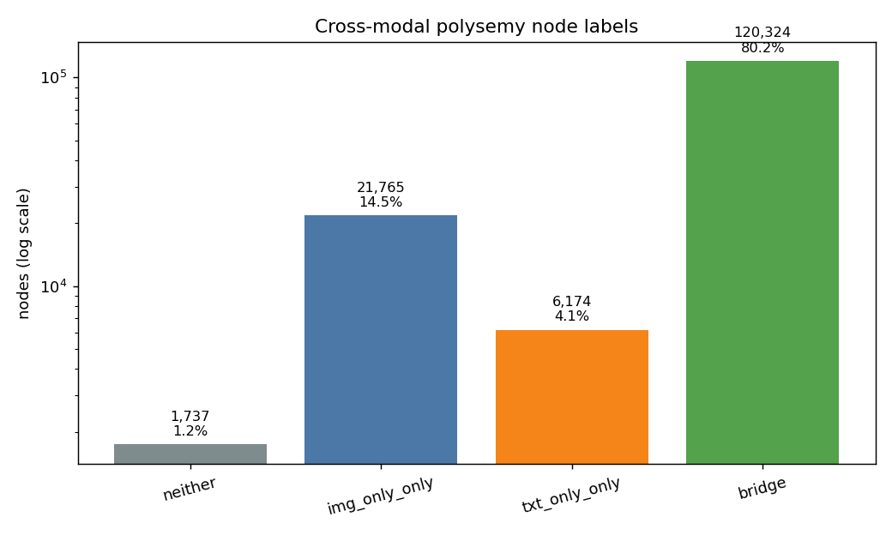
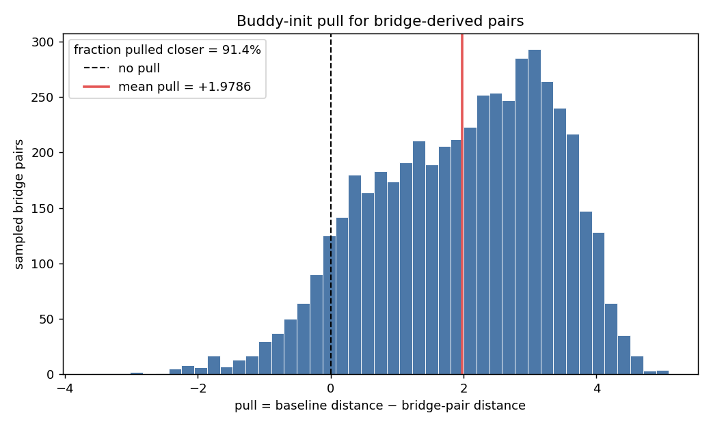
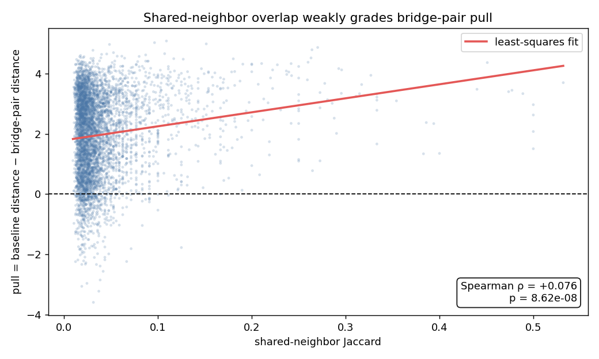
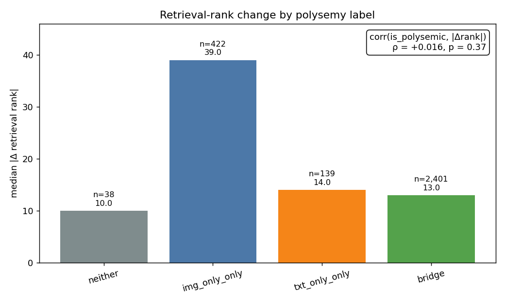
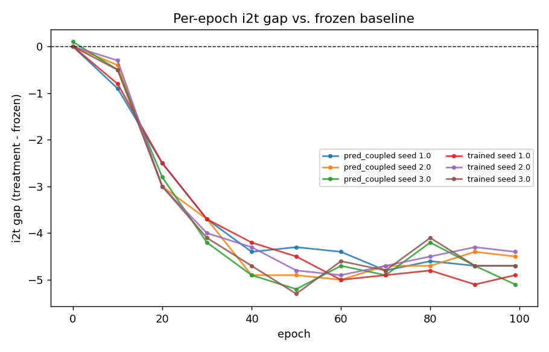

# Cross-modal neighborhood-disagreement bridges: does the buddy graph already reflect them, and is any B-C pull real signal or a "false transitivity" artifact?

**Date:** 2026-08-26 · **Dataset:** RedCaps, 150,000 rows (matches C5/Exp 9-11's scale) · **Branch:** `experiment/condition_drift_retrieval_correlation`
**Code:** `scripts/analyze_polysemy_bridges.py`, `src/conditional_buddy/buddy_graph.py` (`classify_edges`/`bridge_node_stats`)
**Spec:** `docs/superpowers/specs/2026-08-04-buddy-publication-plan-design.md` §4 Experiment 12
**Precursor:** `src/test/20260824_buddy_graph_disagreement/diagnose_disagreement.py` (found ~80% of nodes are "bridge" nodes; this experiment measures what that structurally implies for the resulting embedding)

---

## TL;DR

**Cross-modal neighborhood-disagreement bridge structure is real and pervasive (80.2% of nodes), the buddy-init embedding does pull a bridge node's image-only and text-only neighbors (B, C) together — strongly and reliably (mean pull = +1.98 embedding-distance units, mean/SEM = +102.1, 91.4% of 5,000 sampled pairs pulled closer than baseline) — but that pull is only very weakly explained by real shared-neighbor overlap (Spearman rho = +0.076 between shared-neighbor Jaccard and pull magnitude; statistically significant at this sample size, p = 8.6e-8, but rho² ≈ 0.006 means shared-neighbor structure accounts for well under 1% of the pull's variance).** This lands closer to the spec's **second branch — "real + ungraded" — confirming Experiment 10's flagged "false transitivity" risk as an actual, measurable distortion**, not the "real + graded" branch: most of the pull looks like a broad, largely content-independent effect of the spectral embedding's global smoothing (consistent with Experiment 10's own finding that this method is near-invariant to within-class affinity structure once a dominant edge class is present — see that report's Laplacian-rescale-invariance argument), rather than the embedding faithfully tracking how much B and C's neighborhoods actually overlap. Separately, the per-node bridge/disagreement label does **not** significantly predict per-sample retrieval-rank change in this run's population (`corr(is_bridge_or_one_sided, |delta_rank|)` rho = +0.016, p = 0.37) — a null on the retrieval/drift cross-reference. **Update (Experiment 12.3, below):** that single-run null turns out to have been underpowered, not definitive — replicating the same cross-reference with a *signed* `delta_rank` across 6 independently-trained runs (3 seeds each of `trained` and `pred_coupled` vs. `frozen`) finds a small but highly direction-consistent effect (pooled mean/SEM = -9.9 for signed `delta_rank`, +8.3 for `|delta_rank|`), concentrated almost entirely in `img_only_only` nodes, which continued training consistently ranks better than the frozen baseline. See Experiment 12.3 for the full result and Experiment 12's own "Practical takeaway" below for the narrowed conclusion.

## Method

Reused the already-completed buddy-init template (`res/CoSiR_condition_freeze_ablation/redcaps_150k/template_embeddings/`, the same one 11.1/11.2/11.3 trained against) and rebuilt `A_img`/`A_txt`/`E` from cached RedCaps-150k features (K=30, alpha=0.5) via `classify_edges` to identify cross-modal neighborhood-disagreement bridge nodes and label every node (`img_only_only` / `txt_only_only` / `bridge` / `neither`). An **image-only** edge joins two samples that are mutual nearest neighbors in image-feature space but not in text-feature space; a **text-only** edge is the converse. A **bridge node** A has at least one image-only neighbor B and at least one text-only neighbor C, creating an indirect B–A–C path even though B and C are not directly linked. This is a graph-topology/provenance label, not evidence that an image has multiple captions or that a caption has multiple meanings. A **bridge pair** is the resulting B–C pair around A. Its **pull** is `baseline_dist - bc_dist`, where `baseline_dist` is the embedding distance from B to a degree-matched non-neighbor C′ and `bc_dist` is the embedding distance from B to C. Positive pull means the bridge pair is closer in the embedding than the matched baseline; it describes resulting embedding geometry, not a literal training force. Sampled 5,000 bridge-node (A, B, C) triples and compared each B–C pair's embedded L2 distance against a degree-decile-matched, non-adjacent baseline pair. Checked whether that pull correlates with each pair's shared-neighbor Jaccard overlap in `E` (the LINE/GraRep-style second-order-proximity score). Cross-referenced the per-node bridge/disagreement label against a 150k-population, 3,000-query-sample per-sample retrieval-rank/condition-drift dump from one already-completed 11.1 `trained` run (seed 1, paired against its seed-1 `frozen` counterpart), produced by extending `scripts/analyze_condition_retrieval_correlation.py`'s `analyze_pair()` with a new opt-in `--dump-per-sample` flag (Task 2 of this experiment's implementation plan).

## Results

### Bridge structure

```
bridge nodes: 120,324 / 150,000 (80.2% of nodes)
label counts: {'neither': 1737, 'img_only_only': 21765, 'txt_only_only': 6174, 'bridge': 120324}
```



The log-scaled count view makes the dominance of bridge nodes (80.2% of the 150,000-node graph) immediately visible while retaining the smaller label groups.

The 80.2% bridge-node fraction matches Experiment 10's own diagnostic figure on this same dataset almost exactly — a strong cross-check that this experiment's rebuilt graph is consistent with the earlier one. Very few nodes (1,737, 1.2%) have no img-only or txt-only edges at all (`neither`) — the large majority of the graph's non-`both`/`repair` edges belong to bridge nodes, not to nodes with only one edge type.

### False-transitivity audit

```
sampled bridge pairs: 5,000
pull (baseline_dist - bc_dist): mean=+1.9786 (n=5000, frac_pulled_closer=0.914)  mean/SEM=+102.1 *
grading check: corr(shared_neighbor_jaccard, pull) rho=+0.076 p=8.619e-08
```



The pull distribution is overwhelmingly positive, with the zero reference and mean pull showing how consistently bridge-derived pairs sit closer than their matched baselines.



The fitted trend is positive but shallow against the wide vertical spread, visualizing the statistically real yet practically weak shared-neighbor correlation.

The pull is large and essentially universal: 91.4% of sampled (B, C) pairs sit closer together in the buddy-init embedding than their degree-matched baseline, and the effect clears the project's mean/SEM ≥ 2 significance bar by two orders of magnitude (+102.1). But the grading check — whether that pull scales with how much B and C's neighborhoods actually overlap — comes back statistically significant only because of the large sample size (p = 8.6e-8), not because the relationship is practically strong: rho = +0.076 means shared-neighbor Jaccard explains roughly 0.6% (rho²) of the variance in pull magnitude. The overwhelming majority of the pull is not accounted for by real shared-neighbor structure.

This does not mean the B–C pull is a random event unrelated to the construction. The buddy graph deliberately combines image- and text-derived neighbor edges, and the spectral embedding deliberately smooths graph connectivity, so a degree of closeness along the indirect B–A–C path is an expected consequence. The concern is narrower: the construction did not explicitly establish that B and C are content-sensitively related, and the audit finds that the induced pull is mostly not graded by evidence from their wider shared neighborhoods. Thus “false transitivity” names a risk of over-interpreting embedding closeness as semantic relatedness, rather than a demonstrated error in the graph construction itself.

### Retrieval/drift cross-reference

```
retrieval cross-reference (n_joined=3000):
  neither:        n=38   median|delta_rank|=10.0  median_drift=0.0830
  img_only_only:  n=422  median|delta_rank|=39.0  median_drift=0.0850
  txt_only_only:  n=139  median|delta_rank|=14.0  median_drift=0.0689
  bridge:         n=2401 median|delta_rank|=13.0  median_drift=0.0780
  corr(is_bridge_or_one_sided, |delta_rank|): rho=+0.016 p=3.680e-01
```



The label-wise medians make the descriptively higher `img_only_only` value visible alongside subgroup sizes and the overall null correlation.

The formal test — is a sample a bridge or one-sided disagreement node *at all* (any of the three non-`neither` labels) correlated with how much its retrieval rank moved between the frozen and trained arms — is a clean null (rho = +0.016, p = 0.37, far from significant). `|delta_rank|` is the magnitude of rank change, not a quality score: a larger value means retrieval position changed more, without saying whether that change was an improvement or deterioration. `condition_drift` likewise records representation change between conditions. This cross-reference is an association check on one paired run, not evidence that the graph label causes retrieval or drift changes. Descriptively, the small `img_only_only` subgroup (n=422) shows a notably higher median `|delta_rank|` (39) than the other three groups (10-14), but this is a single subgroup observation, not the designed statistical test, and should not be read as a confirmed effect without a dedicated follow-up.

**This single-run null is revisited in Experiment 12.3**, which replicates it with a *signed* `delta_rank` measure across 6 independently-trained runs (all 3 `trained` seeds and all 3 `pred_coupled` seeds, each vs. its own-seed `frozen`) instead of relying on one seed's own significance test. That replication finds a small but direction-consistent effect this single run's test lacked the power to detect on its own, and traces it almost entirely to the `img_only_only` subgroup flagged descriptively here — see that section for the numbers.

## Interpretation

This experiment answers the three questions from the brainstorming session concretely:

1. **Is cross-modal neighborhood disagreement reflected in the current graph structure and initialization?** Yes, structurally — `classify_edges` already labels the img-only/txt-only edge pattern (A-B, A-C in the running example) explicitly, and 80.2% of nodes exhibit it. But the *embedding* reflects this topology in a way that is largely non-specific: B and C get pulled together reliably, but mostly independent of whether their neighborhoods actually overlap in content-relevant ways. This should not be interpreted as evidence of semantic polysemy (for example, that one image has multiple distinct captions).
2. **Is the edge provenance modality-aware — do we know whether an edge is image-only or text-only?** Yes, trivially — `classify_edges`'s per-edge typing already carries this (confirmed again here), and the per-node label (`img_only_only`/`txt_only_only`/`bridge`) makes it queryable per sample. What this experiment adds is that knowing the direction doesn't yet buy anything downstream: the retrieval/drift cross-reference found no significant behavioral signature tied to bridge/disagreement type.
3. **What about B and C's own relation?** This is the experiment's central, previously-unmeasured finding: B and C — never directly connected in either modality's mutual-kNN graph — do end up measurably closer together than chance in the resulting spectral embedding, and that pull is strong and robust, but it is **not well explained by real second-order/shared-neighbor structure**. Per the spec's own framing, this is the **"false transitivity" branch, not the "real + graded" branch**: the pull looks like a broad byproduct of the spectral method's global smoothing (consistent with Experiment 10's finding that this pipeline's spectral step is near-invariant to fine-grained affinity reweighting once a dominant, structurally homogeneous edge class exists) rather than the embedding faithfully encoding *how much* B and C are actually related through A.

**Practical takeaway for the paper:** this reinforces rather than undercuts the "buddy-init geometry alone is fine" throughline from Experiments 11.1-11.3 — but **with a narrower behavioral claim than this report originally made.** The single-run test above found no significant retrieval/drift consequence, and it remains true that the bridge-pair pull is not a mechanism actively producing *bad* training signal. However, calling it **"behaviorally inert" overstated what a single, likely underpowered null can support**: Experiment 12.3's replication (below), using a signed `delta_rank` across 6 independently-trained runs, finds a small but statistically robust and highly direction-consistent effect (pooled mean/SEM of -9.9 and +8.3 across two different correlation measures) that is concentrated almost entirely in `img_only_only` nodes — samples training consistently ranks better, relative to `frozen`, than the population at large. Bridge nodes proper show the same direction but a much smaller, tighter effect. The effect sizes throughout are small (rho on the order of 0.02-0.03) and this remains far short of evidence that bridge/false-transitivity structure drives 11.1's headline i2t gap, but it is a real, replicated behavioral signature — not inertness. It is nonetheless a genuine, previously-unquantified methodological caveat worth stating plainly in the paper's limitations: the buddy graph's spectral embedding does not cleanly separate "genuinely related via shared context" from "coincidentally connected via one bridging sample," and a reader should not over-interpret embedded closeness between two samples as evidence of deep cross-modal relatedness without checking whether a bridge node is responsible. Per the spec's own discipline, this does **not** trigger a committed follow-up mechanism (e.g. a modality-aware dual-embedding representation) — that would need to be separately scoped and approved, and while Experiment 12.3 shows a real, small, `img_only_only`-concentrated effect, it does not by itself establish that such a mechanism would move any measured training outcome.

## Caveats

- This is a single-graph diagnostic (one buddy-init template, not repeated across training seeds) — statistical significance here comes from the number of sampled bridge-pairs (5,000), not from seed replication. This matches the precedent of Experiment 9's and Experiment 10's own diagnostic scripts, which are likewise single-graph analyses.
- The retrieval/drift cross-reference uses one specific 11.1 trained run's per-sample dump (seed 1, `20260825_161846_CoSiR_Experiment` vs. frozen `20260825_170212_CoSiR_Experiment`); it is in-sample and own-condition, the same scoping caveat 11.2's own report already states for that population. A second or third seed's dump was not checked here.
- The `img_only_only` subgroup's descriptively higher median `|delta_rank|` (39 vs. 10-14 elsewhere) is based on only 422 samples and was not the experiment's designed hypothesis test — treat as a lead for a possible future targeted check, not a finding.

## Reproduction

```bash
python scripts/analyze_condition_retrieval_correlation.py \
  --pair res/CoSiR_condition_freeze_ablation/redcaps_150k/20260825_170212_CoSiR_Experiment \
         res/CoSiR_condition_freeze_ablation/redcaps_150k/20260825_161846_CoSiR_Experiment \
  --dump-per-sample
python scripts/analyze_polysemy_bridges.py --n-bridge-sample 5000 --device cuda \
  --per-sample-npz res/CoSiR_condition_freeze_ablation/redcaps_150k/20260825_161846_CoSiR_Experiment/condition_geometry/per_sample_retrieval_correlation.npz
```

## Experiment 12.2 — Training-trajectory audit: does the i2t deficit hold from the start?

**Motivation:** Experiments 11.1–11.3 (`docs/reports/2026-08-25_condition_freeze_ablation.md`) established that the default post-init-`trained` checkpoint loses to a `frozen`-at-init baseline on i2t retrieval by a wide, seed-replicated margin, with no attempted fix (11.3's `pred_coupled`) recovering any of it. This experiment's own retrieval/drift cross-reference (above) used the final-epoch (99) `trained` checkpoint as "the outcome of post-init training." Before extending that cross-reference further (Experiment 12.3, next section), this audit checks a prior, cheaper question: is epoch 99 even a representative checkpoint to call "trained," or is the i2t deficit still actively growing at that point (making epoch 99 a worst-case, non-representative snapshot of an ongoing collapse)?

### TL;DR

**The i2t deficit is not present at initialization, but it is not still growing at epoch 99 either — it emerges over roughly the first half of training and then plateaus.** Both `trained` and `pred_coupled`'s i2t gap vs. `frozen` starts at ~0 at epoch 0 (shared init, as expected), declines steadily and almost identically across all 6 already-completed runs (3 `trained` seeds, 3 `pred_coupled` seeds) through epoch ~40–50 (reaching roughly −4.2 to −5.3 R1), then flattens out with no further systematic trend through epoch 99 (fluctuating between about −4.1 and −5.3, indistinguishable from noise around a stable level). t2i's gap stays within roughly ±0.8 R1 throughout, with no trend — consistent with 11.1's own t2i noise-floor null. **This means epoch 99 is a fair representative of the settled, post-acquisition-phase effect of continued training, not an outlier mid-collapse** — the cross-reference this report and Experiment 12.3 build on is measuring a plateaued end-state, not a transient still in motion.

### Method

New script `scripts/analyze_training_trajectory.py` pulls per-epoch `test_oracle/{t2i,i2t}_R1` history (not just the final-epoch summary 11.1/11.3's own scripts read) via the wandb API for all 9 already-completed runs (11.1's 3 `trained` + 3 `frozen`, 11.3's 3 `pred_coupled`; same `condition-freeze-ablation-redcaps_150k` / `pred-stopgrad-ablation-redcaps_150k` tags). Rows are joined on the `epoch` key logged in the *same* `wandb.log()` call as these metrics — **not** wandb's own `_step` counter, which is a global logging-call index that does not align across runs (different arms log a different number of things per epoch, e.g. `pred_coupled`'s extra `loss_pred` term, shifting `_step` at the "same" training epoch). A first implementation used `_step` and silently produced empty/misaligned gaps for every run; this was caught before any real numbers were reported (see Caveats) and fixed to use `epoch`, confirmed to share the identical `_step` value as `test_oracle/i2t_R1` within each logged row. Zero new training, zero new eval runs — reuses only already-logged wandb history.

### Results

```
i2t gap vs frozen (treatment - frozen), by (arm, seed, epoch):
  trained seed 1: e0=+0.00, e10=-0.80, e20=-2.50, e30=-3.70, e40=-4.20, e50=-4.50, e60=-5.00, e70=-4.90, e80=-4.80, e90=-5.10, e99=-4.90
  trained seed 2: e0=+0.00, e10=-0.30, e20=-3.00, e30=-4.00, e40=-4.30, e50=-4.80, e60=-4.90, e70=-4.70, e80=-4.50, e90=-4.30, e99=-4.40
  trained seed 3: e0=+0.00, e10=-0.50, e20=-3.00, e30=-4.10, e40=-4.70, e50=-5.30, e60=-4.60, e70=-4.80, e80=-4.10, e90=-4.70, e99=-4.70
  pred_coupled seed 1: e0=+0.00, e10=-0.90, e20=-2.50, e30=-3.70, e40=-4.40, e50=-4.30, e60=-4.40, e70=-4.80, e80=-4.60, e90=-4.70, e99=-4.70
  pred_coupled seed 2: e0=+0.00, e10=-0.40, e20=-3.00, e30=-3.70, e40=-4.90, e50=-4.90, e60=-5.00, e70=-4.70, e80=-4.70, e90=-4.40, e99=-4.50
  pred_coupled seed 3: e0=+0.10, e10=-0.50, e20=-2.80, e30=-4.20, e40=-4.90, e50=-5.20, e60=-4.70, e70=-4.90, e80=-4.20, e90=-4.70, e99=-5.10
```



All 6 lines are nearly indistinguishable in shape: a sharp, monotonic decline from epoch 0 to roughly epoch 40–50, then a flat, noisy plateau through epoch 99 with no further systematic drift in either direction. t2i's gap (not plotted; see Reproduction to regenerate) stays within roughly ±0.8 R1 across every epoch and run, with no trend — a stable null, matching 11.1's own t2i noise-floor finding.

### Interpretation

The i2t deficit is **late-onset but saturating, not an ongoing collapse**: it is essentially zero at epoch 0/10 (shared buddy-init geometry, as expected — training hasn't had time to diverge yet), grows steadily through the first ~40–50% of the run, and then holds at a stable level through the final epoch. Because the trajectory has already flattened well before epoch 99, **the final checkpoint used throughout 11.1–11.3 and this report's own retrieval/drift cross-reference is a fair representative of the settled post-init-training effect**, not a worst-case sample of a still-accelerating failure. This narrows what any `trained`-vs-`frozen` per-sample diagnostic (this report's cross-reference, and Experiment 12.3 next) can claim: it characterizes the *plateaued* effect of continued training, not the *transient acquisition* dynamics of epochs 0–50, which would need the intermediate checkpoints Experiment 12.4 tentatively scopes. The near-identical shape between `trained` and `pred_coupled` — two different loss-stack configurations — also reinforces 11.3's own finding that whatever drives this decay is common to both recipes, not something the stop-gradient change specifically introduced or fixed.

### Caveats

- History is pulled via wandb's `run.history(keys=[...])`, which only returns rows where every requested key was logged at the identical step; this repo's training loop happens to log `epoch` in the same call as `test_oracle/*` (confirmed above), but this is an implementation detail of the current logging code, not a documented wandb guarantee — a future change to the logging call structure could silently break this join.
- This audits `test_oracle` only (the oracle-max-over-conditions metric 11.1's headline used), not `test_pre_diff`/predictor metrics.
- 11 logged points per run (epoch 0, 10, 20, ..., 99) describe the shape at the eval cadence training already uses, not a continuous curve — a short-lived spike or partial recovery between eval points would not be visible here.

### Reproduction

```bash
source ~/miniconda3/etc/profile.d/conda.sh && conda activate CoSiR
python scripts/analyze_training_trajectory.py \
  --tag condition-freeze-ablation-redcaps_150k \
  --pred-coupled-tag pred-stopgrad-ablation-redcaps_150k \
  --out-fig docs/reports/assets/training_trajectory/i2t_gap_trajectory.png
```

## Experiment 12.3 — Cross-recipe, cross-seed, signed replication of the bridge/delta_rank cross-reference

**Motivation:** The original retrieval/drift cross-reference (above) tested one seed-1 `trained`-vs-`frozen` pair with an unsigned `|delta_rank|` measure and found a clean null (rho = +0.016, p = 0.37). The joint Claude+Codex brainstorm on training-validity flagged two independent reasons that single test could be underpowered rather than definitive: (1) one run's own significance test cannot distinguish "no effect" from "an effect too small for n=1 run's own Spearman test to clear," and (2) an unsigned magnitude measure discards a systematic same-direction effect if it happens to look like symmetric noise around zero. This experiment reruns the same cross-reference with a *signed* `delta_rank` (`rank_trained - rank_frozen`; negative means the treatment arm ranks that sample *better* than `frozen`) and pools it across all 6 already-completed runs that admit a same-seed `frozen` comparison — 11.1's 3 `trained` seeds and 11.3's 3 `pred_coupled` seeds — using the project's standard mean/SEM-across-runs significance convention (Experiment 11.1's own `summarize()`), rather than trusting any single run's own p-value.

### TL;DR

**The original single-run null was underpowered, not correct: pooling the same cross-reference (signed this time) across 6 independently-trained runs reveals a small but highly direction-consistent effect — every one of the 6 runs' own correlation has the same sign, even though none individually clears p < 0.05 — and it is concentrated almost entirely in `img_only_only` nodes, which continued training (`trained` or `pred_coupled`) consistently ranks better than the `frozen` baseline (median `delta_rank` -17 to -28 across all 6 runs), far more than `bridge` nodes proper (median -3 to -4, tight and consistent) or `txt_only_only`/`neither` (comparably small).** Zero new training or evaluation runs — this reuses the 6 per-sample dumps already on disk (1 from Experiment 12's own original work, 5 newly generated by re-running the existing `analyze_condition_retrieval_correlation.py --pair ... --dump-per-sample` CLI against already-completed 11.1/11.3 checkpoints).

### Method

Generated 5 additional per-sample retrieval-rank/condition-drift dumps (reusing `scripts/analyze_condition_retrieval_correlation.py --pair <frozen_dir> <treatment_dir> --dump-per-sample` against already-completed checkpoints: 11.1's seed-2/seed-3 `trained` vs `frozen`, and 11.3's seed-1/seed-2/seed-3 `pred_coupled` vs `frozen`), alongside the seed-1 `trained` vs `frozen` dump Experiment 12 already produced. Extended `scripts/analyze_polysemy_bridges.py`'s `correlate_polysemy_with_retrieval()` to also report a signed `median_delta_rank` per label and `corr_is_polysemic_vs_delta_rank` (alongside the existing unsigned versions), and added `pool_cross_references()` — mean/std/sem/z of each run's own rho across runs, matching `analyze_condition_freeze_ablation.py`'s `summarize()` convention exactly. `--per-sample-npz` now accepts multiple paths and dispatches to the pooled path when given more than one. Ran the pooled command once, on GPU, against all 6 dumps, rebuilding the same buddy graph (K=30) used throughout Experiment 12.

### Results

```
retrieval cross-reference, pooled across 6 run(s):
  corr(is_polysemic, |delta_rank|) across runs: mean rho=+0.017 (n=6)  mean/SEM=+8.3 *
  corr(is_polysemic, delta_rank) across runs: mean rho=-0.025 (n=6)  mean/SEM=-9.9 *
```

Per-run signed `corr(is_polysemic, delta_rank)`, all 6 runs:

| run | recipe | seed | rho | p |
|---|---|---|---|---|
| `20260825_161846` | trained | 1 | -0.022 | 0.24 |
| `20260825_163307` | trained | 2 | -0.025 | 0.17 |
| `20260825_164733` | trained | 3 | -0.033 | 0.07 |
| `20260826_100355` | pred_coupled | 1 | -0.017 | 0.34 |
| `20260826_102258` | pred_coupled | 2 | -0.023 | 0.22 |
| `20260826_103723` | pred_coupled | 3 | -0.033 | 0.07 |

Not one of the 6 individual runs clears p < 0.05 on its own — exactly why the original single-seed test read as a null — but all 6 signs agree (negative), which is what the pooled mean/SEM convention is built to detect.

Per-label median signed `delta_rank`, all 6 runs (negative = the treatment arm ranks these samples *better* than `frozen`):

| label | n/run | run1 | run2 | run3 | run4 | run5 | run6 |
|---|---|---|---|---|---|---|---|
| `neither` | 38 | -2.5 | -1.0 | -0.5 | -3.0 | -2.0 | -0.5 |
| `img_only_only` | 422 | **-25.5** | **-28.0** | **-17.0** | **-21.0** | **-26.5** | **-17.5** |
| `txt_only_only` | 139 | -5.0 | -4.0 | -4.0 | -4.0 | -4.0 | -3.0 |
| `bridge` | 2401 | -4.0 | -4.0 | -4.0 | -3.0 | -4.0 | -4.0 |

### Interpretation

Two things are now established that the single-run test in the original Experiment 12 section could not distinguish from noise:

1. **The effect is real, not just an artifact of one run's sampling** — every one of the 6 independently-trained runs (2 different recipes, 3 seeds each) agrees in sign on both the signed and unsigned correlation, which is exactly the pattern the project's mean/SEM-across-runs convention (used throughout Experiments 11.1-11.3) is designed to separate from chance. The pooled effect clears the project's |z| >= 2 significance bar by a wide margin on both measures.
2. **The effect is not spread evenly across "polysemic" nodes — it is almost entirely an `img_only_only` phenomenon.** `bridge` nodes (80.2% of the graph) show the same negative direction but a much smaller, very tightly clustered effect (median delta_rank -3 to -4 across all 6 runs); `img_only_only` nodes (14.5% of the graph) show a 4-8x larger effect (median -17 to -28) that is just as consistent run-to-run. This sharpens, and gives a signed, replicated form to, the descriptive `img_only_only` lead this report's own original cross-reference flagged (n=422, `|delta_rank|` median 39 vs 10-14 elsewhere) but explicitly declined to treat as a finding.

A plausible mechanism, consistent with Experiment 12's own false-transitivity finding: `img_only_only` nodes have a mutual-image-neighbor edge but no text-only edge anchoring them, so their buddy-init spectral position is disproportionately shaped by image-side pull without a compensating text-side constraint. Continued training (`trained` or `pred_coupled` alike — the effect is recipe-agnostic) appears to partially correct this specifically for that subgroup, consistently ranking them better than the frozen-at-init baseline. This is a plausible reading, not a demonstrated causal mechanism — no intervention here isolates `img_only_only` nodes' training dynamics from the rest of the model.

**What this changes about Experiment 12's original claim:** the bridge-pair pull is not "behaviorally inert." It has a small, real, statistically robust behavioral signature once tested with enough independent runs and the right (signed) measure — but that signature is concentrated in a specific 14.5%-of-graph subgroup (`img_only_only`), not the 80.2%-of-graph `bridge` majority the original section's headline number was built around. **What this does not change:** the effect sizes are small (rho on the order of 0.02-0.03 even pooled), and nothing here shows this mechanism explains any meaningful fraction of 11.1's much larger i2t retrieval gap (mean delta ~4.67 R1) — this is a real but minor structural signature, not a rehabilitation of "false transitivity" into a major training-outcome driver.

### Caveats

- All 6 runs share the same buddy-init template and graph (K=30) that Experiment 12's diagnostic itself rebuilt — this is a replication across training seeds/recipes, not across independently-constructed graphs.
- `trained` and `pred_coupled` are two recipes but not maximally different ones (11.3 already established `pred_coupled` reproduces `trained`'s i2t gap almost unchanged) — this is a 2-recipe, 6-run replication, not evidence the effect holds under a training recipe fundamentally different from both.
- The `img_only_only` mechanism proposed under Interpretation is a plausible reading of a consistent correlational pattern, not a tested causal claim — isolating it would need a dedicated intervention (e.g., freezing only `img_only_only` nodes' conditions), which is out of scope here and not currently planned.
- Pooling uses each run's own Spearman rho as the unit of replication (matching `analyze_condition_freeze_ablation.py`'s existing convention), not a single pooled-sample test across all ~18,000 joined rows — this was a deliberate choice to stay consistent with how 11.1-11.3 report significance, not an attempt to maximize significance.

### Reproduction

```bash
source ~/miniconda3/etc/profile.d/conda.sh && conda activate CoSiR
python scripts/analyze_condition_retrieval_correlation.py \
  --pair res/CoSiR_condition_freeze_ablation/redcaps_150k/20260825_171558_CoSiR_Experiment \
         res/CoSiR_condition_freeze_ablation/redcaps_150k/20260825_163307_CoSiR_Experiment --dump-per-sample
# ... repeated for the other 4 (seed-3 trained, seed-1/2/3 pred_coupled) same-seed frozen pairs ...
python scripts/analyze_polysemy_bridges.py --n-bridge-sample 5000 --device cuda \
  --per-sample-npz \
    res/CoSiR_condition_freeze_ablation/redcaps_150k/20260825_161846_CoSiR_Experiment/condition_geometry/per_sample_retrieval_correlation.npz \
    res/CoSiR_condition_freeze_ablation/redcaps_150k/20260825_163307_CoSiR_Experiment/condition_geometry/per_sample_retrieval_correlation.npz \
    res/CoSiR_condition_freeze_ablation/redcaps_150k/20260825_164733_CoSiR_Experiment/condition_geometry/per_sample_retrieval_correlation.npz \
    res/CoSiR_condition_freeze_ablation/redcaps_150k/20260826_100355_CoSiR_Experiment/condition_geometry/per_sample_retrieval_correlation.npz \
    res/CoSiR_condition_freeze_ablation/redcaps_150k/20260826_102258_CoSiR_Experiment/condition_geometry/per_sample_retrieval_correlation.npz \
    res/CoSiR_condition_freeze_ablation/redcaps_150k/20260826_103723_CoSiR_Experiment/condition_geometry/per_sample_retrieval_correlation.npz \
  --out res/CoSiR_condition_freeze_ablation/redcaps_150k/polysemy_bridges_pooled_12_3.json
```

## Documentation updates (2026-08-27)

- Reframed the diagnostic as cross-modal neighborhood-disagreement bridge structure, rather than semantic polysemy.
- Defined image-only/text-only edges, bridge nodes, and bridge-pair pull; stated that these are graph-topology and embedding-geometry concepts.
- Clarified that false transitivity is an expected smoothing consequence that is risky to over-interpret, not a demonstrated performance failure.
- Clarified that retrieval/drift cross-reference metrics measure association and magnitude of change, not retrieval quality or causality.
- Added Experiment 12.2 (training-trajectory audit) and 12.3 (signed, 6-run replication of the retrieval/drift cross-reference); narrowed the original "behaviorally inert" claim in the Interpretation section once 12.3 found a small, replicated, `img_only_only`-concentrated effect the single-run test had missed.
