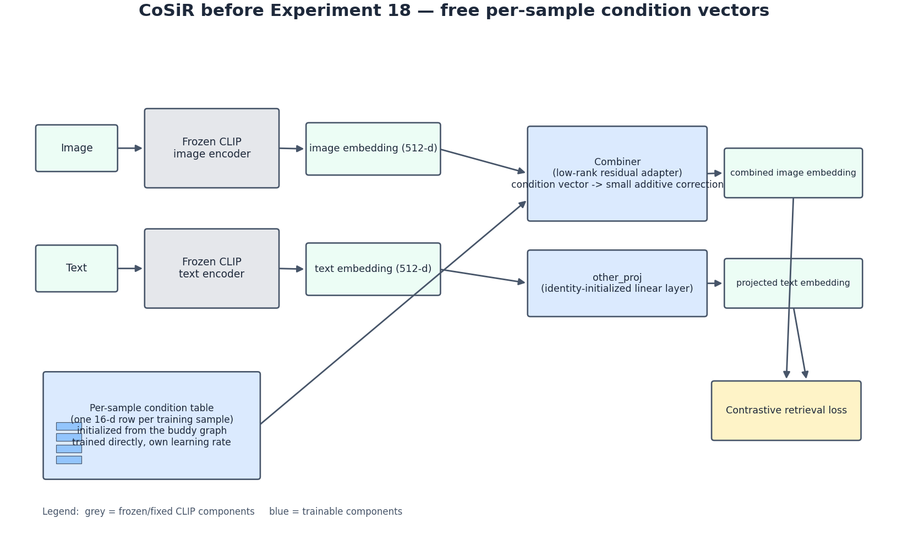
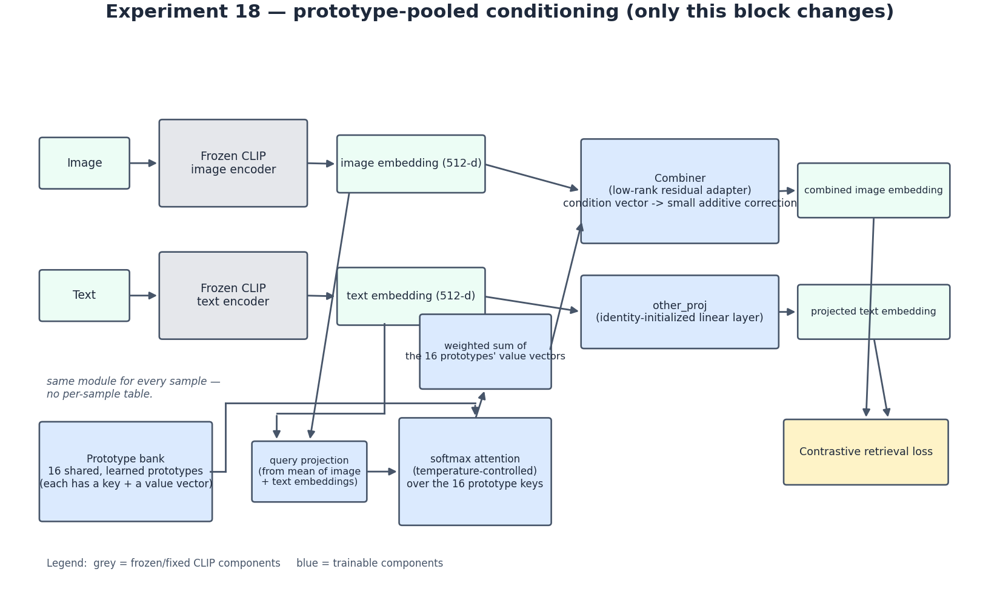

# Experiment 18 stage report: prototype-pooled conditioning

## I. Where we left off (~2026-07-16)

CoSiR extends a **frozen** pretrained CLIP model: its image and text encoders are never fine-tuned, while a small trainable **condition vector** per training sample is fed to a trainable **combiner** that nudges one CLIP embedding before the usual contrastive retrieval loss, aiming to improve retrieval over raw CLIP while remaining close to CLIP's original embedding space. Each condition vector starts from the **buddy graph**, which connects samples that are mutual nearest-neighbors in CLIP's image space, text space, or both, so samples CLIP already considers close begin with similar conditions rather than random ones. The buddy-graph idea and its validation are the established starting point here.

## II. Two months of hardening the foundation (mid-July → early Sept)

The intervening work strengthened the basis for the next architectural change without changing the buddy-graph construction used by Experiment 18. It confirmed that the structure is not a peculiarity of one CLIP checkpoint, made buddy-based initialization the standing default, and selected a lighter combiner for Experiment 18. One configuration finding remains open: `K` needs to scale with dataset size, but the config defaults had not yet been updated as of this report.

| Milestone | One-line takeaway |
|---|---|
| Cross-encoder buddy-graph check | Buddy structure holds across 16 different vision/text encoder pairs — not a CLIP-specific fluke. |
| Buddy-init vs. generic init | Buddy-graph initialization wins on RedCaps, with a larger positive retrieval effect at 300k samples than 150k, and becomes the standing default (`initialization_strategy=buddies`); neither initialization beats plain, unconditioned CLIP retrieval outright at this scale. |
| Robustness/diagnostic ablations | Graph-edge, encoder-pair, indirect-relation, and per-subreddit checks confirmed the construction was sound; none changed the architecture. |
| Neighborhood-size (`K`) scaling | Fixed `K=30` is measurably suboptimal at 500,000 samples; predicted `K≈39` produced an image-to-text Recall@1 win of +0.97. This is still open and not yet adopted in configs. |
| Combiner redesign | A rank-16 low-rank residual adapter beat the older two-MLP-tower combiner, including by an even larger margin at 500k samples and 100 epochs; it is selected for Experiment 18, not yet a global default everywhere. |

Conditioning remains deliberately asymmetric: by the standing default, `combine_side="img"`, the condition is fused only into the image embedding, while text goes through a separate identity-initialized `other_proj` layer that can adjust slightly during training. A parallel, not-yet-merged line of work found evidence that this one-sidedness may be responsible for a retrieval asymmetry between image→text and text→image, but that is a forward-pointer rather than a resolved fact.

## III. Architecture snapshot immediately before Experiment 18

Immediately before Experiment 18, frozen CLIP encoded image and text separately. A large lookup table held one trainable condition vector per training sample; each 16-dimensional row was initialized from the buddy graph and then trained directly at its own, much larger learning rate. The image embedding and that sample's condition entered the low-rank residual combiner, while the text embedding passed through identity-initialized `other_proj`; the resulting embeddings were trained with a contrastive retrieval loss.

The per-sample table has no shared structure across samples: every row is independent, so there is no natural way to ask what a condition means in general, or to explain why two samples receive different treatment beyond pointing to the combiner/adapter math itself. It also cannot produce a condition vector for a brand-new, never-seen sample without a separately trained `condition_predictor` side network to approximate the table. Experiment 18 therefore tests a structured, inherently generalizable replacement.

## IV. Experiment 18: prototype-pooled conditioning

### Idea

Experiment 18 replaces the giant independent lookup table with a small, shared bank of 16 learnable **prototype** vectors: a small set of learned archetypes. Each sample's condition becomes a soft, weighted blend of those 16 shared prototypes, computed fresh from the sample's own CLIP feature rather than looked up from a table. The design goal is twofold: with 16 shared archetypes rather than one row per sample, the condition space should naturally organize into interpretable clusters; and, because the condition is a function of the sample's own features, it automatically works for new, unseen samples without a separate predictor network.

### Implementation

Each of the 16 prototypes has a learned key and a learned value vector. For a sample, its CLIP feature is projected into a **query**; the query is compared with all 16 keys to produce 16 similarity scores; a **temperature-controlled softmax** converts those scores to attention weights that sum to 1; and the condition vector is the attention-weighted sum of the 16 prototypes' value vectors. Everything downstream—the low-rank combiner, `other_proj`, and retrieval loss—is completely unchanged from the preceding architecture; only the condition-vector source changes.

### Key results — first pass, default settings, 3 random seeds, RedCaps-150k

Retrieval was roughly on par with the previous lookup-table design: there was no clear win or loss in either retrieval direction, and both designs sat slightly below plain, unconditioned CLIP retrieval at this data scale. That is consistent with an already-known pattern at this scale, not a new surprise.

Interpretability, the point of the redesign, failed outright. In all 3 seeds, the learned condition space collapsed to essentially 1 effective dimension out of 16, leaving practically every sample with nearly the same condition vector. Cluster quality was weak and inconsistent (silhouette scores of 0.12, 0.31, and −0.13; one seed was worse than random grouping), while the two proxy-property probes were null or unstable and clearly worse than the old per-sample table, which reliably encoded both.

One side-finding explains why the original health check did not catch this: **usage entropy** looked reassuring, with fairly spread-out attention, even during collapse. On 88–99.5% of all 150,000 samples, however, the single strongest prototype match was the same one or two prototypes; because the softmax stayed close to uniform everywhere, the final blended output was nearly identical for nearly every sample. A spread-out-attention metric and diverse final output are not the same thing, and the project's monitoring did not initially check the latter directly.

### Root-cause fix

The prototype bank's own parameters were quietly trained 1,000× slower than the old per-sample table—a gap in optimizer configuration, not a fundamental flaw in the idea. Giving the bank its own correctly scaled learning rate, along with a tunable initial sharpness (starting temperature) for attention, produced a clear monotonic trend in a quick single-seed sweep: as the prototype-bank learning rate increased, collapse broke up, entropy sharpened, attention concentration spread across more prototypes, and silhouette roughly quadrupled.

### Key results — best setting found, 3-seed confirmation, RedCaps-150k

The best setting showed real, seed-consistent interpretability gains. Silhouette moved from inconsistent, near-zero-or-negative values (0.12, 0.31, −0.13) to consistently positive, substantially higher values (0.55, 0.56, 0.70) across the 3 confirmation seeds, and the condition space broke out of its one-dimensional collapse. For the first time in this investigation, one proxy property—`register`—was recoverable from condition space in 2 of 3 seeds. The other proxy property, `warmth`, moved the other way: it had been weakly recoverable in 1 of 3 seeds in the original pass, and that signal disappeared entirely at this setting (0 of 3 seeds) — a real, if smaller, regression alongside `register`'s gain.

The cost was serious and replicated: image-to-text Recall@1 fell to a mean of about 10.4, versus about 16.8 for the original (uncollapsed-fix) prototype design and about 17.8 for no conditioning at all (plain CLIP). At this operating point, conditioning is actively worse than no conditioning on that retrieval direction. Text-to-image retrieval was unaffected either way, and the image-to-text gap was tight and consistent across all 3 seeds rather than seed noise.

This is a genuine, real, seed-replicated *trade-off*, not a finished fix. It proves that the learning-rate diagnosis was real and that the interpretability problem is fixable in principle, but this operating point is not yet usable as a replacement for the old design. A smaller learning-rate value or a different training mechanism entirely remains an open decision.

## V. Glossary

**Condition vector / conditioning.** The small trainable vector attached to each sample that steers its embedding. Conditioning is the use of that vector to make the corresponding embedding adjustment.

**Combiner (low-rank residual adapter).** The small module that turns a condition vector into a small additive correction to a CLIP embedding. It starts at exactly zero correction before training.

**`other_proj`.** The small linear layer applied to the side of the pair the condition vector does not touch. It starts as an exact identity function.

**Prototype bank / attention pooling.** The Experiment 18 mechanism: a small set of shared learned vectors, or prototypes, combined per sample through softmax attention rather than retrieved from a per-sample lookup table. Each prototype has a learned key and value.

**Oracle retrieval (Recall@1/5/10).** Retrieval accuracy measured by giving the model the best-available condition vector for each query: the project's standard way to ask how good retrieval could be with conditioning. It should always be compared with raw retrieval—plain, unconditioned CLIP—as the reference floor, reporting whether a design beats that floor rather than only whether it beats another conditioned design.

**`warmth` / `register`.** Two proxy groupings of RedCaps subreddits used to test whether condition space separates meaningfully different kinds of photos. `warmth` contrasts companion-animal/cute-pet subreddits (cats, puppies, guinea pigs, ...) with curiosity-framed subreddits (mildlyinteresting, interestingasfuck, ...); `register` contrasts polished/professional photography subreddits (earthporn, foodporn, carporn) with casual-snapshot subreddits (mildlyinteresting, itookapicture). A dedicated audit found that `warmth` is mostly explained by plain photo content (animal versus not), not confirmed emotional tone, and that `register` carries very little signal beyond content either; both are probes of whether condition space separates these subreddit groups, not validated measures of emotion or writing formality.

**Probe selectivity.** A simple classifier is trained to guess a sample's `warmth` or `register` group from only its condition vector; selectivity is its real accuracy minus its accuracy on randomly shuffled labels, a control. Meaningfully positive selectivity means the condition space encodes that distinction, while near-zero means it does not.

**Effective dimensions (95% variance).** The number of independent directions needed to explain 95% of the spread across condition vectors. Near the full width—16 here—means the space uses its capacity in varied ways; collapse to 1 means nearly every vector differs only along one shared direction.

**Silhouette score.** A standard clustering-quality number: positive and high means clean, well-separated groups, while near zero or negative means no real cluster structure. Negative values can be worse than random grouping.

**Usage entropy vs. concentration.** Usage entropy measures how spread out each sample's soft attention is over the 16 prototypes, and was this design's original built-in health metric. It does not measure whether the *final output vector* varies across samples; that diagnostic gap was the key addition prompted by the Section IV side-finding.

## VI. Where it stands / what's next

This is an honest, real, open trade-off, not a finished result. The redesign's interpretability goal shows genuine seed-replicated progress at the best setting found so far, but that same setting currently makes image-to-text retrieval meaningfully worse than no conditioning at all. Next work could try a smaller prototype-bank learning rate—where weaker interpretability gains appeared but retrieval cost was not checked—build a direct training signal for different condition outputs or against collapse onto one or two prototypes, or record this result and move on. No decision has been made; the result is presented to the team for input.
