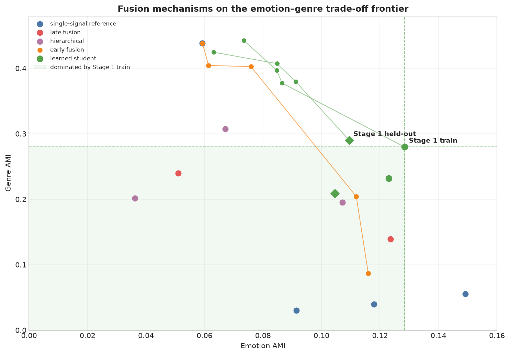
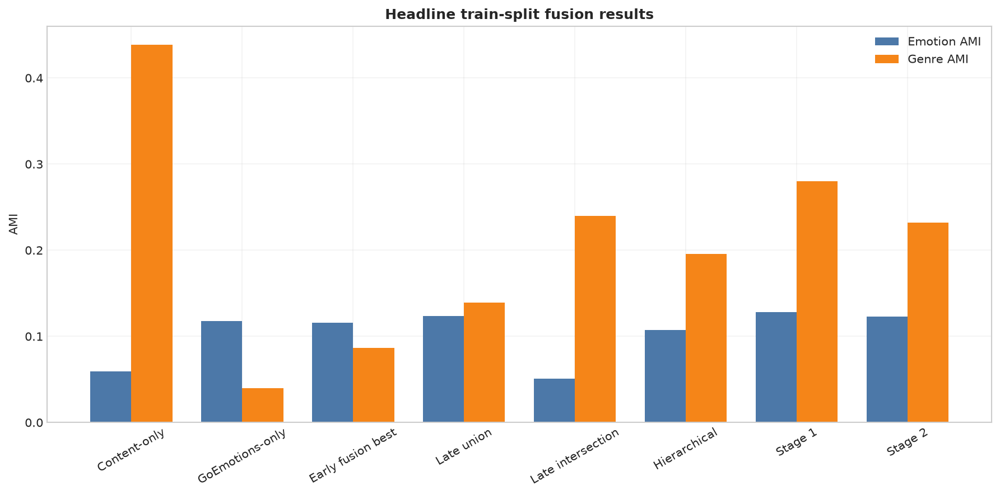
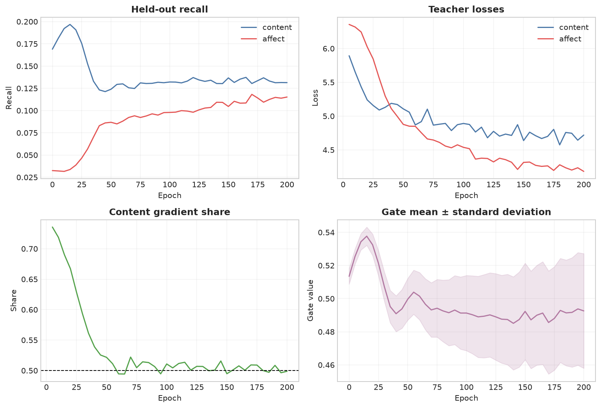
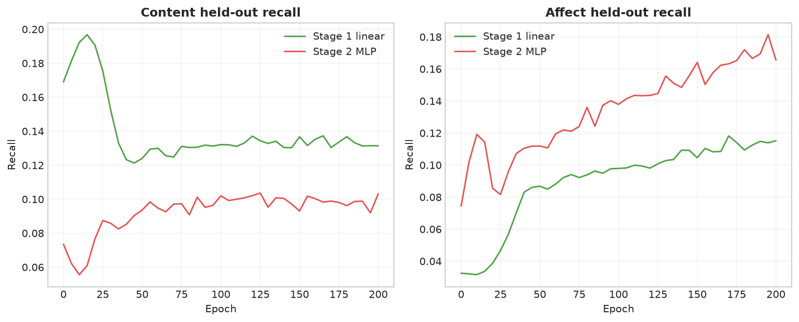
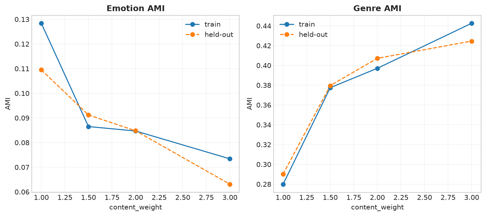
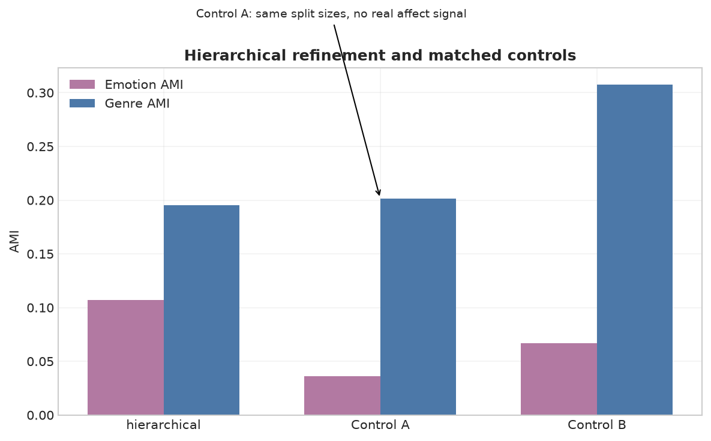
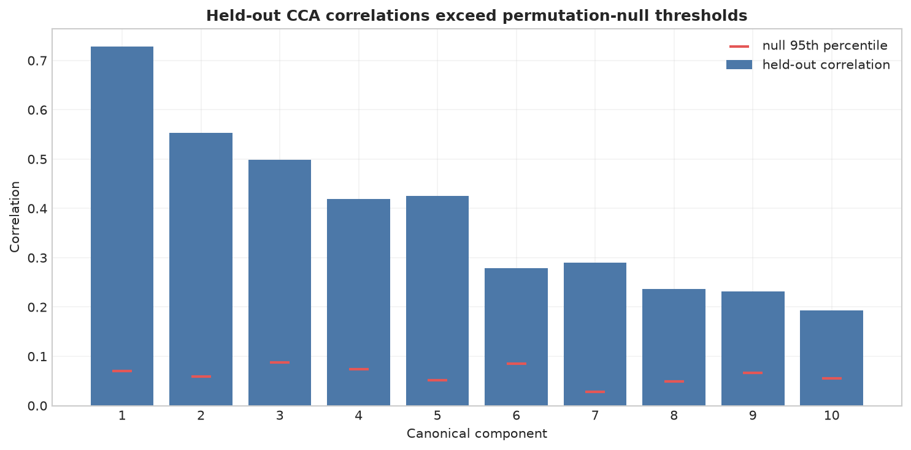

# ArtELingo fusion diagnostics: visual companion

This visual companion to the [fusion-mechanism investigation](2026-09-22_artelingo_fusion_mechanism_investigation.md) makes its already-verified trade-offs and training diagnostics legible at a glance; that narrative report remains the source for methodology and caveats.

**Update, following this report:** a subsequent architecture sweep found that single-head self-attention (replacing Stage 1's scalar gate, holding linear projection heads fixed) clears the held-out Pareto bar for the first time in this investigation — see `learned_student_arch_sweep_pilot_report.md`. The charts and Pareto frontier below predate that result and still show Stage 1 as the frontier; they remain an accurate record of everything through Stage 2 and the weight sweep, just not the final word on the architecture sweep.

## Fusion Pareto frontier

The learned Stage 1 points form the empirical frontier among the multi-signal methods tested. The plot also makes clear that the single-signal content and affect references are ceilings on different axes, rather than a joint solution. The shaded region highlights the many alternatives that Stage 1 train dominates on both AMI axes.

## Headline method comparison

The headline comparison retains the narrative report's core finding: no method cleanly escapes the content–affect trade-off. Late union improves emotion structure over early fusion but gives up substantial genre structure, while Stage 1 is the strongest compromise. Stage 2's additional capacity does not improve either axis.

## Stage 1 checkpoint trajectory

Stage 1 exchanges some content-neighbor recall for affect-neighbor recall while the gradient share converges near balance. Its gate remains unsaturated and its mean stays near the middle of its range. Those diagnostics support the narrative report's reading of the mechanical “Collapsed” label as a healthy two-teacher compromise rather than one-sided starvation.

## Stage 1 versus Stage 2 trajectory

The overlay makes the capacity-only comparison direct: the MLP student leans further toward affect retrieval at content's expense. This accompanies, rather than overturns, the final AMI result that deeper heads made both evaluated clustering axes worse. The evidence therefore did not support escalating architecture.

## Content-loss weight trade-off

Increasing content weight slides both splits monotonically toward genre agreement and away from emotion agreement. The equal-weight point remains the best balance found, as established by the narrative report. No tested weight produces a held-out Pareto result.

## Hierarchical controls

The matched-size Control A is the key attribution comparison: it has no real affect signal but shows a very similar genre cost. That makes the hierarchy result's genre loss mostly a granularity artifact, not affect-specific damage. The hierarchy still demonstrates a real control-verified emotion signal.

## CCA held-out canonical correlations

Every retained held-out canonical component sits above its corresponding permutation-null threshold. This visualizes the narrative report's global shared-signal result, while its separate edge-retrieval caveat still limits what it implies about strict local neighborhoods. It was the evidence that licensed the small learned-student pilot.

## Data-fidelity note

Every number plotted here is parsed at chart-build time from the markdown tables in the nine listed source reports. The generator uses a lightweight pipe-table parser, strips separator rows, and selects values by source-table headers and row labels; it does not hand-transcribe chart data. See the [fusion-mechanism investigation](2026-09-22_artelingo_fusion_mechanism_investigation.md) for full methodology and caveats.
