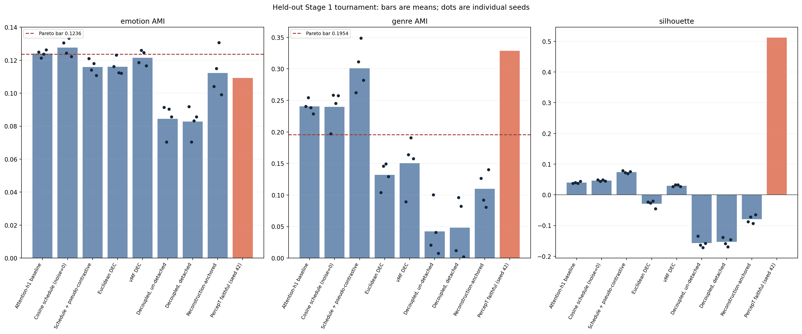
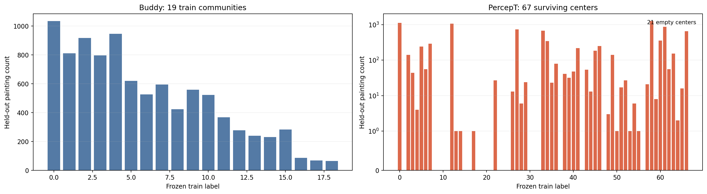
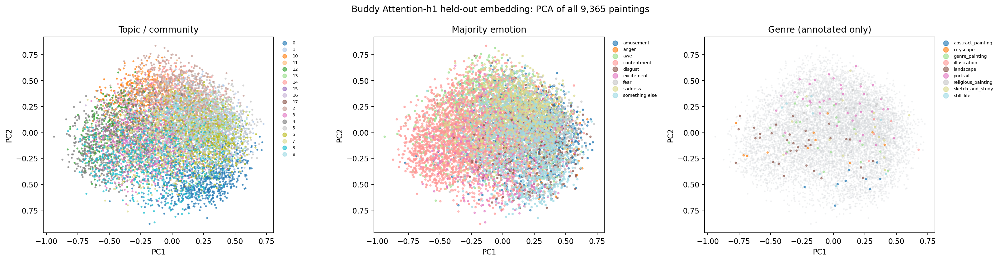
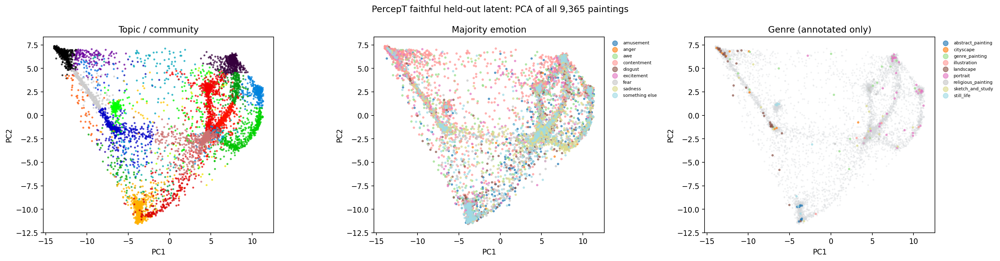
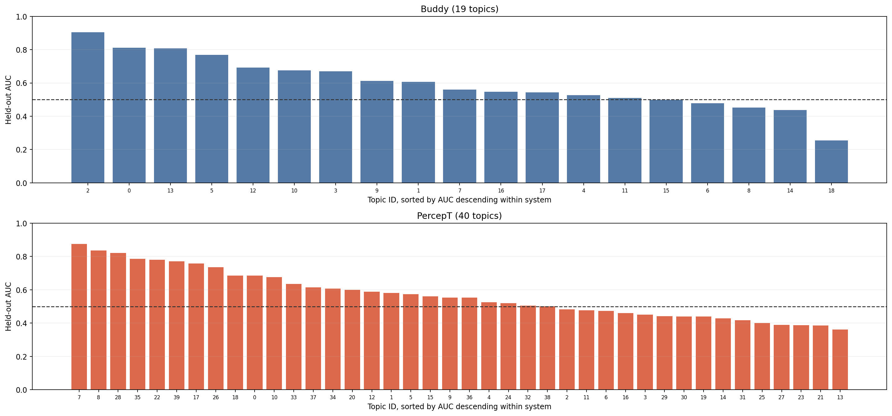
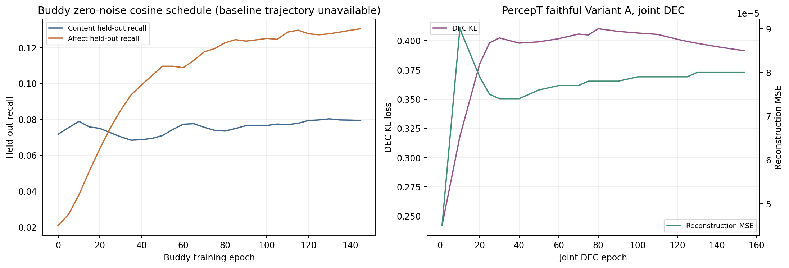

# Comprehensive ArtELingo buddy versus PercepT analysis

This report analyzes saved Stage 1 snapshots and source pilot reports for 9,365 held-out paintings. The only new fit is the seed-42 image-only buddy Stage 2 mapper on CPU, needed for individual example scores. **No raw painting images are present in this environment**; examples therefore show painting IDs, labels, and caption text, not thumbnails. The Stage 1 results favor different systems by different measures: PercepT has much higher matched-sample silhouette (0.4973 versus 0.0416), while buddy has far more balanced occupancy. The separate image-only downstream probe found PercepT slightly stronger for genre (AMI 0.2973 versus 0.2625) and near-tied for emotion (0.0221 versus 0.0231); its mean-pooled image-feature control exceeded both (emotion 0.0685, genre 0.3399). See the [investigation](2026-09-26_artelingo_buddy_vs_percept_stage1_report.md), [source](../../src/test/20260923_artelingo_buddy_analysis/buddy_percept_matched_silhouette_audit_pilot_report.md), and [source](../../src/test/20260923_artelingo_buddy_analysis/buddy_percept_downstream_probe_pilot_report.md).

## Tournament

Bars show four-seed held-out means for eight buddy variants; dots show all four actual seed results. The PercepT faithful recipe is one seed (42), so its bar has no dots or uncertainty estimate. The dashed AMI lines are the predeclared strict Pareto thresholds (emotion 0.1236, genre 0.1954). DEC-head silhouettes are measured in the original fused 32-D buddy embedding. These bars combine buddy pilots' sampled silhouettes with PercepT's published full-split 128-D silhouette (0.5120), so this panel is an overview, not a matched silhouette test; the matched audit gives 0.0416 versus 0.4973. The faithful PercepT snapshot is a fresh refit with a different full-split silhouette (0.4840); its assignments feed the PCA, occupancy, and example panels. Sources: [Attention-h1 baseline](../../src/test/20260923_artelingo_buddy_analysis/attention_h1_baseline_seed_stress_pilot_report.md), [Cosine schedule (noise=0)](../../src/test/20260923_artelingo_buddy_analysis/attention_h1_noise_schedule_pilot_report.md), [Schedule + pseudo-contrastive](../../src/test/20260923_artelingo_buddy_analysis/attention_h1_noise_schedule_pseudo_contrastive_stress_pilot_report.md), [Euclidean DEC](../../src/test/20260923_artelingo_buddy_analysis/attention_h1_dec_hybrid_pilot_report.md), [vMF DEC](../../src/test/20260923_artelingo_buddy_analysis/attention_h1_vmf_dec_hybrid_pilot_report.md), [Decoupled, un-detached](../../src/test/20260923_artelingo_buddy_analysis/attention_h1_decoupled_cluster_head_pilot_report.md), [Decoupled, detached](../../src/test/20260923_artelingo_buddy_analysis/attention_h1_decoupled_cluster_head_detached_pilot_report.md), [Reconstruction-anchored](../../src/test/20260923_artelingo_buddy_analysis/reconstruction_anchored_cluster_head_pilot_report.md), and [source](../../src/test/20260922_percept_topic_pipeline/percept_stage1_faithful_recipe_pilot_report.md).

## Occupancy histograms

These are the exact held-out counts in the matched audit, assigned to frozen train labels: buddy has 19/19 occupied communities (median 523; 3/19 below 1%), while PercepT has 21/67 empty centers (median 13; 50/67 below 1%). PercepT uses a symmetric-log y-axis so zero counts remain visible. Source: [source](../../src/test/20260923_artelingo_buddy_analysis/buddy_percept_matched_silhouette_audit_pilot_report.md).

## Embedding visualizations

PCA projects all 9,365 buddy held-out 32-D embeddings into 2D. Colors show independently computed held-out Leiden communities, majority caption emotion, and the 159 annotated genres; unannotated paintings are gray in the genre panel. These independently reclustered held-out community IDs differ from the frozen train vocabulary used by buddy Stage 2. This is a visualization, not a clustering quality metric. Source: [source](../../src/test/20260923_artelingo_buddy_analysis/attention_h1_embedding_snapshot_pilot_report.md) and its saved NPZ.

PCA projects all 9,365 faithful-recipe held-out 128-D latents into 2D. Colors show saved center assignments, majority emotion, and 159 annotated genres; unannotated paintings are gray. These center labels use the train-fitted vocabulary. Source: [source](../../src/test/20260922_percept_topic_pipeline/percept_stage1_faithful_recipe_pilot_report.md) and its saved NPZ.

## Per-topic AUC comparison

Each panel sorts its own reported held-out Stage 2 mapper AUCs, with a 0.5 chance line. Buddy has 19 topics (macro AUC 0.5978); PercepT has 40 (0.5690). Topic IDs and the underlying Stage 1 runs differ, so bars at the same rank or ID are not matched topics. Sources: [source](../../src/test/20260923_artelingo_buddy_analysis/buddy_stage2_pilot_report.md) and [source](../../src/test/20260922_percept_topic_pipeline/percept_stage2_pilot_report.md).

## Training curves

Left: logged content and affect held-out recall at checkpoints for the zero-noise cosine-schedule Attention-h1 run. The plain fixed-LR baseline's report and snapshot contain no saved checkpoint trajectory, so that requested exact curve remains unavailable without another training run. Right: PercepT faithful Variant A joint DEC KL and reconstruction MSE at its logged checkpoints, on separate y-axes. Epoch axes are separate because the objectives and phases differ. Sources: [source](../../src/test/20260923_artelingo_buddy_analysis/attention_h1_noise_schedule_pilot_report.md) and [source](../../src/test/20260922_percept_topic_pipeline/percept_stage1_faithful_recipe_pilot_report.md).

## Statistics

Each four-seed row uses seeds 42, 7, 123, and 2024 in that order. Standard deviations are sample SD (ddof=1); 95% confidence intervals are percentile bootstrap intervals for the mean from 10,000 size-four resamples with replacement using `np.random.default_rng(42)`. With n=4, these intervals are indicative and cannot support a rigorous significance claim. The PercepT faithful recipe has only seed 42 and has no four-seed CI.

| Variant | Metric | Seeds 42 / 7 / 123 / 2024 | Mean | Sample SD | 95% bootstrap CI |
|---|---|---|---:|---:|---:|
| Attention-h1 baseline | emotion AMI | 0.1249 / 0.1213 / 0.1238 / 0.1264 | 0.1241 | 0.0021 | [0.1222, 0.1258] |
| Attention-h1 baseline | genre AMI | 0.2404 / 0.2544 / 0.2386 / 0.2289 | 0.2406 | 0.0105 | [0.2318, 0.2505] |
| Attention-h1 baseline | silhouette | 0.0377 / 0.0397 / 0.0375 / 0.0438 | 0.0397 | 0.0029 | [0.0376, 0.0423] |
| Cosine schedule (noise=0) | emotion AMI | 0.1306 / 0.1244 / 0.1334 / 0.1222 | 0.1277 | 0.0052 | [0.1233, 0.1320] |
| Cosine schedule (noise=0) | genre AMI | 0.1973 / 0.2583 / 0.2452 / 0.2576 | 0.2396 | 0.0288 | [0.2124, 0.2580] |
| Cosine schedule (noise=0) | silhouette | 0.0488 / 0.0438 / 0.0487 / 0.0451 | 0.0466 | 0.0025 | [0.0445, 0.0488] |
| Schedule + pseudo-contrastive | emotion AMI | 0.1210 / 0.1141 / 0.1180 / 0.1107 | 0.1160 | 0.0045 | [0.1124, 0.1195] |
| Schedule + pseudo-contrastive | genre AMI | 0.2623 / 0.3111 / 0.3487 / 0.2822 | 0.3011 | 0.0375 | [0.2722, 0.3321] |
| Schedule + pseudo-contrastive | silhouette | 0.0789 / 0.0721 / 0.0692 / 0.0753 | 0.0739 | 0.0042 | [0.0706, 0.0772] |
| Euclidean DEC | emotion AMI | 0.1162 / 0.1232 / 0.1125 / 0.1122 | 0.1160 | 0.0051 | [0.1123, 0.1205] |
| Euclidean DEC | genre AMI | 0.1041 / 0.1457 / 0.1494 / 0.1293 | 0.1321 | 0.0206 | [0.1145, 0.1476] |
| Euclidean DEC | silhouette | -0.0232 / -0.0266 / -0.0202 / -0.0450 | -0.0288 | 0.0111 | [-0.0396, -0.0217] |
| vMF DEC | emotion AMI | 0.1186 / 0.1260 / 0.1247 / 0.1167 | 0.1215 | 0.0045 | [0.1176, 0.1254] |
| vMF DEC | genre AMI | 0.0895 / 0.1638 / 0.1908 / 0.1575 | 0.1504 | 0.0431 | [0.1081, 0.1825] |
| vMF DEC | silhouette | 0.0273 / 0.0323 / 0.0324 / 0.0271 | 0.0298 | 0.0030 | [0.0272, 0.0324] |
| Decoupled, un-detached | emotion AMI | 0.0915 / 0.0705 / 0.0903 / 0.0857 | 0.0845 | 0.0097 | [0.0755, 0.0909] |
| Decoupled, un-detached | genre AMI | 0.0206 / 0.1005 / 0.0406 / 0.0074 | 0.0423 | 0.0411 | [0.0140, 0.0805] |
| Decoupled, un-detached | silhouette | -0.1345 / -0.1634 / -0.1718 / -0.1577 | -0.1569 | 0.0160 | [-0.1683, -0.1417] |
| Decoupled, detached | emotion AMI | 0.0919 / 0.0705 / 0.0832 / 0.0857 | 0.0828 | 0.0090 | [0.0743, 0.0897] |
| Decoupled, detached | genre AMI | 0.0121 / 0.0961 / 0.0822 / 0.0019 | 0.0481 | 0.0479 | [0.0070, 0.0892] |
| Decoupled, detached | silhouette | -0.1384 / -0.1587 / -0.1692 / -0.1454 | -0.1529 | 0.0137 | [-0.1639, -0.1419] |
| Reconstruction-anchored | emotion AMI | 0.1041 / 0.1150 / 0.1307 / 0.0991 | 0.1122 | 0.0140 | [0.1016, 0.1241] |
| Reconstruction-anchored | genre AMI | 0.1264 / 0.0920 / 0.0808 / 0.1404 | 0.1099 | 0.0281 | [0.0864, 0.1334] |
| Reconstruction-anchored | silhouette | -0.0872 / -0.0720 / -0.0933 / -0.0647 | -0.0793 | 0.0132 | [-0.0902, -0.0683] |

PercepT faithful seed-42 held-out values: emotion AMI 0.1092, genre AMI 0.3288, silhouette 0.5120 ([source](../../src/test/20260922_percept_topic_pipeline/percept_stage1_faithful_recipe_pilot_report.md)). The four-seed source rows supersede rounded or inconsistent summary prose: notably, the investigation overview lists vMF DEC as 0.1210/0.1567/0.0303, while its own four-seed table gives 0.1215/0.1504/0.0298. The baseline stress report's seed-42 silhouette is 0.0377; a later schedule report's reference row lists 0.0392, so the tournament uses the direct stress-table value.

## Qualitative examples

The seed-42 buddy Stage 2 mapper was fitted fresh on CPU with the sibling pilot's 100-epoch full-batch BCE recipe and aligned patch-cache order; no mapper checkpoint or individual held-out score cache existed. Its final BCE matched the saved 0.200270 and its 19 per-topic AUCs differed from the saved table by at most 0.000049. Top-1 means the mapper's highest sigmoid score. Topic dominant emotion is the most common majority emotion among that topic's train paintings (alphabetical tie break). `True emotion` is the held-out snapshot's painting-majority label; `first-caption emotion` and caption come from the first CSV row for that painting. The PercepT assignment is its saved faithful 67-center hard assignment, whose train-topic dominant emotion is computed the same way. Its own per-painting Stage 2 scores cannot be reproduced from the snapshot alone; the 40-topic AUC report is from a different model. Only 2 high-AUC topics produced eligible emotion-matching top-1 candidates, and 2 buddy topics produced contrasting-miss candidates; the tables reflect that concentration. These selected examples are illustrative, not random or representative, and offer qualitative color rather than evidence of general performance.

### Five high-AUC, emotion-matching buddy examples

Candidates have a top-1 buddy topic with reported AUC ≥0.75 and a majority true emotion matching that topic's dominant emotion; five are selected one per eligible topic first, then by descending top-1 score where another row is needed. AUC source: [source](../../src/test/20260923_artelingo_buddy_analysis/buddy_stage2_pilot_report.md).

| Painting ID | Art style | True emotion | First-caption emotion | True genre | Buddy topic | Buddy dominant emotion | Buddy topic AUC | PercepT center | PercepT dominant emotion | First caption |
|---|---|---|---|---|---:|---|---:|---:|---|---|
| vasily-polenov_pond-at-wehle-1874 | Realism | contentment | fear | — | 0 | contentment | 0.8123 | 27 | contentment | the try has a ominous presence like someone is leaning over |
| sam-francis_spleen-yellow-1971 | Abstract_Expressionism | something else | disgust | — | 2 | something else | 0.9043 | 58 | something else | It looks like orange soda has been spilled all over the canvas |
| camille-corot_an-artist-painting-in-the-forest-of-fountainebleau-1855 | Realism | contentment | contentment | — | 0 | contentment | 0.8123 | 0 | contentment | Trees can be and often are beautiful. This one looks regal and majestic, powerful. |
| jacques-villon_composition-1947 | Cubism | something else | fear | — | 2 | something else | 0.9043 | 58 | something else | The shape of the white area across the yellow looks like the open mouth of a dragon about to destroy a castle. |
| ivan-shishkin_study-for-the-painting-chopping-wood-1867 | Realism | contentment | contentment | — | 0 | contentment | 0.8123 | 27 | contentment | The trees are bright green so they look very healthy |

### Three buddy misses with a contrasting PercepT assignment

Candidates have a buddy top-1 topic whose dominant emotion differs from the painting's majority true emotion, while the saved PercepT center's dominant emotion matches it; three are selected across different eligible buddy topics first, then by descending top-1 score if another row is needed. This comparison uses category summaries, not unavailable PercepT mapper probabilities.

| Painting ID | Art style | True emotion | First-caption emotion | True genre | Buddy topic | Buddy dominant emotion | Buddy topic AUC | PercepT center | PercepT dominant emotion | First caption |
|---|---|---|---|---|---:|---|---:|---:|---|---|
| joan-hernandez-pijuan_untitled-1969 | Minimalism | something else | sadness | — | 0 | contentment | 0.8123 | 58 | something else | The dark colors and odd shapes are confusing and depressing |
| john-mclaughlin_untitled-1974(1) | Minimalism | something else | something else | — | 1 | contentment | 0.6063 | 58 | something else | Confusion, I just don't get anything from this. The colors are pretty and contrasting, but nothing else. |
| yves-klein_untitled-blue-monochrome-1959-1 | Minimalism | something else | something else | — | 0 | contentment | 0.8123 | 58 | something else | This is so boring. It's plain dark blue and nothing to look at. |

## Reproduce

Run from the repository root with `PYTHONDONTWRITEBYTECODE=1 /root/miniconda3/envs/CoSiR/bin/python src/test/20260923_artelingo_buddy_analysis/build_comprehensive_analysis.py`. This script was actually executed to create the six PNGs embedded above and this report. The tournament reads per-seed rows from the eight cited variant reports and the PercepT faithful seed-42 row. Occupancy reads the audit's exact count tables. Both PCA plots read the two saved snapshots. The AUC panels read the two Stage 2 per-topic tables. Training curves read the zero-noise schedule checkpoint table and PercepT Variant A joint DEC log. The example tables refit only the buddy image mapper on CPU, align its patch cache by painting ID, and read the first caption rows from the ArtELingo CSV. UMAP was unavailable in the CoSiR environment, so PCA was used on all held-out points; plotting uses matplotlib.
