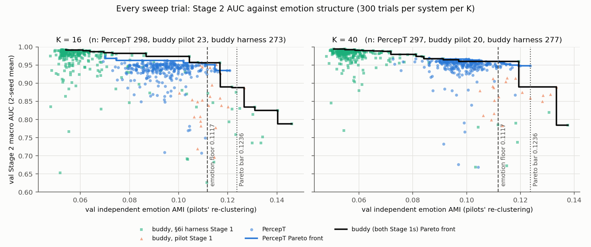
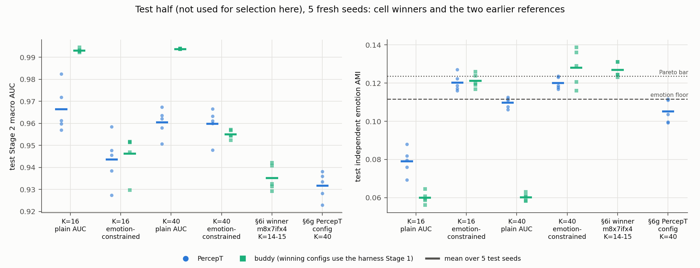
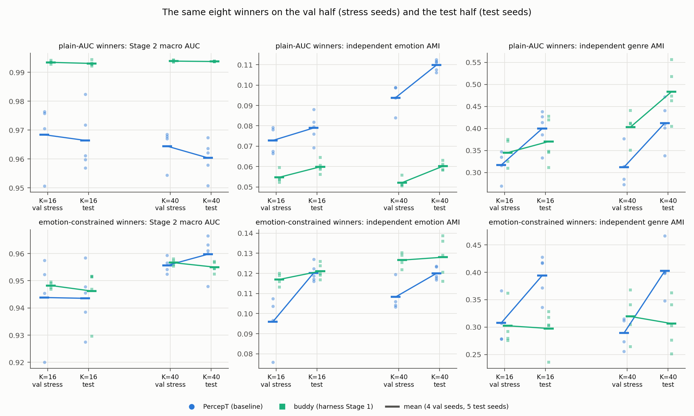

# Matched PercepT-vs-buddy head-to-head on ArtELingo

Date: 2026-09-30 (revised after the final whole-branch review). Branch `experiment/percept_topic_pipeline`.
Design: [`2026-09-30-matched-percept-buddy-h2h-design.md`](../../../superpowers/specs/2026-09-30-matched-percept-buddy-h2h-design.md).
Plan: [`2026-09-30-matched-percept-buddy-h2h.md`](../../../superpowers/plans/2026-09-30-matched-percept-buddy-h2h.md).
Master report: [§6g, §6i, §6j, §6k](2026-09-26_artelingo_buddy_vs_percept_stage1.md).
Raw evidence: `src/test/20260930_matched_h2h/` (logs with `H2H_SEED` and
`H2H_RESULT` lines, `sweep_runs.json`, finalist files, `stress_summary.md`,
`test_summary.md`, `20260930_matched_h2h_log.md`).

Terms. *Stage 1* forms topics from the training paintings; *Stage 2* is an
image-only mapper that predicts a painting's topic from its CLIP patch
tokens. *AUC* is Stage 2's macro-averaged ROC AUC over topics on held-out
paintings. *AMI* is the adjusted mutual information between a topic
partition and human emotion or genre labels. *K* is the number of topics.
PercepT is the baseline throughout; every difference is buddy minus PercepT.

## Summary

We compared buddy's graph-based topic formation with PercepT's autoencoder
plus DEC (deep embedded clustering) at matched topic counts (K = 16 and
K = 40), with the same held-out labels, the same Stage 2 code and search
space, and an equal 300-trial Bayesian search per system per K. We selected
on a val half of the held-out paintings and report on the other (test) half
at 5 fresh seeds. The test half was not used for selection in this
experiment, but it is part of the held-out set on which §6a to §6i were
tuned (§2).

- **Primary comparison (the approved protocol): ranked by val AUC alone,
  buddy's winners score higher than PercepT's and keep less emotion
  structure.** On test, buddy 0.9931 vs PercepT 0.9664 at K = 16 (+0.027,
  95% CI [+0.014, +0.040], p = 0.005) and 0.9937 vs 0.9604 at K = 40
  (+0.033 [+0.025, +0.041], p < 0.001). The same winners show the lead on
  the val stress runs too (+0.025 and +0.030, p = 0.025 and 0.003). Their
  topics keep 0.060 independent emotion AMI on test, against PercepT's
  0.079 and 0.110 (−0.019 and −0.050, both p < 0.01; same direction on
  val). Buddy's search reached this by setting the affect-loss weight at
  the bottom of its range (0.25). With PercepT's native DEC labels, buddy's
  lead widens (+0.029 and +0.039).
- **Secondary analysis (designed after the interim leaderboard showed that
  buddy's early lead came with emotion AMI ≈ 0.05; the floor rule was fixed
  on val before any test run): among trials above a common emotion floor,
  we detected no Stage 2 difference.**

  | K | buddy test AUC | PercepT test AUC (baseline) | Δ test [95% CI], p | Δ val stress, p |
  |---|---:|---:|---:|---:|
  | 16 | 0.9462 | 0.9435 | +0.003 [−0.013, +0.018], 0.70 | +0.004, 0.63 |
  | 40 | 0.9550 | 0.9598 | −0.005 [−0.013, +0.004], 0.21 | +0.001, 0.56 |

  At n = 5 seeds the test CIs exclude a buddy advantage larger than about
  0.018 (K = 16) or 0.004 (K = 40) and a PercepT advantage larger than about
  0.013 at either K. With PercepT's native labels the K = 40 sign flips
  (buddy +0.0007, p = 0.88). At equal AUC, buddy's constrained winners never
  showed less emotion than PercepT's: on test we detected no difference
  (0.121 vs 0.120; 0.128 vs 0.120; p ≥ 0.14), and on val buddy's held about
  0.02 more (0.117 vs 0.096; 0.127 vs 0.108). Genre did not replicate: PercepT's topics carried
  about 0.10 more genre AMI on test (p < 0.01), but on val the difference
  was −0.005 at K = 16 and +0.030 in buddy's favour at K = 40. We therefore
  do not claim a genre difference.
- **Which comparison leads is open.** The user approved the primary protocol
  before the run and has not yet chosen whether the plain-AUC or the
  emotion-constrained comparison should carry the headline.
- **Under matched conditions §6g's headline does not hold.** PercepT's §6g
  lead (0.9226 vs 0.8534) is not reproduced by either selection: plain AUC
  favours buddy, and the constrained selection detects no difference.
- **Coverage caveats.** 8 of the 10 emotion-constrained buddy finalists used
  the pilot Stage 1, but every buddy winner used the §6i harness Stage 1,
  which was not validated against the pilot. The AUC-only search sampled
  buddy's high-emotion region thinly: the §6i winner `m8x7ifx4`, whose
  configuration lies inside the buddy K = 16 search space, scores 0.9352 on
  test at 0.127 emotion AMI, about 0.045 above the best buddy sweep trial
  at 0.12 or more (0.890 on val; different halves, so indicative only).

## 1. Question

Earlier comparisons were not like for like:
- **§6g** tuned only the Stage 2 mapper, at different topic counts and with
  different labels. It found PercepT 0.9226 vs buddy 0.8534.
- **§6i** found a buddy configuration at 0.9355, but inside a re-implemented
  harness, after 2,267 buddy-only trials.
- **§6j** found that §6i's winner kept less emotion structure than the
  untuned buddy pilot.

This experiment asks the matched question: with both systems in one
harness, at the same topic counts, with the same labels, evaluation and
tuning budget, which system gives better Stage 2 macro AUC, and how do
their topics compare on emotion and genre?

## 2. Protocol

**Provenance.** The user approved four headline decisions on 2026-09-30:
the objective (held-out Stage 2 AUC, no Stage 1 gate), the two K levels,
the val/test split, and the budget and selection protocol (equal trials per
cell, a 2-seed objective, a 4-seed stress test of each cell's top 5, the
winner to test). Everything else was a controller ruling made during the
overnight run under the user's automation authorization: R1 to R7, the
merge options, the emotion floor rule and the secondary selection (§8). The
spec and plan review gates were skipped under that authorization.

- **Systems.** *PercepT* uses an autoencoder on fused CLIP content plus a
  768-d GoEmotions embedding, then DEC clustering, then pruning to K
  topics. *Buddy* uses a two-view student trained with InfoNCE on content
  and affect buddy graphs, then Leiden clustering of the student embedding.
  Buddy's search could choose between two Stage 1 implementations: the
  *pilot* one (a port of the pilots, validated bit-exact in §3) and the
  *harness* one (the §6i re-implementation, not validated against the
  pilot). Each system kept its own published inputs.
- **Stage 2 (shared).** An attention-pooling mapper learns to predict a
  painting's topic from its CLIP patch tokens. Both systems used the same
  code and the same search space: learning rate, epochs, queries, head,
  weight decay, class balancing, target construction.
- **Held-out labels.** The *primary* labels give each held-out painting the
  majority topic of its 20 nearest train paintings in the system's own
  embedding. We fixed k = 20 and never tuned it. For PercepT we also report
  the *native* DEC assignment.
- **Stage 1 quality, two yardsticks.** *Independent* emotion and genre AMI
  re-cluster the evaluation subset with the pilots' own graph and Leiden
  code; this is the method behind the §2/§3 Pareto bar. *Transfer* AMI
  scores the primary labels.
- **Topic counts.** K ≈ 16 and K ≈ 40. PercepT prunes to K directly. Buddy
  reaches K ± 2 by bisection over the Leiden resolution after merging small
  topics; a buddy trial outside the band is a *K miss* (objective −1).
- **Split.** We split the 9,365 held-out paintings into val (4,686) and test
  (4,679), stratified by majority emotion and by whether genre is known.
  All tuning and selection in this experiment used val, and we ran test
  once, for the final runs. Test is not untouched: the full held-out set,
  which contains it, drove selection throughout §6a to §6i. Both references,
  the Pareto bar, the K levels and the search ranges were chosen on it, so
  the two references carry a selection advantage on test.
- **Budget.** One W&B Bayesian sweep per system per K: four cells, 300
  trials each, 1,200 in total. Each trial's objective was the val AUC
  averaged over two seeds. The sweeps ran on 9 DAS6 GPUs in about 16 hours
  (145 logged GPU-hours; per cell in §4).
- **Selection.** For each cell, the top 5 finalists went through a 4-seed val
  stress test, and the best mean won. The winner then ran at 5 fresh seeds
  on test. We applied this procedure twice:
  - *Plain AUC (primary, approved):* finalists were the top 5 by val AUC.
  - *Emotion-constrained (secondary, controller ruling):* finalists were the
    top 5 among trials whose val independent emotion AMI was at least a
    floor. We added this selection after the interim leaderboard showed
    buddy's early lead came with emotion AMI ≈ 0.05, and fixed the floor on
    val before any test run by one symmetric rule: the highest value that
    still leaves 10 trials in every cell. It came out at 0.1117 (0.11167),
    with PercepT at K = 16 as the binding cell.
- **References on test, untuned.** The §6i winner `m8x7ifx4` and §6g's
  PercepT configuration, to connect to the earlier numbers.

## 3. Validation: the harness against the pilots

The pilots' results depend on GPU type (§6j), so each check compared like
with like. V2, V3, the sweeps, the stress runs and the test runs ran on
DAS6 GPUs. V1 ran locally on an RTX 3090 (`v1_results.json`), the local
machine on which the pilot numbers it reproduces were produced (§6j).

| check | what we compared | result |
|---|---|---|
| **V2** buddy *pilot* Stage 1 | port vs the unchanged snapshot pilot, seeds 42/7/123/2024, same node and GPU slot | **bit-exact**: train and held-out embeddings identical (max abs diff 0.0), independent AMIs and community counts identical |
| **V3** PercepT Stage 1 | port at §6g's settings, seed 42, scored with the pilots' own Stage 2 | K = 40; native AMI 0.1073 / 0.2770 vs 0.1094 / 0.2798; AUC 0.9258 vs 0.9226 (4-seed mean); untuned 0.5803 vs 0.5843 |
| **V1** shared Stage 2 | harness Stage 2 on the pilots' saved topics | buddy §6f: 0.85341 vs 0.8534, bit-equal to the pilot's own loop at seed 42. PercepT: 0.92264 vs 0.9226 |

What the checks do not cover:
- **The buddy harness Stage 1 was not validated against the pilot.** It is
  the §6i re-implementation, which differs structurally (teacher graph,
  InfoNCE negatives, optimizer; master report §6i). Every buddy winner used
  it.
- **V2 never exercised plateau stopping.** All four seeds ran to the epoch
  cap (`reached MAX_EPOCHS=200`), with the plateau monitor on the full
  held-out set. The sweep's pilot trials monitored the val subset instead,
  and that stop path was never compared against the pilot on real data.

Two strict-rule differences in V1 were measured and accepted:
- **Buddy held-out labels.** 132 of 9,365 differ from the pilot's. All of
  them are ties in the k = 20 vote. The pilot breaks a tie by the nearest
  neighbour; the harness picks the lowest topic id. The effect is +0.0002
  AUC, and we applied the same rule to both systems.
- **PercepT at the untuned setting.** Seed 42 gives 0.5843 against the
  snapshot's 0.5925. This is consistent with the pilot drawing its mapper's
  initial weights from an unseeded random stream, but we did not test that.
  At this setting the seed-to-seed spread alone is 0.5830 to 0.5906.

## 4. The sweeps

*Figure 1.* Every valid trial of the four sweeps: val Stage 2 AUC (mean of 2
seeds) against val independent emotion AMI, one panel per K, with buddy's
pilot and harness Stage 1 trials marked separately. The lines are each
system's Pareto front (best AUC at or above each emotion level). The dashed
line is the emotion floor used by the secondary selection, and the dotted
line is the §3 Pareto bar.

| cell | trials | valid | objective −1 | no objective logged | valid, but a seed off target K | best val AUC | median val AUC | val emotion AMI range | trials above the floor | sweep GPU-hours |
|---|---:|---:|---|---:|---:|---:|---:|---:|---:|---:|
| PercepT K=16 (baseline) | 300 | 298 | 2 topic collapses | 0 | 4 | 0.9739 | 0.942 | 0.069 to 0.121 | 10 | 44.4 |
| buddy K=16 | 300 | 296 | 3 K misses | 1 | n/a | 0.9928 | 0.976 | 0.048 to 0.146 | 29 | 23.9 |
| PercepT K=40 (baseline) | 300 | 297 | 3 topic collapses | 0 | 1 | 0.9692 | 0.954 | 0.073 to 0.124 | 18 | 45.7 |
| buddy K=40 | 300 | 297 | 1 K miss | 2 | n/a | 0.9938 | 0.982 | 0.048 to 0.138 | 17 | 31.2 |

Notes on the table:
- **PercepT's objective −1 trials were not K misses.** DEC collapsed to 1
  to 4 train topics on at least one seed, and the AUC was non-finite
  because every topic was skipped. Buddy's were K misses (13 topics at
  K = 16, 37 at K = 40).
- **PercepT's K was not enforced in the sweep.** When DEC left a pruned
  centre with no train member, a PercepT seed got fewer topics and the
  trial still counted, while a buddy seed outside K ± 2 failed. Five valid
  PercepT trials had a seed off target: `heu2zyk7` (8 of 16 topics),
  `dbzquviv` (15), `twgu4j25` (7), `dnj333dk` (6) and `quizvpgm` (3 and 5
  of 40). We have since made this a K miss for PercepT too (§8). Treating
  the five as −1 changes no finalist and no winner: none was a finalist,
  and every PercepT stress and test seed hit K exactly. The floor would
  fall from 0.11167 to 0.11154 (`heu2zyk7` was one of the 10 trials that
  set it), `ph7atpk0` (emotion 0.11154, val AUC 0.925) would replace `heu2zyk7` as
  PercepT K = 16's 10th trial above it, and one buddy K = 40 trial
  (`hwzptqbb`, val AUC 0.785) would newly clear it. No finalist changes. The Bayesian proposals that
  followed these trials saw their objectives; we cannot replay that.
- **Three buddy trials logged no objective.** `2kymzq7f` (K = 16),
  `2w0gxbfm` and `reb4kvk5` (K = 40, all harness Stage 1) finished with an
  empty W&B summary. Every exception path in the agent logs −1, so these
  were unexplained terminations. Buddy's effective budget was 299 and 298
  scored trials.
- **GPU-hours** are the sums of every seed's logged Stage 1 and Stage 2
  seconds (`s0_*` and `s1_*` `stage1_seconds` and `stage2_seconds` in
  `sweep_runs.json`). They exclude process start-up and the three trials
  without a summary. PercepT used 1.9× (K = 16) and 1.5× (K = 40) buddy's
  compute at equal trial counts.

**What Figure 1 shows.**

1. **There is a trade-off between AUC and emotion, and it is steeper for
   buddy.** Every buddy trial at 0.99 AUC or more (17 at K = 16, 41 at
   K = 40) sits below 0.062 emotion AMI and uses the harness Stage 1. No
   PercepT trial reaches 0.99; its cloud spans 0.069 to 0.121 (K = 16) and
   0.073 to 0.124 (K = 40) emotion AMI and tops out at 0.974 and 0.969.
2. **In the middle of the emotion range the two fronts are close, but they
   rest on very different numbers of trials.** Take the best val AUC among
   trials at or above a given emotion level. Between 0.09 and 0.115, the
   two systems' fronts are within 0.007 of each other at K = 40, and
   buddy's is 0.0003 to 0.019 higher at K = 16. At 0.12 and above, PercepT's
   front is higher (0.935 vs 0.890 at K = 16; 0.948 vs 0.890 at K = 40),
   but each PercepT value is a single trial. A front is a maximum over
   trials, and the densities differ: at emotion AMI ≥ 0.09 there are 52
   buddy vs 201 PercepT trials at K = 16, and 32 vs 270 at K = 40.
3. **Only buddy has trials above 0.125 emotion AMI** (PercepT's highest is
   0.121 at K = 16 and 0.124 at K = 40). Those 14 trials score 0.735 to
   0.890 val AUC. That need not be a hard cost of high emotion: `m8x7ifx4`,
   whose configuration lies inside the buddy K = 16 search space (harness
   Stage 1, 4 attention heads, d = 64, λ_affect 1.03, merge 0.02, every
   Stage 2 value in range), scores 0.9352 on test at 0.127 emotion AMI.
   The halves differ, so the comparison is indicative, but the AUC-only
   search did not map buddy's high-emotion front.

**The search seldom chose buddy's pilot Stage 1, and those trials kept
emotion.** It chose the pilot implementation in 25 of 300 trials at K = 16
(23 valid) and 20 of 300 at K = 40 (all valid). Of the valid pilot trials,
52% (12 of 23) and 55% (11 of 20) cleared the emotion floor, against 6.2%
(17 of 273) and 2.2% (6 of 277) of harness trials. As a result, 8 of the 10
emotion-constrained buddy finalists (4 of 5 at each K) used the pilot
Stage 1, while both constrained winners, and all plain-AUC finalists, used
the harness Stage 1.

At K = 16 the pilot runner-up `aog4egr9` came close to both winners on the
val stress runs: 0.9463 ± 0.0029, against 0.9482 ± 0.0012 for the harness
winner `mssv0f7s` and 0.9438 ± 0.0166 for PercepT's constrained winner
(baseline; Δ vs PercepT +0.002 [−0.023, +0.028]), at 0.114 vs 0.096
emotion AMI. So on val only, the pilot Stage 1 alone showed no detectable
difference from PercepT at K = 16, but with 4 seeds the interval is wider
than the whole plain-AUC gap, so this is weak evidence either way. At K = 40 the best pilot finalist
(`rinivyjg`, 0.9236 ± 0.0051) fell about 0.03 short of both winners
(0.9566, and PercepT's 0.9556).

## 5. Result on the test half

*Figure 2.* Each cell winner and the two references on the test half, one
dot per test seed (11, 23, 57, 101, 211) with a bar at the mean. Left:
Stage 2 macro AUC with primary labels. Right: independent emotion AMI. The
floor and the Pareto bar are drawn for orientation; the floor was applied
to val, not test.

| selection | K | buddy AUC | PercepT AUC (baseline), primary / native labels | Δ AUC [95% CI], p (primary) | Δ AUC vs PercepT native [95% CI], p | buddy ind. emotion | PercepT ind. emotion | Δ emotion [95% CI] |
|---|---|---:|---:|---|---|---:|---:|---|
| plain AUC (primary) | 16 | 0.9931 ± 0.0008 | 0.9664 ± 0.0106 / 0.9639 ± 0.0095 | **+0.027** [+0.014, +0.040], p = 0.005 | +0.029 [+0.017, +0.041], p = 0.002 | 0.060 | 0.079 | **−0.019** [−0.028, −0.011] |
| plain AUC (primary) | 40 | 0.9937 ± 0.0001 | 0.9604 ± 0.0064 / 0.9543 ± 0.0075 | **+0.033** [+0.025, +0.041], p < 0.001 | +0.039 [+0.030, +0.049], p < 0.001 | 0.060 | 0.110 | **−0.050** [−0.053, −0.046] |
| emotion-constrained (secondary) | 16 | 0.9462 ± 0.0095 | 0.9435 ± 0.0115 / 0.9370 ± 0.0144 | +0.003 [−0.013, +0.018], p = 0.70 | +0.009 [−0.009, +0.028], p = 0.27 | 0.121 | 0.120 | +0.001 [−0.005, +0.007] |
| emotion-constrained (secondary) | 40 | 0.9550 ± 0.0019 | 0.9598 ± 0.0071 / 0.9543 ± 0.0094 | −0.005 [−0.013, +0.004], p = 0.21 | +0.0007 [−0.011, +0.012], p = 0.88 | 0.128 | 0.120 | +0.008 [−0.004, +0.020] |

Values are mean ± sample standard deviation over the 5 test seeds.
Differences use Welch's t-test with Welch-Satterthwaite degrees of freedom.
Buddy's winners had 14 to 18 topics at K = 16 and 39 to 42 at K = 40;
PercepT's had exactly K on every seed. No winner skipped a topic, except
PercepT's plain-AUC K = 16 winner on primary labels, which skipped 0 to 2
of its 16 topics per test seed (1/0/1/2/1; a topic with no held-out member
has no AUC, so its macro AUC averages over 14 to 16 topics). With native
labels it skipped none.

| emotion-constrained, test | buddy genre AMI | PercepT genre AMI (baseline) | Δ [95% CI] | buddy transfer emotion | PercepT transfer emotion |
|---|---:|---:|---|---:|---:|
| K = 16 | 0.298 | 0.394 | −0.097 [−0.151, −0.042] | 0.118 | 0.107 |
| K = 40 | 0.307 | 0.403 | −0.096 [−0.160, −0.032] | 0.129 | 0.113 |

This genre gap does not replicate on val (below), so we report it as a
test-half observation, not a system difference.

| reference, test (untuned here) | Stage 2 AUC | ind. emotion | ind. genre | topics |
|---|---:|---:|---:|---:|
| §6i buddy winner `m8x7ifx4` (fixed Leiden resolution, as in §6i) | 0.9352 ± 0.0058 | 0.127 | 0.235 | 14 to 15 |
| §6g PercepT config (K = 40, untuned Stage 1) | 0.9317 ± 0.0061 (native labels 0.9295) | 0.105 | 0.377 | 40 |

### Val stress vs test: which differences replicate

*Figure 3.* The same eight winners on the val half (4 stress seeds: 42, 7,
123, 2024) and on the test half (5 test seeds), one dot per seed, a bar at
each mean and a line joining the two means. Top row: plain-AUC winners.
Bottom row: emotion-constrained winners.

| selection | K | system | run | Stage 2 AUC, primary, val → test | PercepT AUC, native, val → test | ind. emotion AMI, val → test | ind. genre AMI, val → test | skipped topics per seed, val → test |
|---|---|---|---|---|---|---|---|---|
| plain AUC | 16 | PercepT (baseline) | `x0oa5511` | 0.9684 → 0.9664 | 0.9633 → 0.9639 | 0.073 → 0.079 | 0.317 → 0.400 | 0/0/1/0 → 1/0/1/2/1 |
| plain AUC | 16 | buddy | `6edlxmyv` | 0.9934 → 0.9931 | n/a | 0.055 → 0.060 | 0.345 → 0.370 | all 0 |
| plain AUC | 40 | PercepT (baseline) | `0biqmu50` | 0.9644 → 0.9604 | 0.9586 → 0.9543 | 0.094 → 0.110 | 0.312 → 0.412 | all 0 |
| plain AUC | 40 | buddy | `89mkiavu` | 0.9939 → 0.9937 | n/a | 0.052 → 0.060 | 0.403 → 0.483 | all 0 |
| emotion-constrained | 16 | PercepT (baseline) | `usnsbxdq` | 0.9438 → 0.9435 | 0.9364 → 0.9370 | 0.096 → 0.120 | 0.308 → 0.394 | all 0 |
| emotion-constrained | 16 | buddy | `mssv0f7s` | 0.9482 → 0.9462 | n/a | 0.117 → 0.121 | 0.302 → 0.298 | all 0 |
| emotion-constrained | 40 | PercepT (baseline) | `i1rigwnq` | 0.9556 → 0.9598 | 0.9487 → 0.9543 | 0.108 → 0.120 | 0.289 → 0.403 | all 0 |
| emotion-constrained | 40 | buddy | `4fu1936m` | 0.9566 → 0.9550 | n/a | 0.127 → 0.128 | 0.319 → 0.307 | all 0 |

| selection | K | metric | Δ val stress (4 seeds), p | Δ test (5 seeds), p | replicates? |
|---|---|---|---|---|---|
| plain AUC | 16 | AUC | +0.025, 0.025 | +0.027, 0.005 | yes |
| plain AUC | 16 | ind. emotion | −0.018, 0.007 | −0.019, 0.002 | yes |
| plain AUC | 40 | AUC | +0.030, 0.003 | +0.033, < 0.001 | yes |
| plain AUC | 40 | ind. emotion | −0.042, < 0.001 | −0.050, < 0.001 | yes |
| emotion-constrained | 16 | AUC | +0.004 [−0.022, +0.031], 0.63 | +0.003 [−0.013, +0.018], 0.70 | no difference detected on either half |
| emotion-constrained | 16 | ind. emotion | +0.021, 0.054 | +0.001, 0.75 | buddy ≥ PercepT on both |
| emotion-constrained | 16 | ind. genre | −0.005, 0.86 | −0.097, 0.004 | no |
| emotion-constrained | 40 | AUC | +0.001 [−0.003, +0.006], 0.56 | −0.005 [−0.013, +0.004], 0.21 | no difference detected on either half |
| emotion-constrained | 40 | ind. emotion | +0.018, 0.010 | +0.008, 0.14 | buddy ≥ PercepT on both |
| emotion-constrained | 40 | ind. genre | +0.030, 0.31 | −0.096, 0.009 | no |

GPU-hours for selection and test (same method as §4, summed over every
stress and test seed of both selections): buddy K = 16 2.3, buddy K = 40
2.5, PercepT K = 16 3.8, PercepT K = 40 3.5; the two references 0.65
(`m8x7ifx4`) and 0.16 (§6g config).

**Analysis.**

- **Why buddy leads on plain AUC.** Both plain-AUC buddy winners set the
  affect-loss weight to 0.253 and 0.255, on the search's lower bound of
  0.25 (a quarter of the default). All 58 buddy trials with val AUC ≥ 0.99
  have λ_affect between 0.25 and 0.47, so the plain-AUC optimum sits at the
  edge of the searched range. The winners also use the harness Stage 1,
  whose contrastive loss scores every anchor against the whole train set.
  With affect down-weighted, the student embeds paintings mostly by
  content. Leiden then finds content and genre clusters, which a
  patch-token classifier predicts almost perfectly: AUC 0.993, with a seed
  standard deviation of only 0.0001 to 0.0008. PercepT's search space has
  no comparable knob. A likely reason is that its fused input always
  carries the 768-d affect embedding (one third of the input), so its
  clusters cannot drop affect entirely; its plain-AUC winners stay at 0.079
  and 0.110 emotion AMI. We did not test this mechanism directly. So the
  plain-AUC gap mostly shows how far each system can be pushed away from
  affect. It does not show better topic quality.
- **With emotion held near the floor, we detected no Stage 2 difference.**
  At n = 5 test seeds the differences are +0.003 and −0.005, and the CIs
  exclude only differences larger than about +0.018 / −0.013 (K = 16) and
  +0.004 / −0.013 (K = 40). At K = 16 the gap is smaller than either
  system's seed standard deviation (0.0095, 0.0115). At K = 40 it is larger
  than buddy's (0.0019) and smaller than PercepT's (0.0071). The val stress
  runs agree (+0.004 and +0.001, p ≥ 0.56). With PercepT's native labels
  the K = 40 sign flips (+0.0007) and the K = 16 gap widens (+0.009,
  p = 0.27); neither is significant. The constrained buddy winners keep a
  normal affect weight (1.03 and 0.78).
- **On emotion, buddy's constrained winners were never behind.** At equal
  AUC we detected no emotion difference on test (0.121 vs 0.120, p = 0.75;
  0.128 vs 0.120, p = 0.14), and they led by about 0.02 on val (0.117 vs
  0.096, p = 0.054; 0.127 vs 0.108, p = 0.010). The halves disagree on the
  size, so we claim only that buddy showed no less emotion.
- **The genre difference is not established.** On test PercepT's
  constrained topics align more with genre (0.394 vs 0.298; 0.403 vs
  0.307, both p < 0.01). On val the difference is −0.005 (p = 0.86) and
  +0.030 in buddy's favour (p = 0.31). The test p-values reflect seed
  variance over the same ~80 genre-labelled test paintings, not split
  noise, and Figure 3 shows split effects of this size: every PercepT
  winner's independent genre AMI rises from val to test by 0.082 to 0.114,
  while buddy's constrained winners move by −0.005 (K = 16) and −0.013
  (K = 40).
- **Both tuned winners score above the untuned references, but we cannot
  attribute the gain.** PercepT's constrained K = 40 winner scores 0.9598
  on test against 0.9317 for §6g's configuration, but it also changes
  Stage 1 (λ_reconstruction 9.0 vs 1.0, λ_balance 1473 vs 1000, N_initial
  factor 2.0 vs 1.5, 50 vs 100 pretraining epochs, DEC learning rate
  2.7e-4 vs 1e-4), and we ablated nothing. Buddy's constrained K = 40
  winner (0.9550) is not comparable to `m8x7ifx4`, which has 14 to 15
  topics. The two untuned references score within 0.0035 of each other on
  test (0.9352 vs 0.9317), but at different topic counts (14 to 15 vs 40),
  and `m8x7ifx4` was chosen on the full held-out set that contains this
  test half, so this does not show when or how §6g's gap closed.
- **The §6i winner is a trade-off point, not a loser.** On test
  `m8x7ifx4` has 0.127 emotion AMI, more than three of the four
  constrained winners (0.120 to 0.121), and lower AUC than all four
  (0.9435 to 0.9598). At K ≈ 16 it sits at 0.9352 with 0.127 emotion,
  against 0.9462 with 0.121 for buddy's constrained winner and 0.9435 with
  0.120 for PercepT's (baseline).

## 6. What this changes in the master report

- **§6g ("PercepT 0.9226 vs buddy 0.8534, PercepT wins Stage 2") does not
  hold under matched conditions.** §6g tuned only the mapper's learning
  rate and epochs, and compared buddy at K = 16 with transfer labels
  against PercepT at K = 40 with native labels. With matched K, matched
  labels and the same full Stage 2 search, PercepT does not lead under
  either selection: plain AUC favours buddy (at less emotion), and at the
  emotion floor we detected no difference. Caveat: buddy's winners use the
  harness Stage 1. The pilot Stage 1 appeared in only 25 and 20 trials,
  but supplied 8 of the 10 constrained buddy finalists, and at K = 16 its
  best finalist showed no detectable difference from PercepT on val
  (Δ +0.002, 95% CI [−0.023, +0.028], 4 seeds; §4). Whether the pilot Stage 1
  alone closes §6g's gap on test is still untested.
- **§6i's buddy number is a trade-off point.** Buddy's highest AUCs require
  giving up affect, as §6j suggested. `m8x7ifx4` keeps more emotion than
  three of the four constrained winners at lower AUC (§5).
- **§3's Stage 1 advantage for buddy narrows.** Buddy has configurations
  above 0.125 emotion AMI and PercepT's sweep did not (though neither
  sweep was designed to probe that region), and at the emotion floor
  buddy's constrained winners never showed less emotion than PercepT's. We
  detected no Stage 2 difference at the floor and no replicated genre
  difference.

## 7. Limitations

- **Equal trials did not give equal coverage.** Buddy's search space has 24
  free dimensions against PercepT's 15, and PercepT used 1.5 to 1.9 times
  buddy's GPU-hours at equal trial counts. Only 17 of 273 valid harness
  trials at K = 16 and 6 of 277 at K = 40 reached the emotion floor, and
  the pilot Stage 1 was drawn in 25 and 20 trials. `m8x7ifx4` indicates
  that the buddy space holds much better high-emotion points than the
  sweep found (§4). The Pareto fronts are maxima over very unequal numbers of
  trials, and PercepT's front at 0.12 and above rests on one trial per K.
- **The buddy pilot Stage 1 is under-explored and its stopping rule is
  unvalidated.** A separate search restricted to the pilot implementation
  might find a better affect-preserving buddy; the K = 16 runner-up
  suggests so. V2 never exercised the pilot's plateau stop (§3), which the
  sweep's pilot trials used with a val-subset monitor.
- **One split and one dataset, and the test half was seen before.** Test
  is one fixed half of ArtELingo's held-out set, with 5 seeds per winner.
  The confidence intervals cover seed noise, not split noise, and Figure 3
  shows split effects as large as the genre gap. The full held-out set,
  including this half, was used for selection in §6a to §6i.
- **Independent AMIs shift between the halves.** All four PercepT winners'
  independent AMIs rise from val stress to test (genre +0.082 to +0.114,
  emotion +0.006 to +0.024), plain-AUC winners included, so this is a
  split effect, not regression after selection. Buddy's constrained
  winners barely move (K = 16 then K = 40: genre −0.005 and −0.013, emotion
  +0.004 and +0.001);
  its plain-AUC winners rise in genre (+0.025, +0.080) and slightly in
  emotion (+0.005, +0.008). Separately, the constrained PercepT winners
  dropped from their search-seed emotion (0.115 and 0.112) to their stress
  seeds (0.096 and 0.108) on the same val half, which is regression after
  selection near the floor; buddy's constrained winners did not (0.117 and
  0.119 at search, 0.117 and 0.127 at stress).
- **The emotion floor is a judgement.** We fixed the rule (at least 10
  trials in every cell) before test, but a different floor would pick
  different finalists. Figure 1 shows the whole trade-off; along the
  fronts between 0.09 and 0.115 the systems are within 0.007 (K = 40) or
  buddy is 0.0003 to 0.019 ahead (K = 16), and above 0.12 the fronts rest on
  too few trials to compare.
- **Sweep-level defects, disclosed in §4.** Five valid PercepT trials had a
  seed off target K (now a K miss; no finalist, winner or reported number
  changes), and three buddy harness trials ended with no objective logged
  (effective budgets 299 and 298).
- **The plain-AUC buddy optimum is on a search boundary** (λ_affect at the
  lower bound 0.25), so a wider range could push AUC higher and emotion
  lower still.
- **PercepT's plain-AUC K = 16 winner skipped 0 to 2 topics per test seed**
  on primary labels, so its macro AUC averages over 14 to 16 topics.
- **The independent AMIs here are not the §3 numbers.** Here they come from
  re-clustering one half of the held-out set, not all 9,365 paintings.
- **Genre AMI rests on about 80 labelled paintings per half.**

## 8. Rulings and deviations

The user approved the four headline decisions listed in §2. The following
were controller rulings, recorded in the SDD ledger
(`.superpowers/sdd/2026-09-30-matched-percept-buddy-h2h/progress.md`):
- **R1:** each system keeps its native inputs.
- **R2:** held-out labels use k = 20 and are never tuned.
- **R3:** buddy's K is controlled by bisection, within ±2.
- **R4:** 300 trials per cell, sized from measured trial times.
- **R5:** the Stage 2 search space is identical for both systems; the
  Stage 1 spaces are system-specific.
- **R6:** seeds by role: search (1001, 1002), stress (42, 7, 123, 2024),
  test (11, 23, 57, 101, 211); no seed is reused across roles.
- **R7:** buddy's Stage 1 is a two-way choice between the pilot and the
  harness implementation.
- **Merge options:** buddy's small-topic merge options were {0.005, 0.01,
  0.02} at K = 16 and {0.002, 0.005, 0.01} at K = 40. We dropped 0.0
  because an unrepaired graph leaves isolated nodes as singleton topics.
- **Secondary selection and floor rule:** the emotion-constrained selection
  and its floor rule were added after the interim leaderboard, and the
  floor was fixed on val before any test run. The choice of which
  selection leads the report is the user's, and is still open. The result
  commit's subject (`a766038`, "buddy and PercepT tie on Stage 2 at equal
  emotion") pre-empted that choice; this report supersedes its framing.
- **PercepT K enforcement (post-run fix, final review):** `h2h_trial.py`
  now treats a PercepT seed whose distinct train topics differ from
  `k_target` as a K miss (objective −1, remaining seeds aborted), as for
  buddy. This applies to future runs only; nothing was re-run, and §4
  shows that it changes no finalist, winner or reported number.
