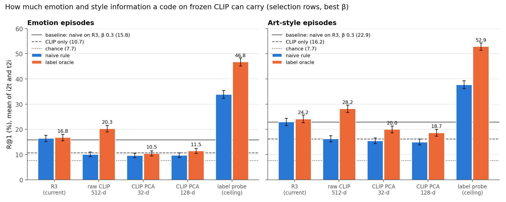
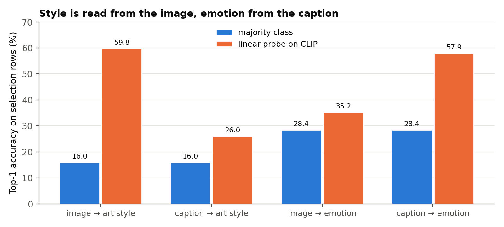
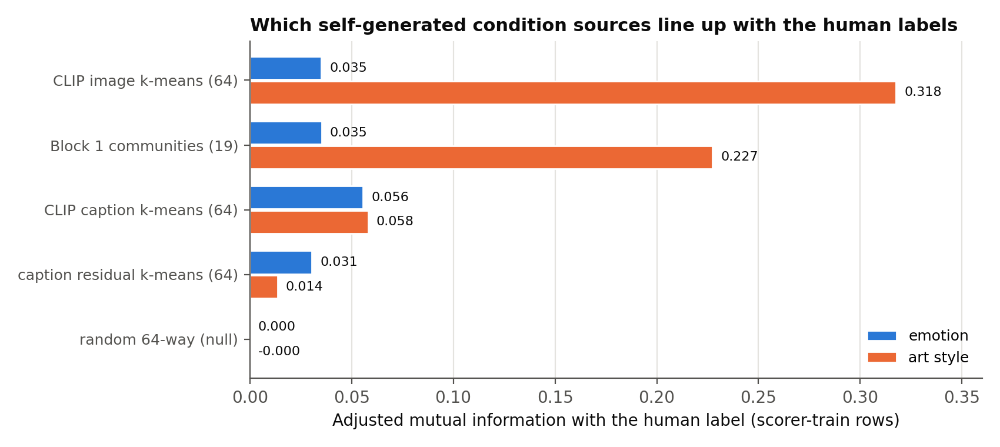

# CoSiR v2 Candidate A: how much room frozen CLIP leaves for condition-aware factors

## Verdict

**There is large headroom, and the limit is R3's code, not frozen CLIP ViT-B/32.** A 36-dimensional code that
linearly reads emotion and art style from the same frozen CLIP features reaches a cross-validated label-oracle
R@1 of **49.8%** on the stage-(d) selection episodes. The label oracle on R3's 32 factors reaches **20.5%**,
and the baseline (the naive rule on R3 at β 0.3) is **19.4%**. The difference to R3's oracle is
**+29.4 [+28.1, +30.6]** R@1 points, **+30.0** for emotion and **+28.7** for art style, both far above the
pre-stated +5 threshold. By the reading rule written into the plan before the run, both label types show
**headroom**: factor learning is the right lever, and a backbone change is not needed yet.

Three further findings shape the design that follows:

- **More dimensions alone do not help.** PCA codes of CLIP (32 and 128 dimensions) score 15.2% and 15.1%,
  below R3 (20.5%) and below the baseline. Raw 512-dimensional CLIP, reweighted per dimension, reaches 24.3%,
  above R3 by +3.8 [+2.7, +4.9]. The label information exists in CLIP, but not along its main variance
  directions.
- **Style lives in the image and emotion in the caption.** A linear probe on CLIP reads art style from the
  image at 59.8% (majority class 16.0%) but from the caption at only 26.0%. It reads emotion from the caption
  at 57.9% (majority 28.4%) but from the image at only 35.2%. R3's paired-agreement loss asks every factor to
  fire on the image and its caption alike, which may suppress exactly these one-sided factors (a hypothesis,
  not tested here).
- **The self-generated condition sources cover style, not emotion.** CLIP image clusters and Block 1
  communities line up with art style (adjusted mutual information 0.32 and 0.23). No source lines up with
  emotion: every value is 0.06 or below, including a new caption-residual clustering built to target it
  (0.03).

All numbers are post-hoc diagnostics on selection rows. Every fitted piece (PCA, probes, clusters) used
scorer-train rows only, and no held or val row was read.

*Figure 1. R@1 (mean of image→text and text→image) on 2,048 emotion and 2,048 art-style selection
episodes, each scorer at its best β from {0, 0.03, 0.1, 0.3, 1}. Blue: the naive rule. Orange: the
cross-validated label oracle. Lines: the baseline (naive on R3, β 0.3), CLIP only, and chance (1/13).
Whiskers are 95% bootstrap CIs.*

## Why this probe

Stage (d) ended with one decisive diagnostic
([stage (d) final report](2026-10-14_candidate_a_stage_d_final.md)). The **label oracle** fits one weight
vector per human label (one per emotion, one per art style) over the code's dimensions, on half of that
label's episodes, and ranks the other half with it. On R3's frozen factors it scored 18.4 / 21.0 R@1
(image→text / text→image), about the same as the zero-parameter naive rule (18.4 / 20.4). No reweighting of
R3's factors therefore extracts more emotion or style than naive already does. Spec §9 of stage (d) names
this case as the one in which factor learning should be revisited
([handoff](../../../superpowers/handoffs/2026-09-30-candidate-a-factor-learning-handoff.md)).

That result left one question open. R3's encoder is a single linear layer plus ReLU on frozen CLIP features,
so every candidate design for new factors (joint fine-tuning, a factor-level contrastive objective, more
factors, modality-specific factors) re-mixes the same CLIP features. If CLIP-B/32 itself carries little
emotion or style beyond what R3 holds, none of those designs can help. This probe measures that headroom
before any design is chosen ([plan](../../../superpowers/plans/2026-09-30-cosir-v2-candidate-a-factor-headroom-probe.md)).

## Setup

**Episodes.** The stage-(d) selection label episodes: 2,048 emotion episodes over 8 target emotions and
2,048 art-style episodes over 23 target styles, drawn from the 15% selection carve-out of the train paintings.
Each episode has an anchor, 4 supports sharing the target label, 4 contrasts without it, and 13 candidates
(1 positive with the label, 12 negatives from paintings never given it). Their SHA-256s equal stage (d)'s.

**Codes.** Each code gives every row an image code and a text code. All codes other than R3 were rescaled by
one scalar so their mean per-dimension RMS matches R3's (0.315), which keeps β comparable across codes.

| Code | Dimensions | Construction |
|---|---:|---|
| R3 | 32 | The current factors (stage (d)'s cached codes). |
| raw CLIP 512-d | 512 | L2-normalized CLIP features, used directly as signed codes. |
| CLIP PCA 32-d / 128-d | 32 / 128 | One PCA basis fitted on stacked, per-modality-centered image and text features of scorer-train rows (50.2% / 77.5% of the variance). |
| label probe (ceiling) | 36 | Four multinomial logistic regressions on scorer-train rows (image→style, caption→style, image→emotion, caption→emotion). Image code = [P(style \| image), P(emotion \| image)], text code = the same from the caption. **A diagnostic ceiling that uses the human labels; no method trains on it.** |

**Scorers.** For every code: the naive rule (weights = ReLU(mean support code − mean contrast code),
L1-normalized) and the cross-validated label oracle (stage (d)'s `label_oracle_ranks`: 2 folds, 200 steps),
each at β ∈ {0, 0.03, 0.1, 0.3, 1}, plus CLIP only (zero weights, β 0.3). The best β per scorer and code is
picked in-sample from those five values, a small optimism that applies to every code alike. The oracle's
random-target null (a random negative declared the positive) is run at β 0 and at the oracle's best β.

**Sanity checks, all passed.**
- The naive rule, the label oracle and CLIP only on R3 at β 0.3 reproduce stage (d)'s ranks exactly
  (identical-rank share 1.000; pooled R@1 18.36 / 20.36, 18.41 / 21.04 and 12.18 / 14.67).
- Raw CLIP with uniform weights at β 0 ranks exactly as CLIP only.
- Every oracle null sits at chance (6.8% to 8.3% against 7.7%), so the oracle cannot fit noise, even with
  512 dimensions.
- All four probes converged (167 to 693 L-BFGS iterations).

**Reading rule (fixed in the plan before the run),** per label type, on the mean of the two directions:
label-probe oracle − R3 oracle ≥ +5 points with CI lower bound > 0 means headroom; below +2, or a CI
containing 0, means frozen CLIP is the limit; in between is modest.

## Result 1: a label-aligned code on frozen CLIP carries far more than R3

R@1 (%), mean of the two directions, each scorer at its best β, with 95% bootstrap CIs. The baseline row is
the naive rule on R3 at β 0.3.

| Code | Scorer | β | Pooled | Emotion | Art style |
|---|---|---:|---:|---:|---:|
| R3 | naive (**baseline**) | 0.3 | **19.36** | **15.82** | **22.90** |
| (none) | CLIP only | 0.3 | 13.43 [12.65, 14.23] | 10.67 [9.64, 11.67] | 16.19 [14.99, 17.38] |
| R3 | naive | 0.1 | 19.71 [18.70, 20.69] | 16.43 [15.19, 17.68] | 23.00 [21.53, 24.41] |
| R3 | label oracle | 0 | 20.47 [19.49, 21.47] | 16.77 [15.48, 18.07] | 24.17 [22.63, 25.68] |
| raw CLIP 512-d | naive | 1 | 13.18 [12.40, 13.96] | 10.11 [9.18, 11.06] | 16.26 [15.06, 17.50] |
| raw CLIP 512-d | label oracle | 0 | 24.27 [23.33, 25.27] | 20.31 [18.99, 21.61] | 28.22 [26.78, 29.64] |
| CLIP PCA 32-d | label oracle | 0.03 | 15.23 [14.42, 16.05] | 10.47 [9.50, 11.45] | 20.00 [18.68, 21.34] |
| CLIP PCA 128-d | label oracle | 0.03 | 15.08 [14.25, 15.91] | 11.47 [10.45, 12.48] | 18.68 [17.36, 20.00] |
| label probe (ceiling) | naive | 0.03 | 35.83 [34.69, 36.96] | 33.94 [32.32, 35.47] | 37.72 [36.16, 39.28] |
| label probe (ceiling) | label oracle | 0 | **49.84** [48.74, 50.93] | **46.80** [45.19, 48.39] | **52.88** [51.39, 54.35] |

Paired differences against R3's label oracle (R@1 points, 95% CI; the reading rule's quantity is the "mean"
column):

| Code | Emotion i2t | Emotion t2i | **Emotion mean** | Art style i2t | Art style t2i | **Art style mean** | Pooled mean |
|---|---:|---:|---:|---:|---:|---:|---:|
| label probe | +41.65 [+39.26, +44.14] | +18.41 [+16.16, +20.70] | **+30.03 [+28.25, +31.84]** | +11.43 [+9.23, +13.57] | +46.00 [+43.60, +48.49] | **+28.71 [+27.03, +30.40]** | +29.37 [+28.12, +30.58] |
| raw CLIP 512-d | +6.15 [+4.00, +8.30] | +0.93 [−1.17, +2.98] | +3.54 [+2.00, +5.13] | −3.37 [−5.42, −1.32] | +11.47 [+9.08, +13.87] | +4.05 [+2.39, +5.71] | +3.80 [+2.66, +4.92] |
| CLIP PCA 32-d | −6.84 [−8.69, −5.03] | −5.76 [−7.57, −3.91] | −6.30 [−7.69, −4.93] | −2.25 [−4.30, −0.24] | −6.10 [−8.15, −4.05] | −4.17 [−5.71, −2.71] | −5.24 [−6.29, −4.24] |
| CLIP PCA 128-d | −5.52 [−7.47, −3.56] | −5.08 [−6.98, −3.17] | −5.30 [−6.76, −3.83] | −3.86 [−5.91, −1.81] | −7.13 [−9.18, −5.08] | −5.49 [−7.03, −3.96] | −5.40 [−6.47, −4.32] |

**Reading.** The label-probe code clears the +5 threshold by a factor of six for both label types. So frozen
CLIP-B/32 holds far more emotion and style information than R3's factors express, and R3's own label oracle
(+1.11 [+0.23, +2.04] over the baseline) is a limit of the code, not of the features. Even the naive rule
gains +16.47 [+15.23, +17.70] over the baseline on the label-probe code: when the factors line up with the
condition, the naive rule is already good enough. So the weighting rule is not the bottleneck, which agrees
with stage (d).

The direction pattern is informative. The label-probe gain is largest where the **candidates** carry the
label: emotion in image→text (+41.7), where the candidates are captions, and art style in text→image
(+46.0), where the candidates are images. A label oracle knows the target label, so with its weight on that
label's dimension it ranks candidates mostly by their own evidence for the label. The query adds little.
The same pattern appears, weaker, for raw CLIP.

## Result 2: the information is not in CLIP's main variance directions

Two unsupervised codes bracket R3. **PCA codes are worse than R3** by 5.2 to 5.4 points, and going from
32 to 128 principal components does not help (15.2% vs 15.1%). **Raw CLIP reweighted per dimension is
better than R3** by +3.8 [+2.7, +4.9], with the largest gains again where the candidates carry the label
(emotion i2t +6.2, art style t2i +11.5).

The PCA-128 basis keeps 77.5% of CLIP's variance yet loses label information that the full 512 dimensions
keep. This is consistent with emotion and style living in low-variance directions, with painting content
dominating the variance. It could also partly reflect basis alignment, since a per-dimension oracle depends on
the basis. Either way, **more capacity along the dominant directions is not the lever**, and a label-aligned
code of 36 dimensions is enough to carry both labels. R3 does better than PCA with the same 32 dimensions, so
its training already selects some label-relevant structure. It just does not select enough.

The naive rule cannot use raw CLIP or PCA codes (13.2%, 12.6% and 12.4% at their best β, around CLIP only's
13.4%). With hundreds of signed, dense dimensions, the support-minus-contrast gap is mostly noise. Sparse,
non-negative factors are what make the naive rule work, so the design should keep that form.

## Result 3: style is visual, emotion is textual

*Figure 2. Top-1 accuracy of the four linear probes on selection rows, against always predicting the most
frequent class of scorer-train rows (Impressionism; contentment).*

| Probe | Classes | Accuracy | Majority class | Lift over majority |
|---|---:|---:|---:|---:|
| image → art style | 27 | 59.8% | 16.0% | +43.8 |
| caption → art style | 27 | 26.0% | 16.0% | +10.0 |
| image → emotion | 9 | 35.2% | 28.4% | +6.8 |
| caption → emotion | 9 | 57.9% | 28.4% | +29.5 |

Each label is readable almost only from one modality. This matters for the factor objective. R3 is trained
with paired agreement (InfoNCE between an image's code and its own caption's code), which rewards factors that
fire on both sides of a pair. An emotion factor fires on the caption but cannot be predicted from the image.
In ArtELingo several annotators describe the same image with different emotions, so the image cannot even
agree with all of its captions. Style factors are the mirror case. **Our hypothesis is that the agreement term
suppresses both kinds of one-sided factor.** This probe does not test that; it is a candidate explanation for
why R3 sits so far below the ceiling.

## Result 4: the self-generated sources cover style but not emotion

*Figure 3. Adjusted mutual information (AMI) between each self-generated partition of the 183,694
scorer-train rows and the human labels. The labels are only measured, never used to build a partition.*

| Partition | Groups | AMI with emotion | AMI with art style |
|---|---:|---:|---:|
| CLIP image k-means (stage (d) G3's visual view) | 64 | 0.035 | **0.318** |
| Block 1 communities (stage (d) G5) | 19 | 0.035 | **0.227** |
| CLIP caption k-means (stage (d) G3's caption view) | 64 | 0.056 | 0.058 |
| caption residual k-means (new) | 64 | 0.031 | 0.014 |
| random 64-way (null) | 64 | 0.000 | 0.000 |

The caption residual is each caption's CLIP feature minus the mean feature of its painting's captions, meant
to strip shared content and keep what the annotator added, emotion among it. It does not work at the
clustering level: its AMI with emotion (0.031) is below the plain caption clusters' (0.056).

This matches stage (d). The CLIP-cluster and community conditions (G3, G5) helped on art style and not on
emotion, and here their partitions line up with style and not with emotion. It also shows the gap to close:
captions carry emotion linearly (57.9% probe accuracy), but no clustering we have separates it, because
content dominates the caption features just as it dominates their variance (Result 2).

## What this means for the factor-learning design

1. **Factor learning is the right lever.** Frozen CLIP-B/32 has the information. The question for the design
   is which signal, available without human labels, moves the factors toward the label-aligned code. The
   realistic target lies between R3's 20.5% and the ceiling's 49.8%. The ceiling uses the labels and no
   label-free method should be expected to reach it.
2. **Capacity is not the lever** (handoff option iii). PCA-128 is worse than R3's 32 factors, and 36
   label-aligned dimensions are enough.
3. **Allow one-sided factors** (handoff option iv). Style is visual and emotion textual, and R3's agreement
   loss may suppress both. The design should test this directly, for example by relaxing agreement on part
   of the factors.
4. **Style has a usable signal; emotion does not yet.** CLIP image clusters and communities line up with art
   style, so training factors on those conditions (handoff options i and ii) can target style. For emotion,
   no source available here separates it, so the design needs a new self-generated signal or has to accept
   style-only gains as the first step. Finding that signal is the open problem.
5. **Keep the naive rule's sparse, non-negative form.** It works well once the factors line up with the
   condition (35.8% on the label-probe code), and it fails on dense signed codes.

## Caveats

- **Post-hoc, on selection rows.** These are diagnostics that inform the next design; no pre-registered
  decision rests on them. The best β per scorer is chosen in-sample from five values, for every code alike.
- **The ceiling uses the evaluation labels.** The probes were fitted on scorer-train rows, disjoint from the
  selection paintings, but they use the same label vocabulary. The ceiling says what a label-aligned code
  could do, not what a label-free method will do.
- **The label oracle mostly measures the candidate side.** It knows the target label, so it rewards a code
  that exposes each candidate's label and says little about matching a query to a candidate. That is also
  how the label episodes are built: the positive and the negatives differ in the label, so the task can be
  solved from the condition alone.
- **Per-dimension weighting depends on the basis.** The raw-CLIP-vs-PCA contrast may reflect basis alignment
  as well as variance; this probe cannot separate the two.
- **AMI of clusterings is a coarse alignment measure.** A source can carry a label linearly without its
  clusters lining up with it, as the captions show for emotion (probe 57.9%, clusters AMI 0.056).
- **Emotion labels are per annotation** and the image carries little of them (image→emotion 35.2% against a
  28.4% majority), so image→text emotion anchors carry little information.
- **One split, seed 42.** The bootstrap CIs resample episodes; they do not cover the choice of split, the probe
  fits or the k-means seeds.

## Files

- Plan: `docs/superpowers/plans/2026-09-30-cosir-v2-candidate-a-factor-headroom-probe.md`.
- Script: `src/test/20261015_factor_headroom_probe/run_probe.py` (`--run`, `--smoke`, `--tables`, `--device`).
  It reuses stage (d)'s cache and helpers (`run_selection.py` and `run_final.py`) and trains nothing beyond the
  four logistic probes.
- Log: `src/test/20261015_factor_headroom_probe/20261015_factor_headroom_probe_log.md`.
- Figures: `docs/reports/assets/2026-10-15_factor_headroom_probe/`, built by
  `docs/reports/assets/build_2026-10-15_factor_headroom_figures.py` from the stored results.
- Gitignored, local only: `results/probe_results.json`, `results/probe_ranks.npz`, `run_probe.log`. The full
  run took 293 s on the RTX 3090, 204 s of it the four CPU probe fits.
