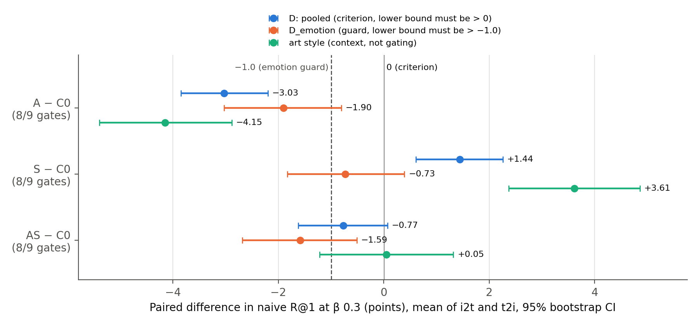
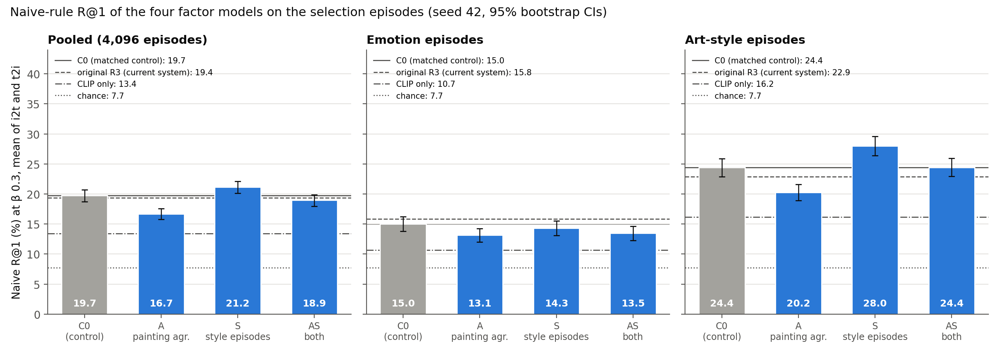
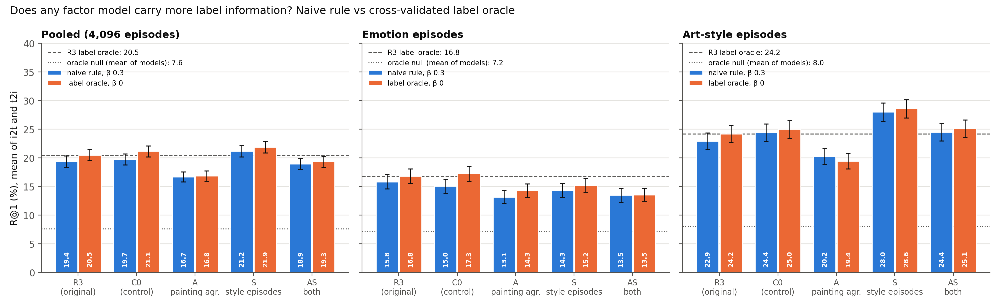
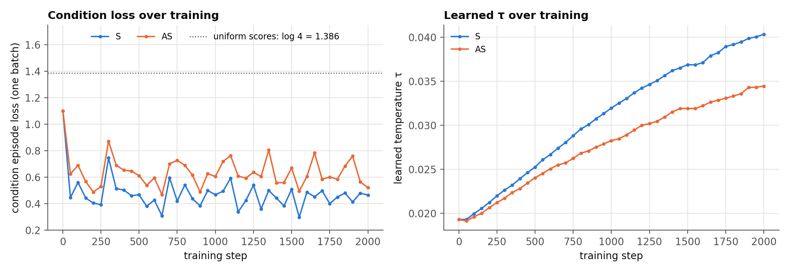
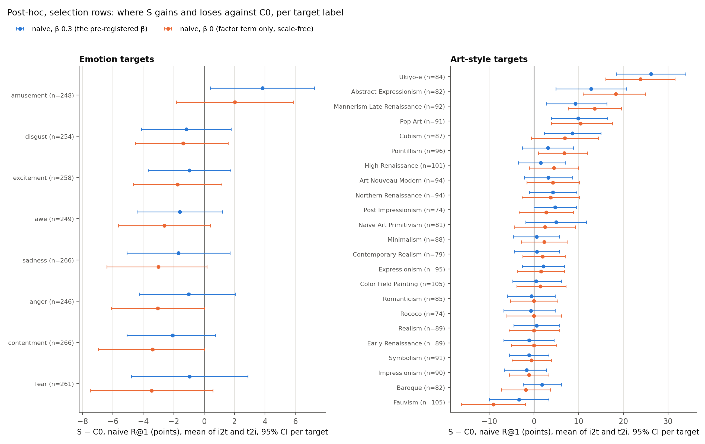

# CoSiR v2 Candidate A: condition-aware factor learning, 2×2 selection

## Verdict

**Stop: no cell qualifies under the pre-registered rule, so no cell goes forward and the held test is not
run.** We trained four factor models on scorer-train rows (seed 42, 2,000 steps each) and compared each change
with the matched control C0 on the stage-(d) selection label episodes. The criterion is `D`, the change over
C0 in R@1 (the share of episodes where the one correct candidate out of 13 ranks first) when the factor
weights come from the parameter-free naive rule at β 0.3, pooled over emotion and art style and averaged over
the two retrieval directions. A cell qualifies only if it passes all nine collapse gates (checks that the
factor space has not collapsed, listed below), the 95% CI of `D` lies above 0, and the lower bound of the
emotion-only difference `D_emotion` lies above −1.0. All terms are defined in "What we tested".

| Cell | What changed vs C0 | Gates | `D` (points) | `D_emotion` (points) | Qualifies |
|---|---|---:|---:|---:|---|
| C0 | nothing (matched control) | **9/9** | (baseline) | (baseline) | (control) |
| A | painting-level agreement | 8/9 (readout) | −3.03 [−3.85, −2.20] | −1.90 [−3.03, −0.81] | no: gate, `D`, guard |
| S | CLIP-image-cluster condition episodes | 8/9 (sparsity) | **+1.44 [+0.61, +2.26]** | −0.73 [−1.83, +0.39] | no: gate, guard |
| AS | both | 8/9 (readout) | −0.77 [−1.62, +0.07] | −1.59 [−2.69, −0.51] | no: gate, `D`, guard |

In plain terms:

- **The setup is sound.** C0 passes all nine gates and scores 19.71% naive R@1, level with the current system
  (original R3, 19.36%; difference +0.35 [−0.34, +1.04]).
- **The style signal works, but at a price.** S is the only cell that beats C0: +1.44 points pooled, all of it
  from art style (+3.61 [+2.37, +4.86]), mostly in text→image retrieval. It fails the rule twice. Its caption
  codes are denser than the cap allows (active fraction 0.559 against 0.50). And its emotion difference at β 0.3,
  −0.73 [−1.83, +0.39], is not significantly negative, but the interval reaches below −1.0, so the guard could
  not show that emotion stayed within a point of C0 (at this sample size the guard had little power; see
  Caveats). Either failure alone stops S. The clearer evidence of an emotion cost does not depend on the codes'
  scale: with the factor term alone (β 0), S is −2.10 [−3.27, −0.90] against C0 on emotion under the naive rule
  (−2.10 in each retrieval direction) and −2.10 [−3.30, −0.83] under the label oracle.
- **Painting-level agreement, in the form tested here, does not free emotion.** A is worse than C0 on both labels
  (emotion −1.90, style −4.15). A post-hoc probe finds that A's caption codes carry less emotion than C0's even
  in their within-painting variation, where the hypothesis expected more (30.9% against 35.6%, majority 28.4%).
  The test was not clean: A kept the graph term, every same-painting pair of rows is a graph edge, and so the
  graph term still pulled a painting's caption codes toward each other (54.9% of its positive pairs in the
  shared sampler's batches are same-painting pairs). The hypothesis is not supported, but this cell did not
  remove the whole constraint the hypothesis blames.
- **Combining the two cancels the style gain.** AS loses the style gain (+0.05) and keeps an emotion loss (−1.59).

Per spec §6 this ends the experiment at the selection stage. Replication (seeds 43 and 44) and the held test
are not run, and the held rows were not read. The post-hoc diagnostics below were computed after the verdict
and informed none of it. The options for what comes next, with their costs, are listed under "Next steps"; the
choice is the user's.

*Figure 1. Paired differences to C0 in naive R@1 at β 0.3 (R@1 points, mean of image→text and text→image), with
95% bootstrap CIs over episodes. Blue: `D`, the criterion (pooled over 4,096 episodes; its lower bound must
exceed 0). Orange: `D_emotion`, the guard (2,048 emotion episodes; its lower bound must exceed −1.0). Green: the
art-style difference, shown for context and not part of the rule. The row labels give each cell's gate count.*

## What we tested

**The task.** Candidate A scores an image and a caption under a condition given by examples: 4 **supports**
that have the condition and 4 **contrasts** that do not. Each image and caption has a 32-number non-negative
**code** from a small encoder on frozen CLIP ViT-B/32 features (the **factors**). The **naive rule** turns the
examples into factor weights with no parameters: `w = ReLU(mean support pair code − mean contrast pair code)`,
L1-normalized, where a pair code is the mean of a row's image and caption codes. A query `q` and a candidate
`c` then score `β · cos(CLIP_q, CLIP_c) + Σ_l w_l q_l c_l`. **β** weighs plain CLIP similarity against the
condition-weighted factor term and was fixed at 0.3 before the run.

**Episodes.** For a target label (one emotion or one art style), an episode has an anchor with the label, 4
supports and 4 contrasts, and 13 candidates: 1 positive with the label and 12 negatives from paintings never
given it. **R@1** is the share of episodes where the positive ranks first (chance 7.69%). **i2t** uses the
anchor's image as the query and ranks captions; **t2i** uses its caption and ranks images. We used stage (d)'s
2,048 emotion episodes (8 target emotions) and 2,048 art-style episodes (23 target styles) on the selection
rows. Their SHA-256s were asserted equal to stage (d)'s, and every episode row was asserted to be a selection
row.

**Rows.** The 216,107 train rows were split by painting into **scorer-train** (183,694 rows) and **selection**
(32,413 rows, 6,451 paintings). All four models trained on scorer-train rows only; the content graph, the
condition partition and every gate fit used scorer-train rows; all metrics used selection rows. Val and held
rows were never read.

**The four cells** (spec §4). All start from R3's recipe (`R3_CONFIG`: 32 factors, InfoNCE agreement,
decorrelation, 2,000 Adam steps, seed 42) with one shared batch sampler that adds every scorer-train row of each
sampled painting (about 9,300 rows per step).

| Cell | Agreement term | Condition loss | Role |
|---|---|---|---|
| C0 | per pair: InfoNCE between each image and its own caption, same-painting negatives masked | none | matched control |
| A | per painting: InfoNCE between a painting's image code and the mean code of its captions | none | agreement hypothesis |
| S | per pair | 64 episodes per step from CLIP image k-means (64 clusters), naive rule at β 0.3, learnable τ | style signal |
| AS | per painting | as S | both |

The **agreement hypothesis** was that per-pair agreement pulls every caption code toward its painting's single
image code and so keeps caption-only information such as emotion out of the factors. The **style signal** was
that CLIP image clusters, the one label-free partition known to line up with art style (adjusted mutual
information 0.32 in the [headroom probe](2026-10-15_candidate_a_factor_headroom_probe.md)), can train the
factors toward conditions people ask for.

**Collapse gates.** Nine pass/fail checks on a factor space from the R3 repair, with the amended thresholds of
2026-09-29: participation ratio ≥ 8, maximum factor correlation ≤ 0.90, linear readout of CLIP features no worse
than R0's on the same rows, active fraction ≤ 0.50, no dead factors, at most one modality-private factor, top-2
usage share ≤ 0.20, community spanning ≥ 0.75, and code pair retrieval at least half of CLIP's.

**The label oracle** is a diagnostic, not a method: it fits one weight vector per label on half of that label's
episodes and ranks the other half (2 folds, 200 steps), which measures how much label information a code
carries whatever the weighting rule. Its **null** declares a random negative the positive and should sit at
chance.

**Ties.** All ranks are tie-aware, the project's convention: a positive tied with another candidate gets a rank
of at least 1.5, and R@1 needs rank 1, so a tie counts as a miss.

**Where and how long.** Everything ran on the local RTX 3090. The Task 3 timing smoke projected 8.2 to 9.2
minutes per sequential run and a 3.9 GiB peak. C0, A and S then trained as three parallel processes in 11.1 to
11.3 minutes each. AS was launched in parallel too but ran out of GPU memory at start-up (four processes
reserved more memory than their 3.9 GiB allocated peak suggested), so we reran the same command alone once the
others finished; it took 8.8 minutes. The evaluation took 104 seconds.

## Result 1: the rule, recomputed by hand

The rule (spec §6) has three steps. **Eligible:** all nine gates pass. **Qualifies:** eligible, the lower
bound of `D` > 0, and the lower bound of `D_emotion` > −1.0. **Pick:** the highest `D`, with a 0.5-point tie
band resolved toward fewer changes.

| Cell | All gates pass | `D` lower bound > 0 | `D_emotion` lower bound > −1.0 | Qualifies |
|---|---|---|---|---|
| A | no (readout) | no (−3.85) | no (−3.03) | no |
| S | no (sparsity) | **yes (+0.61)** | no (−1.83) | no |
| AS | no (readout) | no (−1.62) | no (−2.69) | no |

C0 passed every gate, so the first stop point (a broken setup) did not fire. No cell qualifies, so the second
stop point fired. The outcome does not hinge on the gates: with the gates ignored, S would still fail the
emotion guard, and A and AS would still fail on `D`. The rule's own code (`apply_rule`) returned the same
outcome, after its five hand-checked cases passed.

## Result 2: naive R@1 per model, label and direction

*Figure 2. Naive-rule R@1 at β 0.3 (mean of the two directions) for the four cells, with 95% bootstrap CIs. Gray
bar and solid line: C0. Dashed line: original R3, the current system. Dash-dot line: CLIP only. Dotted line:
chance.*

Naive R@1 (%) at β 0.3 with 95% CIs for the mean of directions. C0 is the criterion's baseline; original R3
(stage (d)'s checkpoint, trained on all train rows with the original sampler) is the current system.

| Model | Pooled i2t | Pooled t2i | **Pooled mean** | Emotion i2t | Emotion t2i | **Emotion mean** | Style i2t | Style t2i | **Style mean** |
|---|---:|---:|---:|---:|---:|---:|---:|---:|---:|
| CLIP only | 12.18 | 14.67 | 13.43 [12.65, 14.23] | 9.57 | 11.77 | 10.67 | 14.79 | 17.58 | 16.19 |
| original R3 | 18.36 | 20.36 | 19.36 [18.35, 20.35] | 16.50 | 15.14 | 15.82 | 20.21 | 25.59 | 22.90 |
| **C0** | 18.04 | 21.39 | **19.71** [18.74, 20.68] | 14.40 | 15.67 | **15.04** | 21.68 | 27.10 | **24.39** |
| A | 15.99 | 17.38 | 16.69 [15.80, 17.57] | 12.65 | 13.62 | 13.13 | 19.34 | 21.14 | 20.24 |
| S | 18.70 | 23.61 | **21.15** [20.15, 22.13] | 14.36 | 14.26 | 14.31 | 23.05 | 32.96 | **28.00** |
| AS | 17.33 | 20.56 | 18.95 [17.98, 19.87] | 12.99 | 13.92 | 13.45 | 21.68 | 27.20 | 24.44 |

Paired differences to C0 per label and direction (R@1 points, 95% CI):

| Cell | Emotion i2t | Emotion t2i | Style i2t | Style t2i |
|---|---:|---:|---:|---:|
| A | −1.76 [−3.22, −0.24] | −2.05 [−3.56, −0.54] | −2.34 [−4.00, −0.68] | −5.96 [−7.67, −4.25] |
| S | −0.05 [−1.56, +1.46] | −1.42 [−2.93, +0.10] | +1.37 [−0.24, +2.98] | **+5.86 [+4.05, +7.67]** |
| AS | −1.42 [−2.93, +0.10] | −1.76 [−3.22, −0.39] | +0.00 [−1.76, +1.71] | +0.10 [−1.66, +1.81] |

**Reading.** S's whole gain sits in one cell of this table: art style, text→image (+5.86). There the candidates
are images, and the headroom probe found that art style is read from the image (linear probe 59.8%) far better
than from the caption (26.0%). A condition loss built on CLIP image clusters therefore sharpened exactly the
side that carries style.

S's emotion difference looks one-sided at β 0.3 (−0.05 image→text, −1.42 text→image), but that pattern comes
from how C0 responds to β, not from S's code. With the factor term alone (β 0), S loses the same amount in both
directions, and the label oracle puts more of the loss on the image→text side:

Emotion R@1 (%) per direction for C0 and S, with S − C0 (paired, 95% CI). From the stored β-grid and oracle
results.

| | Naive β 0, i2t | Naive β 0, t2i | Naive β 0.3, i2t | Naive β 0.3, t2i | Oracle β 0, i2t | Oracle β 0, t2i |
|---|---:|---:|---:|---:|---:|---:|
| C0 | 15.92 | 15.87 | 14.40 | 15.67 | 17.14 | 17.38 |
| S | 13.82 | 13.77 | 14.36 | 14.26 | 14.45 | 15.87 |
| S − C0 | −2.10 [−3.66, −0.49] | −2.10 [−3.71, −0.54] | −0.05 [−1.56, +1.46] | −1.42 [−2.93, +0.10] | −2.69 [−4.25, −1.12] | −1.51 [−3.22, +0.25] |

From β 0 to β 0.3, C0's image→text emotion R@1 falls by 1.52 points (15.92 to 14.40) while S's rises by 0.54
(13.82 to 14.36), which closes the image→text gap; in text→image both move by less than half a point, so that
gap stays. The emotion cost of S's code is therefore not confined to text→image, where image candidates carry
little emotion; at β 0 it is at least as large on caption candidates.

For A, the largest loss is style text→image (−5.96), the mirror image of S's gain. There the query is a caption
and the candidates are images, so both of A's codes enter the score. The post-hoc probes (diagnostic 1 below)
confirm that A's image codes hold less style than C0's (linear probe 39.8% against 45.5%). Both of A's emotion
directions also fell, which is the opposite of what the agreement hypothesis predicted for caption candidates
(image→text).

**Against the current system.** C0 itself is level with original R3 overall (+0.35 [−0.34, +1.04]), slightly
better on style (+1.49 [+0.46, +2.49]) and slightly worse on emotion (−0.78 [−1.73, +0.20]). So the new sampler
and the smaller training set did not move the baseline much, and the control is a fair stand-in for R3. S
against R3 is +1.79 [+0.93, +2.65] pooled: +5.10 [+3.76, +6.35] on style and −1.51 [−2.64, −0.39] on emotion.

## Result 3: the gates

Values on selection rows (fit on scorer-train rows); image / caption where the gate has two sides.

| Gate (threshold) | original R3 | C0 | A | S | AS |
|---|---:|---:|---:|---:|---:|
| participation ratio (≥ 8) | 21.8 / 20.8 | 22.1 / 21.1 | 25.3 / 27.7 | 20.0 / 18.3 | 22.5 / 25.1 |
| max factor correlation (≤ 0.90) | 0.446 | 0.547 | 0.254 | 0.560 | 0.462 |
| readout rel. L2 (≤ R0: 0.4930 / 0.4691) | 0.4789 / 0.4611 | 0.4804 / 0.4625 | **0.5000 / 0.4713 fail** | 0.4732 / 0.4612 | 0.4899 / **0.4699 fail** |
| active fraction (≤ 0.50) | 0.453 / 0.485 | 0.419 / 0.479 | 0.271 / 0.178 | 0.424 / **0.559 fail** | 0.297 / 0.247 |
| dead factors (0) | 0 | 0 | 0 | 0 | 0 |
| modality-private factors (≤ 1) | 0 | 0 | 0 | 0 | 0 |
| top-2 usage share (≤ 0.20) | 0.079 | 0.078 | 0.083 | 0.081 | 0.078 |
| community spanning (≥ 0.75) | 1.000 | 1.000 | 0.875 | 1.000 | 0.906 |
| pair retrieval / CLIP (≥ 0.5) | 1.194 | 1.116 | 0.875 | 1.071 | 0.934 |
| **gates passed** | **9/9** | **9/9** | 8/9 | 8/9 | 8/9 |

**Why each cell failed.**

- **S, sparsity.** Only the caption side became denser: 55.9% of caption factors are active per row, against
  47.9% for C0, while the image side is unchanged (42.4% against 41.9%). A plausible reading, which we did not
  test: the style conditions are defined by image clusters, which captions express only weakly, and a caption
  code that spreads over more factors scores higher under more weight vectors.
- **A, readout.** A's codes reconstruct CLIP features worse than R0's collapsed codes (image 0.5000 against
  0.4930). They are also much sparser (27% / 18% active), more spread out (participation ratio 25 / 28) and less
  correlated (0.254), and they match an image to its own caption less well than C0's (pair retrieval 0.875 of
  CLIP against 1.116). The code is spread thin: many weakly used factors carrying less of CLIP.
- **AS, readout, by a small margin.** The caption readout misses R0's level by 0.0008 (0.4699 against 0.4691).
  This fail is marginal, but it does not change the outcome, because AS also fails on `D` and on the guard.

## Result 4: the label oracle (does any cell carry more label information?)

*Figure 3. Naive rule at β 0.3 (blue) and the cross-validated label oracle at β 0 (orange), mean of the two
directions, with 95% CIs. Dashed line: original R3's oracle. Dotted line: the oracle null, averaged over
models.*

R@1 (%), mean of the two directions, 95% CIs. R3's oracle at β 0 (20.47%) is the value the headroom probe
reported as 20.5%. The column "oracle β 0 − own naive β 0.3" mixes two β values, as stage (d) and the probe
reported it; the column "same β 0.3" compares like with like (post-hoc, from the stored ranks).

| Model | Naive, β 0.3 | Oracle, β 0.3 | **Oracle, β 0** | Oracle β 0: emotion | Oracle β 0: style | Null, β 0 | Oracle β 0 − own naive β 0.3 (mixed β) | Oracle − own naive, same β 0.3 | Oracle β 0 − R3 oracle β 0 |
|---|---:|---:|---:|---:|---:|---:|---:|---:|---:|
| original R3 | 19.36 | 19.73 | **20.47** [19.49, 21.47] | 16.77 | 24.17 | 7.54 | +1.11 [+0.23, +2.04] | +0.37 [−0.50, +1.23] | (reference) |
| C0 | 19.71 | 20.25 | 21.12 [20.13, 22.09] | 17.26 | 24.98 | 7.75 | +1.40 [+0.54, +2.30] | +0.54 [−0.32, +1.37] | +0.65 [−0.12, +1.44] |
| A | 16.69 | 17.66 | 16.83 [15.93, 17.74] | 14.26 | 19.41 | 7.62 | +0.15 [−0.67, +0.93] | +0.98 [+0.24, +1.71] | −3.64 [−4.55, −2.73] |
| S | 21.15 | 21.29 | **21.86** [20.86, 22.86] | 15.16 | 28.56 | 7.52 | +0.71 [−0.16, +1.61] | +0.13 [−0.73, +1.03] | **+1.39 [+0.51, +2.28]** |
| AS | 18.95 | 18.93 | 19.34 [18.37, 20.29] | 13.55 | 25.12 | 7.53 | +0.39 [−0.40, +1.23] | −0.01 [−0.78, +0.76] | −1.14 [−2.05, −0.23] |

**Reading.** Only S raises the oracle above R3's, by +1.39 points, and the split shows where it came from:
style +4.39 [+2.98, +5.74] and emotion −1.61 [−2.76, −0.44] against R3's oracle. Against C0's oracle, S is
+0.74 [−0.17, +1.64] pooled, with style +3.59 [+2.20, +4.93] and emotion −2.10 [−3.30, −0.83]. So S's code did
not gain label information usable by the cross-modal score overall; it **traded emotion for style**. The
naive-rule results in Result 2 are therefore a property of the code, not of the weighting.

A's oracle is 4.28 points below C0's at β 0 (−4.28 [−5.19, −3.39]). Two things limit what this shows alone. The
oracle ranks through the product of image and caption codes, so it measures label information usable by the
cross-modal score, and A's codes also match an image to its own caption less well than C0's (pair retrieval
0.875 of CLIP against 1.116). A lower oracle alone therefore does not show that the code holds less label
information; the per-modality probes in diagnostic 1 show that it does (caption→emotion −7.5 points,
image→style −5.7). Ties also count as misses, and A's sparse codes tie often at β 0. The effect is small
for the naive rule (A's β-0 naive R@1 is 16.38% as scored and 16.62% with ties broken at random), and at
β 0.3, where no model has ties, A's oracle is still 2.59 points below C0's (17.66% against 20.25%;
−2.59 [−3.43, −1.73]).
Every model stays far below the 49.8% ceiling of the probe's label-aligned code.

Pooled, the naive rule extracts nearly all the label information the oracle can use: at the same β the oracle
beats each model's own naive rule by at most 1.0 point (A at β 0.3, +0.98 [+0.24, +1.71]; at β 0 the largest
is R3's +0.89), and by at most 1.4 in the mixed-β column. Per label this does not always hold: on emotion,
C0's oracle beats its naive rule by +1.37 [+0.07, +2.64] at β 0 (S's by +1.37 [+0.10, +2.64]), and C0's by
+2.22 [+1.03, +3.47] in the mixed-β comparison. Every null sits at chance (7.52% to 7.75% against 7.69%), so
the oracle does not fit noise.

## Result 5: the β grid (is a gain a code-scale effect?)

Because the factor codes' scale is learned, a larger code makes the factor term outweigh `0.3 · cos`, which acts
like a smaller β (spec §5). We measured this directly as the ratio of the two terms' spread across the 13
candidates at β 0.3, averaged over episodes.

| Model | Code RMS (scorer-train) | Factor term / (0.3 · cos term), spread ratio | Mean active weights per episode |
|---|---:|---:|---:|
| original R3 | 0.315 | 4.43 | 15.7 of 32 |
| C0 | 0.268 | 3.39 | 15.6 |
| A | 0.205 | 1.79 | 14.6 |
| S | 0.325 | **5.16** | 15.6 |
| AS | 0.224 | 2.44 | 15.0 |

S's codes are 21% larger than C0's (RMS 0.325 against 0.268). The spread ratio measures what that does to the
balance of the score: C0's ratio is 0.66 of S's (3.39 / 5.16), so at β 0.3 the CLIP term weighs about a third
less against the factor term for S than for C0. Naive R@1 (%) on the β grid, mean of directions,
pooled / emotion / style:

| Model | β 0 | β 0.03 | β 0.1 | **β 0.3** | β 1 |
|---|---|---|---|---|---|
| original R3 | 19.58 / 16.19 / 22.97 | 19.58 / 16.14 / 23.02 | 19.71 / 16.43 / 23.00 | 19.36 / 15.82 / 22.90 | 18.40 / 14.16 / 22.63 |
| C0 | 20.25 / 15.89 / 24.61 | 20.09 / 15.58 / 24.61 | 20.13 / 15.58 / 24.68 | 19.71 / 15.04 / 24.39 | 18.36 / 13.40 / 23.32 |
| A | 16.38 / 13.50 / 19.26 | 16.87 / 13.77 / 19.97 | 16.70 / 13.31 / 20.09 | 16.69 / 13.13 / 20.24 | 16.08 / 12.08 / 20.07 |
| S | 21.14 / 13.79 / 28.49 | 21.06 / 13.84 / 28.27 | 21.24 / 14.18 / 28.30 | 21.15 / 14.31 / 28.00 | 20.36 / 13.26 / 27.47 |
| AS | 19.04 / 13.67 / 24.41 | 19.14 / 13.82 / 24.46 | 19.09 / 13.77 / 24.41 | 18.95 / 13.45 / 24.44 | 18.02 / 12.45 / 23.58 |

S − C0 at the same β (paired, R@1 points, 95% CI; context, not part of the rule):

| β | Pooled | Emotion | Style |
|---:|---:|---:|---:|
| 0 | +0.89 [+0.00, +1.76] | −2.10 [−3.27, −0.90] | +3.88 [+2.56, +5.18] |
| 0.03 | +0.96 [+0.09, +1.84] | −1.73 [−2.88, −0.56] | +3.66 [+2.37, +4.93] |
| 0.1 | +1.11 [+0.26, +1.97] | −1.39 [−2.54, −0.22] | +3.61 [+2.32, +4.91] |
| **0.3** | **+1.44 [+0.61, +2.26]** | **−0.73 [−1.83, +0.39]** | +3.61 [+2.37, +4.86] |
| 1 | +2.00 [+1.28, +2.72] | −0.15 [−1.05, +0.76] | +4.15 [+3.03, +5.27] |

**Reading.** At β 0 the ranking uses the factor term alone and does not depend on the codes' overall scale, so
a difference there is a property of the code. S's style gain is +3.88 at β 0, a little larger than at β 0.3:
it is **in the code, not a β effect**. S's emotion loss is largest at β 0 (−2.10) and shrinks as β grows,
because the CLIP term masks part of what the code lost. The pooled gain therefore grows with β. Even at β 1 the
emotion difference (−0.15 [−1.05, +0.76]) would sit just below the guard's bound, and β 1 lowers every model's
R@1; in any case, choosing β after seeing the results is what the pre-registration rules out. A is worse than
C0 at every β (−3.87 at β 0 to −2.28 at β 1), so its loss is not a scale artefact either, even though its codes
are the smallest.

**Balance-matched comparison (post-hoc, selection rows, informed no pre-registered decision).** How much of `D`
comes from S's larger codes? We matched the balance of the two score terms in two ways: C0 at the β where its
spread ratio equals S's at β 0.3 (β = 0.3 × 3.39 / 5.16 = 0.197), and S at the β where its ratio equals C0's at
β 0.3 (0.457). Each comparison was estimated twice: by linear interpolation of R@1 in β between the two
neighbouring stored grid points, and by re-scoring the same episodes at the matched β with the same naive
weights (the weights do not depend on β; the re-scoring code reproduces the stored β-0.3 ranks exactly).

S − C0, naive R@1 points, mean of directions (95% CI where the episodes were scored).

| Comparison | Method | Pooled | Emotion | Art style |
|---|---|---:|---:|---:|
| both at β 0.3 (the pre-registered `D`) | stored | +1.44 [+0.61, +2.26] | −0.73 [−1.83, +0.39] | +3.61 [+2.37, +4.86] |
| S at β 0.3, C0 at β 0.197 | interpolated | +1.23 | −1.01 | +3.46 |
| S at β 0.3, C0 at β 0.197 | re-scored | +1.05 [+0.18, +1.89] | −1.17 [−2.27, −0.05] | +3.27 [+2.03, +4.54] |
| S at β 0.457, C0 at β 0.3 | interpolated | +1.26 | −0.97 | +3.49 |
| S at β 0.457, C0 at β 0.3 | re-scored | +1.15 [+0.34, +1.94] | −1.07 [−2.15, +0.00] | +3.37 [+2.15, +4.57] |
| both at β 0 (scale-free) | stored | +0.89 [+0.00, +1.76] | −2.10 [−3.27, −0.90] | +3.88 [+2.56, +5.18] |

Interpolation puts the share of `D` due to the scale difference at 12 to 15%; re-scoring, which is exact at the
matched β, puts it at 20 to 27% (`D` +1.05 to +1.15 instead of +1.44). A little over half of that share comes
from the CLIP term masking part of the emotion loss (emotion −1.07 to −1.17 when matched, against −0.73), the
rest from a slightly larger style difference at β 0.3 (+3.61 against +3.27 to +3.37). The style gain itself
does not come from scale: it is largest at β 0 (+3.88), where scale plays no role. With the balance matched,
S still beats C0 pooled, and its emotion point estimate falls just below −1.0.

## Result 6: the condition loss and τ over training

*Figure 4. The condition episode loss on the current batch (logged every 50 steps; one batch of 64 episodes, so
noisy) and the learned softmax temperature τ, for the two cells with the condition loss. With 4 positives among
16 candidates, uniform scores give log 4 = 1.386.*

| Cell | Loss at step 1 | Mean of logged steps 50 to 500 | Mean of the last 10 logged steps (1,550 to 2,000) | τ at step 1 | Final τ |
|---|---:|---:|---:|---:|---:|
| S | 1.100 | 0.494 | 0.443 | 0.0193 | 0.0403 |
| AS | 1.100 | 0.638 | 0.619 | 0.0193 | 0.0345 |

Each logged loss is one batch of 64 episodes, so the table averages ten logged steps (the single-batch values
at step 2,000 are 0.466 and 0.522). The condition loss fell from 1.10 to about 0.45 (S) and 0.63 (AS) by step 50
and then declined only slightly, with a lot of batch-to-batch noise. AS stayed above S at every logged step
after the first: with painting-level agreement, the codes fit the style episodes less well. τ rose steadily and
had not levelled off at step 2,000. τ does not change rankings; a rising τ with a flat loss means the score gaps
grew at the same rate, which matches S's larger code scale (Result 5). The loss curve suggests most of the
condition loss's effect on the fit was reached early, but it does not show whether the ranking effects (the
style gain, the emotion loss) were still growing.

## Post-hoc diagnostics (selection rows)

Everything in this section was computed after the verdict by `run_posthoc.py`. It is post-hoc, on selection
rows, and informed no pre-registered decision. Nothing was retrained: the only fitted models are diagnostic
multinomial logistic probes on standardized codes (C 1.0), fit on scorer-train rows and scored on selection
rows, as in the headroom probe. Labels are used only to fit or score these diagnostics. Val and held rows were
never read (asserted). Two more post-hoc pieces appear above: the per-direction emotion table (Result 2) and the
balance-matched comparison (Result 5). Differences to C0 on row-level accuracies carry 95% CIs from resampling
selection paintings (2,000 resamples), since rows of one painting share an image.

### 1. What each modality's code holds

Top-1 accuracy (%) of a linear probe that reads a label from one modality's 32-number code. In brackets: the
difference to C0 in points. Majority baselines: 28.40% for emotion, 15.97% for art style. The same probes on raw
512-d CLIP features (headroom probe) reach 57.9% (caption→emotion), 59.8% (image→style), 26.0%
(caption→style) and 35.2% (image→emotion).

| Model | Caption → emotion | Image → art style | Caption → art style | Image → emotion |
|---|---:|---:|---:|---:|
| original R3 | 46.28 (+0.51 [+0.15, +0.85]) | 45.46 (−0.08 [−1.09, +0.93]) | 25.05 (−0.07 [−0.38, +0.24]) | 34.81 (+0.19 [−0.14, +0.49]) |
| **C0** | **45.77** | **45.53** | **25.12** | **34.63** |
| A | 38.28 (−7.49 [−7.96, −7.01]) | 39.82 (−5.72 [−6.84, −4.65]) | 23.74 (−1.39 [−1.78, −0.96]) | 33.79 (−0.84 [−1.21, −0.45]) |
| S | 45.63 (−0.15 [−0.56, +0.26]) | 47.36 (+1.83 [+0.77, +2.87]) | 25.18 (+0.05 [−0.27, +0.41]) | 34.14 (−0.49 [−0.84, −0.13]) |
| AS | 41.60 (−4.17 [−4.61, −3.72]) | 43.91 (−1.63 [−2.74, −0.54]) | 24.48 (−0.64 [−0.99, −0.28]) | 34.12 (−0.51 [−0.84, −0.14]) |

**Reading.**

- **A's codes hold less of both labels**, in the modality that carries each: caption→emotion −7.5 points and
  image→style −5.7. So A's losses are not only a matter of weaker image-caption alignment. Its image codes did
  lose style information, which supports the reading of A's text→image style loss in Result 2.
- **S's caption codes hold as much emotion as C0's** (45.6% against 45.8%), and its image codes a little more
  style (+1.8). S's emotion cost at β 0 is therefore not emotion pushed out of the caption code; it is a loss in
  what the image-caption factor product can use. If S's emotion loss is a trade within the 32-factor budget, the
  trade is in which factors the two modalities share, not in what the caption code holds.
- Every code, R3's included, sits about 12 points below raw CLIP on caption→emotion and 14 points below on
  image→style. No cell narrowed that gap by more than 2 points.

### 2. Within-painting caption variation: the direct test of the agreement mechanism

The agreement hypothesis says per-pair agreement pulls a painting's caption codes toward its single image code
and so removes the within-painting caption variation, which carries emotion. Painting-level agreement (A) should
then leave more emotion in that variation. For each row we took the caption code minus the mean caption code of
the same painting's rows in the same part (scorer-train rows for the fit, selection rows for the score;
paintings with at least 2 rows, which is 183,692 and 32,413 rows) and fit the same emotion probe on it.

| Code | Residual → emotion (%) | Difference to C0 | Within-painting share of caption variance |
|---|---:|---:|---:|
| raw CLIP captions (512-d) | 46.98 | | 0.656 |
| original R3 | 35.89 | +0.26 [−0.08, +0.61] | 0.447 |
| **C0** | **35.62** | | **0.447** |
| A | 30.95 | −4.68 [−5.08, −4.26] | 0.525 |
| S | 34.60 | −1.02 [−1.40, −0.65] | 0.445 |
| AS | 32.73 | −2.89 [−3.29, −2.51] | 0.494 |

Majority baseline 28.40%. The CLIP row reproduces the headroom check's 47.0%.

**Reading.** Painting-level agreement did loosen the caption codes within a painting: 52.5% of A's caption-code
variance is within paintings, against 44.7% for C0. But that extra variation carries less emotion, not more:
30.9% against 35.6%, close to the 28.4% majority. This is the most direct evidence against the hypothesis in
the form tested. It does not rule out a version without the graph term's same-painting pull (next diagnostic),
but it gives no sign that such a version would help.

### 3. The graph term kept part of the constraint

Every one of the 386,439 same-painting row pairs among scorer-train rows is an edge of the content graph (they
make up 20.6% of its 1,873,347 edges): images are identical within a painting, and the graph links mutual nearest
neighbours in CLIP. The graph term, weight 1.0 in every cell, raises the cosine between neighbours' pair codes;
within a painting the image codes are identical, so it pulls the painting's caption codes toward each other. We
replayed the sampler of the first 50 training steps exactly. The shared painting sampler raised the same-painting
share of the graph term's positive pairs from 18.4% (the edge-sampled rows alone; 16.8% to 21.2% across batches)
to 54.9% (53.1% to 56.6%). In A, therefore, more than half of the graph term's pull was the within-painting
homogenization that the hypothesis blames on per-pair agreement. A removed the per-pair constraint but kept a
similar one, and the shared sampler gave it more weight than the edge sampler alone would have.

### 4. What each code's main factor lines up with

Adjusted mutual information (AMI) between each row's strongest factor (the argmax of its pair code, 32 groups)
and three partitions: the CLIP image clusters (stage (d)'s 64 k-means groups, which label scorer-train rows only,
so this column uses scorer-train rows), art style and emotion (selection rows).

| Model | CLIP image clusters (scorer-train) | Art style | Emotion |
|---|---:|---:|---:|
| original R3 | 0.347 | 0.135 | 0.055 |
| **C0** | **0.349** | **0.143** | **0.055** |
| A | 0.294 | 0.120 | 0.052 |
| S | 0.423 | 0.187 | 0.050 |
| AS | 0.354 | 0.151 | 0.056 |

For reference, the CLIP image clusters themselves reach 0.318 with art style and 0.035 with emotion.

**Reading.** S learned the clusters: its strongest factor lines up with them 0.074 more than C0's. Its style
alignment rose as well (+0.044), by more in relative terms (31% against 21%), and its emotion alignment fell
slightly. So the condition loss moved the factors toward the clusters, and the style content of the clusters
came along. S's strongest factor is still far less style-aligned than the clusters themselves (0.187 against
0.318), consistent with clusters that mix content and style. A's factors line up less with everything.

### 5. Where S gains and loses, per target

*Figure 5. Post-hoc: S − C0 in naive R@1 per target label (mean of the two directions, 95% bootstrap CI within
each target) at β 0.3 (blue) and β 0 (orange); n is the number of episodes per target. Targets are sorted by
the β-0 difference.*

- **Emotion: spread across emotions.** At β 0, seven of eight emotions are worse under S, by 1.4 to 3.5 points
  each; contentment, fear, sadness, anger and awe each contribute 15% to 21% of the total loss. Only amusement
  improves (+2.0 at β 0, +3.83 [+0.40, +7.26] at β 0.3). With about 250 episodes per emotion, no single
  interval lies clearly below zero. The label oracle at β 0 concentrates the loss more: fear −7.66
  [−11.69, −3.45] and sadness −5.83 [−9.59, −2.26] account for 83% of it.
- **Style: concentrated in a few visually distinctive styles.** At β 0.3, 17 of 23 styles gain, and five account
  for 78% of the total gain: Ukiyo-e (+26.19 [+18.45, +33.93], 30% of the total on its own), Abstract
  Expressionism (+12.80), Pop Art (+9.89), Mannerism (+9.24) and Cubism (+8.62). Fauvism is the one clear loss,
  at β 0 (−9.05 [−16.19, −1.90]). This fits a signal built from image clusters: styles with a distinctive look
  form clusters of their own.

## What this means

1. **The style signal does what it was built to do, at a cost in emotion.** Training on CLIP image clusters
   moved the factors toward those clusters and toward art style (+3.61 naive and +3.59 oracle against C0; the
   strongest factor's AMI with style 0.187 against 0.143), which is consistent with the probe's alignment measure
   (AMI 0.32) pointing at usable signal. The gain is concentrated in a few visually distinctive styles. The
   emotion cost is clear where the codes' scale plays no role: −2.10 at β 0 under both the naive rule and the
   oracle, and under the naive rule in each direction and in seven of eight emotions. At the pre-registered
   β 0.3 the CLIP term masks part of it.
   A linear probe still reads emotion from S's caption codes as well as from C0's, so what S lost is emotion
   information the image-caption product can use. As the design expected, a style-aligned signal alone does not
   improve emotion.
2. **Relaxing per-pair agreement did not put emotion into the codes, but the test kept part of the constraint.**
   Painting-level agreement loosened the caption codes within a painting, yet that variation carries less
   emotion than C0's (30.9% against 35.6%), and A's codes hold less of both labels overall. The graph term,
   unchanged in A, still pulled same-painting caption codes together (more than half of its positive pairs in
   the shared sampler's batches), so the experiment did not test relaxed agreement alone. The hypothesis may
   still explain part of why R3 lacks emotion, but nothing here suggests that relaxing agreement is enough to
   put emotion in.
3. **The limit identified by stage (d) and the probe still holds.** Pooled and at the same β, every oracle stays
   within 1.0 point of its own naive rule and far below the 49.8% ceiling. What the factors carry, not how they
   are weighted, sets the result. The exception is small and label-specific: on emotion at β 0, the oracle beats
   the naive rule by +1.37 points for both C0 and S.

## Next steps (the user's decision)

- **(a) Close this line.** Label-free CLIP-image-cluster episodes move style at the code level (+3.88 at β 0)
  but cost emotion (−2.10 at β 0), and no label-free source lines up with emotion (AMI 0.06 or less in the
  headroom probe). Cost: none beyond recording the result.
- **(b) A cleaner agreement test, A′, as a new pre-registration.** Painting-level agreement with same-painting
  edges masked out of the graph term, and an emotion guard sized to its standard error: about 8,192 emotion
  episodes per label give a half-width near 0.55 and a 94% chance of passing at a true emotion effect of 0
  (normal approximation from the SE below). Cost: a spec amendment, one small code change (edge masking), two
  training runs of about 9 to 11 minutes each on the local GPU (A′ and C0), and an evaluation; 8,192 episodes
  per label would reuse selection rows heavily, so the larger guard set belongs on held rows or needs that
  reuse disclosed. Diagnostic 2 argues against it: A's within-painting caption variation carries less emotion
  than C0's, not more.
- **(c) A style-only claim from S**, which needs a new pre-registration with a powered emotion non-inferiority
  test (margin and number of episodes set from the SE below) and fresh held episodes; the held rows were read
  twice before, which must be disclosed. S's sparsity-gate failure (caption active fraction 0.559) would have to
  be fixed or the gate amended before the run. Cost: a spec, seeds 43 and 44 for S and C0 (four runs of about
  9 to 11 minutes), and the held test.
- **(d) Capacity changes** (more factors, TopK), out of scope under spec §10. Diagnostics 1 and 4 bear on it: S
  kept its caption codes' emotion content while its strongest factors moved toward the image clusters, so a
  larger budget would have to change which factors the two modalities share, not only how many there are.
  Cost: a spec change and a new grid.
- **(e) An external affect signal**, the parent-spec question left out of scope here (spec §10). This is the
  user's decision at the level of the parent spec.

## Caveats (spec §11)

- **The control is not R3.** C0 uses the expanded sampler and scorer-train rows only. It is level with original
  R3 pooled (+0.35 [−0.34, +1.04]) and slightly stronger on style (+1.49 [+0.46, +2.49]), so S's gain against R3
  (+1.79) is a little larger than against C0 (+1.44).
- **The reference models saw the selection rows.** Original R3 (the reference row) and R0 (the readout gate's
  reference) were trained without labels on all train rows, the selection rows included; the four new cells never
  saw them. This slightly favours R3 in "C0 is level with R3", and it makes the readout gate slightly harder for
  the new cells, which matters for AS (it misses the readout reference by 0.0008).
- **The selection rows had been read before**: by stage (d)'s selection and post-hoc analyses and by the headroom
  probe, whose readings shaped this design. This step was for choosing, and the held test on new episodes was
  meant to confirm a choice. With a stop, no result here is confirmed on held data, in either direction. The
  post-hoc diagnostics above read the selection rows once more.
- **The emotion guard had little power, a flaw in the spec.** All three emotion CIs have a half-width of about 1.1
  points. Taking SE = 0.565 (the mean over A, S and AS of the distance from the point estimate to the lower
  bound, divided by 1.96) and a normal approximation, a cell passes the −1.0 guard only when its emotion point
  estimate exceeds +0.11. A cell whose true emotion effect is 0 then passes 42% of the time, one at −0.5 passes
  14%, and one at +0.5 passes 76%. The guard therefore effectively demanded an emotion gain, while spec §1
  expected emotion to stay flat for S; spec §7's power rule covered only `D`. The stop does not depend on this:
  S also fails the sparsity gate, and its scale-free emotion loss (−2.10 [−3.27, −0.90]) is real.
- **Style, not emotion.** The only condition signal was style-aligned, and emotion gains were not expected. At
  the pre-registered β 0.3, S's emotion difference (−0.73 [−1.83, +0.39]) is not significant: the guard fired
  because non-inferiority at −1.0 could not be shown, not because emotion was shown to be worse. The evidence
  that S costs emotion comes from β 0 (−2.10 under both the naive rule and the oracle).
- **A is not a clean test of the agreement hypothesis.** The graph term kept pulling same-painting caption codes
  together (diagnostic 3), and A's image-caption alignment fell (pair retrieval 0.875 of CLIP against C0's
  1.116), which lowers any score that ranks through the image-caption product, the oracle included. The
  per-modality probes show that A's codes also hold less of each label, so the alignment drop is not the whole
  story.
- **Content vs style.** CLIP image clusters also follow content (AMI with style 0.32 is far from 1). S's
  strongest factors moved toward the clusters (AMI 0.423 against C0's 0.349) and less toward style (0.187 against
  0.143), and its style gain is concentrated in a few visually distinctive styles; the factors learned a mix of
  content and style clusters.
- **Code scale acts like β.** S's codes are 21% larger than C0's. The style gain is in the code (largest at β 0),
  and the scale difference accounts for 20% to 27% of `D` when the balance is matched by re-scoring (Result 5).
- **Ties count as misses.** A's sparse codes tie often at β 0 (617 to 782 naive episodes per label and direction
  with the positive tied to some candidate, against 21 to 50 for C0), which somewhat depresses A's β-0 numbers.
  The positive is tied at the top in only 17 to 120 of them, so breaking ties at random would raise A's β-0 naive
  R@1 by 0.24 points (16.38% to 16.62%). There are no ties at β 0.3, where A's oracle is still 2.59 points below
  C0's.
- **Emotion labels are per annotation**, and the image carries little of them (image→emotion probe 35.2% against
  a 28.4% majority), so emotion differences in text→image retrieval rest on weak image evidence.
- **One seed, one split.** The verdict rests on seed 42 alone. The bootstrap CIs resample episodes under fixed
  models and do not cover training randomness. S failed the sparsity cap by 0.059 and the guard by 0.83 points
  on the lower bound; we cannot tell from one seed how stable either margin is. Replication was not run because
  the rule stopped.
- **Training budget.** In a synthetic check of the plan's original weak world (style amplitude 0.25;
  `weak_world_check.py`, rerun on CPU for this report), the condition loss gave no gain at 300 steps (naive R@1
  0.270 with the loss against 0.285 without, chance 0.25) but a large one at the real 2,000-step budget (0.550
  against 0.318). The effect of this loss depends on training length, and 2,000 steps was fixed before the run.
  We did not test whether S's style gain or its emotion loss keeps growing with longer training.
- **AS was rerun alone.** The parallel launch of AS ran out of GPU memory at start-up; the rerun used the same
  command, settings and seed, alone on the GPU.

## Sanity checks

- The selection episodes' SHA-256s equal stage (d)'s (emotion `84056321…`, art style `e1cfe1ba…`), and every
  episode row is a selection row (both asserted).
- Every model's codes are finite on scorer-train and selection rows and NaN elsewhere; evaluation codes and CLIP
  features are NaN outside selection rows (asserted).
- Each checkpoint's stored config equals the pre-registered cell config (2,000 steps, seed 42; asserted), and
  every training history covers 2,000 steps. Smoke checkpoints were not evaluated.
- Original R3 reproduces the headroom probe's stored ranks exactly (identical-rank share 1.000): the naive rule
  at all five β values and CLIP only (asserted), the label oracle at β 0.3 and 0 and its null (reported).
- Rerunning the whole evaluation gave identical results.
- The post-hoc script reproduces the stored β-0 naive ranks exactly when it recomputes the scores for the tie
  analysis, and the stored β-0.3 ranks of C0 and S when it re-scores at a new β (both asserted); its CLIP
  caption-residual probe reproduces the headroom check's 47.0%.

## Files

- Spec: [factor-learning design](../../../superpowers/specs/2026-09-30-cosir-v2-candidate-a-factor-learning-design.md)
  (§4 cells, §5 losses, §6 rule and stop points, §11 caveats).
- Script: `src/test/20261016_factor_learning_grid/run_grid.py` (`--run CELL`, `--evaluate`, `--tables`;
  `apply_rule` holds the pre-registered rule; `--run` refuses to overwrite an existing full checkpoint unless
  `--overwrite` is passed). It reuses the headroom probe's helpers
  (`src/test/20261015_factor_headroom_probe/run_probe.py`) and stage (d)'s cache.
- Post-hoc diagnostics: `src/test/20261016_factor_learning_grid/run_posthoc.py` (`--run`, `--tables`), and the
  synthetic training-budget check `src/test/20261016_factor_learning_grid/weak_world_check.py`.
- Log: `src/test/20261016_factor_learning_grid/20261016_factor_learning_grid_log.md`.
- Figures: `docs/reports/assets/2026-10-16_factor_learning/`, built by
  `docs/reports/assets/build_2026-10-16_factor_learning_figures.py` from the stored results.
- Gitignored, local only: `results/selection_results.json` (every pre-registered number in this report),
  `results/posthoc_results.json` (every post-hoc number), `results/selection_ranks.npz`,
  `results/history_*_seed42.json`, the four checkpoints and the run logs.
