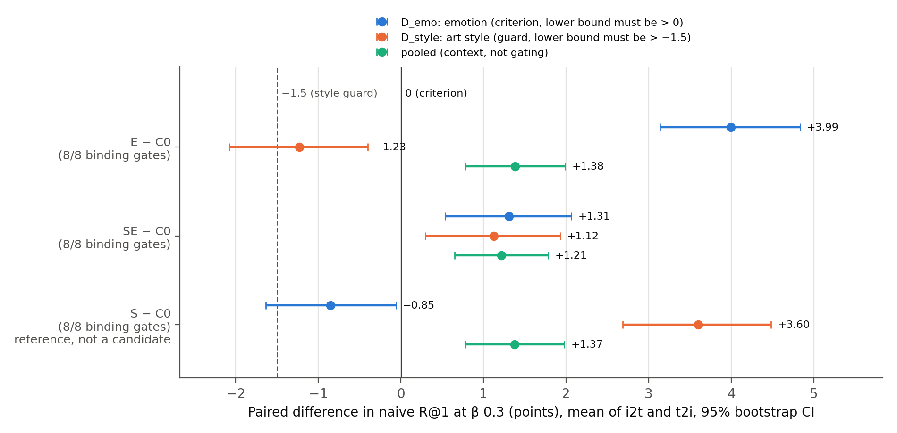
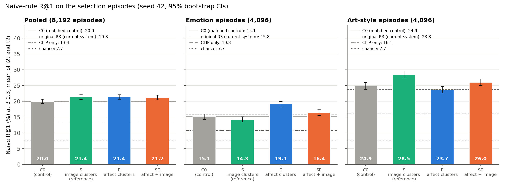
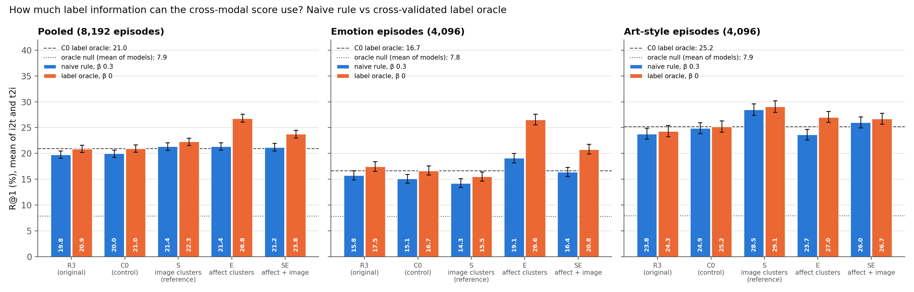
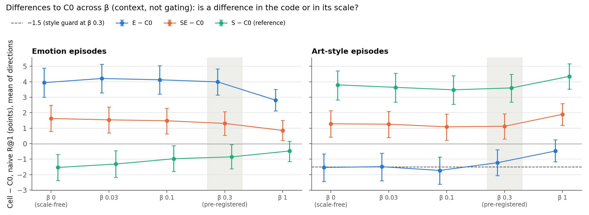
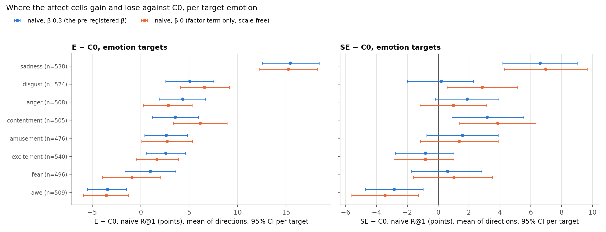
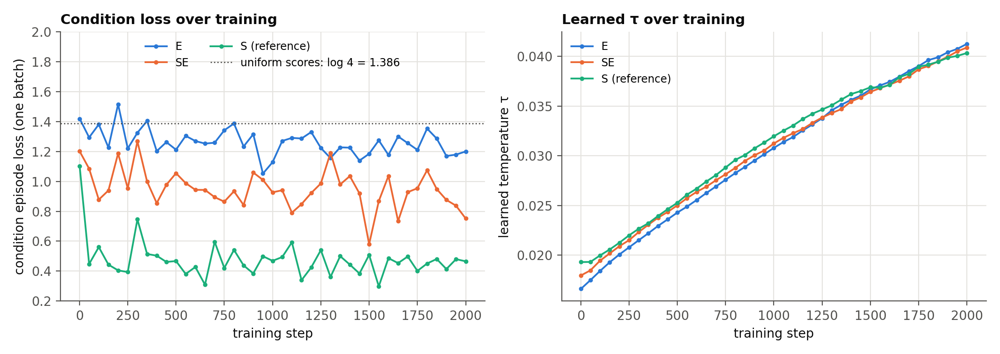

# CoSiR v2 Candidate A: affect-signal factor learning, selection (E and SE against C0)

## Verdict

**SE goes forward. It is the one cell that qualifies under the pre-registered rule, so it moves on to replication
(seeds 43 and 44) and the held test.** We trained two factor models on scorer-train rows (seed 42, 2,000 steps
each) whose training conditions come from an affect signal: the 28 emotion probabilities that a GoEmotions RoBERTa
model assigns to each caption. **E** draws its conditions from 64 clusters of these affect vectors; **SE** draws half
of them from the affect clusters and half from the CLIP image clusters that gave the 2×2's style cell S its style
gain. We compared each with the matched control C0 on 4,096 emotion and 4,096 art-style label episodes on selection
rows. The criterion is `D_emo`, the change over C0 in emotion R@1 (the share of episodes where the one correct
candidate out of 13 ranks first) under the parameter-free naive rule at β 0.3, averaged over the two retrieval
directions. A cell qualifies if it passes the eight binding collapse gates, the 95% CI of `D_emo` lies above 0, and
the lower bound of the art-style difference `D_style` lies above −1.5. All terms are defined in "What we tested".

| Cell | Condition source (all else as C0) | Binding gates | Sparsity (reported only) | `D_emo` (points) | `D_style` (points) | Pooled (context) | Qualifies |
|---|---|---:|---|---:|---:|---:|---|
| C0 | none (matched control) | **8/8** | pass | (baseline) | (baseline) | (baseline) | (control) |
| E | affect clusters | 8/8 | pass | **+3.99 [+3.14, +4.83]** | −1.23 [−2.08, −0.40] | +1.38 [+0.78, +1.99] | no: style guard |
| **SE** | affect clusters and CLIP image clusters, ½ each | 8/8 | fail (caption 0.529) | **+1.31 [+0.54, +2.06]** | **+1.12 [+0.29, +1.93]** | +1.21 [+0.65, +1.78] | **yes: picked** |
| S (2×2, reference) | CLIP image clusters | 8/8 | fail (caption 0.559) | −0.85 [−1.64, −0.06] | +3.60 [+2.69, +4.48] | +1.37 [+0.78, +1.98] | not a candidate |

In plain terms:

- **The affect signal put emotion into the factors.** E raises emotion R@1 from 15.12% (C0) to 19.12%, +3.99
  points, the first clear emotion gain from factor learning on this line. It is a property of the code, not of its scale: with the factor
  term alone (β 0) the gain is +3.94 [+3.00, +4.88], a linear probe reads emotion from E's caption codes 4.2 points
  better than from C0's, and the label oracle gains +9.90 [+8.84, +10.94] on emotion.
- **E pays for it in art style, and the rule drops it.** E's style difference is −1.23 [−2.08, −0.40]. The interval
  excludes zero and its lower bound misses −1.5, so E fails the guard. The loss holds where scale plays no role
  (naive β 0: −1.54 [−2.45, −0.66]). Yet the label oracle can use more style from E's codes than from C0's
  (+1.81 [+0.90, +2.75] at β 0), and the image-code style probe is unchanged (−0.44 [−1.49, +0.59]). E's codes still
  hold the style information; the naive rule reads less of it (Result 5).
- **SE gains on both labels.** Emotion +1.31 [+0.54, +2.06] and style +1.12 [+0.29, +1.93]: about a third of E's
  emotion gain and a third of S's style gain, with no loss on either. Both gains hold at β 0 (+1.62 and +1.28) and
  when the balance of the two score terms is matched (emotion +1.23 to +1.28). SE's caption codes are denser than the
  sparsity cap (active fraction 0.529 against 0.50); the spec made sparsity report-only before any run (Result 4).
- **The emotion gain sits where emotion lives.** For SE it comes almost entirely from image→text retrieval, where the
  candidates are captions (+2.34 [+1.29, +3.39]; text→image +0.27 [−0.83, +1.34]), and from a few emotions: sadness
  alone is 66% of it. Awe loses in both cells (Result 8).
- **Against the current system** (naive rule on original R3 at β 0.3: 19.79% pooled), SE is +1.43 [+0.87, +2.04]
  pooled, +2.20 [+1.35, +3.05] on style and +0.67 [−0.10, +1.43] on emotion, the last not significant because C0
  itself sits 0.63 points below R3 on emotion.
- **The setup is sound.** C0 passes all eight binding gates (and the ninth, sparsity). R3, C0 and S reproduce the
  2×2's stored ranks exactly on the first 2,048 episodes per label.

Replication with seeds 43 and 44 is reported in its own section below (style gain and pooled gain replicate; the
emotion gain does at seed 44 and is smaller at seed 43). The one held test on fresh episodes is a separate task and
this report confirms nothing on held data. E is not a candidate after this
step. The extras in Results 5 to 9 are context and informed no decision.

*Figure 1. Paired differences to C0 in naive R@1 at β 0.3 (R@1 points, mean of image→text and text→image), with 95%
bootstrap CIs over episodes. Blue: `D_emo`, the criterion (4,096 emotion episodes; its lower bound must exceed 0).
Orange: `D_style`, the guard (4,096 art-style episodes; its lower bound must exceed −1.5). Green: pooled, for context.
S is the 2×2's style cell, shown for reference and never a candidate.*

## What we tested

**The task.** Candidate A scores an image and a caption under a condition given by examples: 4 **supports** that
have the condition and 4 **contrasts** that do not. Each image and caption has a 32-number non-negative **code**
from a small encoder on frozen CLIP ViT-B/32 features (the **factors**). The **naive rule** turns the examples into
factor weights with no parameters, `w = ReLU(mean support pair code − mean contrast pair code)`, L1-normalized,
where a pair code is the mean of a row's image and caption codes. A query `q` and a candidate `c` then score
`β · cos(CLIP_q, CLIP_c) + Σ_l w_l q_l c_l`, with β fixed at 0.3.

**Episodes.** For a target label (one of 8 emotions or 23 art styles), an episode has an anchor with the label, 4
supports and 4 contrasts, and 13 candidates: 1 positive with the label and 12 negatives from paintings never given
it. **R@1** is the share of episodes where the positive ranks first (chance 7.69%). **i2t** uses the anchor's image
as the query and ranks captions; **t2i** uses its caption and ranks images. We drew 4,096 episodes per label on the
selection rows (`standard_label_episodes(..., 4096, seed=42)`). Their first 2,048 are stage (d)'s selection episodes,
which the 2×2 used: the SHA-256 of that prefix was asserted equal to stage (d)'s (emotion `84056321…`, art style
`e1cfe1ba…`), and every episode row was asserted to be a selection row.

**Rows.** The 216,107 train rows were split by painting into **scorer-train** (183,694 rows) and **selection**
(32,413 rows). E and SE trained on scorer-train rows only, and the affect model read scorer-train captions only; the
content graph, both condition partitions and every gate fit used scorer-train rows; every metric used selection
rows. Val and held rows were never read.

**The affect signal** (spec §1, §4). `SamLowe/roberta-base-go_emotions`, a RoBERTa fine-tuned on Reddit comments
labelled with 28 emotion categories and never trained on ArtELingo, gives each scorer-train caption 28 sigmoid
probabilities. PercepT, the baseline on the percept line, uses the same model as its affect input. MiniBatch k-means
(64 clusters, the settings of the image-cluster source) on the raw vectors gives the **affect partition**; all 64
groups have at least 200 rows (244 to 21,098). The vectors only build training conditions: at test time the model
reads frozen CLIP features alone, and ArtELingo's emotion and style labels are used only to evaluate.

**The cells** (spec §5). All use R3's recipe with the 2×2's painting-expanded batches, pair agreement, and the
naive-rule episode loss at weight 1.0 (64 condition episodes per step, 12 random negatives, learnable temperature τ);
they differ only in where the conditions come from.

| Model | Condition episodes | Role |
|---|---|---|
| C0 | none | matched control (the 2×2's seed-42 checkpoint, SHA-256 and config asserted) |
| E | a group of the affect partition | affect signal alone |
| SE | the affect or the CLIP image partition, each with probability ½, then a group | affect and style signals together |
| S | a group of the CLIP image partition | the 2×2's style cell, reference only |
| original R3 | none | the current system (stage (d)'s cached codes, trained on all train rows) |

**Collapse gates.** Nine pass/fail checks with the amended thresholds of 2026-09-29, fit on scorer-train rows and
evaluated on selection rows. Eight are binding: participation ratio ≥ 8, maximum factor correlation ≤ 0.90, linear
readout of CLIP no worse than R0's on the same rows, no dead factors, at most one modality-private factor, top-2
usage ≤ 0.20, community spanning ≥ 0.75, and pair retrieval at least half of CLIP's. The ninth, **sparsity** (active
fraction ≤ 0.50), is reported only: condition training makes codes denser, and density is not collapse. This was
decided before any run (spec §3).

**The label oracle** is a diagnostic: one weight vector per label, fit on half of that label's episodes and ranking
the other half (2 folds, 200 steps). It measures how much label information the cross-modal score can use whatever
the weighting rule. Its **null** declares a random negative the positive and should sit at chance.

**Ties** count as misses (the project's convention): a positive tied with another candidate gets rank 1.5 or worse.
Ties are negligible here: at β 0 at most 4 episodes per label and direction have the positive tied at the top, and
random tie-breaking moves no R@1 by more than 0.005 points; at β 0.3 no model has a tie.

**Where and how long.** Everything ran on the local RTX 3090. The timing smoke projected 9.0 (E) and 9.3 (SE) minutes
per run alone and a 3.9 GiB peak. E and SE trained as two parallel processes in 10.6 minutes each (peak 3.94 and
3.93 GiB), with finite losses and codes. During their last six minutes a dry run of the evaluation code (E and SE
replaced by S's checkpoint, output discarded) shared the machine's CPUs. The evaluation took 248 seconds.

## Result 1: how well the affect signal lines up with ArtELingo's labels (spec §4)

Measured on scorer-train rows before training, and used for no choice. Adjusted mutual information (AMI, 0 unrelated,
1 identical) of each 64-group partition with ArtELingo's labels, and a multinomial logistic probe to ArtELingo emotion
fit on 80% of scorer-train paintings and scored on the other 20% (36,734 rows).

| Partition (64 k-means groups) | AMI with emotion | AMI with art style |
|---|---:|---:|
| **GoEmotions affect vectors (the new signal)** | **0.196** | 0.016 |
| CLIP image features (S's signal) | 0.035 | **0.318** |
| CLIP caption features | 0.056 | 0.058 |

| Probe input → ArtELingo emotion | Accuracy |
|---|---:|
| GoEmotions affect vectors (28-d) | 51.7% |
| CLIP caption features (512-d) | 57.7% |
| majority class | 28.5% |

**Reading.** The affect partition lines up with emotion 3.5 times better than any label-free partition the headroom
probe found (0.196 against 0.056 for caption clusters), and it barely touches style (0.016). It is also nearly
independent of the image clusters (AMI 0.026 between the two partitions), so SE mixes two different signals. The
28 GoEmotions probabilities carry less emotion than the 512-d CLIP caption feature (51.7% against 57.7%): the gain
they bring is a partition along emotion, not more information than CLIP already holds. The taxonomies differ:
GoEmotions' 28 Reddit categories include sadness, fear, anger, disgust and amusement, but no direct counterpart of
ArtEmis's awe or contentment (Result 8 returns to this).

## Result 2: the rule, recomputed by hand

The rule (spec §6): **eligible** = the eight binding gates pass; **qualifies** = eligible, `D_emo` lower bound > 0 and
`D_style` lower bound > −1.5; **pick** = the highest `D_emo`, with a 0.5-point tie band resolved toward E (fewer
changes).

| Cell | 8 binding gates pass | `D_emo` lower bound > 0 | `D_style` lower bound > −1.5 | Qualifies |
|---|---|---|---|---|
| E | yes | yes (+3.14) | **no (−2.08)** | no |
| SE | yes | yes (+0.54) | yes (+0.29) | **yes** |

C0 passes every binding gate, so the first stop point (a broken setup) did not fire. Only SE qualifies, so the tie
band is SE alone and SE is picked. The rule's code (`apply_affect_rule`) returned the same outcome after its six
hand-checked cases passed. Every model passes the eight binding gates, so the outcome rests on the two intervals.
It does depend on sparsity being report-only, as the spec fixed before the run: had sparsity been binding, SE (caption
active fraction 0.529) would have been ineligible and no cell would qualify.

## Result 3: naive R@1 per model, label and direction

*Figure 2. Naive-rule R@1 at β 0.3 (mean of the two directions) with 95% bootstrap CIs. Gray bar and solid line: C0.
Dashed line: original R3, the current system. Dash-dot line: CLIP only. Dotted line: chance.*

Naive R@1 (%) at β 0.3, 95% CIs for the means of directions. C0 is the criterion's baseline; original R3 is the
current system.

| Model | Pooled i2t | Pooled t2i | **Pooled mean** | Emotion i2t | Emotion t2i | **Emotion mean** | Style i2t | Style t2i | **Style mean** |
|---|---:|---:|---:|---:|---:|---:|---:|---:|---:|
| CLIP only | 12.21 | 14.69 | 13.45 [12.88, 14.00] | 9.72 | 11.94 | 10.83 | 14.70 | 17.43 | 16.06 |
| original R3 | 18.64 | 20.94 | 19.79 [19.07, 20.47] | 16.21 | 15.31 | 15.76 [14.90, 16.66] | 21.07 | 26.56 | 23.82 [22.78, 24.89] |
| **C0** | 18.32 | 21.69 | **20.01** [19.29, 20.68] | 14.67 | 15.58 | **15.12** [14.27, 15.97] | 21.97 | 27.81 | **24.89** [23.83, 25.98] |
| S | 19.01 | 23.75 | 21.38 [20.64, 22.08] | 14.48 | 14.06 | 14.27 [13.43, 15.14] | 23.54 | 33.45 | 28.49 [27.37, 29.59] |
| E | 20.96 | 21.81 | 21.39 [20.67, 22.08] | 20.70 | 17.53 | **19.12** [18.20, 20.02] | 21.22 | 26.10 | 23.66 [22.63, 24.69] |
| **SE** | 19.76 | 22.68 | **21.22** [20.50, 21.95] | 17.02 | 15.84 | **16.43** [15.55, 17.33] | 22.51 | 29.52 | **26.01** [24.98, 27.11] |

Paired differences to C0 per label and direction at β 0.3 (R@1 points, 95% CI):

| Cell | Emotion i2t | Emotion t2i | Style i2t | Style t2i | Pooled i2t | Pooled t2i |
|---|---:|---:|---:|---:|---:|---:|
| E | **+6.03 [+4.88, +7.28]** | +1.95 [+0.78, +3.05] | −0.76 [−1.86, +0.34] | −1.71 [−2.86, −0.51] | +2.64 [+1.83, +3.44] | +0.12 [−0.71, +0.94] |
| SE | +2.34 [+1.29, +3.39] | +0.27 [−0.83, +1.34] | +0.54 [−0.54, +1.61] | +1.71 [+0.51, +2.91] | +1.44 [+0.70, +2.20] | +0.99 [+0.20, +1.78] |
| S (reference) | −0.20 [−1.29, +0.90] | −1.51 [−2.59, −0.42] | +1.56 [+0.39, +2.71] | **+5.64 [+4.30, +6.96]** | +0.68 [−0.11, +1.49] | +2.06 [+1.23, +2.91] |

**Reading.** Each signal improves the direction whose candidates carry its label. The affect signal is built from
captions, and emotion is read from captions (the headroom probe's caption→emotion probe 57.9% against image→emotion
35.2%, majority 28.4%): E's and SE's emotion gains are largest in image→text, where the candidates are captions (E
+6.03, SE +2.34), and small or absent in text→image, where the candidates are images (E +1.95, SE +0.27). The image
clusters mirror this for style, which is read from images: S's style gain sits in text→image (+5.64). SE inherits both
patterns in weaker form: emotion in image→text, style in text→image (+1.71).

All three condition cells gain about the same pooled over C0 (E +1.38, S +1.37, SE +1.21); they differ in which label
the gain comes from. E and S each gain their own label and lose the other; SE gains a little on both.

**Against the current system.** C0 is level with original R3 overall (+0.22 [−0.27, +0.74]), a little stronger on
style (+1.07 [+0.35, +1.81]) and a little weaker on emotion (−0.63 [−1.34, +0.04]). Against R3, E is +3.36
[+2.47, +4.22] on emotion and level on style (−0.16 [−0.99, +0.68]); SE is +1.43 [+0.87, +2.04] pooled, +2.20
[+1.35, +3.05] on style and +0.67 [−0.10, +1.43] on emotion.

## Result 4: the gates

Values on selection rows (fit on scorer-train rows); image / caption where the gate has two sides.

| Gate (threshold) | original R3 | C0 | S | E | SE |
|---|---:|---:|---:|---:|---:|
| participation ratio (≥ 8) | 21.8 / 20.8 | 22.1 / 21.1 | 20.0 / 18.3 | 20.3 / 20.2 | 20.5 / 19.0 |
| max factor correlation (≤ 0.90) | 0.446 | 0.547 | 0.560 | 0.518 | 0.529 |
| readout rel. L2 (≤ R0: 0.4930 / 0.4691) | 0.4789 / 0.4611 | 0.4804 / 0.4625 | 0.4732 / 0.4612 | 0.4833 / 0.4572 | 0.4763 / 0.4602 |
| dead factors (0) | 0 | 0 | 0 | 0 | 0 |
| modality-private factors (≤ 1) | 0 | 0 | 0 | 1 | 0 |
| top-2 usage share (≤ 0.20) | 0.079 | 0.078 | 0.081 | 0.100 | 0.083 |
| community spanning (≥ 0.75) | 1.000 | 1.000 | 1.000 | 1.000 | 0.969 |
| pair retrieval / CLIP (≥ 0.5) | 1.194 | 1.116 | 1.071 | 1.081 | 1.080 |
| **binding gates passed** | **8/8** | **8/8** | **8/8** | **8/8** | **8/8** |
| active fraction (≤ 0.50; reported only) | 0.453 / 0.485 | 0.419 / 0.479 | 0.424 / **0.559** | 0.448 / 0.472 | 0.422 / **0.529** |

**Reading.** No model shows signs of collapse. E has one modality-private factor (factor 9), within the limit of one,
and the most concentrated usage (0.100, half the cap). SE's caption side is denser than the sparsity cap, as S's was,
and less so (0.529 against 0.559); E's is not (0.472). A plausible reading, not tested: the image-cluster conditions,
which captions express only weakly, push caption codes to spread over more factors, while affect conditions, which
come from the captions themselves, do not.

## Result 5: the label oracle (how much label information can the score use?)

*Figure 3. Naive rule at β 0.3 (blue) and the cross-validated label oracle at β 0 (orange), mean of the two
directions, with 95% CIs. Dashed line: C0's oracle. Dotted line: the oracle null, averaged over models.*

R@1 (%), mean of the two directions, 95% CIs; differences are paired (R@1 points).

| Model | Naive, β 0.3 | Oracle, β 0.3 | **Oracle, β 0** | Oracle β 0: emotion | Oracle β 0: style | Null, β 0 | Oracle − own naive, same β 0 | Oracle β 0 − C0 oracle β 0 |
|---|---:|---:|---:|---:|---:|---:|---:|---:|
| original R3 | 19.79 | 20.39 | 20.92 [20.20, 21.60] | 17.49 | 24.34 | 8.03 | +1.20 [+0.56, +1.85] | −0.04 [−0.59, +0.50] |
| C0 | 20.01 | 20.21 | 20.96 [20.26, 21.67] | 16.69 | 25.23 | 7.98 | +0.51 [−0.12, +1.16] | (reference) |
| S | 21.38 | 21.64 | 22.30 [21.56, 22.99] | 15.53 | 29.06 | 7.89 | +0.71 [+0.09, +1.35] | +1.34 [+0.71, +1.95] |
| E | 21.39 | 23.96 | **26.81** [26.06, 27.59] | **26.59** | 27.04 | 7.47 | **+5.16 [+4.50, +5.83]** | **+5.85 [+5.12, +6.57]** |
| SE | 21.22 | 22.92 | 23.77 [23.01, 24.51] | 20.80 | 26.73 | 8.06 | +1.86 [+1.21, +2.49] | +2.81 [+2.19, +3.40] |

Oracle minus C0's oracle per label (β 0; at β 0.3 in brackets):

| Cell | Emotion | Emotion i2t | Emotion t2i | Style |
|---|---:|---:|---:|---:|
| E | +9.90 [+8.84, +10.94] (β 0.3: +6.71) | +14.28 [+12.77, +15.84] | +5.52 [+4.15, +6.86] | +1.81 [+0.90, +2.75] (β 0.3: +0.77 [−0.05, +1.60]) |
| SE | +4.11 [+3.28, +4.99] (β 0.3: +3.74) | +5.08 [+3.93, +6.27] | +3.15 [+1.95, +4.37] | +1.50 [+0.62, +2.34] (β 0.3: +1.67) |
| S | −1.16 [−1.97, −0.33] | −1.00 [−2.12, +0.12] | −1.32 [−2.49, −0.17] | +3.83 [+2.91, +4.76] |

**Reading.** Three points.

1. **The affect cells carry much more emotion information that the cross-modal score can use.** E's oracle reaches
   26.59% on emotion against C0's 16.69% (+9.90), SE's 20.80% (+4.11). Both also gain on style under the oracle
   (+1.81 and +1.50). Every null sits near chance (7.47% to 8.06% against 7.69%), so the oracle does not fit noise.
   All models remain far below the 49.8% that a label-aligned code reached in the headroom probe.
2. **For the affect cells the naive rule is now a limit.** In the 2×2 the oracle beat each model's naive rule by at
   most about one point, so the code, not the weighting, set the result. That still holds for C0 (+0.51 at β 0) and
   S (+0.71), but not for E (+5.16; +6.81 on emotion, +3.50 on style) or, less so, SE (+1.86; +3.34 on emotion). One
   weight vector per label extracts much more from E's codes than 4 supports and 4 contrasts do.
3. **E's style loss is a loss in what the naive rule extracts, not in the code.** On style, E is below C0 under the
   naive rule (−1.23 at β 0.3, −1.54 at β 0) but above it under the oracle (+1.81 at β 0; per direction +1.34 i2t and
   +2.27 t2i), and the image-code style probe does not move (Result 7). The information is there; the naive weights
   use less of it. Why is an inference we did not test: E's codes vary more with emotion (caption-side probe +4.2),
   so the support-minus-contrast difference of 4 random style examples may pick up more emotion-driven factors that
   are noise for the style condition.

## Result 6: the β grid and the balance-matched comparison (is a gain in the code or in its scale?)

*Figure 4. Cell − C0 in naive R@1 at each β of the grid (mean of directions, 95% CIs). β 0 uses the factor term alone
and does not depend on the codes' overall scale. The shaded band marks the pre-registered β 0.3.*

A larger code makes the factor term outweigh `0.3 · cos`, which acts like a smaller β. The ratio of the two terms'
spread across the 13 candidates at β 0.3 measures this.

| Model | Code RMS (scorer-train) | Factor term / (0.3 · cos term), spread ratio | Mean active weights per episode |
|---|---:|---:|---:|
| original R3 | 0.315 | 4.42 | 15.7 of 32 |
| C0 | 0.268 | 3.37 | 15.6 |
| S | 0.325 | 5.14 | 15.6 |
| E | 0.248 | 2.99 | 15.6 |
| SE | 0.273 | 3.63 | 15.6 |

Cell − C0 at the same β (naive, paired, R@1 points; context, not part of the rule):

| β | E: emotion | E: style | SE: emotion | SE: style | SE: pooled |
|---:|---:|---:|---:|---:|---:|
| 0 (scale-free) | +3.94 [+3.00, +4.88] | −1.54 [−2.45, −0.66] | +1.62 [+0.78, +2.48] | +1.28 [+0.43, +2.12] | +1.45 [+0.85, +2.06] |
| 0.03 | +4.21 [+3.28, +5.13] | −1.49 [−2.40, −0.61] | +1.54 [+0.70, +2.37] | +1.26 [+0.39, +2.08] | +1.40 [+0.81, +2.00] |
| 0.1 | +4.13 [+3.21, +5.04] | −1.73 [−2.62, −0.87] | +1.48 [+0.63, +2.29] | +1.09 [+0.22, +1.90] | +1.28 [+0.70, +1.87] |
| **0.3** | **+3.99 [+3.14, +4.83]** | **−1.23 [−2.08, −0.40]** | **+1.31 [+0.54, +2.06]** | **+1.12 [+0.29, +1.93]** | **+1.21 [+0.65, +1.78]** |
| 1 | +2.81 [+2.11, +3.50] | −0.48 [−1.17, +0.24] | +0.85 [+0.21, +1.50] | +1.89 [+1.18, +2.59] | +1.37 [+0.89, +1.85] |

**Balance-matched comparison** (as in the 2×2's post-hoc): C0 at the β where its spread ratio equals the cell's at
β 0.3, and the cell at the β where its ratio equals C0's at β 0.3, each re-scored on the same episodes with the same
naive weights (the weights do not depend on β) and also interpolated linearly on the grid.

| Comparison | Pooled | Emotion | Style |
|---|---:|---:|---:|
| SE − C0, both at β 0.3 (the pre-registered `D`) | +1.21 [+0.65, +1.78] | +1.31 [+0.54, +2.06] | +1.12 [+0.29, +1.93] |
| SE at 0.3, C0 at 0.278 (re-scored) | +1.18 [+0.62, +1.75] | +1.28 [+0.48, +2.06] | +1.07 [+0.24, +1.88] |
| SE at 0.323, C0 at 0.3 (re-scored) | +1.21 [+0.65, +1.76] | +1.23 [+0.45, +2.01] | +1.18 [+0.34, +2.00] |
| E − C0, both at β 0.3 | +1.38 [+0.78, +1.99] | +3.99 [+3.14, +4.83] | −1.23 [−2.08, −0.40] |
| E at 0.3, C0 at 0.338 (re-scored) | +1.50 [+0.90, +2.11] | +4.21 [+3.34, +5.08] | −1.21 [−2.04, −0.38] |
| E at 0.267, C0 at 0.3 (re-scored) | +1.47 [+0.88, +2.09] | +4.04 [+3.19, +4.90] | −1.10 [−1.92, −0.28] |

Interpolation on the grid gives the same picture (SE emotion +1.25 to +1.28, E emotion +4.05 to +4.06).

**Reading.** SE's codes are about 2% larger than C0's in RMS and its spread ratio 8% higher (3.63 against 3.37), so
scale plays a small role: matching the balance lowers `D_emo` by 0.02 to 0.07 points (2% to 6% of it). Both of SE's
gains are larger at β 0 than at β 0.3 (emotion +1.62, style +1.28), so they are **in the code, not a β effect**. E's
codes are smaller than C0's (spread ratio 2.99), which works against E at β 0.3; matched, its emotion gain is a
little larger (+4.04 to +4.21) and its style loss about the same (−1.10 to −1.21). E's style loss is therefore not a
scale artefact either; it shrinks only at β 1, where the CLIP term dominates every model.

## Result 7: what the codes hold (per-modality probes and AMI)

Diagnostics on selection rows, fit on scorer-train rows (standardized codes, multinomial logistic regression, C 1.0);
differences to C0 carry 95% CIs from resampling selection paintings (2,000 resamples). Labels are used only to fit or
score these probes.

Top-1 accuracy (%) of a linear probe reading a label from one modality's 32-number code (difference to C0 in brackets).
Majority baselines: 28.40% (emotion), 15.97% (art style). Raw 512-d CLIP reaches 57.9% (caption→emotion) and 59.8%
(image→style) in the headroom probe.

| Model | Caption → emotion | Image → art style | Caption → art style | Image → emotion |
|---|---:|---:|---:|---:|
| original R3 | 46.28 (+0.51 [+0.15, +0.85]) | 45.46 (−0.08 [−1.09, +0.93]) | 25.05 (−0.07 [−0.38, +0.24]) | 34.81 (+0.19 [−0.14, +0.49]) |
| **C0** | **45.77** | **45.53** | **25.12** | **34.63** |
| S | 45.63 (−0.15 [−0.56, +0.26]) | 47.36 (+1.83 [+0.77, +2.87]) | 25.18 (+0.05 [−0.27, +0.41]) | 34.14 (−0.49 [−0.84, −0.13]) |
| E | **50.01 (+4.24 [+3.83, +4.67])** | 45.10 (−0.44 [−1.49, +0.59]) | 24.66 (−0.46 [−0.80, −0.13]) | 34.85 (+0.23 [−0.10, +0.56]) |
| SE | 48.05 (+2.28 [+1.90, +2.65]) | 45.89 (+0.36 [−0.67, +1.39]) | 24.93 (−0.19 [−0.51, +0.13]) | 34.74 (+0.11 [−0.20, +0.43]) |

Within-painting caption-residual emotion probe: the caption code minus the mean caption code of the same painting's
rows (paintings with at least 2 rows), which removes what a painting's captions share and keeps the per-annotator
variation that carries emotion.

| Code | Residual → emotion (%) | Difference to C0 | Within-painting share of caption-code variance |
|---|---:|---:|---:|
| raw CLIP captions (512-d) | 46.98 | | 0.656 |
| original R3 | 35.89 | +0.26 [−0.08, +0.61] | 0.447 |
| **C0** | **35.62** | | **0.447** |
| S | 34.60 | −1.02 [−1.40, −0.65] | 0.445 |
| E | **39.37** | **+3.74 [+3.32, +4.20]** | 0.471 |
| SE | 37.11 | +1.48 [+1.11, +1.88] | 0.449 |

AMI of each row's strongest factor (the argmax of its pair code) with four partitions. The CLIP image and affect
clusters label scorer-train rows only, so those columns use scorer-train rows; the label columns use selection rows.

| Model | CLIP image clusters | Affect clusters | Art style | Emotion |
|---|---:|---:|---:|---:|
| original R3 | 0.347 | 0.043 | 0.135 | 0.055 |
| **C0** | **0.349** | **0.042** | **0.143** | **0.055** |
| S | 0.423 | 0.038 | 0.187 | 0.050 |
| E | 0.319 | 0.063 | 0.125 | 0.074 |
| SE | 0.386 | 0.047 | 0.158 | 0.060 |

**Reading.**

- **The emotion gain is in the caption code.** E's caption codes hold 4.2 points more emotion than C0's, SE's 2.3
  points more, and the within-painting variation carries more of it (E +3.7, SE +1.5). This is the part of emotion
  the 2×2 could not reach: painting-level agreement lowered it (−4.7) and the style episodes lowered it (S −1.0).
  E closes 35% of the gap between C0's caption codes and raw CLIP on caption→emotion (50.0% against 45.8% and 57.9%).
- **The image codes kept their style.** Neither E (−0.44) nor SE (+0.36) changes image→style significantly, unlike
  S (+1.83). SE's style gain under the naive rule (+1.12) and the oracle (+1.50) is therefore not visible as more
  style in the image code alone; it is in what the image and caption codes share (an inference from the two
  measurements).
- **The strongest factors moved toward each cell's signal.** E's strongest factor lines up more with the affect
  clusters (0.063 against 0.042) and with emotion (0.074 against 0.055), and less with the image clusters (0.319
  against 0.349) and style (0.125 against 0.143). SE sits between E and S on every column. The alignment stays weak:
  0.074 is far from the affect clusters' own 0.196 with emotion, so emotion is spread over several factors rather
  than held by one.

## Result 8: per target (which emotions and styles move)

*Figure 5. E − C0 (left) and SE − C0 (right) in naive R@1 per target emotion (mean of the two directions, 95% bootstrap
CI within each target) at β 0.3 (blue) and β 0 (orange); n is the number of episodes per target.*

- **Emotion: sadness leads, awe loses.** E gains in 7 of 8 emotions at β 0.3. Sadness is +15.43 [+12.55, +18.40]
  (14.0% to 29.5%) and 51% of E's total gain; disgust (+5.06), anger (+4.33) and contentment (+3.56) follow. Awe falls
  by −3.44 [−5.50, −1.47]. SE shows the same order at a smaller size: sadness +6.60 [+4.18, +9.01] (66% of its total),
  contentment +3.17 [+0.89, +5.54] (30%), and awe −2.85 [−4.72, −0.98]. Part of this fits the taxonomy check in
  Result 1: sadness has a direct GoEmotions category, awe does not. But contentment, also without a direct category,
  gains in both cells, so the taxonomy explains the pattern at most in part. This reading is untested.
- **Style: SE gains in a few distinctive styles, E loses in a few.** SE's style gain is concentrated like S's: Ukiyo-e
  +11.98 [+6.29, +17.66] (44% of the total), Abstract Expressionism +7.14 (30%), Pop Art +5.06 and Impressionism
  +4.44; Rococo is the one clear loss (−4.29 [−7.98, −0.61]). E's style loss comes mostly from four styles: Minimalism
  −9.12 [−12.98, −5.52], Early Renaissance −6.67, Rococo −5.52 and Color Field Painting −5.00, which together make up
  92% of its net loss; 9 of 23 styles gain.

## Result 9: the condition loss and τ over training

*Figure 6. The condition episode loss on the current batch (logged every 50 steps; one batch of 64 episodes, so noisy)
and the learned temperature τ. With 4 positives among 16 candidates, uniform scores give log 4 = 1.386.*

| Cell | Loss at step 1 | Mean of logged steps 50 to 500 | Mean of the last 10 logged steps | Final τ |
|---|---:|---:|---:|---:|
| E | 1.418 | 1.304 | 1.240 | 0.0413 |
| SE | 1.200 | 1.019 | 0.901 | 0.0409 |
| S (2×2) | 1.100 | 0.494 | 0.443 | 0.0403 |

**Reading.** The affect episodes are hard to fit: E's loss stays close to the uniform level (1.24 against 1.386 at the
end), while S's image-cluster episodes drop below 0.45 within 50 steps. SE, half of each, sits between. The emotion gain
nevertheless appeared, so a small drop in this loss was enough to reshape the codes. A plausible reason for the high
loss, which we did not test: an affect group is defined by captions, while the episode also ranks images, which
carry little emotion, and captions of the same painting, which share one image, can fall in different affect
groups. τ rose steadily in all three cells and had not levelled off at step 2,000; τ does not change rankings.

## The style guard's power

The spec (§6) stated before the run that at 4,096 episodes the style SE would be about 0.42 points, giving a cell with
no true style change a 95% chance of passing the −1.5 guard and one with a true −0.5 a 66% chance. From the measured
CIs (SE = the mean over E and SE of the distance from the point estimate to the lower bound, divided by 1.96; normal
approximation):

| | SE (points) | Point estimate needed to pass | P(pass), true 0 | P(pass), true −0.5 | P(pass), true −1.0 |
|---|---:|---:|---:|---:|---:|
| spec, before the run | 0.420 | −0.68 | 94.6% | 66.3% | 22.1% |
| **measured** | **0.427** | **−0.66** | **94.0%** | **65.0%** | **21.5%** |

The guard had the planned power. E's failure is not only a failure to show non-inferiority: its interval excludes zero
(−1.23 [−2.08, −0.40]), and the scale-free naive comparison agrees in both directions (β 0: i2t −1.12
[−2.29, +0.05], t2i −1.95 [−3.25, −0.68]). What the evidence does not show is less style information in E's code: the
oracle (β 0: i2t +1.34 [+0.10, +2.59], t2i +2.27 [+0.95, +3.59]) and the image-code probe say otherwise (Result 5).
The loss is real for the naive rule, the rule the guard protects. The measured `D_emo` SE is 0.41 points (mean over
E and SE).

## Replication (seeds 43 and 44, reported only)

Spec §6 asks for SE and C0 to be retrained with two more seeds and evaluated exactly as at seed 42: the same 4,096 +
4,096 selection episodes (prefix SHA-256 asserted), the same rows and masking, the same gates with the same readout
reference, and the naive rule at β 0.3. Each seed's SE is compared with the C0 of the same seed, with the same paired
bootstrap (5,000 resamples over episodes). Four runs were trained on the local GPU (three at once, then one; 2,000
steps, all finite, peak 3.9 GiB). Seed 42 is recomputed through the same code as a check and matches the stored
selection output to the last digit. **The verdict rests on seed 42; none of this changes the rule or the pick.**

| Seed | `D_emo` (points) | `D_style` (points) | Pooled | Binding gates SE / C0 | Sparsity SE (img / caption) | Sparsity C0 (img / caption) |
|---|---:|---:|---:|---|---|---|
| 42 (selection) | +1.31 [+0.54, +2.06] | +1.12 [+0.29, +1.93] | +1.21 [+0.65, +1.78] | 8/8 / 8/8 | 0.422 / 0.529 fail | 0.419 / 0.479 pass |
| 43 | +0.50 [−0.26, +1.29] | +2.14 [+1.25, +3.00] | +1.32 [+0.73, +1.89] | 8/8 / 8/8 | 0.435 / 0.515 fail | 0.431 / 0.483 pass |
| 44 | +1.28 [+0.49, +2.06] | +1.04 [+0.21, +1.90] | +1.16 [+0.56, +1.75] | 8/8 / 8/8 | 0.439 / 0.518 fail | 0.421 / 0.475 pass |

Naive R@1 (%, mean of directions) behind the differences, with the training end state of each run:

| Seed | Model | Emotion | Art style | Pooled | Final condition loss | Final τ | Wall-clock (min) |
|---|---|---:|---:|---:|---:|---:|---:|
| 42 | SE | 16.43 [15.55, 17.33] | 26.01 [24.98, 27.11] | 21.22 [20.50, 21.95] | 0.752 | 0.0409 | 10.6 |
| 42 | C0 | 15.12 [14.27, 15.97] | 24.89 [23.83, 25.98] | 20.01 [19.29, 20.68] | n/a | n/a | 11.2 |
| 43 | SE | 15.48 [14.61, 16.35] | 26.25 [25.16, 27.31] | 20.86 [20.15, 21.58] | 1.037 | 0.0452 | 10.3 |
| 43 | C0 | 14.98 [14.12, 15.82] | 24.11 [23.06, 25.16] | 19.54 [18.85, 20.24] | n/a | n/a | 10.3 |
| 44 | SE | 15.55 [14.70, 16.41] | 26.33 [25.24, 27.44] | 20.94 [20.21, 21.64] | 0.883 | 0.0492 | 10.3 |
| 44 | C0 | 14.27 [13.43, 15.12] | 25.29 [24.23, 26.36] | 19.78 [19.08, 20.48] | n/a | n/a | 8.9 |

In plain terms:

- **The direction replicates; the size of the emotion gain does not fully.** SE beats its own-seed C0 on emotion and
  on style at every seed, and the pooled gain is stable (+1.16 to +1.32, every interval above 0). Style is above 0
  at all three seeds (lower bounds +0.21 to +1.25). Emotion is +1.31, +0.50 and +1.28: seeds 42 and 44 agree, while
  seed 43's gain is smaller and its interval (−0.26 to +1.29) includes 0.
- **Seed 43 would not have met the emotion bar on its own.** Had the selection rule been applied to seed 43, `D_emo`'s
  lower bound of −0.26 would have failed the "above 0" requirement. Two of three seeds clear it, so one seed is a
  plausible draw from a true gain of about +1 point, but three seeds cannot pin the size down; the mean of the three
  point estimates is +1.03 on emotion and +1.43 on style. Seed 43's smaller `D_emo` comes from SE (15.48% against
  16.43% at seed 42), not from a stronger C0.
- **Seed-to-seed spread is the same order as the effect.** C0's own emotion R@1 moves from 14.27% to 15.12% across
  seeds, about the size of the SE gain, which is why a single-seed `D_emo` of +1.31 was always a soft number. The
  intervals above are over episodes within one seed and do not include that seed-to-seed variation.
- **Gates behave as at seed 42.** Both models pass all eight binding gates at every seed. SE's caption code fails the
  report-only sparsity cap (0.515 to 0.529 against 0.50) at every seed and C0 passes it, so the sparsity note in the
  verdict holds across seeds.
- **Training ended normally.** All four runs are finite; SE's condition loss ends between 0.75 and 1.04 (from about
  1.2 at step 1, well under the uniform level of 1.386), and τ settles near 0.04 to 0.05.

Caveat: the three seeds share the same selection episodes, so the comparison isolates training variation but not
episode sampling. The held test, on fresh episodes, is the pre-registered confirmation.

## What this means

1. **An external affect signal does what no label-free signal did: it moves emotion.** In the 2×2 and the headroom
   probe no self-generated partition lined up with emotion (AMI ≤ 0.06), and the style episodes cost emotion. The
   GoEmotions partition lines up with emotion (0.196), and training on it raised emotion R@1 by 4 points (E), in the
   caption code itself (probe +4.2), and far more under the oracle (+9.9). The gain follows where emotion is
   expressed: it is largest with caption candidates, and for sadness, which GoEmotions names directly.
2. **One signal per label, and SE trades between them.** E gains emotion and loses naive-rule style; S gains style and
   loses emotion; SE, mixing the two sources, gains a little on both and loses on neither. The pooled gain is almost
   the same for all three (+1.2 to +1.4), so the condition source mainly decides which label the factors serve. SE is
   the only cell that meets the pre-registered bar, and the rule was designed to prefer a protected style over a
   larger emotion gain.
3. **For codes trained on the affect signal, the naive rule is no longer the whole story.** C0's and S's oracles beat
   their own naive rule by under one point, as in the 2×2; E's beats it by 5.2 and SE's by 1.9. A weighting that reads
   more from the codes (a trained scorer, as in stage (d)) may now have headroom that it lacked on R3's codes. This is
   an inference from the oracle gap; stage (d) found no such headroom on R3.

## Next steps

Pre-registered, and not part of the selection verdict: the **held test** of SE against C0 on fresh held episodes, with the
episode count set by spec §7's power rule from SE's `D_emo` CI above. The verdict rests on seed 42; the replication
seeds (section above) are reported beside it.

Options outside this pre-registration, for the user to weigh later: E's emotion gain (+3.99) with a style
safeguard of another kind, or a trained scorer on SE's or E's codes (Result 5, point 2). Neither is planned.

## Caveats (spec §11 and the 2×2's lessons)

- **Taxonomy mismatch.** GoEmotions' 28 Reddit categories are not ArtEmis's 9. The partition lines up with ArtELingo
  emotion (AMI 0.196), but the affect vectors carry less emotion than CLIP caption features (probe 51.7% against
  57.7%), and awe, which has no direct GoEmotions counterpart, is the emotion both cells lose on.
- **Image side.** Images carry little emotion (image→emotion probe 35.2% against a 28.4% majority), and the gains are
  mostly in image→text. SE's text→image emotion difference is +0.27 [−0.83, +1.34]; the criterion averages the two
  directions.
- **Affect clusters and content.** The affect partition's AMI with art style is 0.016 and with the image clusters
  0.026, so it does not follow visual content the way the image clusters do. It may still follow caption subject
  matter; we did not measure that.
- **Selection rows have been read many times** (stage (d), the headroom probe, the 2×2, now this). This step chose on
  them; the held test on fresh episodes is what confirms. The first 2,048 episodes per label are the ones stage (d)
  and the 2×2 used.
- **The control is C0, not R3.** C0 is level with original R3 pooled (+0.22) but 0.63 points below it on emotion, so
  SE's emotion gain against R3 (+0.67 [−0.10, +1.43]) is not significant. C0 and S are the 2×2's seed-42 checkpoints.
- **The reference models saw the selection rows.** Original R3 and R0 (the readout gate's reference) were trained
  without labels on all train rows, selection rows included; C0, S, E and SE never saw them. This slightly favours R3
  in the comparisons against it and makes the readout gate slightly harder for the new cells.
- **Code scale acts like β.** Handled above: SE's gains are larger at β 0 than at β 0.3 and move by at most 0.08
  points when the balance is matched.
- **Sparsity was made report-only before the run.** SE fails it (caption active fraction 0.529), as S did. Had it
  stayed binding, no cell would qualify.
- **Ties count as misses**; they are negligible here (at most 4 top ties per label and direction at β 0, none at
  β 0.3).
- **One seed; episodes reuse rows.** The verdict rests on seed 42. The bootstrap CIs resample episodes under fixed
  models and do not cover training randomness; episodes reuse selection rows, so the CIs are somewhat optimistic. SE's
  `D_emo` lower bound is +0.54, a margin the replication tested: seeds 44 and 42 agree, seed 43's emotion lower bound is −0.26 (Replication section).
- **Mechanisms are inferences.** Why E's naive rule reads less style, why the affect loss stays high, and why SE's
  caption codes are dense are readings we did not test; the measurements are what the tables show.

## Sanity checks

- The first 2,048 episodes per label have stage (d)'s SHA-256s (emotion `84056321…`, art style `e1cfe1ba…`); every
  episode row is a selection row (both asserted).
- Every model's codes are finite on scorer-train and selection rows and NaN elsewhere; evaluation codes and CLIP
  features are NaN outside selection rows (asserted).
- C0's and S's SHA-256s equal those recorded at prepare, and every checkpoint's stored config equals the
  pre-registered one (C0: `cell_config("C0", 42)`; S, E, SE: `cell_config("S", 42)`, 2,000 steps; asserted). Smoke
  checkpoints were not evaluated.
- On the first 2,048 episodes per label, original R3, C0 and S rank exactly as in the 2×2's stored ranks (identical
  share 1.000 for the naive rule at all five β and for CLIP only; asserted).
- The probes and AMI of R3, C0 and S reproduce the 2×2's post-hoc numbers exactly, and the CLIP caption-residual
  probe reproduces 46.98%.
- The evaluation code's dry run (E and SE replaced by S) gave identical numbers for every R3, C0 and S row; only the
  512-d CLIP residual probe moved by 0.06 points, under a different BLAS thread count.
- The rule's six hand-checked cases passed before the rule ran; the outcome was recomputed by hand in Result 2.

## Files

- Spec: [affect factor-learning design](../../../superpowers/specs/2026-09-30-cosir-v2-candidate-a-affect-factor-learning-design.md)
  (§4 affect source, §5 cells and gates, §6 rule and stop points, §11 caveats).
- Script: `src/test/20261018_affect_factor_learning/run_affect.py` (`--run CELL --seed S`, `--evaluate`, `--replicate`, `--tables`;
  `apply_affect_rule` holds the pre-registered rule). It reuses the 2×2's `run_grid.py` and `run_posthoc.py` helpers
  and stage (d)'s cache.
- Log: `src/test/20261018_affect_factor_learning/20261018_affect_factor_learning_log.md`.
- Figures: `docs/reports/assets/2026-10-18_affect_factor_learning/`, built by
  `docs/reports/assets/build_2026-10-18_affect_factor_learning_figures.py` from the stored results.
- Gitignored, local only: `results/selection_results.json` (every number in Results 2 to 9), `results/selection_ranks.npz`,
  `results/replication.json` (Replication section), `results/history_*.json`, `cache/affect_prepare.json` (Result 1), the checkpoints and the run logs.
- Previous step: [factor-learning 2×2 selection](2026-10-16_candidate_a_factor_learning_selection.md).
