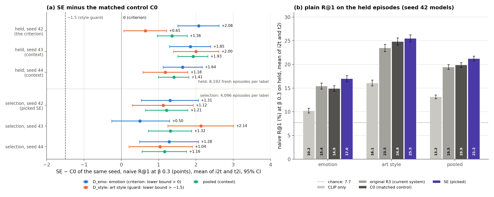
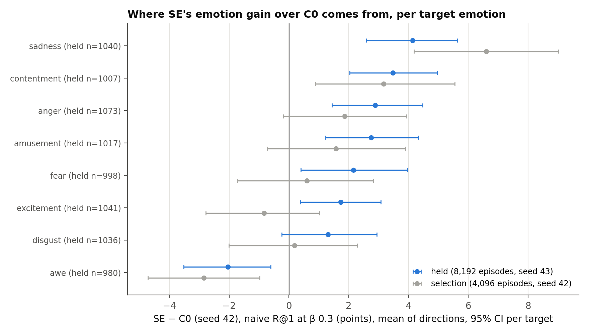

# CoSiR v2 Candidate A: affect-signal factor learning, held test (SE against C0)

## Verdict

**Confirmed. On fresh held episodes SE beats the matched control C0 on emotion and does not lose art style, so it
meets the pre-registered criterion of spec §7.** SE is the factor model picked on selection rows: its training
conditions come half from 64 clusters of GoEmotions affect vectors of the captions and half from 64 clusters of CLIP
image features. We ran it once against C0 (the same recipe without condition episodes) on 8,192 emotion and 8,192
art-style label episodes drawn with a new seed (43) from the held rows. The criterion was fixed before the run:
**confirmed iff the lower bound of `D_emo,held` is above 0 and the lower bound of `D_style,held` is above −1.5**,
where `D` is SE's R@1 minus C0's (seed 42 models, the parameter-free naive rule at β 0.3, mean of the two retrieval
directions, paired bootstrap over episodes, 5,000 resamples, seed 42).

| Comparison (seed 42, held, 8,192 episodes per label) | Point (R@1 points) | 95% CI | Bar | Met |
|---|---:|---:|---|---|
| **`D_emo,held`**: SE − C0 on emotion episodes | **+2.08** | **[+1.51, +2.62]** | lower bound > 0 | **yes** |
| **`D_style,held`**: SE − C0 on art-style episodes | **+0.65** | **[+0.07, +1.21]** | lower bound > −1.5 | **yes** |
| pooled (context, not part of the criterion) | +1.36 | [+0.96, +1.76] | none | |

In plain terms:

- **The emotion gain held up and did not shrink.** SE's emotion R@1 is 16.99% against C0's 14.92%. The gain (+2.08)
  is larger than on selection (+1.31 [+0.54, +2.06]) and more than twice the effect the power analysis assumed
  (+0.98, selection shrunk by a quarter). The two intervals overlap, so the held run gives no evidence that selection
  overstated the gain.
- **Style is protected, and slightly better.** SE's style R@1 is 25.48% against C0's 24.84%. The guard only asked for
  non-inferiority (lower bound above −1.5); the whole interval sits above 0. The style gain is small and weaker than
  on selection (+1.12), and at β 0 its interval touches 0 (+0.62 [−0.01, +1.25]), so we read it as "no loss, maybe a
  small gain", not as a style improvement (Result 3).
- **Against the current system**, the naive rule on original R3 at β 0.3, SE is +1.79 [+1.38, +2.19] pooled, +1.56
  [+1.01, +2.09] on emotion and +2.01 [+1.40, +2.60] on style. On selection SE's emotion edge over R3 was not
  significant (+0.67 [−0.10, +1.43]); on held it is. C0 itself sits below R3 on emotion again (−0.51 [−0.99, −0.02]).
- **The gain is in the code, not in its scale.** With the factor term alone (β 0), SE's emotion gain is larger
  (+2.45 [+1.84, +3.05]); matching the balance of the two score terms moves `D_emo` by at most −0.07 (Result 3).
- **All three seeds agree on held.** The replication seeds, trained separately and reported as context, give
  `D_emo,held` +1.85 [+1.29, +2.39] (seed 43) and +1.64 [+1.12, +2.17] (seed 44), and style +2.00 and +1.18. Seed 43,
  whose emotion gain on selection was small and not significant (+0.50 [−0.26, +1.29]), clears the emotion bar on
  held (Result 6).
- **What kind of signal this is.** SE is trained without ArtELingo labels, but it is distantly supervised on
  emotion. GoEmotions, PercepT's affect teacher, names 6 of the 8 evaluated emotions and reads the emotion words that
  many ArtEmis captions state (31.5% of sadness captions contain a sadness word, against 0.42% of other captions), and
  several affect clusters are near-pure proxies of one emotion. On selection rows, SE's emotion gain is +3.21 on
  episodes whose positive caption states its emotion word and +0.96 on the rest (post-hoc, selection rows, informed
  no pre-registered decision). This is not a leak, but it is not label-free factor discovery either ("What the affect signal is").

Held rows were read before, in two earlier final tests on seed-42 episodes; these seed-43 episodes are new, the rows
and paintings are not (section "Held rows: history and scope").

*Figure 1. (a) SE − C0 of the same seed in naive R@1 at β 0.3 (R@1 points, mean of image→text and text→image), 95%
bootstrap CIs over episodes. Blue: `D_emo`, the criterion; orange: `D_style`, the guard; green: pooled, context. The
top row (held, seed 42) is the pre-registered test; the other held rows are the replication seeds; the lower block
repeats the selection results for comparison. Solid line: 0 (the emotion bar). Dashed line: −1.5 (the style bar).
(b) Plain naive R@1 at β 0.3 on the held episodes for the seed-42 models, the current system (original R3) and CLIP
only, with 95% CIs; dotted line: chance (7.69%).*

## What we tested

**The task and the score.** Candidate A retrieves under a condition given by examples: 4 **supports** that have it
and 4 **contrasts** that do not. Each image and caption has a 32-number non-negative **code** from a small encoder on
frozen CLIP ViT-B/32 features (the **factors**). The **naive rule** sets factor weights with no parameters,
`w = ReLU(mean support pair code − mean contrast pair code)`, L1-normalized (a pair code is the mean of a row's image
and caption codes). A query `q` and a candidate `c` score `β · cos(CLIP_q, CLIP_c) + Σ_l w_l q_l c_l`, with β fixed at
0.3. **i2t** uses an image as the query and ranks captions; **t2i** uses a caption and ranks images.

**Label episodes.** For a target label (one of 8 emotions or 24 art styles on held), an episode has an anchor with
the label, 4 supports, 4 contrasts, and 13 candidates: 1 positive with the label and 12 negatives from paintings never
given it. **R@1** is the share of episodes where the positive ranks first (chance 7.69%); a tie counts as a miss (no
episode had one at β 0.3). ArtELingo's emotion and style labels are used only here, to evaluate.

**The models** (all trained without ArtELingo labels; none saw a held row):

| Model | What it is | Role here |
|---|---|---|
| **SE** | C0's recipe plus condition episodes, each from the affect partition or the CLIP image partition (½ each), 2,000 steps on scorer-train rows | the picked cell (seed 42 decides; seeds 43, 44 context) |
| **C0** | R3's recipe refit on scorer-train rows with painting-expanded batches; no condition episodes | the matched control of the criterion (seeds 42, 43, 44) |
| original R3 | R3's recipe on all train rows (checkpoint SHA-256 `1c299fc0…`) | the current system |
| CLIP only | the naive score with zero factor weights (`0.3 · cos`) | the floor without factors |

The affect partition is 64 MiniBatch k-means groups of the 28 sigmoid probabilities that
`SamLowe/roberta-base-go_emotions` gives each scorer-train caption; it only builds training conditions. At test time
every model reads frozen CLIP features alone. The selection report explains the cells and the rule that picked SE:
[affect factor-learning selection](2026-10-18_candidate_a_affect_factor_learning_selection.md).

**What the affect signal is, and how close it sits to the labels** (post-hoc, scorer-train rows, informed no
pre-registered decision; the selection report's "Post-hoc diagnostics", D1). GoEmotions' categories name 6 of the 8 evaluated ArtEmis emotions
directly: amusement, anger, disgust, excitement, fear and sadness; awe and contentment have no counterpart. ArtEmis
annotators explain their emotion in the caption, and many captions state the emotion word, which GoEmotions reads: a
word of the label's own family appears in 31.5% of sadness, 27.7% of anger, 22.9% of fear and 17.6% of excitement
captions, against 0.05% to 0.45% of captions with other labels. GoEmotions' argmax is "sadness" for 49.7% of sadness
captions and "fear" for 36.9% of fear captions. Several affect clusters are near-pure proxies of one evaluated
emotion (7,444 rows at 90.0% sadness, 5,791 at 87.1% fear, 2,933 at 94.5% amusement), and row-weighted cluster
purity is 0.488 against the 0.284 of always guessing the majority emotion. **This is not a leak:** the affect vectors
cover scorer-train rows only, the held paintings are disjoint from them, at test time every model reads CLIP features
only, and C0 reads the same CLIP features. **What it means:** SE is distantly supervised on emotion by an external
classifier, PercepT's affect teacher, that reads the emotion words the ArtEmis protocol leads annotators to write. The
results below describe that, not label-free factor discovery.

**The held test** (spec §7, run once on 2026-10-01 at 01:23 CEST, which is 2026-09-30 23:23 UTC; 151 seconds on the
local RTX 3090):

1. **Power first** (`--power`, written before any held read). The episode count per label came from the picked cell's
   selection `D_emo` CI (table in "Power"): 8,192 per label.
2. **Smoke** (`--smoke`): the identical code on the selection rows in place of the held rows (seed 43, 8,192 per
   label). It ran end to end with finite outputs; its numbers were discarded. As a code check it also rebuilt the
   selection episodes (seed 42, 4,096) and reproduced the selection `D_emo` and `D_style` exactly (every rank identical).
   The smoke ran twice: between the two runs the script was edited to add β-0 rows for the replication seeds (a
   reported extra). Both runs used selection rows, the edit did not touch the criterion code (per the held log), and
   the held run used the same script bytes as the second smoke (SHA-256 asserted).
3. **The run** (`--run`). The script recomputed `grouped_split(leakage_groups(...), seed=42)` and its selection
   sub-split and asserted both equal to stage (d)'s cache; asserted that held rows share no row or painting with the
   train and val parts; loaded the seven checkpoints with their SHA-256s and configs asserted; encoded **only** the
   61,744 held rows (codes and CLIP features NaN everywhere else, asserted); drew `standard_label_episodes(data,
   groups, held, label, 8192, seed=43)` and asserted every episode row is a held row. No affect vector was computed
   (the GoEmotions functions were replaced by a raising stub). The script refuses a second run.

Episode SHA-256s: emotion `abd1ca38e4e2daaf0aca850aafa2498af4b998cb25f678c6672a0a3273187b05`, art style
`ee87686c0637e3c3833cd56cbc56f496b04898c7d89a4d8f1d1eebe8608db543`. They cover 57,274 (emotion) and 57,732 (style) of
the 61,744 held rows and all 12,281 held paintings.

## Result 1: the criterion, per label and direction

SE − C0, seed 42, naive rule at β 0.3 (paired R@1 points, 95% CI):

| Label | Mean of directions | Image → text (captions ranked) | Text → image (images ranked) |
|---|---:|---:|---:|
| **Emotion** (`D_emo,held`) | **+2.08 [+1.51, +2.62]** | +1.94 [+1.17, +2.67] | +2.21 [+1.44, +2.95] |
| **Art style** (`D_style,held`) | **+0.65 [+0.07, +1.21]** | +0.32 [−0.44, +1.05] | +0.98 [+0.15, +1.79] |
| Pooled (16,384 episodes) | +1.36 [+0.96, +1.76] | +1.13 [+0.59, +1.67] | +1.59 [+1.03, +2.17] |

**The rule, by hand.** `D_emo,held` lower bound +1.51 > 0: met. `D_style,held` lower bound +0.07 > −1.5: met.
**Confirmed.** The verdict was recomputed from the stored ranks (`held_ranks.npz`) with a separate bootstrap: the
points are identical, and the CIs agree within 0.03 points across 20 other bootstrap seeds (lower bounds +1.51 to
+1.54 for emotion and +0.05 to +0.09 for style; recomputed from the stored ranks only, `run_posthoc_affect.py`).

**Reading.**

- **Emotion now gains in both directions.** On selection, SE's emotion gain came almost only from image→text
  (+2.34 against +0.27), and the selection report first read this as the gain sitting in the captions (it now marks
  that reading as a seed-42 selection result). On held, text→image gains about as much (+2.21), and it does so at all
  three seeds (text→image +2.21, +1.68, +1.68; image→text +1.94, +2.01, +1.60; on selection text→image gained +0.27,
  +0.17, +1.42). So the direction pattern on selection does not generalize; why it differed there is not
  something this test can tell (different rows and episodes). The criterion averages the two directions, so this does
  not affect the verdict.
- **Style's small gain sits in text→image**, as on selection (+0.98 here, +1.71 there): the image clusters' style
  signal helps when images are the candidates. Image→text style is flat (+0.32 [−0.44, +1.05]).

## Result 2: plain R@1, against the current system and CLIP only

Naive R@1 (%) at β 0.3 on the held episodes (mean of directions, 95% CI):

| Model | Pooled | Emotion | Emotion i2t / t2i | Art style | Style i2t / t2i |
|---|---:|---:|---|---:|---|
| CLIP only | 13.16 [12.77, 13.55] | 10.25 [9.77, 10.74] | 9.24 / 11.25 | 16.06 [15.45, 16.67] | 14.28 / 17.85 |
| original R3 (current system) | 19.45 [18.97, 19.95] | 15.43 [14.81, 16.05] | 15.42 / 15.44 | 23.47 [22.72, 24.23] | 20.51 / 26.44 |
| **C0** (control) | **19.88** [19.39, 20.38] | **14.92** [14.31, 15.52] | 15.14 / 14.70 | **24.84** [24.07, 25.59] | 21.74 / 27.93 |
| **SE** (picked) | **21.24** [20.74, 21.74] | **16.99** [16.36, 17.63] | 17.08 / 16.91 | **25.48** [24.74, 26.25] | 22.06 / 28.91 |

Paired differences (R@1 points, mean of directions):

| Comparison | Pooled | Emotion | Art style |
|---|---:|---:|---:|
| SE − original R3 | +1.79 [+1.38, +2.19] | +1.56 [+1.01, +2.09] | +2.01 [+1.40, +2.60] |
| C0 − original R3 | +0.42 [+0.08, +0.79] | −0.51 [−0.99, −0.02] | +1.36 [+0.84, +1.86] |
| SE − CLIP only | +8.08 [+7.59, +8.57] | +6.74 [+6.10, +7.37] | +9.42 [+8.67, +10.15] |
| C0 − CLIP only | +6.72 [+6.25, +7.19] | +4.67 [+4.06, +5.26] | +8.77 [+8.02, +9.50] |
| original R3 − CLIP only | +6.30 [+5.81, +6.77] | +5.18 [+4.54, +5.81] | +7.41 [+6.67, +8.14] |

**Reading.** The held numbers repeat the selection picture at a similar level (SE pooled 21.24% here, 21.22% on
selection; C0 19.88% and 20.01%). SE is the best of the four on every label. C0 is ahead of R3 on style and behind it
on emotion, on held as on selection; SE turns that emotion deficit into a lead of 1.56 points over R3. Measured against
CLIP only, what the factors add to plain CLIP similarity rises from +6.30 points (R3) to +8.08 (SE), and the emotion
part of it from +5.18 to +6.74. All models remain far from the 49.8% label-oracle R@1 that a label-aligned code
reached in the headroom probe, so emotion and style retrieval under this rule is still weak in absolute terms.

## Result 3: is the gain in the code or in its scale?

A larger code makes the factor term outweigh `0.3 · cos`, which acts like a smaller β. The ratio of the two terms'
spread across the 13 candidates at β 0.3 measures this on the held episodes: SE 3.60, C0 3.32, original R3 4.37 (the
same as on selection: 3.63, 3.37, 4.42). SE's code is 8% "louder" than C0's.

SE − C0 at each β of the grid (seed 42, naive rule, paired R@1 points; context, not part of the criterion):

| β | Emotion | Emotion i2t / t2i | Art style | Style i2t / t2i | Pooled |
|---:|---:|---|---:|---|---:|
| 0 (factor term only, scale-free) | **+2.45 [+1.84, +3.05]** | +2.15 / +2.76 | +0.62 [−0.01, +1.25] | +0.33 / +0.92 | +1.54 [+1.10, +1.97] |
| 0.03 | +2.42 [+1.81, +3.00] | +2.14 / +2.70 | +0.90 [+0.26, +1.53] | +0.52 / +1.27 | +1.66 [+1.22, +2.09] |
| 0.1 | +2.46 [+1.86, +3.02] | +2.28 / +2.64 | +0.75 [+0.13, +1.36] | +0.51 / +0.99 | +1.61 [+1.18, +2.04] |
| **0.3 (pre-registered)** | **+2.08 [+1.51, +2.62]** | +1.94 / +2.21 | **+0.65 [+0.07, +1.21]** | +0.32 / +0.98 | **+1.36 [+0.96, +1.76]** |
| 1 | +1.59 [+1.15, +2.04] | +1.50 / +1.68 | +0.60 [+0.09, +1.10] | +0.34 / +0.85 | +1.10 [+0.76, +1.43] |

Naive R@1 (%) of each model on the grid (pooled / emotion / style):

| Model | β 0 | β 0.03 | β 0.1 | β 0.3 | β 1 |
|---|---|---|---|---|---|
| SE | 21.58 / 17.66 / 25.50 | 21.71 / 17.74 / 25.67 | 21.60 / 17.64 / 25.57 | 21.24 / 16.99 / 25.48 | 19.82 / 15.05 / 24.59 |
| C0 | 20.04 / 15.20 / 24.88 | 20.05 / 15.33 / 24.77 | 20.00 / 15.18 / 24.82 | 19.88 / 14.92 / 24.84 | 18.72 / 13.45 / 23.99 |
| original R3 | 19.72 / 15.92 / 23.52 | 19.70 / 15.87 / 23.52 | 19.67 / 15.83 / 23.50 | 19.45 / 15.43 / 23.47 | 18.74 / 14.42 / 23.06 |

**Reading.**

- **The emotion gain is a property of the code.** It is larger where scale plays no role (β 0: +2.45) than at the
  pre-registered β (+2.08), and it holds in both directions at β 0 (+2.15, +2.76). Matching the balance of the two
  terms by linear interpolation on this grid (C0 at β 0.277, where its spread ratio equals SE's at 0.3; or SE at
  0.325) gives `D_emo` +2.05 and +2.01 against +2.08, a change of at most 0.07 points.
- **The style difference is small at every β** (+0.60 to +0.90) and at β 0 its interval touches 0. We therefore claim
  no naive-rule style gain at β 0; what the test shows is that SE loses no style against C0. Balance matching leaves
  it at +0.62 to +0.65. The label oracle (Result 4) suggests that SE's codes hold more linearly usable style than
  C0's (+1.78), which the naive rule with 4 supports does not turn into a clear gain.
- **Against R3 at β 0**, SE is +1.74 [+1.14, +2.36] on emotion and +1.98 [+1.34, +2.61] on style, and C0 is −0.71
  [−1.27, −0.17] on emotion; so C0's emotion deficit to R3, and SE's lead, are also in the codes, not in their scale
  (R3's codes are the loudest of the three, ratio 4.37).

## Result 4: the label oracle (how much label information can the score use?)

The label oracle fits one weight vector per label on half of that label's episodes and ranks the other half (2 folds,
200 steps); its **null** declares a random negative the positive and should sit at chance (7.69%).

R@1 (%), mean of directions, 95% CIs:

| Model | Naive, β 0.3 | Oracle, β 0.3 | **Oracle, β 0** | Oracle β 0: emotion | Oracle β 0: style | Null, β 0 | Oracle − own naive, same β 0 (pooled / emotion) |
|---|---:|---:|---:|---:|---:|---:|---|
| original R3 | 19.45 | 19.31 | 19.85 [19.37, 20.36] | 16.85 | 22.85 | 8.04 | +0.13 [−0.31, +0.60] / +0.93 |
| C0 | 19.88 | 19.84 | 20.62 [20.13, 21.12] | 16.54 | 24.71 | 8.01 | +0.58 [+0.15, +1.03] / +1.34 |
| **SE** | 21.24 | 21.98 | **23.02** [22.51, 23.55] | **19.56** | **26.48** | 7.89 | **+1.44 [+1.00, +1.90] / +1.90** |

SE's oracle minus C0's oracle: at β 0 +2.40 [+2.00, +2.82] pooled, **+3.02 [+2.44, +3.61] on emotion** (i2t +3.53,
t2i +2.51) and +1.78 [+1.19, +2.38] on style; at β 0.3 +2.14, +2.75 and +1.54. SE's oracle minus R3's oracle at β 0:
+3.17 pooled, +2.72 emotion, +3.63 style.

**Reading.** The oracle confirms both halves of the verdict with a different weighting: SE's codes hold more usable
emotion information than C0's (+3.02) and more linearly usable style (+1.78), which the naive rule turns into only a
small style difference that is not significant at β 0 (Result 3). Every null sits at chance (7.89% to 8.04%). The
gap between SE's oracle and its own naive rule (+1.44 at β 0, +1.90 on emotion) is larger than C0's (+0.58) and R3's
(+0.13), as on selection (+1.86 for SE): part of what SE's codes carry is left unused by 4 supports and 4 contrasts.
This gap is smaller than on selection and far smaller than E's there (+5.16).

**How much a smarter weighting could add.** At the operating β 0.3, SE's oracle beats its own naive rule by only
+0.74 [+0.33, +1.16] pooled (+1.14 [+0.57, +1.74] on emotion). Against the β-0 oracle the gap from the operating
point is +1.78 (23.02 against 21.24), of which +0.34 comes from lowering the naive rule's β alone (21.58 at β 0
against 21.24 at β 0.3), the same β effect that explained stage (d)'s trained-scorer result. The oracle also knows
the target label and fits its weights on half of the episodes (4,096 per label type here, about 500 per target
emotion), which a scorer reading 4 + 4 examples cannot. And on selection rows the naive rule closes the gap by itself
when it gets more examples: with 16 or 32 supports it reaches SE's β-0.3 oracle on emotion (support-count curve;
post-hoc, selection rows, informed no pre-registered decision; selection report D3). The ceiling for a trained
scorer on SE's codes is therefore about 0.7 to 1.8 points pooled, weak evidence of headroom and no larger than the
gain this test confirmed.

## Result 5: per target (which emotions and styles move)

*Figure 2. SE − C0 (seed 42) in naive R@1 at β 0.3 per target emotion, mean of the two directions, 95% bootstrap CI
within each target. Blue: held (8,192 episodes, seed 43; n per target in the labels). Gray: selection (4,096
episodes, seed 42).*

- **Emotion: a broad gain with one loser.** SE gains in 7 of 8 emotions, 6 of them with intervals above 0: sadness
  +4.13 [+2.60, +5.63] (25% of the total gain), contentment +3.48 [+2.04, +4.97] (21%), anger +2.89, amusement +2.75,
  fear +2.15, excitement +1.73; disgust +1.30 [−0.24, +2.94] is not significant. **Awe loses again**, −2.04 [−3.52,
  −0.61] (selection −2.85). On selection sadness alone was 66% of the gain; on held the gain is spread over more
  emotions. Awe has no direct GoEmotions category, which fits its loss, but contentment has none either and gains.
  On scorer-train, GoEmotions' argmax for awe captions is admiration (45.2%), which is also the most frequent
  non-neutral argmax for contentment (26.2% of its captions) and excitement (20.8%). An untested reading is that the
  affect clusters merge awe with contentment and excitement. A post-hoc check on the selection awe episodes (selection
  rows, informed no pre-registered decision) points that way, weakly: SE's extra awe misses land on contentment and
  excitement candidates (+1.67 and +1.28 of +2.85 points with each candidate's own label, neither interval excluding
  0; contentment +3.83 [+0.88, +6.78] when candidates take their painting's majority emotion; selection report D4).
- **Style: a few distinctive styles gain, a few lose, the net is small.** 12 of 24 styles gain. Four gain clearly:
  Ukiyo-e +7.92 [+4.19, +11.65], Abstract Expressionism +6.95, Pop Art +5.49 and Naive Art (Primitivism) +4.90, the
  same kind of visually distinct styles that gained on selection. Two lose clearly: Mannerism (Late Renaissance)
  −3.60 [−6.31, −0.75] and Romanticism −3.28 [−5.84, −0.85]; Rococo is again at the bottom (−2.47 [−4.94, 0.00];
  selection −4.29). The held style episodes include one style absent from selection's (New Realism, 325 episodes,
  +0.00): selection rows had too few of its paintings for it to be a target.

## Result 6: the replication seeds on held (context, not gating)

The replication seeds were trained and evaluated on selection in the previous step; here each seed's SE is compared
with the C0 of the same seed on the same held episodes, with the same bootstrap. The verdict rests on seed 42 alone.

| Seed | `D_emo,held` | i2t / t2i | `D_style,held` | i2t / t2i | Pooled | `D_emo` at β 0 | `D_style` at β 0 | Selection `D_emo` (for comparison) |
|---|---:|---|---:|---|---:|---:|---:|---:|
| **42 (criterion)** | **+2.08 [+1.51, +2.62]** | +1.94 / +2.21 | **+0.65 [+0.07, +1.21]** | +0.32 / +0.98 | +1.36 [+0.96, +1.76] | +2.45 [+1.84, +3.05] | +0.62 [−0.01, +1.25] | +1.31 [+0.54, +2.06] |
| 43 | +1.85 [+1.29, +2.39] | +2.01 / +1.68 | +2.00 [+1.40, +2.61] | +0.84 / +3.16 | +1.93 [+1.51, +2.32] | +2.18 [+1.59, +2.77] | +2.29 [+1.63, +2.94] | +0.50 [−0.26, +1.29] |
| 44 | +1.64 [+1.12, +2.17] | +1.60 / +1.68 | +1.18 [+0.58, +1.78] | +0.56 / +1.79 | +1.41 [+0.99, +1.81] | +2.01 [+1.40, +2.59] | +1.10 [+0.45, +1.73] | +1.28 [+0.49, +2.06] |

Naive R@1 (%) on held at β 0.3, emotion / style: SE 16.99 / 25.48, 16.62 / 25.96, 16.04 / 25.96 (seeds 42, 43, 44);
C0 14.92 / 24.84, 14.77 / 23.96, 14.40 / 24.78. Every seed's SE is also above original R3 on emotion (+1.56
[+1.01, +2.09], +1.19 [+0.60, +1.78], +0.61 [+0.05, +1.16]) and pooled (+1.79, +1.84, +1.55, every lower bound
above +1.1).

**Reading.** Had the criterion been applied to any of the three seeds, each would have passed: every emotion lower
bound is above +1.1 and every style lower bound above 0. The mean over seeds is +1.86 on emotion and +1.28 on style.
Seed 43's weak selection emotion gain does not recur on held (+1.85), which fits the selection report's reading that
it was a plausible low draw rather than a failure of the recipe. The three seeds share the held episodes, so these
rows are not independent tests; they show that the confirmed effect is not a property of one training run.

## Power (spec §7, fixed before the run)

`SE_sel` is the half-width of SE's selection `D_emo` CI divided by 1.96: (2.063 − 0.537) / 3.92 = **0.389** points.
The assumed effect is 0.75 × 1.306 = **0.980** points. For n episodes per label, `SE_n = 0.389 × sqrt(4096 / n)` and
power `Φ(0.980 / SE_n − 1.96)`; the rule takes the smallest n with power ≥ 0.8, else 8,192. The formula's hand check
(a `D` of 2.0 with CI [1.0, 3.0] gives SE 0.5102 and power 0.547 at 2,048 and 0.836 at 4,096, so n 4,096) was
asserted in the script.

| n per label | `SE_n` (points) | Power for `D_emo` |
|---:|---:|---:|
| 2,048 | 0.551 | 42.8% |
| 4,096 | 0.389 | 71.1% |
| **8,192 (chosen)** | **0.275** | **94.5%** |

At 8,192 the style guard (SE scaled the same way from SE's selection `D_style` CI: 0.295 points) passes whenever the
point estimate exceeds −0.92: with probability 99.9% for a true style change of 0, 92.4% for −0.5 and 39.5% for −1.0.
**Measured on held**, the SEs came out as planned: 0.282 for `D_emo` (planned 0.275) and 0.293 for `D_style` (planned
0.295). `power.json` was written at 23:17:13 UTC, the held run started at 23:23:29 UTC (both recorded and asserted).

## Held rows: history and scope

- **Earlier reads.** Held rows were read in two earlier final tests: the repair plan's
  ([condition eval on repaired factors](2026-10-12_candidate_a_condition_eval_repaired_factors.md)) and stage (d)'s
  ([stage (d) final held-out test](2026-10-14_candidate_a_stage_d_final.md)), both on seed-42 held label episodes,
  1,024 per label (SHA-256 emotion `e62ab41f…`, style `3a58cf9d…`). The factor-learning 2×2 never read them. **These
  seed-43 episodes are new** (their SHA-256s, and those of their first 1,024, differ from the earlier ones; asserted);
  the rows and paintings are not. Nothing in this experiment's design was chosen on held numbers, but the project's
  direction after stage (d) was.
- **What touched held rows here.** Only the frozen encoders (to encode them) and the label-episode sampler. No model
  was trained or fitted on a held row, no affect vector was computed for any row in this phase, and the label oracle
  is cross-validated within the held episodes (it fits weights on half of them, which is why it is a diagnostic and
  not a model).
- **Once.** The held phase ran once (one recorded attempt; the script refuses a rerun). Original R3's held codes are
  bit-identical to the ones stage (d) encoded.

## What this means

1. **Distant supervision on emotion from PercepT's affect teacher made the factors carry emotion, and the gain
   survives a held test.** After the 2×2 and the headroom probe found no label-free route to emotion, conditions
   built from GoEmotions clusters of the captions (half of SE's conditions) raise emotion R@1 over the matched control
   by about 2 points on held, at every seed, in the code itself (β 0 and the oracle agree), without a style loss.
   The models never see an ArtELingo label, but the affect clusters are an emotion pseudo-partition: GoEmotions names
   6 of the 8 evaluated emotions and reads the emotion words many captions state, and on selection rows SE's gain is
   concentrated in episodes whose positive caption states its emotion (+3.21 against +0.96). SE is the first
   condition-episode factor recipe confirmed on held data, and its gain is the first emotion gain over the matched,
   non-collapsed control. It is not the first factor change confirmed on held: R3's repair beat the collapsed R0 on
   held, emotion included ([condition eval on repaired factors](2026-10-12_candidate_a_condition_eval_repaired_factors.md)).
2. **SE beats the current system on both labels.** Against the naive rule on original R3, SE gains 1.56 points on
   emotion and 2.01 on style (pooled +1.79), and it widens what the factors add over CLIP only from 6.30 to 8.08
   points. Most of the style edge comes from C0's recipe, not from the condition episodes: C0 alone is +1.36 of SE's
   +2.01 on style. And C0 sits below R3 on emotion at every seed (−0.51, −0.66, −1.03); whether that cost comes from
   the painting-expanded batches or from training on fewer rows (scorer-train only) is not separated here. The
   comparison against R3 is context: R3 was trained on all train rows and C0 is the controlled baseline.
3. **The size is modest in absolute terms.** Emotion R@1 goes from 14.9% to 17.0% with 13 candidates, and the label
   oracle on SE's codes reaches 19.6% on emotion, far below the 49.8% of a label-aligned code. SE is a better factor
   recipe, not a solution to emotion retrieval. A weighting smarter than the naive rule has little room: at the
   operating β the oracle beats the naive rule by +0.74 pooled, the ceiling is about 0.7 to 1.8 points, and on
   selection more supports close the gap without any trained component (Result 4).

## Next steps

This report closes the pre-registered part of the affect factor-learning plan. What follows is for the user to
decide; none of it is planned. Each option comes with its cost.

- **(a) Adopt SE as the v2 factor model**, framed as distant supervision from PercepT's affect teacher, with C0 as
  its control, and move on to the v2 publication plan and stage (e). Cost: no new compute for the adoption itself;
  stage (e), a human-judged set, is its own effort. The publication plan has to carry the disclosure above (the
  affect signal tracks the labels, and much of the selection gain sits where captions state the emotion word).
- **(b) A trained scorer on SE's codes: not recommended.** It was to be considered only if more supports could not
  close the oracle gap, and they do (selection report D3). Its ceiling is about 0.7 to 1.8 points pooled, no larger
  than the gain already confirmed. Cost if pursued anyway: a stage-(d)-sized effort with a new pre-registration and
  fresh episodes.
- **(c) Baselines a paper will need, which require a spec amendment.** The naive rule on the 28-d GoEmotions codes
  themselves (a teacher-only baseline: how far does the affect teacher get without any factor learning?), and a
  comparison with PercepT. Cost: an amendment, since the current spec forbids running GoEmotions on evaluation
  captions; a GoEmotions pass over those captions (minutes on the local GPU); and new evaluation episodes, which for a
  held number means another held read (see (d)).
- **(d) A held-row budget.** Held rows have now been read in three final tests (the repair plan's, stage (d)'s and
  this one). Fix a budget for further held reads before any new pre-registration. Cost: a decision, no compute.

A larger emotion gain with a style safeguard of another kind (E gained +3.99 on selection but lost style) would need
a new pre-registration and fresh episodes; it is not among the options above.

## Caveats (spec §11 and the 2×2's lessons)

- **Taxonomy overlap and mismatch.** GoEmotions' 28 Reddit categories are not ArtEmis's 9, but they name 6 of the 8
  evaluated emotions (amusement, anger, disgust, excitement, fear, sadness). The emotion word appears in 18% to 32% of
  anger, excitement, fear and sadness captions against under 0.5% of other captions, GoEmotions' argmax is "sadness"
  for 49.7% of sadness captions and "fear" for 36.9% of fear captions, and six affect clusters are at least 85% one
  emotion (selection report D1). Awe, without a direct counterpart, loses on held as on selection (−2.04); the other
  seven emotions gain or hold.
- **Distant supervision.** SE is trained without ArtELingo labels but with an emotion signal that tracks them
  closely. The emotion-word split was measured on selection rows only (held rows are not read again), so how much of
  the held gain sits in episodes whose captions state the emotion word is not known.
- **Image side.** Images carry little emotion (image→emotion probe 35.2% against a 28.4% majority). On held the
  emotion gain is nevertheless as large in text→image (images ranked) as in image→text; on selection at seed 42 it
  was not. The criterion averages the two directions.
- **Affect clusters and content.** The affect partition's AMI with art style is 0.016, so it does not follow visual
  style; it may still follow caption subject matter, which we did not measure.
- **Selection rows were read many times**; this held test on fresh episodes is what confirms. Held rows were read in
  two earlier final tests (section above).
- **The control is C0, not R3.** C0 is 0.51 points below R3 on emotion on held; SE's emotion edge over R3 (+1.56) is
  smaller than over C0 (+2.08). R3 and R0 were trained on all train rows; C0 and SE on scorer-train rows only.
- **Code scale acts like β.** SE's code is 8% louder than C0's; its emotion gain is larger at β 0 and moves by at
  most 0.07 points when the balance is matched (Result 3). The small style difference is claimed only as "no loss"
  under the naive rule.
- **One seed decides; episodes reuse rows.** The verdict rests on seed 42; seeds 43 and 44 agree but share the held
  episodes. 16,384 episodes reuse 61,744 rows and 12,281 paintings. The held CIs resample episodes under fixed models
  and do not include training randomness. On selection, resampling anchor paintings instead of episodes widened
  `D_emo`'s interval by a factor of 1.02 and `D_style`'s by 1.01 (selection report D5), so anchor reuse is unlikely
  to make the held intervals materially optimistic; the reuse of other roles is not measured. A guard pass here is a
  non-inferiority statement; had it failed, that would have meant failure to show non-inferiority, not a shown loss.
- **Sparsity is report-only by an amendment.** The spec made sparsity report-only after the 2×2's S had failed it,
  before any run of this experiment. SE's caption codes fail that cap at every seed (0.515 to 0.529 against 0.50), so
  SE's eligibility at selection depends on that amendment. The held test does not revisit gates.
- **Mechanisms are inferences.** Why the direction pattern differs between selection and held, why awe loses, and
  why SE's style gain is small are readings, not tested results.

## Sanity checks

- `power.json` (n 8,192) was written before the held phase started; the held run refused to start without it, without
  a passing smoke of the same script bytes (SHA-256 `11d5c73f…`), or with an earlier held result present.
- The smoke ran the whole path on selection rows and reproduced the selection `D_emo` (+1.31 [+0.54, +2.06]) and
  `D_style` (+1.12 [+0.29, +1.93]) exactly on the selection episodes (identical-rank share 1.000; episode SHA-256s
  equal to run_affect's).
- The recomputed split and selection sub-split equal stage (d)'s cache (split sizes 216,107 / 30,872 / 61,744); held
  rows and paintings are disjoint from the train and val parts.
- Checkpoint SHA-256s equal the ones recorded at selection and replication (SE seed 42 `93add21b…`, C0 seed 42
  `7653caf0…`, SE 43 `eb99d045…`, C0 43 `533ead77…`, SE 44 `badde4ad…`, C0 44 `0c6925ee…`; R3 `1c299fc0…`); configs
  asserted (`grid.cell_config("S" / "C0", seed)`, `R3_CONFIG`).
- Codes are finite on held rows and NaN elsewhere; every episode row is a held row (asserted). R3's held codes are
  bit-identical to stage (d)'s.
- No tie at β 0.3 for any model and label; every oracle null is within 0.4 points of chance.

## Files

- Spec: [affect factor-learning design](../../../superpowers/specs/2026-09-30-cosir-v2-candidate-a-affect-factor-learning-design.md)
  (§7 the held test, §11 caveats).
- Script: `src/test/20261019_affect_factor_learning_held/run_held.py` (`--power`, `--smoke`, `--run`, `--tables`;
  `held_episode_count` and `held_verdict` hold the pre-registered power rule and criterion). It reuses
  `run_affect.py`, the 2×2's `run_grid.py` and stage (d)'s cache.
- Post-hoc diagnostics (added 2026-10-01, selection and scorer-train rows only, plus a re-bootstrap of the stored held
  ranks): `src/test/20261018_affect_factor_learning/run_posthoc_affect.py`, reported in the selection report's
  "Post-hoc diagnostics" (D1 to D5).
- Log: `src/test/20261019_affect_factor_learning_held/20261019_affect_factor_learning_held_log.md`.
- Figures: `docs/reports/assets/2026-10-18_affect_factor_learning/held_criterion.png` and `held_per_target_emotion.png`,
  built by `docs/reports/assets/build_2026-10-18_affect_factor_learning_figures.py`.
- Gitignored, local only: `results/power.json`, `results/smoke_held.json` (discarded numbers), `results/held_started.json`,
  `results/held_results.json` (every number above), `results/held_ranks.npz`, and the run logs.
- Previous step: [affect factor-learning selection](2026-10-18_candidate_a_affect_factor_learning_selection.md).
