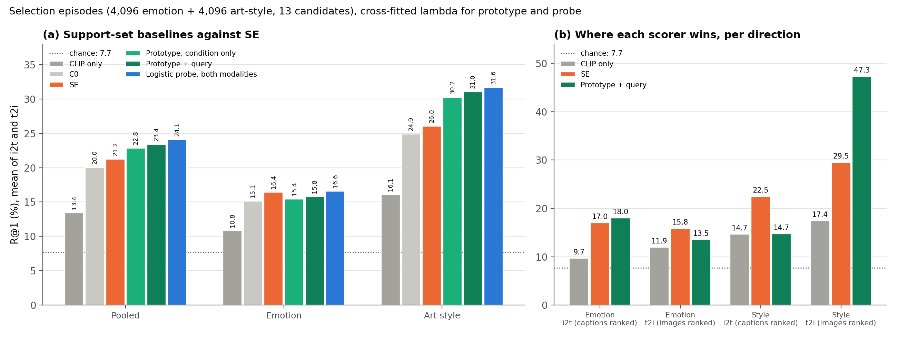

# CoSiR v2: do simple support-set baselines match SE on the label episodes? (spike)

## Verdict

**No, SE does not hold the lead. Simple support-set baselines on raw CLIP features beat SE pooled, and the gain
is all in art style.** The best is a logistic probe fitted on the 4 + 4 examples of both modalities: pooled R@1
24.10% against SE's 21.22% (difference +2.87 [+2.14, +3.64]) and CLIP only's 13.45%. On art style it gains +5.62
[+4.48, +6.71] over SE; on emotion it is matched, not beaten (+0.13 [−0.89, +1.15]). **The query adds little.** A
prototype scorer that never looks at the query reaches 22.83, already above SE, and adding the query moves it by
+0.57 [+0.20, +0.96]. In these label episodes every support carries the anchor's label and every distractor lacks
it, so the supports alone identify the positive. The episodes therefore mostly measure few-shot recognition of a
label value from examples, not conditional similarity between a query and a candidate. Where SE does win, it wins
cross-modally (style i2t, emotion t2i), which a within-modality baseline cannot do. The claim "learned factors beat
the obvious few-shot baseline" does not hold today. This is a diagnostic spike on selection rows, input to the CVPR
plan, not a decision.

## What we tested

All numbers are R@1 (%) on the 4,096 emotion and 4,096 art-style label episodes of the affect selection run
([report](2026-10-18_candidate_a_affect_factor_learning_selection.md)), 13 candidates each, chance 7.69%, mean of
the two retrieval directions unless a direction is named. In an episode the *anchor* is the query, the *positive* is
the candidate with the anchor's label, the *supports* are 4 other items with that label and the *contrasts* are 4
items without it. i2t ranks captions for an image query, t2i ranks images for a caption query. Differences are
paired bootstrap over episodes, 5,000 resamples, seed 42.

Scorers (all on raw CLIP ViT-B/32 features, no training except the probe fit inside each episode):

- **CLIP only**: cosine of query and candidate. **C0** and **SE** are the factor models of the affect run, scored
  with the *naive rule* (the parameter-free rule that turns the supports and contrasts into condition weights,
  β 0.3, stored ranks reproduced exactly). SE is the affect-signal model that passed the held test; C0 is its
  matched control.
- **Prototype**: score the candidate by its cosine to the mean support minus its cosine to the mean contrast, in
  the candidate's own modality. **Condition only** means the query is ignored (`proto` at λ = ∞). **Prototype +
  query** (`proto_cv`) adds the query: z(cos(query, candidate)) + λ · z(prototype term), with λ picked by
  cross-fitting.
- **Probe**: an L2 logistic regression (C = 1) fitted per episode on the supports (label 1) and contrasts (label
  0), applied to the candidates. `probe` uses the candidate modality only; **`probe_x` uses both modalities**
  (4 + 4 images and 4 + 4 captions).
- Other terms are in the table below: `proto_pos` (supports only), `dir` (a support minus contrast direction applied
  to the query and the candidate), `SE_term` and `C0_term` (the factor term alone, tuned), `raw_naive` (the naive
  rule on raw coordinates).

λ was chosen on the pooled R@1 of one episode parity half and applied to the other (cross-fitting). The spike
reproduced the stored episodes (SHA-256), CLIP only, C0 and SE ranks exactly before any new scorer was run.

## Results

*Figure 1. R@1 (%) on the selection episodes. (a) Pooled, emotion and art style for CLIP only, C0, SE, the
condition-only prototype, the prototype with the query and the both-modality probe. (b) The four direction by label
cells for CLIP only, SE and the prototype with the query. Dotted line: chance, 7.69%. Cross-fitted λ for the
prototype and probe, naive β 0.3 for SE and C0.*

### Result 1: support-set baselines beat SE pooled

| Scorer | Pooled | Emotion | Style | Pooled − SE, paired 95% CI |
|---|---:|---:|---:|---|
| CLIP only (baseline of everything) | 13.45 | 10.83 | 16.06 | |
| C0 (SE's matched control) | 20.01 | 15.12 | 24.89 | |
| **SE** (naive rule, β 0.3) | 21.22 | 16.43 | 26.01 | |
| Prototype, condition only | 22.83 | 15.44 | 30.21 | +1.61 [+0.82, +2.40] |
| Prototype + query (`proto_cv`) | 23.40 | 15.77 | 31.03 | +2.18 [+1.43, +2.96] |
| Probe, one modality (`probe_cv`) | 23.57 | 15.89 | 31.24 | +2.34 [+1.61, +3.13] |
| **Probe, both modalities (`probe_x_cv`)** | **24.10** | **16.56** | **31.63** | **+2.87 [+2.14, +3.64]** |
| Supports only prototype (`proto_pos_cv`) | 20.81 | 12.76 | 28.87 | −0.41 [−1.20, +0.42] |
| Direction (`dir_cv`) | 18.73 | 11.76 | 25.71 | −2.49 [−3.23, −1.76] |
| SE factor term alone, tuned (`SE_term_cv`) | 21.91 | 17.46 | 26.35 | +0.68 [+0.33, +1.04] |
| C0 factor term alone, tuned (`C0_term_cv`) | 20.45 | 15.83 | 25.07 | −0.77 [−1.39, −0.18] |
| `raw_naive_cv` (scale artifact, see below) | 13.46 | 10.88 | 16.05 | −7.76 [−8.47, −7.06] |

Paired differences by label against SE:

| Scorer minus SE | Emotion | Style |
|---|---|---|
| Condition-only prototype | −0.99 [−2.08, +0.10] | +4.20 [+3.02, +5.40] |
| Prototype + query | −0.66 [−1.68, +0.35] | +5.02 [+3.87, +6.16] |
| Probe, both modalities | +0.13 [−0.89, +1.15] | +5.62 [+4.48, +6.71] |

Reading. The probe beats SE pooled by +2.87 points, and nearly all of it is art style (+5.62). On emotion no
support baseline is distinguishable from SE (every interval contains 0), so we say matched, not beaten. SE's
emotion edge over C0 (+1.31 on selection, +2.08 on held) is real, but it does not translate into an edge over a
prototype of the supports. The fair SE comparator is `SE_term_cv` (the factor term alone, tuned), which is +0.68
above the untuned stored SE; against it the probe's pooled lead is smaller but still positive, and on emotion
`SE_term_cv` (17.46) is the highest scorer in the table, 0.9 above the probe. We did not pair those two, so we make
no claim about that gap.

### Result 2: the query adds little, so the episodes mostly test few-shot recognition

| Scorer | Pooled | Emotion | Style |
|---|---:|---:|---:|
| Prototype, condition only | 22.83 | 15.44 | 30.21 |
| Prototype + query | 23.40 | 15.77 | 31.03 |
| Query adds (paired) | +0.57 [+0.20, +0.96] | +0.33 [−0.16, +0.83] | +0.82 [+0.22, +1.39] |

A scorer that ignores the query reaches 22.83, above SE (21.22) and above C0 (20.01), and the query lifts it by 0.57
points. The mechanism is in the episode design (`src/eval/label_episodes.py`): the positive shares the anchor's label
with every support, and no distractor does. Evidence about the label therefore ranks the positive first without any
reference to the query. This is not conditional similarity, where the right answer depends on both the query and the
condition. GeneCIS avoids the shortcut: its gallery mixes distractors that match only the reference and distractors
that match only the condition ([feasibility check](2026-10-20_genecis_feasibility.md) §1 and §7, where slots 0 to
8 are similar scenes without the condition and slots 9 to 13 other scenes with it). A condition-only scorer cannot
win there. The label-episode benchmark can, and does.

### Result 3: where SE wins, it wins cross-modally

| Cell (candidate ranked) | CLIP only | SE | Prototype + query | Leader |
|---|---:|---:|---:|---|
| Style i2t (captions) | 14.70 | **22.51** | 14.75 | SE, +7.76 |
| Emotion t2i (images) | 11.94 | **15.84** | 13.55 | SE, +2.29 |
| Emotion i2t (captions) | 9.72 | 17.02 | **17.99** | prototype, +0.97 |
| Style t2i (images) | 17.43 | 29.52 | **47.31** | prototype, +17.79 |

SE leads where the candidate's modality carries the aspect weakly: art style in captions and emotion in images. The
prototype leads where the candidate modality carries the aspect directly: art style in images (47.31 against 29.52)
and emotion in captions (17.99 against 17.02). The prototype on style i2t (14.75) is no better than CLIP only
(14.70), while SE reaches 22.51. We did not test the cell-level differences with intervals.

Reading, not a tested result: the shared factor space carries a condition shown in one modality over to the other,
which a within-modality prototype cannot do. This matches the headroom probe, where style was found to be visual and
emotion textual ([headroom probe](2026-10-15_candidate_a_factor_headroom_probe.md), Result 3). The probe on both
modalities recovers part of the cross-modal gap (style i2t 17.90, emotion t2i 14.62) but does not close it.

### Result 4: `raw_naive` is not evidence

`raw_naive_cv` (13.46 pooled) equals CLIP only (13.45). The naive rule's factor term is computed on raw CLIP
coordinates, which are unit-norm with entries near 1/√512, so the term is about 1e-3 against a cosine in [−1, 1]
and β has no effect (the grid edge β = 1 was picked). It is a scale artifact, not a test of the naive rule on raw
features, and we draw nothing from it.

## What this means for the publication plan

- The claim "learned factors beat the obvious few-shot baseline" does not hold on these episodes today.
- The label-episode benchmark needs query-dependent episodes before it can test conditional similarity: for example
  condition-only distractors (match the label, wrong query relation), reference-only distractors, or conditions
  that name an aspect ("style") rather than a value.
- A method that combines within-modality support evidence with cross-modal factor transfer is the natural next
  candidate, since each side wins in the cells the other loses (Result 3).
- All of this is input to the CVPR plan being brainstormed, not a decision.

## Caveats

- Selection rows, read many times. Diagnostic, not pre-registered. One seed of SE, episode level CIs only.
- The λ grid ended at 4 and every pick for the prototype and probe terms sat at that edge (λ 4 in both folds, except
  `proto_pos` and the factor terms at ∞), so the prototype and probe numbers are, if anything, conservative.
- Cross-fitting splits by episode parity. Paintings can recur across the halves, so the split does not separate
  paintings, but only one λ is chosen per fold.
- SE is scored untuned at β 0.3; its tuned factor term is 0.68 points higher pooled (Result 1).
- The probe uses a batched Newton solver in the dual form of sklearn's objective. Within episode ordering equals
  sklearn at tol 1e−10 on 100% of 50 random episodes per setting; against sklearn's default tolerance it was 96% on
  emotion i2t (stopping noise, not the objective).

## Files

- Script: `src/test/20261022_support_baseline_spike/run_spike.py` (CPU, 22 s, throwaway; selection rows only).
- Log: `src/test/20261022_support_baseline_spike/20261022_support_baseline_spike_log.md`.
- Gitignored, local only: `src/test/20261022_support_baseline_spike/results/spike_results.json`, `spike_ranks.npz`,
  `run_spike.log`.
- Figure: `docs/reports/assets/2026-10-22_support_baseline_spike/support_baselines.png`, built by
  `docs/reports/assets/build_2026-10-22_support_baseline_spike_figures.py`.
- Previous step: [affect factor-learning held test](2026-10-19_candidate_a_affect_factor_learning_held.md).
