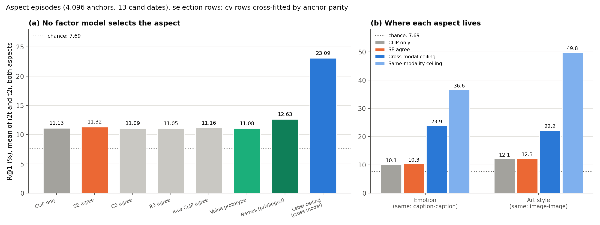

# CoSiR v2: can a factor model select the aspect on cross-modal aspect episodes? (spike)

## Verdict

**No. On cross-modal aspect episodes no factor model selects the aspect, although the task is learnable.** SE with
the agreement rule reaches 11.32% pooled R@1 against CLIP only's 11.13% (difference +0.20 [−0.12, +0.50], the
interval includes 0). C0 (11.09), R3 (11.05), the raw CLIP agreement rule (11.16) and the value prototype (11.08)
are also at CLIP level, and chance is 7.69%. Only the privileged `names` reference, which is told the label names,
gains: 12.63, +1.51 [+0.94, +2.09] over CLIP only. The task itself is not the obstacle. Probes fitted with the human
labels reach about 24 (emotion) and 22 (art style) cross-modally against CLIP's 10 and 12, a pooled ceiling of 23.09
against CLIP's 11.13. Our factors capture none of that headroom. Emotion is carried by captions and style by images,
so a cross-modal match depends on the weaker modality, which caps this task on ArtELingo. This is a diagnostic spike
on selection rows, input to the CVPR plan, not a decision.

## What we tested

All numbers are R@1 (%) on 4,096 *aspect episodes* built on the selection rows of the affect run
([report](2026-10-18_candidate_a_affect_factor_learning_selection.md)), 13 candidates each, chance 7.69%, mean of
the two retrieval directions unless a direction is named. i2t ranks captions for an image anchor, t2i ranks images
for a caption anchor. The *anchor* is the query. Differences are paired bootstrap over anchors, 5,000 resamples,
seed 42.

**Episode design.** The previous spike showed that value episodes (the supports carry the anchor's own label) are
solved by the supports alone ([support-baseline spike](2026-10-22_support_baseline_spike.md), Result 2). So the
examples here never carry the anchor's value; they name an *aspect* and the target is the candidate that shares the
anchor's value of that aspect.

- The 13 candidates are shared by both conditions: [p_emo, p_style, 11 negatives]. p_emo shares the anchor's
  emotion, p_style shares its art style, and the 11 negatives share neither.
- Two sets of 4 cross-item example pairs (an image from one painting, a caption from another). In P_emo the 4 pairs
  share an emotion that differs from the anchor's; in P_style they share a style that differs from the anchor's.
  No example row has the anchor's emotion or style, and all 30 rows of an episode come from 30 distinct paintings.
- Under the *emotion* condition P_emo are the supports and P_style the contrasts, and the target is p_emo. Under the
  *style* condition the roles swap and the target is p_style. The other-aspect candidate is therefore the
  hardest distractor.
- Eligible values: 8 emotions (not "something else") and 23 styles with at least 30 selection paintings. 0 draw
  failures; every constraint was asserted on the final arrays.

**Scorers.** *CLIP only* is the cosine of anchor and candidate. **SE**, **C0** and **R3** are the factor models of
the affect and candidate A runs (SE: affect signal; C0: its matched control; R3: the repaired factor recipe).
Each gets the *agreement rule*, which turns the examples into condition weights with no training:

w = ReLU( mean over supports of a_I(x) ⊙ a_T(y) − mean over contrasts of a_I(x') ⊙ a_T(y') ), L1-normalized,

where a_I and a_T are the image and caption factor codes of an example pair (x, y) and ⊙ is the elementwise
product. The factor term is Σ w · a(anchor) ⊙ a(candidate). The final score is z(cos) + λ · z(term), with z a
per-episode standardization and λ chosen by cross-fitting on anchor parity (grid 0, 0.25, 0.5, 1, 2, 4, 8, 16, ∞).
*Raw agree* applies the same rule to raw CLIP coordinates (with and without the ReLU). The *value prototype* scores a
candidate by its cosine to the mean support minus its cosine to the mean contrast, in the candidate's own modality.
*Names* (privileged) uses the label names as text prompts and is a reference, not a scorer we could ship. We also
report the *swap success*: the share of anchors where p_emo scores above p_style under the emotion condition and
p_style scores above p_emo under the style condition (a pairwise order between the two aspect candidates; the
*strict* variant asks for R@1 = 1 under both conditions). The *label ceiling* is described in Result 3.

## Results

*Figure 1. R@1 (%) on the aspect episodes. (a) Pooled over both aspects and directions: CLIP only, the agreement
rule on SE, C0, R3 and raw CLIP, the value prototype, privileged names and the cross-modal label ceiling. (b) Per
aspect: CLIP only, SE agree, the cross-modal label ceiling and the same-modality ceiling (caption to caption for
emotion, image to image for style). Dotted line: chance, 7.69%. cv rows cross-fitted by anchor parity.*

### Result 1: no factor model beats CLIP only

| Scorer | Emotion | Style | Pooled | Pooled minus CLIP, paired 95% CI |
|---|---:|---:|---:|---|
| CLIP only (baseline of everything) | 10.14 | 12.11 | 11.13 | |
| **SE agree (cv)** | 10.34 | 12.30 | 11.32 | +0.20 [−0.12, +0.50] |
| C0 agree (cv) | 10.03 | 12.15 | 11.09 | −0.04 [−0.34, +0.26] |
| R3 agree (cv) | 10.27 | 11.84 | 11.05 | −0.07 [−0.47, +0.31] |
| Raw CLIP agree (cv) | 10.29 | 12.02 | 11.16 | +0.03 [−0.25, +0.32] |
| Value prototype (cv) | 10.16 | 12.01 | 11.08 | −0.04 [−0.26, +0.17] |
| Names (privileged, cv) | 13.31 | 11.96 | 12.63 | +1.51 [+0.94, +2.09] |
| SE agree at β 0.3, uncross-fitted | 10.39 | 11.51 | 10.95 | |
| SE value rule at β 0.3 | 11.91 | 11.98 | 11.94 | |

Reading. Every non-privileged scorer is within 0.3 points of CLIP only and every interval contains 0. SE against
the control C0 is +0.23 [−0.12, +0.59], so even SE's affect advantage on label episodes does not carry over. The
other-aspect rate (how often the other-aspect candidate ranks first, 11.13 for CLIP only) stays at 10.7 to 11.0
for the cv scorers, so they do not confuse the aspects more or less than CLIP does. The cross-fitted λ picks are
small (0.25 to 0.5 for SE, C0, R3 and raw agree, 0 for one fold of C0 and of the prototype), because R@1 falls as
λ grows. The raw agreement rule with the ReLU picked λ = 0 in both folds and equals CLIP only exactly. Names helps
on emotion only (+3.2 over CLIP only, 13.31 against 10.14) and is limited by weak zero-shot accuracy: emotion
prompts on captions reach 31.3% (majority class 31.8%) and style prompts on images 27.5% (majority 16.1%).

### Result 2: the swap test must be read next to R@1

The swap success of the cv scorers is small (SE 4.96, C0 4.43, R3 6.65, raw agree 6.96, prototype 3.49, names
20.12; CLIP only 0.00). That is not a finding of aspect selection. Under λ = ∞ the prototype and raw agree scores
are exactly antisymmetric between the two conditions (swapping the roles negates the term), so swap success is
about 50% for any ordering: it reached 51.6 and 51.8 while R@1 was 8.0 and 8.6, at or below chance. An independent
random scorer reaches 25%. The uncross-fitted factor rows at β 0.3 show 16 to 18% swap because the factor term
dominates the cosine at raw code scale, again with R@1 at chance level. Swap success rises with λ while R@1 falls,
so a high swap with a CLIP-level R@1 means a scorer that moves with the condition without being correct. We report
swap only next to R@1.

### Result 3: the task is learnable, and each aspect lives in one modality

The *label ceiling* is diagnostic only: for each aspect we fit a multinomial logistic regression with the human
labels on 60,000 scorer-train rows (one per modality, on the normalized CLIP features), take an item's class
posterior, and score a candidate by the dot product of its posterior with the anchor's, using the image probe on
image sides and the caption probe on caption sides. It scores this term alone, without CLIP. We evaluated it on the
same episodes. "Same-modality" scores compare the anchor and the candidates inside one modality, which is not the
cross-modal task.

| Aspect | CLIP i2t | CLIP t2i | Ceiling i2t | Ceiling t2i | Same-modality ceiling |
|---|---:|---:|---:|---:|---:|
| Emotion | 9.42 | 10.86 | 23.58 | 24.29 | 36.62 (caption to caption) |
| Art style | 10.77 | 13.45 | 21.41 | 23.07 | 49.80 (image to image) |

| Probe selection accuracy (%) | From image | From caption |
|---|---:|---:|
| Emotion | 35.2 | **56.9** |
| Art style | **60.8** | 25.4 |

Reading. Cross-modal ceilings are 21 to 24 against CLIP's 9 to 13, so about 11 to 14 points of headroom exist and
SE takes +0.2 of them. Emotion is carried by captions (caption probe 56.9 against 35.2 from images, caption to
caption ceiling 36.6 against 17.9 image to image) and art style by images (60.8 against 25.4; image to image 49.8
against 13.1 caption to caption). A cross-modal match must read one aspect through its weaker modality, which is
why the cross-modal ceilings (about 24 and 22) sit well below the best same-modality ones (36.6 and 49.8). This is
the same pattern as the earlier headroom probe ([report](2026-10-15_candidate_a_factor_headroom_probe.md)). On
datasets whose captions describe what the image shows, such as CUB and COCO, we expect both modalities to carry the
aspect and the cross-modal ceiling to sit closer to the same-modality one. That is an expectation to test, not a
result.

## What this means for the publication plan

- The user chose method A: train the shared factors for aspect selection, with pseudo-aspect episodes built from
  two or more pseudo-partitions (so that no human label is needed at training time).
- The go/no-go target is selection-row aspect R@1 above CLIP (about 11 pooled), measured against the label ceiling
  (about 23). A trained factor model that does not leave the CLIP band on these episodes does not pass.
- CUB (now downloading) gets the same two checks first: CLIP only and the label-supervised ceiling. If CLIP is
  already near the ceiling there, the benchmark has no headroom and we should not build on it.
- The agreement rule on existing factors is closed as a route here. SE's earlier edge on value episodes did not
  survive an episode design where the supports cannot identify the positive by themselves.
- All of this is input to the CVPR plan being brainstormed, not a decision.

## Caveats

- Selection rows, read many times. Diagnostic, not pre-registered. One seed per model, anchor-level CIs only.
- The λ grid was shared by all cv rows and the picks are small (Result 1); the cv rows are tuned on R@1, so they
  cannot show a larger swap success at a price in R@1.
- Emotion labels are per annotation, and an image takes the emotion of its row, which is a noisy image label. The
  image emotion probe (35.2) and the emotion ceilings are therefore conservative.
- The label ceiling uses 60,000 of the scorer-train rows and one probe family. It is a diagnostic, not a bound in
  the strict sense; a better probe could score higher.
- Zero-shot names is no better than the majority class on emotion (31.3 against 31.8), so its gain is not a
  measure of what names can give.

## Files

- Script: `src/test/20261023_aspect_episode_spike/run_aspect.py` (35 s, one GPU process for CLIP text encoding,
  throwaway; selection rows asserted). Ceiling check: `src/test/20261023_aspect_episode_spike/aspect_ceiling.py`
  (about 2 minutes, CPU).
- Log: `src/test/20261023_aspect_episode_spike/20261023_aspect_episode_spike_log.md`.
- Gitignored, local only: `src/test/20261023_aspect_episode_spike/results/aspect_results.json`, `aspect_ranks.npz`,
  `aspect_episodes.npz`, `run_aspect.log`.
- Figure: `docs/reports/assets/2026-10-23_aspect_episode_spike/aspect_episodes.png`, built by
  `docs/reports/assets/build_2026-10-23_aspect_episode_spike_figures.py`.
- Previous step: [support-baseline spike](2026-10-22_support_baseline_spike.md).
