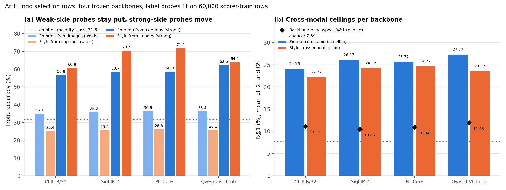

# CoSiR v2: which frozen backbone joins CLIP ViT-B/32? (backbone check)

## Verdict

**The weaker-modality probes barely move across four backbones, so the modality asymmetry is a property of the data,
not of the encoder.** On ArtELingo, emotion read from images scores 35.1 (CLIP ViT-B/32), 36.3 (SigLIP 2), 36.6
(PE-Core) and 36.4 (Qwen3-VL-Embedding-2B), and style read from captions scores 25.4, 25.9, 26.3 and 26.1. The spread is
1.5 and 0.9 points. The strong-side probes move much more: emotion from captions rises from 56.9 to 62.5 (Qwen), style
from images from 60.9 to 71.9 (PE). This supports our analysis claim C3 (a cross-modal aspect match is capped by the
weaker modality). On the criterion fixed in advance, the cross-modal label ceiling, the three strong backbones are
within 0.5 points of each other (sum of the emotion and style ceilings: Qwen 50.99, PE 50.49, SigLIP 2 50.49) and all
sit about 4 points above CLIP (46.42). The ceiling does not separate them, so the choice rests on the trade-offs
below. We did not choose here; on 2026-10-02 the user picked Qwen3-VL-Embedding-2B, mainly because the aspect named in its instruction gives an examples versus names baseline on the same backbone, subject to a fidelity check of our reimplementation against the official code. This is a throwaway diagnostic on selection rows, a follow-up to the
[aspect-episode spike](2026-10-23_aspect_episode_spike.md).

## What we tested

**Question.** Which frozen backbone sits beside CLIP ViT-B/32 in the final tables? The criterion fixed in advance was
the *label-probe ceiling* on ArtELingo aspect episodes (R@1 % when the factor coordinates are replaced by logistic
probes fitted with the human labels; probes use 60,000 scorer-train rows, episodes use selection rows, val and held
were never read), plus attribute probes on CUB. Baseline of every number: CLIP ViT-B/32 through the same pipeline.

**Setup.** Four frozen backbones: CLIP B/32, SigLIP 2 So400m/14-384, PE-Core L/14-336 and Qwen3-VL-Embedding-2B.
Features were extracted for 37,738 paintings with 92,413 captions (ArtELingo: the paintings behind the 60,000 sampled scorer-train rows and all selection rows) and all 11,788 images with
117,880 captions (CUB). A *probe* is a logistic regression (C=1.0, max_iter 300) on L2-normalised features, scored as
accuracy. The *cross-modal ceiling* is aspect R@1 with the probe-derived scorer, averaged over the i2t and t2i
directions. *Backbone-only aspect R@1* is the cosine of anchor and candidate, mean of the four aspect and direction
cells (chance 7.69%).

## Results

*Figure 1. (a) ArtELingo probe accuracy (%) per backbone. Light bars are the weaker modality for each aspect
(emotion from images, style from captions), dark bars the stronger one. Dotted line: emotion majority class, 31.8
(from the spike). (b) Cross-modal label ceilings for emotion and style (R@1 %, mean of i2t and t2i), with the
backbone-only aspect R@1 as a diamond. Dotted line: chance, 7.69.*

### Result 1: weak-side probes are flat, strong-side probes move (claim C3)

| Probe accuracy (%) | CLIP | SigLIP 2 | PE | Qwen | Spread |
|---|---:|---:|---:|---:|---:|
| Emotion from images (weak) | 35.1 | 36.3 | 36.6 | 36.4 | 1.5 |
| Style from captions (weak) | 25.4 | 25.9 | 26.3 | 26.1 | 0.9 |
| Emotion from captions (strong) | 56.9 | 58.7 | 58.9 | 62.5 | 5.6 |
| Style from images (strong) | 60.9 | 70.7 | 71.9 | 64.2 | 11.0 |

Reading. Four different encoders and training recipes add about one point to the weak side. The weak-side emotion probe sits 3 to 5 points above the 31.8 majority class and does not
leave that band under any backbone. The strong side gains up to 5.6 (emotion) and 11.0 (style). So the weak modality
carries little of the aspect in the data itself, and a better encoder cannot read what the pixels or words do not
hold. Caveat: the weak-side labels are noisy (an image takes the emotion of its row), which the earlier spike already
noted.

### Result 2: ceilings separate CLIP from the rest, not the rest from each other

| (%) | CLIP | SigLIP 2 | PE | Qwen |
|---|---:|---:|---:|---:|
| Emotion cross-modal ceiling | 24.16 | 26.17 | 25.72 | 27.37 |
| Style cross-modal ceiling | 22.27 | 24.32 | 24.77 | 23.62 |
| Sum | 46.42 | 50.49 | 50.49 | 50.99 |
| Backbone-only aspect R@1, pooled | 11.13 | 10.45 | 10.94 | 11.93 |

The sum for CLIP is 46.42 on recomputation from the JSON (the controller's note had 46.43). Qwen has the best emotion
ceiling (+3.2 over CLIP), PE the best style ceiling (+2.5). Backbone-only aspect R@1 stays in a 10.45 to 11.93 band,
7.69 chance, so the headroom of about 12 to 16 points above it is the same for every backbone. Qwen's pooled 11.93 is
+0.8 over CLIP; SigLIP 2 is 0.7 below CLIP.

### Result 3: CUB attribute probes and retrieval

Probe accuracy (%), image / caption, test split, label = the single attribute value with certainty at least 3.

| Group (classes, majority) | CLIP | SigLIP 2 | PE | Qwen |
|---|---|---|---|---|
| Primary colour (15, 21.0) | 61.3 / 62.6 | 61.9 / 64.5 | 62.5 / 64.2 | 64.3 / 64.3 |
| Bill shape (9, 41.4) | 60.8 / 50.2 | 67.3 / 55.3 | 67.6 / 52.9 | 66.3 / 55.5 |
| Size (5, 50.7) | 62.2 / 57.8 | 62.5 / 60.2 | 63.2 / 59.3 | 62.4 / 60.0 |

- **Primary colour is symmetric.** Image and caption probes are within 2.6 points under every backbone, three times the
  majority rate. This is the first symmetric aspect we have measured, against ArtELingo's gaps of 22 to 46 points (emotion 22 to 26, style 36 to 46).
- **Bill shape leans to images** (images 66.3 to 67.6 against captions 52.9 to 55.5 for the three new backbones; CLIP
  60.8 against 50.2). The majority is 41.4.
- **Size is a poor aspect.** Every cell is within 13 points of the 50.7 majority and the best caption cell is 60.2, so
  neither modality carries it well.

Retrieval sanity check, 5,794 test images, first caption each, R@1 %:

| | CLIP | SigLIP 2 | PE | Qwen |
|---|---:|---:|---:|---:|
| i2t | 0.88 | 2.26 | 1.90 | 1.12 |
| t2i | 0.64 | 1.38 | 1.48 | 1.02 |

Instance retrieval is near zero everywhere probably because the 5,794 test images hold about 29 photos per species (5,794 over 200 classes), so an exact
image is hard to pick out (untested). Because of that, the controller also checked species-level alignment (t2i, a hit is
the query's own image or an image of the same species; species chance 0.52%): CLIP 6.71, SigLIP 2 15.27, PE 12.72,
Qwen 10.23 (instance: 0.64, 1.38, 1.48, 1.02). All four are well above chance, so the features are aligned and the
extraction is sane, with SigLIP 2 best.

### Result 4: CLIP reproduction

The CLIP aspect R@1 values (9.42, 10.86, 10.77, 13.45) match the spike exactly. The probes and ceilings drift by up to
0.25 points (style image probe 60.92 against 60.8; emotion cross ceilings 23.78 and 24.54 against 23.58 and 24.29).
Rerunning the unmodified `aspect_ceiling.py` gives the new numbers, so the drift is not in this pipeline. The likely
cause, untested, is unconverged lbfgs (max_iter 300) that is not bit-reproducible under a different thread count
(OMP 8 now). Differences between backbones of 0.5 points on the ceiling sum are therefore close to this noise, which is
one more reason not to rank the three strong backbones on it. Paper-grade ceilings should use converged probes and a
fixed thread count.

## Implementation notes and cost

- PE-Core was loaded through open_clip from `hf-hub:timm/PE-Core-L-14-336` (text context 32). open_clip_torch, timm,
  ftfy and regex went in with `pip --target` (no deps); the CoSiR env is untouched.
- SigLIP 2 used transformers `get_*_features`, lower-cased text and padding to 64, bf16.
- **Qwen3-VL-Embedding-2B was reimplemented, not run with the official script,** on transformers 5.6.2: system prompt
  "Represent the user's input.", last-token pooling, L2 norm, bf16, image `max_pixels` capped at 512·32·32 (default
  about 1.31M). It must be validated against the official implementation before paper use.
- GPU extraction times (s, RTX 3090, 8 loader workers):

| Model | ArtELingo images | ArtELingo captions | CUB images | CUB captions | Total |
|---|---:|---:|---:|---:|---:|
| CLIP | cached | cached | 7 | 15 | 22 (CUB only) |
| SigLIP 2 | 558 | 99 | 184 | 131 | 972 |
| PE-Core | 361 | 44 | 113 | 56 | 574 |
| Qwen | 2,691 | 268 | 390 | 340 | 3,689 |

Qwen takes 3.8 times SigLIP 2 and 6.4 times PE in total (4.5 and 7.3 times on ArtELingo alone). The whole run took
about 88 minutes of GPU time (5,257 s summed over the timing table).

## What this means

We do not pick a backbone here. The trade-off:

- **Qwen3-VL-Embedding-2B:** best emotion ceiling (27.37) and best backbone-only aspect R@1 (11.93). It is an
  instruction-following embedder, so the baseline "aspect named in the instruction" can run on the same backbone. It
  is 4 to 7 times slower to extract and needs a fidelity check against the official implementation first.
- **PE-Core L/14-336:** best style ceiling (24.77) and best image-side style probe (71.9), fast, and a plain dual
  encoder.
- **SigLIP 2:** best CUB species retrieval (15.27 against CLIP 6.71), mid-cost, and the same ceiling sum as PE.
- For claim C3 the choice does not matter: the weak-side probes are the same under all four.

## Caveats

- Diagnostic on selection rows, one seed per backbone, no confidence intervals. The 0.5 point ceiling differences are
  within the probe drift of Result 4.
- The emotion majority (31.8) comes from the earlier spike; we did not recompute majority rates for the style probes.
- CUB probes use a single-value label subset (2,431 to 5,266 test images), and attribute labels are crowd-sourced.
- The species alignment numbers come from a controller check run outside the logged script, not from the JSON.

## Files

- Scripts: `src/test/20261025_backbone_check/run_backbone_check.py`, `extract.py`. Log:
  `src/test/20261025_backbone_check/20261025_backbone_check_log.md`.
- Gitignored, local only: `src/test/20261025_backbone_check/results/backbone_check.json`, `timings.json`; features in
  `/data/SSD2/pre_extract/backbone_check/`.
- Figure: `docs/reports/assets/2026-10-25_backbone_check/backbone_check.png`, built by
  `docs/reports/assets/build_2026-10-25_backbone_check_figures.py`.
- Previous step: [aspect-episode spike](2026-10-23_aspect_episode_spike.md).

**Correction and disclosure (2026-10-02, after the ARS plan review).** The three numbers above were corrected (2.3 to 2.6, 21 to 35 to 22 to 46, 62 to 88 minutes), and the ArtELingo painting count is now labelled correctly. The CUB probes and retrieval check were scored on CUB's standard test split (5,794 images spanning all 200 species), which includes the 50 species the plan holds out as its CUB test set, so that set was read once here (attribute probes and retrieval, diagnostic, no CoSiR model). The plan's held ledger records this read.
