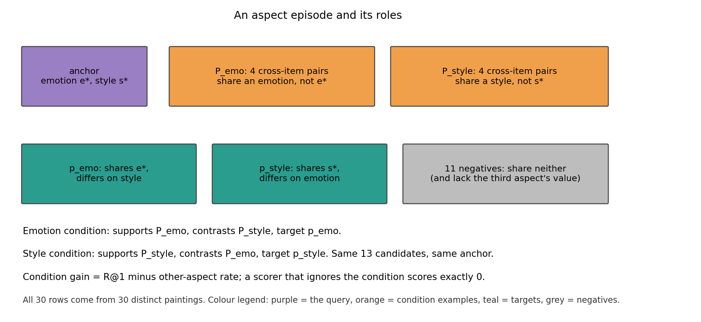
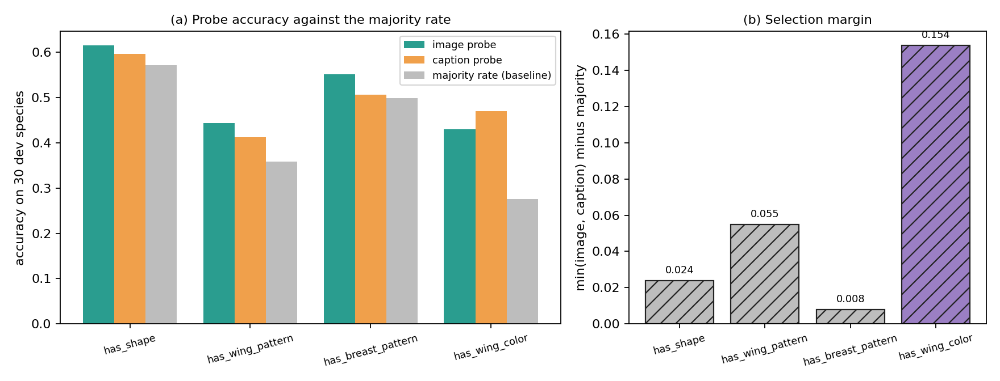

# E0: the aspect evaluation stack, spike reproduction, CUB third aspect and Qwen fidelity

Date: 2026-10-29 (plan step E0, CVPR plan spec §11). Code: `src/eval/aspect_episodes.py`, `src/eval/aspect_metrics.py`,
`src/eval/aspect_scorers.py`, `src/model/aspect_rule.py`, `src/data/{artelingo_splits,wikiart_genre,cub,feature_extract}.py`.
Experiment folder: `src/test/20261029_aspect_eval_setup/` (log inside). Figures and their build script:
`docs/reports/assets/2026-10-29_aspect_eval_setup/`.

## Summary

E0 had one job: build the evaluation stack once, so that every later experiment (E1 to E11) scores aspect episodes with
the same audited code. We built it, and four checks came out as follows.

| Check | Result | Baseline it was held against |
|---|---|---|
| New stack reproduces the aspect spike | CLIP only 11.13, SE (beta 0.3) R@1 10.95 and swap 16.25, all within 0.01 | the spike's stored values: 11.13, 10.95, 16.25 |
| ArtELingo label coverage and splits | splits identical to stage (d); labelled share in selection: emotion 0.892, style 1.000, genre 0.815 | stage (d)'s cached `scorer_train` (183,694 rows) and `selection` (32,413 rows) |
| CUB third aspect | `has_wing_color`, min(image, caption) accuracy minus majority rate = +0.154 | majority rate 0.276; the other three groups reach +0.008 to +0.055 |
| Qwen3-VL-Embedding-2B port against the official pipeline | PASS on both stages after a preprocessing fix; image-to-caption top-1 agreement 48/50 on both, cosine minimum 0.9996 | the official `Qwen3VLEmbedder` in transformers 4.57.6 |

Reviews found five issues on the way: three code defects (a NaN-to-finite rewrite inside the plan's own z-score code,
the validator's missing third-aspect check, and a Qwen image-resize mismatch) and two test or design gaps (metric
tests that could not fail, and a shared lambda grid extension). All five are fixed and pinned by tests. §5 lists what the stack
now guarantees and §6 lists the caveats we carry forward.

## 1. What we set out to build

Terms, at first use.

- An **aspect episode** is one anchor (an image or a caption, the query), 13 candidates in the other modality, and two
  sets of 4 *cross-item* example pairs, P_A and P_B (an image from one item and a caption from another). The anchor has a
  value on each of two aspects (for ArtELingo: an emotion and an art style).
- **Value-disjoint** means that no example row carries the anchor's value on either aspect. The examples name the
  aspect without showing the answer. This matters: the earlier support-baseline spike showed that when the supports
  carry the anchor's own value, the supports alone solve the episode.
- Of the 13 candidates, p_A shares the anchor's value of aspect A, p_B shares its value of aspect B, and 11 negatives
  share neither. All 30 rows of an episode come from 30 distinct paintings (or photos).
- Under condition A the supports are P_A, the contrasts are P_B and the target is p_A. Condition B swaps the roles and
  the target becomes p_B. Both directions (image to caption, caption to image) are scored.
- The **third-aspect control**: where a dataset labels a third aspect (ArtELingo genre), p_A, p_B and the negatives all
  differ from the anchor on it, so it cannot stand in for the conditioned one. Rows without a genre label are never
  used in any role.
- **R@1** is the mean over both directions and both conditions of "the target ranks first". A tie counts as a miss.
- The **other-aspect rate** is how often the other aspect's candidate ranks first. **Condition gain** is R@1 minus the
  other-aspect rate, equal to the target-first rate under the right condition minus under the swapped one. A scorer
  that ignores the condition ranks identically under both, so its gain is exactly 0, however high its R@1.
- **Swap** (success) is the share of anchors where p_A beats p_B under condition A and p_B beats p_A under condition B.
  It is always read next to R@1, because an antisymmetric scorer reaches about 50% swap at chance R@1.
- The **painting-clustered bootstrap** resamples whole paintings (whole species for CUB) with replacement, 5,000
  resamples, seed 42, and reports the ratio of sums so that unequal cluster sizes are weighted by their rows.



*Figure 1. One aspect episode and its roles. Purple is the query, orange the condition examples, teal the two targets,
grey the 11 negatives. The two conditions share the anchor and the 13 candidates and differ only in which example set
supports and which contrasts.*

The stack has five parts: the builder and validator for episodes (`aspect_episodes.py`), the metrics and bootstrap
(`aspect_metrics.py`), the training-free agreement rule with z-fusion (`aspect_rule.py`), the scorers with
cross-fitting of the fusion weight lambda (`aspect_scorers.py`), and the data layer (ArtELingo split recompute,
WikiArt genre join, CUB loader, CLIP and Qwen extraction). The agreement rule is
w = ReLU(mean over supports of a_I(x) times a_T(y) minus the same over contrasts), L1-normalised, and the fused score
is z(cos) + lambda z(factor term) with z a per-episode standardisation. The lambda grid is 0, 0.25, 0.5, 1, 2, 4, 8,
16 and infinity. It is cross-fitted on anchor parity: lambda is picked on one half by the mean of R@1 and condition
gain, and applied to the other half. A pick of 16 extends that half's grid once to 32 and 64.

## 2. Spike reproduction

Baseline: the stored numbers of the aspect spike ([aspect episode spike](2026-10-23_aspect_episode_spike.md)), on its
own 4,096 stored episodes. The exact stored values are in
`src/test/20261023_aspect_episode_spike/results/aspect_results.json` (swap 16.24755859375) and `run_aspect.log` line 24
(SE_agree_b0.3: 10.95 pooled, swap 16.25); the spike report itself only says 16 to 18%. We rebuilt the scoring path from scratch in the new modules and re-ran it on those episodes.
`reproduce_spike.py` printed, on the final code (re-run for this report, GPU free, exit 0):

```
{
 "clip_r1": 11.126708984375,
 "se_b03_r1": 10.94970703125,
 "se_b03_swap": 16.24755859375
}
REPRODUCED
```

| Quantity | New stack | Spike (stored) | Difference |
|---|---:|---:|---:|
| CLIP only R@1 | 11.13 | 11.13 | under 0.01 |
| SE at beta 0.3, R@1 | 10.95 | 10.95 | under 0.01 |
| SE at beta 0.3, swap | 16.25 | 16.25 | under 0.01 |

The check ties out three different code paths: the cosine scorer, the fixed-beta agreement scorer and the swap metric.
The script asserts a tolerance of 0.01 on each. The same three numbers came out before and after the review fixes of §4. The script uses the fixed-beta scorers and
does not exercise lambda cross-fitting, so this shows that the NaN fixes left finite fixed-beta scores unchanged; the
cross-fitting path is covered by its own synthetic tests. The four test files of the stack (episodes,
metrics, rule, scorers) pass together, 37 tests, including the mechanism tests that pin the point of the design: a
scorer that ignores the condition has gain 0, an aspect finder that ignores the condition has gain 0 (and half the R@1 of the
perfect conditional scorer), and an aspect-block code makes the agreement rule work where value-specific codes tie.

## 3. Real-data label coverage and splits

Baseline: stage (d)'s cached splits. We recomputed the ArtELingo splits in `artelingo_splits()` and compared them to
the stage (d) cache.

| Split | Computed rows | Stage (d) cache rows | Equal as sorted arrays |
|---|---:|---:|---|
| scorer_train | 183,694 | 183,694 | yes |
| selection | 32,413 | 32,413 | yes |

Labelled share of the selection rows (6,451 paintings), after excluding the emotion catch-all "something else":

| Aspect | Labelled share | Values present | Eligible (at least 30 paintings, `eligible_values`) |
|---|---:|---:|---:|
| emotion | 0.892 | 8 | 8 |
| style | 1.000 | 27 | 23 |
| genre (WikiArt, ArtGAN class file) | 0.815 | 10 | 10 |

Four styles have fewer than 30 selection paintings, so the spec's 23 styles are the eligible ones.

Genre is missing for 18.5% of selection rows, so the third-aspect control restricts every role to labelled rows. The
builder enforces this and the validator asserts it on every row of every episode (§4).

## 4. What the reviews found

The reviews of Tasks 2 to 6 each found something that a happy-path test did not. Items 1, 2 and 5 are code defects. Items 3 and 4 are test and design gaps. Item 1 is the kind that would have changed
a paper number silently (an out-of-scope row counted as a hit or a tie), and item 5 would have changed Qwen features.

1. **NaN became finite inside the plan's own code.** The plan's `zscore_rows` computed `where(std > 0, z, 0)`. A row
   with a NaN has a NaN std, `NaN > 0` is false, and the row became all zeros, a finite value. `agreement_weights` did
   the same: NaN codes produced a zero weight row. Rows outside the evaluation scope are NaN by design (row-scope rule),
   so an out-of-scope row could reach a score as a finite tie or as a cosine-only score and be counted instead of
   skipped. The fix keeps every non-finite row non-finite through z-fusion and through the agreement weights, so the
   metrics count it as a miss. For lambda 0 and infinity the fused score depends only on the input it uses, which is
   intended. Tests: NaN through `zscore_rows` and `zfuse` at every lambda, NaN codes in the weights, and NaN in the
   cosines, the term or the support codes giving non-finite scores and first place 0 through the scorers.
2. **Validator gaps.** The validator never checked that the third aspect was labelled on every role. A mutation test
   deleted the builder's labelling guard and all tests still passed, with 1,300 unlabelled rows entering episodes. The
   validator now asserts it, and five tamper tests corrupt a valid episode (an unlabelled third aspect, the anchor's
   emotion inside an example set, a repeated painting, a pair that matches on the aspect it should differ on) and
   check that validation fails with the right message. Without these, the validator could only ever say yes.
3. **Metric test gaps.** The infinity guard in `first_place` and the finite guard in swap were not exercised, and the
   bootstrap definition was untested with unequal cluster sizes. New tests pin +inf and -inf as misses, a positive swap
   case, a tie case and a non-finite swap case, and the ratio of sums (small clusters valued 1 and large ones valued 0
   give 0.0099, the mean of means would give 0.5). Each guard was removed once to confirm that its test fails.
4. **Cross-fitting.** The grid extension was global rather than per half. Each half now extends only when its own pick is 16, the fused scores are cached, and parity
   must be a 0/1 array of the right length with both halves non-empty (a `ValueError` otherwise).
5. **Qwen resize mismatch** (§7).

## 5. What the stack now guarantees

- Every episode is built value-disjoint, from distinct paintings, with the third aspect's labels present and its
  values different from the anchor's on every target and negative, and the validator checks each rule on the final
  arrays (including rejection, per the tamper tests). A pool that cannot fill an episode raises an error instead of
  looping or relaxing a rule.
- Episodes are deterministic per seed and carry a SHA-256 of their arrays and aspect names, which the held ledger
  records for any final read.
- Ties and non-finite rows are misses in R@1, condition gain and swap, never hits and never crashes.
- A condition-blind scorer has condition gain exactly 0, so R@1 cannot be gamed through "shares some aspect".
- The bootstrap resamples clusters, so intervals are as wide as the dependence between episodes of one painting or
  species demands.
- The stack reproduces the spike's numbers to 0.01.

## 6. CUB third aspect

Rule (spec §11 E0): among `has_shape`, `has_wing_pattern`, `has_breast_pattern` and `has_wing_color`, choose the group
with the highest min(image probe, caption probe) accuracy minus the majority rate. Baseline: the majority rate of the
dev images. The probes are logistic regressions (C = 1) on frozen CLIP ViT-B/32 features, trained on 7,071 images of
120 training species and scored on 1,750 images of the 30 development species. The 2,967 images of the 50 zero-shot
test species were never read. The features are the CLIP ViT-B/32 backbone-check features. They were extracted before
the Qwen preprocessing fix, which concerns only the Qwen encoder, so they are unaffected.

| Group | Image probe | Caption probe | Majority | min minus majority | n_probe | n_dev |
|---|---:|---:|---:|---:|---:|---:|
| has_shape | 0.616 | 0.596 | 0.572 | +0.024 | 6,254 | 1,541 |
| has_wing_pattern | 0.444 | 0.413 | 0.359 | +0.055 | 5,848 | 1,456 |
| has_breast_pattern | 0.551 | 0.507 | 0.499 | +0.008 | 6,107 | 1,520 |
| **has_wing_color** | 0.430 | 0.470 | 0.276 | **+0.154** | 2,432 | 532 |



*Figure 2. (a) Probe accuracy against the majority rate for the four candidate groups. (b) The selection margin. The hatched purple bar marks the pick.*

We picked `has_wing_color`, so the CUB aspects are primary colour, bill shape and wing colour. Why it won: three of the
groups are dominated by their majority class (has_breast_pattern's probes sit 0.008 above 0.499), so a probe adds
almost nothing, whereas wing colour has a spread-out value distribution (majority 0.276) that both modalities
predict well above chance, with captions slightly ahead (0.470 against 0.430), which is the symmetry we want for
CUB.

**Caveats, which bind the claim.**
- `has_wing_color` is labelled on only 2,432 probe and 532 dev images. A label counts only where the unique attribute
  value has certainty of at least 3. That leaves 532 of 1,750 dev images (30%) and 2,432 of 7,071 probe images (34%),
  against 83 to 88% for the other three groups. The group has 15 values.
- A low majority rate inflates the margin. Part of the lead is the lower baseline, not only better probes: in
  accuracy terms the image probe at 0.430 is below the image probes of has_shape (0.616) and has_breast_pattern
  (0.551).
- The pick rests on one development draw (30 species, seed 42). With 532 images over 30 species the gap to the second
  group (+0.154 against +0.055) is large, but we did not bootstrap it, so the choice is a development decision and not a
  claim.
- The episode builder will have to find enough eligible values with at least 30 distinct images among the 532 labelled
  development images. E1 and E6 will show whether this holds.

## 7. Qwen3-VL-Embedding-2B fidelity

Baseline: the official `Qwen3VLEmbedder` from the model snapshot (transformers 4.57.6 in a separate pyenv, same
instruction text, bf16, same max_pixels), run on the same inputs. Our port runs in the CoSiR env (transformers 5.6.2).
Pass rule: every per-item cosine at or above the check's cosine criterion and at least 48 of 50 image-to-caption top-1 choices equal to the
official ones. The gated direction is image-to-caption (i2t); text-to-image (t2i) is printed beside it and not gated.
Two stages: 50 CUB train-species images with their first caption (44,928 to 250,000 px, no downscaling), and 50
ArtELingo selection images with a caption of the same painting (561,920 to 21,643,860 px, so every image is
downscaled; 12 are above 1,843,200 px).

**CLIP** (reference for the cached features): our CLIP wrapper against the cached ArtELingo features on 64 selection
rows, after L2 normalisation: image cosine min 0.99998, text cosine min 1.00000. PASS. The cached features are not unit
norm (norm about 9.9), and a first version that compared without normalising printed cosines of 8 to 12 and passed
trivially. We fixed it before the final run. Anything that uses the cache as cosine inputs has to normalise first;
`EvalInputs` does.

**Qwen, round 1** (the port let the Hugging Face processor resize the image): CUB stage PASS (min cosine 0.9990, i2t
48/50). Large-image stage FAIL: image cosine min 0.9970, i2t 47/50 against the 48 required (t2i 45/50).

**Cause.** The official embedder calls `qwen_vl_utils.fetch_image` (patch factor 32, `smart_resize` with min_pixels
4,096 and the given max_pixels, RGBA onto white, PIL default resampling) and then runs the processor with
`do_resize=False`. Our port had used the processor's own resize, a slightly different grid and resampling. It was
small on images under max_pixels (CUB stage: image cosine min 0.9990, which became 1.0000 after the fix, and t2i
47/50, which became 50/50) and larger once images were downscaled.

**Fix.** `_qwen_smart_resize` and `_qwen_prepare_image` were copied from `qwen_vl_utils/vision_process.py` (cited in a
comment, nothing imported from the target folder) and `encode_images` pre-resizes and calls the processor with
`do_resize=False`. No threshold or input was changed.

| Stage | Round 1 image cosine min | Round 1 i2t | Final image cosine (min/median/max) | Final all-cosine min | Final i2t (gated) | Final t2i (not gated) | Matched-pair top-1, ours / official |
|---|---:|---:|---|---:|---:|---:|---|
| CUB | 0.9990 | 48/50 | 1.0000/1.0000/1.0000 | 0.9996 | 48/50 | 50/50 | 11/50 vs 10/50 |
| Large (ArtELingo) | 0.9970 | 47/50 | 1.0000/1.0000/1.0000 | 0.9996 | 48/50 | 49/50 | 21/50 vs 19/50 |

Both stages PASS, with a cosine minimum of 0.9996, so Qwen did not fail and the PE-Core fallback is not triggered.
The remaining gap is on the text side (caption cosine 0.9996 to 0.9998: bf16 normalisation and batching noise). The
image cosines are 1.0000.

**Caveats.**
- The gate passed at exactly 48/50 in the gated direction on both stages. The two misses per stage are near-ties:
  matched-pair top-1 is only 11/50 and 21/50 for both sides, since 50 random items with one caption each are
  ambiguous. The official side's own matched-pair accuracy differs from ours by one or two items in the same range.
- Final Qwen features use `max_pixels` 524,288 (512 tokens), below the official default 1,843,200 (1800 x 32 x 32). The
  check holds both sides at 524,288, so it validates the port and not the official default. A feature set at the
  default would have to be checked again.
- The official embedder normalises in bf16 (norm off by up to about 0.4%). The check renormalises in fp32.

## 8. Held ledger

`docs/superpowers/held_ledger.md` lists every read of a final split (H1 to H3 ArtELingo held rows as value
episodes; H4 the CUB standard test split in the backbone check, which includes the 50 zero-shot test species). We
checked each row against its report, result-file timestamps and git history: the dates, seeds, per-label counts and
SHA prefixes agree, and no row changed. One note: H3 is dated by the local (CEST) date, 2026-10-01, which is
2026-09-30 in UTC. The CVPR budget is 0 of 2 for ArtELingo (aspect episodes are new), 0 of 2 for CUB (H4 disclosed), and
0 of 2 each for SemArt and GeneCIS. E0 read no held or test rows: the CUB work touched only the 150 training species,
and the ArtELingo checks used selection rows.

## 9. Chain and what follows

The line began with the aspect spike, where no factor model beat CLIP only on value-disjoint episodes (CLIP only 11.13,
SE agree 11.32, difference +0.20 [-0.12, +0.50]). Rather than build more models on a stack nobody had audited, E0 moved
the spike's one-off code into a tested module and reproduced its numbers to 0.01. The reviews then found the NaN
rewrite, the validator gaps and the Qwen resize mismatch, and each fix came with a test that fails when the fix is
removed. What E0 gives E1 to E11: the episode builder and validator, the metrics and clustered bootstrap, the
scorers, CLIP and Qwen feature extraction, `has_wing_color` as CUB's third group, and a ledger. What it does not give:
any evidence about method A. Every number here is about the instrument.
