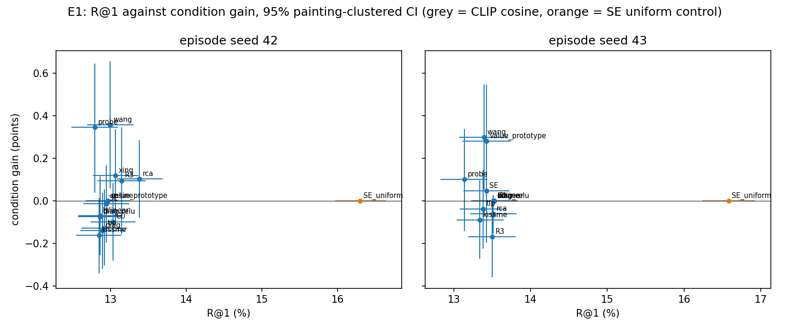
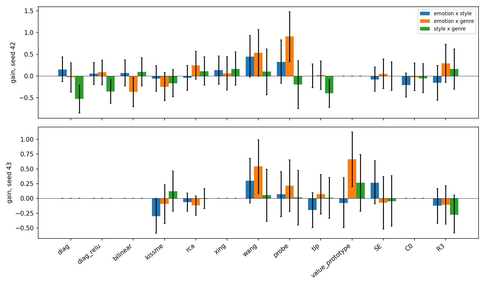

# E1: Tier-1 baselines on ArtELingo aspect episodes, and the GO bar they set

Date: 2026-10-30 (plan step E1, CVPR plan spec §8 and §11). Runner: `src/test/20261030_aspect_baselines/run_baselines.py`
(folder log inside). Figures and their build script: `docs/reports/assets/2026-10-30_aspect_baselines/`.
Baseline for every number in this report: backbone-only CLIP ViT-B/32 cosine on the same episodes ("cosine").

## Summary

We asked how far methods that estimate similarity directly from the 4 + 4 example pairs get on aspect episodes, with no
learned factor model. The answer is: almost nowhere. On seed-42 episodes the best of nine raw metric-from-pairs
baselines, RCA, reached R@1 13.38 and condition gain 0.10, against 12.96 and 0.00 for CLIP cosine. Its mean of the two
metrics, 6.74, is the **GO bar** for Task 13 (chosen mechanically, see Section 4). The bar sits very close to the
backbone: on seed 43 RCA scores 6.73, below the cosine's 6.76, and four baselines tie the cosine exactly.

Three findings matter for the later experiments.

1. No baseline separates the aspects. Only Wang et al.'s similarity and the logistic probe have a gain CI that excludes 0
   on seed 42, and the gains are 0.36 and 0.35 points.
2. The agreement rule on the existing factor codes (SE, C0, R3) does no better than the raw baselines: gain point
   estimates between -0.17 and 0.10 on both seeds, every CI containing 0 (the widest case, R3 on seed 43, is [-0.36, 0.01];
   R3 is transductive on these rows, Section 5).
3. The uniform-weight SE control (condition removed) raises R@1 to 16.30 (seed 42) and 16.58 (seed 43), against
   12.96 and 13.53 for cosine. The factor term alone lifts R@1 by about 3 points with condition gain 0 by construction.
   An R@1 lift is therefore not evidence of using the condition (Section 6).

## 1. Setting

**Episodes.** An aspect episode shows an anchor painting and 13 candidates (p_a shares the anchor's value of aspect a,
p_b shares aspect b, 11 negatives), plus 4 support pairs and 4 contrast pairs per condition (spec §5.1). The condition
names an aspect only through example pairs whose values differ from the anchor's. We built 4,096 episodes per aspect pair
(emotion x style with genre as third aspect, emotion x genre with style, style x genre with emotion), 12,288 per seed,
from the 32,413 selection rows, and validated each with `validate_aspect_episodes`. Episode seeds are 42 and 43. The SHA-256
of each pair's episodes:

- seed 42, emotion__style: `6932f553e2d15237b4f008d0da2ecb76ad9c96db629a3557afe037290b6dd066`
- seed 42, emotion__genre: `9196a1a80e95af1cd3ebefdd0b07c2ceb5f694579c6221b40157027af041fbe7`
- seed 42, style__genre: `78fbccdce319d07a7f315d6b0b7314d492a8657223fbddbc5dc1c771c4485429`
- seed 43, emotion__style: `2a738ea7601190b207a832e9c1ad6b9e66c0ba8b2dcea27f9356e6f9167675d3`
- seed 43, emotion__genre: `f752a4ba2df4d25fff6f89d35f7d8f344d90fb0e1450b86235b2f2c8bbd3e0ef`
- seed 43, style__genre: `b5a5a4ba29dcdf82b7bdde135fe8b319acbc5d11de93dc994a4f21d743089593`

**Metrics.** R@1 is the share of anchors whose target candidate ranks strictly first (ties are misses), averaged over
conditions and over image to text and text to image. Condition gain is R@1 minus the other-aspect rate, the rate at which
the other aspect's candidate wins under the same condition. Swap is the share of anchors for which p_a scores above
p_b under condition a and p_b scores above p_a under condition b, averaged over the two directions; it compares the two
aspect candidates only, whatever the other 11 candidates score. All CIs are 95% bootstrap intervals over 5,000 resamples that resample whole
anchor paintings (seed 42). Gain and swap are in points.

**Cross-fitted fusion.** Every term except the cosine is fused with the cosine by z-fusion and weight λ from
{0, 0.25, 0.5, 1, 2, 4, 8, 16, inf} (extended to 32 and 64 only if a half picks 16). λ is picked by mean(R@1, gain) on
one parity half of the pooled episodes and applied to the other half, so no number is tuned on the anchors it is scored on.
The cosine row is backbone only, and its gain is 0 exactly because it ignores the condition (asserted in the runner).

**Row scope.** Features and codes are NaN outside the selection rows, and every episode row was asserted to be a
selection row. The PCA basis and the pair scaler were fitted without labels on 60,000 scorer-train rows (none a selection
row; row-index SHA-256 `0a0d3b777d88e9f043ab6d4144bac58066e634efeeddd689ad6684e3a1729d31`).

**Scorers.** diag and diag_relu: agreement rule on raw dimensions (signed, rectified). bilinear, kissme, rca, xing, wang:
metric-from-pairs methods (a bilinear form, KISSME, relevant component analysis, Xing et al., Wang et al.'s pair metric)
on a 32-component whitened PCA basis, where the method uses one (wang works on raw features). probe: a logistic probe on
the product z = x * y of an image and its caption, fitted per episode on support (label 1) against contrast (label 0).
tip: a Tip-Adapter style cache lookup over the pair products. value_prototype: scores a candidate by cosine to the support
mean minus the contrast mean (not metric-from-pairs, so excluded from the GO bar). SE, C0, R3: the agreement rule on the
codes of the affect-supervised factor model (SE), the unconditioned control (C0) and the stage (d) model (R3). R3 is
transductive here: its encoders were trained on all train rows, which include the selection rows of these episodes
(features only, never labels), while SE and C0 trained on scorer-train rows only (Section 5). SE_uniform: SE codes with
uniform factor weights, the condition removed.

## 2. Results

Figure 1 plots R@1 against condition gain for both seeds.

Seed 42 (baseline row: cosine).

| scorer | R@1 [95% CI] | condition gain [95% CI] | other-aspect | swap | λ picks (half 0 / half 1) |
|---|---|---|---|---|---|
| cosine | 12.96 [12.67, 13.26] | 0.00 [0.00, 0.00] | 12.96 | 0.00 | none |
| diag | 12.89 [12.60, 13.19] | -0.14 [-0.32, 0.04] | 13.03 | 3.41 | 0.0 / 0.25 |
| diag_relu | 12.86 [12.57, 13.15] | -0.07 [-0.23, 0.08] | 12.93 | 2.37 | 0.0 / 0.25 |
| bilinear | 12.86 [12.57, 13.16] | -0.07 [-0.26, 0.11] | 12.93 | 3.26 | 0.0 / 0.25 |
| kissme | 12.85 [12.55, 13.14] | -0.16 [-0.34, 0.01] | 13.01 | 3.15 | 0.0 / 0.25 |
| rca | 13.38 [13.08, 13.69] | 0.10 [-0.08, 0.29] | 13.28 | 3.17 | 0.5 / 0.5 |
| xing | 13.06 [12.76, 13.36] | 0.12 [-0.10, 0.34] | 12.94 | 4.52 | 0.25 / 0.25 |
| wang | 12.99 [12.69, 13.30] | 0.36 [0.06, 0.66] | 12.64 | 8.59 | 1.0 / 1.0 |
| probe | 12.79 [12.48, 13.09] | 0.35 [0.04, 0.65] | 12.45 | 9.77 | 0.25 / 0.5 |
| tip | 12.92 [12.62, 13.22] | -0.13 [-0.30, 0.06] | 13.05 | 3.47 | 0.0 / 0.25 |
| value_prototype | 12.96 [12.67, 13.26] | 0.00 [0.00, 0.00] | 12.96 | 0.00 | 0.0 / 0.0 |
| SE | 12.94 [12.64, 13.25] | -0.01 [-0.19, 0.17] | 12.95 | 2.19 | 0.25 / 0.0 |
| C0 | 13.03 [12.73, 13.33] | -0.10 [-0.28, 0.08] | 13.13 | 2.34 | 0.0 / 0.25 |
| R3 (transductive) | 13.15 [12.83, 13.46] | 0.10 [-0.16, 0.35] | 13.05 | 4.50 | 0.25 / 0.25 |
| SE_uniform | 16.30 [15.96, 16.63] | 0.00 [0.00, 0.00] | 16.30 | 0.00 | 16.0 / 16.0 |

Seed 43.

| scorer | R@1 [95% CI] | condition gain [95% CI] | other-aspect | swap | λ picks (half 0 / half 1) |
|---|---|---|---|---|---|
| cosine | 13.53 [13.23, 13.83] | 0.00 [0.00, 0.00] | 13.53 | 0.00 | none |
| diag | 13.53 [13.23, 13.83] | 0.00 [0.00, 0.00] | 13.53 | 0.00 | 0.0 / 0.0 |
| diag_relu | 13.53 [13.23, 13.83] | 0.00 [0.00, 0.00] | 13.53 | 0.00 | 0.0 / 0.0 |
| bilinear | 13.53 [13.23, 13.83] | 0.00 [0.00, 0.00] | 13.53 | 0.00 | 0.0 / 0.0 |
| kissme | 13.34 [13.04, 13.65] | -0.09 [-0.27, 0.10] | 13.43 | 3.08 | 0.0 / 0.25 |
| rca | 13.52 [13.22, 13.82] | -0.06 [-0.15, 0.03] | 13.58 | 0.89 | 0.0 / 0.25 |
| xing | 13.53 [13.23, 13.83] | 0.00 [0.00, 0.00] | 13.53 | 0.00 | 0.0 / 0.0 |
| wang | 13.39 [13.07, 13.70] | 0.30 [0.06, 0.55] | 13.09 | 5.60 | 0.5 / 0.5 |
| probe | 13.14 [12.83, 13.44] | 0.10 [-0.14, 0.34] | 13.04 | 6.60 | 0.5 / 0.0 |
| tip | 13.38 [13.08, 13.68] | -0.04 [-0.22, 0.15] | 13.42 | 3.23 | 0.25 / 0.0 |
| value_prototype | 13.43 [13.12, 13.74] | 0.28 [0.01, 0.55] | 13.14 | 6.67 | 0.25 / 0.25 |
| SE | 13.43 [13.12, 13.73] | 0.05 [-0.20, 0.28] | 13.38 | 4.15 | 0.0 / 0.5 |
| C0 | 13.53 [13.23, 13.83] | 0.00 [0.00, 0.00] | 13.53 | 0.00 | 0.0 / 0.0 |
| R3 (transductive) | 13.50 [13.19, 13.81] | -0.17 [-0.36, 0.01] | 13.67 | 2.34 | 0.0 / 0.25 |
| SE_uniform | 16.58 [16.24, 16.92] | 0.00 [0.00, 0.00] | 16.58 | 0.00 | 4.0 / 4.0 |

Mean of R@1 and gain for the nine GO candidates (the cosine's own value is 6.48 on seed 42 and 6.76 on seed 43):

| scorer | mean(R@1, gain) seed 42 | seed 43 |
|---|---|---|
| rca | 6.74 | 6.73 |
| wang | 6.68 | 6.85 |
| xing | 6.59 | 6.76 |
| probe | 6.57 | 6.62 |
| tip | 6.39 | 6.67 |
| bilinear | 6.39 | 6.76 |
| diag_relu | 6.39 | 6.76 |
| diag | 6.38 | 6.76 |
| kissme | 6.34 | 6.63 |

Per pair, seed 42 (cell: R@1 / gain [CI of gain]).

| scorer | emotion x style | emotion x genre | style x genre |
|---|---|---|---|
| cosine | 10.06 / 0.00 [0.00, 0.00] | 14.59 / 0.00 [0.00, 0.00] | 14.23 / 0.00 [0.00, 0.00] |
| diag | 10.06 / 0.15 [-0.13, 0.44] | 14.64 / -0.03 [-0.37, 0.30] | 13.98 / -0.53 [-0.86, -0.21] |
| diag_relu | 10.05 / 0.05 [-0.20, 0.31] | 14.59 / 0.09 [-0.20, 0.37] | 13.94 / -0.36 [-0.63, -0.09] |
| bilinear | 10.03 / 0.07 [-0.23, 0.37] | 14.31 / -0.37 [-0.71, -0.04] | 14.23 / 0.09 [-0.23, 0.42] |
| kissme | 9.91 / -0.06 [-0.35, 0.24] | 14.49 / -0.25 [-0.57, 0.08] | 14.14 / -0.17 [-0.48, 0.15] |
| rca | 10.17 / -0.04 [-0.33, 0.25] | 15.23 / 0.24 [-0.07, 0.57] | 14.73 / 0.11 [-0.21, 0.44] |
| xing | 10.14 / 0.13 [-0.19, 0.46] | 14.65 / 0.06 [-0.33, 0.44] | 14.40 / 0.16 [-0.21, 0.55] |
| wang | 10.24 / 0.45 [-0.02, 0.93] | 14.48 / 0.53 [-0.01, 1.07] | 14.26 / 0.10 [-0.43, 0.62] |
| probe | 10.14 / 0.32 [-0.17, 0.83] | 14.52 / 0.91 [0.33, 1.48] | 13.71 / -0.20 [-0.75, 0.35] |
| tip | 10.06 / 0.00 [-0.27, 0.28] | 14.63 / 0.02 [-0.31, 0.35] | 14.06 / -0.40 [-0.73, -0.09] |
| value_prototype | 10.06 / 0.00 [0.00, 0.00] | 14.59 / 0.00 [0.00, 0.00] | 14.23 / 0.00 [0.00, 0.00] |
| SE | 10.06 / -0.08 [-0.35, 0.21] | 14.50 / 0.05 [-0.29, 0.39] | 14.26 / -0.01 [-0.33, 0.33] |
| C0 | 9.94 / -0.21 [-0.49, 0.07] | 14.69 / -0.02 [-0.34, 0.30] | 14.47 / -0.05 [-0.38, 0.29] |
| R3 (transductive) | 10.05 / -0.16 [-0.56, 0.24] | 14.67 / 0.29 [-0.15, 0.73] | 14.72 / 0.16 [-0.31, 0.62] |
| SE_uniform | 12.04 / 0.00 [0.00, 0.00] | 18.63 / 0.00 [0.00, 0.00] | 18.23 / 0.00 [0.00, 0.00] |

Per pair, seed 43.

| scorer | emotion x style | emotion x genre | style x genre |
|---|---|---|---|
| cosine | 10.45 / 0.00 [0.00, 0.00] | 15.13 / 0.00 [0.00, 0.00] | 15.00 / 0.00 [0.00, 0.00] |
| diag | 10.45 / 0.00 [0.00, 0.00] | 15.13 / 0.00 [0.00, 0.00] | 15.00 / 0.00 [0.00, 0.00] |
| diag_relu | 10.45 / 0.00 [0.00, 0.00] | 15.13 / 0.00 [0.00, 0.00] | 15.00 / 0.00 [0.00, 0.00] |
| bilinear | 10.45 / 0.00 [0.00, 0.00] | 15.13 / 0.00 [0.00, 0.00] | 15.00 / 0.00 [0.00, 0.00] |
| kissme | 10.25 / -0.30 [-0.59, 0.00] | 14.78 / -0.09 [-0.43, 0.23] | 14.99 / 0.12 [-0.22, 0.46] |
| rca | 10.39 / -0.06 [-0.21, 0.09] | 15.09 / -0.12 [-0.28, 0.04] | 15.06 / -0.01 [-0.17, 0.17] |
| xing | 10.45 / 0.00 [0.00, 0.00] | 15.13 / 0.00 [0.00, 0.00] | 15.00 / 0.00 [0.00, 0.00] |
| wang | 10.52 / 0.30 [-0.08, 0.68] | 15.03 / 0.54 [0.08, 0.99] | 14.63 / 0.05 [-0.39, 0.49] |
| probe | 10.28 / 0.07 [-0.31, 0.45] | 14.62 / 0.21 [-0.22, 0.65] | 14.52 / 0.02 [-0.45, 0.47] |
| tip | 10.35 / -0.20 [-0.50, 0.10] | 15.03 / 0.07 [-0.26, 0.40] | 14.77 / 0.01 [-0.33, 0.35] |
| value_prototype | 10.31 / -0.08 [-0.50, 0.35] | 15.05 / 0.66 [0.19, 1.12] | 14.92 / 0.26 [-0.22, 0.74] |
| SE | 10.66 / 0.26 [-0.09, 0.64] | 14.84 / -0.07 [-0.52, 0.37] | 14.78 / -0.05 [-0.47, 0.38] |
| C0 | 10.45 / 0.00 [0.00, 0.00] | 15.13 / 0.00 [0.00, 0.00] | 15.00 / 0.00 [0.00, 0.00] |
| R3 (transductive) | 10.53 / -0.12 [-0.42, 0.17] | 15.03 / -0.11 [-0.43, 0.22] | 14.95 / -0.27 [-0.58, 0.05] |
| SE_uniform | 12.02 / 0.00 [0.00, 0.00] | 18.68 / 0.00 [0.00, 0.00] | 19.04 / 0.00 [0.00, 0.00] |

## 3. Analysis

**Why the raw baselines stay at the backbone (a reading we did not test on CLIP).** The agreement-style baselines work
only if each aspect occupies its own directions in the feature space: then the shared directions of the support pairs
identify the aspect, and the contrast pairs cancel the rest. Our explanation is that raw CLIP mixes emotion, style and
genre across all dimensions, and that because the examples are value-disjoint from the anchor, an estimate fitted on four
pairs mostly captures the examples' own values, not the aspect (plan Mechanism note; spec §6). What was tested is the
converse on synthetic data: the block world in the Task 8 tests shows the same rules work when the aspects sit in
separate blocks, and the plan's simulation gave 0.00 when they are mixed. We did not measure how CLIP's dimensions mix
the three aspects, so "the null is about the features and not about the rules" remains a hypothesis for CLIP. The
evidence is consistent with it: every gain is within 0.4 points of 0, the largest per-pair gain is 0.91 (probe on
emotion x genre, seed 42), and most cells straddle 0.

**Bilinear.** Under value-disjoint supports a bilinear form fitted on the supports has no information about the anchor's
value, so it is weak by construction (Task 8 ruling, with a positive control in its tests). Its row is a floor, not a
competitor.

**Comparison with the earlier spike.** The aspect spike (emotion x style, 4,096 episodes, no third-aspect constraint)
measured CLIP R@1 11.13 and SE at a fixed β of 0.3 at 10.95 with swap 16.25, and E0 reproduced these to 0.01. The E1
emotion x style episodes are harder and give cosine 10.06; we attribute that to the genre constraint removing shortcuts
through a shared genre, but we did not test it (for example by scoring the same anchors without the constraint). SE here, with
cross-fitted λ, gives 10.06 and gain -0.08 [-0.35, 0.21]: again no condition effect. The two experiments agree.

## 4. The GO bar

The plan names the best raw metric-from-pairs baseline on seed 42, by mean(R@1, gain) among diag, diag_relu, bilinear,
kissme, rca, xing, wang, probe and tip. That is **rca**: mean 6.74, R@1 13.38 [13.08, 13.69], gain 0.10 [-0.08, 0.29],
lambda 0.5 on both halves. The honest reading is as follows.

- RCA's lead over wang (6.68), xing (6.59) and probe (6.57) is 0.06 to 0.17, inside bootstrap noise. We did not compute a
  paired difference; the R@1 CIs of rca [13.08, 13.69] and wang [12.69, 13.30] overlap, so the lead is not established.
- The lead comes from R@1, not from the condition: RCA's gain CI contains 0. Wang (0.36 [0.06, 0.66]) and probe
  (0.35 [0.04, 0.65]) are the only candidates whose gain CI excludes 0 on seed 42; on seed 43 only wang does
  (0.30 [0.06, 0.55]).
- On seed 43 RCA scores 6.73, below the cosine's 6.76, and wang is highest at 6.85. The ranking is not stable across
  episode seeds.

The bar is therefore close to the backbone, and Task 13's GO test must not treat clearing it as a strong result by itself.
The two-part test (R@1 and gain, each with a CI) carries the weight.

## 5. Disclosures

- **Probe.** The plan's literal probe duplicated the diag rule, so the controller ruled a standardized L2 logistic probe on
  z = x * y (statistics from the same 60,000 training rows, 300 Adam steps, L2 1.0, per episode).
- **PCA and scaler subsampling.** `fit_pca_basis` subsamples 50,000 of the 120,000 stacked image and text rows internally,
  and `fit_pair_scaler` subsamples 50,000 of the 60,000 rows, both with seed 42. Fit rows were unit-normalized first.
- **Exact ties on seed 43.** diag, diag_relu, bilinear and xing picked λ = 0 on both halves, so they equal the cosine
  exactly (R@1 13.53, gain 0.00). C0 did the same. On seed 42, value_prototype picked
  λ = 0 on both halves and equals the cosine (gain 0.00). Four of the nine GO candidates tie on seed 43, so their
  mean(R@1, gain) equals the cosine's 6.76 and the seed-43 ordering among them is a tie, not a ranking.
- **λ picks** are in the tables. SE_uniform picked λ = 16 on both halves on seed 42, which triggered the grid extension to
  {32, 64}; the pick stayed at 16.
- **Codes provenance.** SE: `src/test/20261018_affect_factor_learning/checkpoints/SE_seed42.pt`, SHA-256
  `93add21b2367c2c56210d68a54c85f5ead120a91986f04fb5e8dbd328f446786`. C0:
  `src/test/20261016_factor_learning_grid/checkpoints/C0_seed42.pt`, SHA-256
  `7653caf0985b564d30f7629004b511e1a7821a8b1e5d8962cbe2131fd90111d2`. R3: the stage (d) cache codes (original R3,
  `src/test/20261011_factor_repair_grid/checkpoints/selected_seed42.pt`, trained on all 216,107 train rows). Those
  rows include the 32,413 selection rows that every episode here uses, so R3's rows are transductive (its encoders saw
  the episodes' features in training, never their labels) and are context, not a fair comparator. Codes were encoded
  once on CPU and cached; the runner re-hashes the checkpoints each run (`results/codes_provenance.json`).
- **Review.** The runner passed an independent review that re-derived the seed-42 cosine R@1 (12.9618) and the full RCA
  recomputation (mean 6.7424) bit-exactly.

## 6. What the uniform-weight control implies for E3

SE_uniform ranks the two aspect-sharing candidates (p_a and p_b) first more often than the cosine does: R@1 16.30 against
12.96 (seed 42) and 16.58 against 13.53 (seed 43), with gain 0.00 and swap 0 by construction, because uniform weights make
the factor term identical under both conditions. The other-aspect rate rises by the same amount, so the gain is flat.
This lift appears in every pair (emotion x genre 18.63 against 14.59). A plausible reading is that the factor term acts as a generic
"shares some attribute with the anchor" detector, not as a conditional one; we did not test this further. SE with the agreement rule then gives back
R@1 12.94, so the rule's condition-dependent weights remove this lift without adding a gain.

For the E3 GO test this means a method that raises R@1 over the cosine has not shown it uses the condition. The picked run
must beat **its own uniform-weight control** on both R@1 and condition gain, each with a CI, in addition to clearing the
RCA bar. Reporting R@1 against cosine alone would credit the factor term for an effect it has with the condition removed.

## 7. Limits

Both seeds use the same 32,413 selection rows, so the two seeds are two draws of episodes, not independent datasets.
CIs resample paintings but not the choice of examples. We ran no baseline hyperparameter search beyond the λ grid.
