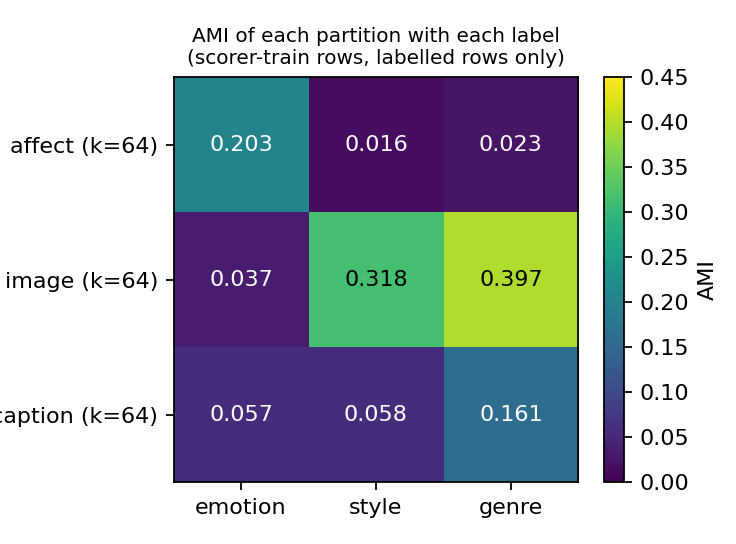

# E2: pseudo-partitions and the pseudo-aspect episode banks

## 1. What we built and why

Method A needs training episodes that teach a model to read an aspect from example pairs, but the plan forbids evaluation labels (emotion, style, genre) in training. We therefore built label-free **pseudo-partitions**: a pseudo-partition assigns every scorer-train row to one of k = 64 clusters, and the clusters play the role of the values of an aspect. Three were used.

- **affect**: k-means (64 clusters) on the 28-dimensional GoEmotions probabilities of the captions. This is distant supervision, allowed by spec §4 C2, and it is the partition cached by the affect factor-learning run.
- **image**: k-means on CLIP image features, the partition cached by the factor-learning grid.
- **caption**: new here, k-means (64 clusters, seed 42, `MiniBatchKMeans(n_init=3, batch_size=4096)`) on L2-normalized CLIP text features of the scorer-train rows.

A **pseudo-aspect episode** has the same structure as an evaluation aspect episode (spec §5.1: an anchor, 13 candidates, 4 support and 4 contrast example pairs, value-disjoint, no painting twice) with clusters in place of labelled values. A **bank** is a fixed set of 65,536 such episodes built from a set of partitions, one block per unordered partition pair, with the third partition as the third aspect when there are three. We built three banks: **AIC** (affect, image, caption), **AI** (affect, image; the plan's held-out-genre set) and **IC** (image, caption; the no-affect supervision ablation). Everything used scorer-train rows only (183,694 rows, 36,518 paintings), in local indices 0 to n-1.

## 2. Partitions

| Partition | Clusters | Smallest | Median | Largest |
|---|---|---|---|---|
| affect | 64 | 244 | 1,690 | 21,098 |
| image | 64 | 1,605 | 2,743 | 4,962 |
| caption | 64 | 635 | 2,706 | 7,431 |

The affect partition is the most uneven: one cluster holds 11.5% of rows (21,098), which fits GoEmotions probability mass concentrating on a few dominant emotions. Image clusters are the most balanced. All 64 clusters of every partition clear the 30-painting eligibility floor, so no value is dropped from any bank.

Row alignment was verified before any copy: the scorer-train order from `artelingo_splits(load_artelingo())` equals the stage (d) cache order, the groups equal, `local_groups` equals `np.unique(groups[st], return_inverse=True)`, and `clip_image_local` equals the cache's `clip_image[st]`. The affect array was checked by length and by the AMI agreement in section 3 (it reproduces the earlier record exactly once the same row set is used).

## 3. AMI diagnostic

**Adjusted mutual information (AMI)** measures how much a partition tells us about a label, corrected for chance: 0 means no more than chance, 1 means identical partitions. This is the only place evaluation labels were read; it ran after the banks were written and fed nothing saved for training. Each cell uses the labelled scorer-train rows only: emotion 163,281 rows (the catch-all "something else" removed), style 183,694, genre 148,956 (19% of rows unlabelled).

| Partition | vs emotion | vs style | vs genre |
|---|---|---|---|
| affect | **0.2035** | 0.0157 | 0.0234 |
| image | 0.0367 | **0.3176** | **0.3970** |
| caption | 0.0566 | 0.0582 | 0.1613 |

Baselines. (a) Chance: we shuffled the labels and recomputed AMI (5 shuffles each, build_figure.py): affect vs emotion mean 0.00001 (range -0.00003 to 0.00004), image vs genre mean -0.00002, caption vs genre -0.00000. Every cell above 0.015 is therefore far above the empirical null. (b) The earlier prepares recorded affect vs emotion 0.1960, affect vs style 0.0157, image vs emotion 0.0352, image vs style 0.3176, and CLIP caption clusters vs emotion 0.0557 and style 0.0582. Our style cells match those records to 12 digits (affect 0.0157, image 0.3176, caption 0.0582), which also confirms the caption k-means reproduces the earlier caption clustering and that all three arrays are aligned with the same rows. Genre was not recorded before, so for genre the baseline is the null.

**Why the emotion cells differ from the record.** Our affect vs emotion is 0.2035 against a recorded 0.1960. We recomputed the AMI with the catch-all "something else" emotion kept as its own class (all 183,694 rows) and got 0.19601969782711, equal to the record to 13 digits. The earlier prepare therefore included the catch-all class, while `artelingo_aspect_labels` excludes it (as the evaluation does). The two numbers are the same partition on different row sets, not a discrepancy. The same cause explains image vs emotion 0.0367 against 0.0352 and caption 0.0566 against 0.0557.

The diagonal is what we intended: affect carries emotion (0.2035, with almost no style or genre), and image carries style (0.3176). The caption partition is a mixed content partition, strongest on genre (0.1613), weak on the other two.

## 4. Finding: the AI bank is not blind to genre

The image partition has AMI 0.3970 with genre, higher than its 0.3176 with style, and the caption partition has 0.1613 with genre. The AI bank (affect plus image) is the set the plan calls the held-out-genre training set for claim K8, but its image clusters are about 17 times more informative about genre (0.3970) than the affect partition (0.0234). Genre information therefore enters the AI bank through the image clusters, even though no genre label was used. This is expected: genre (portrait, landscape, still life) is a visual category, and CLIP image clusters recover it.

**What K8 can and cannot show.** Under AI training, K8 can show that genre does not need to be supplied as a separately trained partition: a model trained on affect and image pseudo-aspects, with no genre partition and no genre label, still handles the genre aspect at test. K8 cannot show that the model never saw genre-correlated structure, and a passing K8 must not be written as zero-shot transfer to an unseen aspect. A skeptical reader can attribute the result to the image clusters carrying genre (AMI 0.397); we have no ablation here that removes that channel. AIC and IC contain the caption partition as well, which adds more genre information (0.1613), so they are no cleaner.

**Recommended wording for the E3 report.** State K8 as: "genre was not used as a label or as a partition in training; the image pseudo-partition is correlated with genre (AMI 0.397 on scorer-train rows), so the result shows that genre need not be trained as its own aspect, not that genre structure was unseen." Report the 0.397 beside the K8 number, and name the AI bank "no genre label" rather than "held-out genre". If a clean held-out claim is wanted, it needs a bank whose partitions have low genre AMI (the affect partition alone, 0.023, as a possible but weak control); we did not build that bank and changed no pre-registered rule.

## 5. Banks

| Bank | Blocks (pairs) | Block sizes | Episodes | Build time | s per episode |
|---|---|---|---|---|---|
| AIC | affect/caption, affect/image, caption/image | 21,846 / 21,846 / 21,844 | 65,536 | 207.0 s | 0.00316 |
| AI | affect/image | 65,536 | 65,536 | 201.9 s | 0.00308 |
| IC | caption/image | 65,536 | 65,536 | 220.7 s | 0.00337 |

AIC was built as 3 x 21,846 = 65,538 episodes and trimmed to the first 65,536 rows of the concatenation, so the last block is 2 episodes short. The concatenated AIC episodes carry aspect names "mixed"; `block_sizes` and `block_pairs` in the npz tell the blocks apart.

**Validation.** We ran `validate_aspect_episodes` on 1,000 seeded episodes per set with the bank's own partitions as labels (AIC: 337, 327 and 336 episodes in the three blocks, each validated with its own aspect names and the remaining partition as the third aspect). All sets passed: no painting twice in an episode, no unlabelled row, value-disjoint examples, third-aspect constraint. This is a sample check (1,000 of 65,536), not an exhaustive one; the builder enforces the same rules on every episode by construction. The smoke run (256 episodes per pair) gave the same per-episode cost (0.0033 to 0.0035 s) as the full run, so the estimate of about 12 minutes held (actual 637.5 s).

## 6. Timings and hashes

Total 637.5 s: banks 629.6 s, caption k-means 2.1 s, AMI 2.1 s. Results are in `src/test/20261031_pseudo_partitions/results/` (78 MB, gitignored).

| Array or file | SHA-256 |
|---|---|
| affect | 54df4a7d9810914bd6ce6069db3b284d86d7ed1c699f9b1f888e77411acd9521 |
| image | fca496dc1c7061b697559bf8ac9a879dbaa466456fcceae3279142bb37dbabd0 |
| caption | 8fb49d1e246ffbf71af4ffe874279f1e7f9c31d1b0d02308f7a16ebc44fb0b04 |
| local_groups | 10d4559a9f026512ea2c57541321ce0100267e460de0ec1cd0f4c7c917b9b8d4 |
| graph.npz (183,694 x 183,694, 3,746,694 stored entries) | 485cb7fe12b44bd70bf45ae9c131fc347306c76fc7c6cf75704b95edbb393de8 |
| bank_AIC.npz | b6c662ef4b79684bc86ee422056782b8cfec278c8c6c164044b9cffbcd59fc41 |
| bank_AI.npz | 050bc32725ec4db2f4d3145d9f682e85611dca56926e8ec987dee2a4a712ade9 |
| bank_IC.npz | 309fe060d46db5505db1b418ecbb3587cd74b5bd58006ac63241624c25c6ce61 |

Code: `src/train/pseudo_partitions.py`, `src/test/20261031_pseudo_partitions/build_partitions.py`, figure and null script `docs/reports/assets/2026-10-31_pseudo_partitions/build_figure.py`.
