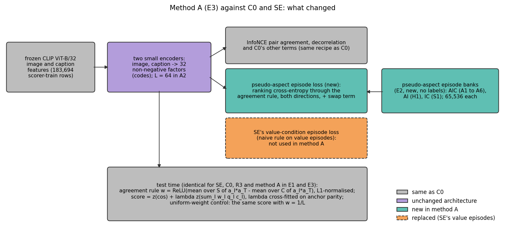
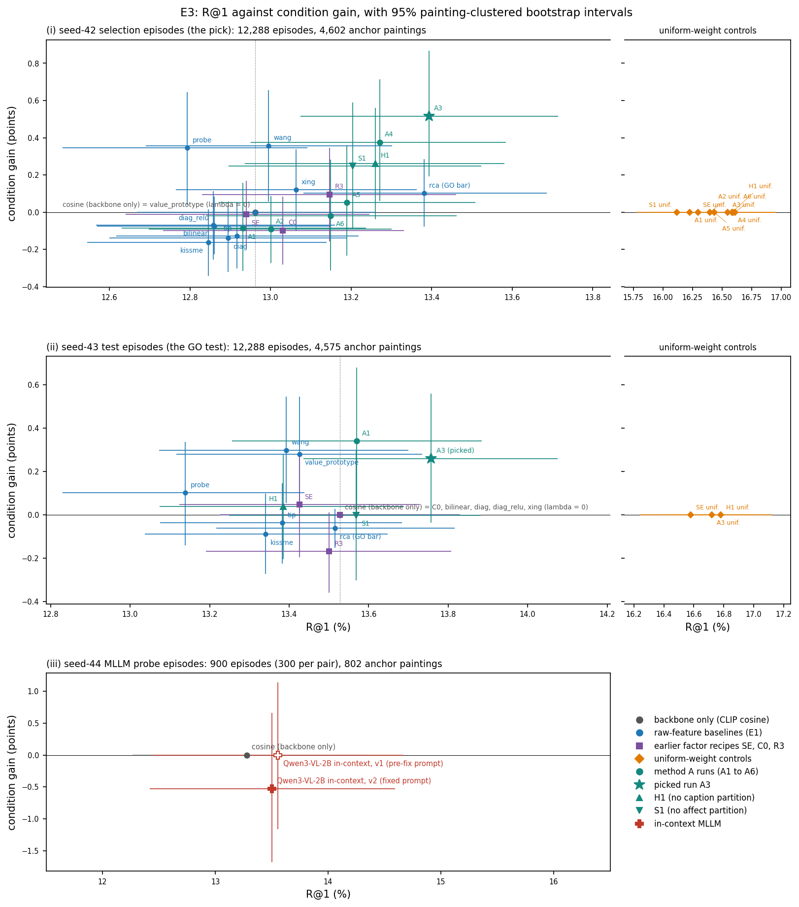
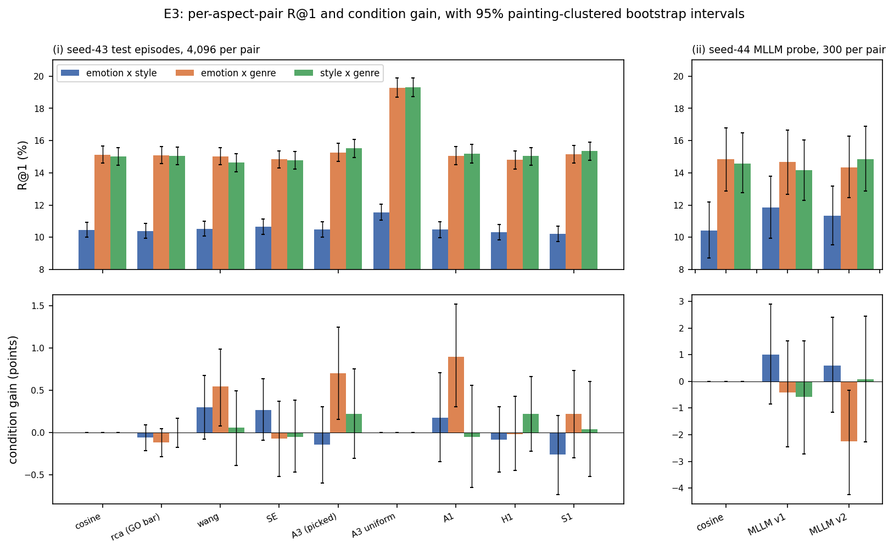
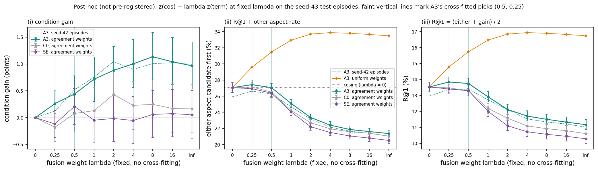
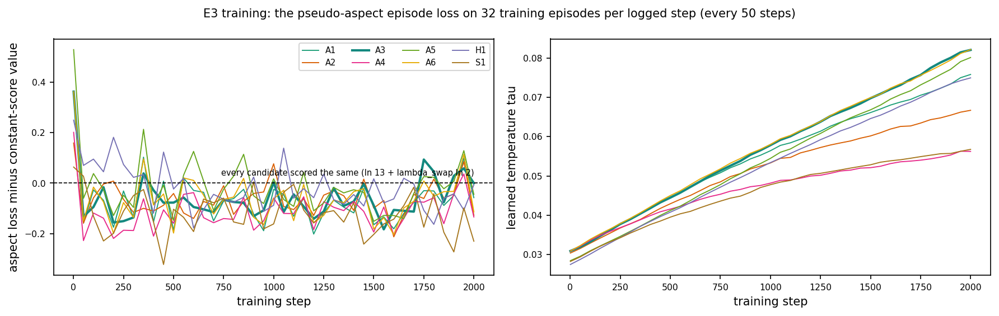

# E3: aspect-trained factors miss the go/no-go; the K8 genre test, supervision ablation and the early MLLM probe

Date: 2026-11-01 (sequence date of plan step E3, CVPR plan spec §6 and §11; the runs took place on 2026-10-03).
Experiment folders: `src/test/20261101_aspect_factor_gonogo/` (pre-registration, runner, logs) and
`src/test/20261102_mllm_probe/` (the in-context MLLM probe). Figures, figure data and their build script:
`docs/reports/assets/2026-11-01_aspect_factor_gonogo/`. Baselines beside every number: **backbone only** (CLIP
ViT-B/32 cosine on the same episodes) and **the GO bar** (RCA, the best raw-feature metric-from-pairs baseline on the
seed-42 episodes, chosen in E1).

## Summary

E3 was the Oct 9 go/no-go of the CVPR plan: does method A, a shared image and caption factor basis trained on
label-free pseudo-aspect episodes, select the aspect that a few example pairs demonstrate? We trained six eligible
runs and two test-only runs on ArtELingo scorer-train rows, picked one run on seed-42 selection episodes and tested it
once on fresh seed-43 episodes, all under rules committed before the first run.

**The answer is NO-GO.** The picked run, A3, reached R@1 13.76 against 13.53 for backbone only and 13.52 for the GO
bar, with a condition gain of 0.26 [−0.04, 0.56] points. GO failed robustly on two counts: the condition gain did not
clear zero against backbone only, and A3's own uniform-weight control (the same factors with the condition removed)
beat it on R@1 by almost 3 points. Two other outcomes sit on the boundary of the bootstrap's Monte Carlo noise: the
pass against the GO bar and the R@1 lower bound of exactly 0.000 against backbone only.

| Comparator (seed-43 test episodes) | Comparator R@1 / gain | A3 minus comparator, R@1 [95% CI] | A3 minus comparator, gain [95% CI] | Beats? | Bootstrap seeds 0 to 99 (post-hoc) |
|---|---|---|---|---|---|
| backbone only (CLIP cosine) | 13.53 / 0.00 | +0.23 [0.00, 0.46] | +0.26 [−0.04, 0.56] | no | R@1 bound above 0 in 29/100; gain bound in 0/100 |
| GO bar (RCA, cross-fitted) | 13.52 / −0.06 | +0.24 [0.00, 0.48] | +0.32 [0.01, 0.64] | yes, a boundary case | both bounds above 0 in 74/100 |
| A3's uniform-weight control | 16.72 / 0.00 | −2.96 [−3.29, −2.64] | +0.26 [−0.04, 0.56] | no | R@1 bound above 0 in 0/100 |

*"Beats" means both 95% painting-clustered bootstrap lower bounds are above 0, with the pre-registered bootstrap
(5,000 resamples, seed 42). GO needs all three rows; it failed on two. The last column repeats each paired test with
bootstrap seeds 0 to 99 (post-hoc, §5): GO would have passed under none of them.*

- **Strong GO** (R@1 and gain each at least 4 points above backbone only) was far away: +0.23 and +0.26.
- **K8 failed.** H1, trained without the caption partition and with no genre label, gained +0.10 [−0.21, 0.40] on
  genre pairs over its uniform control. Under the pre-registered rule, claim C2 narrows to "selection among aspects
  represented in training". The failure does not isolate the held-out aspect, though: A1, the positive control trained
  with all three partitions, also failed to clear zero on the genre pairs (0.42 [−0.02, 0.86]). Even a pass would have
  been weak evidence, because the image partition that H1 keeps carries genre (AMI 0.397).
- **Supervision ablation (descriptive) did not replicate.** On the seed-43 episodes, removing the GoEmotions affect
  partition lowered the emotion-pair condition gain by 0.56 [0.07, 1.05] points (S1 against A1). On the seed-42
  episodes the same paired difference went the other way, S1 minus A1 +0.23 [−0.24, 0.69], and A1's own emotion-pair
  gain was −0.04. Each arm is one model seed, so neither interval contains training variance. We therefore do not
  attribute A1's emotion conditioning to the distant supervision. A1 was not the picked run, and the comparison decides
  nothing.
- **Why the method failed (post-hoc reading, outside the decision map).** The uniform factor term finds candidates
  that share *an* aspect with the query: it puts one of the two aspect-sharing candidates first in 33.4% of rankings,
  against 27.1% for the cosine. Scored alone at a fixed fusion weight (§6.1), the agreement-weighted term of A3 did
  select the conditioned aspect: its term-only condition gain was 0.97 [0.53, 1.41] on the seed-43 episodes and 0.99
  [0.56, 1.45] on the seed-42 episodes, about one point above SE and C0 (paired, seed 43: A3 minus SE +0.91
  [0.38, 1.47], A3 minus C0 +0.80 [0.25, 1.37]). So aspect training did change the term. The same term, however,
  put either aspect candidate first in only 21.4% of rankings, below the cosine's 27.1%. Because R@1 equals half of
  that rate plus half of the gain, the pre-registered criterion (mean of R@1 and gain) kept the cross-fitted fusion
  weight at 0.25 to 0.5, where most of the gain disappears from the fused score (0.26). The fit was weak as well:
  during training the pseudo-aspect loss stayed only 1.0% to 4.4% below its constant-score value, and on fresh
  episodes of the training task the training-time score (0.3·cos plus the term, the nearest stored view of the term
  alone) gave A3 a gain of 0.95 [0.28, 1.62]. That is close to the term-only gain of about 1.0 on labelled aspects,
  which supports the reading of §6.4 that the NO-GO lies upstream of transfer: the little that training fit seems to
  have carried over, and the amount fit was the limit. The untested alternative is a task failure: these k-means
  pseudo-partitions may not be learnable as conditional aspects by this basis.
- **Early MLLM probe: neither run worked, with qualifiers.** The fixed-prompt run (v2), which decides, reached R@1
  13.50 against 13.28 for the cosine (+0.22 [−1.13, 1.53]) with a condition gain of −0.53 [−1.68, 0.66]. The pre-fix
  run (v1), whose rendering glued the letter labels onto neighbouring tokens, gave +0.28 [−0.98, 1.54] and 0.00
  [−1.16, 1.15]. Only the 2B model was probed (spec §6 allows the 8B model "if time allows"; we did not try it). The
  probe could only detect a pooled gain above about 1.2 points, and the 2B model put its top score on letter C in 17.4%
  of rankings against 7.7% for a uniform choice (§9.2).
- **Branch.** GO is missed and the MLLM does not work under its pre-registered rule, so the decision map of spec §4
  points to branch 3, an analysis and negative-results paper for a workshop or a datasets-and-benchmarks track
  (§11). Outside the map, §11 lists two options for the user: an 8B probe under a pre-registered addendum before
  branch 2 is closed, and a repair step before branch 1 is given up, which the post-hoc profile turns into a method
  change. The user decides.

## 1. Where this experiment comes from

The aspect task replaced an earlier evaluation, and every step since has narrowed what method A had to show.

1. **Value episodes were solved without the query.** In the support-baseline spike
   ([report](2026-10-22_support_baseline_spike.md)) a prototype of the supports that ignores the query reached
   R@1 22.83 on value episodes ("sad, like these"), and adding the query added only +0.57 (claim K1). Value episodes
   measured recognition of a value, not conditional similarity.
2. **No factor model selected the aspect.** The aspect-episode spike ([report](2026-10-23_aspect_episode_spike.md))
   changed the episodes so that the examples never show the query's value. SE with the agreement rule reached 11.32
   against 11.13 for CLIP alone, although label-supervised probes reached about 23. The task was learnable; our
   factors were not trained for it.
3. **The mechanism note (2026-10-03).** A simulation written with the plan showed what the factor basis must look
   like: the agreement rule transfers an aspect from the shown values to the query's value only if all values of an
   aspect are patterns over shared factors. One factor per value gives exactly zero condition gain, and raw features
   that mix the aspects defeat raw pair rules the same way (spec §6).
4. **E0** ([report](2026-10-29_aspect_eval_setup.md)) built the shared evaluation stack and reproduced the spike to
   0.01 (CLIP 11.13; SE 10.95, scored as in the spike at a fixed β of 0.3 without cross-fitting).
5. **E1** ([report](2026-10-30_aspect_baselines.md)) ran nine raw-feature metric-from-pairs baselines on 12,288
   aspect episodes per seed. None separated the aspects. RCA set the GO bar (mean of R@1 and gain 6.74 on seed 42).
   SE's uniform-weight control raised R@1 to 16.30 at gain 0, which made the uniform control a hard GO comparator.
6. **E2** ([report](2026-10-31_pseudo_partitions.md)) built three label-free pseudo-partitions of the scorer-train
   rows (GoEmotions affect, CLIP image and CLIP caption k-means, 64 clusters each) and the episode banks AIC, AI and
   IC. The image partition carries genre (adjusted mutual information 0.397), so the AI bank is not blind to genre.
7. **E3** (this report) trained method A on those banks and applied the go/no-go.

## 2. Method A and what it changed

*Figure 1. Method A against the earlier recipes C0 and SE. Grey parts are identical to C0, the purple encoders keep
C0's architecture, teal parts are new in method A, and the orange box is the value-episode loss of SE, which method
A does not use. The test-time score at the bottom is the same for every factor row in E1 and E3.*

**Terms.** A *code* is an item's vector of 32 non-negative *factors* from two small encoders, one per modality, on
frozen CLIP ViT-B/32 features. C0 is the matched factor recipe without condition training, and SE is C0 plus
value-condition episodes from GoEmotions and image clusters (both from the v2 line, spec §2.3). A *pseudo-partition*
assigns every training row to one of 64 clusters that stand in for the values of an unknown aspect. A
*pseudo-aspect episode* copies the evaluation episode (below) with clusters in place of labels, and a *bank* is a
fixed set of 65,536 such episodes.

**Training.** Method A keeps C0's recipe (InfoNCE pair agreement, decorrelation and C0's other terms) and adds a
*pseudo-aspect episode loss*: for 32 bank episodes per step, the agreement rule turns the support and contrast pairs
into factor weights, the score ranks the 13 candidates, and the loss is the cross-entropy of the correct target under
each condition and direction plus a *swap term* (softplus of the other aspect's candidate minus the target). The
score temperature τ is learned. All runs trained for 2,000 steps at model seed 42.

**The grid** (pre-registered, §3 of `PREREGISTRATION.md`):

| Run | Bank (partitions) | Change from A1 | Eligible for the pick |
|---|---|---|---|
| A1 | AIC (affect, image, caption) | λ_aspect 1, λ_swap 1, aspect β 0.3, L = 32 | yes |
| A2 | AIC | L = 64 factors | yes |
| A3 | AIC | λ_aspect 3 | yes |
| A4 | AIC | λ_swap 0 | yes |
| A5 | AIC | aspect β 0 (no cosine in the training score) | yes |
| A6 | AIC | no sparsity penalty, decorrelation 0.1 (meant to give denser codes) | yes |
| H1 | AI (affect, image) | A1's settings; the model with no genre label or genre partition, for K8 | no, test only |
| S1 | IC (image, caption) | A1's settings; the supervision ablation without the affect partition | no, descriptive |

Training took 579 to 621 s per run, three at a time on the local RTX 3090 (peak 3.93 GiB, A2 3.94 GiB), from 03:14 to
03:44. No run had a dead factor. On scorer-train rows the image codes were 42% to 45% active (A2: 30% of 64) and the
caption codes 48% to 51% (A2: 34%). A6 was meant to be denser but was not: 43% and 50% active, against A1's 43% and
48%.

## 3. Protocol and the pre-registered rules

**Aspect episodes** (spec §5.1, E0). An *anchor* (the query: an image for *i2t*, a caption for *t2i*) has a value on
two aspects, A and B. Of 13 candidates in the other modality, p_A shares the anchor's value of A, p_B shares its value
of B and 11 negatives share neither. Two sets of 4 *cross-item* example pairs (an image of one painting with a caption
of another), P_A and P_B, each agree on their aspect with values that differ from the anchor's. Under condition A the
*supports* are P_A, the *contrasts* are P_B and the target is p_A; condition B swaps them. Where a third aspect is
labelled, all 13 candidates differ from the anchor on it (the *third-aspect control*). ArtELingo has three aspects
(emotion 8 values, style 23, genre 10), so all three pairs were used. The GO test read Task 9's seed-43 episodes:
4,096 per pair, 12,288 pooled, 4,575 anchor paintings, all on the 32,413 selection rows.

**Metrics.** *R@1* is the share of rankings whose target ranks strictly first (a tie is a miss), averaged over both
conditions and both directions. The *other-aspect rate* is how often the other aspect's candidate ranks first.
*Condition gain* is R@1 minus the other-aspect rate. It is exactly 0 for any scorer that ignores the condition,
however high its R@1. *Swap* is the share of anchors where p_A beats p_B under condition A and p_B beats p_A under
condition B.

**Scores.** The *agreement rule* sets w = ReLU(mean over S of a_I ⊙ a_T minus mean over C of a_I ⊙ a_T), L1
normalised, from the image codes a_I and caption codes a_T of the example pairs, and scores a query and candidate by
Σ_l w_l q_l c_l. This term is fused with the cosine by per-episode z-scores, z(cos) + λ·z(term), with λ from
{0, 0.25, 0.5, 1, 2, 4, 8, 16, ∞}. λ is *cross-fitted*: chosen on one parity half of the anchors by the mean of R@1
and condition gain, then applied to the other half. The *uniform-weight control* is the same model and fusion with
w = 1/L, so the condition is removed and its gain is 0 by construction.

**Uncertainty.** Every interval is a 95% percentile interval of a bootstrap that resamples whole anchor paintings
(5,000 resamples, seed 42). Paired comparisons bootstrap the per-anchor difference.

**Rules** (`PREREGISTRATION.md`, committed in 994e138 at 02:35:08, before any training run; the dated addendum in
759ee83 at 03:04:06, before any grid result; the grid started at 03:14:24):

- **Pick:** among A1 to A6, the run with the highest mean of R@1 and condition gain on the pooled seed-42 episodes.
- **GO:** on the seed-43 episodes, the picked run beats backbone only, the GO bar and its own uniform control, each
  on both R@1 and condition gain (lower bound above 0). GO is an intersection-union test of six one-sided tests, so
  no multiplicity adjustment is needed (addendum A8).
- **Strong GO:** GO, plus R@1 and gain each at least 4.0 points above backbone only. Backbone only measured 13.53 on
  these episodes, not the 11.1 that spec §6 quotes from the spike's episodes, so strong GO needed R@1 of about 17.5
  (addendum A7).
- **K8:** H1's condition gain on the genre pairs (emotion × genre and style × genre) beats H1's uniform control.
- **MLLM probe:** the in-context MLLM *works* if it beats the cosine on both R@1 and condition gain on its seed-44
  episodes.
- **Decision map (spec §4):** GO gives branch 1, GO missed with a working MLLM gives branch 2, neither gives
  branch 3. The user decides.

## 4. The grid and the pick (seed-42 selection episodes)

| Run | R@1 [95% CI] | Condition gain [95% CI] | Other-aspect | Swap | Pick criterion | Uniform control R@1 | λ picks, run; uniform |
|---|---|---|---|---|---|---|---|
| A1 | 12.93 [12.63, 13.24] | −0.09 [−0.32, 0.16] | 13.02 | 4.14 | 6.423 | 16.23 | 0 / 0.5; 2 / 8 |
| A2 | 13.00 [12.70, 13.30] | −0.09 [−0.27, 0.09] | 13.09 | 2.31 | 6.454 | 16.40 | 0 / 0.25; 4 / 8 |
| **A3** | **13.39 [13.07, 13.71]** | **0.52 [0.19, 0.87]** | 12.88 | 8.38 | **6.955** | 16.55 | 0.5 / 0.5; 8 / 8 |
| A4 | 13.27 [12.95, 13.58] | 0.38 [0.06, 0.71] | 12.89 | 8.50 | 6.824 | 16.59 | 0.5 / 0.5; 8 / 8 |
| A5 | 13.19 [12.87, 13.51] | 0.05 [−0.23, 0.36] | 13.14 | 6.58 | 6.621 | 16.43 | 0.5 / 0.25; 4 / 4 |
| A6 | 13.15 [12.84, 13.46] | −0.02 [−0.31, 0.28] | 13.17 | 6.42 | 6.565 | 16.61 | 0.5 / 0.25; 4 / 8 |
| H1 (not eligible) | 13.26 [12.94, 13.58] | 0.26 [−0.04, 0.56] | 13.00 | 6.92 | 6.762 | 16.59 | 0.25 / 0.5; 8 / 8 |
| S1 (not eligible) | 13.20 [12.90, 13.52] | 0.25 [−0.09, 0.59] | 12.96 | 8.60 | 6.726 | 16.12 | 0.5 / 0.5; 4 / 4 |
| backbone only | 12.96 [12.67, 13.26] | 0.00 | 12.96 | 0.00 | 6.481 | | |
| GO bar (RCA) | 13.38 [13.08, 13.69] | 0.10 [−0.08, 0.29] | 13.28 | 3.17 | 6.742 | | |
| SE uniform control | 16.30 [15.96, 16.63] | 0.00 | 16.30 | 0.00 | | | |

*λ picks are written as "tuned on half 0 / tuned on half 1"; each half's pick scores the other half.*

The pick rule chose **A3** (criterion 6.955), ahead of A4 (6.824) and of the two ineligible runs H1 (6.762) and S1
(6.726). Every run is one change from A1 (R@1 12.93, gain −0.09). Two changes raised both metrics by amounts that
matter for the gain: tripling the aspect loss weight (A3: +0.46 R@1 and +0.60 gain, R@1 13.39 level with the GO bar's
13.38) and dropping the swap term (A4: +0.34 R@1 and +0.46 gain). No cosine in the training score (A5: +0.26 R@1,
+0.14 gain) and the "denser" variant (A6: +0.22 R@1, +0.07 gain) nudged both point estimates up by amounts well
inside the intervals, and 64 factors (A2: +0.07 R@1, −0.01 gain) changed neither; the gains of A2, A5 and A6 stayed within
0.15 of zero (−0.09, 0.05 and −0.02). No paired comparison between runs was pre-registered, and A3's lead over A4
(0.13 on the criterion) is well inside the intervals, so the pick is one draw from a cluster of similar runs.

The seed-42 table already showed two signs of the outcome. Every run sat within 0.45 R@1 of the cosine, while every
uniform control sat 3.2 to 3.7 points above it (16.12 to 16.61). And cross-fitting gave the condition-weighted term a
weight of 0 to 0.5, against 2 to 8 for the uniform term. The tuning halves found the uniform factor similarity useful
for R@1, and a larger weight on the conditioned term cost more R@1 than it added in gain; the post-hoc profile in §6.1
shows that trade directly. For A1 and A2 one tuning half chose λ = 0, so on the other half the method was the cosine.

## 5. The GO test (seed-43 test episodes)

The picked run was scored once on the seed-43 episodes, with its checkpoint hash checked against the pick record.

| Model (seed 43) | R@1 [95% CI] | Condition gain [95% CI] | Other-aspect | Swap | λ picks |
|---|---|---|---|---|---|
| A3, picked | 13.76 [13.44, 14.08] | 0.26 [−0.04, 0.56] | 13.50 | 6.77 | 0.5 / 0.25 |
| A3 uniform control | 16.72 [16.37, 17.07] | 0.00 | 16.72 | 0.00 | 8 / 2 |
| backbone only | 13.53 [13.23, 13.83] | 0.00 | 13.53 | 0.00 | none |
| GO bar (RCA) | 13.52 [13.22, 13.82] | −0.06 [−0.15, 0.03] | 13.58 | 0.89 | 0 / 0.25 |

The three paired comparisons are in the Summary table. A3 beat the GO bar on both metrics (R@1 +0.24, lower bound
+0.002; gain +0.32, lower bound +0.008) but not the other two comparators:

- **Against backbone only**, the R@1 difference was +0.23 with a lower bound of exactly 0.000, and the gain
  difference, which equals A3's own gain because the cosine's is 0, had a lower bound of −0.04.
- **Against its uniform control**, A3 lost 2.96 points of R@1, and the gain comparison is again A3's own gain.

So GO failed on both metrics against backbone only (on R@1 by a lower bound of exactly 0.000, which the strict
"above 0" rule does not accept) and against its uniform control; against RCA it passed both. Strong GO failed by more
than an order of magnitude: +0.23 R@1 and +0.26 gain against the required +4.0 each.

**Which outcomes are boundary cases** (post-hoc, outside the decision map; `posthoc_lambda_profile.py`). Three of the
six lower bounds sit within a few thousandths of a point of zero, so their side of zero depends on the bootstrap's
random draw. We repeated each paired test with bootstrap seeds 0 to 99 (5,000 resamples each; seed 42 reproduced the
pre-registered bounds exactly). A3 beat RCA on both metrics in 74 of 100 seeds (R@1 in 78, gain in 96), and the R@1
bound against backbone only cleared zero in 29 of 100 (median −0.002). Both are Monte Carlo boundary cases, and the
pass against RCA is not a robust finding. The verdict does not depend on them: the gain bound against backbone only
cleared zero in 0 of 100 seeds (median −0.035), the R@1 bound against the uniform control in 0 of 100 (median −3.29,
from a difference of −2.96 [−3.29, −2.64]), and GO, which needs all six, passed under none of the 100 seeds.

**The winner's curse.** A3's seed-42 gain of 0.52 halved to 0.26 on the fresh episodes. Runs that were not picked
moved by similar amounts in both directions (A1 from −0.09 to 0.34, H1 from 0.26 to 0.04, S1 from 0.25 to 0.00), so
gains of this size vary between two draws of episodes on the same rows by about as much as one interval's half width.
Testing on fresh episodes removed the selection advantage that the seed-42 pick carried.

**Per aspect pair** (Figure 3). A3's gain was positive only on emotion × genre, 0.70 [0.15, 1.24], with −0.14
[−0.60, 0.30] on emotion × style and 0.22 [−0.30, 0.75] on style × genre. The order is not stable across draws: on
the seed-42 pick episodes A3's largest gain was on style × genre (0.80 [0.23, 1.39]), ahead of emotion × genre (0.63
[0.02, 1.23]) and emotion × style (0.12 [−0.41, 0.65]), so we read no mechanism into which pair leads. Emotion × style
was the hardest pair for
every scorer (cosine R@1 10.45 against 15.13 and 15.00 for the genre pairs). That is consistent with claim C3, still
open until E12: emotion is carried mainly by the captions and style by the images, so a cross-modal match on either
aspect would be bounded by its weaker side.

**Against all nine raw baselines** (addendum A5, descriptive). On the seed-43 episodes A3 beat KISSME and RCA on both
metrics, beat Wang et al.'s per-query metric, the pair probe and Tip-Adapter on R@1 only, and did not beat the
diagonal rule (signed and rectified), the bilinear form or Xing, which all chose λ = 0 on both halves and so equal the
cosine. The best baseline on seed 43 was Wang (mean of R@1 and gain 6.85, gain 0.30 [0.06, 0.55]); A3 beat it on R@1
(+0.36 [0.12, 0.61]) but not on gain (−0.04 [−0.40, 0.34]). SE's uniform control beat A3 on R@1 by 2.82 [2.51, 3.14].

*Figure 2. R@1 against condition gain for every method, with 95% painting-clustered intervals on both axes. (i) The
seed-42 episodes on which the run was picked: the six A runs, H1, S1, their uniform controls (right), the nine raw
baselines and the value prototype (blue), SE, C0 and R3 (purple) and the cosine (grey, dotted line). (ii) The seed-43
test episodes: A3, A1, H1, S1, the uniform controls of A3, H1 and SE, and the same baselines. (iii) The in-context
MLLM on its own seed-44 episodes, v1 (open marker) and v2 (filled marker), next to the cosine on those episodes.
Methods with identical points are labelled together; on seed 43 four raw baselines and C0 chose λ = 0 on both halves
and coincide with the cosine.*

*Figure 3. R@1 (top) and condition gain (bottom) per aspect pair. (i) Seed-43 test episodes, 4,096 per pair, for the
cosine, the GO bar (RCA), the best seed-43 baseline (Wang), SE, the picked run A3 and its uniform control, A1, H1 and
S1. (ii) The MLLM probe's seed-44 episodes, 300 per pair: the cosine, v1 (pre-fix prompt) and v2 (fixed prompt).*

## 6. Why the method did not reach GO

### 6.1 The weighted term selects the aspect, but loses the ability to find one

Adding R@1 and the other-aspect rate gives the share of rankings in which *either* aspect-sharing candidate ranks
first. Comparing that share between a model and its uniform-weight control separates finding an aspect from choosing
the conditioned one. Since the gain is R@1 minus the other-aspect rate, R@1 is exactly half the "either" rate plus half
the gain, so a scorer can raise R@1 by finding aspect-sharing candidates more often, by choosing the conditioned one
more often, or both. On the seed-43 episodes, with the pre-registered cross-fitted fusion:

| Scorer | R@1 | Other-aspect | Either aspect candidate first | Gain |
|---|---|---|---|---|
| backbone only | 13.53 | 13.53 | 27.05 | 0.00 |
| A3 uniform control | 16.72 | 16.72 | 33.44 | 0.00 |
| SE uniform control | 16.58 | 16.58 | 33.16 | 0.00 |
| A3, agreement rule | 13.76 | 13.50 | 27.25 | 0.26 |

The factor similarity, unweighted, lifted the "either candidate" rate by 6.4 points over the cosine: it detects that
a candidate shares *some* aspect with the query. Most of that lift came from the genre pairs (A3's uniform control
reached R@1 19.29 and 19.31 on the two genre pairs against the cosine's 15.13 and 15.00, but 11.55 against 10.45 on
emotion × style), which fits the image codes carrying genre most strongly (η² below). With the agreement weights and
the cross-fitted λ (0.5 and 0.25), the "either" rate fell back to 27.25 and the target led the other aspect's
candidate by only 0.26 points (13.76 against 13.50). The cross-fitted fusion therefore hides what the weighted term
does on its own, which the following post-hoc check separates.

**Post-hoc check at fixed λ** (not pre-registered, descriptive, outside the decision map; written after the final
review; `src/test/20261101_aspect_factor_gonogo/posthoc_lambda_profile.py`, CPU, selection rows only). We scored
z(cos) + λ·z(term) at every λ of the grid without cross-fitting, for A3, C0 and SE with agreement weights and with
uniform weights, on both episode draws. The script first re-derived the stored cross-fitted per-anchor arrays of A3,
SE and C0 bit-exactly. Baseline: the cosine (λ = 0) and the same term from SE (value episodes) and C0 (no condition
training).

| Seed-43 test episodes, fixed λ | A3, agreement: R@1 / gain [95% CI] / either | C0, agreement: gain [95% CI] / either | SE, agreement: gain [95% CI] / either | A3, uniform: R@1 / either |
|---|---|---|---|---|
| 0 (cosine) | 13.53 / 0.00 / 27.05 | 0.00 / 27.05 | 0.00 / 27.05 | 13.53 / 27.05 |
| 0.25 | 13.84 / 0.26 [0.01, 0.51] / 27.43 | −0.18 [−0.44, 0.07] / 27.14 | −0.12 [−0.37, 0.13] / 26.93 | 14.78 / 29.57 |
| 0.5 | 13.75 / 0.44 [0.10, 0.78] / 27.06 | 0.08 [−0.27, 0.41] / 26.50 | 0.21 [−0.13, 0.54] / 26.38 | 15.74 / 31.47 |
| 1 | 12.92 / 0.72 [0.30, 1.13] / 25.11 | 0.13 [−0.30, 0.56] / 24.25 | −0.05 [−0.47, 0.38] / 24.06 | 16.47 / 32.93 |
| 2 | 12.12 / 0.88 [0.44, 1.32] / 23.36 | 0.43 [−0.02, 0.88] / 22.71 | −0.02 [−0.44, 0.43] / 22.22 | 16.84 / 33.69 |
| 8 | 11.51 / 1.14 [0.71, 1.58] / 21.88 | 0.25 [−0.19, 0.70] / 21.59 | 0.06 [−0.37, 0.51] / 21.07 | 16.89 / 33.79 |
| ∞ (term only) | 11.17 / 0.97 [0.53, 1.41] / 21.37 | 0.16 [−0.28, 0.61] / 21.05 | 0.05 [−0.39, 0.51] / 20.52 | 16.74 / 33.48 |
| ∞, seed-42 episodes | 11.02 / 0.99 [0.56, 1.45] / 21.04 | 0.09 [−0.35, 0.54] / 20.55 | −0.25 [−0.67, 0.19] / 20.53 | 16.51 / 33.02 |

*λ = 4 and 16 are omitted here; all nine values are in Figure 4 and in `results/posthoc_lambda_profile.json`.
Paired term-only (λ = ∞) gains: A3 minus SE +0.91 [0.38, 1.47] on seed 43 and +1.24 [0.70, 1.78] on seed 42; A3 minus
C0 +0.80 [0.25, 1.37] and +0.91 [0.35, 1.46].*

*Figure 4. Post-hoc fixed-λ profile on the seed-43 test episodes (A3 on the seed-42 episodes as a thin dashed line):
(i) condition gain, (ii) the "either aspect candidate first" rate, (iii) R@1, for A3 (teal), C0 (grey) and SE (purple)
with agreement weights, A3 with uniform weights (orange) and the cosine (dotted). Bars are 95% painting-clustered
intervals; the faint vertical lines mark A3's cross-fitted picks.*

Three things follow, all post-hoc.

1. **Aspect training did change the weighted term.** A3's agreement-weighted term gained about one point by itself,
   with intervals above zero from λ = 0.5 upward on both draws (0.97 [0.53, 1.41] and 0.99 [0.56, 1.45] at λ = ∞). The
   same term from C0 never cleared zero (largest gain 0.43 [−0.02, 0.88]) and SE's stayed near zero (0.05 at λ = ∞),
   and the paired term-only differences exclude zero on both draws. This corrects the earlier reading of this section,
   which took the cross-fitted 0.26 as evidence that aspect training did not change the term.
2. **The weighted term loses the ability to find an aspect.** As λ grows, A3's "either" rate falls from 27.05 to
   21.37, below the cosine, while the uniform term raises it to 33.48. C0 and SE fall the same way (21.05, 20.52), so
   the loss comes from the agreement weighting, not from aspect training. Our reading, untested, is that the weights
   concentrate on the few factors the example pairs agree on and drop the shared factor similarity that finds
   aspect-sharing candidates.
3. **The pre-registered criterion therefore keeps λ small.** Above λ = 0.25 each step costs more "either" rate than
   it adds gain, so R@1 = (either + gain) / 2 falls from 13.84 to 11.17 at λ = ∞. The pick criterion, the mean of R@1
   and gain, equals either / 4 + 3·gain / 4; on all seed-43 anchors it peaks at λ = 0.5 (7.09, against 7.05 at 0.25,
   6.82 at 1 and 6.07 at ∞, with the cosine at 6.76). Cross-fitting picked 0.5 and 0.25, where the gain was 0.44 and
   0.26, so most of the term's gain did not reach the fused score.

### 6.2 Values share factors, but the factors carry little value information

The mechanism note predicts zero gain if each value sits on its own factor. The pre-registered diagnostic and the two
descriptive measures added by the addendum test this on the selection rows (evaluation labels are read only here).

- The *value spread* S lies between 1/V (every factor carries one value) and 1 (every value is a pattern over the
  same factors). The reviewer's synthetic references were 0.08 to 0.14 for one-factor-per-value codes and 0.47 to 0.49
  for aspect-block codes.
- *η²* of a factor is the share of its variance across rows that the value labels explain; we report the mean over
  the live factors.
- The pre-registered *shared share* is reported but labelled blind: one-factor-per-value codes also score 1.00 on it.

| Aspect (values, 1/V) | Model | Shared share, img / txt | Mean η², img / txt | Value spread S, img / txt |
|---|---|---|---|---|
| emotion (8, 0.125) | A3 | 1.00 / 1.00 | 0.025 / 0.057 | 0.63 / 0.59 |
| | H1 | 1.00 / 1.00 | 0.023 / 0.051 | 0.61 / 0.58 |
| | S1 | 1.00 / 1.00 | 0.023 / 0.047 | 0.65 / 0.61 |
| | SE | 1.00 / 1.00 | 0.025 / 0.057 | 0.62 / 0.58 |
| | C0 | 1.00 / 1.00 | 0.022 / 0.047 | 0.61 / 0.57 |
| | R3 | 1.00 / 1.00 | 0.023 / 0.046 | 0.63 / 0.58 |
| style (23, 0.043) | A3 | 0.97 / 1.00 | 0.132 / 0.061 | 0.57 / 0.61 |
| | H1 | 0.94 / 1.00 | 0.123 / 0.056 | 0.54 / 0.58 |
| | S1 | 1.00 / 1.00 | 0.126 / 0.059 | 0.57 / 0.58 |
| | SE | 0.94 / 1.00 | 0.136 / 0.061 | 0.53 / 0.57 |
| | C0 | 0.97 / 1.00 | 0.122 / 0.057 | 0.54 / 0.56 |
| | R3 | 1.00 / 1.00 | 0.124 / 0.057 | 0.57 / 0.58 |
| genre (10, 0.100) | A3 | 0.91 / 1.00 | 0.264 / 0.166 | 0.46 / 0.50 |
| | H1 | 0.94 / 1.00 | 0.227 / 0.139 | 0.41 / 0.48 |
| | S1 | 0.97 / 1.00 | 0.244 / 0.150 | 0.44 / 0.49 |
| | SE | 1.00 / 1.00 | 0.249 / 0.158 | 0.42 / 0.49 |
| | C0 | 1.00 / 1.00 | 0.222 / 0.141 | 0.42 / 0.46 |
| | R3 | 1.00 / 1.00 | 0.229 / 0.144 | 0.43 / 0.44 |

*R3's rows are transductive: its encoders were trained on all train rows, which include these selection rows
(features only, never labels; §10, item 16).*

1. **The one-factor-per-value failure is ruled out.** S was 0.41 to 0.65 for every model, aspect and modality, four
   to fourteen times its floor, close to or above the reviewer's synthetic block codes (0.47 to 0.49) and far above
   the one-factor-per-value codes (0.08 to 0.14). The values of each aspect are patterns over shared factors, which is
   the property the mechanism note asks for.
2. **The value signal in those factors is weak, and weakest for emotion.** On average the value labels explain 2% to
   6% of a factor's variance for emotion, 6% to 14% for style and 14% to 26% for genre. Emotion is the aspect that
   the captions carry (E0, spec C3), and even the caption codes explain only 5% to 6% of it.
3. **Aspect training changed the codes little.** A3's η² exceeded C0's by about a fifth on emotion captions (0.057
   against 0.047) and genre images (0.264 against 0.222). SE's value episodes matched that on emotion captions (0.057)
   and came close on genre images (0.249). On these per-factor measures, A3's codes look like C0's and SE's, although
   the agreement-weighted term built from them selects the conditioned aspect better than SE's or C0's (§6.1).

What these measures do not show is whether separate factors specialise in separate aspects (an aspect-block basis).
We did not measure that, and it is the remaining part of the mechanism note's requirement.

### 6.3 The model did not fit its own training episodes

The training logs (Figure 5) show the most direct cause we found. The pseudo-aspect loss has a reference value: when
every candidate gets the same score, the cross-entropy is ln 13 and the swap term ln 2, so the loss is 3.258 with the
swap term and 2.565 without it. Over the last ten logged steps (steps 1,550 to 2,000), every run stayed between 1.0%
and 4.4% below that value: A3 3.222 against 3.258 (1.1% below), A1 3.191 (2.0%), S1 3.116 (4.4%), A4 2.470 against
2.565 (3.7%). After a drop in the first 50 steps the loss did not decrease further: A3 drifted back up toward the
constant-score value (3.175 over steps 50 to 500, 3.222 over steps 1,550 to 2,000), and H1's mean over steps 50 to 500
(3.308) sat above it. Over the same steps the learned temperature τ rose steadily, from 0.031 to 0.082 for A3, which
flattens the softmax. In every run log τ rose by 0.60 to 1.04 over 2,000 steps, which is 30% to 52% of the most Adam
can move one parameter at learning rate 0.001 (2.0 over 2,000 steps), and 42% to 64% of it over steps 50 to 1,050; its
gradient kept the same sign for most of training. A learned temperature rises when sharper scores would raise the
loss, which fits weakly informative scores, but a growing score scale or training that had not converged would also
produce it, and we did not separate these.

*Figure 5. Left: the pseudo-aspect loss of each run minus its constant-score value (dashed line at 0), logged every 50
steps on that step's 32 training episodes. Right: the learned temperature τ. A3, the picked run, is the thick line.*

This places the failure upstream of transfer. E3 was designed to ask whether a basis trained on pseudo-aspects
transfers to labelled aspects. Under these settings the basis learned the pseudo-aspect task itself only weakly
(§6.4), so the transfer question was not really posed. The post-hoc check below tests this directly.

### 6.4 Post-hoc check: the training task on fresh pseudo-aspect episodes

**Not pre-registered, descriptive, outside the decision map.** It ran after the GO verdict and changes no pick, rule
or conclusion of the go/no-go. We scored the trained models on their own task (commits 938d1e5 and 8a8e999,
`src/test/20261101_aspect_factor_gonogo/train_fit_diagnostic.py`, CPU, scorer-train rows only). The *fresh* episodes
were new pseudo-aspect episodes built from the E2 partitions (seed 777 plus the pair index, 2,048 per partition pair,
validated, third partition controlled) over the training rows, so the models had never seen these episodes. The *bank*
episodes were the first 2,048 of each block of the AIC training bank; with 32 of 65,536 episodes drawn per step for
2,000 steps, each bank episode had about a 62% chance of being seen in training, so they are mostly in-sample for A1
to A6 (H1 and S1 trained on the AI and IC banks). The scorers were E3's: the cross-fitted agreement rule, the uniform
control and, as a second view, the training-time score with a fixed β of 0.3. Clusters are paintings, as elsewhere.

| Model | Fresh, agreement rule: R@1 / gain [95% CI] | Fresh, training score (β 0.3) | Bank, agreement rule | Fresh, uniform control R@1 |
|---|---|---|---|---|
| backbone only | 18.41 / 0.00 | | 17.96 / 0.00 | |
| A1 | 18.89 / 0.54 [−0.01, 1.13] | 17.57 / 0.54 [−0.11, 1.22] | 18.09 / 0.90 [0.27, 1.53] | 22.91 |
| A2 | 18.38 / 0.02 [−0.40, 0.43] | 17.89 / 0.33 [−0.28, 0.96] | 18.75 / 1.14 [0.57, 1.74] | 22.91 |
| **A3, picked** | 19.04 / 0.36 [−0.12, 0.86] | 17.69 / 0.95 [0.28, 1.62] | 19.57 / 1.18 [0.64, 1.73] | 22.74 |
| A4 | 18.93 / 0.48 [−0.10, 1.04] | 17.79 / 0.69 [−0.004, 1.37] | 18.88 / 0.50 [−0.07, 1.07] | 22.97 |
| A5 | 18.82 / 0.61 [0.07, 1.18] | 17.39 / 0.47 [−0.20, 1.16] | 18.73 / 0.48 [−0.08, 1.05] | 22.81 |
| A6 | 18.87 / −0.06 [−0.59, 0.44] | 17.54 / 0.64 [−0.07, 1.33] | 18.43 / 1.04 [0.42, 1.67] | 22.88 |
| H1 | 18.46 / −0.28 [−0.56, −0.004] | 17.50 / −0.02 [−0.71, 0.65] | 18.60 / −0.15 [−0.65, 0.34] | 22.79 |
| S1 | 18.29 / −0.32 [−0.70, 0.07] | 17.72 / 0.15 [−0.53, 0.85] | 18.73 / 0.28 [−0.29, 0.86] | 22.97 |
| C0 (no aspect training) | 18.00 / −0.41 [−0.81, 0.00] | 16.56 / 0.04 [−0.68, 0.74] | 18.31 / 0.04 [−0.47, 0.55] | 23.07 |
| SE (value episodes) | 18.40 / −0.16 [−0.45, 0.13] | 16.40 / 0.17 [−0.55, 0.86] | 18.70 / 0.16 [−0.24, 0.59] | 22.75 |

*Three bounds sit at zero to two decimals, so they are shown to three: A4's training-score lower bound (−0.004), H1's
agreement-rule upper bound (−0.004, so H1's interval lies just below zero) and C0's agreement-rule upper bound
(0.000). The SE row is the SE checkpoint of E1 and E3
(`src/test/20261018_affect_factor_learning/checkpoints/SE_seed42.pt`, SHA-256 93add21b…). The first version of the
check (938d1e5) had scored the factor-learning grid's style cell S under the label SE; 8a8e999 corrected the label and
kept S as a separate reference row, which we leave out.*

1. **On fresh episodes of their own task the gains were small.** The A runs' condition gain under the agreement rule
   was −0.06 to 0.61 against the cosine's 0.00, and only A5's interval cleared zero (0.61 [0.07, 1.18]). Under the
   training-time score only A3 cleared it (0.95 [0.28, 1.62]). That score has lower R@1 than the cosine for every
   model (C0 16.56, SE 16.40, A5 17.39, A3 17.69, against 18.41), so the R@1 drop belongs to the scorer, not to A3's
   gain. These gains are of the same order as A3's on labelled aspects: 0.26 with the cross-fitted fusion, and about
   1.0 for the weighted term alone at fixed λ (§6.1, post-hoc).
2. **Even on bank episodes, which they mostly trained on, the gains stayed small:** 0.48 to 1.18 for A1 to A6 under
   the agreement rule, against 0.04 for C0.
3. **The uniform controls repeated the labelled-episode pattern.** Every model, C0 and SE included, reached R@1 22.74 to
   23.07 with its uniform control against the cosine's 18.41. The unconditioned factor similarity finds candidates that
   share a cluster whether or not the model was trained on aspect episodes. Under the cross-fitted fusion, A3 showed a
   gain of 0.36 against −0.41 for C0 on fresh episodes; we did not test that difference as a pair.

So the near-zero gain on labelled aspects is not the failure of transfer from a well-fit training task. The fixed-λ
profile of §6.1 adds a rough match: A3's term-only gain on labelled aspects (0.97 and 0.99 on the two draws) is close
to its gain under the training score on fresh pseudo-aspect episodes (0.95 [0.28, 1.62]), the nearest stored view of
the term alone, though the two scorers are not identical. What the model learned about pseudo-aspects therefore seems
to have carried over to labelled aspects, and the amount learned was the limit. Our reading, made after the verdict, is
that E3's NO-GO judges method A as implemented: an optimisation or objective failure upstream of transfer. The alternative we did not test is a task failure: the k-means pseudo-partitions may not be
learnable as conditional aspects by this basis. Either way, E3 does not refute the idea that a basis which fits
pseudo-aspects would transfer to labelled aspects, because E3 never produced such a basis.

### 6.5 Summary of the mechanism

The factor basis encodes enough shared structure, mostly genre and style, to find aspect-sharing candidates, and its
values do spread across shared factors. The codes carry little value information per factor, and the training
objective stayed near its constant-score value. Aspect training still gave the agreement-weighted term a condition gain
of about one point over SE's and C0's terms (post-hoc, §6.1), close to what the model reached on fresh episodes of its
own training task. That term, however, ranks either aspect candidate first less often than the cosine, while the
uniform term ranks one first far more often. Because R@1 counts both abilities, the pre-registered pick criterion kept
the weighted term's fusion weight at 0.25 to 0.5, and the fused score kept only 0.26 of its gain on the fresh test
episodes. Our post-hoc reading is that two limits acted together: a weak fit to the training task, and a scoring rule
in which the selection signal displaces the aspect-finding signal instead of adding to it.

## 7. K8: genre with no genre label or genre partition

**Why it was tested.** Each ArtELingo pseudo-partition was chosen to resemble one evaluation aspect, so a reviewer can
ask whether the method learns aspects or a selector among the aspects it was trained on (risk R-pseudo). K8 trains H1
on the affect and image partitions only (the AI bank, no caption partition and no genre label) and tests the genre
pairs.

| H1 on the genre pairs (8,192 seed-43 episodes, 4,041 paintings) | R@1 [95% CI] | Condition gain [95% CI] |
|---|---|---|
| H1 | 14.92 [14.54, 15.30] | 0.10 [−0.21, 0.40] |
| H1 uniform control | 19.30 [18.86, 19.72] | 0.00 |
| H1 minus its uniform control | −4.38 [−4.79, −3.96] | **+0.10 [−0.21, 0.40]** |
| per pair: emotion × genre, gain vs uniform | | −0.02 [−0.45, 0.43] |
| per pair: style × genre, gain vs uniform | | +0.22 [−0.22, 0.66] |

**K8 fails.** H1's genre-pair condition gain did not clear zero against its uniform control, so by the
pre-registered rule C2 narrows to "selection among aspects represented in training", and the paper says so. Because
the uniform control's gain is 0 by construction, this test reduces to H1's own gain. A1, trained with the caption
partition, reached a genre-pair gain of 0.42 [−0.02, 0.86]; H1 minus A1 was −0.20 [−0.53, 0.14] R@1 and −0.32
[−0.82, 0.16] gain, so the data cannot say whether dropping the caption partition mattered. A1 is the positive
control here, and its own genre-pair interval also includes zero, so the K8 failure does not isolate the held-out
aspect: on these episodes even the run trained with all three partitions did not clear the bar on genre. H1's half-0
tuning chose λ = 0, so on the half-1 anchors H1 was the cosine.

**What a pass would have meant.** E2 found that the image partition, which the AI bank keeps, carries genre (AMI
0.397 with genre, against 0.161 for the caption partition that H1 leaves out). Even a pass would therefore have shown
that genre need not be trained as its own partition, not that genre structure was unseen. This caveat bears only on a
pass, so it does not soften the failure.

## 8. Supervision ablation and the earlier recipes

**Why it was run.** On ArtELingo the affect partition is distantly supervised: it clusters the outputs of a
GoEmotions classifier whose categories name 6 of the 8 evaluation emotions (spec C2). S1 drops that partition (IC bank)
and keeps A1's settings, so S1 against A1 isolates the GoEmotions signal (addendum A2). All rows here are descriptive.

| Emotion pairs (emotion × style, emotion × genre; 8,192 seed-43 episodes, 4,029 paintings) | R@1 [95% CI] | Condition gain [95% CI] | Swap |
|---|---|---|---|
| A1 (AIC bank) | 12.77 [12.39, 13.13] | 0.54 [0.12, 0.95] | 8.15 |
| S1 (IC bank, no affect partition) | 12.68 [12.32, 13.05] | −0.02 [−0.36, 0.34] | 6.65 |
| A3, picked | 12.87 [12.50, 13.25] | 0.28 [−0.06, 0.63] | 6.84 |
| SE | 12.75 [12.39, 13.11] | 0.09 [−0.20, 0.38] | 4.10 |
| C0 (equals the cosine: λ = 0 on both halves) | 12.79 [12.44, 13.14] | 0.00 | 0.00 |
| R3 (transductive, §10 item 16) | 12.78 [12.42, 13.13] | −0.12 [−0.33, 0.11] | 2.36 |
| **S1 minus A1** (the clean ablation) | −0.09 [−0.40, 0.22] | **−0.56 [−1.05, −0.07]** | |
| S1 minus A3 (as briefed; banks and settings both differ) | −0.20 [−0.50, 0.12] | −0.30 [−0.75, 0.15] | |

On the seed-43 episodes, without the affect partition the emotion-pair gain fell from 0.54 to −0.02, a paired drop
of 0.56 points whose interval excludes zero. The drop did not replicate on the other draw of episodes. We repeated the
clean comparison on the seed-42 pick episodes (post-hoc, `posthoc_lambda_profile.py`, from the stored per-anchor
arrays of both runs):

| S1 minus A1, emotion pairs | Episodes | R@1 [95% CI] | Condition gain [95% CI] | A1's own gain | S1's own gain |
|---|---|---|---|---|---|
| seed 43 (test draw) | 8,192 | −0.09 [−0.40, 0.22] | −0.56 [−1.05, −0.07] | 0.54 [0.12, 0.95] | −0.02 [−0.36, 0.34] |
| seed 42 (pick draw) | 8,192 | +0.23 [−0.09, 0.53] | +0.23 [−0.24, 0.69] | −0.04 [−0.33, 0.25] | 0.19 [−0.23, 0.60] |

On the seed-42 draw A1 showed no emotion conditioning to remove, and S1 was slightly ahead. Each arm is a single model
trained at seed 42, so both intervals resample paintings and episodes but contain no training variance; a second
training seed per arm could move either difference by an unknown amount. We therefore do not attribute A1's seed-43
emotion conditioning to the GoEmotions partition. The comparison was not part of any decision, and A1 was not the
picked run.

**SE, C0 and R3 on all pairs** (seed 43, from E1): SE 13.43 [13.12, 13.73] with gain 0.05 [−0.20, 0.28], C0 13.53
with gain 0.00 (identical to the cosine), R3 13.50 [13.19, 13.81] with gain −0.17 [−0.36, 0.01] (R3 transductive).
With the pre-registered cross-fitted fusion, A3 lifted R@1 over all three by 0.23 to 0.33 points, the same small margin
it had over the cosine, and its gain of 0.26 differs little from theirs. At fixed λ (post-hoc, §6.1) the picture
changes: A3's agreement-weighted term alone gained 0.91 [0.38, 1.47] points more than SE's and 0.80 [0.25, 1.37] more
than C0's on these episodes, and 1.24 and 0.91 more on the seed-42 episodes. Aspect episodes did change the conditioned
term relative to value episodes or no condition training; the cross-fitted fusion did not keep that change.

## 9. The early in-context MLLM probe

**Why it was run.** If an MLLM given the same example pairs can solve the task while embedders and metric-from-pairs
cannot, the task is solvable and the paper can become a benchmark paper (branch 2). The probe decides branch 2 against
branch 3.

**Setup.** Qwen3-VL-2B-Instruct as an in-context reranker, 300 episodes per aspect pair at episode seed 44 (900
pooled, 802 anchor paintings, selection rows only), images capped at 200,704 pixels. The prompt shows the 4 example
pairs and 4 counter-example pairs (each an image and a caption of two different artworks), the query and the 13
lettered candidates, asks for the candidate "alike to the query in the same respect as the example pairs" and never
names the aspect. The score of a candidate is the next-token logit of its letter. To remove a letter-position
confound, the candidates were randomly permuted before lettering for every episode, condition and direction (seeded),
and the logits were mapped back. The baseline is the CLIP cosine on the same episodes. The rule: the MLLM works if
both R@1 and gain beat the cosine (lower bounds above 0).

### 9.1 v1, pre-fix prompt (reported as a record, not as the verdict)

A review of the probe code found that the Qwen3-VL chat template joins text parts with no separator, so v1's prompt
rendered as `Candidates:A. <caption>.B. <caption>`. The tokenizer then merged each letter label with its neighbours
(for example `':A'` and `'.B'`), and for the 35% of captions without final punctuation the letter fused with the last
word, so the letter token we scored was not the one the model read. Letter logits were also read in bf16, where ties
among the 13 letters count as misses. v1 had already started and was allowed to finish as a pre-fix record.

| Seed-44 episodes | MLLM v1 R@1 [95% CI] | MLLM v1 gain [95% CI] | Cosine R@1 [95% CI] | MLLM minus cosine, R@1 | MLLM minus cosine, gain |
|---|---|---|---|---|---|
| pooled (900) | 13.56 [12.44, 14.67] | 0.00 [−1.16, 1.15] | 13.28 [12.27, 14.35] | +0.28 [−0.98, 1.54] | 0.00 [−1.16, 1.15] |
| emotion × style | 11.83 [9.95, 13.80] | 1.00 [−0.85, 2.90] | 10.42 [8.70, 12.17] | | |
| emotion × genre | 14.67 [12.67, 16.64] | −0.42 [−2.46, 1.53] | 14.83 [12.88, 16.78] | | |
| style × genre | 14.17 [12.29, 16.03] | −0.58 [−2.72, 1.51] | 14.58 [12.75, 16.47] | | |

v1 did not meet the rule. Its swap rate of 15.67 shows that its answers did change with the condition, but the changes
favoured the target no more often than the other aspect's candidate (gain 0.00). With 802 clusters the intervals are
wide: a pooled gain would have needed to exceed about 1.2 points to clear zero. The run took 2,255 s (2.5 s per
episode of four prompts).

### 9.2 v2, fixed prompt (the verdict)

The fix added explicit line breaks so that every letter label is a clean single token preceded by a newline, kept
the wording otherwise identical (the aspect still unnamed), scored the letters in fp32 from the last hidden state, and
fingerprinted the episodes and the rendered prompts for resumption. The fix and its justification (the rendering
alone) were committed in c935e00 and logged before any v2 number existed; the pre-registered rule did not change. v2
scored the same seed-44 episodes as v1 (identical per-pair SHA-256s, asserted by the figure script) and took 2,133 s
(2.4 s per episode of four prompts).

| Seed-44 episodes | MLLM v2 R@1 [95% CI] | MLLM v2 gain [95% CI] | Cosine R@1 [95% CI] | MLLM minus cosine, R@1 | MLLM minus cosine, gain |
|---|---|---|---|---|---|
| pooled (900) | 13.50 [12.42, 14.59] | −0.53 [−1.68, 0.66] | 13.28 [12.27, 14.35] | +0.22 [−1.13, 1.53] | −0.53 [−1.68, 0.66] |
| emotion × style | 11.33 [9.53, 13.17] | 0.58 [−1.16, 2.41] | 10.42 [8.70, 12.17] | | |
| emotion × genre | 14.33 [12.46, 16.28] | −2.25 [−4.24, −0.33] | 14.83 [12.88, 16.78] | | |
| style × genre | 14.83 [12.87, 16.89] | 0.08 [−2.27, 2.44] | 14.58 [12.75, 16.47] | | |

**v2 does not work under the rule either.** Its R@1 edge over the cosine went from +0.28 (v1) to +0.22 and its gain
from 0.00 to −0.53, with both intervals spanning zero. The clean prompt raised the swap rate from 15.67 to 17.89, so
the model's answer changed with the condition somewhat more often, but the other aspect's candidate won slightly more
often (other-aspect rate 14.03) than the target (R@1 13.50). The emotion × genre interval excludes zero on the
negative side, which would mean the model leaned toward the counter-examples' aspect on that pair; it is one of six
per-pair intervals across the two runs and the rule tests the pooled gain, so we do not treat it as established.
On these episodes a 2B in-context model given the example pairs did not find the demonstrated respect, so the
evidence that branch 2 needs is missing. Three qualifiers limit how far this null reaches.

- **One model size.** Only Qwen3-VL-2B-Instruct was probed. Spec §6 allows the 8B model "if time allows", because t2i
  prompts carry about 30 images each; we did not try it, so the null says nothing about larger in-context models.
- **A strong letter preference** (post-hoc, `src/test/20261102_mllm_probe/posthoc_letter_bias.py`, from the stored
  letter scores and permutations). In v2 the top score fell on letter C in 626 of 3,600 rankings (17.4%) and on
  letter A in 138 (3.8%), against 7.7% for a uniform choice among 13 letters (v1: C 14.4%). The candidates were
  permuted at random before lettering, so this preference cannot favour the target over the other aspect's candidate in
  expectation, but it spends part of the model's choices on position instead of content and adds noise to both rates.
- **Resolution.** The pooled paired gain interval had a half-width of 1.17 points (v1: 1.15), so a pooled gain had to
  exceed about 1.2 points for its lower bound to clear zero, and about 1.7 points for 80% power (normal
  approximation). The probe could not have detected a gain the size of A3's term-only gain (about 1 point).

§11 sets out an 8B probe as an option for the user before branch 2 is closed.

## 10. Disclosures and controller rulings that touched E3

1. **Pre-registration addendum** (759ee83, before any grid result; decision rules unchanged): the shared-share
   diagnostic disclosed as blind, with η² and the value spread S added as descriptive measures (A1); S1 against A1 as
   the clean supervision ablation, and H1 against A1 as K8 context (A2); the K8 wording that the image partition
   carries genre (A3); failure handling (A4; no run failed); the picked run against all nine raw baselines on seed 43
   (A5); input and checkpoint hashes in `gonogo.json` (A6); the measured backbone R@1 of 13.53 (A7); GO as an
   intersection-union test (A8).
2. **The pair-probe baseline was redefined** (Task 8 ruling). The plan's literal pair probe duplicated the diagonal
   rule, so the GO-bar candidate "probe" is a standardised L2 logistic probe on z = x ⊙ y, with statistics from 60,000
   scorer-train rows and 300 Adam steps per episode (E1 report).
3. **The bilinear baseline is weak by construction** (Task 8 ruling): under value-disjoint supports a bilinear form
   fitted on the supports has no information about the anchor's value; its test was changed to a condition-dependence
   check plus a value-shared positive control.
4. **GO-bar candidates** (Task 9 ruling): the nine metric-from-pairs scorers, ranked by the mean of R@1 and gain on
   seed 42; the value prototype was excluded because it is not metric-from-pairs. The GO bar is RCA. On seed 43 RCA
   fell below the cosine (6.73 against 6.76), so clearing it is weak evidence on its own.
5. **λ grid extension per half** (Task 4 ruling): a half that picks 16 extends only its own grid to {32, 64}. In E3
   this happened once, for H1's uniform control on seed 43 (the half-0 pick stayed at 16). Because a uniform control's
   gain is 0 whatever its λ, it changed no gain comparison.
6. **NaN handling** (Task 4 ruling): rows outside the selection split are NaN in every evaluation array and stay
   non-finite through the z-scores, the agreement weights and the fusion, so an out-of-scope row would count as a miss,
   never as a silent hit. The runner asserted that every code array is NaN outside the selection rows; in-scope rows
   are finite, so the ruling changed no number.
7. **Base training config** (Ruling R7): the C0 recipe of the factor-learning grid equals the plan's
   `replace(R3_CONFIG, painting_batches=True)` field by field, so the ruling was moot.
8. **The grid ran as one GPU lock holder** with up to three trainings in parallel (Ruling R2).
9. **MLLM letter-position control** (Task 14 ruling): candidates permuted per episode, condition and direction before
   lettering, logits mapped back.
10. **MLLM prompt fix** (Task 14 ruling): v1 is reported as the pre-fix record and v2 decides, under the unchanged
    rule. A reader may see v2 as a second look; the mitigation is that the fix was justified by the rendering alone
    and recorded before any v2 number. v1 and v2 agree: neither meets the rule, so the second run did not change the
    verdict.
11. **Backbone R@1.** Spec §6 quotes backbone-only R@1 11.1 from the spike's episodes; on the E1 episodes it is 12.96
    (seed 42) and 13.53 (seed 43). All comparisons use the measured value.
12. **Row scope and the held ledger.** E3 used only scorer-train rows (training) and selection rows (episodes and
    diagnostics). No val or held row was used: the loader holds every row's CLIP features in memory, and every
    evaluation array is NaN outside the selection rows (asserted). The held ledger is unchanged. The seed-43 test episodes come from
    the same selection rows as the seed-42 pick episodes, so the GO test is not independent of development (spec §6).
13. **One model seed.** Every run trained at model seed 42; replication at seeds 43 and 44 was planned only after a
    GO (plan Task 17) and was not run.
14. **Post-hoc training-fit check** (§6.4, commits 938d1e5 and 8a8e999): run after the GO verdict, not
    pre-registered, descriptive and outside the decision map. Its JSON stores summaries only, so its numbers here are
    read from `train_fit_diagnostic.json` rather than recomputed from per-anchor arrays. 8a8e999 replaced a mislabelled
    SE row (the grid's style cell S) with the real SE checkpoint; the S row is left out.
15. **The "K7 bar"** (Task 15 ruling on the plan's file list): read as the raw-feature comparator of K7, the agreement
    rule on raw CLIP features (diag), measured at E3. The picked run did not beat it (it equals the cosine on seed 43).
    K7 stays open because the PCA, NMF, SpLiCE and SAE bases belong to E11. The spec's K2, K7 and K8 status cells link
    to this report.
16. **R3 is transductive on these episodes.** E1's R3 codes come from the stage (d) cache, whose R3 model
    (`20261011_factor_repair_grid/checkpoints/selected_seed42.pt`) was trained on all 216,107 train rows. Those include
    the 32,413 selection rows that every E1 and E3 episode uses, so R3's encoders saw the episodes' features in
    training (never their labels). SE, C0 and the E3 runs trained on scorer-train rows only. R3's rows are context,
    not a fair comparator.
17. **Post-hoc checks of the final-review fix wave** (written after the final review on 2026-10-03; not
    pre-registered, descriptive, outside the decision map): the fixed-λ profile (§6.1), the seed-42 replication of
    the supervision ablation (§8) and the bootstrap-seed sensitivity of the GO comparisons (§5), all from
    `posthoc_lambda_profile.py`, and the MLLM letter preference (§9.2) from `posthoc_letter_bias.py`. They changed no
    pick, rule or verdict, and they corrected four readings of the first version of this report: that aspect training
    did not change the weighted term, that the agreement weights do not select the conditioned aspect, that the emotion
    conditioning came from the distant supervision, and that the pass against RCA and the R@1 bound against backbone
    only were firm outcomes rather than boundary cases.

## 11. Which branch the numbers point to

**What the pre-registered map says.** GO was missed (§5), and the in-context MLLM did not meet its rule in the
deciding run (v2: R@1 +0.22 [−1.13, 1.53], gain −0.53 [−1.68, 0.66] against the cosine) or in the pre-fix run. Under
spec §4 the numbers therefore point to **branch 3**: an analysis and negative-results paper (the task, the
value-episode shortcut, modality asymmetry across annotation protocols), carrying C1, C3, K1 and K3, at a workshop or
a datasets-and-benchmarks track chosen with the user. Branch 1 (the method paper) needs a GO, and branch 2 (the
benchmark paper) needs a working MLLM; neither condition holds. The MLLM null is narrower than "MLLMs cannot do this
task": only the 2B model was probed, with a resolution of about 1.2 points and a strong letter preference (§9.2).

**Option for the user before branch 2 is closed (not run, not part of the map): an 8B probe.** Spec §6 allows
Qwen3-VL-8B-Instruct "if time allows". If the user wants branch 2 tested more fully, the probe would rerun with the 8B
model under a pre-registered addendum written before any 8B number: the same prompt, permutation control, scoring and
"works" rule, on a fresh episode seed (for example 45; seed 44 has been scored by both 2B runs), 300 episodes per
pair. Its
resolution would stay at about 1.2 points unless the addendum also raised the episode count. We have not measured its
cost: the 2B runs took 38 and 36 minutes, the 8B model has about four times the parameters, and we did not check whether its
t2i prompts (about 30 images) fit on the local 24 GB GPU; DAS6 is the fallback. The 2B verdicts stay as recorded
(MLLM works: False in v1 and v2). An 8B pass would give the user the evidence that branch 2 needs, under a rule the
addendum states in advance; a failure would extend the null to the 8B model.

**What branch 3 would need next** (spec §4 and §11; the next plan follows the branch the user picks):

| Item | Content |
|---|---|
| Evidence already in hand | K1 (the value-episode shortcut); E1 and E3 as a documented negative result (no raw-feature metric, factor recipe or in-context 2B MLLM beats backbone only and its uniform control on both metrics, and pooled cross-fitted condition gains stay below 0.6 points; the post-hoc fixed-λ profile of §6.1 as the mechanism); the aspect spike's label-probe reference (about 23 R@1) showing the task is learnable with labels |
| Next experiments | C3 analysis (E12: label-probe references across datasets and backbones, a painting-majority emotion reference, SemArt's neutral catalogue text as a contrasting annotation protocol); K3 naming baselines (CRL, privileged names, Qwen3-VL-Embedding with the aspect in its instruction) |
| Release | episode files, splits, label joins and evaluation code (C1), in the scope the chosen venue needs |
| Held reads | only as C3 and K3 need them, within §10's budget |
| Venue | a workshop or a datasets-and-benchmarks track, chosen with the user; the deadline is not fixed yet |

**Controller's observation for the user's decision (not a pre-registered outcome).** §6.3 and §6.4 suggest that
method A fit its own training task only weakly: the aspect loss stayed near its constant-score value, and on fresh
pseudo-aspect episodes A3 reached a gain of 0.36 [−0.12, 0.86] with the agreement rule and 0.95 [0.28, 1.62] with the
training score. The post-hoc profile of §6.1 adds a second limit that a better fit alone would not remove. Before
giving up branch 1, the user may want a short repair step, pre-registered like E3:

- **What the logs show, and what they do not settle.** In every run log τ rose steadily, by 30% to 52% of the most
  Adam can move it (§6.3). §6.3 could not separate three explanations for that rise: weakly informative scores, a
  growing score scale and training that had not converged. A fixed or bounded τ, the scale of the factor term against
  β·cos in the training score and the number of episodes per step are therefore candidates to test, not established
  causes.
- **What the logs do not support.** The loss weight is a weak lead: tripling λ_aspect (A3) left the unweighted aspect
  loss closer to its constant-score value than A1's (3.222, 1.1% below, against 3.191, 2.0% below).
- **What the GO arithmetic requires.** R@1 equals (either rate + gain) / 2. To beat the uniform control's R@1 of 16.72,
  a method at A3's cross-fitted "either" rate (27.25) needs a condition gain above about 6.2 points, and one that fuses
  the weighted term alone (21.37) needs about 12.1, against the 0.26 and 0.97 measured. A repair that only improves the
  fit, and so only raises the gain while the "either" rate stays where it is, would need a gain of 6 to 12 points
  before it could pass that comparison.
- **The repair target the post-hoc profile names: a method change, untested.** The uniform term finds an
  aspect-sharing candidate in 33.4% of rankings and the weighted term chooses between the two candidates, but the
  current score lets the second displace the first. A score that keeps the uniform term's aspect-finding while adding
  selection, for example a nested score z(cos) + λ_u·z(uniform term) + λ_a·z(weighted term), would beat the uniform
  control on R@1 with any reliable positive gain if it kept that 33.4% (R@1 would be 16.72 plus half the gain). Whether
  the two signals add in practice is untested. This changes the test-time score of spec §6, so it is a new method, not
  a repair of E3, and it needs its own pre-registration (grid, pick rule and the same three GO comparators).
- **The untested alternative.** The k-means pseudo-partitions may not be learnable as conditional aspects by this
  basis at all. That would be a task failure, not an optimisation failure; a repair step would show it as a fit check
  that stays near zero whatever the settings.
- **Its gate:** first the training-fit check of §6.4 (a pre-registered gain on fresh pseudo-aspect episodes clearly
  above zero); only a run that passes it goes to a GO test, picked on seed-42 selection episodes and tested on a new
  fresh episode seed (seed 43 is spent), against the same three comparators.
- **Estimated cost (our estimate from E3's timings, not measured):** about 2 to 3 working days, more if the scoring
  change of the previous items is included, because it also needs a spec change. Writing the pre-registration and
  reading the loss terms takes about a day; a grid of up to about 10 short runs costs under an hour of GPU time (E3's
  8 runs took 30 minutes, three at a time), the fit check and a GO test take minutes on the CPU, and the report about
  half a day. Started on Oct 4, it would end before the Oct 9 decision, leaving the branch 1 schedule (replication
  from Oct 10, methods frozen Oct 23, abstract Nov 10, 38 days after Oct 3) unchanged. Each day it slips past Oct 9
  comes out of that window. The local GPU is also wanted for the E4 extraction (about 5.3 hours), and DAS6 is the
  agreed fallback.
- **What it risks:** if the repair fails, branch 3 starts about three days later, which matters only if the chosen
  venue's deadline is close. If it passes, the paper must report E3's NO-GO alongside the repaired run, and every
  later branch 1 step (E5 to E19) is still ahead on the original, tight schedule.

The user decides on Oct 9 from these numbers.

## 12. Limits

- We tried one draw of the method: one model seed, a grid of six eligible runs and 2,000 training steps each. A
  different recipe or longer training was not tried.
- The GO test, K8 and the ablation used fresh episodes on the selection rows that the pick also used, so they are not
  held-out reads.
- The intervals resample paintings, not example choices, and the two episode seeds are two draws on the same rows.
- The MLLM probe is small (300 episodes per pair, one 2B model); its intervals are about four times as wide as the GO
  test's, and the 8B model was not tried.
- Three of the six GO lower bounds lie within a few thousandths of a point of zero, so the pass against RCA and the R@1
  outcome against backbone only depend on the bootstrap's random draw (§5). The verdict does not.
- The supervision ablation compares one trained model per arm, so its intervals contain no training variance, and its
  two episode draws disagree (§8).
- We did not measure aspect blocks (Section 6.2). The training-fit check (Section 6.4) and the checks of the
  final-review fix wave (§10, item 17) were run after the verdict, are descriptive and were not pre-registered.

## Sources

- Pre-registration and runner: `src/test/20261101_aspect_factor_gonogo/PREREGISTRATION.md` (994e138, addendum
  759ee83), `run_gonogo.py`, `run_grid.sh`, the folder log; logs `run_grid.log`, `select.log`, `gonogo.log`.
- Results (local, gitignored): `src/test/20261101_aspect_factor_gonogo/results/` (`select_seed42.json`,
  `picked.json`, `gonogo.json`, `per_anchor_select_seed42.npz`, `per_anchor_gonogo_seed43.npz`,
  `history_<run>_seed42.json`); E1's `src/test/20261030_aspect_baselines/results/` (`per_anchor_seed{42,43}.npz`,
  `baselines_seed{42,43}.json`); the MLLM probe's `src/test/20261102_mllm_probe/results/` (v1) and `results/v2/`
  (v2, log `run_probe_v2.log`); the post-hoc check's `train_fit_diagnostic.json` (commits 938d1e5 and 8a8e999).
- Post-hoc checks of the final-review fix wave (scripts committed, results local):
  `src/test/20261101_aspect_factor_gonogo/posthoc_lambda_profile.py` with `results/posthoc_lambda_profile.json`,
  `results/posthoc_lambda_profile_seed{42,43}.npz` and `.txt`; `src/test/20261102_mllm_probe/posthoc_letter_bias.py`
  with `results/posthoc_letter_bias.json`; both folder logs carry a labelled section.
- Re-derivation: `docs/reports/assets/2026-11-01_aspect_factor_gonogo/build_figures.py` recomputed every summary and
  paired comparison in this report from the per-anchor arrays with `src.eval.aspect_metrics` and asserted them equal
  to the stored records (the GO comparisons, K8, the ablation rows, the baseline context, the per-pair summaries and
  both MLLM verdicts). For the fix wave it also re-derives every number of the fixed-λ profile from the saved
  per-anchor arrays, recomputes the 600 bootstrap-seed lower bounds, recounts the v2 top letters from the stored
  scores, regenerates the §6.1 and §8 post-hoc tables and checks that they appear verbatim in this report, and asserts
  the other post-hoc numbers quoted here to two decimals (615 checks in all). It copies the training-fit
  check's headline numbers into its output, `figure_data.json`.
- Earlier reports: [support-baseline spike](2026-10-22_support_baseline_spike.md),
  [aspect-episode spike](2026-10-23_aspect_episode_spike.md), [E0](2026-10-29_aspect_eval_setup.md),
  [E1](2026-10-30_aspect_baselines.md), [E2](2026-10-31_pseudo_partitions.md).
- Spec: [CVPR publication plan](../../../superpowers/specs/2026-10-02-cosir-v2-cvpr-publication-plan-design.md),
  §3, §4, §6 and §10.
