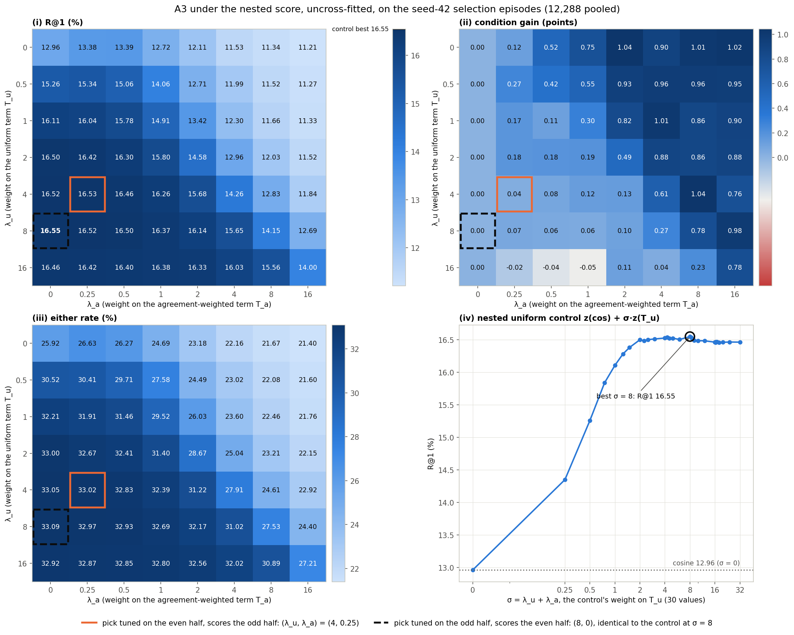
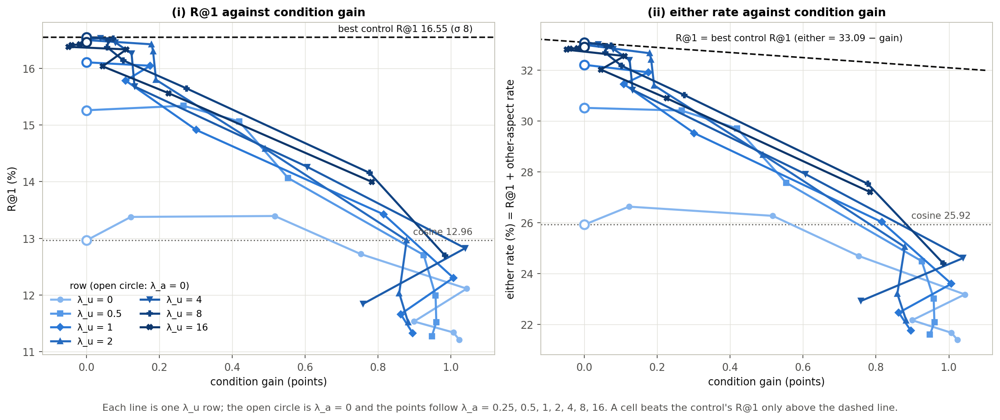
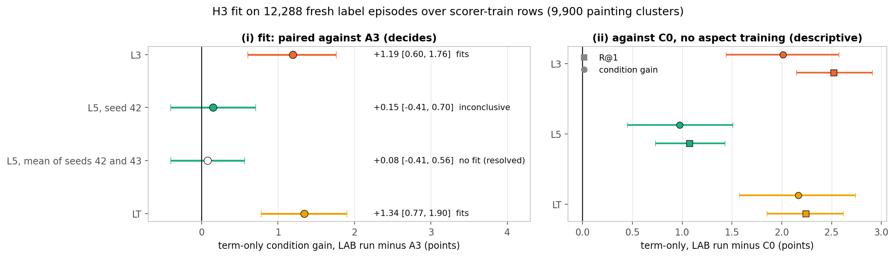
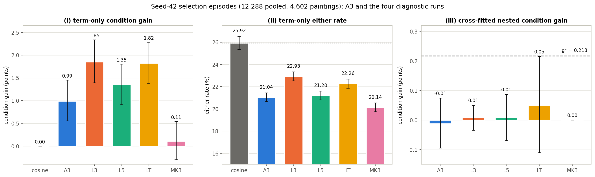
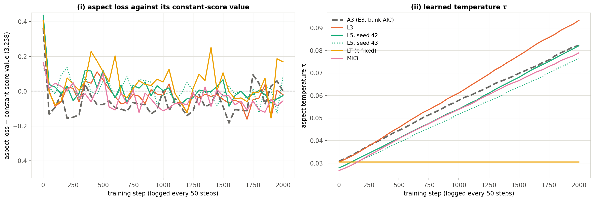

# Method-repair diagnostics: the nested score adds nothing on A3, label training lifts the term but not the ceiling, branch 3

Date: 2026-11-05 (sequence date of the method-repair diagnostics stage, CVPR plan spec §15; the runs took place on
2026-10-03). Experiment folder: `src/test/20261105_method_repair_diagnostics/` (pre-registration, scripts, folder log;
results local and gitignored). Figures, figure data and their build script:
`docs/reports/assets/2026-11-05_method_repair_diagnostics/`. Baselines beside every number: **backbone only** (CLIP
ViT-B/32 cosine), **the GO bar** (RCA, chosen in E1), **A3 under E3's score** (the old score of the same model), the
**nested uniform control** (the best fusion without the condition) and **C0** (the factor recipe without aspect
training).

## Summary

After E3's NO-GO the user chose to try a method repair, called **A′**: E3's factor model and agreement rule with a new
test-time score, the *nested score*, which keeps the uniform factor term next to the cosine and adds the
agreement-weighted term on top (E3's score fused the cosine with the weighted term alone). Before any A′ test, a diagnostics stage was to decide whether A′ should be
pre-registered on A3, sent to a training grid (H2) first, or stopped. Its rules were committed in eb58116 at 15:30:22,
before any script of the stage existed, and every rule below was applied mechanically by the stage's scripts.

**The decision is branch 3: stop the repair** (pre-registration §8, `results/decision.json`). Three readings led to it.

| Diagnostic (pre-registered rule) | Result [95% CI] | Baseline | Reading |
|---|---|---|---|
| **H1 pilot**: A3 under the cross-fitted nested score against its nested uniform control, seed-42 selection episodes; *promising* needs both margins ≥ 2.80 SE, *not promising* if either margin ≤ 0 | R@1 16.52 [16.18, 16.87], gain −0.01 [−0.10, 0.07]; m_R = −0.022 (SE 0.039), m_g = −0.012 (SE 0.043) | control R@1 16.55; cosine 12.96; RCA 13.38; A3 under E3's score 13.39, gain 0.52 | not promising |
| **H3 fit**: term-only condition gain of each label-trained run minus A3 on fresh label episodes; *fits* if the lower bound > 0 | L3 +1.19 [0.60, 1.76]; LT +1.34 [0.77, 1.90]; L5 +0.15 [−0.41, 0.70], after its seed-43 retrain +0.08 [−0.41, 0.56] | A3 0.90 [0.46, 1.34]; C0 0.08 [−0.36, 0.52] | L3 and LT fit, L5 no fit |
| **H3 ceiling**: cross-fitted nested gain of the best fitting run on seed 42; *sufficient* if ≥ g* | LT 0.05 [−0.11, 0.22] (L3 0.01) | g* = 0.218; A3's nested gain −0.01 | ceiling too low |
| **Matched-k** (decides only the H2 bank): label-free MK3 minus A3, term-only gain on seed 42; a lever if the lower bound > 0 | −0.88 [−1.44, −0.34] | A3 0.99 [0.56, 1.45] | not a lever |

- **The nested score did not use the condition.** Of the two tuning halves of the min-margin cross-fit, one picked the
  cell (8, 0), which is the control itself, and the other picked (4, 0.25), a quarter weight on the conditioned term.
  The nested score therefore recovered the control's R@1 (+3.13 [2.80, 3.45] over A3 under E3's score) and gave up
  E3's gain (−0.53 [−0.88, −0.20]). In A3's uncross-fitted 56-cell profile no cell with λ_a > 0 reached the
  control's best R@1 of 16.55 (the cell (8, 0) that reaches it is the control): wherever the uniform weight brought
  R@1 near that level, weight on the conditioned term cost at least as much "either" rate as it added gain (the one exception, (4, 0.25), sat 0.004 R@1 above its row's λ_a = 0 cell).
- **With A3's settings, label training raised the term's selection signal, and the nested score still did not use
  it.** Trained with A3's settings on the evaluation labels of scorer-train rows, the term reached a term-only gain of
  1.85 (L3) and 1.82 (LT) against A3's 0.99 on seed 42 (L3 minus A3 +0.86 [0.28, 1.42], roughly 1.3 to 2.4 times A3's
  gain). With A5's settings it did not: L5 did not fit (two-seed mean +0.08 [−0.41, 0.56] over A3 on fresh label
  episodes; +0.36 [−0.20, 0.93] on seed 42). The label-trained terms still ranked an aspect-sharing candidate first
  less often than the cosine (L3 either rate 22.93 against 25.92), and the nested cross-fit again kept almost no
  weight on them: nested gains 0.01 to 0.05 against g* 0.218, and nested R@1 within 0.1 of each run's own control.
- **Our reading** (§5, not pre-registered): at this training budget, label training was not sufficient to clear the
  ceiling. The pseudo-partitions are a measurable limit (labels gave the term its largest measured lift, +0.86 gain and
  +1.89 either over A3 with A3's settings), but removing that limit left the nested gain far below g*. The stage did not rank
  the remaining limits: the term's either-rate cost under the nested score, the objective and its training budget
  remain untested candidates.
- **What this does not show.** Branch 3 follows from pre-registered thresholds on development draws, for one model
  seed per run. It does not show that the task is unlearnable (on the aspect-episode spike's episodes, a different
  episode set, label probes reached a pooled 23.09 R@1 against CLIP's 11.13), nor that no other score, objective or
  training budget would work. Seed 45, reserved for a single A′ test, was never built.

## 1. Where this comes from

1. **E3 ended NO-GO** ([report](2026-11-01_aspect_factor_gonogo.md)). The picked run A3 (method A with aspect loss
   weight 3) reached R@1 13.76 against 13.53 for the cosine on the seed-43 test episodes, with a condition gain of 0.26
   [−0.04, 0.56], and lost 2.96 [2.64, 3.29] R@1 to its own uniform-weight control.
2. **E3's post-hoc analysis named two limits** (E3 §6.1, §6.3, §6.4; not pre-registered). Scored alone, A3's
   agreement-weighted term selected the conditioned aspect (term-only gain 0.97 [0.53, 1.41] on seed 43, 0.99
   [0.56, 1.45] on seed 42, about one point above SE and C0), but it ranked an aspect-sharing candidate first in only
   21.4% of rankings, against 27.1% for the cosine and 33.4% for the uniform control. And the pseudo-aspect loss stayed
   1.0% to 4.4% below its constant-score value throughout training. E3 §11 proposed a score that keeps the uniform
   term's aspect-finding and adds the weighted term on top, as a method change needing its own pre-registration.
3. **The user chose the repair before branch 3**, and an ARS methodology-focus review of the repair order
   ([report](2026-11-04_ars_repair_order_review.md)) returned Major Revision with twelve required changes (R1 to R12):
   commit outcome rules first, then run the H1 pilot and H3 in parallel; decide H3 on a paired term-only fit against
   A3; replace E3's pick criterion mean(R@1, gain) by a rule aligned with the binding R@1 comparison; state the ceiling
   bar in nested-score units (g*); score seed 45 once.
4. **Spec revision 3, §15** defined method A′ and the stage, and the stage's pre-registration
   (`src/test/20261105_method_repair_diagnostics/PREREGISTRATION.md`) carried R1 to R12. Both were committed in
   eb58116 (2026-10-03 15:30:22); the episode-seed ledger came with them.
5. **This stage** implemented the nested score (a6a4bb2), built two banks, trained four runs plus one seed-43 retrain,
   scored the H1 pilot and the H3 diagnostic, and applied the joint table (§2 to §6).

## 2. Method A′ and the stage

**Terms.** A *code* is an item's vector of 32 non-negative factors from E3's two small encoders on frozen CLIP
features. On an aspect episode (spec §5.1; E3 §3), the *agreement rule* turns the example pairs into factor weights w;
*T_a* is the agreement-weighted factor term Σ_l w_l q_l c_l and *T_u* the same term with uniform weights w = 1/32, so
T_u ignores the condition. *R@1* is the share of rankings whose target ranks strictly first, averaged over both
conditions and directions. The *other-aspect rate* is how often the other aspect's candidate ranks first. The
*condition gain* is R@1 minus the other-aspect rate; it is exactly 0 for any score that ignores the condition. The
*either rate* is R@1 plus the other-aspect rate, the share of rankings in which either aspect-sharing candidate ranks
first, so R@1 = (either + gain) / 2. *Term-only* means scoring with T_a alone (rank-equivalent to E3's fusion at
λ = ∞).

**Method A′** (spec §15) keeps method A's factor model and agreement rule and replaces the test-time score with the
*nested score*

  s = z(cos) + λ_u · z(T_u) + λ_a · z(T_a),

with z the per-episode z-score over the 13 candidates, λ_u ∈ {0, 0.5, 1, 2, 4, 8, 16} and λ_a ∈ {0, 0.25, 0.5, 1, 2,
4, 8, 16} (56 cells; λ_u = 0 is E3's one-dimensional fusion, (0, 0) is the cosine). Its comparator is the *nested
uniform control* z(cos) + σ · z(T_u) over the 30 distinct sums σ = λ_u + λ_a; it has the same weight budget, no
condition, and gain 0 by construction. **Min-margin cross-fitting:** the pooled episodes are split by anchor index
parity; on each tuning half the control picks σ by R@1, then the nested score picks the cell that maximises
min(R@1 minus that control's R@1 on the same half, condition gain), and each half's picks score the other half. Ties
go to the first cell in row-major order and the smallest σ. E3's criterion, which equals either/4 + 3·gain/4, could
prefer a cell that lost R@1 to the control; this rule scores any such cell below zero on the tuning half.

**Banks.** *LAB* is a bank of 65,536 aspect episodes built with E2's builder and rules from the **evaluation labels**
of the 183,694 scorer-train rows (emotion, style, genre; seed 1042; 1,000 sampled episodes validated). Reading
evaluation labels on training rows is forbidden for the method (spec §4 C2), so LAB is a diagnostic only, and its
checkpoints are excluded from every A′ or H2 candidate set by SHA-256 (`results/label_checkpoints.json`). *MK* is a
label-free bank at the evaluation aspects' granularity: k-means partitions with k = 8 on the GoEmotions affect
probabilities of the captions, k = 10 on CLIP caption features and k = 23 on CLIP image features (seed 2042, 65,536
episodes, validated), in place of E2's k = 64. Their adjusted mutual information (AMI) with the labels was computed
afterwards as a description only: affect8 with emotion 0.206, caption10 with genre 0.159, image23 with genre 0.418 and
with style 0.297.

**Runs.** Every run used E3's base recipe (E3's C0 factor recipe plus the pseudo-aspect episode loss with its swap
term; 32 episodes per step, β 0.3, 32 factors, 2,000 steps, model seed 42):

| Run | Bank | Settings | Role |
|---|---|---|---|
| L3 | LAB | A3's: λ_aspect 3, λ_swap 1 | H3 fit and ceiling |
| L5 | LAB | A5's: λ_aspect 1, λ_swap 1, aspect β 0 | H3 fit and ceiling |
| LT | LAB | L3 with the aspect temperature τ fixed at its starting value | H3 fit and ceiling |
| MK3 | MK | A3's | matched-k reading (label-free) |

Training took 569 to 622 s per run with a peak of 3.93 GiB on the local RTX 3090. No run had non-finite codes; L5's
seed-43 retrain had one dead caption factor, the others none.

**Pre-registered rules** (PREREGISTRATION.md; no addendum was made):

- **H1 pilot** (§6): A3, identified by the SHA-256 of E3's pick, under the cross-fitted nested score on the 12,288
  pooled seed-42 selection episodes (4,602 anchor paintings). m_R and m_g are the paired R@1 and gain differences
  against the nested uniform control; the SE of a paired difference is its 95% interval width / (2 × 1.96).
  *Promising* if m_R ≥ 2.80·SE_R and m_g ≥ 2.80·SE_g, *not promising* if m_R ≤ 0 or m_g ≤ 0, *inconclusive*
  otherwise. **g\*** = max(5.6·SE_R, 2.8·SE_g), fixed by the pilot before any H3 transfer number was read, is the
  nested gain a fitting label-trained run must reach (a gain g against a control with the same either rate gives an
  R@1 margin of g/2, hence the factor 2 on SE_R). Seven further models (A1, A2, A4, A5, A6, C0, SE) are descriptive.
- **H3 fit** (§7): on 12,288 fresh label episodes over scorer-train rows (seeds 3042 to 3044, 4,096 per aspect pair,
  9,900 anchor paintings), r = term-only gain of a LAB run minus A3's, paired. *Fits* if r's lower bound > 0, *no fit*
  if r ≤ 0, otherwise *inconclusive*, which triggers one retrain at model seed 43 decided on the mean of the two seeds'
  per-anchor arrays.
- **H3 ceiling** (§7): the best fitting run's cross-fitted nested gain on seed 42; *sufficient* if ≥ g\*.
- **Matched-k** (§7): MK3 minus A3, term-only gain on seed 42; a *granularity lever* if the lower bound > 0. It decides
  only which bank an H2 grid would use.
- **Joint table** (§8): a promising pilot leads to the A′ pre-registration on A3; an inconclusive or not-promising
  pilot leads to the pre-registered H2 grid if H3's ceiling is sufficient, and to branch 3 otherwise.
- **Uncertainty**: every interval is a 95% percentile interval of a bootstrap that resamples anchor paintings (5,000
  resamples, seed 42); paired comparisons bootstrap the per-anchor difference.

Every result file of the stage postdates eb58116: the earliest (the smoke LAB bank) was written at 15:52:25 and the
real LAB bank at 15:56:19.

## 3. H1 pilot: the nested score on E3's checkpoints (seed 42)

| Model | Nested R@1 [95% CI] | Nested gain [95% CI] | Control R@1 | m_R, nested − control R@1 [95% CI] | Either, nested / control | Nested − cosine R@1 | Picks (λ_u, λ_a), even; odd | Control σ, even; odd |
|---|---|---|---|---|---|---|---|---|
| **A3** (primary) | 16.52 [16.18, 16.87] | −0.01 [−0.10, 0.07] | 16.55 | −0.02 [−0.10, 0.05] | 33.06 / 33.09 | +3.56 [3.24, 3.88] | (4, 0.25); (8, 0) | 8; 8 |
| A1 | 16.23 [15.89, 16.56] | 0.00 [0.00, 0.00] | 16.32 | −0.09 [−0.17, −0.01] | 32.45 / 32.63 | +3.26 [2.95, 3.58] | (2, 0); (8, 0) | 2.5; 4.5 |
| A2 | 16.36 [16.02, 16.70] | −0.04 [−0.10, 0.01] | 16.42 | −0.07 [−0.12, −0.01] | 32.76 / 32.85 | +3.40 [3.08, 3.73] | (4, 0); (16, 0.5) | 4.5; 12 |
| A4 | 16.59 [16.25, 16.94] | 0.00 [0.00, 0.00] | 16.58 | +0.01 [−0.05, 0.06] | 33.18 / 33.17 | +3.63 [3.30, 3.96] | (8, 0); (8, 0) | 5; 8.25 |
| A5 | 16.43 [16.08, 16.78] | 0.00 [0.00, 0.00] | 16.35 | +0.08 [0.01, 0.15] | 32.87 / 32.71 | +3.47 [3.16, 3.79] | (4, 0); (4, 0) | 2.5; 4 |
| A6 | 16.61 [16.27, 16.96] | 0.00 [0.00, 0.00] | 16.59 | +0.02 [−0.07, 0.11] | 33.22 / 33.17 | +3.65 [3.33, 3.97] | (4, 0); (8, 0) | 12; 6 |
| C0 | 16.24 [15.90, 16.58] | 0.00 [0.00, 0.00] | 16.26 | −0.02 [−0.05, 0.01] | 32.49 / 32.53 | +3.28 [2.97, 3.58] | (4, 0); (4, 0) | 4.25; 4.25 |
| SE | 16.30 [15.96, 16.63] | 0.00 [0.00, 0.00] | 16.27 | +0.03 [−0.04, 0.10] | 32.59 / 32.54 | +3.33 [3.02, 3.66] | (16, 0); (16, 0) | 6; 12 |
| backbone only (cosine) | 12.96 [12.67, 13.26] | 0.00 | | | 25.92 | | | |
| GO bar (RCA, E1) | 13.38 [13.08, 13.69] | 0.10 [−0.08, 0.29] | | | | | | |
| A3 under E3's score (cross-fitted) | 13.39 [13.07, 13.71] | 0.52 [0.19, 0.87] | | | 26.27 | | | |

*"Even" is the pick tuned on even-indexed anchors, which scores the odd ones; "odd" the reverse. A cell with λ_a = 0
ignores the condition. The A3 row decides; the other model rows are descriptive.*

**The reading is not promising.** A3's nested score reached R@1 16.52 and a gain of −0.01, against 16.55 for its
nested uniform control: m_R = −0.022 [−0.099, 0.053] (SE_R 0.039) and m_g = −0.012 [−0.095, 0.074] (SE_g 0.043).
Both margins are at or below zero, which is the pre-registered *not promising*. The predicted chance that a fresh
seed-45 draw would have cleared zero, Φ(m / (2·SE) − 1.96) per metric, was 0.012 for R@1 and 0.018 for gain (0.0002
jointly if independent).

**Against the other baselines.** The nested score beat the cosine on R@1 by 3.56 [3.24, 3.88] and RCA by 3.14
[2.82, 3.47], but its gain was −0.01, so it would have failed spec §6's gain comparison against the cosine (gain
above 0) and did not beat RCA's gain (−0.12 [−0.32, 0.09]). Against A3 under E3's score on the same episodes, it raised
R@1 by 3.13 [2.80, 3.45] and lost 0.53 [0.20, 0.88] of gain (computed for this report, descriptive). On seed 42 the
nested control coincides with E3's uniform-weight control: both chose weight 8 on both halves, and their per-anchor
arrays are identical. A3's nested score beat C0's by 0.28 [0.01, 0.54] on R@1 with no gain difference (−0.01
[−0.10, 0.07]; descriptive). That difference comes from A3's stronger uniform term (control 16.55 against 16.26).

**The descriptive rows show the same pattern everywhere.** In 14 of the 16 tuning halves of the eight models the
min-margin rule chose λ_a = 0, so on the anchors those picks scored the nested score ignored the condition; only A3
(0.25 on one half) and A2 (0.5 on one half) kept any weight on T_a. Where a model's gain was 0 and its m_R was not (A1
−0.09, A5 +0.08), the nested score and the control had chosen different uniform weights on the same half.

*Figure 1. A3 under the nested score without cross-fitting, every cell scored on all 12,288 seed-42 episodes: (i) R@1,
(ii) condition gain (diverging scale, grey at 0), (iii) either rate, (iv) the nested uniform control's R@1 for each of
its 30 weights σ. The control's best pooled R@1 is 16.55 at σ = 8 (bold cell in (i), line on its colour bar, circle in
(iv)). The orange box is the pick tuned on the even half, (4, 0.25); the black dashed box is the pick tuned on the odd
half, (8, 0), which is the control at σ = 8. Row λ_u = 0 is E3's fusion; its cells at λ_a = 0.25 and 0.5 (13.38 and
13.39) bracket E3's cross-fitted 13.39.*

**Why the min-margin pick lands on the control** (from the stored 56-cell profile, recomputed and checked; the
per-half values were computed for this report from the same arrays).

1. **No cell beat the control's R@1 on the pooled episodes.** The highest R@1 of the 56 cells was 16.55, at (8, 0),
   the control itself. The pooled min-margin criterion therefore peaked at exactly 0, at the control.
2. **Weight on T_a bought gain only by losing either rate at least as fast, wherever R@1 was near the control's.**
   In the rows with λ_u ≥ 1, every step from λ_a = 0 to a larger λ_a lowered R@1, except (4, 0.25), which raised it by
   0.004 points. In those rows the either rate fell by more than the gain rose (for example λ_u = 4: +0.61 gain and
   −5.14 either at λ_a = 4). Weight on T_a did raise R@1 in rows λ_u = 0 (by up to 0.43) and λ_u = 0.5 (by 0.08 at
   λ_a = 0.25), but those rows stayed at least 1.2 points below the control (at most 15.34 against 16.55). Figure 2
   shows the trade-off: every row bends away from the line on which R@1 equals the control's.
3. **On the tuning halves the margins were within noise of zero.** On the even half, the control at σ = 8 reached
   16.573 and only two cells had a positive criterion: (4, 0.25) at R@1 16.581 and gain 0.10 (criterion 0.008) and
   (8, 0.5) (0.004). On the odd half no cell had a positive criterion and the best was (8, 0) at exactly 0. Applied out
   of sample to the odd anchors, the (4, 0.25) pick lost 0.045 R@1 and 0.024 gain to the control.
4. **The gain was available, at a price.** A3's largest gains in the profile were about 1 point (1.04 at (0, 2) and at
   (4, 8)), in line with its term-only gain of 0.99, but every cell with a gain above 0.5 had an R@1 of 14.26 or less.

*Figure 2. A3's 56 cells as seven λ_u rows, with λ_a growing along each line from the open circle (λ_a = 0). (i) R@1
against condition gain, with the control's best R@1 (dashed) and the cosine (dotted). (ii) Either rate against gain:
since R@1 = (either + gain) / 2, a cell matches the control's R@1 exactly on the dashed line either = 33.09 − gain, and
beats it only above that line. No cell lies above it.*

**The size of g\*.** Because the odd-tuned pick equals the control, the nested score and the control gave identical
per-anchor results on the 6,144 even anchors (asserted), and they differed little on the other half. The paired
differences were therefore small and tightly estimated: SE_R = 0.039, against the 0.168 that E3's paired R@1
half-width of 0.33 implied when the ARS panel estimated g\* at about 0.94 (5.6 × 0.168). g\* came out at
5.6 × 0.0389 = 0.218, the R@1 branch binding (2.8 × SE_g = 0.121). The rule was frozen before the pilot, so we kept
it. A low g\* only made the H2 grid easier to reach; §4 shows that the ceiling failed it anyway.

## 4. H3: label-trained runs, their fit, transfer and ceiling

### 4.1 Fit on fresh label episodes

| Run | Bank, settings | Term-only R@1 / gain on fresh label episodes [95% CI] | Fit: gain minus A3 [95% CI] | Reading | Minus C0, R@1 [95% CI] | Minus C0, gain [95% CI] | Aspect loss, last 10 logs (vs 3.258) | τ, first to last |
|---|---|---|---|---|---|---|---|---|
| C0 (no aspect training) | none | 10.34 / 0.08 [−0.36, 0.52] | | | | | | |
| A3 (E3's pick) | AIC (pseudo), λ_aspect 3 | 11.02 / 0.90 [0.46, 1.34] | reference | | | | 3.222 (1.1% below) | 0.031 to 0.082 |
| L3 | LAB, A3's settings | 12.86 / 2.09 [1.62, 2.56] | +1.19 [0.60, 1.76] | fits | +2.52 [2.15, 2.91] | +2.01 [1.44, 2.57] | 3.201 (1.8% below) | 0.030 to 0.093 |
| L5 | LAB, A5's settings (λ_aspect 1, β 0) | 11.41 / 1.05 [0.59, 1.50] | +0.15 [−0.41, 0.70] | inconclusive | +1.07 [0.73, 1.43] | +0.97 [0.45, 1.51] | 3.226 (1.0% below) | 0.028 to 0.082 |
| LT | LAB, A3's settings, τ fixed | 12.58 / 2.24 [1.78, 2.69] | +1.34 [0.77, 1.90] | fits | +2.24 [1.85, 2.62] | +2.16 [1.58, 2.74] | 3.270 (0.4% above) | 0.030 to 0.030 |
| L5, seed 43 | as L5, model seed 43 | 11.47 / 0.90 [0.45, 1.36] | 0.00 [−0.54, 0.56] | | | | 3.243 (0.5% below) | 0.027 to 0.076 |
| L5, mean of seeds 42 and 43 | | | +0.08 [−0.41, 0.56] | no fit (resolved) | | | | |
| MK3 | MK (label-free k-means), A3's settings | | | | | | 3.183 (2.3% below) | 0.027 to 0.079 |

*The fresh label episodes are new episodes over scorer-train rows (in distribution for the LAB runs, whose bank came
from the same labels and rows). The pre-registered columns are the fit, the reading and the minus-C0 differences; the
single-run summaries, the seed-43 row alone and MK3's loss were computed for this report. Loss: mean of the last 10
logged steps (1,550 to 2,000) against the constant-score value ln 13 + ln 2 = 3.258; A3's row is from E3's history.*

**L3 and LT fit; L5 did not.** Both runs with A3's settings, trained on true labels, beat A3's term-only gain on fresh
label episodes with lower bounds well above zero: L3 by 1.19 [0.60, 1.76] and LT by 1.34 [0.77, 1.90]. L5, with A5's
settings, was inconclusive at seed 42 (+0.15 [−0.41, 0.70]). Its pre-registered seed-43 retrain gained nothing over
A3 (0.00 [−0.54, 0.56]), and the two-seed mean gave +0.08 [−0.41, 0.56], which resolved L5 as *no fit*. Against C0, the
same recipe with no aspect training, all three LAB runs gained (L3 +2.01, LT +2.16, L5 +0.97 points of gain), and so
did A3 in absolute terms (0.90 against C0's 0.08; not tested as a pair).

*Figure 3. (i) The deciding fit: term-only condition gain of each LAB run minus A3's, paired on 12,288 fresh label
episodes (9,900 painting clusters); L5's two-seed mean is the open marker. (ii) The same runs minus C0, on R@1 (squares)
and gain (circles), descriptive.*

### 4.2 Transfer to the seed-42 selection episodes and the ceiling

| Run | Term-only R@1 | Term-only gain [95% CI] | Term-only either [95% CI] | Either minus cosine [95% CI] | Gain minus A3 [95% CI] | Nested R@1 | Nested gain [95% CI] | Nested picks (λ_u, λ_a), even; odd |
|---|---|---|---|---|---|---|---|---|
| backbone only (cosine) | 12.96 | 0.00 | 25.92 [25.34, 26.52] | | | | | |
| A3 | 11.02 | 0.99 [0.56, 1.45] | 21.04 [20.64, 21.44] | −4.88 [−5.52, −4.25] | reference | 16.52 | −0.01 [−0.10, 0.07] | (4, 0.25); (8, 0) |
| L3 | 12.39 | 1.85 [1.39, 2.33] | 22.93 [22.51, 23.34] | −2.99 [−3.60, −2.37] | +0.86 [0.28, 1.42] | 16.88 | 0.01 [−0.03, 0.05] | (16, 0.25); (2, 0) |
| L5 | 11.28 | 1.35 [0.91, 1.80] | 21.20 [20.80, 21.60] | −4.72 [−5.33, −4.09] | +0.36 [−0.20, 0.93] | 16.32 | 0.01 [−0.07, 0.09] | (16, 0.25); (8, 0.25) |
| LT | 12.04 | 1.82 [1.37, 2.28] | 22.26 [21.85, 22.67] | −3.66 [−4.30, −3.02] | +0.83 [0.27, 1.40] | 16.42 | 0.05 [−0.11, 0.22] | (2, 0); (4, 1) |
| MK3 | 10.12 | 0.11 [−0.30, 0.54] | 20.14 [19.74, 20.53] | −5.79 [−6.42, −5.16] | −0.88 [−1.44, −0.34] (matched-k) | 15.79 | 0.00 [0.00, 0.00] | (2, 0); (2, 0) |

*Pre-registered: the term-only and nested summaries of each run, the nested gains of the fitting runs (ceiling) and
the matched-k comparison. The "either minus cosine" and the LAB "gain minus A3" columns were computed for this report
from the stored per-anchor arrays and are descriptive. A3's term-only arrays were recomputed from its checkpoint and
equal E3's post-hoc arrays at λ = ∞; its nested row is the H1 pilot.*

**The ceiling was too low.** The best fitting run was LT, with a cross-fitted nested gain of 0.05 [−0.11, 0.22]
against g\* = 0.218; L3 reached 0.01. The H3 reading is therefore *ceiling too low*. Scored alone, the terms trained
with A3's settings carried more selection signal than A3's (L3 1.85 and LT 1.82 against 0.99; paired +0.86
[0.28, 1.42] and +0.83 [0.27, 1.40]), and L5's did not differ clearly (+0.36 [−0.20, 0.93]). Under the min-margin
cross-fit the nested score again put little weight on them: at least one half of every LAB run picked λ_a = 0 or 0.25
(L3 (16, 0.25) and (2, 0); L5 (16, 0.25) and (8, 0.25); LT (2, 0)), and only LT's other half, (4, 1), gave the term a
weight as large as 1. Against each run's own nested uniform control, the pre-registered comparator, the nested R@1
margins were −0.04 [−0.09, 0.02] (L3), −0.03 [−0.09, 0.04] (L5) and −0.09 [−0.24, 0.06] (LT), at gains of 0.01, 0.01
and 0.05 (computed for this report; h3.json does not store these controls, so the build script recomputed them from
the checkpoints).

**Matched granularity did not help.** MK3, trained on label-free k-means partitions with as many clusters as the
evaluation aspects have values, had a term-only gain of 0.11 [−0.30, 0.54], below A3's by 0.88 [0.34, 1.44]. The
granularity lever was absent, which would only have chosen E2's AIC bank for an H2 grid that the joint table did not
reach. The MK partitions carried about as much label information as E2's 64-cluster ones (AMI 0.206 against 0.2035
for affect with emotion, 0.418 against 0.397 for image with genre, 0.297 against 0.318 for image with style), so
matching the number of clusters changed little about what the partitions encode.

*Figure 4. Seed-42 selection episodes: (i) term-only condition gain, (ii) term-only either rate with the cosine's 25.92
as the dotted line, (iii) cross-fitted nested condition gain with g\* = 0.218 dashed. Bars are 95% painting-clustered
intervals.*

### 4.3 Training curves

*Figure 5. (i) Aspect loss minus its constant-score value 3.258, logged every 50 steps on that step's 32 training
episodes; (ii) the learned aspect temperature τ. E3's A3 (bank AIC) is the grey dashed reference.*

With true labels the aspect loss behaved as it did on pseudo-partitions: from step 100 on it stayed between 0.16
below and 0.25 above the constant-score value in every LAB run (E3's A3: 0.18 below to 0.09 above) and ended 1.8% (L3)
and 1.0% (L5) below it, against 1.1% for E3's A3 and 2.3% for the label-free MK3. τ rose almost linearly in every run that learned it (L3 0.030 to 0.093, L5 0.028 to 0.082,
MK3 0.027 to 0.079, E3's A3 0.031 to 0.082). LT held τ at 0.030 and ended 0.4% *above* the constant-score value, yet
it had the largest fit (+1.34 over A3). The training loss level therefore did not track the term's selection signal,
as the ARS review had noted for E3 (A3 ended 1.1% below and had the largest term-only gain). With τ fixed the term
still learned, although the loss ended above its reference.

## 5. What the numbers say about the mechanism

We separate what was measured from how we read it.

**Measured.**

1. **With A3's settings, true labels raised the agreement-weighted term's selection signal; with A5's they did not
   detectably.** On seed 42, the term-only gain was 1.85 for L3 and 1.82 for LT against 0.99 for A3 (paired +0.86
   [0.28, 1.42] and +0.83 [0.27, 1.40]; for L3 roughly 1.3 to 2.4 times A3's gain), and the term-only either rate rose
   by 1.89 [1.41, 2.38] and 1.22 [0.73, 1.71] (computed for this report). On fresh label episodes over the training
   rows the gains were 2.09 and 2.24 against 0.90. L5 (A5's settings) did not fit (two-seed mean +0.08 [−0.41, 0.56])
   and on seed 42 differed from A3 by +0.36 [−0.20, 0.93] in gain and +0.16 [−0.30, 0.62] in either rate. A3's and L3's
   gains changed little between the training rows and the selection rows (A3 0.90 and 0.99, L3 2.09 and 1.85;
   different episodes, not paired).
2. **Even with true labels the aspect loss stayed within 2% of its constant-score value** (L3 1.8% below, L5 1.0%,
   L5 seed 43 0.5%, LT 0.4% above), as on pseudo-partitions (E3: 1.0% to 4.4% below; MK3 2.3%). The loss level did not
   track the fit: LT ended above the reference and had the largest fit (§4.3).
3. **The label-trained term still found aspect-sharing candidates less often than the cosine.** Its term-only either
   rate was 2.99 [2.37, 3.60] points below the cosine for L3 and 3.66 for LT (A3 4.88, MK3 5.79), and about 10 points
   below the nested control's 33.09.
4. **The nested score did not convert the larger signal into gain.** The min-margin cross-fit chose λ_a ≤ 0.25 on at
   least one half of every run, the nested gains were 0.01 (L3), 0.01 (L5) and 0.05 (LT), against g\* 0.218 and A3's
   −0.01, and each run's nested R@1 stayed within 0.1 of its own nested control (−0.04, −0.03, −0.09).
5. **Granularity matched to the labels did not substitute for the labels.** MK3's term-only gain (0.11) was below
   A3's (−0.88 [−1.44, −0.34]).

**Our reading** (not pre-registered).

- **Label training was not sufficient to clear the ceiling at this training budget.** Replacing the
  pseudo-partitions by the evaluation labels, the most favourable partitions for these aspects, gave the term the
  largest lift we measured (+0.86 gain and +1.89 either over A3 on seed 42, with A3's settings), so the
  pseudo-partitions are a measurable limit. The lift did not reach the nested score. Since R@1 = (either + gain) / 2, a
  cell that kept the control's either rate of 33.09 would beat the control's R@1 with any positive gain; on A3's
  profile no cell with weight on T_a kept it (the highest was 33.02, at (4, 0.25)), near the control's R@1 each step of
  weight on T_a cost more either rate than it added gain (§3), and the LAB runs' cross-fits again settled on cells with
  near-zero gain.
- **The stage did not rank the remaining limits.** It varied neither the score, nor the objective, nor the training
  budget (2,000 steps of 32 episodes), so the term's either-rate cost under the nested score, the objective and its
  training budget remain untested candidates; the H2 grid that would have varied the budget was not run. The loss
  level cannot separate them: it stayed within 2% of its constant-score value in every run but did not track the fit
  (§4.3). A method that adds selection to aspect-finding would need a term that keeps the uniform term's either rate or
  a much larger gain than labels gave here, and this stage tested neither.
- **The rising τ did not cap the fit.** E3 §6.3 could not explain why τ rose in every run. Fixing it (LT) gave a fit
  at least as large as learning it (L3), with a loss above its reference. LT minus L3 was not tested as a pair, so
  this rests on two separate fits.

## 6. The decision

Under PREREGISTRATION §8, an H1 reading of *not promising* with an H3 reading of *ceiling too low* leads to **branch 3:
stop the repair** (`decide.py`, `results/decision.json`, written 2026-10-03 16:40:38 local time, with the SHA-256 of
both input files). The H2 grid (§9) is not run, no A′ is pre-registered, and seed 45 stays unbuilt. Spec §4 and §15
then point to the analysis and negative-results paper (branch 3), whose content E3 §11 listed; the venue and plan
are the user's decision.

**What the decision does not show.**

- It does not show that the aspect task is unlearnable. On the aspect-episode spike's episodes, a different episode
  set, label probes reached a pooled 23.09 R@1 against CLIP's 11.13, and the stage tested only E3's architecture, loss and agreement rule, with three
  label-trained settings and one matched-granularity setting.
- No A′ result on a test draw exists. The readings are thresholds on development draws (seed-42 selection episodes
  and fresh label episodes on training rows).
- Other test-time combinations and objectives remain untested, for example a learned combination of T_u and T_a, a
  term trained to keep the either rate, or the H2 settings (more episodes per step, longer training) that the grid
  would have tried.
- Each run is one model seed (two for L5), so run-to-run variance is not in the intervals.

## 7. Disclosures and deviations

1. **CUDA out-of-memory rerun of L3 and L5.** The day-1 launcher (`run_day1.sh`) started L3, L5, LT and MK3 in
   parallel on the 24 GB GPU. L3 and L5 crashed with CUDA out-of-memory errors in the backward pass after 158 of 2,000
   steps, the four processes together holding about 23 GiB; neither wrote a checkpoint, history or failure record
   (logs kept as `train_L3_seed42_oom_attempt1.log` and `train_L5_seed42_oom_attempt1.log`). LT and MK3 completed.
   L3 and L5 were rerun with identical settings, two at a time, as §4 allows after an infrastructure failure. No
   setting changed, and no H3 score existed when they were rerun (the H1 pilot result and the LT and MK3 histories
   did).
2. **L5's seed-43 retrain.** The first H3 pass (`h3_pass1_needs_seed43.json`) found L5 inconclusive and recorded
   `needs_seed43` with no H3 reading. L5 was retrained at model seed 43, as §7 prescribes, and the scorer was rerun.
   The two JSON files differ only in L5's seed-43 entry and resolved reading, the fit map, the H3 reading and the
   `needs_seed43` list (asserted on the full trees), so the second pass added only the seed-43 decision.
3. **g\* was far smaller than the ARS panel expected** (0.218 against about 0.94), because the odd-tuned nested pick
   equalled the control (§3). The rule was frozen; a smaller g\* lowered the bar for the H2 path and did not change
   the outcome.
4. **Development looks at seed 42.** The seed-42 selection episodes have now been scored by E1, E3's pick, E3's
   post-hoc fixed-λ profile and, in this stage, the H1 pilot (eight models and A3's 56-cell profile) and the H3
   transfer (four runs). The build script of this report recomputed the same scores deterministically (including the
   LAB runs' nested controls, which `score_h3.py` computed but did not store) and computed descriptive paired
   differences from those arrays; it trained no model and scored no new model or scorer.
5. **LAB reads evaluation labels on training rows**, which spec §4 C2 forbids for the method. LAB is a diagnostic of
   selection among trained aspects; its checkpoints (L3, L5 at seeds 42 and 43, LT) are listed by SHA-256 in
   `results/label_checkpoints.json`, and no setting was chosen from them.
6. **One model seed per run**, with seed 43 only for L5 under the §7 rule.
7. **H1's post-hoc origin.** The nested score came from E3's post-hoc fixed-λ profile, which included the spent
   seed-43 test draw (pre-registration §11).
8. **Seed 45 untouched.** No seed-45 episode file exists: a search of `/project/CoSiR`, `/project/CoSiR-archive` and
   `/tmp` found episode files only for seeds 42, 43 and 44, and the build script asserts that no file under `src/test/`
   carries "seed45" in its name. The episode-seed ledger lists seed 45 as reserved with no scoring. Val and held rows
   were not read.
9. **Provenance gaps against pre-registration §10**, which asks every result JSON to record the SHA-256 of the
   episode sets, banks, partition files and checkpoints it read and of its own script.
   - `build_record.json` stores the SHA-256 of every bank and partition file but not of the script that built them.
     `build_banks.py` was committed (b044925) 33 s after the build record was written and has not changed since.
   - `h3.json` records the SHA-256 of A3's checkpoint, L5's seed-43 checkpoint, the seed-42 and fresh episode sets and
     its script, but not of the seed-42 checkpoints it scored (L3, L5, LT, MK3), of C0's checkpoint or of
     `partitions_LAB.npz`. We re-hashed these files: L3 7b21cd81da5855c3, L5 95e4dd1d3754aa5b, LT db85fc88043ccc67,
     MK3 57747154f9c935d1, C0 7653caf0985b564d (`src/test/20261016_factor_learning_grid/checkpoints/C0_seed42.pt`)
     and `partitions_LAB.npz` c06cff38431ece08 (16-character prefixes). Each equals the value in the run's history,
     `label_checkpoints.json`, E1's `codes_provenance.json` or `build_record.json`, and recomputation from these files
     reproduced the stored arrays bit for bit (build script and final review).
   - The training histories and both scorer outputs carry their script SHA-256s, which match `train_runs.py` at
     c24464b, `score_pilot.py` at 83e7027 and `score_h3.py` at 3afe1bd.
10. **Arrays not stored.** `per_anchor_h3.npz` omits three sets of per-anchor arrays behind quoted numbers: L5's
    seed-43 term-only arrays on the fresh label episodes (behind the deciding two-seed mean), A3's seed-42 term-only
    arrays (behind the deciding matched-k comparison) and C0's term-only arrays on the fresh label episodes (behind the
    minus-C0 columns). Re-deriving them needs the checkpoints re-encoded; the build script and the final review both
    did so and matched the stored summaries exactly. The LAB runs' seed-42 nested controls are not stored either
    (§4.2).
11. **Smoke runs** (`results/smoke/`, `checkpoints/smoke/`) used A1's E3 smoke checkpoint and 50-step models to test
    the scripts; no smoke number entered a reading.
12. **No reading sits at a bootstrap boundary.** H1's reading depends only on the signs of the points m_R and m_g; the
    fit lower bounds of L3 and LT (0.60 and 0.77) and the matched-k upper bound (−0.34) are far from zero, and LT's
    nested gain (0.05) is a quarter of g\*.

## 8. Limits

- One development draw per diagnostic (seed 42 for transfer and the pilot, one fresh label draw for the fit), and one
  model seed per run (two for L5).
- One training budget for every run (2,000 steps of 32 episodes); the H2 grid that would have varied it was not run.
- H3 bounds selection among aspects represented in training; a fitting LAB run says nothing about transfer to unseen
  aspects (spec C2), and a non-fitting one says nothing about other architectures.
- The intervals resample anchor paintings, not example choices or training runs.
- The fresh label episodes reuse the scorer-train rows that the LAB runs trained on, so the fit measures fit to new
  episodes of the training rows, not generalisation to new paintings.
- The mechanism reading of §5 combines pre-registered and descriptive numbers and was not tested as such.

## Sources

- Pre-registration and scripts (`src/test/20261105_method_repair_diagnostics/`): `PREREGISTRATION.md` (eb58116),
  `common.py`, `build_banks.py` (b044925), `train_runs.py` and `run_day1.sh` (527e85e, c24464b), `score_pilot.py`
  (83e7027), `score_h3.py` (896029c, 3afe1bd), `decide.py` (f7245b2, c0d7879, e824ad1); the nested score and readings
  in `src/eval/aspect_nested.py` (a6a4bb2, tests 2dd43d5 and 4d9e714); `aspect_tau_fixed` in
  `src/train/train_factors.py` (4208c7b). Folder log: `20261105_method_repair_diagnostics_log.md`.
- Results (local, gitignored), `results/`: `build_record.json`, `pilot_seed42.json`, `per_anchor_pilot_seed42.npz`,
  `pilot.log`, `h3_pass1_needs_seed43.json`, `h3_pass1.log`, `h3.json`, `per_anchor_h3.npz`, `h3.log`,
  `decision.json`, `history_<run>_seed<seed>.json`, `train_*.log` (with the two `*_oom_attempt1.log`), `day1.log`,
  `label_checkpoints.json`.
- Context: E1's `src/test/20261030_aspect_baselines/results/per_anchor_seed42.npz`; E3's
  `src/test/20261101_aspect_factor_gonogo/results/` (`picked.json`, `select_seed42.json`,
  `per_anchor_select_seed42.npz`, `posthoc_lambda_profile_seed42.npz`, `history_A3_seed42.json`).
- Consistency check: `docs/reports/assets/2026-11-05_method_repair_diagnostics/build_figures.py` recomputed every
  summary and paired comparison quoted here with `src.eval.aspect_metrics`, asserted each against the stored JSON to
  1e-9, recomputed A3's 56-cell profile and every run's cross-fit from the checkpoints, rebuilt the fresh label
  episodes (SHA-256 checked), reapplied the readings, g\* and the joint decision, and checked the provenance hashes
  (522 checks). It reuses the stage's own nested-score, cross-fit and reading code, so it checks determinism and
  consistency, not correctness of that code. The independent re-derivation came from the final whole-branch review,
  which implemented its own z-score, nested combination and min-margin cross-fit and obtained bit-identical arrays
  and picks. The script's output `figure_data.json` holds every number of §3 and §4, with the descriptive ones marked
  `computed_here`.
- Spec: [CVPR publication plan](../../../superpowers/specs/2026-10-02-cosir-v2-cvpr-publication-plan-design.md) §4,
  §6 and §15; episode-seed ledger `docs/superpowers/episode_seed_ledger.md`.
- Earlier reports: [E3 go/no-go](2026-11-01_aspect_factor_gonogo.md) (§6.1, §6.3, §6.4, §11),
  [ARS repair-order review](2026-11-04_ars_repair_order_review.md), [E2](2026-10-31_pseudo_partitions.md),
  [E1](2026-10-30_aspect_baselines.md), [aspect-episode spike](2026-10-23_aspect_episode_spike.md).
