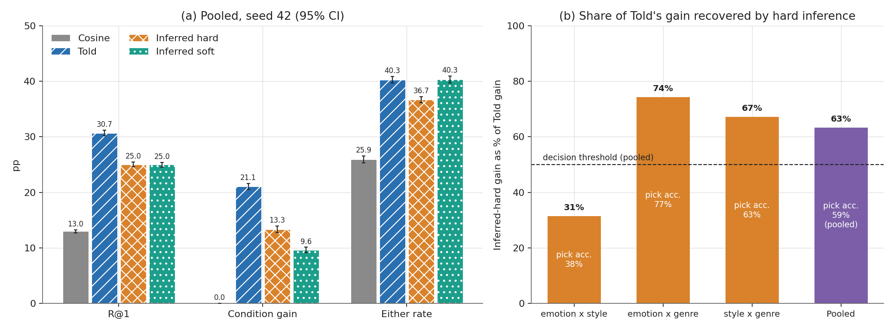
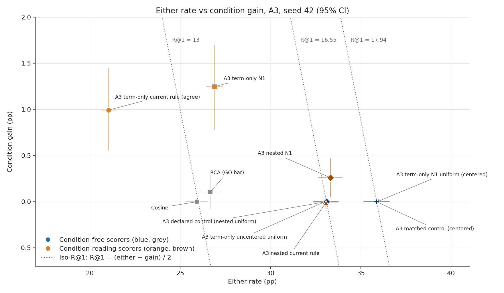
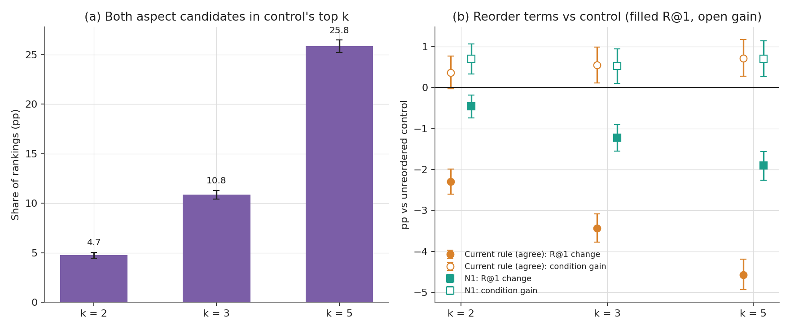
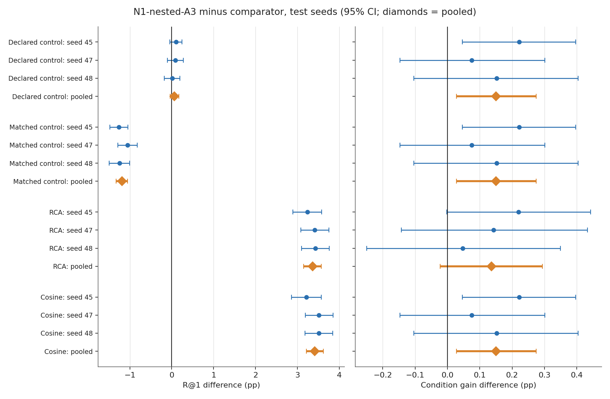
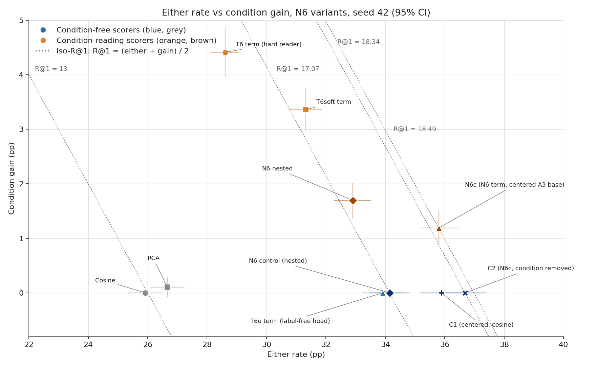

# Quick checks D0, N1, N2 and the follow-ups N6, N6c: the condition can now be read, but no configuration beats its matched condition-free control

## Summary

After the A′ repair ended at branch 3 and the Qwen3-VL-8B probe did not select the demonstrated aspect, the user asked
for more method attempts before the branch decision. We ran the three CPU checks of the approved spec
(`docs/superpowers/specs/2026-10-04-new-method-quick-checks-design.md`) on the seed-42 development episodes and then
followed the pre-committed decision table, with three addenda written overnight. Each addendum was committed before the new numbers that decide it were computed (the fresh-seed test outputs, N6's seed-42 check, N6c's comparison with C2); Addendum 1 was written from the final review's seed-42 matched-control numbers for A3, and Addendum 3's gate against C1 was already known to pass from the exploratory run. **No configuration passed against its matched condition-free control, and the one fresh-seed test
that ran was NO-GO.** The night still changed the picture in two ways: a label-free reader now selects the conditioned
aspect clearly (N6, term-only condition gain 4.41), and two new condition-free scores raised the bar every
conditioned scorer has to clear (17.94 and 18.34 R@1 on seed 42, against 16.55 for E3's control and 13.38 for the GO
bar RCA).

| Check (rule) | Result [95% CI] | Baseline | Reading |
|---|---|---|---|
| **D0**: label probes, aspect inferred from the 4+4 pairs vs told (`DECISION_RULE.md` §2) | Inferred-hard gain 13.33 [12.78, 13.91] | Told 21.06 [20.48, 21.61]; threshold 10.53 | close (63% of Told), but 31% on emotion × style |
| **N1**: centered agreement rule, nested on A3, vs declared control (§4) | R@1 +0.24 [0.09, 0.39], gain +0.26 [0.05, 0.47] | control 16.55 | passed: row 1 |
| N1 on fresh seeds 45, 47, 48 pooled (§6) | vs control R@1 +0.07 [−0.04, 0.17]; vs RCA gain +0.14 [−0.02, 0.29] | control 16.50; RCA 13.20 | **NO-GO** |
| N1 vs its **matched** control (`ADDENDUM_1.md`) | R@1 −1.15 [−1.38, −0.92] (seed 42); −1.19 [−1.33, −1.05] (test seeds) | matched 17.94; 17.75 | fails; table re-applied: row 2 |
| **N2**: rerank the control's top k by the condition term (§4) | every k loses R@1 (−0.46 to −4.58) | control 16.55 | fails |
| **N6**: heads on label-free partitions, D0's reader (`ADDENDUM_2_N6.md`) | R@1 +0.23 [−0.01, 0.47], gain +1.69 [1.35, 2.02] | its control 17.07 | fails by a hair |
| **N6c**: N6's term on the centered factor base, gate (`ADDENDUM_3_N6C.md`) | vs matched R@1 +0.15 [−0.06, 0.38], gain +1.19 [0.88, 1.50] | matched 18.34 | gate fails; no test |

What this does not show: that the condition cannot help. The numbers say that at the current accuracy of the readers,
every scorer that reads the condition loses aspect-finding about as fast as it gains selection once it is fused with
the strongest condition-free score (the point estimates of the net R@1 margins are positive, +0.15 and +0.23, but too small for the pass rules to confirm) (Section 8).

## 1. Where this line of work stands

1. **E3** (method A, a shared sparse image-text factor basis read by an agreement rule) ended NO-GO: the picked run A3
   reached R@1 13.76 on fresh seed-43 episodes with a condition gain of 0.26 [−0.04, 0.56], while its own uniform-weight
   control reached 16.72 ([report](2026-11-01_aspect_factor_gonogo.md)).
2. **A′** (the nested score that keeps the uniform term and adds the conditioned term) stopped at its pre-registered
   branch 3: on A3, R@1 16.52 against its control 16.55, gain −0.01
   ([report](2026-11-05_method_repair_diagnostics.md)).
3. **Qwen3-VL-8B** given the examples in context raised R@1 by 1.07 [0.17, 1.93] over cosine but its gain was 0.21
   [−0.51, 0.94] (`src/test/20261106_mllm_probe_8b/`).
4. Six new candidates were drafted and checked against the literature with ARS (`src/test/20261107_new_method_candidates/`);
   the synthesis ordered a diagnostic D0, then N1 and N2, then N6 if D0 passed. The spec of this report fixed the three
   checks and their decision table; the user approved it on 2026-10-04 and set the D0 threshold.

## 2. Task, metrics and baselines

An *aspect episode* (spec §1) gives a query (an image or a caption of an artwork) a condition made of 4 *support pairs*
(cross-item image and caption pairs sharing a value of the wanted aspect, never the query's own value) and 4
*contrast pairs* for a second aspect. The system ranks 13 candidates of the other modality: p_A shares the query's value
of A, p_B its value of B, and 11 negatives share neither; swapping supports and contrasts must move p_B to the top.
The aspects are emotion, style and genre (three aspect pairs, pooled).

- **R@1**: the target ranks strictly first. **Other-aspect rate**: the other aspect's candidate ranks first.
- **Condition gain** = R@1 − other-aspect rate; exactly 0 for any scorer that ignores the condition.
- **Either rate** = R@1 + other-aspect rate, so **R@1 = (either + gain) / 2**.
- 95% intervals resample anchor paintings (5,000 resamples, seed 42); comparisons are paired.
- **Condition-free control**: the same score with the condition removed. A **matched** control removes only the
  condition and keeps every other ingredient of the score (Section 5 explains why the distinction mattered).
- **Baselines** on seed 42 (12,288 episodes from 4,602 anchor paintings): cosine of CLIP ViT-B/32 features, R@1 12.96
  (either 25.92); RCA, the best of nine raw-feature pair-metric baselines and the project's GO bar, R@1 13.38, gain 0.10
  [−0.08, 0.29] ([E1](2026-10-30_aspect_baselines.md)).

## 3. How the rules were set and changed

Each addendum was committed before the new numbers that decide it were computed (the fresh-seed test outputs, N6's seed-42 check, N6c's comparison with C2); Addendum 1 was written from the final review's seed-42 matched-control numbers for A3, and Addendum 3's gate against C1 was already known to pass from the exploratory run. The times are commit times on 2026-10-04.

| Commit | Time | What it fixed |
|---|---|---|
| 7e50f18 `DECISION_RULE.md` | 03:28 | Spec §5 with the D0 threshold (Inferred keeps ≥ half of Told's gain), the pass rule (R@1 and gain lower bounds against the own control above 0), stop rules, the GO rule for seeds 45, 47, 48 |
| bc36e72 runner | 03:49 | seed-42 run at 03:57: row 1 |
| 00f2b32 `TEST_CONFIG.md` | 03:59 | N1-nested-A3 fixed before any test seed existed |
| 812cab2 `ADDENDUM_1.md` | 04:13 | matched control for N1; table re-applied; matched control added to GO; step after a NO-GO. The test had run at 04:11 under the old rule; its outputs were unread |
| 223e04b `ADDENDUM_2_N6.md` | 04:17 | N6, before any N6 code |
| 8ff2fc5 `ADDENDUM_3_N6C.md` | 04:35 | N6c, after an exploratory look at seed 42; gate against C1 and the never-computed C2, then test |

The code was written by subagents from plans with complete code and reviewed per task (each decisive runner by a reviewer
that re-derived its outputs on smoke data); a final whole-branch review re-derived every seed-42 number from the raw
inputs with independent code and found the confounded control of Section 5.

## 4. D0: the aspect can be read from the pairs when items are well represented

D0 represents every item by label-probe posteriors: one logistic regression per aspect and modality on 60,000
scorer-train rows (rows with an unlabelled aspect dropped: emotion 53,395, style 60,000, genre 48,779 rows). *Told*
scores the dot product on the conditioned aspect; *Inferred* picks the aspect whose posteriors agree most within the
support pairs minus within the contrast pairs (*hard*), or weights the aspects by that difference (*soft*). D0 reads
evaluation labels on training rows, so it is a diagnostic and never a method.

*Figure 1. (a) Seed-42 R@1, condition gain and either rate of cosine, Told, Inferred hard and Inferred soft. (b)
Inferred-hard gain as a share of Told's gain per aspect pair and pooled; hard-pick accuracy printed in the bars; dashed
line: the pooled 50% threshold.*

| Scorer | R@1 | Gain | Either |
|---|---|---|---|
| cosine | 12.96 [12.67, 13.26] | 0 | 25.92 |
| Told | 30.66 [30.16, 31.16] | 21.06 [20.48, 21.61] | 40.27 |
| Inferred, hard | 25.02 [24.58, 25.48] | 13.33 [12.78, 13.91] | 36.70 |
| Inferred, soft | 24.97 [24.52, 25.41] | 9.62 [9.12, 10.11] | 40.31 |

Inferred-hard kept 63% of Told's gain (threshold 50%), so D0 read **close**: with clean aspect posteriors, four
example pairs are enough to name the aspect most of the time (hard-pick accuracy 59%, chance 33%). The reading is
uneven. On emotion × style the reader kept 31% of Told's gain with a pick accuracy of 38%; on emotion × genre 74% (77%)
and on style × genre 67% (63%). Emotion and style posteriors are weak in opposite modalities (emotion probe accuracy
38.9% from images, style 25.4% from captions), so within-pair agreement separates them poorly.

## 5. N1: the centered rule passed its declared control, but the pass came from centering

N1 replaces the agreement rule's uncentered moment by a covariance: factor l gets weight max(cov_S(l) − cov_C(l), 0),
where cov_S is the covariance across the four support pairs between image and caption codes, and the score centres the
query on the episode's 8 example items of its modality. We scored it alone and inside A′'s nested score
z(cos) + λ_u·z(T_u) + λ_a·z(T_N1), on A3, C0 and SE (L3 and LT, trained on labels, as diagnostics).

Alone on A3, N1 found aspect-sharing candidates more often than the current rule (either 26.91 against 21.04; cosine
25.92) at a similar gain (1.25 against 0.99; difference +0.25 [−0.27, 0.77], so N1 is not shown to select better). In
the nested score N1-nested-A3 reached R@1 16.79 against its declared control 16.55: +0.24 [0.09, 0.39], gain +0.26
[0.05, 0.47]. It was the only configuration that passed, so the table returned **row 1**. Diagonal KISSME on the same
codes (the closest published rule) found aspect candidates rarely (either 15.7) and added no gain in the nested score.

**The declared control was confounded.** It is z(cos) + σ·z(T_u) with the *uncentered* uniform term, so it removes two
things at once: the condition and N1's centering. N1's own condition-removed term, the centered uniform term
T_N1u, is by itself the strongest condition-free scorer we have measured (term-only R@1 17.95, either 35.90). The
matched control of `ADDENDUM_1.md` (the same nested family with T_N1u in place of T_N1, the cell picked by R@1) reached
17.94 [17.57, 18.30] on seed 42, and N1-nested-A3 fell 1.15 [0.92, 1.38] below it. C0 and SE did the same (−1.24 and
−1.60). With matched controls no N1 configuration passes, and the re-applied table gives **row 2**.

*Figure 2. Either rate against condition gain for A3's scorers on seed 42. Dotted lines are constant R@1. The nested N1
point sits just right of its declared control's line (16.79 against 16.55); the condition-free centered scorers sit on a higher line (17.94).*

Why centering helps is not tested. Subtracting the mean of the 8 example items removes what the episode's examples share, and by construction those examples never show the query's values, so the term also penalises candidates that resemble values the target lacks. Both conditions use the same 8 items, so the score uses the examples but not which of them are supports. A probe by the final reviewer (seed 42, decides nothing) found that centering on the global selection-row mean gives 17.14 and on 8 random items 16.85, against 17.95 on the episode's own examples: about 0.8 of the 1.4-point lift needs the episode's own examples, so part of it may come from the value-disjoint episode construction.

## 6. N2: reranking a short list does not protect the either rate

N2 ranks by A3's condition-free control and reorders only its top k by a condition term. Both aspect candidates were
in the control's top 2, 3 and 5 in 4.74, 10.85 and 25.84% of rankings. Every cascade lost R@1 to the control while
adding a little gain: with the current rule −2.29, −3.44, −4.58 R@1 and +0.36, +0.55, +0.72 gain; with N1's term
−0.46, −1.23, −1.91 and +0.71, +0.53, +0.70. The reorder term promotes negatives inside the short list often enough to
cost more first places than it moves to the target. The spec's remark that the both-in-top-k share caps N2's gain is
wrong: half of N2-3-agree's gain came from rankings that did not hold both aspect candidates in the top 3.

*Figure 3. (a) Share of rankings with both aspect candidates in the control's top k. (b) R@1 change and gain of the two
reorder terms against the unreordered control.*

## 7. The fresh-seed test of N1-nested-A3 was NO-GO

Following row 1, we built seeds 45, 47 and 48 (4,096 episodes per aspect pair each; 15 distinct episode hashes across
seeds 42, 43, 45, 47 and 48) and scored the fixed configuration with its cross-fit rerun on each seed.

| Pooled, 36,864 episodes | R@1 | Gain | Either |
|---|---|---|---|
| N1-nested-A3 | 16.57 [16.33, 16.80] | 0.15 [0.03, 0.27] | 32.98 |
| declared control | 16.50 [16.27, 16.73] | 0 | 33.00 |
| matched control | 17.75 [17.52, 17.98] | 0 | 35.51 |
| cosine | 13.15 [12.97, 13.33] | 0 | 26.30 |
| RCA | 13.20 [13.02, 13.39] | 0.01 [−0.08, 0.11] | 26.39 |

Against the declared control R@1 rose by +0.07 [−0.04, 0.17]; against RCA the gain was +0.14 [−0.02, 0.29]; both bounds
include 0, so the test was NO-GO under `DECISION_RULE.md` §6 as committed, and more clearly so against the matched
control (−1.19 [−1.33, −1.05] R@1). The seed-42 gain of 0.26 roughly halved on fresh episodes (0.22, 0.08, 0.15 per
seed), the usual shrinkage of a pick made on one draw.

*Figure 4. N1-nested-A3 minus each comparator on seeds 45, 47, 48 and pooled (diamonds).*

## 8. N6 reads the condition; N6 and N6c still miss their matched controls

**N6** trains cross-modal heads on E2's three label-free k-means partitions (affect clusters of GoEmotions caption
probabilities, CLIP image clusters, CLIP caption clusters; 64 clusters each; no evaluation label) (no ArtELingo label is used, but the partitions are aspect-shaped: GoEmotions is an emotion classifier trained on external labels, and the image clusters carry genre and style, E2 AMI 0.397 and 0.318), represents each item
by its head posteriors and reads the condition with D0's hard rule over the three partitions. Its condition-free version T_6u averages the three heads.

| Seed 42 | R@1 | Gain | Either |
|---|---|---|---|
| N6 term alone (hard reader) | 16.51 [16.15, 16.87] | **4.41 [3.96, 4.87]** | 28.61 |
| N6 condition-free term | 16.96 [16.60, 17.30] | 0 | 33.91 |
| N6-nested | 17.30 [16.94, 17.66] | 1.69 [1.35, 2.02] | 32.91 |
| its control z(cos) + σ·z(T_6u) | 17.07 [16.73, 17.42] | 0 | 34.15 |

The term's gain of 4.41 is the largest label-free gain measured in the project. The strongest earlier label-free term on these episodes was N1 on A3 (1.25; the agreement rule 0.99), factors trained on the evaluation labels reached 3.20 with N1's rule (L3; 1.85 with the agreement rule), and Qwen3-VL-8B reached 0.21. The reader picked the affect partition in 59 and 68% of emotion-conditioned
rankings and the image partition in 54 to 62% of style- and genre-conditioned ones, except under the style condition of
style × genre, where it picked affect (58%) over image (17%): the image clusters carry genre more than style (E2 AMI
0.397 against 0.318), so there the contrast pairs agree more on image clusters than the supports do (the support pairs of that condition also differ on genre by construction). Δ for the affect partition averages about 0 everywhere, while Δ for the image partition swings by ±0.02 to 0.03, so many affect picks mean that the image and caption partitions look contrast-like rather than that affect looks support-like. N6-nested beat its
control on gain but not reliably on R@1 (+0.23 [−0.01, 0.47]; the lower bound stayed at or below 0 in all of bootstrap
seeds 0 to 99), so N6 failed its pass and, by `ADDENDUM_2_N6.md` §4, the night's method work should have ended here.

**N6c** came from an exploratory look at seed 42: N6's term on the centered factor base reached R@1 18.49 against that
base's 17.94 (+0.55 [0.31, 0.79]). We committed it as a new configuration with a gate against two controls: C1, the base alone, whose comparison the exploratory run had already shown (+0.55), and C2, N6c with the condition removed (N6's averaged heads in place of its reader), which had never been computed.
The configuration and C1 reproduced the exploratory numbers exactly. C2 reached 18.34 [17.97, 18.70], and N6c beat it by
only +0.15 [−0.06, 0.38] R@1, so the gate failed and no test seed was scored.

*Figure 5. Either rate against condition gain for the N6 scorers on seed 42; the reading scorers (orange) sit up and to
the left of the condition-free ones (blue); N6c sits just right of C2's constant-R@1 line (18.49 against 18.34), a margin of +0.15 [−0.06, 0.38] that the interval cannot confirm.*

## 9. What the numbers say

- **The condition can be read.** D0 and N6 show that four example pairs identify the aspect when items carry aspect-shaped blocks: label probes keep 63% of the told gain, and label-free heads give a term-only gain of 4.41 against 1.25 for the best factor rule. By the spec's pre-declared reading of D0 this points at the representation as the factor rule's limit; we did not run D0's reader on the factor codes, so reader and representation are not separated for the factors.
- **The either-rate cost is the binding constraint.** Since R@1 = (either + gain) / 2, a conditioned score beats its
  matched control only if it gains more selection than it loses aspect-finding. N6c gained 1.19 and lost 0.88 either
  (net +0.15 R@1); N6-nested gained 1.69 and lost 1.23 (net +0.23); N1-nested on fresh seeds gained 0.15 and lost 0.02
  against a control that was itself 1.26 below its matched one. Our reading (not tested): every reader picks the wrong aspect often enough
  (D0's hard pick misses 41% of the time) that the conditioned term promotes a non-target in a sizeable share of rankings.
- **The condition-free bar rose.** Centering on the episode's examples lifted the best label-free condition-free score from 16.55 to 17.94 on seed 42 (17.75 pooled on seeds 45, 47, 48) and, with the averaged heads, to 18.34 (seed 42 only; RCA 13.38). These scores use the examples but not the condition. Before they count as a finding of their own, a control centred on non-episode items must show how much of the lift depends on the value-disjoint episode construction; any future method must beat them.
- **Where selection works.** In D0, N6 and N6c the gain was largest on emotion × genre and smallest on emotion × style,
  matching D0's pick accuracies; the style × genre style condition is the predicted weak spot of the image partition.

## 10. Decision and what is open

By the committed rules: N1 and N2 failed, D0 read close, N6 failed its pass and N6c its gate, and the night's last rule
(`ADDENDUM_3_N6C.md` §5) sends the result to the user with nothing further built. The branch decision remains the
user's. Two routes the numbers leave open, neither started:

1. **A reader that loses less aspect-finding**: N6's reader with a better aspect pick on emotion × style (its weakest
   pair) or a soft weighting tuned for either rate; any such variant needs its own pre-registration, a matched control
   and fresh seeds beyond 48.
2. **Branch 3** with tonight's analysis: D0 (the reading works when the representation has aspect blocks), the matched
   control lesson, N6's gain and the new condition-free baselines.

## 11. Disclosures and deviations

- **Confounded control in the committed rule.** `DECISION_RULE.md` gave N1 the uncentered control, against the
  synthesis's advice to use N1's own centered score with uniform weights; the final review caught it. `ADDENDUM_1.md`
  fixed it after the fresh-seed test had run (at 04:11) and before its outputs were read (04:13); the test was NO-GO under
  the old rule too.
- **Steps the user had not pre-approved.** The user asked for full automation overnight. The controller (a) adopted the
  matched control and the step after a NO-GO (`ADDENDUM_1.md` R4), (b) built N6 (spec row 2), and (c) overrode its own
  "no further method overnight" line for N6c. Each ruling is in `ADDENDUM_*.md` and the run ledger.
- **Order of Addendum 1 R2 and Addendum 2.** R2 said the seed-42 re-application would run before any further step, but Addendum 2 (N6) was committed at 04:17, before R2's computation finished (04:20). It made no difference: R4 sends a NO-GO to row 2 whatever R2 finds, and C0's and SE's N1 gain lower bounds (−0.16, −0.34) mean they could not pass against any condition-free control.
- **Two small slips in committed rule files** (left unedited as records): `ADDENDUM_1.md` §3 quotes N1's term-only gain difference as [−0.27, 0.78], the stored value is [−0.275, 0.768]; `ADDENDUM_3_N6C.md` §4 calls A3's matched control 'T_N1u-only', it is the (T_u, T_N1u) family.
- **Dropped synthesis gate.** The approved spec dropped the synthesis's gate before building test seeds (both seed-42 margins at least 2.8 SE); N1-nested-A3's gain margin was about 2.4 SE, so under that gate seeds 45, 47 and 48 would not have been built.
- **Multiplicity.** Nine configurations were eligible at the seed-42 check; seeds 45, 47, 48 tested one of them (N1);
  N6 and N6c were later candidates on the same development seed. N6c was found by looking at seed-42 results; its
  seed-42 numbers are exploratory, and its gate failed before any test.
- **Repeated gain checks.** Cosine and every control have gain exactly 0, so "gain against cosine", "against C1" and
  "against C2" are one number, not three confirmations.
- **D0's descriptive reference** in `ADDENDUM_2_N6.md` §2 was not computed inside the N6 runner; the D0 numbers quoted
  beside N6 come from the same seed-42 episodes in `checks_seed42.json`.
- **"Anchor-parity halves"** are episode-index parity halves (as in E3 and A′); an anchor painting can fall in both.
  Intervals cluster anchor paintings only; candidate and example paintings recur across episodes, so they may be a
  little narrow (project convention).
- **Probe sizes** fell below 60,000 rows where aspects are unlabelled (Section 4).

## Sources

- Spec: `docs/superpowers/specs/2026-10-04-new-method-quick-checks-design.md`; rules and log:
  `src/test/20261108_new_method_quick_checks/` (`DECISION_RULE.md`, `TEST_CONFIG.md`, `ADDENDUM_1.md`,
  `ADDENDUM_2_N6.md`, `ADDENDUM_3_N6C.md`, `20261108_new_method_quick_checks_log.md`).
- Code: `src/eval/aspect_quick_checks.py`, `src/test/test_aspect_quick_checks.py` (28 unit tests at the N6c commit), runners
  `run_checks.py`, `test_seeds.py`, `matched_controls.py`, `run_n6.py`, `explore_n6.py`, `run_n6c.py`; plans
  `docs/superpowers/plans/2026-10-04-*quick-checks*.md`.
- Results (gitignored): `src/test/20261108_new_method_quick_checks/results/` (`checks_seed42.*`, `decision.json`,
  `test_seeds.*`, `addendum1.*`, `n6_seed42.*`, `explore_n6.*`, `n6c_gate.*`, per-anchor arrays).
- Figures: `docs/reports/assets/2026-11-08_new_method_quick_checks/` (`make_figures.py`).
- Earlier reports: [E1](2026-10-30_aspect_baselines.md), [E2](2026-10-31_pseudo_partitions.md),
  [E3](2026-11-01_aspect_factor_gonogo.md), [A′](2026-11-05_method_repair_diagnostics.md),
  [aspect-episode spike](2026-10-23_aspect_episode_spike.md); candidates and ARS literature check
  `src/test/20261107_new_method_candidates/`.
