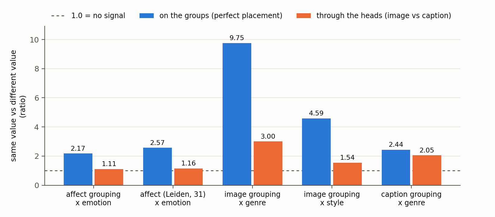
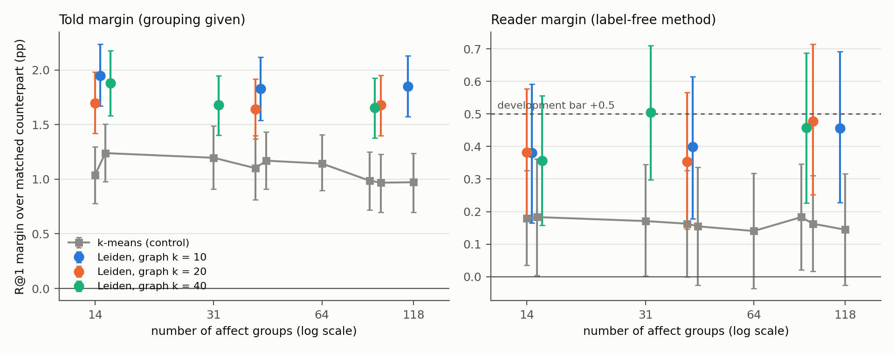
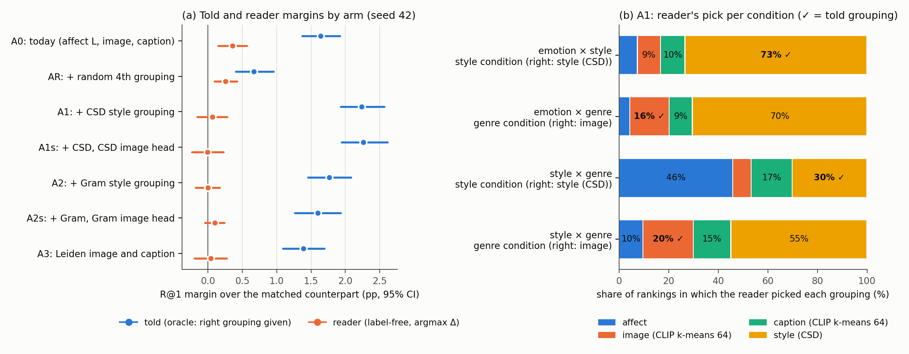

# Pseudo-aspect groupings: how good they are, Leiden communities, and the first redesign steps (DRAFT)

**Status: draft, exploratory.** Written 2026-10-05 from a working session; Sections 7 to 10 added the same evening
(redesign research, step 0 and step 1). Every number is on the seed-42 development episodes (12,288 episodes, 4,602
anchor paintings), and none of it decides the GO. Intervals are 95% and resample anchor paintings (5,000 resamples). Run
folders: `src/test/20261110_partition_profile/`, `src/test/20261111_community_told_oracle/` and
`src/test/20261112_community_sweep/` (commit a6287af); `src/test/20261114_grouping_research/` (literature),
`src/test/20261115_grouping_step0_checks/` and `src/test/20261116_grouping_step1_style/` (result files gitignored).
Figures and their data: `docs/reports/assets/2026-11-12_partition_quality_leiden_communities/`.

## Summary

The stage report of 4 October ended with a diagnosis: the label-free reader picks the right pseudo-aspect grouping in
only 52.4% of rankings, so its margin over its matched condition-free counterpart is +0.14 [−0.04, 0.32] R@1, while the
same scorer told the right grouping reaches +1.14 [0.90, 1.41]. We asked what the groupings themselves are worth. A
profile against the evaluation labels showed that the affect grouping (k-means, 64 clusters on GoEmotions probabilities)
does carry emotion as clusters, but almost none of that signal survives the classifiers that place a lone image or
caption into a cluster (same-emotion pairs agree 2.17 times as often as different-emotion pairs on the clusters, 1.11
times through the classifiers). Replacing the affect k-means with Leiden communities on the same signal raised the told
margin to +1.64 [1.37, 1.92] and the reader margin to +0.35 [0.15, 0.57]; k-means with the same number of groups did not
move (told +1.10). A 3 × 3 sweep of the Leiden graph's k and resolution (14 to 118 groups) found Leiden ahead of k-means at
every matched count (told +0.48 to +0.88) and margins that barely depend on the settings; the picked cell reached a reader
margin of +0.50 [0.30, 0.71], the development bar. The discussion then turned to the groupings as a component: their
number of groups was inherited and never tested, every grouping uses the same number, nobody knew whether they were good
before they were used, they are fixed, and their groups do not interact. We decided to redesign that component before
returning to the bars, the reader and the next experiments.

The redesign began with a literature run (six scans and a synthesis) that ranked four designs by where the sources are
merged and recommended the cheapest, one grouping per source (P0), as the first and control design. Three label-light
checks followed (step 0). A label-free placeability score ranked Leiden above k-means at every matched count, as the told
margins do, and was adopted for comparisons at one group count; counting sibling groups as related lifted the reader and
its condition-free counterpart by the same half point, so the margin from reading stayed at +0.35; and the image head
reaches half of the small painting-level ceiling for affect. Step 1 added a style grouping built from CSD style
embeddings (hand-matched) or VGG-19 Gram statistics (generic). CSD gave the first grouping that matches style at least as
well as genre and raised the told margin to +2.23 [1.93, 2.56], the highest so far, with a style × genre gain of +1.00
[0.49, 1.51]; but the label-free reader fell to +0.06 [−0.15, 0.28], below a random fourth grouping (+0.25), because the
extra grouping lifts the matched comparators and the reader picks CSD for genre conditions too. No arm reached the
development bar. Of everything tried in P0, the CSD style grouping is the only change worth continuing, and only together
with a reader fix (Section 10).

## 1. Where this started

The stage report (`docs/reports/stage/2026-10-04_aspect_conditioned_similarity_methods.md`, Sections 10, 11 and 14) and
the handoff (`docs/superpowers/handoffs/2026-10-04-fix-the-reader-handoff.md`) placed the block in the reader: the heads of
N6, trained without ArtELingo labels, beat their matched counterpart by +1.14 when told the right grouping and by +0.14
when the reader chose. The plan was to calibrate or learn the reader, add a grouping that separates style from genre, and
test once on fresh seeds 49 to 51.

A design question and answer on the stage report (commit 7b26631, Section 3 of that report) traced how the buddy line
left the pipeline. The Stage 2 topic mapper was dropped by design on 28 September, the affect buddy graph was never built,
and the Block 1 Leiden communities lost to image k-means on 1 October. What survived was the content buddy graph as a
regulariser of method A's factors, which reaches today's numbers only through B, and the GoEmotions signal, as a k-means
grouping. The conditions of an episode therefore come from its example pairs and from three fixed k-means groupings, and
no part of the system discovers or learns them. That prompted the question of this report: do the groupings that define
the pseudo-aspects coincide with the human aspects?

**The affect signal is external and frozen.** The GoEmotions model is the public checkpoint
`SamLowe/roberta-base-go_emotions` (RoBERTa-base fine-tuned on Reddit comments, 28 labels). The scripts we checked,
on the buddy line, on the percept branch's PercepT port and in v2 (`src/data/affect.py`), load it in eval mode and run it
under `no_grad`. The only optimisers in them train PercepT's own autoencoder, and we found no script that fine-tunes it. It reads ArtELingo captions at inference and never trained on them. Our
PercepT port uses the same checkpoint, so that comparison shares the signal; the published PercepT uses ModernBERT-base
and CLIP ViT-L/14. Against cosine, RCA and the MLLM baselines, which get no GoEmotions signal, the method has an extra
external source that the paper must state (its labels name 6 of the 8 evaluation emotions).

## 2. Terms used below

| Term | Meaning |
|---|---|
| grouping (partition) | one way of splitting the 183,694 scorer-train rows into groups without evaluation labels: **affect** (GoEmotions probabilities of the caption), **image** (CLIP image features), **caption** (CLIP caption features); E2 built each with k-means, 64 clusters |
| group | one cell of a grouping (a cluster or community) |
| head | a logistic regression on frozen CLIP features, trained on 60,000 scorer-train rows to predict a row's group from its image alone or its caption alone; one per grouping and modality, six in all (N6) |
| agreement | for an image of one painting and a caption of another, the dot product of the image head's and the caption head's group probabilities |
| reader | N6's label-free rule: for each grouping, support-pair agreement minus contrast-pair agreement (Δ); pick the grouping with the largest Δ and score candidates by agreement with the query on it |
| told | the same scorer given the right grouping from the evaluation labels (emotion to affect, style and genre to image); a diagnostic ceiling for the reader on these groupings and heads |
| B | the best score that ignores the condition: cosine, A3's centered factor term and the agreement averaged over the three groupings, weights cross-fitted; R@1 18.34 [17.97, 18.70] (cosine 12.96, RCA 13.38) |
| matched counterpart | B plus the added term averaged over the two conditions, so it has the same ingredients but cannot follow the condition |
| margin | R@1 of B plus the term (told or reader) minus R@1 of its matched counterpart: what reading the condition adds |
| λ | the added term's weight relative to B (in the code a pair, (1 + λ_u) on z(B) and λ_a on z(term)), chosen on one parity half of the episodes and applied to the other (min-margin rule for the term, max R@1 for the counterpart) |
| B′ | B rebuilt with the averaged-heads term of a configuration's own groupings (the condition-free bar extended by any new ingredient) |
| bar margin | R@1 of the fused reader minus whichever of B′ and the matched counterpart has the larger R@1 (Sections 8 and 9); the development bar asks for at least +0.5 with a lower bound above 0 |

The bars: the GO requires, on fresh seeds 49 to 51 pooled, R@1 and condition gain lower bounds above 0 against cosine,
RCA, B and the matched counterpart. Because every fresh-seed test so far roughly halved the development margin, the
development bar on seed 42 is a reader margin of at least +0.5 with a lower bound above 0. Three oracle layers frame it:
the label-free reader (+0.14), told groupings (+1.14) and told label-probe posteriors built from the evaluation labels
(+6.66).

## 3. How good the groupings are (partition profile)

We profiled the three E2 groupings against the evaluation labels on scorer-train rows, and through the heads on selection
rows. The run took 13.8 s; exact counts agreed with 2,000,000 sampled pairs in all 90 comparisons (largest |z| 2.42), and
the controller re-derived six values with an independent sample.

**Per group.** Every emotion has at least one clearly emotion-coherent affect cluster, but no emotion sits in one cluster.

*Table 1. Affect grouping (k-means 64) by emotion, scorer-train rows.*

| Emotion | Base rate | Best cluster: purity (lift) | Share of the emotion's rows in it | Clusters to cover 80% |
|---|---|---|---|---|
| sadness | 11.8% | 92.6% (7.9×) | 35% | 10 |
| fear | 10.3% | 89.5% (8.7×) | 30% | 11 |
| amusement | 11.2% | 95.9% (8.5×) | 15% | 19 |
| disgust | 5.4% | 89.8% (16.5×) | 12% | 15 |
| excitement | 9.4% | 87.5% (9.4×) | 16% | 17 |
| anger | 1.6% | 61.0% (37×) | 19% | 15 |
| awe | 18.4% | 70.9% (3.9×), 588 rows | 1.4% | 15 |
| contentment | 31.9% | 86.1% (2.7×) | 5.5% | 18 |

The median emotion needs 15 of the 64 clusters to cover 80% of its rows, against 28 for a value spread like all rows.
Sadness splits three ways: 35% in cluster 38 (93% sad), about 21% in five smaller mostly sad clusters (3, 59, 32, 35 and 46; 49 to 78% sad,
plausibly GoEmotions' separate grief, disappointment and remorse labels), and about 19% in two large mixed clusters
(57 and 1, 31,000 rows, whose top emotion reaches only 21 to 27%; plausibly captions that state no emotion). Both
readings of the split are untested. The 18 October affect report had already noted six clusters at least 85% one emotion
and row purity 0.488 against 0.284 for the majority guess (`2026-10-18_candidate_a_affect_factor_learning_selection.md`).

**Per pair, on the groups and through the heads.** For two rows on different paintings, we compared how often they share
a group when they share an aspect value with how often they do when they do not (Figure 1, blue). Through the heads we
compared the mean agreement of an image of one painting with a caption of another under the same split (orange).

*Figure 1. Ratio of agreement for same-value pairs over different-value pairs, on the groups (perfect placement) and
through the heads. 1.0 means no signal. The second group is the Leiden affect grouping of Section 5 (31 groups).*

The affect grouping carries emotion on the groups (2.17×; 7.67% against 3.53% share a cluster) and almost none through the
heads (1.11×; agreement 0.0446 against 0.0402). The image grouping keeps part of its genre signal (9.75× to 3.00×) and
less of style (4.59× to 1.54×). For the reader the relevant comparison is support-like pairs (same value of the
conditioned aspect, different value of the other) against contrast-like pairs: for the affect grouping under emotion
conditions it is 2.04× on the groups and 1.03 to 1.04× through the heads.

*Table 2. Held-out accuracy of the six heads (10,000 scorer-train rows not used for fitting).*

| Grouping | Image head | Caption head |
|---|---|---|
| affect, k-means 64 | 13.5% | 34.6% |
| image, k-means 64 | 92.7% | 22.9% |
| caption, k-means 64 | 21.6% | 89.7% |

Each grouping is predicted well from the modality it was built from and poorly from the other. The affect grouping is
built from the caption's text through GoEmotions, so even its caption head, which sees only CLIP caption features, reaches
34.6%.

**Why the reader picks as it does.** Through the heads, the mean support-minus-contrast contrast under emotion conditions
is +0.0012 to +0.0018 for affect, against −0.0055 (emotion × style) and −0.0236 (emotion × genre) for the image grouping and
−0.0019 and −0.0171 for caption, with a per-episode spread near 0.017 (handoff Section 3). The reader takes affect for
emotion mainly because the others turn negative. Under the style condition of style × genre the image grouping's contrast
is −0.0205 and affect's about 0, so the reader takes affect, matching the observed 17.1% image picks. Even on the groups
the image grouping's style-minus-genre contrast is −0.033 (0.44×): it carries genre more than style, so no reader can use it
for style.

*Sources: `src/test/20261110_partition_profile/` (log, `profile_partitions.py`); E2 report
`docs/reports/auto/v2/2026-10-31_pseudo_partitions.md`; N6 heads in `src/test/20261108_new_method_quick_checks/run_n6.py`.*

## 4. The told oracle with Leiden affect communities

Plan `src/test/20261111_community_told_oracle/PLAN.md` (written before any number) changed only the affect grouping and
kept the image and caption groupings, the told mapping and B. Arm R0 reproduced the stored diagnostics exactly (told
+1.14, reader +0.14, pick accuracy 52.4%), and a fresh refit of the six heads was bit-identical to the stored posteriors.
Arm L used `src/model/communities.py::detect_communities` at its defaults (kNN union graph with k = 20, modularity, seed 42)
on the 28 GoEmotions probabilities per row, with groups under 200 rows merged (42 communities, 41 after merging). Arm K
used E2's k-means at 41 clusters.

*Table 3. Told and reader margins over the matched counterpart (R@1).*

| Affect grouping | Groups | Told margin | e×s / e×g / s×g | Reader margin | Pick accuracy | Told vs R0 (paired) |
|---|---|---|---|---|---|---|
| R0: k-means | 64 | +1.14 [0.90, 1.41] | +1.14 / +2.62 / −0.33 | +0.14 [−0.04, 0.32] | 52.4% | baseline |
| L: Leiden | 41 | +1.64 [1.37, 1.92] | +2.50 / +3.03 / −0.61 | +0.35 [0.15, 0.57] | 54.7% | +0.50 [0.25, 0.74] |
| K: k-means | 41 | +1.10 [0.81, 1.40] | +1.48 / +2.48 / −0.65 | +0.16 [0.00, 0.33] | 51.3% | −0.04 [−0.22, 0.13] |

At the same 41 groups Leiden beat k-means by +0.54 [0.31, 0.78] told, so the gain came from how Leiden groups the rows
and the number of groups did not explain it. Leiden's groups were more emotion-coherent (pair lift 2.71 against 2.04 for K and 2.17 for
R0), but through the heads the signal stayed small (1.145, 1.120 and 1.109). Most of the told gain came from emotion ×
style, the weakest pair, whose margin doubled. The negative style × genre margins come from the fusion weights; that pair
runs on the unchanged image grouping. By the plan's reading, L was promising (paired lower bound above 0 and a reader
moving up), K not better. The controller re-derived the margins and paired differences from the stored per-anchor arrays
and reran Leiden from scratch (same 42 communities).

## 5. Sweep of the Leiden graph's k and resolution

Plan `src/test/20261112_community_sweep/PLAN.md` (written before any number) fixed a 3 × 3 grid, graph k ∈ {10, 20, 40}
by resolution ∈ {0.25, 1.0, 4.0} with `RBConfigurationVertexPartition`, a k-means control at every distinct group count,
and a pick rule: the largest reader margin, ties within 0.05 to fewer groups. The k = 20, resolution 1.0 cell reproduced
arm L exactly (ARI 1.0). Three CPU processes ran 9 Leiden cells and 8 k-means controls in 7 to 8.5 minutes each; every
process first reproduced R0 and B.

*Figure 2. Told margin (left) and reader margin (right) against the number of affect groups, for the nine Leiden cells
(coloured by graph k, slightly offset horizontally) and k-means at matched counts (grey, including R0 at 64). Bars are 95%
intervals.*

*Table 4. Group count, told margin and reader margin by cell (R@1).*

| Graph k | Resolution 0.25 | Resolution 1.0 | Resolution 4.0 |
|---|---|---|---|
| groups, k = 10 / 20 / 40 | 15 / 14 / 15 | 44 / 41 / 31 | 118 / 95 / 88 |
| told, k = 10 | +1.95 [1.67, 2.24] | +1.83 [1.54, 2.12] | +1.85 [1.57, 2.13] |
| told, k = 20 | +1.70 [1.42, 1.98] | +1.64 [1.37, 1.92] | +1.68 [1.40, 1.95] |
| told, k = 40 | +1.88 [1.58, 2.18] | +1.68 [1.40, 1.95] | +1.65 [1.38, 1.92] |
| reader, k = 10 | +0.38 [0.17, 0.59] | +0.40 [0.18, 0.61] | +0.46 [0.23, 0.69] |
| reader, k = 20 | +0.38 [0.18, 0.58] | +0.35 [0.15, 0.57] | +0.48 [0.25, 0.71] |
| reader, k = 40 | +0.36 [0.16, 0.56] | +0.50 [0.30, 0.71] | +0.46 [0.23, 0.69] |

- **Leiden against k-means at matched counts:** told +0.48 to +0.88 in all nine cells, every lower bound above 0; reader
  +0.17 to +0.33, lower bound above 0 in six cells and between −0.02 and 0.00 in three. k-means stayed at +0.97 to +1.24
  told and +0.14 to +0.18 reader at every count from 14 to 118.
- **Flat in the settings:** all nine told margins lie inside each other's intervals, and so do the reader margins. The
  cluster-level emotion lift rose with the group count (1.99 at 14 groups to 3.45 at 118), but the lift through the heads
  stayed at 1.12 to 1.16, because head accuracy fell as groups multiplied (image head 21.2% at 14 groups, 4.8% at 118).
- **Pick accuracy** stayed at 54.1 to 55.9% (R0 52.4%), so the reader's gain came from stronger evidence when it picked
  right, and picking right more often did not account for it.
- **The pick** (k = 40, resolution 1.0, 31 groups): reader margin +0.50 [0.30, 0.71], made of +1.44 condition gain for an
  either-rate cost of −0.43 (N6 on R0: +0.79 for −0.51); told +1.68 [1.40, 1.95]. It is the first label-free configuration
  whose development margin reaches +0.5. It is the maximum of nine cells and beats the untuned default by only +0.15
  [−0.01, 0.31], so shrinkage on fresh seeds is expected; B′ (B rebuilt with the cell's averaged-heads term) was not
  computed for it (for arm L, B′ was 18.44, below its counterpart). The reader now recovers 30% of the told margin,
  against 12% for R0.

*Sources: `src/test/20261111_community_told_oracle/` and `src/test/20261112_community_sweep/` (PLANs, logs, scripts);
figure data `docs/reports/assets/2026-11-12_partition_quality_leiden_communities/figure_data.json`.*

## 6. The groupings as a component: what is open

The numbers above improved the affect grouping. The discussion that followed questioned the component as a whole.

1. **The number of groups was never tested.** 64 first appears as the k-means setting of the "CLIP clusters" condition
   source in stage (d) (`2026-10-13_candidate_a_stage_d_selection.md`); the affect grouping copied "the settings of the
   image-cluster source" (`2026-10-18_candidate_a_affect_factor_learning_selection.md`), and E2 reused all three. We found
   no stated reason for 64. Today's sweep is the first variation, and only for affect.
2. **Every grouping uses the same number.** Nothing requires that; each grouping could have its own, chosen by a
   criterion that does not read the evaluation labels.
3. **Their quality was unknown before use.** They were judged after the fact by AMI with the evaluation labels (stage
   report Table 4), and the told margin was the first functional test.
4. **They are fixed.** Each is computed once from frozen features; the heads are trained once on them, the reader is a
   rule, and nothing is trained end to end. Method A trained its factors on episode banks built from them, and a bank's
   support pairs share a group by construction, while real same-emotion pairs share an affect cluster only 7.7% of the
   time (3.5% for different emotions).
5. **Groups do not interact.** Agreement counts only probability in the same group, so two sad clusters count as
   unrelated; across groupings only fixed rules connect them (B averages, the reader takes the largest Δ).

**Decision (user, 2026-10-05).** The grouping component is to be re-discussed in detail and reshaped before we return to
the bars, the reader and the margins. The proposed robustness runs (several Leiden seeds for the picked and default
cells; the fixed set R0, k-means at 31 and 41, Leiden at 41 and 31 on the spent episode seeds 45, 47 and 48) are on hold
until then. A parallel discussion of improving the Leiden method and using it in factor learning was opened in a separate
session.

**Questions for that discussion.**
- What should a grouping be judged on before it is used, without the evaluation labels (for example how well a lone image
  and a lone caption can be placed in it, or how stable it is across seeds)?
- One number of groups per grouping, chosen by that criterion, or a soft or hierarchical grouping?
- Should groupings be learned or updated with the heads or the factors instead of fixed in advance?
- Should sibling groups count as partial agreement (a group-to-group similarity in the agreement)?
- Which grouping separates style from genre, and can the caption half be placed in the affect grouping by GoEmotions
  itself instead of by a head?

## 7. The redesign: what the literature says and which designs we considered

**How we decided.** In discussion the user added two further concerns: the sources were chosen to match the evaluation
aspects (CLIP image, CLIP caption, GoEmotions), and no grouping holds a single property. The user's first idea was to
fuse several sources into one structure and then split it into single-property groupings. We wrote a brief
(`src/test/20261114_grouping_research/research_brief.md`) and ran an ARS deep-research pass of six parallel scans (three-way
WHY/HOW/WHAT scans for threads 1 to 4, quick briefs for 5 and 6) and a synthesis (`synthesis.md` in the same folder). The
scans verified each cited paper's existence; most were read at abstract level or through fetch summaries, so the
theory results below need a human read before they enter a paper.

**Designs**, named by where the sources are merged:

| Design | Sources merged at | How the parts are separated | What is trained |
|---|---|---|---|
| P0 | not merged: one grouping per source | not needed | heads only |
| L (late fusion) | groupings: the M groupings are kept and a small model refines them jointly | non-redundancy given the other groupings, placeability, staying close to the own source | a refinement model and heads |
| G | graphs: one layer per source in a multiplex graph, one shared Leiden partition | which layers support each community | heads |
| E | edges: every source's neighbour edges pooled and tagged by source | competing property heads, source tags, modality, non-redundancy | a two-tower trunk and heads |
| consensus (dropped) | one fused partition | nothing records which source grouped which rows | |

**What the literature contributed** (synthesis §1 to §4; reader-inferred where marked there).
- No published method fuses several sources and then splits them while measuring that each part holds one property
  (scan T1). The successes that recover several facets learn them jointly on properties that are independent or sampled
  by attribute (MFCVAE, SCE-Net, DiscoverNet).
- Identifiability results for image and text (Daunhawer et al., ICLR 2023, and related work; scan T2) recover the block of
  factors both modalities share, not modality-specific factors. In our data the shared block is content; style is mostly
  image-only and viewer-level emotion caption-only. An objective or a selection rule that rewards cross-modal
  placeability therefore pulls groupings toward content.
- Losses that reshape a representation and its groups without DEC exist (SCAN, TEMI, SwAV, IIC; scan T3), but the
  cross-modal ones reward what image and caption share.
- The best-supported style encoder not trained on WikiArt style labels is CSD (Somepalli et al. 2024, preprint; trained
  on LAION-Styles); Gram statistics of an ImageNet VGG are the cleanest generic option (scan T4). Long-CLIP has low
  priority because ArtEmis captions average 15.8 words.
- The synthesis ranked P0 first (the control every fusion design needs, every part supported), then L, then G (its first
  step is in effect the dropped consensus partition), then E (against the identifiability results, most expensive, and
  overlapping factor learning).

**Decisions (user, 2026-10-05).** Follow the synthesis order (checks first, then P0, then L); hand-matched sources first,
then a fixed generic source menu written before their results; GoEmotions stays the affect source for now; the affect
grouping is the Leiden default (graph k 20, resolution 1.0, 41 groups), because the sweep's pick was chosen by a reader
margin on labelled episodes, which the rule that no grouping choice reads evaluation labels excludes; the decision point
is 9 October, the date of the CVPR plan's go/no-go.

## 8. Step 0: three label-light checks

Plan `src/test/20261115_grouping_step0_checks/PLAN.md` (written before any number) and an addendum for check 0a
(`ADDENDUM_0a.md`); log in the same folder. The controller re-derived every number below with its own code.

**0a, the same-painting ceiling of the affect grouping.** A painting's rows share one image while each row's affect group
comes from its own caption, so the image can only place a row as well as the painting's viewers agree. Two rows of the
same painting share an affect group 1.54 times (k-means 64) and 1.65 times (Leiden) as often as rows of different
paintings, against 1.00 for random relabellings of the same sizes; in absolute terms only about 6% of same-painting pairs
share a group (13% for the caption grouping). The plan's first reading compared the image head's accuracy with a
leave-one-out "painting majority" accuracy; that predictor ignores how common each group is (7.33% against 11.49% for
always guessing k-means' largest group), so the reading was a design error and was replaced by the addendum. On the 5,231
paintings the head never saw, the image head reaches **half of the calibrated ceiling** for both groupings:

| Grouping | Ceiling R_u (perfect painting-level predictor) | Image head H | Share reached F = (H − 1)/(R_u − 1) | Random control |
|---|---|---|---|---|
| k-means 64 | 1.543 [1.483, 1.600] | 1.272 [1.259, 1.285] | 0.50 [0.46, 0.56] | 1.00 |
| Leiden (41) | 1.652 [1.585, 1.722] | 1.327 [1.314, 1.342] | 0.50 [0.45, 0.56] | 1.00 |

Reading: limited room. A better image head could move Leiden's ratio from 1.33 toward 1.65 at most.

**0b, placeability as a label-free criterion.** Placeability is the adjusted mutual information between the image head's
and the caption head's group assignments of the same row. It ranked each Leiden cell of the sweep above k-means at the
same group count in 9 of 9 pairs (Leiden 0.038 to 0.073, k-means 0.035 to 0.043), the ordering the told margins give, so
it was adopted. It also rises with the number of groups (0.038 at 14 groups, 0.073 at 118) while the told margins stay
flat, so it can compare groupings only at one group count within one source.

**0c, sibling-aware agreement.** Agreement p_imgᵀ S p_txt, with S the centred-centroid cosine similarity between groups,
counts two sad clusters as related. Against plain agreement the margins did not move (told +0.02 [−0.26, 0.30], reader
−0.01 [−0.25, 0.25]). S improved the reader on B from +0.41 to +0.89 R@1 and its pick accuracy from 54.7% to 58.9%, but it
improved the condition-free counterpart by the same amount (+0.05 to +0.55; B′ 18.44 to 19.06): smoothing over siblings
made the heads a better similarity in both uses, not a better reader. The plan's safety gate (same-row against random-pair
separation) penalised smoothing by design and was not the right test; the "do not adopt" reading rests on the margins.

## 9. Step 1: a style grouping beside affect, image and caption

Plan `src/test/20261116_grouping_step1_style/PLAN.md` (written before any number); log in the same folder. The image
grouping carries genre more than style (pair ratio 0.44 for style against genre; told gain on style × genre exactly 0),
so a grouping in which style dominates is the only route to reading style × genre.

**Features and groupings.** CSD ViT-L style embeddings (the authors' release, hash-checked) and VGG-19 Gram statistics
(five layers, a 128-dimension PCA per layer, 640 dimensions) for the 61,402 painting images; Leiden at the default
settings on one node per painting; a random grouping of CSD's sizes as the control for offering the reader a fourth
option. Label-free diagnostics and one disclosed label description (computed after the arms; it chose nothing):

| Grouping | Groups | Overlap with the CLIP image grouping (AMI) | Stability over Leiden seeds | AMI with style / genre | Style-vs-genre pair ratio |
|---|---|---|---|---|---|
| CLIP image k-means 64 (reference) | 64 | 1 | | 0.32 / 0.40 | 0.44 |
| CLIP image Leiden (reference) | 17 | 0.57 | 0.74 | 0.28 / 0.44 | 0.43 |
| **CSD** | 17 | 0.40 | 0.81 | **0.34 / 0.33** | **0.83** |
| Gram | 11 | 0.22 | 0.67 | 0.14 / 0.19 | 0.77 |
| random | 17 | 0.00 | | 0.00 / 0.00 | 1.00 |

CSD carries something the CLIP image grouping does not (overlap 0.40, below the 0.57 of another clustering of the same
CLIP features), is stable, and is the first grouping that matches style at least as well as genre; style still does not
dominate (ratio below 1). Gram is new but weak on both labels.

**Arms** (A0 is the Leiden affect grouping with the image and caption k-means groupings, which reproduced the
told-oracle arm L exactly; the reader picks among the arm's groupings):

| Arm | Told margin | Told on style × genre, minus A0 | Reader margin | Bar margin | Reader minus the random-slot arm |
|---|---|---|---|---|---|
| A0 (baseline) | +1.64 [1.37, 1.92] | | +0.35 [0.15, 0.57] | +0.31 [0.10, 0.53] | |
| AR: + random grouping | +0.67 [0.40, 0.95] | +0.07 [−0.42, 0.57] | +0.25 [0.09, 0.42] | +0.16 [−0.02, 0.35] | |
| A1: + CSD | **+2.23 [1.93, 2.56]** | **+1.00 [0.49, 1.51]** | +0.06 [−0.15, 0.28] | +0.01 [−0.23, 0.24] | −0.19 [−0.44, 0.04] |
| A1s: + CSD, image head on CSD | +2.26 [1.94, 2.61] | +0.96 [0.42, 1.47] | −0.01 [−0.24, 0.22] | −0.01 [−0.26, 0.25] | −0.26 [−0.52, −0.01] |
| A2: + Gram | +1.76 [1.45, 2.08] | +0.61 [0.08, 1.15] | −0.00 [−0.18, 0.17] | −0.04 [−0.25, 0.18] | −0.26 [−0.47, −0.05] |
| A2s: + Gram, image head on Gram | +1.60 [1.26, 1.93] | +0.65 [0.09, 1.21] | +0.10 [−0.04, 0.23] | +0.10 [−0.04, 0.23] | −0.16 [−0.34, 0.02] |
| A3: Leiden image and caption (descriptive) | +1.39 [1.09, 1.69] | | +0.04 [−0.20, 0.27] | +0.04 [−0.20, 0.27] | |

*Figure 3. (a) Told and reader margins over the matched counterpart for every step-1 arm, with 95% intervals. (b) Under
A1, the share of rankings in which the reader picked each grouping, for four conditions; ✓ marks the grouping the told
oracle uses.*

**Readings** (plan §6). R1, the told oracle gains on style × genre: met by all four style arms. R2, the development bar:
met by none. R3, better than a random fourth grouping: met by none. Under the plan no fresh-seed test was built.

**Why the told margin rose and the reader fell.** Told "style goes to CSD, genre goes to image", the oracle no longer reads
style from a genre-dominated grouping, and its style × genre margin rose from −0.61 to +0.39. The label-free reader picks
the grouping with the largest Δ (support-pair agreement minus contrast-pair agreement) and fails in two ways.
1. *A coarse extra grouping wins when the right signal is weak.* Seventeen large groups give large agreement values, so
   Δ swings widely by chance. The random grouping, which carries nothing, was picked in 27% to 35% of emotion conditions
   and 37% of style × genre style conditions, where the right grouping's Δ is weak, against 11% of emotion × style style
   conditions and 5% to 7% of genre conditions, where the image grouping's Δ is strong. The extra grouping also lifts the matched comparators (A1: B′ − B +0.46), so what it adds as a condition-free
   similarity does not count as reading.
2. *CSD looks like "the visual grouping" for both style and genre.* Because CSD follows genre about as much as style, the
   support pairs of a genre condition agree on it too, and its coarse groups beat the 64-group image grouping on Δ. Under
   A1 the reader picked CSD in 73.5% of emotion × style style conditions (correct), but also in 70.5% of emotion × genre
   genre conditions, where the image grouping is correct (15.8%), and in 55.0% of style × genre genre conditions; under
   style × genre style conditions CSD's Δ is about zero (pair ratio 0.83) and the reader drifted to affect (45.8%).

## 10. Where the grouping component stands: what to continue

**Design status.**

| Design | Status | What was tested | Result |
|---|---|---|---|
| P0 | partly tested | Leiden against k-means for affect (Sections 4, 5) | Leiden better at every matched count |
| | | sibling-aware agreement (step 0c) | lifts the reader and its counterpart equally; no reading gain |
| | | placeability as a criterion (step 0b) | adopted, at one group count within one source |
| | | image-side affect ceiling (step 0a) | the head reaches half of a small ceiling |
| | | style grouping from CSD or Gram (step 1) | told up (+2.23 for CSD), reader about 0; bar not reached |
| | | Leiden for image and caption (step 1, A3) | worse (reader −0.32 against A0) |
| L | not tested | | |
| G | not tested | the synthesis reduced it to a quick dominance diagnostic, not run | |
| E | not tested | the synthesis proposed moving it to the factor-learning discussion | |
| consensus | dropped | by reasoning and the percept line's union graph | |

**Checklist for P0.**

| Item | Continue? | Reason |
|---|---|---|
| Leiden affect grouping (default, 41 groups) | keep, as the base | beat k-means at every group count |
| CSD style grouping | **yes, together with a reader fix** | the only change that raised the ceiling (told +2.23 against +1.64; style × genre +1.00) |
| Gram style grouping | drop for now | weak on both labels; a later generic reference |
| sibling-aware agreement | stop | lifts the reader and its control equally |
| image-side affect head work | stop (low priority) | half of a small ceiling is already reached |
| Leiden for image and caption | stop | made the reader worse |

**Why this continuation has the best chance, and how good the chance is.** Against the larger of B′ and the matched
counterpart, the told term with CSD leaves a ceiling of +2.23 R@1 (A0: +1.64); the development bar of +0.5 needs a reader
that recovers a little under a quarter of it. A0's reader recovered about a fifth of its ceiling (+0.31 of +1.64), and
with CSD added the reader recovers nothing (+0.01 of +2.23). The first fix of the reader
handoff targets the failure seen here: dividing each grouping's Δ by its own spread removes the advantage of coarse
groupings, needs no labels and runs in minutes on CPU. The chance is moderate at best: every fresh-seed test so far
roughly halved the development margin, and CSD's genre content (pair ratio 0.83) may still confuse a well-scaled reader.
That second problem is the one design L addresses (non-redundancy given the image grouping would remove what CSD shares
with it).

**Open decision for 9 October (user).** (a) Lift the hold on the reader and fix it with the CSD grouping in the set; or
(b) continue the grouping redesign with design L. A change of course to the benchmark or analysis paper is not on the
table now.

## 11. Limitations

- One episode seed (42), reused many times; one Leiden seed and one head-fit draw per cell; the sweep's pick is the best
  of nine.
- The told mapping was chosen with the labels (from AMI); the profile reads evaluation labels on scorer-train and
  selection rows and is descriptive only. Step 1's told mapping (style to the style grouping) was fixed in its plan
  before any number.
- B's cross-fit was tuned on the same parity halves that the fusions reuse.
- Emotion is labelled per viewer row and style and genre per painting, so the per-group numbers mix two label levels.
- Two step-0 rules were design errors, both disclosed above: the leave-one-out reading of 0a (replaced by the addendum)
  and the instance-level gate of 0c.
- CSD starts from a CLIP model and was trained on web images; overlap of its training images with our paintings cannot
  be ruled out. Its labels contain no WikiArt style annotations.
- The literature run read most papers at abstract level or through fetch summaries; the identifiability results need a
  human read before they are cited.
- No result here was tested on fresh seeds.
