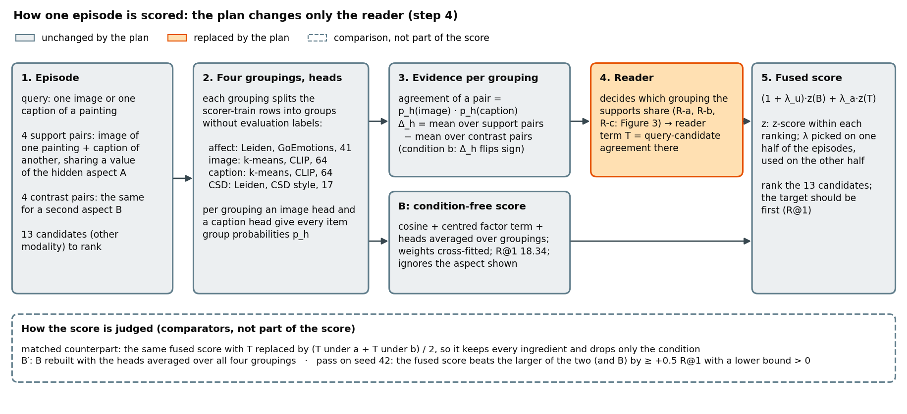
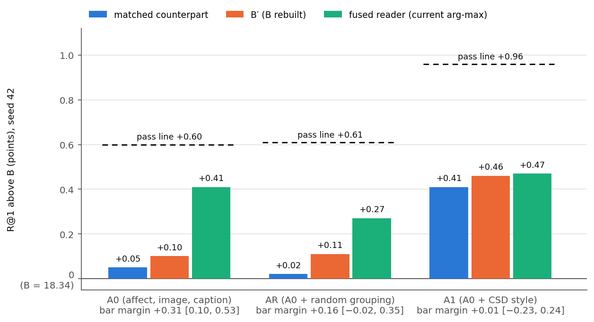
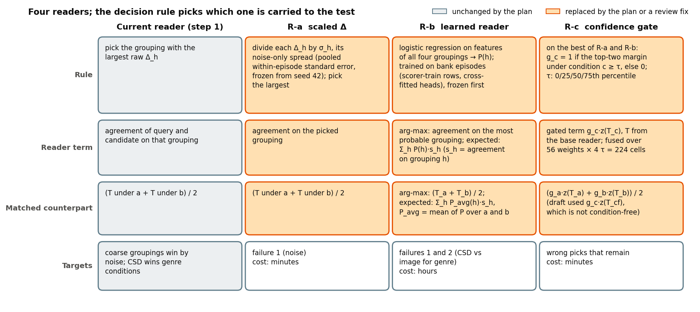
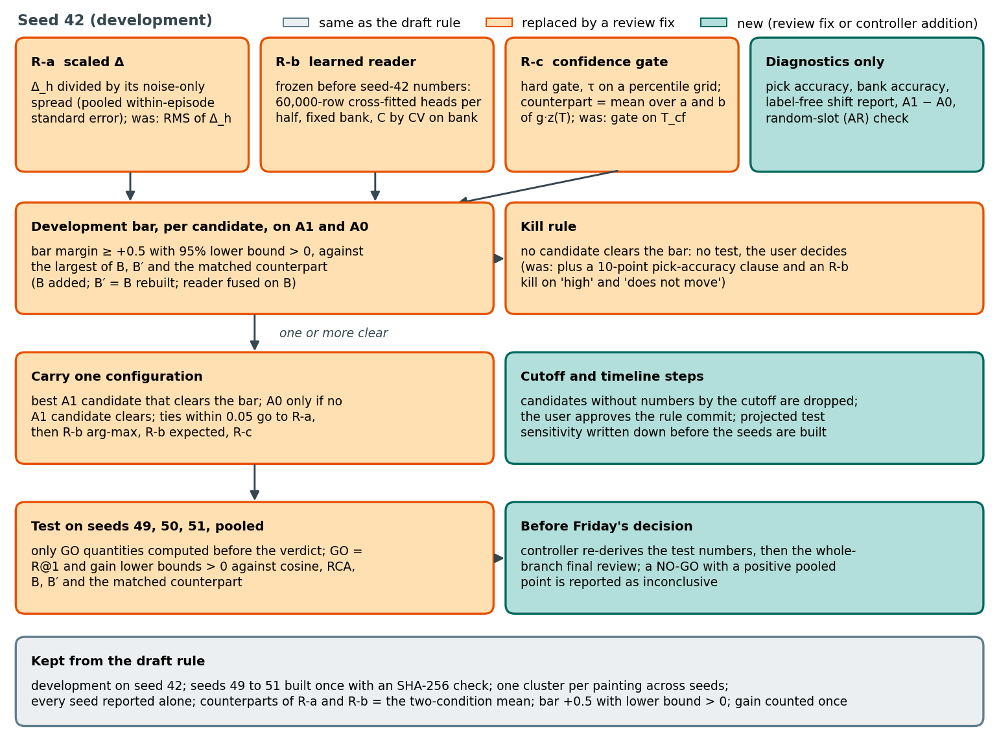
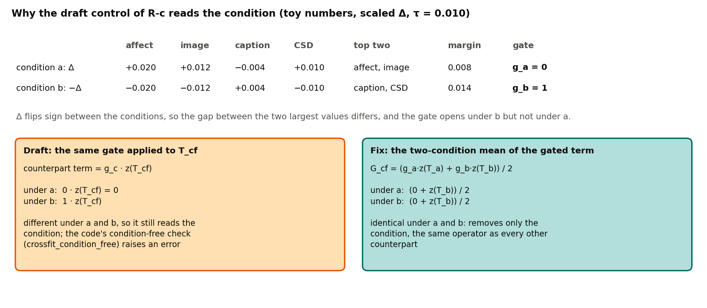
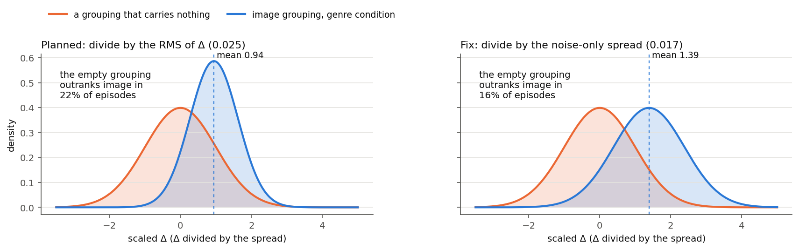
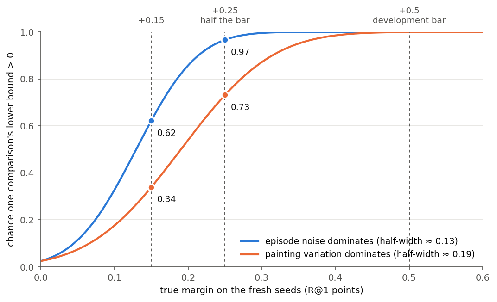
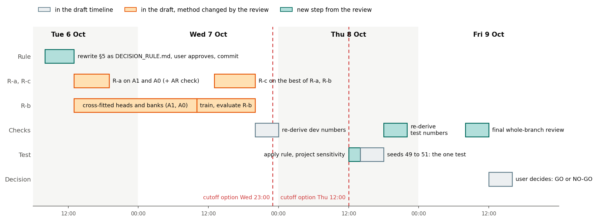
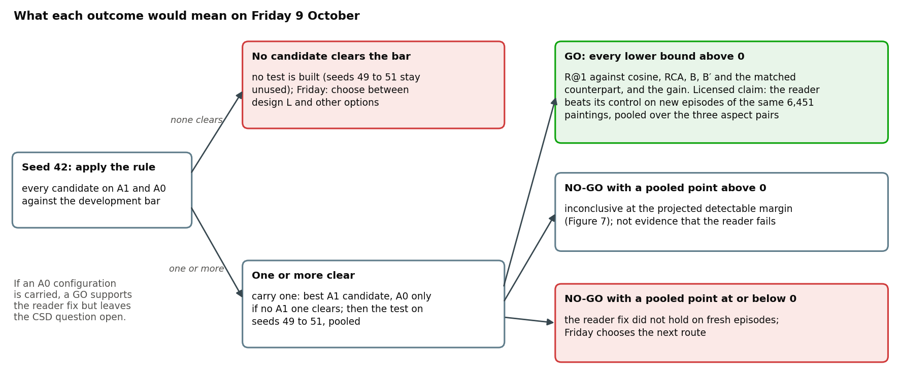

# CoSiR v2 reader fix with the CSD style grouping: ARS methodology review of the plan

**Report date:** 2026-11-17 (sequence date in this folder; the review ran on 2026-10-06 from 00:30 to 01:20,
Amsterdam time).
**What was reviewed:** the plan for fixing the aspect reader (plan (a)), written in the handoff
`docs/superpowers/handoffs/2026-10-06-reader-fix-with-csd-handoff.md`, §5, including its draft decision rule (§5.4).
Nothing in the plan has been run.
**Full record:** `src/test/20261117_reader_fix_csd/ars_review/` (cover memo, reviewed manuscript, sprint contract,
reviewer cards, blind Phase 1 plans, Phase 2 reports, editorial decision, log).
**Status:** the review is done. Update 2026-10-06 02:25: the user adopted every fix (R1 to R5, S1 to S17 and our AR
check), kept the reader fused on B, set the cutoff at Thursday 8 October 12:00 and ruled that an A0 GO counts as a GO
for plan (a). The revised rule is `src/test/20261117_reader_fix_csd/DECISION_RULE.md`, which governs.

## Summary

We planned to replace the label-free reader of CoSiR v2, the rule that decides which pseudo-aspect grouping an
episode's example pairs share, with readers that can tell the groupings apart, to pick one on the development episodes
and to test it once on fresh episodes before the go/no-go of Friday 9 October. Before writing any code we had the plan
reviewed by a two-seat ARS panel in methodology-focus mode. The panel returned **Major Revision**. Both dimensions
scored *block*, and both blocks are repairable by rewriting the rule text; nothing needs new data, seeds or runs. The
most serious finding was that one candidate, the confidence gate R-c, had no valid condition-free control as written,
so a result for it could not have been read. The draft kill rule could be read in two ways, and B′, one of the
comparators, was defined in two incompatible ways. The panel judged the overall design sound: one configuration is
carried from development to a single test, every comparator must be beaten, and no evaluation row can leak into the
learned reader. Figure 1 shows how the method scores an episode and Figure 3 the readers it chooses between. Section 6
lists every finding with its fix; Figure 4 shows the decision rule as it would stand after the fixes, and Figure 9
what each outcome on Friday would mean.

## 1. The task and the terms

**The task.** CoSiR v2 scores how well an image and a caption match *under an aspect that is never named*. An
**episode** has a query (one image, or one caption, of a painting), 4 **support pairs** and 4 **contrast pairs**, and
13 candidates in the other modality. Each support pair is an image of one painting with a caption of another painting
that share a value of aspect A (four different values, never the query's own). The contrast pairs do the same for a
second aspect B. One candidate, p_A, shares the query's value of A, one, p_B, shares its value of B, and 11 negatives
share neither. Under **condition a** the target is p_A; swapping supports and contrasts (**condition b**) makes p_B the
target. On ArtELingo the aspects are emotion (8 values, labelled per viewer caption), style (23 values) and genre
(10 values), both labelled per painting, giving three aspect pairs. Every item is a frozen CLIP ViT-B/32 feature.

**Data and seeds.** ArtELingo has 308,723 image and caption rows over 61,402 paintings. Methods train only on the
183,694 *scorer-train* rows (36,518 paintings). Episodes are drawn from the 32,413 *selection* rows (6,451 paintings),
4,096 episodes per aspect pair, 12,288 per **episode seed**. Seed 42 is the development draw and has been read many
times; seeds 49, 50 and 51 are fresh and reserved for the test. A fresh seed is a new draw of episodes on the same
6,451 selection paintings. The held split (12,281 paintings) is reserved for the paper.

**Metrics.** Each episode gives four rankings (two conditions, two directions).
- **R@1:** the target ranks strictly first (chance 7.69%).
- **Condition gain:** R@1 minus the rate at which the other aspect's candidate ranks first. It is exactly 0 for any
  scorer that ignores the condition.
- **Either rate:** R@1 plus that other-aspect rate, how often *some* aspect-sharing candidate ranks first. So
  R@1 = (either + gain) / 2: reading the condition helps only if the gain it adds outruns the either rate it costs.
- Intervals are 95% intervals from 5,000 resamples of anchor paintings.

**The label-free pipeline.**
- A **grouping** splits the scorer-train rows into groups without evaluation labels. Four are fixed for this plan:
  *affect* (Leiden communities on the GoEmotions emotion probabilities of each caption, 41 groups), *image* and
  *caption* (k-means with 64 clusters on CLIP image or caption features), and *CSD style* (Leiden communities on CSD
  style embeddings of the painting images, 17 groups, added on 5 October).
- A **head** is a logistic regression on frozen CLIP features, trained on 60,000 scorer-train rows to predict a row's
  group from its image alone or its caption alone; one image head and one caption head per grouping.
- **Agreement** of an image and a caption on grouping h is the dot product of their head probabilities.
- **Δ_h** is the mean agreement over the 4 support pairs minus the mean over the 4 contrast pairs. Under condition b,
  Δ_h is exactly the negative of its value under condition a.
- The **reader** (current form) picks the grouping with the largest Δ and scores each candidate by its agreement with
  the query on that grouping. This is the reader term T.
- **Told** gives the scorer the right grouping from the evaluation labels (emotion to affect, style to CSD, genre to
  image). It is a diagnostic ceiling for the reader and is not used as a method.

**Comparators.**
- **Cosine** (R@1 12.96 on seed 42) and **RCA** (13.38, the strongest raw metric learned from the example pairs) are
  the external baselines.
- **B** is the best condition-free score we have: cosine, a centred factor term and the head agreement averaged over
  the three original groupings, with weights cross-fitted (R@1 18.34 [17.97, 18.70]).
- **B′** is B rebuilt with the agreement averaged over a configuration's own groupings, so that a new grouping's
  condition-free value is credited to the comparator and not to the reader.
- The **matched counterpart** of a fused reader is the same fused score with T replaced by its average over the two
  conditions, T_cf. It keeps every ingredient and removes only the condition. (Earlier in the project a control that
  removed more than the condition produced a false pass; this is why every comparison here is against a matched
  counterpart.)
- **Fusion and cross-fitting.** The reader is fused on B as (1 + λ_u)·z(B) + λ_a·z(T), with per-ranking z-scores and
  a grid of 56 weight pairs. The weights are chosen on one half of the episodes (episode index parity) and applied to
  the other half. The fused reader uses a *min-margin* rule (maximise the smaller of its R@1 lift over B and its gain);
  the counterpart uses the *max-R@1* rule, the most favourable rule for a control.
- **Margin** = fused reader minus its matched counterpart (R@1). **Bar margin** = fused reader minus whichever of B′
  and the counterpart has the larger R@1.
- **Development bar:** a bar margin of at least +0.5 R@1 with a 95% lower bound above 0, plus a condition gain over the
  counterpart with a lower bound above 0. It was set at +0.5 because fresh-seed tests have so far roughly halved
  development effects.
- **Pick accuracy** (diagnostic): how often the reader picks the told grouping. It reads the evaluation labels through
  the told mapping.

*Figure 1. How the method scores one episode (configuration A1). Steps 1 to 3 and the condition-free score B are fixed; the plan changes only the reader in step 4. The dashed box lists the comparators the fused score is judged against; they are not part of the score.*

## 2. How the work got here

| Date | Step | Told margin | Reader margin | Source |
|---|---|---|---|---|
| 4 Oct | Stage report: k-means groupings, N6 reader | +1.14 [0.90, 1.41] | +0.14 [−0.04, 0.32] | stage report §14 |
| 5 Oct | Affect grouping as Leiden communities (A0) | +1.64 [1.37, 1.92] | +0.35 [0.15, 0.57] | report 2026-11-12 §4 |
| 5 Oct | A0 plus the CSD style grouping (A1) | **+2.23 [1.93, 2.56]** | +0.06 [−0.15, 0.28] | report 2026-11-12 §9 |

The told margin, what the scorer gains from reading the condition when it is told the right grouping, kept rising. The
label-free reader did not follow. The plan starts from this state on seed 42 (B = 18.34 for every row):

| Configuration | Groupings the reader chooses among | B′ | Told margin | Reader margin | Bar margin | Pick accuracy |
|---|---|---|---|---|---|---|
| A0 | affect, image, caption | 18.44 | +1.64 [1.37, 1.92] | +0.35 [0.15, 0.57] | +0.31 [0.10, 0.53] | 54.7% (chance 33%) |
| A1 | A0 + CSD style | 18.80 | +2.23 [1.93, 2.56] | +0.06 [−0.15, 0.28] | +0.01 [−0.23, 0.24] | 43.2% (chance 25%) |
| AR (control) | A0 + a random 17-group grouping | 18.45 | +0.67 [0.40, 0.95] | +0.25 [0.09, 0.42] | +0.16 [−0.02, 0.35] | 41.9% |

No configuration reached the development bar. Adding CSD raised the ceiling by 0.6 points, and the reader recovered
none of it: it fell below the random-grouping control.

*Figure 2. Seed 42 with the current arg-max reader. Bars are R@1 above B for the matched counterpart, B′ and the fused reader; the dashed pass line is the larger of B′ and the counterpart plus 0.5, and each group's label gives the bar margin with its 95% interval. Adding CSD (A1) lifted B′ and the counterpart as much as the reader, so its pass line rose to +0.96. Numbers from the step-1 log.*

**Why the reader fails** (report 2026-11-12 §9).
1. *Coarse groupings win by noise.* A grouping with 17 large groups gives large agreement values, so its Δ swings
   widely by chance. The random grouping, which carries nothing, was picked in 27% to 37% of the conditions where the
   right grouping's Δ is weak.
2. *CSD looks like the visual grouping for both style and genre.* CSD tracks style about as much as genre (adjusted
   mutual information 0.34 against 0.33), so genre supports also agree on it, and its coarse groups beat the 64-group
   image grouping on Δ. It was picked in 70.5% of emotion × genre genre conditions, where image is right (15.8%).
3. The fourth grouping also lifts the comparators: A1's B′ sits 0.46 above B, so CSD's condition-free value does not
   count as reading.

## 3. The plan that was reviewed

The user chose plan (a) on 6 October: fix the reader with the CSD grouping in the set. The groupings, the label policy
(no grouping choice reads evaluation labels; the told mapping is a diagnostic), the matched controls and the seed
policy (develop on seed 42, test the one carried configuration on fresh seeds 49 to 51, each reported and pooled) were
fixed and not open to the review.

**Base.** A1, with every reader also run on A0 as the reference.

**Reader candidates.**

| Id | Reader | Meant to fix | Cost |
|---|---|---|---|
| R-a | *Scaled Δ:* divide each grouping's Δ by its spread, the root mean square of Δ over the seed-42 episodes with both conditions pooled, then take the arg-max | failure 1 | minutes |
| R-b | *Learned reader:* a multinomial logistic regression over per-episode features of all groupings (support and contrast agreement, Δ, their spread over the 4 pairs, the share of support pairs whose image and caption pick the same group), trained to predict which grouping the supports share, on pseudo-aspect episodes built from the four groupings on scorer-train rows (a *bank*). Scored by arg-max, or by the expected term Σ P(h)·s_h. Training features come from heads cross-fitted on painting halves. A *domain-shift check* kills R-b if its accuracy on held-out bank episodes is "high" and its seed-42 pick accuracy "does not move" | failures 1 and 2 | hours |
| R-c | *Confidence gate* on the better of R-a and R-b: s = z(B) + λ·g·z(T), with g in [0, 1] from the reader's top-two margin; the counterpart "applies the same gate to T_cf" | remaining wrong picks | minutes |

*Figure 3. The four readers as they would stand after the review's fixes: what each decides from, the reader term it adds to the score, and the matched counterpart it is judged against. The decision rule (Figure 4) picks which configuration is carried to the test; none is chosen yet.*

**Draft decision rule (§5.4).**
1. Candidates: R-a, R-b arg-max and R-b expected, each on A1 and A0; R-c on the best of them by bar margin.
2. Matched counterpart: the reader term replaced by its two-condition mean; "B′ = B plus the configuration's
   averaged-heads term".
3. Development bar as defined in Section 1.
4. Carry the largest bar margin among candidates that clear the bar; ties within 0.05 go to the simpler (R-a before
   R-b, no gate before gate, A0 before A1).
5. Kill: "if no candidate raises pick accuracy by at least 10 points over its configuration's arg-max reader … or
   reaches the bar, no test is built".
6. Test: build seeds 49, 50 and 51 once, rerun every cross-fit on each seed's halves; **GO** if, pooled over the
   three seeds with one cluster per painting, R@1 and gain have lower bounds above 0 against each of cosine, RCA, B′
   and the matched counterpart.

**Timeline.** Tuesday 6 October: review, fix, commit the rule, run R-a, start R-b. Wednesday: R-b and R-c.
Thursday: apply the rule and, if a candidate clears the bar, run the test. Friday 9 October: the user decides.

## 4. How the review was run

We used the ARS academic-paper-reviewer in methodology-focus mode (v3.22.2), the same procedure as the review of the
repair order on 3 October ([report](2026-11-04_ars_repair_order_review.md)).
- **Packet.** A cover memo stated the decision requested, six questions, the fixed constraints and the code-level facts
  the plan relies on, all read from the code (how the fusions, counterparts, B′ and the bank are built). Verbatim
  appendices followed: the handoff, the grouping report, the step-1 log, the earlier reader handoff, stage report §2
  and §14, and the matched-control and seed-handling lessons. 19,092 words in all.
- **Panel.** Two seats. A *methodology* seat (an ML-evaluation statistician: selection on reused development data,
  cross-fitting, pseudo-task meta-learning, cluster bootstrap, matched controls) owned D1, methodology rigor, the
  mandatory dimension. A *Journal-Fit* seat (a vision-language retrieval lead judging whether the plan can be applied
  as a rule without asking questions) owned D2, writing and structure. The user confirmed both reviewer cards.
- **Protocol.** Each seat first committed its scoring plan without seeing the plan (Phase 1: contract and metadata
  only), then reviewed the full packet (Phase 2) and had to quote its own Phase 1 trigger for any warn or block. A
  synthesizer combined the two reports by the contract's fixed rules. Every step passed the ARS checkers
  (`check_sprint_contract`, `check_phase_conformance`, `check_panel_synthesis`).
- **Provenance.** Both seats and the synthesizer were Claude models in separate fresh contexts; neither seat saw the
  other's report. No human sat on the panel. The seats read only the packet, not the code or the stored arrays.

## 5. Verdict

**Major Revision.**

| Dimension | Seat | Score | Trigger it quoted |
|---|---|---|---|
| D1 methodology rigor (mandatory) | methodology | **block, repairable** | "At least one candidate that the decision rule can carry forward would be uninterpretable as planned" |
| D2 writing and structure | Journal-Fit | **block** | a kill or carry rule stated in several places with conflicting readings, or resting on undefined or two-sense terms |

The fired conditions were F2 (D1 block: major revision) and F4 (D2 warn or worse: minor revision); the more severe one
decides. The methodology seat also checked its fatal trigger, that the test reuses development material, and judged it
not met: fresh seeds draw new episodes, and nothing chosen on seed 42 is fitted to individual paintings. The shared
paintings limit what a GO can claim (finding S13) without making the test unable to discriminate.

## 6. Findings and the proposed fixes

*Figure 4. The reader-fix decision rule as it would stand if every proposed fix were adopted. Orange boxes replace a
part of the draft rule, teal boxes are new, the grey box lists what the review kept unchanged. Nothing in it is
adopted yet (Section 8).*

### 6.1 Must fix (these carry the two blocks)

**R5. R-c's control is not condition-free (methodology seat, Critical).** The gate g comes from the reader's top-two
margin, and that margin differs between the two conditions: for R-a, condition a uses the gap between the two largest
scaled Δ values and condition b the gap between the two smallest, because Δ flips sign. So "the same gate applied to
T_cf" changes with the condition. It is not a control that removes only the condition, and the code's own check
(`crossfit_condition_free`) raises an error on it. R-c could be carried to the test, and its control would have been
improvised after the other numbers were known.
*Fix:* a hard gate g_c = 1 when the reader's top-two margin under condition c is at least τ, else 0, with τ on a
label-free grid (the 0th, 25th, 50th and 75th percentiles of the parent reader's seed-42 margin; the 0th gives the
parent itself). Fused score (1 + λ_u)·z(B) + λ_a·g_c·z(T_c) over the 56 weight pairs times 4 thresholds (224 cells).
Counterpart term G_cf = (g_a·z(T_a) + g_b·z(T_b)) / 2, the two-condition mean of the whole gated term, cross-fitted
with the max-R@1 rule over the same 224 cells. Report the 0th-percentile cell as a sanity check.

*Figure 5. R5 in a toy example (illustrative numbers, not measured). The draft counterpart multiplies T_cf by the gate of the current condition, so it differs between a and b; the fixed counterpart averages the whole gated term over the two conditions and is the same under both.*

**R1. The kill rule reads two ways and leans on the told mapping (both seats).** Item 5 can mean "kill only if no
candidate does either" or "kill if no candidate gains 10 points, or if none reaches the bar". Under the first, a
candidate that gains 10 points of pick accuracy but misses the bar is neither killed nor carried. Under the second, a candidate that clears the bar is killed
while the timeline says to build the test. The second case is plausible: in the Leiden sweep the reader margin reached
+0.50 while pick accuracy stayed at 54% to 56%. Pick accuracy also reads the evaluation labels, which the plan calls a
diagnostic only, and it understates CSD's usefulness for genre because a CSD pick under a genre condition counts as
wrong.
*Fix:* "Kill: if no candidate clears the development bar, no test is built and the result goes to the user. Pick
accuracy and R-b's bank accuracy are seed-42 diagnostics and enter no rule." On test seeds, only the GO quantities are
computed until the verdict is written down.

**R2. One definitions block (both seats).** Item 2 says B′ is "B plus the configuration's averaged-heads term"; the
code, the memo and the step-1 numbers rebuild B instead (B′ 18.44 for A0, 18.80 for A1), and the two give different
numbers of about the size of the bar. The plan also never says whether the reader is fused on B or on B′ (the earlier
reader handoff fused on B′).
*Fix:* open the rule file with one definitions block: the reader fused on B with the min-margin cross-fit, as in
step 1 (the methodology seat recommends B because the reference numbers are on B and the conservative bias is only 0.04
to 0.05 R@1); the counterpart of each reader (for R-b's expected term, Σ P̄(h)·s_h with P̄ the two-condition mean of
its probabilities); B′ as B rebuilt; the gain statistic named as in step 1; the bar comparator.

**R3. The rule file governs (Journal-Fit seat).** The rule is spread over §5.2, §5.4, §5.5 and the memo, and no text
says which one wins. *Fix:* "Where this file differs from §5.2, §5.5, the memo or the appendices, this file governs",
and everything needed to apply the rule is inside the file.

**R4. R-b's domain-shift check becomes a diagnostic (both seats; arbitrated).** "High" and "does not move" have no
numbers, the check sits outside §5.4, and its precedence over the bar is unstated. The Journal-Fit seat proposed a
numeric kill that overrides the bar; the methodology seat proposed no kill, because the check reads pick accuracy and
could remove the one reader that works through CSD. The synthesizer sided with the methodology seat.
*Fix:* bank accuracy and pick accuracy are reported diagnostics; add a label-free shift report (standardised mean
difference of each R-b feature, and the distribution of R-b's top probability, on held-out bank episodes against
seed-42 episodes). R-b survives or falls on the bar like every other candidate.

### 6.2 Should fix, Major

**S9. R-a's spread mixes signal into the noise scale (methodology seat).** With both conditions pooled, the mean of Δ
is 0, so the root mean square equals √(noise variance + mean squared signal). A grouping that carries a strong signal
therefore gets a larger divisor and is held down exactly where it is right. The seat's order-of-magnitude check, which
we re-derived:

| Image grouping, emotion × genre | Spread used | Scaled Δ | Chance an uninformative grouping outranks it |
|---|---|---|---|
| Noise-only scale | 0.017 | 1.39 | 16% |
| Planned RMS scale | 0.025 | 0.94 | 22% |

*Figure 6. S9 as an illustration (normal approximation from summary numbers: the image grouping's mean Δ of 0.0236 in emotion × genre genre conditions, per-episode noise 0.017, RMS 0.025; not measured on episodes). Dividing by the RMS shrinks the image grouping's lead over a grouping that carries nothing, so the empty grouping wins more often.*

This partly brings back failure 1, the failure R-a is meant to fix, so an R-a miss would not show that scaling fails.
*Fix:* divide by the noise-only spread σ_h = √(mean over seed-42 episodes of (s²_support + s²_contrast) / 4), where
s² is the sample variance of the four pair agreements; it is the standard error of Δ_h, label-free, identical under
both conditions, and frozen from seed 42. Bank episodes are not a good source: the heads' 60,000-row draw already
touches 86% of scorer-train paintings, so bank posteriors are mostly in-sample and sharper.

**S10. Freeze R-b before any seed-42 number (methodology seat).** Four choices are open: the cross-fitted heads'
training size (heads trained on fewer rows are less sharp than the 60,000-row evaluation heads, and every R-b feature
scales with sharpness), the regularisation, feature scaling and bank size, the separate three-grouping bank A0 needs,
and whether settings may change after seed-42 numbers are seen.
*Fix:* cross-fitted heads with the same recipe and a 60,000-row draw inside each painting half (each half has about
92,000 rows), their held-out accuracies reported before R-b is trained; a fixed bank size (for example 65,536 episodes
per half); features standardised on the bank; regularisation chosen by five-fold cross-validation on bank episodes
only; the two half-readers averaged; the same recipe for A0. Any later change is a new, declared candidate. Disclose the
bank's limit: its classes are groupings with a uniform prior, and "genre" is not a class.

### 6.3 Should fix, Minor

| Item | Problem | Fix |
|---|---|---|
| S1 | Pick accuracy undefined for R-c and R-b expected | R-c inherits its base reader's; R-b expected uses the arg-max of P(h) |
| S2 | No single outcome-to-action table (the Journal-Fit seat needs it for D2 to pass) | one table: no candidate eligible; one; several tied; test GO; test NO-GO including partial passes; what is computed on test seeds before the verdict; plus "items 1 to 5 are development selection, item 6 is the only confirmatory test" |
| S3 | Role of per-seed and per-pair test results unstated | reported, never change the pooled verdict |
| S4 | The tie-break is a partial order | ties within 0.05 of the largest bar margin go to R-a, then R-b arg-max, R-b expected, R-c |
| S5 | A0 is both reference and candidate, and the A1 versus A0 comparison its purpose needs is not measured | carry the best A1 candidate that clears the bar, an A0 one only if none does; report A1 minus A0 under each reader |
| S6 | Internal codes (C2, E2, N6, A′) and colliding names (A3, R1 against R-a) | short glossary in the rule file; note that folder dates are sequence numbers |
| S7 | Timeline lacks the user's approval of the commit, the re-derivation of the test numbers, the whole-branch final review before Friday, and a cutoff | add the slots, a cutoff (Thu 8 Oct 12:00 or Wed 23:00) and a fallback order: R-a and R-c on R-a first, then R-b arg-max on A1 |
| S8 | The memo's summary of the bars drifts from §5.4 and omits the plan's own prior ("moderate at best") | point to §5.4; state the prior |
| S11 | B′ can fall below B (18.24 for one step-1 arm), yet B is not a comparator | bar comparator = largest of B, B′ and the counterpart; add B to the GO list |
| S12 | The test's sensitivity is unstated, so a NO-GO has no defined reading | before building the seeds, split the carried configuration's seed-42 variance by painting and project the pooled interval width; a NO-GO with a positive pooled point is "inconclusive at a detectable margin of x" |
| S13 | What a GO licenses is unstated | new episodes on the same 6,451 paintings, pooled over aspect pairs; not new paintings and not each pair; disclose that CSD was kept after its told margins were seen |
| S14 | R-c's base and two clauses of the bar are loose | R-c is built on the largest bar margin whether or not it clears the bar; keep the bar's clauses |
| S15 | Test-time cross-fits choose weights with test labels, on halves that share paintings | state that per-seed cross-fitting is part of the method and that intervals hold the picks fixed |
| S16 | Precision of "≥ +0.5" and the place of the reference pick accuracies | the full-precision point decides; reference pick accuracies move to the diagnostics |
| S17 | Basis of the halvings behind the +0.5 bar | answered in Section 7 |

**Test power, for scale (S12).** From the seed-42 interval widths, one development comparison has a standard error of
about 0.11 to 0.12 R@1. Pooled over three fresh seeds, the 95% half-width would be about 0.12 to 0.14 if episode-level
noise dominates and 0.18 to 0.20 if painting-level variation dominates. If the carried margin halves from +0.5 to
+0.25, one comparison clears 0 with probability about 0.97 or 0.73; at +0.15, about 0.62 or 0.34 (Figure 7).

*Figure 7. Chance that one GO comparison's pooled lower bound clears 0 on seeds 49 to 51, against the true margin, for the two noise scenarios projected from seed-42 interval widths. The GO needs several comparisons at once, so the joint chance is a little lower.*

## 7. What the panel found sound, and our own checks

**Sound** (methodology seat, strengths S1 to S5).
- One configuration carried to one test that must beat every comparator, with gain counted once: the test keeps its
  level without a multiplicity correction. Taking the maximum of seven configurations inflates the development margin
  by roughly 0.1 to 0.15 R@1, within the halving the +0.5 bar already allows.
- The two-condition-mean counterparts of R-a and both R-b variants remove only the condition.
- No evaluation row or label can reach R-b's training; the bank uses scorer-train rows and cross-fitted heads.
- The rule is reviewed and committed before the numbers it governs.
- The appendices' arithmetic is consistent (R@1 = (either + gain) / 2 on every row checked; bar margins; counts).

**Re-derived by us** (by hand and from the code; no new run): the counterpart error of R5 against the code's
condition-free check; the RMS and noise-only scales and the 16% and 22% figures of S9; the power figures of S12; the
expected lift of a maximum over seven configurations (about 1.35 standard errors); and that the cross-fit halves are
episode index parity, as the memo states.

**Answer to S17.** The two halvings behind the +0.5 bar were condition **gains**, not R@1 margins against a matched
control: E3's gain fell from 0.52 to 0.26 on its fresh seed, and N1's from 0.26 to 0.15. No reader margin against a
matched counterpart has yet been tested on fresh seeds, so the bar's calibration is a heuristic.

**Added by us, not raised by the panel.** The plan drops the random-grouping control AR. Running every reader on AR is
a label-free check that costs minutes: a reader whose scaling works should stop picking a grouping that carries
nothing (the random grouping took 27% to 37% of picks in the weak conditions under the current reader).

## 8. What happens next, and the decisions for the user

*Figure 8. The four days with the review's added steps (teal). Which cutoff applies is decision 3 below.*

*Figure 9. What each outcome would mean on Friday 9 October, if the rule is adopted with the review's fixes.*

1. Adopt the five must-fix items as proposed, including no kill for R-b (R4)?
2. Which should-fix items to adopt. Our recommendation is all of them; together they are a few hours of rewriting.
3. The cutoff for unfinished candidates: Thursday 8 October 12:00 or Wednesday 7 October 23:00?
4. Does a GO on an A0 configuration (without CSD) count as a GO for plan (a)?
5. Keep the reader fused on B, as the panel recommends, or switch to B′?

After these decisions the plan is rewritten as `src/test/20261117_reader_fix_csd/DECISION_RULE.md`, shown to the user,
and committed only when the user asks.

## 9. Limitations of this review

- Both seats and the synthesizer were one model family; role separation is not independence, and no human reviewer
  took part.
- The reduced panel had no domain seat and no devil's advocate, so novelty against the conditional-similarity
  literature, the plausibility of CSD and CLIP heads as carriers of style, and the case for design L instead of plan
  (a) were not assessed.
- The seats read the packet only. Statements about the code came from the cover memo; we checked the load-bearing ones
  against the code ourselves.
- The size estimates in S9 and S12 rest on summary numbers from the appendices, not on the stored per-episode arrays.

*Sources: `src/test/20261117_reader_fix_csd/ars_review/` (`editorial_decision.md`, `phase2_methodology.md`,
`phase2_eic.md`, `20261117_ars_reader_fix_review_log.md`); the handoff of 2026-10-06; the
[grouping report](2026-11-12_partition_quality_leiden_communities.md); the stage report
`docs/reports/stage/2026-10-04_aspect_conditioned_similarity_methods.md` §2 and §14; figure built by
`docs/reports/assets/2026-11-17_ars_reader_fix_plan_review/build_rule_flow.py`.*
