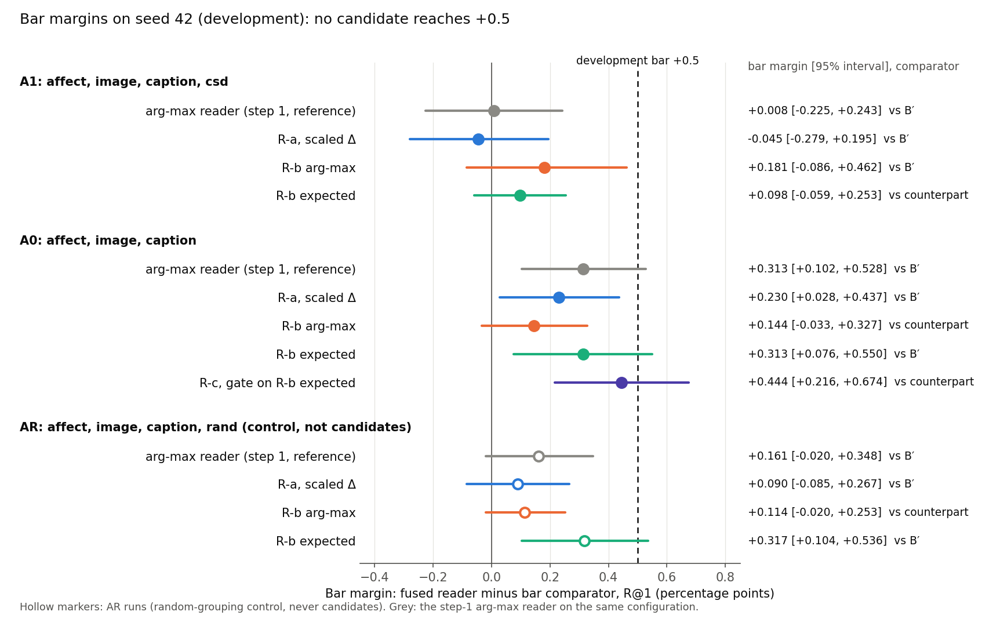
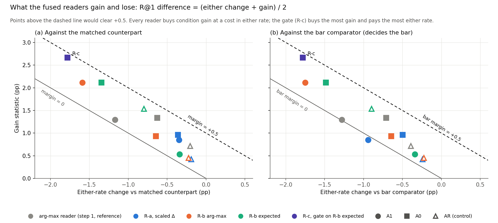
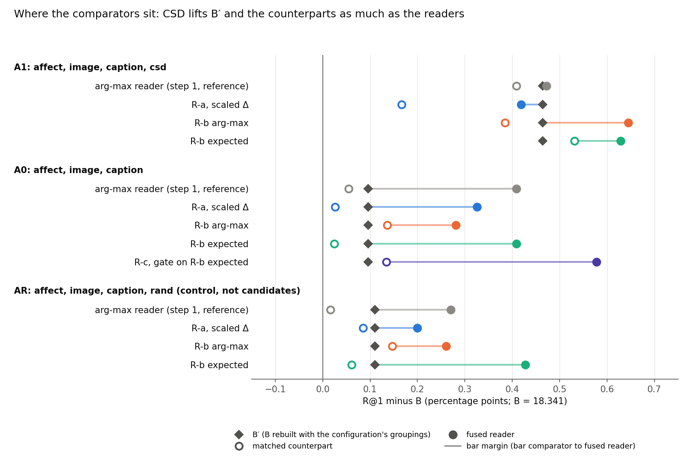
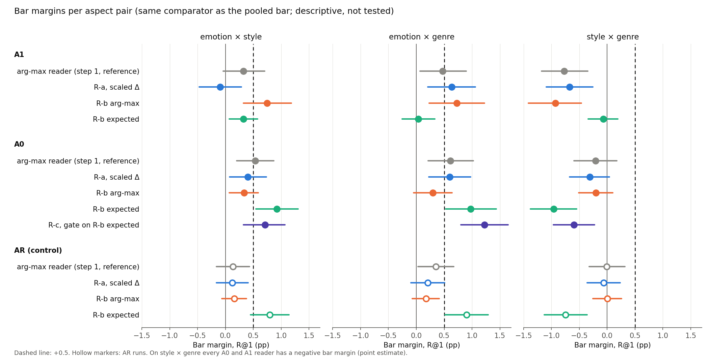
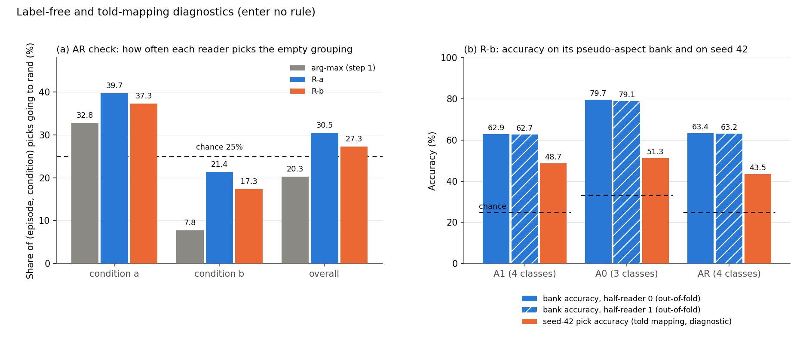

# CoSiR v2 reader fix with the CSD style grouping: development run on seed 42 (plan (a))

**Report date:** 2026-11-18. This is a sequence date in this folder, not a calendar date. The run took place on
2026-10-06 from 02:51 (rule committed) to 03:43 (rule applied), Amsterdam time.
**Status:** development selection under the committed decision rule. No candidate cleared the development bar, so under
the rule's item 5 no fresh-seed test was built. The result goes to the user for the Friday 9 October choice. The
whole-branch final review ran on 2026-10-06 (fresh reviewer; it re-derived all seven candidates, five from scratch, and
about 200 report numbers) and confirmed the verdict; its findings (one wrong explanation in §4.5, overstated wording in
§4.4, two test gaps, housekeeping) were fixed.
**Records:** binding rule `src/test/20261117_reader_fix_csd/DECISION_RULE.md` (commit f25c48f, SHA-256 613d8c9d…);
run log `src/test/20261117_reader_fix_csd/20261117_reader_fix_csd_log.md`; code and outputs in the same folder
(commits bb0a2a6, 9a11680, 31df8ba; `results/` is gitignored); figures and their build script in
`docs/reports/assets/2026-11-18_reader_fix_csd/`. The task and the review that shaped the rule are described in full in
the [ARS review report](2026-11-17_ars_reader_fix_plan_review.md); this report defines every term it uses.

## Summary

CoSiR v2 scores an image and a caption under an aspect that is shown only through example pairs. A label-free
**reader** decides which pseudo-aspect grouping the example pairs share. With the CSD style grouping in the set, the
scorer gained +2.23 R@1 over its matched condition-free counterpart when told the right grouping, while the current
reader gained only +0.06. Plan (a) tried to close that gap with three new readers: **R-a** (each grouping's support
minus contrast agreement divided by its noise scale), **R-b** (a logistic regression trained on pseudo-aspect episodes
built from the groupings, scored by its arg-max or by its expected term) and **R-c** (a confidence gate on the best of
them). R-a and both R-b scorings ran on configuration A1 (with CSD), on A0 (without) and on the random-grouping control
AR; R-c ran on its parent's configuration. A rule that was reviewed and committed before any code decided the outcome.

**No candidate cleared the development bar.** The bar asks for a bar margin of at least +0.5 R@1 over the strongest
condition-free comparator, with 95% lower bounds above 0 for that margin and for the condition gain. The best candidate
was R-c, the gate on R-b's expected term on A0, with a bar margin of **+0.444 [+0.216, +0.674]** against its matched
counterpart (fused R@1 18.919 against 18.475; B′ 18.437; B 18.341). Its condition gain statistic was +2.667
[+2.325, +3.012]. Against the current arg-max reader on A0 (bar margin +0.313 [+0.102, +0.528]) its paired
difference was +0.130 [−0.146, +0.410]. The next best were R-b expected on A0 at +0.313 [+0.076, +0.550], which equals
the arg-max reader's value, and R-a on A0 at +0.230 [+0.028, +0.437]. On A1 the best was R-b arg-max at +0.181
[−0.086, +0.462] (arg-max reader on A1: +0.008). Every gain statistic had a lower bound above 0. Every candidate failed
clause 1, the +0.5 point estimate, and four of them also failed clause 2.

The new readers shifted the balance between condition gain and either rate more than they moved R@1. R-b and R-c bought
up to twice the condition gain of the arg-max reader and paid for most of it in either rate. Adding CSD lifted B′ and the counterparts as much
as the fused readers, so A1's bar margins never clearly exceeded A0's. Every A0 and A1 reader had a negative bar margin
on style × genre. An independent re-derivation with its own code matched every decision quantity at full precision.

Under the rule's item 5 no test was built and seeds 49 to 51 stay unused. The user chooses on Friday 9 October among the
options the rule names: design L (late-fusion refinement of the groupings), a change of course (benchmark or analysis
paper), or another reader round under a new pre-registered rule.

*Sources: `results/rule_application.{txt,json}`, `results/cand_*.txt`, the run log (all paths in this report are under
`src/test/20261117_reader_fix_csd/` unless given in full).*

## 1. Terms and setup

**The task.** An **episode** has a **query** (one image, or one caption, of an anchor painting), 4 **support pairs**,
4 **contrast pairs** and 13 **candidates** in the other modality. The support pairs share values of aspect A, the
contrast pairs values of aspect B. Candidate p_A shares the query's value of A, p_B its value of B, and 11 negatives
share neither. Under **condition a** the target is p_A; under **condition b** supports and contrasts swap and the
target is p_B. Each episode gives four rankings (two conditions, two directions: image to caption and caption to
image). On ArtELingo the aspects are emotion, style and genre, giving three **aspect pairs** (emotion × style,
emotion × genre, style × genre). Methods train on the 183,694 *scorer-train* rows (36,518 paintings). Episodes are
drawn from the *selection* rows: one **episode seed** gives 12,288 episodes (4,096 per pair) on 4,602 anchor
paintings. Seed 42 is the development draw and has been read many times; seeds 49, 50 and 51 were reserved for the test.
Every item is a frozen CLIP ViT-B/32 feature.

**Metrics** (per episode, averaged over its four rankings, pooled over the three pairs, in percentage points).

| Term | Meaning |
|---|---|
| R@1 | the target ranks strictly first (ties miss; chance 7.69%) |
| other-aspect rate | the other aspect's candidate ranks first |
| condition gain | R@1 minus the other-aspect rate; exactly 0 for any scorer that ignores the condition |
| either rate | R@1 plus the other-aspect rate. So **R@1 = (either + gain) / 2**: reading the condition pays only if the gain it adds outruns the either rate it costs |
| interval | 95% percentile interval of a bootstrap over anchor paintings (5,000 resamples, seed 42); cross-fit choices are held fixed |

**The label-free pipeline.**

| Term | Meaning |
|---|---|
| grouping | a partition of the scorer-train rows built without evaluation labels. Five are fixed: *affect* (Leiden communities on GoEmotions caption probabilities, 41 groups), *image* and *caption* (k-means with 64 clusters on CLIP image or caption features), *csd* (Leiden communities on CSD style embeddings of the painting images, 17 groups), *rand* (csd's labels permuted across paintings; carries nothing) |
| configuration | the groupings a reader chooses among, in tie-break order: **A0** = (affect, image, caption); **A1** = A0 + csd; **AR** = A0 + rand, the random-grouping control, never a candidate |
| head | a logistic regression on frozen CLIP features that predicts a row's group from its image alone (image head) or its caption alone (caption head); its output is the item's posterior p_h |
| agreement | a_h(i, t) = p_h(i) · p_h(t) for an image i and a caption t on grouping h |
| Δ_h | mean agreement over the 4 support pairs (S_h) minus the mean over the 4 contrast pairs (C_h); under condition b it is exactly −Δ_h of condition a |
| grouping score | s_h(q, k) = p_h(q) · p_h(k) for query q and candidate k; it does not depend on the condition |
| reader | the rule that picks, per episode and condition, which grouping (or mixture of groupings) scores the candidates. The current **arg-max reader** (step 1) picks the largest Δ_h |
| reader term T | the score the reader selects (s of the picked grouping, or for R-b expected the mixture Σ_h P(h)·s_h) |
| told mapping | the evaluation-label map aspect → grouping (A0: emotion → affect, style → image, genre → image; A1: style → csd; AR: style → rand). The **told** scorer uses it as a ceiling; it is a diagnostic, not a method |
| pick accuracy | how often the reader's pick equals the told grouping, averaged over the two conditions (chance 1/3 on A0, 1/4 on A1 and AR). Diagnostic only; it enters no rule |

**Comparators and the decision quantities.**

| Term | Meaning |
|---|---|
| B | the best condition-free score of the project: cosine, the centred factor term of the method-A checkpoint (T_N1u) and the head agreement averaged over three k-means-64 groupings (T_6u: k-means on GoEmotions probabilities, image, caption), fused with cross-fitted weights. Seed 42: R@1 18.341 [17.975, 18.697] |
| B′ | B rebuilt with the averaged agreement taken over the configuration's own groupings, so that a new grouping's condition-free value is credited to the comparator: A0 18.437, A1 18.805, AR 18.451 |
| matched counterpart | the same fused score with T replaced by its two-condition mean T_cf = (T^a + T^b) / 2. It keeps every ingredient and removes only the condition. R-c's counterpart is G_cf, the two-condition mean of the whole gated term |
| fusion | every term is z-scored per ranking row; the fused reader scores (1 + λ_u)·z(B) + λ_a·z(T) on a grid of 56 cells (λ_u ∈ {0, 0.5, 1, 2, 4, 8, 16}, λ_a ∈ {0, 0.25, 0.5, 1, 2, 4, 8, 16}); the reader is always fused on B |
| cross-fit | the episodes are split by index parity; each half picks a cell and scores the other half. The fused reader uses the *min-margin* rule (maximise the smaller of its R@1 lift over B and its gain); the counterpart uses the *max-R@1* rule, the most favourable rule for a control |
| margin | fused reader minus matched counterpart, R@1, paired per anchor |
| bar comparator | whichever of B′, the counterpart and B has the largest mean R@1 on seed 42 |
| bar margin | fused reader minus bar comparator, R@1, paired per anchor, with its interval |
| gain statistic | the fused reader's condition gain minus its counterpart's (which is 0). Since B, B′ and the counterpart all have gain 0, it is the gain over each of them |
| development bar | a candidate clears it if (1) its bar margin's point estimate is at least +0.5, (2) its bar margin's lower bound is above 0 and (3) its gain statistic's lower bound is above 0, all at full precision |
| candidate | a reader on a configuration: R-a, R-b arg-max and R-b expected on A1 and on A0, and R-c on its parent's configuration (seven in all) |

**The three readers.**
- **R-a, scaled Δ.** Pick the grouping with the largest Δ_h / σ_h. The noise scale σ_h is the square root of the mean
  over the seed-42 episodes of (s²_S + s²_C) / 4, where s²_S and s²_C are the sample variances of the four support-pair
  and four contrast-pair agreements: the standard error of Δ_h implied by pair-to-pair scatter. It is label-free and
  the same under both conditions.
- **R-b, learned reader.** Painting halves of the scorer-train rows; heads cross-fitted on each half; a **bank** of
  pseudo-aspect episodes per half whose supports share a group of one grouping and whose contrasts share a group of
  another (16,384 episodes per grouping pair; A1 and AR 98,304 per half, A0 49,152). Each bank episode is described by
  six features per grouping (S, C, Δ, the spread of the support and contrast agreements, the share of support pairs whose
  image and caption arg-max groups coincide). A multinomial logistic regression per half, with C chosen by five-fold
  cross-validation on the bank, predicts which grouping the supports share. The two half-readers' probabilities P(h)
  are averaged. *R-b arg-max* scores with the most probable grouping; *R-b expected* scores with Σ_h P(h)·s_h. Every
  setting was frozen before any seed-42 number.
- **R-c, confidence gate.** Built on the candidate with the largest bar margin (its parent). The gate is open when the
  parent's top-two margin (gap between its best and second-best scaled Δ or probability) is at least τ, with τ one of
  the 0th, 25th, 50th and 75th percentiles of that margin on seed 42. The fused score is
  (1 + λ_u)·z(B) + λ_a·g·z(T) over 4 thresholds × 56 cells (224 cells), cross-fitted as above.

*Sources: `DECISION_RULE.md` §1 to §4 (glossary, data, definitions D1 to D13, readers); the
[ARS review report](2026-11-17_ars_reader_fix_plan_review.md) §1.*

## 2. How we got here

**Where the line began.** Since the stage report of 4 October, the told margin, what the scorer gains from reading the
condition when it is told the right grouping, kept rising while the label-free reader stayed near 0:

| Date | Step | Told margin | Reader margin | Source |
|---|---|---|---|---|
| 4 Oct | stage report: k-means groupings, N6 reader | +1.14 [0.90, 1.41] | +0.14 [−0.04, 0.32] | stage report §14 |
| 5 Oct | affect grouping as Leiden communities (A0) | +1.64 [1.37, 1.92] | +0.35 [0.15, 0.57] | grouping report §4 |
| 5 Oct | A0 plus the CSD style grouping (A1) | +2.23 [1.93, 2.56] | +0.06 [−0.15, 0.28] | grouping report §9 |

The grouping report (§9) traced the reader's failure to two causes. Coarse groupings win by noise: a 17-group grouping
gives large agreements whose Δ swings widely by chance, and the random grouping was picked in 27% to 37% of the
conditions where the right grouping's Δ was weak. And CSD looks like "the visual grouping" for both style and genre
(adjusted mutual information 0.34 with style, 0.33 with genre), so it was picked in 70.5% of emotion × genre genre
conditions, where the told grouping is image.

**The plan.** On 6 October the user chose plan (a): keep CSD and fix the reader, with design L and a change of course
held back for the Friday decision if (a) failed. The plan proposed R-a (Δ divided by its root mean square), R-b (the
learned reader with a domain-shift kill) and R-c (a soft gate on the better of the two).

**The review and its fixes.** A two-seat ARS methodology review returned Major Revision (00:30 to 01:20). Its must-fix
items were: R-c's draft counterpart was not condition-free, so the hard gate and G_cf were introduced (R5); the kill
rule read two ways and leaned on the told mapping, so the bar alone decides and pick accuracy is a diagnostic (R1); one
definitions block with the reader fused on B and B′ rebuilt (R2); the rule file governs (R3); R-b's domain-shift kill
became a reported diagnostic plus a label-free shift report (R4). Among the should-fix items, R-a's root mean square was
replaced by the noise-only scale σ_h because the RMS mixes signal into the divisor (S9), R-b was frozen before any
number (S10), B joined the comparators so the bar comparator is the largest of B, B′ and the counterpart (S11), and an
A1 candidate is preferred over an A0 one (S5). We added the AR check: run every reader on AR as well. At 02:25 the user
adopted every fix, set the cutoff at Thursday 8 October 12:00 and ruled that an A0 GO counts as a GO for plan (a).

**The committed rule.** The rule was written at 02:37, checked by a fresh reviewer (16 findings applied) and committed
at 02:51 (f25c48f), before any script existed. Its item 5 says that if no candidate clears the bar, no test is built.
Its own prior was that the chance of a GO was "moderate at best".

**The runs** (all CPU, at most three processes).

| Time | Step |
|---|---|
| 03:01 | evaluation core done; 10 unit tests pass; the regression check reproduces step 1 exactly |
| 03:02 to 03:05 | R-a on A1, A0, AR |
| 03:11 | independent re-derivation of R-a and the AR check agrees |
| 03:12 | R-b code done; 9 unit tests pass |
| 03:14 to 03:26 | R-b chain: heads and banks 8 min, readers 2 min, evaluation 3 min |
| 03:27 to 03:28 | R-c on its parent, R-b expected on A0 |
| 03:42 | independent re-derivation of R-b and R-c agrees |
| 03:43 | rule applied: no candidate clears the bar; no test built |

All seven candidates had development numbers by 03:28 on Tuesday, well before the Thursday 12:00 cutoff, so the rule
was applied at once (rule §7).

*Sources: the run log (timeline); `ars_review/editorial_decision.md`; the
[ARS review report](2026-11-17_ars_reader_fix_plan_review.md) §2, §6 and §7; the
[grouping report](2026-11-12_partition_quality_leiden_communities.md) §9 and §10; `DECISION_RULE.md` header and §7.*

## 3. Results

### 3.1 The main table

*Table 1. Seed 42, development. Reference rows are the step-1 arg-max reader on the same configuration. AR rows are
the control and are never candidates. B = 18.341 for every row. Margin and bar margin are R@1; "either" is the fused
reader's either rate minus its counterpart's. Pick accuracy uses the told mapping (chance in brackets).*

| Reader | Config | Fused R@1 | Counterpart R@1 | B | B′ | Margin | Bar margin (comparator) | Gain statistic | Either | Pick accuracy |
|---|---|---|---|---|---|---|---|---|---|---|
| arg-max (reference) | A1 | 18.813 | 18.750 | 18.341 | 18.805 | +0.063 [−0.154, +0.280] | +0.008 [−0.225, +0.243] (B′) | +1.296 [+0.964, +1.630] | −1.170 | 43.2% (25%) |
| R-a | A1 | 18.760 | 18.508 | 18.341 | 18.805 | +0.252 [+0.061, +0.446] | −0.045 [−0.279, +0.195] (B′) | +0.850 [+0.560, +1.139] | −0.346 | 40.5% |
| R-b arg-max | A1 | 18.986 | 18.726 | 18.341 | 18.805 | +0.260 [+0.038, +0.489] | +0.181 [−0.086, +0.462] (B′) | +2.112 [+1.774, +2.455] | −1.591 | 48.7% |
| R-b expected | A1 | 18.970 | 18.872 | 18.341 | 18.805 | +0.098 [−0.059, +0.253] | +0.098 [−0.059, +0.253] (counterpart) | +0.535 [+0.336, +0.729] | −0.340 | 48.7% |
| arg-max (reference) | A0 | 18.750 | 18.396 | 18.341 | 18.437 | +0.354 [+0.146, +0.566] | +0.313 [+0.102, +0.528] (B′) | +1.337 [+1.029, +1.649] | −0.629 | 54.7% (33.3%) |
| R-a | A0 | 18.667 | 18.368 | 18.341 | 18.437 | +0.299 [+0.106, +0.497] | +0.230 [+0.028, +0.437] (B′) | +0.958 [+0.674, +1.253] | −0.360 | 47.1% |
| R-b arg-max | A0 | 18.622 | 18.477 | 18.341 | 18.437 | +0.144 [−0.033, +0.327] | +0.144 [−0.033, +0.327] (counterpart) | +0.934 [+0.681, +1.190] | −0.645 | 51.3% |
| R-b expected | A0 | 18.750 | 18.365 | 18.341 | 18.437 | +0.385 [+0.152, +0.624] | +0.313 [+0.076, +0.550] (B′) | +2.112 [+1.815, +2.422] | −1.343 | 51.3% |
| **R-c** (gate on R-b expected) | A0 | **18.919** | 18.475 | 18.341 | 18.437 | +0.444 [+0.216, +0.674] | **+0.444 [+0.216, +0.674]** (counterpart) | +2.667 [+2.325, +3.012] | −1.780 | 51.3% |
| arg-max (reference) | AR | 18.612 | 18.357 | 18.341 | 18.451 | +0.254 [+0.095, +0.423] | +0.161 [−0.020, +0.348] (B′) | +0.712 [+0.464, +0.967] | −0.203 | 41.9% (25%) |
| R-a | AR | 18.540 | 18.427 | 18.341 | 18.451 | +0.114 [−0.026, +0.255] | +0.090 [−0.085, +0.267] (B′) | +0.419 [+0.202, +0.643] | −0.191 | 36.2% |
| R-b arg-max | AR | 18.601 | 18.488 | 18.341 | 18.451 | +0.114 [−0.020, +0.253] | +0.114 [−0.020, +0.253] (counterpart) | +0.452 [+0.245, +0.660] | −0.224 | 43.5% |
| R-b expected | AR | 18.768 | 18.402 | 18.341 | 18.451 | +0.366 [+0.160, +0.577] | +0.317 [+0.104, +0.536] (B′) | +1.532 [+1.268, +1.811] | −0.800 | 43.5% |

The rule's verdict, clause by clause (1: bar margin ≥ +0.5; 2: its lower bound > 0; 3: gain lower bound > 0): R-a/A1,
R-b arg-max/A1, R-b expected/A1 and R-b arg-max/A0 met clause 3 only; R-a/A0, R-b expected/A0 and R-c met clauses 2 and
3. None met clause 1, so none cleared and the carry step had nothing to carry. The external baselines on seed 42 were
cosine 12.96 and RCA 13.38 (the strongest raw metric learned from the example pairs). Every fused reader sat 5.2 to
6.0 points above them, and B carried most of that lift, which is why the rule judges the readers against B and its
variants.

The two R-b scorings share the pick, so they share pick accuracy, and R-c inherits its parent's. Two equalities in the
table are coincidences on a coarse grid (R@1 moves in steps of one ranking in 49,152). R-b expected on A0 has the same fused R@1 as the arg-max reader
on A0 (18.750, a paired difference of exactly 0.000 [−0.229, +0.219]) and hence the same bar margin. R-b arg-max on A1
and R-b expected on A0 have the same gain statistic: each is a net 1,038 of 49,152 rankings. Their either costs
(−1.591 and −1.343) show that the arrays differ, and the re-derivation reproduced both.

*Table 2. Paired differences against the step-1 arg-max reader on the same configuration.*

| Reader | Config | Margin difference | Bar margin difference |
|---|---|---|---|
| R-a | A1 | +0.189 [−0.029, +0.411] | −0.053 [−0.247, +0.145] |
| R-b arg-max | A1 | +0.197 [−0.029, +0.418] | +0.173 [−0.053, +0.393] |
| R-b expected | A1 | +0.035 [−0.186, +0.253] | +0.090 [−0.160, +0.334] |
| R-a | A0 | −0.055 [−0.217, +0.118] | −0.083 [−0.226, +0.063] |
| R-b arg-max | A0 | −0.210 [−0.400, −0.020] | −0.169 [−0.372, +0.041] |
| R-b expected | A0 | +0.031 [−0.201, +0.264] | +0.000 [−0.229, +0.219] |
| R-c | A0 | +0.090 [−0.183, +0.366] | +0.130 [−0.146, +0.410] |
| R-a | AR | −0.140 [−0.292, +0.008] | −0.071 [−0.214, +0.071] |
| R-b arg-max | AR | −0.140 [−0.295, +0.018] | −0.047 [−0.227, +0.142] |
| R-b expected | AR | +0.112 [−0.106, +0.332] | +0.157 [−0.061, +0.375] |

No new reader beat the arg-max reader on its own configuration with an interval that excludes 0. The one interval that
excludes 0 runs the other way: R-b arg-max on A0 lost 0.210 of margin.

*Figure 1. Bar margins with 95% intervals, grouped by configuration, with the step-1 arg-max reader (grey) beside the
new readers. The dashed line is the development bar (+0.5). Hollow markers are the AR control. The right column gives
each value and its bar comparator.*

*Sources: `results/cand_<name>.{txt,json}` (all candidate and AR rows, Table 2 from `vs_step1_argmax`);
`results/rule_application.json` (clauses); `src/test/20261116_grouping_step1_style/results/step1_eval_style.json`
(reference rows); external baselines from `DECISION_RULE.md` §3.*

### 3.2 What the fused readers gain and lose

Because R@1 = (either + gain) / 2 holds per episode, every paired R@1 difference splits exactly into half the gain
statistic plus half the change in either rate. Figure 2 plots the two halves.

*Figure 2. Gain statistic against the either-rate change, (a) against the matched counterpart and (b) against the bar
comparator. Points on the solid line have a margin of 0; points above the dashed line would have cleared +0.5. Colour
gives the reader, shape the configuration. For the reference rows the either change against B′ was computed for this
figure from the stored step-1 arrays; every other value is stored.*

Every reader bought condition gain at a cost in either rate, and the readers sat on a rough frontier: more gain came
with a larger either cost. Against the bar comparator (panel b), the arg-max reader on A0 bought +1.337 of gain for an
either cost of −0.710; R-b expected on A0 bought +2.112 for −1.485, with the same bar margin; R-c bought +2.667 for
−1.780. R-c's gain exceeded the A0 arg-max reader's by 1.330, and 1.070 of that went back in either rate; half the
remainder is the +0.130 bar-margin difference of Table 2. R-a sat at the other end: little gain (+0.850 on A1, +0.958 on A0) at little either
cost against the counterpart (−0.346, −0.360). Against B′ on A1, though, its either cost was −0.940, which put its bar
margin below 0.

*Sources: `results/cand_<name>.json` (`margin`, `fused_vs_Bprime`, `gain_statistic`); figure built by
`docs/reports/assets/2026-11-18_reader_fix_csd/build_figures.py`, which asserts the identity on every row.*

### 3.3 Where the comparators sit

*Figure 3. R@1 above B for B′ (diamond), the matched counterpart (open circle) and the fused reader (filled circle);
the line runs from the bar comparator to the fused reader, so its length is the bar margin.*

On A0 and AR, B′ sat 0.096 and 0.110 above B, and B′ or a counterpart close to it set the bar. On A1, B′ sat 0.464
above B, and the counterparts of the arg-max reader (+0.409), R-b arg-max (+0.385) and R-b expected (+0.531) sat at
similar heights; only R-a's counterpart stayed low (+0.167). A1's fused readers were the highest of the run (18.986 for
R-b arg-max), but the comparators moved up with them.

*Sources: `results/cand_<name>.json` (`r1_means`, `counterpart_vs_B`); `step1_eval_style.json` (`B_prime.vs_B`,
`eval.reader.fusedTcf_vs_B`).*

### 3.4 Per aspect pair

*Table 3. Bar margins per aspect pair (same comparator as the pooled bar). Descriptive; per-pair results are not
tested and change no verdict.*

| Reader | Config | emotion × style | emotion × genre | style × genre |
|---|---|---|---|---|
| arg-max (reference) | A1 | +0.323 [−0.043, +0.707] | +0.470 [+0.067, +0.894] | −0.769 [−1.178, −0.349] |
| R-a | A1 | −0.098 [−0.467, +0.285] | +0.635 [+0.207, +1.061] | −0.671 [−1.090, −0.258] |
| R-b arg-max | A1 | +0.745 [+0.321, +1.183] | +0.726 [+0.231, +1.224] | −0.928 [−1.411, −0.460] |
| R-b expected | A1 | +0.323 [+0.068, +0.580] | +0.037 [−0.255, +0.336] | −0.067 [−0.341, +0.192] |
| arg-max (reference) | A0 | +0.537 [+0.201, +0.871] | +0.610 [+0.213, +1.026] | −0.208 [−0.598, +0.175] |
| R-a | A0 | +0.403 [+0.073, +0.736] | +0.598 [+0.224, +0.976] | −0.311 [−0.673, +0.038] |
| R-b arg-max | A0 | +0.336 [+0.067, +0.592] | +0.299 [−0.048, +0.644] | −0.201 [−0.511, +0.098] |
| R-b expected | A0 | +0.922 [+0.546, +1.305] | +0.977 [+0.529, +1.433] | −0.958 [−1.377, −0.545] |
| R-c | A0 | +0.708 [+0.326, +1.067] | +1.221 [+0.799, +1.647] | −0.598 [−0.966, −0.225] |
| arg-max (reference) | AR | +0.134 [−0.163, +0.431] | +0.354 [+0.031, +0.672] | −0.006 [−0.323, +0.318] |
| R-a | AR | +0.122 [−0.159, +0.407] | +0.208 [−0.097, +0.506] | −0.061 [−0.358, +0.237] |
| R-b arg-max | AR | +0.159 [−0.062, +0.376] | +0.177 [−0.073, +0.414] | +0.006 [−0.256, +0.256] |
| R-b expected | AR | +0.793 [+0.450, +1.138] | +0.903 [+0.516, +1.293] | −0.745 [−1.128, −0.360] |

*Figure 4. The same per-pair bar margins as Table 3, with the +0.5 line.*

On the two emotion pairs the strongest readers were well above +0.5 (R-c +0.708 and +1.221; R-b expected on A0 +0.922
and +0.977). On style × genre every A0 and A1 reader had a negative point estimate, and for five of the nine the whole
interval lay below 0. The pooled bar margin is the mean over the three pairs (4,096 episodes each): for R-c,
(+0.708 + 1.221 − 0.598) / 3 gives the pooled +0.444, so style × genre held it under +0.5.

*Sources: `results/cand_<name>.json` (`bar.per_pair_r1`); `step1_eval_style.json` (`bar.per_pair_r1`).*

## 4. Why each reader moved, or did not

### 4.1 R-a: the noise scale makes the empty grouping competitive

**What we expected.** Dividing Δ_h by its noise scale should take away the advantage of coarse groupings, whose large
agreements make Δ swing widely.

**The scales.** σ_h was affect 0.01108, image 0.04159, caption 0.02706, csd 0.11202 and rand 0.00234, written before
any R-a score. csd's scale was the largest, as planned, and rand's was 48 times smaller. The rand heads are close to
uninformative (held-out accuracy 15.64% for the image head and 13.20% for the caption head on 17 groups), so their
posteriors barely differ between items and the agreements on rand barely vary from pair to pair.

**Why R-a picked rand more often.** Under the arg-max reader, rand's raw Δ is tiny and wins only when every real
grouping's Δ is about zero or negative. That happened in 32.8% of condition-a values (where the supports show emotion, or
style in style × genre) and in 7.8% of condition-b values (20.3% overall). Dividing by σ_rand turns rand's pure noise
into a variable of about unit scale, the same scale as a real grouping's scaled Δ. The informative groupings' scaled
signal per episode is only of order 1 (the review's illustration from summary numbers put the image grouping's scaled
Δ in emotion × genre genre conditions at about 1.39), so a unit-scale noise term overtakes it often. R-a picked rand in
39.7% of condition-a and 21.4% of condition-b values, 30.5% overall against 20.3% for the arg-max reader and above
the 25% of a uniform pick among four groupings. The per-pair shares (condition a/b) were 38.3/22.5 (emotion × style),
39.6/19.6 (emotion × genre) and 41.1/22.0 (style × genre), against 27.0/11.0, 34.6/5.4 and 36.6/6.9 for the arg-max
reader. So the noise scale took the advantage away from coarse groupings and handed one to groupings whose agreements
barely vary: once every grouping's noise has unit scale, a grouping without signal wins whenever its noise exceeds the
right grouping's small scaled signal.

**On the candidate configurations.** On A0 the scaling demoted image, whose σ is 3.75 times affect's. Pick accuracy
fell from 54.7% to 47.1%, and the losses were in condition b, where image is the told grouping for style and genre:
emotion × style 56.9 → 46.4, emotion × genre 64.8 → 46.8, style × genre 55.6 → 39.3, while the emotion conditions moved
little (61.5 → 62.4, 72.5 → 67.4). On A1, R-a held CSD back as intended: the genre condition of emotion × genre, which
the arg-max reader had given to CSD, went up from 15.8% to 24.2%. But the style condition of emotion × style, where CSD
is right, fell from 73.5% to 47.6%, and overall pick accuracy fell from 43.2% to 40.5%.

**Effect on the fused score.** R-a's gain statistic was lower than the arg-max reader's (A1 +0.850 against +1.296; A0
+0.958 against +1.337), and so was its either cost. Its margin on A1 rose to +0.252 from +0.063, but only because its
counterpart was weaker (18.508 against 18.750). Its fused R@1 (18.760) was below the arg-max reader's (18.813), and
against B′ (18.805) its bar margin was −0.045 [−0.279, +0.195].

*Sources: `results/ra_sigma.json`; `results/ra_summary.{txt,json}` (AR check); `results/cand_Ra_*.{txt,json}`
(`pick_accuracy`, `pick_share`); `step1_eval_style.json` (`eval.pick`); rand head accuracies from `DECISION_RULE.md`
§4.2 item 2; the 1.39 illustration from the [ARS review report](2026-11-17_ars_reader_fix_plan_review.md) §6.2 (S9).*

### 4.2 R-b: a learned reader that transfers only partly from its bank

**Heads and banks.** The cross-fitted heads came close to the standard heads on rows of the other half (image head on
the image grouping 88.70% and 89.47% against 92.7%; csd image head 83.78% and 83.08% against 85.10%; affect caption
head 35.73% and 35.18% against 35.72%), with no convergence warnings. Every bank block filled.

**Bank accuracy against seed-42 pick accuracy.** The half-readers recovered the bank's shared grouping out of fold
62.87% and 62.70% of the time on A1 (chance 25%), 79.71% and 79.08% on A0 (chance 33.3%) and 63.35% and 63.19% on AR
(chance 25%). On seed 42 their pick accuracy under the told mapping was 48.7% on A1, 51.3% on A0 and 43.5% on AR
(Figure 5b). The choice of C did not matter: mean held-out log losses were flat for C ≥ 1 (A1 half 0: 0.89797 at C 1 and
10, 0.89798 at 100), and the two half-readers made the same pick on 97.7% (condition a) and 95.5% (condition b) of A1
episodes.

The two accuracies measure different things, so the gap is not a pure transfer loss. Bank accuracy scores the exact
grouping whose group the supports share. Pick accuracy scores one told grouping per aspect, so a CSD pick in a genre
condition counts as wrong, and genre is not a bank class at all. Still, the label-free shift report shows that seed-42
episodes differ from bank episodes. On A1 every agreement level was lower on seed 42 (standardised mean difference of S
and C: caption −0.51, image −0.38, affect −0.15, csd −0.09), the spreads and the share of matching arg-max groups were
lower for image and caption (caption −0.41 and −0.38), and Δ had a difference of 0 by construction (pooled over both
conditions its mean is 0). On A0 the caption shift was −0.62; on AR the largest was rand's spread (−0.60). The reader
was less confident on seed 42: mean top probability 0.617 on the bank against 0.564 on seed 42 (A1), 0.781 against 0.694
(A0), 0.624 against 0.539 (AR). Two differences can produce this and we did not separate them: bank supports share a
group exactly, while seed-42 supports share an aspect value that spreads over several groups; and bank posteriors come
from cross-fitted heads on scorer-train rows, seed-42 posteriors from the standard heads on selection rows.

**What R-b picked.** On A1, against the arg-max reader, R-b raised pick accuracy in the emotion conditions (emotion ×
style a 55.2 → 73.9; emotion × genre a 64.3 → 79.4) and in the genre condition of emotion × genre (15.8 → 32.9), and
lost the style condition of emotion × style (73.5 → 47.0). On A0 it picked affect in 80.9% of condition-a values,
including 77.3% of style × genre style conditions, where affect is not the told grouping (accuracy 8.8%). R-b can also
pick the same grouping under both conditions, which R-a and the arg-max reader cannot outside exact ties (Δ flips
sign). It did so on
10.8% of A1 episodes and 22.0% of A0 episodes (counted for this report from the stored picks); there the hard term is
the same under both conditions and carries no condition signal.

**Why the expected scoring beat arg-max on A0 but not on A1.** On A0 the cross-fit gave the arg-max term small weights
(λ_a / (1 + λ_u) of 0.67 and 0.25 on the two halves), which fits hard picks that miss the told grouping about half the
time and cost R@1 at higher weight; its gain stayed at +0.934. The expected term hedges: where the reader is unsure the mixture
moves less. The cross-fit gave it larger weights (1.0 and 2.67), its gain rose to +2.112 and its margin to +0.385. Its
counterpart was weak (18.365), so B′ (18.437) set the bar and the bar margin was +0.313.

On A1 the expected term's counterpart was the strongest condition-free score of the run: 18.872, +0.531 over B and
+0.067 over B′. The two-condition mean of the mixture puts most weight on affect and csd (mean P̄ 33.7% and 28.2%,
against image 20.9% and caption 17.2%; computed for this report from the stored probabilities), so T_cf acts as a
reweighted averaged-heads similarity, and CSD carries condition-free value. At the same time the A1 reader was less
confident (mean top probability 0.564 against 0.694 on A0), so its mixture changed little between conditions: the per-row correlation
of T^a and T^b over the 13 candidates averaged 0.837 (image query) and 0.877 (caption query) on A1, against 0.628 and
0.687 on A0 (computed for this report from the stored terms). Little condition signal left a gain of +0.535 and a margin
of +0.098 against the counterpart, which was also the bar comparator. The arg-max scoring on A1 kept the full
condition signal of hard picks (gain +2.112) and paid −1.591 in either rate, for a bar margin of +0.181 against B′.

**The AR check.** R-b picked rand in 27.3% of (episode, condition) values (37.3% in condition a, 17.3% in b), close to
the 25% chance of four groupings and above the arg-max reader's 20.3%. This follows from the bank: on AR, rand is one of
four balanced classes, so R-b predicts it at its prior when the real groupings show little agreement. Yet R-b expected
on AR reached a bar margin of +0.317 [+0.104, +0.536], about equal to A0's +0.313, while R-b arg-max on AR reached
+0.114. Our reading, not separately tested: s_rand is nearly constant across the candidates of a row, so probability on
rand adds little to the z-scored expected term, whereas a hard rand pick scores by noise.

*Sources: `results/rb_heads_*.txt`, `results/rb_reader_*.txt`, `results/rb_diag_*.{txt,json}`,
`results/rb_summary.{txt,json}`, `results/cand_Rb_*.json` (`crossfit`, `pick_share`, stored `T` and `pick` arrays).*

### 4.3 R-c: the gate trades either rate for gain

**Parent and thresholds.** The parent was R-b expected on A0 (bar margin +0.3133 at full precision; next R-a on A0,
+0.2299). Its top-two probability margins over the 24,576 seed-42 (episode, condition) values gave τ_0 to τ_3 =
3.87 × 10⁻⁵, 0.2170, 0.4797 and 0.7503, written before any R-c score.

**Gate-open shares** (label-free).

| Threshold | Overall | Condition a | Condition b | emotion × style | emotion × genre | style × genre |
|---|---|---|---|---|---|---|
| τ_0 | 100% | 100% | 100% | 100% | 100% | 100% |
| τ_1 | 75% | 83.8% | 66.2% | 75.6% | 76.5% | 72.9% |
| τ_2 | 50% | 64.4% | 35.6% | 51.0% | 52.5% | 46.5% |
| τ_3 | 25% | 36.6% | 13.4% | 24.3% | 28.4% | 22.4% |

The gate stayed open more often in condition a, where R-b on A0 mostly picks affect with high confidence.

**The chosen cells.** Both cross-fit halves chose τ_2, the median, for the fused score (λ_u 0 with λ_a 2 on half 0;
λ_u 0 with λ_a 16 on half 1). The counterpart's max-R@1 rule chose τ_1 (λ_u 0, λ_a 0.5) and τ_2 (λ_u 0.5, λ_a 1).

**How gating raised gain and margin, and what it cost.** At τ_2 the term scores the half of the (episode, condition)
values where the reader is most confident, and the other half falls back to B. With the least reliable half removed,
the cross-fit could weight the term more heavily where the gate is open (on half 1 the term dominates). Against the
parent, the gain statistic rose from +2.112 to +2.667 (+0.555), the either cost against the counterpart grew from
−1.343 to −1.780 (−0.437), and the margin rose from +0.385 to +0.444. The counterpart rose too: G_cf reached 18.475,
above the parent's counterpart (18.365) and above B′ (18.437), so it became the bar comparator. Against B′ alone R-c's
difference was +0.482 [+0.236, +0.727], and against B +0.578 [+0.358, +0.811], but under the rule the bar comparator is
the largest of the three.

**Sanity report.** Restricted to the τ_0 cells, R-c's fused scores equalled the parent's in all 56 cells. Its τ_0
counterpart had R@1 18.394 against the parent's 18.365; the rule anticipated this difference, which comes from z-scoring
before rather than after the two-condition average.

**The gap to the bar.** R-c's bar margin of +0.4435 is a net 218 of the 49,152 seed-42 rankings; +0.5 needs 246, so R-c
fell 28 rankings (0.056 R@1) short.

*Sources: `results/rc_tau.json`; `results/cand_Rc_Rb_expected_A0.{txt,json}` (`gate_open_share`, `crossfit`,
`tau0_sanity`, `fused_vs_Bprime`, `fused_vs_B`); `results/run_rc.log`.*

### 4.4 The CSD question: A1 against A0

*Table 4. A1 minus A0 under each reader, paired per anchor where an interval is given; other entries are differences of
the stored means.*

| Reader | Fused R@1 | Bar margin | Margin | B′ | Counterpart |
|---|---|---|---|---|---|
| arg-max (step 1) | +0.063 [−0.150, +0.269] | −0.305 [−0.553, −0.053] | −0.291 [−0.518, −0.059] | +0.368 | +0.354 |
| R-a | +0.094 [−0.047, +0.225] | −0.275 [−0.512, −0.039] | −0.047 [−0.205, +0.106] | +0.368 | +0.140 |
| R-b arg-max | +0.364 [+0.134, +0.597] | +0.037 [−0.238, +0.318] | +0.116 [−0.118, +0.350] | +0.368 | +0.248 |
| R-b expected | +0.220 [−0.045, +0.486] | −0.216 [−0.483, +0.053] | −0.287 [−0.556, −0.026] | +0.368 | +0.507 |

The point estimate of the fused R@1 rose under every reader, by +0.063 to +0.364, but only R-b arg-max's interval
excludes 0 (arg-max +0.063 [−0.150, +0.269], R-a +0.094 [−0.047, +0.225], R-b expected +0.220 [−0.045, +0.486]). CSD
raised B′ by +0.368 and the counterparts by +0.140 to +0.507. A1's bar margins were lower than A0's under the arg-max
reader (−0.305 [−0.553, −0.053]) and R-a (−0.275 [−0.512, −0.039]); under R-b expected (−0.216 [−0.483, +0.053]) the
interval includes 0, and under R-b arg-max the difference was +0.037 [−0.238, +0.318]. What CSD added counted mostly as condition-free similarity, which the rule credits to the
comparators. The told ceiling with CSD (+2.23) stayed far above the best A1 bar margin (+0.181).

*Sources: `results/ra_summary.json` (`A1_minus_A0_under_Ra`); `results/rb_summary.json` (`A1_minus_A0`);
`step1_eval_style.json` (`arms.A1.vs_A0`); `results/cand_<name>.json` (`r1_means`, `margin`); intervals for the entries added at the final review from `results/cand_<name>.npz` (`fused__r1`, `cf__r1`, `bar_v`) and `step1_eval_style.npz` (`{arm}__reader__fused__r1`, `{arm}__reader__cf__r1`, `{arm}__Bprime__r1`, `B__r1`).*

### 4.5 Style × genre

Per pair, against the counterpart, the gain and the either change were (percentage points):

| Reader | emotion × style (gain / either) | emotion × genre (gain / either) | style × genre (gain / either) |
|---|---|---|---|
| R-c (A0) | +0.964 / +0.452 | +5.249 / −2.808 | +1.788 / −2.985 |
| R-b expected (A0) | +0.726 / +0.897 | +4.431 / −2.185 | +1.178 / −2.740 |
| R-b arg-max (A1) | +1.520 / +0.189 | +3.796 / −2.454 | +1.019 / −2.509 |

On style × genre the readers paid an either cost as large as on emotion × genre (R-c −2.985 against −2.808) but bought
far less gain (+1.788 against +5.249); on emotion × style they bought little gain (+0.964) and paid no either cost
(+0.452). The facts below bear on the low gain and on the either cost; the mechanism they suggest is interpretation and
was not tested.

Facts that fit the low gain. Under the A0 told mapping both style and genre go to image, so A0 has no grouping that
separates the two aspects. CSD tracks style and genre about equally (adjusted mutual information 0.34 against 0.33,
style-to-genre pair ratio 0.83), so a label-free reader cannot use it to separate them either; R-b's pick accuracy on
A1 here was 26.6% and 32.4% (chance 25%).

Facts that fit the either cost. R-b on A0 sent 77.3% of style × genre style conditions to affect, although affect is
not the told grouping for style. Interpretation: a pick of affect promotes candidates that share the anchor's affect
group, which would cost the either rate when the second aspect is genre. The cross-fit cell is chosen on the three pairs
pooled, so the weight that pays on the emotion pairs also applies on style × genre, where it costs R@1. The told oracle shows that the ceiling exists on this pair: with CSD, told on style × genre
rose by +1.00 [0.49, 1.51] over A0. No label-free reader reached it.

*Sources: `results/cand_<name>.json` (`per_pair.<pair>.margin.gain` and `.either`: per-pair gain and either change as paired differences against the counterpart, painting-cluster bootstrap); `results/cand_<name>.json` (`pick_share.per_pair_condition`); the
[grouping report](2026-11-12_partition_quality_leiden_communities.md) §9 (AMI, pair ratio, told on style × genre).*

*Figure 5. Diagnostics that enter no rule. (a) AR check: the share of (episode, condition) picks that go to the empty
grouping rand, by condition, for the arg-max reader, R-a and R-b (chance 25%). (b) R-b's out-of-fold accuracy on its
own bank (two half-readers, hatched for half 1) against its seed-42 pick accuracy under the told mapping, with chance
per configuration.*

*Sources: `results/ra_summary.json` (`ar_check`); `results/cand_Rb_argmax_AR.json` (`pick_share`);
`results/rb_reader_*.json`; `results/cand_Rb_argmax_*.json` (`pick_accuracy`).*

## 5. Verification

**Regression check.** Before any candidate number, the new evaluation code recomputed the step-1 arg-max reader on A0,
A1 and AR (told margins 1.64, 2.23 and 0.67; reader margins 0.35, 0.06 and 0.25) and reproduced the stored arrays of
`step1_eval_style.npz` (SHA-256 8d10a0fb…) exactly, together with B and the three B′ values (`run_ra.log`, 03:01:58 to
03:03:01; repeated in `run_rc.log` at 03:28). Ten unit tests for the evaluation core and nine for R-b passed.

**Independent re-derivation.** A separate agent wrote its own code in `rederive/` without reading the implementation
and recomputed every decision quantity.
- *R-a and the AR check* (log 03:11): 766 of 786 scalars equal at full precision (the other 20 are the σ entries: the 10 under the implementation's float32 agreements, 5 values each listed twice, agree to within 2.4 × 10⁻¹⁵ relative, a difference of summation order, and the 10 under float64 agreements are the sensitivity check below); reader terms, picks, fused and counterpart
  arrays and bar-margin vectors bit-identical; B and the three B′ equal to step 1's stored arrays. σ computed from
  float64 instead of float32 agreements differed by at most 2.2 × 10⁻⁸ in relative terms; top-two margins moved by at
  most 1.6 × 10⁻⁷ and no pick changed.
- *R-b* (log 03:42): all 1,364 stored R-b scalars equal at full precision. All 126 R-b arrays were identical when the
  features were built from float32 agreements as in the implementation (with float64 features they differed by at most
  about 10⁻⁶, with no pick changes). Training was reproduced as well: the painting halves; the bank layout, block seeds
  and labels; the other-half posteriors; the fold log losses and the choice of C; and the refitted scalers and
  coefficients (maximum difference 0). The features of 12,000 bank episodes (2,000 per half and configuration) were
  bit-identical at the implementation's float32 precision. One A1 bank was rebuilt bit-identically, and one csd head was
  refitted with posteriors matching the stored ones (largest difference 3 × 10⁻⁸). A first comparison pass at 03:32 had
  flagged six AR-check values; the re-derived values it used are exactly the A1 − A0 differences of `rb_summary.json`, so that pass
  read the wrong key of its own output. The corrected pass at 03:40 compared all 1,364 scalars with no mismatch.
- *R-c* (log 03:42): bar margin, gain statistic, thresholds and chosen cells equal at full precision. The only nonzero
  differences were gate-open shares at about 2 × 10⁻⁶ (share arithmetic) and the thresholds under float64 features (at
  most 8.8 × 10⁻⁸); no gate flipped, and the nearest margin to τ_1, τ_2 or τ_3 lay 1.4 × 10⁻⁵ away.

**Final review.** On 2026-10-06 a fresh reviewer re-derived all seven candidates, five from scratch, and about 200 report
numbers from the stored per-anchor arrays and the real code, and confirmed the verdict that no candidate clears the bar.
Its findings were one wrong explanation (§4.5, the either cost), overstated wording (§4.4, CSD under every reader), two
test gaps and housekeeping; all were fixed in this report and the test folder (the unit tests now number 23, and each
new test fails under the mutation it guards against). A scoped re-review then confirmed every fix. One process note
from the run log: R-b on AR was evaluated at 03:26, two minutes before R-c, while the rule's §7 lists R-b on AR last.
This had no effect, because R-c's parent is chosen mechanically from the six base candidates and AR runs are never
candidates. The review code and outputs are in `src/test/20261117_reader_fix_csd/final_review/`.

*Sources: `results/run_ra.log`, `results/run_rc.log`; `rederive/out/rd_compare_ra.json`, `rd_compare_rb.json`,
`compare_rd_rb.json`, `compare_rd_rb_ad.json`, `rd_rb_train.{json,log}`, `rd_compare_rc.json`, `rd_rc.log`; the run log
(03:01, 03:11, 03:12, 03:42).*

## 6. What follows under the rule

**What the rule says.** Item 5: no candidate cleared the development bar, so no test is built. Seeds 49, 50 and 51 stay
unused and no sensitivity projection was made. Pick accuracy is not computed on any test seed. The seed-42 results go
to the user, who chooses on Friday 9 October among the options of the rule's outcome table: design L (late-fusion
refinement of the groupings), a change of course (benchmark or analysis paper), or another reader round under a new
pre-registered rule. The whole-branch final review has run (§5) and confirmed the verdict.

**Facts that bear on the choice.** We state these without choosing.
- *Distance to the bar.* The best candidate, R-c, fell 0.056 R@1 short (28 net rankings of 49,152), with a lower bound
  of +0.216 and a gain statistic lower bound of +2.325. Against the arg-max reader on A0 its paired bar-margin
  difference was +0.130 [−0.146, +0.410].
- *Against B alone.* Three candidates would exceed +0.5 over B (18.341): R-c +0.578 [+0.358, +0.811], R-b arg-max on A1
  +0.645 [+0.371, +0.915] and R-b expected on A1 +0.629 [+0.388, +0.872]. The shortfall comes from B′ and the matched
  counterparts absorbing condition-free lift, which is what the rule's comparators are for (against B′ alone R-c is
  +0.482 [+0.236, +0.727]). The rule's bar comparator is the largest of B, B′ and the counterpart, so these numbers do
  not change the verdict.
- *Development data.* Every number in this report comes from seed 42, which had been read many times before. Taking
  the best of seven configurations inflates a development margin by roughly 0.1 to 0.15 R@1 (rule D12). R-c's parent
  was the best of six by bar margin, and R-c's own cell was picked among 224 by cross-fit.
- *The bar's calibration.* The +0.5 rests on two earlier fresh-seed tests that roughly halved the development effect.
  Both measured condition gains, not R@1 margins against a matched counterpart. No reader margin against a matched
  counterpart has been tested on fresh seeds, so the calibration is a heuristic.
- *No fresh-seed number exists* for any reader in this run, so we cannot say how R-c's +0.444 would move on new
  episodes.
- *What the readers changed.* They moved the balance of gain and either rate (Figure 2) more than R@1 against the
  comparators (Table 2). The gain is there (every gain statistic has a lower bound above 0, up to +2.667), but measured
  against the bar comparator at least half of it went back in either rate for every candidate.
- *Where the loss sits.* On the two emotion pairs the strongest readers were above +0.5; on style × genre every A0 and
  A1 reader was below 0. The grouping report names CSD's genre overlap as the problem design L addresses.
- *The CSD question.* Under no reader was A1's bar margin clearly above A0's (largest difference +0.037 [−0.238,
  +0.318]); the told ceiling with CSD (+2.23) is unused.

*Sources: `DECISION_RULE.md` §5 item 5, §6.1, §7 and §8 and D12; `results/rule_application.txt`; the
[grouping report](2026-11-12_partition_quality_leiden_communities.md) §10.*

## 7. Limitations

- Everything was measured on one development seed, seed 42, which has been read many times. The numbers are
  exploratory, and nothing here licenses a claim about fresh episodes or new paintings.
- Seven candidate configurations (plus three AR runs) were evaluated on the same reused episodes, and R-c was built on
  the best of six. The rule's estimate of the resulting inflation (0.1 to 0.15 R@1) is an approximation.
- R-b's bank has a narrow label space: its classes are groupings with a uniform prior and supports that share a group
  exactly. Genre is not a class, the caption grouping is a class with no aspect behind it, and rand is a class on AR.
  The shift report shows that seed-42 features differ from bank features (largest standardised difference −0.62).
- Every reader works through logistic-regression heads on frozen CLIP ViT-B/32 features, fitted on CPU. Some heads are
  weak (affect image head 9.81%, csd caption head 40.41%), and no reader can read a grouping better than its heads'
  agreement signal allows.
- Pick accuracy uses the told mapping, which credits one grouping per aspect. It is a diagnostic only.
- Per-pair results are descriptive and were not tested.
- Some numbers were computed by us for this report from stored arrays: the reference rows' either change against B′
  (Figure 2), the identical-pick shares, the mean two-condition probabilities and the T^a/T^b correlations
  (Section 4.2), and the ranking counts behind R-c's gap. They are descriptive and were not independently re-derived.
- There is no test. The whole-branch final review scheduled by the rule ran on 2026-10-06 (§5).

*Sources: `DECISION_RULE.md` §4.2 item 10, §5 and D12; `results/rb_diag_*.txt`; head accuracies from `DECISION_RULE.md`
§4.2 item 2.*
