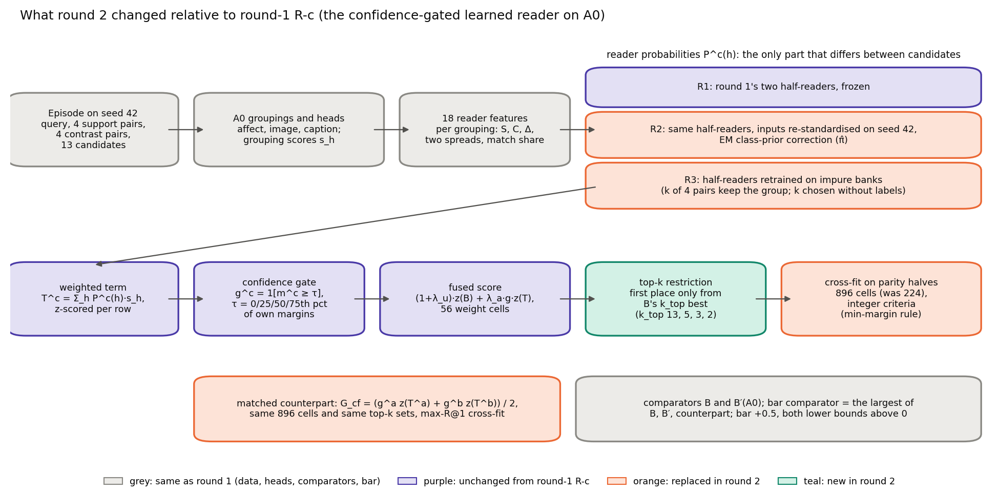
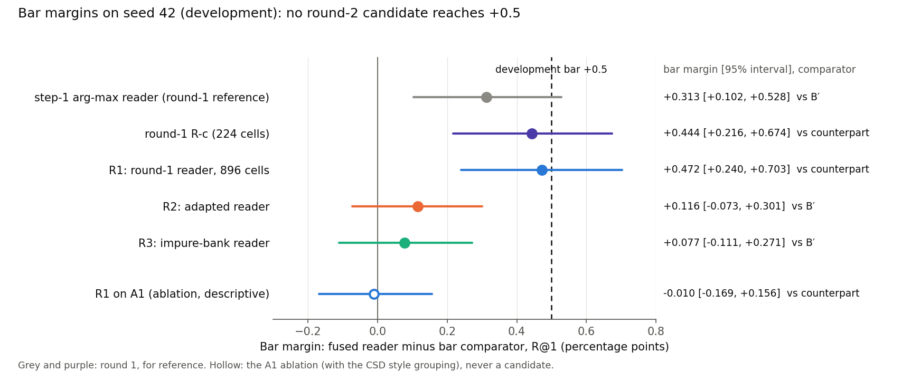
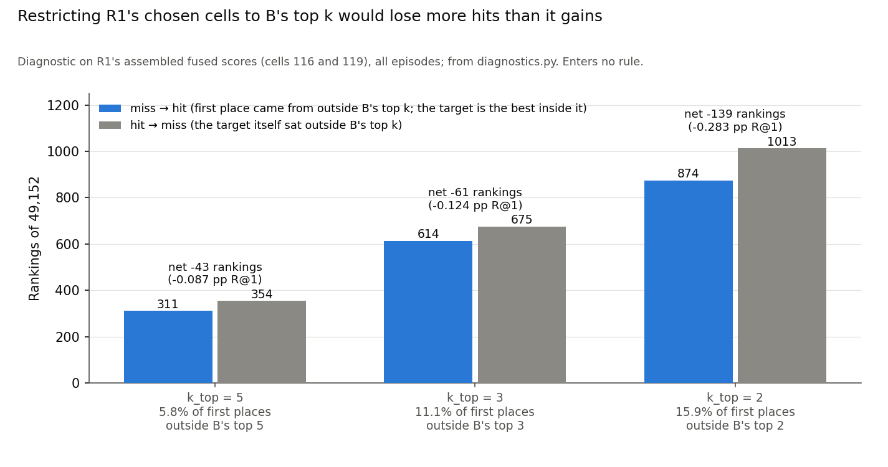
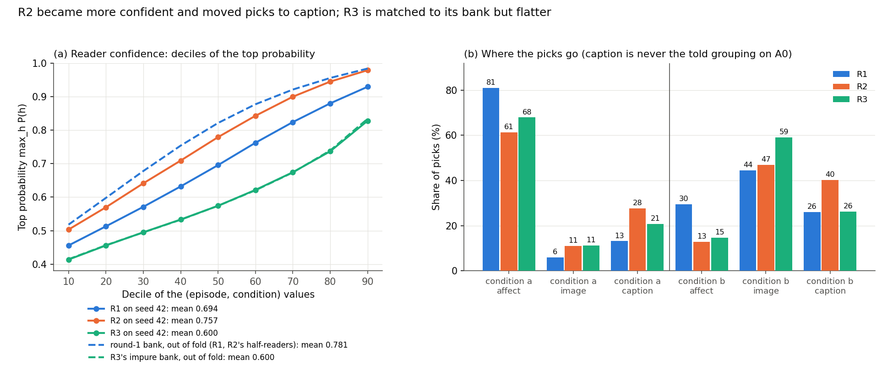
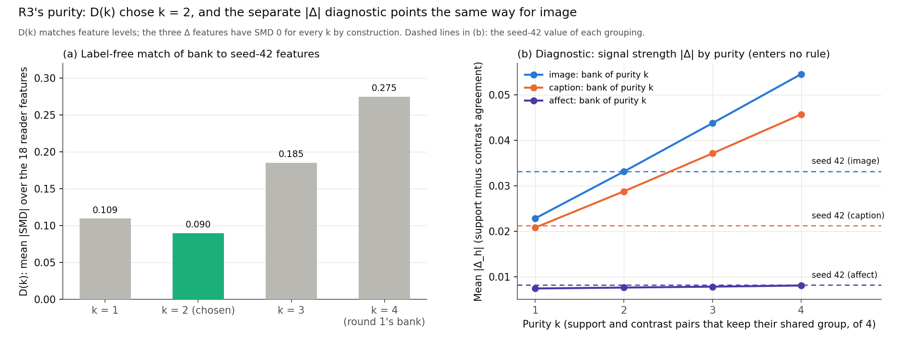
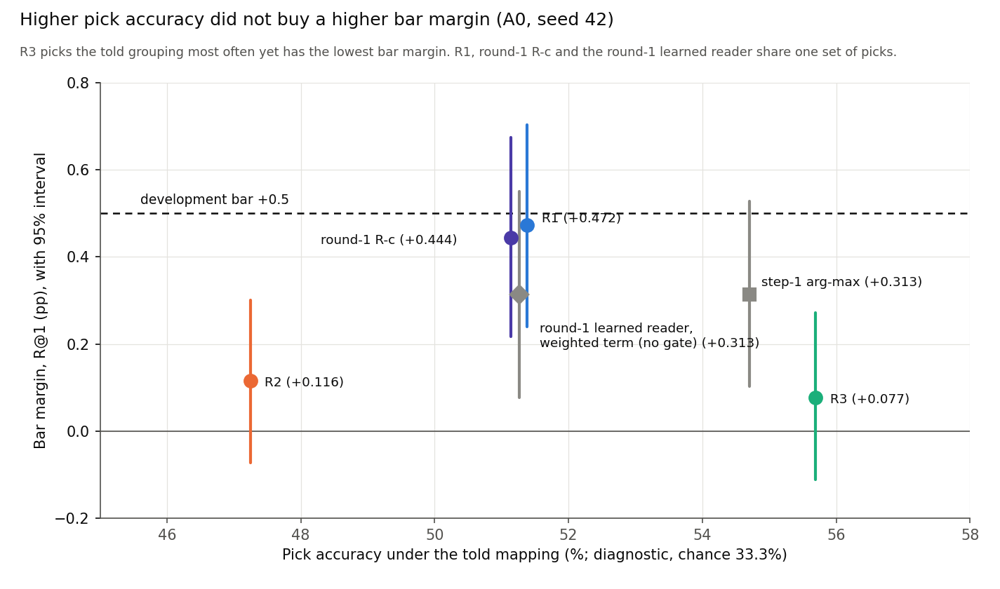
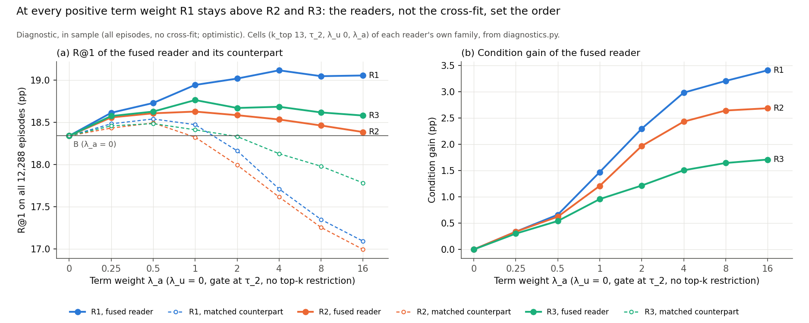

# CoSiR v2 reader fix, round 2: adapted and retrained readers with a top-k restriction (development run on seed 42)

**Report date:** 2026-11-19. Like the folder date `20261118`, this is a sequence number in this line of work, not a
calendar date. The run took place on 2026-10-06 from 15:43 (round-2 tab started) to 17:01 (A1 ablation written),
Amsterdam time; the rule was applied at 16:57.
**Status:** development selection under the committed decision rule. No candidate cleared the development bar, so under
the rule's item 5 no fresh-seed test was built and seeds 49, 50 and 51 stay unused. The seed-42 results go to the user,
who decides what follows. The whole-branch final review is scheduled after this report (rule §7 timeline).
**Records:** binding rule `src/test/20261118_reader_fix_round2/DECISION_RULE.md` (commit dc9fac6, SHA-256
368bec11…); spec `docs/superpowers/specs/2026-10-06-reader-fix-round2-design.md` (commit 7659034); run log
`20261118_reader_fix_round2_log.md`; rule check `rule_check/opus_rule_check.md`; independent re-derivation
`rederive/rd2_phase1_report.md` and `rd2_phase2_report.md`; code commits a221b64, cdf9b4d, ee48015, e0981ce, 9fc1c6d
(`results/` is gitignored). Figures, the diagnostics of §5 and their scripts are in
`docs/reports/assets/2026-11-19_reader_fix_round2/`. Paths without a folder are under
`src/test/20261118_reader_fix_round2/`. Round 1 is reported in [reader_fix_csd](2026-11-18_reader_fix_csd.md); this
report defines every term it uses.

## Summary

CoSiR v2 scores an image and a caption under an aspect that is shown only through example pairs. A label-free
**reader** estimates which pseudo-aspect grouping the example pairs share, and its weighted grouping score is fused
with B, the best condition-free score of the project. Round 1 ended with a best candidate, round-1 R-c (a confidence
gate on the learned reader's weighted term, configuration A0), at a bar margin of +0.444 [+0.216, +0.674] against its
matched counterpart, 0.056 R@1 short of the +0.5 development bar. Round 2 tested the user's two follow-ups with the gate
built into every candidate: better reader probabilities (R2, the round-1 reader adapted to real episodes without
labels; R3, the reader retrained on deliberately impure practice episodes) and a top-k restriction that lets first
place come only from B's best k_top candidates. R1, the unchanged round-1 reader, ran in the same 896-cell family.

**No candidate cleared the development bar.** The bar margins, each against its bar comparator, were:

| Candidate | Bar margin [95% interval] | Bar comparator | Gain statistic [95% interval] | Clauses met |
|---|---|---|---|---|
| R1, round-1 reader | +0.472 [+0.240, +0.703] | matched counterpart (18.447) | +2.667 [+2.325, +3.012] | 2 and 3 |
| R2, adapted reader | +0.116 [−0.073, +0.301] | B′ (18.437) | +0.918 [+0.662, +1.169] | 3 |
| R3, impure-bank reader | +0.077 [−0.111, +0.271] | B′ (18.437) | +0.954 [+0.702, +1.199] | 3 |

R1's fused reader is round-1 R-c exactly (fused R@1 18.919, paired difference 0.000): both cross-fit halves kept round
1's cells, so the top-k restriction never entered the fused score. Its +0.028 [−0.002, +0.059] over round-1 R-c came
entirely from its counterpart, whose half-1 pick moved to a top-k cell that scored 7 more hits on its tune half and
0.057 R@1 less on the other half. Both reader fixes lowered the bar margin against R1: R2 by −0.356 [−0.612, −0.106] and
R3 by −0.395 [−0.641, −0.146] R1 is round 1's seed-42 winner, so part of its lead may be selection inflation (round 1 estimated 0.1 to 0.15 R@1 for its best-of-seven choice); the sign holds in the in-sample comparison at equal freedom. R2 became more confident (mean top probability 0.694 to 0.757) and less accurate (pick
accuracy 51.3% to 47.2%), mostly by moving picks to the caption grouping, which no aspect maps to. R3 picked the told
grouping more often than any A0 reader so far (55.7%, against R1's 51.3% and the step-1 arg-max reader's 54.7%), yet had
the lowest bar margin: its probabilities were flatter and changed less between the two conditions, so its weighted term
carried about half of R1's condition gain at the same fusion settings (1.404 against 2.667, our diagnostic).

Under the rule's item 5 the seed-42 results go to the user. The options are those of round 1: design L (late-fusion
refinement of the groupings), a change of course, or another round under a new pre-registered rule (§8). The told
ceiling on A0 (+1.64 over its matched counterpart) stays far above every label-free reader. An independent
re-derivation with its own code matched all 480 compared quantities bit for bit.

*Sources: `results/rule_application.{json,txt}`, `results/cand_R{1,2,3}_A0.{json,txt}`, the run log;
`docs/reports/assets/2026-11-19_reader_fix_round2/diagnostics.json` for the value marked as our diagnostic.*

## 1. Terms and setup

**The task.** An **episode** has a **query** (one image, or one caption, of an anchor painting), 4 **support pairs**,
4 **contrast pairs** and 13 **candidates** in the other modality. The supports share a value of aspect A, the contrasts
a value of aspect B. Candidate p_A shares the query's value of A, p_B its value of B, and 11 negatives share neither.
Under **condition a** the target is p_A; under **condition b** supports and contrasts swap and the target is p_B. Each
episode gives four rankings (two conditions, two directions). The aspects are emotion, style and genre on ArtELingo,
giving three **aspect pairs**. Seed 42 is the development draw: 12,288 episodes (4,096 per pair) on 4,602 anchor
paintings of the selection rows. It has been read many times. Seeds 49, 50 and 51 were reserved for the test.

**Metrics** (per episode, averaged over its four rankings, pooled over the three pairs, in percentage points).

| Term | Meaning |
|---|---|
| R@1 | the target ranks strictly first (ties miss; chance 7.69%) |
| other-aspect rate | the other aspect's candidate ranks first |
| condition gain | R@1 minus the other-aspect rate; exactly 0 for any scorer that ignores the condition |
| either rate | R@1 plus the other-aspect rate, so **R@1 = (either + gain) / 2** |
| interval | 95% percentile interval of a bootstrap over anchor paintings (5,000 resamples, seed 42), with cross-fit choices held fixed |

**The label-free pipeline.**

| Term | Meaning |
|---|---|
| grouping | a partition of the 183,694 scorer-train rows built without evaluation labels: *affect* (Leiden communities on GoEmotions caption probabilities, 41 groups), *image* and *caption* (k-means with 64 clusters on CLIP image or caption features), *csd* (Leiden communities on CSD style embeddings, 17 groups; ablation only) |
| configuration | the groupings a reader chooses among: **A0** = (affect, image, caption), the only candidate configuration; **A1** = A0 plus csd, the descriptive ablation |
| head, s_h | a logistic regression on frozen CLIP ViT-B/32 features predicting a row's group from its image or its caption; the grouping score s_h(q, k) is the product of the query's and the candidate's posteriors |
| Δ_h | mean agreement over the 4 support pairs (S_h) minus that over the 4 contrast pairs (C_h); under condition b it is exactly −Δ_h of condition a |
| reader features | 18 numbers per (episode, condition) on A0: per grouping S, C, Δ, the spread of the support and of the contrast agreements, and the share of support pairs whose image and caption arg-max groups coincide |
| bank, half-reader | round 1's practice episodes built from the groupings on one painting half of the scorer-train rows (supports share a group of one grouping, contrasts a group of another; 49,152 per half on A0); a half-reader is a multinomial logistic regression trained on one half's bank to say which grouping the supports share |
| P^c(h), T^c | the reader's probability, under condition c, that grouping h is the shared one (mean of the two half-readers); the **weighted term** T^c = Σ_h P^c(h)·s_h |
| pick, top-two margin m^c | arg max_h P^c(h); the largest minus the second-largest P^c(h) |
| told mapping, pick accuracy | the evaluation-label map aspect → grouping (A0: emotion → affect, style → image, genre → image); pick accuracy is how often the pick equals the told grouping (chance 1/3 on A0). It is a diagnostic and enters no rule |
| told ceiling | the scorer told the right grouping: +1.64 [1.37, 1.92] R@1 over its matched counterpart on A0 |

**Fusion, comparators and the decision.**

| Term | Meaning |
|---|---|
| B | the best condition-free score of the project (cosine, the method-A factor term and an averaged head agreement, fused with cross-fitted weights). Seed 42: R@1 18.341 [17.975, 18.697] |
| B′ | B rebuilt with the averaged agreement taken over A0's own groupings: 18.437 (A1: 18.805) |
| gate, τ | g^c = 1 if m^c ≥ τ, else 0; τ is the 0th, 25th, 50th or 75th percentile (τ_0 to τ_3) of the reader's own seed-42 margins, so τ_0 leaves the gate always open |
| top-k restriction, k_top | first place may come only from B's k_top best candidates of the ranking row (k_top ∈ {13, 5, 3, 2}; 13 means no restriction) |
| cell | one (k_top, τ, λ_u, λ_a); the fused score is (1 + λ_u)·z(B) + λ_a·g^c·z(T^c), with z a per-row z-score; 4 × 4 × 56 = 896 cells |
| cross-fit | episodes split by index parity; each half picks a cell (the tune half) and scores the other half |
| matched counterpart, G_cf | the same family with the gated term replaced by its two-condition mean G_cf = (g^a z(T^a) + g^b z(T^b)) / 2, which removes only the condition; it picks its cells by the highest R@1, the most favourable rule for a control |
| margin, bar comparator, bar margin | fused minus counterpart R@1, paired per anchor; the bar comparator is whichever of B′, the counterpart and B has the largest mean R@1; the bar margin is fused minus bar comparator, paired per anchor |
| gain statistic | the fused reader's condition gain minus its counterpart's (0), so its gain over B, B′ and the counterpart alike |
| development bar | clears if (1) the bar margin's point estimate is at least +0.5, (2) its lower bound is above 0 and (3) the gain statistic's lower bound is above 0, at full precision |
| round-1 R-c | round 1's best candidate: the gate on the learned reader's weighted term on A0, 224 cells (k_top 13 only) |

*Sources: `DECISION_RULE.md` §1 (glossary), §2, D1 to D13; round 1's report §1.*

## 2. How we got here

**Where this line began.** Round 1 (run 2026-10-06 02:51 to 03:43) tested seven candidates on seed 42 and none cleared
the bar. The best, round-1 R-c, reached +0.444 [+0.216, +0.674] against its matched counterpart, with a gain statistic
of +2.667 [+2.325, +3.012]. The spec named two weak points. **Picks:** the learned reader picked the told grouping in
51.3% of conditions on A0, against about 79% on its own practice episodes, while the told ceiling (+1.64) sat far above
the reader's +0.444. **Promoted low-ranked candidates:** since R@1 = (either + gain) / 2, demoting the other aspect's
candidate below a negative is R@1-neutral; what costs R@1 is failing to put the target first, or putting first a
candidate that B ranked low.

**The user's decision** (2026-10-06): test both improvement families, better reader probabilities and a top-k
restriction, with the confidence gate built into every candidate; develop on A0 and keep A1 as a descriptive ablation;
a fresh Opus check of the rule instead of an ARS round; design L later; results as early as possible.

**The spec and the rule.** The spec (commit 7659034, 15:27) fixed three readers that differ only in P^c(h), one 896-cell
family for all of them, round 1's bar and comparators, and a regression check. The rule was written from it at 15:35.
A fresh Opus checker (dispatched 15:44, report 16:09) found 2 blocking, 7 should-fix and 9 nit findings. The most
consequential was blocking finding B1: the cross-fit criterion, compared as floating-point means, can order exactly
tied cells differently from exact arithmetic (on round-1 R-c's 224 cells, 12 cell pairs on tune half 0 were ordered
differently, and four cells tied at the maximum), so two correct implementations could pick different cells. The rule
now compares integer hit counts (§3.4). B2 corrected the names of R3's bank arrays. All 18 findings were applied and the
rule was committed at 16:13 (dc9fac6) before any code existed. Its prior was that a GO was "moderate at best".

**Implementation, checks and runs** (Amsterdam time, from the run log).

| Time | Step |
|---|---|
| 16:13 | rule committed (dc9fac6) |
| 16:15 | fusion stream (Sonnet) and reader stream (Opus) dispatched in parallel |
| 16:31 | independent re-derivation, phase 1 (no candidate number): regression check exact; μ42, σ42, π̂, D(k), k* = 2, R3's chosen C |
| 16:36 | fusion stream done (22 tests); task review 16:38: approved, 0 critical, 0 important, 8 minor |
| 16:39 | **regression check passed**: R1 on cells 0 to 223 reproduces round-1 R-c exactly (34 comparisons) |
| 16:40 | reader stream done (21 tests, 23 of 23 mutations caught); R2 and R3 reader stages launched alongside its task review |
| 16:41 | R1 on 896 cells: bar margin +0.472 against the counterpart; R2 reader stage done (R3 at 16:42) |
| 16:44 | R2 and R3 on 896 cells: +0.116 and +0.077 against B′ |
| 16:55 | re-derivation, phase 2: all 480 compared quantities identical |
| 16:57 | **rule applied**: no candidate clears; no test; A1 ablation on R1 as the best development candidate, not carried |
| 17:01 | A1 ablation written (descriptive) |

All three candidates had development numbers by 16:44 on Tuesday, two days before the Thursday 12:00 cutoff, so the
rule was applied as soon as the re-derivation agreed.

*Sources: spec §1; `DECISION_RULE.md` header and §7; `rule_check/opus_rule_check.md` (counts, B1 and B2); the run log
(all times); `.superpowers/sdd/2026-10-06-reader-fix-round2/task-{1,2}-{report,review}.md`.*

## 3. What changed and how the candidates were built

*Figure 1. Round 2 against round-1 R-c. Grey: the same as round 1 (data, heads, comparators, bar). Purple: unchanged
parts of round-1 R-c. Orange: replaced. Teal: new. Only the reader probabilities differ between the three candidates.*

### 3.1 The three readers

All three use the same 18 seed-42 features (round 1's `rb_eval.seed42_features`, standard heads) and the weighted term
T^c = Σ_h P^c(h)·s_h. Scoring by the top pick alone was dropped because on A0 in round 1 it gave +0.144 against the
weighted scoring's +0.313.

- **R1, the round-1 learned reader.** Round 1's two A0 half-readers (each a `StandardScaler` fitted on its half's bank
  and a multinomial logistic regression, C 1.0 and 100.0; out-of-fold bank accuracy 79.7% and 79.1%), frozen, with
  their probabilities averaged. On the k_top = 13 cells R1 is round-1 R-c exactly.
- **R2, the adapted reader.** The same half-readers, with two label-free changes. (a) Re-standardisation: each
  half-reader's input scaler is replaced by the mean μ42 and standard deviation σ42 of the 24,576 seed-42 feature rows
  (both conditions); the fitted coefficients do not change. (b) An EM class-prior correction (Saerens, Latinne and
  Decaestecker, 2002) estimates the prior π̂ of the three groupings on the unlabelled seed-42 values, starting from the
  bank's uniform prior, and reweights the averaged probabilities by π̂(h)/π_train(h). μ42, σ42 and π̂ were written
  before any R2 score and would have been frozen for the test. A code check (R2's code with each half's own scaler and
  no EM reproduces R1 to within 1e-12 with identical picks) ran first; it was exact (difference 0).
- **R3, the realistic-practice reader.** Round 1's recipe retrained on round 1's A0 banks made impure. In a bank of
  purity k, only k of the 4 support pairs and k of the 4 contrast pairs keep their shared group; the other 4 − k are
  replaced by random cross-painting image-caption pairs from the same half (seeds 21700 and 21800, nested across k).
  k is chosen without labels as the k whose bank features best match seed 42: D(k), the mean over the 18 features of
  the absolute standardised mean difference, smallest wins. The rule disclosed beforehand that D(k) matches feature
  levels: the three Δ features have a difference of 0 for every k by construction.

### 3.2 The fusion family: gate, top-k restriction and 896 cells

Every term is z-scored per ranking row over the 13 candidates before the gate. Each reader gets its own thresholds τ_0
to τ_3 from its own seed-42 margins (R1: 3.9e-5, 0.217, 0.480, 0.750, equal to round 1's; R2: 3.8e-5, 0.291, 0.599,
0.862; R3: 3.4e-5, 0.125, 0.285, 0.497). The restriction keeps the scores of B's k_top best candidates and places every
other candidate at least 1 below the lowest of them, in B's order, so first place always comes from the top-k set.
Since B is condition-free, the top-k set is the same under both conditions, and the restricted counterpart stays
condition-free (asserted per cell). The 896 cells are ordered k_top (13, 5, 3, 2), then τ, then λ_u, then λ_a, and
every tie goes to the lowest cell number, so no restriction and no gate win ties. Cells 0 to 223 are round-1 R-c's 224
cells in round 1's order.

*Table 1. Share of (episode, condition) values with the gate open at τ_2 (label-free).*

| Reader | Overall | Condition a | Condition b |
|---|---|---|---|
| R1 | 50% | 64.4% | 35.6% |
| R2 | 50% | 56.1% | 43.9% |
| R3 | 50% | 53.2% | 46.8% |

### 3.3 The matched counterpart and the bar comparator

The counterpart keeps every ingredient (the reader's own z-scored terms, gates, thresholds, top-k sets and the same 896
cells) and replaces the gated term by G_cf. Each tune half picks the counterpart cell with the most hits, so the control
has at least the fused reader's freedom. The bar comparator is the strongest of B′, the counterpart and B on seed 42,
the same for every aspect pair.

### 3.4 Exact cross-fit criteria

Every per-episode R@1 and gain is a multiple of 0.25, so the rule counts hits. On a tune half of 6,144 episodes (24,576
rankings), ρ is the number of hit rankings and γ the hits minus the other-aspect hits. The control takes the smallest σ*
among the 30 sums λ_u + λ_a with the most hits of (1 + σ)·z(B) (σ* = 0 on both halves for every candidate; ρ_ctrl 4,532
on half 0 and 4,483 on half 1). The fused reader takes the cell with the largest min(ρ − ρ_ctrl, γ), the counterpart the
cell with the largest ρ, both compared as integers with ties to the lowest cell. On round 1's 224 cells this gives round
1's picks (fused 116 and 119, counterpart 58 and 123), so the change of arithmetic changed no round-1 number.

### 3.5 The regression check

Before any full-data round-2 candidate number existed, R1 restricted to cells 0 to 223 had to reproduce round-1 R-c: its terms,
margins, picks and thresholds, the chosen cells, all ten per-anchor arrays and the bar margin +0.4435221354166667
[0.21646171563312194, 0.6735669710776852] with the gain statistic 2.667236328125 [2.325087836946873,
3.012361650695922], at full precision. All 34 comparisons were exact (16:39). R1's full result minus round-1 R-c is
therefore the effect of the top-k restriction alone, and R2 and R3 against R1 are the effects of the reader fixes.

*Sources: `DECISION_RULE.md` §4.1 to §4.7; `results/tau_R{1,2,3}_A0.json`; `results/cand_R{1,2,3}_A0.json`
(`gate_open_share`, `crossfit`); `results/probs_R2_A0.json` (`code_check`); `results/regression_check.json`.*

## 4. Results

### 4.1 The main table

*Table 2. Seed 42, development, configuration A0. B = 18.341 and B′ = 18.437 for every row. Margin and bar margin are
R@1; "either" is the fused reader's either rate minus its counterpart's. Round-1 R-c is the previous best, shown for
reference.*

| Candidate | Fused R@1 | Counterpart R@1 | Margin | Bar margin (comparator) | Gain statistic | Either | Pick accuracy |
|---|---|---|---|---|---|---|---|
| round-1 R-c (reference) | 18.919 | 18.475 | +0.444 [+0.216, +0.674] | +0.444 [+0.216, +0.674] (counterpart) | +2.667 [+2.325, +3.012] | −1.780 | 51.3% |
| **R1** | **18.919** | 18.447 | +0.472 [+0.240, +0.703] | **+0.472 [+0.240, +0.703]** (counterpart) | +2.667 [+2.325, +3.012] | −1.723 [−2.048, −1.389] | 51.3% [50.7, 51.8] |
| R2 | 18.553 | 18.290 | +0.262 [+0.092, +0.434] | +0.116 [−0.073, +0.301] (B′) | +0.918 [+0.662, +1.169] | −0.393 [−0.640, −0.140] | 47.2% [46.7, 47.8] |
| R3 | 18.514 | 18.427 | +0.087 [−0.104, +0.276] | +0.077 [−0.111, +0.271] (B′) | +0.954 [+0.702, +1.199] | −0.779 [−1.076, −0.494] | 55.7% [55.1, 56.3] |

*Table 3. Cells chosen by the cross-fits (cell number: k_top, τ index, λ_u, λ_a). Each half's cell scores the other
half.*

| Candidate | Fused, tune half 0 | Fused, tune half 1 | Counterpart, tune half 0 | Counterpart, tune half 1 |
|---|---|---|---|---|
| round-1 R-c | 116: 13, τ_2, 0, 2 | 119: 13, τ_2, 0, 16 | 58: 13, τ_1, 0, 0.5 | 123: 13, τ_2, 0.5, 1 |
| R1 | 116: 13, τ_2, 0, 2 | 119: 13, τ_2, 0, 16 | 58: 13, τ_1, 0, 0.5 | **571: 3**, τ_2, 0.5, 1 |
| R2 | 67: 13, τ_1, 0.5, 1 | **615: 3**, τ_2, 16, 16 | **278: 5**, τ_0, 16, 8 | 155: 13, τ_2, 8, 1 |
| R3 | 55: 13, τ_0, 16, 16 | **574: 3**, τ_2, 0.5, 8 | 157: 13, τ_2, 8, 4 | 156: 13, τ_2, 8, 2 |

The rule's verdict, clause by clause: R1 met clauses 2 and 3 and missed clause 1 (+0.4720 < +0.5); R2 and R3 met
clause 3 only. With no candidate clearing, the carry step had nothing to carry. Against B alone the fused readers
reached +0.578 [+0.358, +0.811] (R1), +0.212 [+0.029, +0.394] (R2) and +0.173 [−0.026, +0.381] (R3). The bar
comparator is the strongest of B, B′ and the counterpart, so these numbers change no verdict. External baselines on
seed 42 were cosine 12.96 and RCA 13.38 (the strongest raw metric learned from the example pairs).

R1's bar margin of +0.4720 is a net 232 of the 49,152 seed-42 rankings; +0.5 needs 246, so R1 fell 14 rankings short
(round-1 R-c fell 28 short). Against the step-1 arg-max reader on A0 (bar margin +0.313 [+0.102, +0.528]), the paired
bar-margin differences were +0.159 [−0.118, +0.438] for R1, −0.197 [−0.387, −0.008] for R2 and −0.236 [−0.436, −0.026]
for R3.

*Figure 2. Bar margins with 95% intervals and their comparators. The dashed line is the development bar. The step-1
arg-max reader and round-1 R-c are round 1's, for reference; the hollow marker is the A1 ablation (§4.4).*

*Sources: `results/cand_R{1,2,3}_A0.{json,txt}` (`r1_means`, `margin`, `bar`, `gain_statistic`, `fused_vs_B`,
`pick_accuracy`, `crossfit`, `vs_step1_argmax`); `results/rule_application.json` (clauses); round 1's
`results/cand_Rc_Rb_expected_A0.json`. The ranking counts (232, 246, 14) are our arithmetic from the stored bar margin.*

### 4.2 Per aspect pair

*Table 4. Bar margins per aspect pair, with each candidate's pooled bar comparator, and the gain statistic per pair.
Descriptive; per-pair results are not tested and change no verdict.*

| Candidate | emotion × style | emotion × genre | style × genre | Gain per pair (e×s / e×g / s×g) |
|---|---|---|---|---|
| round-1 R-c | +0.708 [+0.326, +1.067] | +1.221 [+0.799, +1.647] | −0.598 [−0.966, −0.225] | +0.964 / +5.249 / +1.788 |
| R1 | +0.745 [+0.363, +1.108] | +1.270 [+0.850, +1.693] | −0.598 [−0.972, −0.221] | +0.964 / +5.249 / +1.788 |
| R2 | +0.311 [+0.006, +0.618] | +0.342 [−0.006, +0.699] | −0.305 [−0.630, +0.031] | +0.574 / +1.794 / +0.385 |
| R3 | +0.507 [+0.212, +0.795] | +0.232 [−0.120, +0.591] | −0.507 [−0.840, −0.174] | +0.629 / +1.904 / +0.330 |

R1's per-pair bar margin point estimates differ from round-1 R-c's only on the two emotion pairs, through its
counterpart; on style × genre both are −0.598 (14 episodes differ, which moves the interval only). Both reader fixes lost most on emotion × genre, where round 1's reader had bought its largest
gain (+5.249): R2 kept +1.794 and R3 +1.904 of it. R3's emotion × style bar margin (+0.507) is the only per-pair value
of a round-2 fix above +0.5, and it is not tested. Every candidate stayed negative on style × genre, as every A0 and A1
reader of round 1 did.

*Sources: `results/cand_R{1,2,3}_A0.json` (`bar.per_pair_r1`, `bar.per_pair_gain`); round 1's
`cand_Rc_Rb_expected_A0.json`.*

### 4.3 Paired differences of the rule's item 2

*Table 5. Paired per anchor, with 95% intervals. They decide nothing.*

| Difference | Fused R@1 | Margin | Bar margin | What it measures |
|---|---|---|---|---|
| R1 − round-1 R-c | +0.000 [+0.000, +0.000] | +0.028 [−0.002, +0.059] | +0.028 [−0.002, +0.059] | the top-k restriction alone |
| R2 − R1 | −0.366 [−0.581, −0.149] | −0.210 [−0.450, +0.032] | −0.356 [−0.612, −0.106] | the adaptation, same family |
| R3 − R1 | −0.405 [−0.624, −0.186] | −0.385 [−0.633, −0.123] | −0.395 [−0.641, −0.146] | the impure-bank retraining, same family |

**R1 against round-1 R-c.** The fused difference is exactly 0 on every episode: both fused cross-fit halves chose round
1's cells 116 and 119 again among 896. The whole +0.028 comes from the counterpart. On tune half 1 its max-R@1 rule
moved from cell 123 (k_top 13, 4,502 hits) to cell 571, the same τ_2 and weights (0.5, 1) with k_top 3 (4,509 hits).
Applied to the other half, cell 571 scored 18.656 against 18.713 for cell 123, so the counterpart's R@1 fell from 18.475
to 18.447 and the bar margin rose by the same 0.028. The reader did not improve; the control's extra freedom chose worse
out of sample.

**R2 and R3 against R1.** Both reader fixes lowered the fused R@1 by about 0.37 to 0.40 and the bar margin by about
0.36 to 0.40, with intervals that exclude 0. R1 is round 1's seed-42 winner, so part of its lead (round 1 estimated 0.1 to 0.15 R@1 for its best-of-seven choice) may be selection inflation; the sign holds in the in-sample comparison at equal freedom. §5 analyses why.

*Sources: `results/rule_application.json` (`diagnostics_decide_nothing`); `rederive/rd2_phase2_report.md` §3 (the same
numbers by independent code); `results/cand_R1_A0.json` (`crossfit.cells.integer_criteria`); the other-half R@1 of cells
571 and 123 is our diagnostic (`diagnostics.json`, `readers.R1.cells.cf_tune1`).*

### 4.4 The A1 ablation

The rule's §4.8 runs the ablation on the carried candidate, or, when nothing is carried, on the candidate with the
largest bar margin, labelled "best development candidate, not carried". That was R1. R1/A1 uses round 1's A1
half-readers on (affect, image, caption, csd) with the same 896-cell family and its own thresholds.

| | Fused R@1 | Counterpart R@1 | B′(A1) | Bar margin (comparator) | Gain statistic | Pick accuracy |
|---|---|---|---|---|---|---|
| R1/A1 | 18.970 | 18.980 | 18.805 | −0.010 [−0.169, +0.156] (counterpart) | +0.535 [+0.336, +0.729] | 48.7% (chance 25%) |
| A1 − A0, paired | +0.051 [−0.236, +0.336] | | | −0.482 [−0.747, −0.214] | | |

Adding csd left the fused R@1 within noise of A0 and lowered the bar margin by 0.482, because the comparator rose with
it: R1/A1's counterpart (18.980) sat 0.533 above R1/A0's (18.447). Both R1/A1 fused cells were k_top 13 at τ_0 (cells 12
and 45), so neither the gate nor the restriction entered. Our diagnostic shows that R1/A1's fused arrays are identical
to round 1's "R-b expected" on A1 (fused 18.970, gain +0.535). Its counterpart is stronger than round 1's by +0.108
[+0.024, +0.192]: it averages the z-scored terms (G_cf at τ_0, cell 11 on both halves) where round 1's counterpart
z-scored the averaged term. That is why the bar margin fell from round 1's +0.098 to −0.010. The ablation is
descriptive and decides nothing; it leaves the CSD question where round 1 left it.

*Sources: `results/cand_R1_A1.{json,txt}`; `results/a1_ablation_R1.json`; the run log (17:01); the comparison with
round 1's `results/cand_Rb_expected_A1.npz` is our diagnostic (`diagnostics.json`, `a1_vs_round1_Rb_expected_A1`).*

## 5. Why the candidates moved, or did not

Everything in this section beyond the stored results is **our own diagnostic**, computed for this report by
`docs/reports/assets/2026-11-19_reader_fix_round2/diagnostics.py` after the rule was applied. It decides nothing. The
script rebuilds each candidate's 896-cell statistics from the stored probabilities with round 2's own fusion code and
first asserts that it reproduces the stored terms, picks, margins, thresholds, chosen cells and per-anchor arrays
exactly; it also checks that R1 restricted to k_top 13 equals round-1 R-c's stored arrays. Where a number below is
in-sample (all 12,288 episodes, no cross-fit), we say so; such numbers are optimistic.

### 5.1 The top-k restriction did not help

**Where the cross-fit chose it.** Four of the twelve cross-fit picks used k_top < 13 (Table 3). Each time the restricted
cell beat its k_top 13 alternatives on the tune half by a few rankings and did worse on the other half.

*Table 6. Every chosen restricted cell beside the best k_top 13 cell of the same tune half (our diagnostic). "Tune"
is the criterion on the tune half: min(ρ − ρ_ctrl, γ) for the fused reader, ρ for the counterpart, in rankings of
24,576. "Other half" is R@1 on the other half's 6,144 episodes.*

| Pick | Restricted cell: tune / other half | Best k_top 13 cell: tune / other half | Other-half change |
|---|---|---|---|
| R1 counterpart, tune half 1 | 571 (k 3): 4,509 / 18.656 | 123: 4,502 / 18.713 | −0.057 |
| R2 fused, tune half 1 | 615 (k 3): 86 / 18.604 | 167: 75 / 18.717 | −0.114 |
| R2 counterpart, tune half 0 | 278 (k 5): 4,602 / 18.119 | 36: 4,600 / 18.180 | −0.061 |
| R3 fused, tune half 1 | 574 (k 3): 96 / 18.632 | 115: 86 / 18.937 | −0.305 |

The tune-half advantages were 2 to 11 rankings of 24,576 on the tune-half criterion, and the other-half loss was larger
every time. Allowing k_top < 13 changed the bar margin by +0.028 [−0.002, +0.059] for R1 (through its
counterpart), −0.057 [−0.121, +0.006] for R2 and −0.153 [−0.240, −0.062] for R3. Restricted to the k_top 13 cells, R2
would have reached +0.173 [−0.022, +0.369] and R3 +0.230 [+0.047, +0.413] against B′, both still far from +0.5 and below
R1. Over all 896 cells, in sample on all 12,288 seed-42 episodes (no cross-fit), the best fused cell was a k_top 13 cell for
every reader (cells 117, 67 and 167), and the best restricted cell was lower (18.976, 18.683 and 18.728 against 19.116,
18.703 and 18.766).

**Why it had little to gain.** The spec's premise was that the fused reader loses R@1 by putting first a candidate that
B ranked low. At R1's chosen cells, 11.1% of the 49,152 first places came from outside B's top 3, and 12.3% of those
were hits, against 18.9% for all first places. Restricting the same scores to B's top 3 would turn 614 of those rankings
into hits but would also lose 675 hits, the rankings where the target itself sat outside B's top 3 and the reader had
correctly lifted it to first place (59.9% of targets sit outside B's top 3). The net is −61 rankings (−0.124 R@1); at
k_top 5 it is −43 and at k_top 2 −139 (Figure 3). The candidates the reader promoted from deep in B's order were right
about as often as the candidates the restriction would put in their place (12.3% against 11.2%, 614 of 5,472), so the
restriction takes away about as many hits as it creates.

*Figure 3. At R1's assembled fused scores (cells 116 and 119, all episodes), the rankings that restricting first place
to B's top k would turn from miss to hit (blue) and from hit to miss (grey). In-sample diagnostic.*

*Sources: `diagnostics.json` (`readers.<R>.cells`, `k13_only`, `topk_effect_896_minus_k13`, `readers.R1.ranks`).*

### 5.2 R2: more confident, less accurate

**What the adaptation found.** The shift report shows that seed-42 features differ from the bank in level and spread.
Per half-reader, seed 42's S and C sit 0.20 (affect), 0.36 to 0.37 (image) and 0.48 to 0.49 (caption) bank standard
deviations below the bank's means, and the image and caption match shares 0.27 to 0.38 below. Seed 42's spread is about
the bank's for affect (σ42 over the bank scale 0.93 to 1.13) but much narrower for image (0.62 to 0.74) and caption
(0.48 to 0.62). The EM step found a prior close to uniform, π̂ = (0.340, 0.312, 0.348) for (affect, image, caption),
after 39 updates without reaching the cap.

**What it did to the probabilities.** Dividing by σ42 instead of the bank's scale stretches the image features by about
1.6 and the caption features by about 2 (S, C and Δ) in the reader's units, so the logits spread and the reader grows
more confident: the mean top probability rose from 0.694 (R1) to 0.756 before EM and 0.757 after, close to the bank's
out-of-fold 0.781 (Figure 4a). EM changed little: the share of picks that differ from R1 was 21.2% before EM and 21.6%
after. Re-centring lifted the caption features most (they sat furthest below the bank), and the picks moved toward
caption: caption picks rose from 19.6% to 33.9% of all (episode, condition) values (condition a 13.2% to 27.6%,
condition b 26.0% to 40.3%), and affect picks in condition a fell from 80.9% to 61.4% (Figure 4b). Caption is never the
told grouping on A0, so pick accuracy fell from 51.3% to 47.2%.

**What it did to the fused score.** R2's probabilities changed more between the two conditions than R1's (mean total
variation between P^a and P^b 0.732 against 0.591), but little of the extra change went toward the told groupings. On
the two emotion pairs, where the two conditions have different told groupings, the told contrast (the probability that
moves toward each condition's own told grouping, averaged over the two) rose only from 0.361 to 0.376 while the total
variation there rose from 0.589 to 0.734. At round-1 R-c's cells, R2 bought a gain of +2.222 and paid −2.226 in either
rate, a margin of −0.002, where R1 bought +2.667 for −1.780 (Table 7). Our reading, not tested: probability on caption,
a grouping aligned with no aspect, promotes candidates that share the query's caption cluster, which are mostly
negatives, so it costs either rate without buying R@1. The cross-fit responded with low term weights (cells 67 and 615,
term weight relative to B 0.67 and 0.94), which held the either cost to −0.393 and the gain to +0.918. R2's counterpart
(18.290) fell below B′ (18.437), so B′ set the bar.

*Figure 4. (a) Deciles of the top probability on seed 42 for R1, R2 and R3, with the out-of-fold values on each
reader's own bank (dashed). (b) Share of picks per grouping and condition.*

*Sources: `results/probs_R2_A0.json` (`shift_report`: per-half offsets and scale ratios, π̂ and iterations, top
probability before and after EM, changed picks, pick shares); `rederive/rd2_phase1_report.md` §4 (picks changed before
EM, 21.18%); `results/cand_R{1,2}_A0.json` (`pick_share`, `pick_accuracy`, `crossfit`); total variation and the values
at round-1 R-c's cells from `diagnostics.json`.*

### 5.3 R3: more accurate picks, less condition signal

**The choice of purity.** D(k) was 0.109, 0.090, 0.185 and 0.275 for k = 1 to 4, so k* = 2: half of the support pairs
and half of the contrast pairs keep their shared group (Figure 5a). The rule's disclosure applies: D(k) matches feature
levels, and round 1's bank (k = 4) sat furthest from seed 42 because seed-42 agreements are lower. The separate signal
diagnostic, mean |Δ_h|, points the same way for image (seed 42 0.0332, bank at k = 2 0.0331) and nearer k = 1 for
caption (0.0212 against 0.0208), while affect's |Δ| barely moves with purity (0.0074 to 0.0080 against 0.0081)
(Figure 5b).

*Figure 5. (a) D(k) for the four purities; k = 2 was chosen. (b) Mean |Δ_h| on the bank of each purity against its
seed-42 value (dashed). Panel (b) enters no rule.*

**The retrained reader.** Cross-validation chose C 100 on half 0 and C 10 on half 1, both near ties (gaps of 3.8e-6 and
3.1e-6 in mean log loss). Out of fold the half-readers recovered the shared grouping of the impure bank 62.0% and 61.5%
of the time (chance 33.3%; round 1's pure bank 79.7% and 79.1%). Their mean top probability was 0.600 on the bank and
0.600 on seed 42: unlike round 1's learned readers, it was as confident on real episodes as on its practice episodes.
The two half-readers agreed on 98.5% (condition a) and 98.1% (condition b) of seed-42 picks.

**Why better picks did not help** (Figure 6). R3 picked the told grouping in 55.7% of conditions, more than R1 (51.3%)
and the step-1 arg-max reader (54.7%), yet its bar margin was the lowest of the round. Four facts from the data bear on
this.

1. *The gain came from condition b and cost condition a.* R3's accuracy rose in every condition b (emotion × style
   36.8% to 52.6%, emotion × genre 50.8% to 65.1%, style × genre 45.8% to 59.6%, image each time) and fell in the two
   emotion conditions a (79.8% to 65.9% and 85.6% to 75.1%, affect). The emotion pairs are where R1 had bought its gain.
2. *Pick accuracy counts only the arg max; the weighted term uses the whole distribution.* R3's probabilities were
   flatter (mean top probability 0.600 against 0.694) and closer between the two conditions: the mean total variation
   between P^a and P^b was 0.506 against R1's 0.591, and on the emotion pairs the told contrast (§5.2) was 0.315
   against 0.361. As a result T^a and T^b were more alike: the mean per-row
   correlation of z(T^a) and z(T^b) over the 13 candidates was 0.753 (image query) and 0.799 (caption query), against
   0.628 and 0.687 for R1 (the values round 1 reported).
3. *Less contrast between the conditions, less condition gain.* At round-1 R-c's cells, R3's gain
   was +1.404 against R1's +2.667 and its either cost −1.038 against −1.780, a margin of +0.183 against +0.444
   (Table 7). Along the term weight at τ_2 (in-sample, Figure 7b) R3's gain was the lowest of the three readers from
   λ_a = 0.25 upwards and levelled off near +1.7, while R1's reached +3.4.
4. *The gate was not the problem.* With the gate open at τ_2, R3's picks were right 66.2% of the time against 45.2% when
   closed (R1: 60.6% against 41.9%), so the gate still selected R3's better picks. It released a term that carried
   less contrast between the conditions.

The cross-fit then chose differently on the two halves: no gate with λ_u = λ_a = 16 on tune half 0 (term weight relative
to B 0.94), and the k_top 3 cell 574 on tune half 1, which did worse on the other half than the best k_top 13 cell
(18.632 against 18.937; §5.1). The gain statistic ended at +0.954 against R1's +2.667, and the bar margin at +0.077
against B′.

*Figure 6. Pick accuracy under the told mapping against the bar margin (95% intervals) for the readers of both rounds on
A0. R1, round-1 R-c and the round-1 learned reader without the gate share one set of picks; they are drawn 0.12 apart.*

*Sources: `results/r3_k_A0.json` (`D`, `smd`, `k_star`, `mean_abs_delta`); `results/probs_R3_A0.json` (`half_readers`,
`top_probability`, `half_reader_pick_agreement_seed42_percent`); `results/cand_R{1,3}_A0.json`
(`pick_accuracy.per_pair_condition`, `crossfit`); total variation, told contrast, row correlations, gate-split accuracy
and the values at round-1 R-c's cells from `diagnostics.json` (`readers.<R>.reader`, `at_round1_Rc_cells`).*

### 5.4 The three readers at the same fusion settings

The cross-fit chose different cells for each reader, so part of the gap between them could come from the cell choice.
Two checks hold the fusion settings fixed.

*Table 7. Each reader scored with round-1 R-c's cells (fused 116 and 119, counterpart 58 and 123), each with its own
thresholds at the same percentiles (our diagnostic, cross-fitted as in round 1).*

| Reader | Fused R@1 | Counterpart R@1 | Margin | Bar margin (comparator) | Gain | Either | Either cost per unit of gain |
|---|---|---|---|---|---|---|---|
| R1 | 18.919 | 18.475 | +0.444 | +0.444 [+0.216, +0.674] (counterpart) | +2.667 | −1.780 | 0.67 |
| R2 | 18.429 | 18.431 | −0.002 | −0.008 [−0.256, +0.232] (B′) | +2.222 | −2.226 | 1.00 |
| R3 | 18.589 | 18.406 | +0.183 | +0.153 [−0.066, +0.375] (B′) | +1.404 | −1.038 | 0.74 |

Since margin = (gain − either cost) / 2, a reader pays off only when its either cost per unit of gain stays well below
one. R1 paid 0.67, R3 0.74 on about half the gain, and R2 paid all of its gain back. Along the term weight (Figure 7,
in-sample, τ_2, λ_u = 0, no restriction), R1's fused R@1 was above R2's and R3's at every positive weight, peaking at
19.116 (λ_a = 4) against 18.628 for R2 and 18.764 for R3 (both at λ_a = 1). The best in-sample cell of the whole family
gave the same order (19.116, 18.703, 18.766). On these checks the ordering of the candidates comes from the readers;
the cross-fit did not hide a better setting for R2 or R3.

*Figure 7. In-sample R@1 (a, solid: fused reader; dashed: matched counterpart) and condition gain (b) along the term
weight λ_a, at k_top 13, τ_2 and λ_u = 0, for each reader. Diagnostic, optimistic (no cross-fit).*

*Sources: `diagnostics.json` (`readers.<R>.at_round1_Rc_cells`, `curve_tau2_lu0_k13`, `in_sample_best`).*

## 6. Verification

**The rule check.** A fresh Opus reviewer checked the draft rule against the spec, round 1's rule, code and stored
results, computing no round-2 number. It verified all 44 SHA-256 values and every round-1 number the rule quotes and
reproduced round 1's 224 cells bit for bit. It returned 2 blocking findings (B1, float ties in the cross-fit criterion;
B2, R3's bank array names), 7 should-fix (re-derivation tolerances, numeric recipes for μ42, σ42 and training, actions
for code fixes and crashes, the write scope of the test, the top-k reading made explicit, records of R3's banks, the
D(k) disclosure) and 9 nits. All were applied before the commit.

**Unit tests and mutation checks.** The fusion stream (`r2_fusion.py`, `run_r2_fusion.py`, `r2_apply_rule.py`) has 22
tests, including a naive reference for every per-cell statistic on 65 random cells and a constructed case where round
1's float criterion misorders an exact tie. Its task report lists mutations M1 to M28 with two variants of M6 and
reports every one caught except M6c, which deletes a per-cell condition-free assertion that is redundant when the top-k
set is taken from B; the run log counts this as 29 of 30 (M1 to M28 plus M6b and M6c; the progress ledger says 27 of 28). The reader stream (`r2_readers.py`, `run_r2_readers.py`) has
21 tests, and all 23 of its mutations were caught; its purity-4 checks on the real A0 and A1 banks reproduced round 1's
features, labels and standardised differences exactly. Both task reviews (Sonnet) approved the code with no critical or
important finding (8 and 6 minor findings, deferred).

**The regression check** (16:39): all 34 comparisons of rule §4.7 exact (§3.5).

**The independent re-derivation.** A separate agent wrote its own code without opening the implementation. Phase 1
(16:31, before any candidate number) reproduced the regression check, μ42, σ42, π̂ (39 updates), the bank SHA-256s,
D(k), k* = 2 and the chosen C. Phase 2 (16:55) computed the candidate numbers before reading the stored ones and
compared 480 quantities: the 164 decision numbers of rule §7 and 316 more. Every float difference was exactly 0 and
every array bit-identical, including the chosen cells of both cross-fits and their exact ties (for example four cells
tied at the maximum for R1's counterpart on tune half 0, resolved to the lowest by both codes).

**Our diagnostics** reproduce the stored terms, picks, margins, thresholds, chosen cells and per-anchor arrays of all
three candidates exactly from the stored probabilities, and R1 restricted to k_top 13 equals round-1 R-c's arrays.

*Sources: `rule_check/opus_rule_check.md`; `.superpowers/sdd/2026-10-06-reader-fix-round2/task-{1,2}-report.md` and
`task-{1,2}-review.md`; `results/regression_check.json`; `rederive/rd2_phase1_report.md`, `rd2_phase2_report.md`; the
run log.*

## 7. Disclosures and limitations

- **Development data, read many times.** Every number comes from seed 42. The numbers are exploratory, and nothing here
  licenses a claim about fresh episodes or new paintings.
- **Selection inflation is larger than in round 1.** The three candidates were designed after seeing seed-42 results for
  round 1's seven candidates, round-1 R-c's +0.4435 among them, and each cross-fit chose among 896 cells instead of 224
  (the counterpart had the same freedom). The rule did not estimate the inflation; the fresh-seed test was to be the
  protection. §5.1 shows the extra cells moving the result through tune-half noise (up for R1 through its counterpart,
  down for R2 and R3).
- **The A1 ablation is descriptive.** It ran on the best development candidate after the rule was applied, on seed 42
  only, and decides nothing.
- **No held rows were read and no GPU was used.** All runs were CPU-only, at most three processes.
- **Order of work.** The R2 and R3 reader stages were launched by the main session at 16:40, in parallel with their
  task review, which approved the code at 16:41; a later code fix would have gone to `_fix` result files under rule §8,
  and none was needed. The re-derivation's phase 1 ran during implementation, which the rule allows because it computed
  no candidate number. The A1 ablation script was written by the controller, not by a reviewed subagent; two slips
  (a second scaling to percentage points, which `point_ci` already applies, and the npz hash key) were fixed before its
  only real run.
- **Smoke runs.** During implementation, smoke runs on 600 seed-42 episodes (`results/smoke/`, not results under rule
  §9) computed R1's 896-cell cross-fit on A0 (16:19) and A1 (16:21), before the regression check and before the rule
  was applied; their numbers appeared in the task report. The fusion code did not change afterwards, and the SHA-256s
  recorded in every candidate file equal the committed code.
- **Provenance note.** The run log and `regression_check.json` record the regression check at HEAD ee48015 (the
  reader-stream commit that landed at 16:38) with the fusion code as at cdf9b4d; the progress ledger says "regression
  exact at cdf9b4d". That commit added only reader-stream files, so the fusion code
  that ran is the same either way.
- **R3's purity is a level match.** D(k) does not measure the support-contrast signal directly (§5.3).
- **Pick accuracy uses the told mapping**, which credits one grouping per aspect, maps style and genre both to image on
  A0 and never credits caption. It is a diagnostic, and §5.3 shows it is a poor guide to the bar margin.
- **Our diagnostics** (§4.3 other-half values, §4.4 comparison with round 1, all of §5 beyond the stored results) were
  computed after the rule was applied, by `diagnostics.py`; the in-sample curves and best cells are optimistic.
- **No final review yet.** The whole-branch final review of this round is scheduled after this report.

*Sources: `DECISION_RULE.md` header, D12, §6.10, §7, §8 and §9; the run log (16:40, 16:41, 17:01);
`.superpowers/sdd/2026-10-06-reader-fix-round2/progress.md`; `results/regression_check.json` (provenance).*

## 8. What follows

**What the rule says.** Item 5: no candidate cleared the development bar, so no test is built. Seeds 49, 50 and 51 stay
unused, no sensitivity projection was made, and pick accuracy is not computed on any test seed. The seed-42 results go
to the user, who decides what follows. The rule's outcome table names design L as scheduled for later; round 1's report
listed the options as design L (late-fusion refinement of the groupings), a change of course (benchmark or analysis
paper), or another reader round under a new pre-registered rule.

**Facts that bear on the choice.** We state these without choosing.

- *Distance to the bar.* R1 is round-1 R-c's fused reader unchanged, 0.028 R@1 (14 net rankings) short of +0.5 with a
  lower bound of +0.240. Its gain over round 1 is a counterpart artefact (§4.3), so the best fused reader of the line
  has not moved since round 1.
- *The picks fix made things worse.* Adapting the reader (R2) and retraining it on realistic practice episodes (R3)
  lowered the bar margin by 0.36 and 0.39 against R1, with intervals that exclude 0 (R1 is round 1's seed-42 winner,
  so part of its lead may be selection inflation of about 0.1 to 0.15 R@1; the sign holds in the in-sample comparison
  at equal freedom). R3 raised pick accuracy to 55.7% and still lost, so higher arg-max accuracy alone did not raise
  the bar margin.
- *The top-k restriction did not pay.* Every one of the four restricted picks did worse out of sample than its k_top
  13 alternative, and at R1's own cells restricting to B's top k would lose 43 to 139 more hits than it gains.
- *The comparators move with the reader.* With csd (A1), R1's fused R@1 stayed flat (+0.051) while its counterpart rose,
  and the bar margin fell to −0.010.
- *Headroom.* The told ceiling on A0 (+1.64) is three to four times R1's bar margin. Every candidate stayed negative on
  style × genre, where the A0 groupings cannot separate the two aspects (both map to image).
- *No fresh-seed number exists* for any reader margin against a matched counterpart, so the bar's calibration (two
  earlier tests that roughly halved a development effect) remains a heuristic for this kind of margin.

**Options for the user** (the user decides):

1. **Design L**, the late-fusion refinement of the groupings, which the rule schedules for later. Round 1's report notes
   that the grouping report names CSD's genre overlap as the problem design L addresses; every reader of both rounds
   loses on style × genre.
2. **A change of course**, such as a benchmark or analysis paper built on the evaluation stack and the negative results
   of both reader rounds.
3. **Another round under a new pre-registered rule.** One variant would carry R1 (round-1 R-c's reader) to seeds 49 to
   51 under a rule written for that purpose, to measure how its +0.47 development margin holds up on fresh episodes;
   any such rule would have to say why a candidate that missed the current bar may be tested.

**The authors' view** (ours, not a decision). Two rounds have now varied the reader's probabilities, the gate and the
restriction around the same features and the same weighted term, and the best bar margin stayed at round-1 R-c's fused
score. R3 shows that sharper arg-max picks can come with a weaker term, and R2 that more confident probabilities can
point at the wrong grouping. We think a third round that again tunes the reader's probabilities on these inputs is
unlikely to reach +0.5 against a matched counterpart. If another reader round is run, our data point at the contrast the
weighted term keeps between the two conditions (§5.3, §5.4), not at pick accuracy. Design L seems to us the better use
of the remaining time. A fresh-seed measurement of R1 would tell us how the bar is calibrated for this kind of margin,
but it would not by itself change the method.

*Sources: `DECISION_RULE.md` §5 item 5, §8, D12 and D13 (told ceiling); `results/rule_application.txt`; round 1's
report §6; §4 and §5 of this report.*
