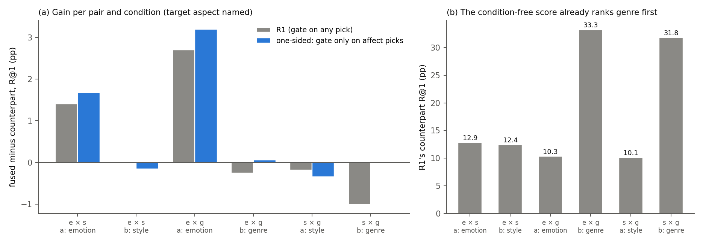
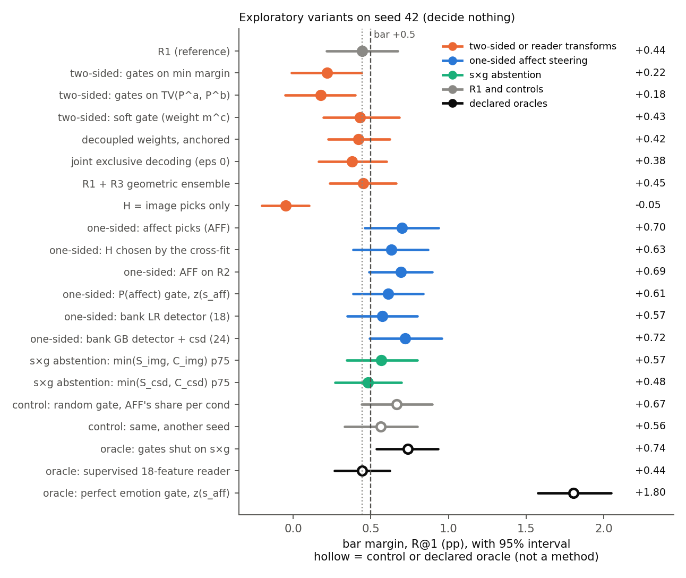

# Improving R1 on three levers: a ranked brainstorm with seed-42 diagnostics (exploratory)

**Report date:** 2026-11-20, a sequence number in this line of work, not a calendar date. The diagnostics ran on
2026-10-06 from 18:16 to 18:40, Amsterdam time.
**Status:** brainstorm. Every number below that is not quoted from an earlier report is **exploratory, seed 42, decides
nothing**. Seed 42 has been read many times; this brainstorm read it about 50 more times (§6). No rule governs these
numbers, no candidate is carried, and nothing here is a result.
**Records:** scratch code and outputs in `src/test/20261120_r1_levers_brainstorm/` (scripts `bs_*.py`; `results/` and
`cache/` are gitignored; `results/bs_summary.md` lists every exploratory row); figures and their script output in
`docs/reports/assets/2026-11-20_r1_levers_brainstorm/` (built by `bs_fig.py`). Inputs: the stored probabilities of
round 2 (`src/test/20261118_reader_fix_round2/results/cand_R1_A0.npz`, `probs_R{2,3}_A0.npz`, `cand_R1_A1.npz`), round 1's
A0 and A1 bank features (`src/test/20261117_reader_fix_csd/results/rb_reader_A{0,1}.npz`) and round 1's seed-42 bundle,
rebuilt once with its own regression check (`bs_cache.py`, 73 s). CPU only, one process, no held rows.

## Summary

R1 is round 2's best reader: round 1's learned reader with a confidence gate, fused with B, the best condition-free score
of the project. On seed 42 its bar margin was +0.472 [+0.240, +0.703] in round 2's 896-cell family and +0.444 [+0.216,
+0.674] in the 224-cell family without the top-k restriction, which every diagnostic here uses as the baseline (it is
round-1 R-c exactly). The development bar is +0.5. We looked for ideas on three levers (style × genre, picks, the either
rate), tested the cheap ones on the stored seed-42 arrays, and ranked them.

**The main finding is about where R1's margin comes from.** Essentially all of it comes from lifting the emotion candidate in the
condition whose supports show emotion. There the condition-free score ranks the target first only 10 to 13% of the time,
against 32 to 33% for a genre target, and R1 adds +1.4 (emotion × style) and +2.7 R@1 (emotion × genre) over its
matched counterpart. When the reader picks the image or caption grouping, its term buys between −1.3 and +0.6 R@1 in
every pair and condition, which we read as B already ranking visually similar candidates. In our reading two things
follow: the 3-way pick accuracy (51%) is the wrong target, and the either cost is paid largely where it buys nothing.

**Ranked ideas** (details in §3):

| Rank | Idea | Levers | Key evidence (exploratory, seed 42, decides nothing) | Cheapest next test |
|---|---|---|---|---|
| 1 | **One-sided affect steering**: open R1's gate only when the reader picks affect, the grouping least redundant with B | all three | bar margin +0.700 [+0.460, +0.937] against B′; paired over R1 +0.256 [+0.043, +0.462]; 16 variants of the idea span +0.42 to +0.72 (median +0.63) | pre-register one recipe and test it on fresh seeds 49 to 51 beside R1 |
| 2 | **CSD as evidence, not as a term**: let the CSD agreements (or the parallel spike's reader) decide when to steer with affect | picks, s×g | emotion-detection AUC 0.785 to 0.798 without CSD features, 0.822 to 0.833 with them; bar margins +0.633 and +0.722 | the spike's P(affect) as the gate, 1 minute on the cache |
| 3 | **Sharper affect evidence on the caption side**: place captions in the affect grouping by GoEmotions instead of the CLIP caption head | picks, either | the ceiling with a perfect emotion gate is +1.805; the affect signal is 2.71× on the groups but 1.15× through the heads | GoEmotions on selection captions, then the detector AUC and idea 1 with the new term |
| 4 | **Abstain on style × genre** when both sides agree visually | s×g | oracle +0.736 if the gates were shut on s×g; label-free detectors reach AUC 0.61 to 0.65 only | combine with idea 1, 1 minute on the cache |

Idea 1 is the only one with direct evidence. Its main risk: a random gate with the same per-condition open share reached
+0.564 and +0.665 (a diagnostic, not a method, since it reads which condition is a), so the reader's choice of episodes
within a condition adds little and the gain comes from steering one side and not the other (§3.1). Selection inflation
is real: we looked at about 50 label-free variants. The fresh-seed test is the protection.

**What not to do** (§5): subtract the contrast side's term (no decoupled cell beat the best tied cell in sample; the pure
difference collapses R@1 to 13.79); retrain the reader on the same 18 features (a supervised reader with evaluation
labels reached only +0.444); steer with the image, caption or CSD groupings (−0.049, −0.149, −0.366); symmetric or
contrast gates, joint decoding, temperature and R1+R3 ensembles (+0.18 to +0.45).

## 1. Terms

The task, metrics and pipeline are those of round 2 (report `2026-11-19_reader_fix_round2.md` §1). In short: an
episode has a query, 4 support pairs, 4 contrast pairs and 13 candidates; under condition a the supports show aspect A
and the target is p_A, under condition b they swap and the target is p_B. R@1 = (either + gain) / 2, where the gain is R@1
minus the other-aspect rate and the either rate is their sum. Pairs: emotion × style (e×s), emotion × genre (e×g),
style × genre (s×g); in every pair the first aspect is A.

| Term | Meaning here |
|---|---|
| R1 | round 1's two A0 half-readers on (affect, image, caption), probabilities P^c(h), weighted term T^c = Σ_h P^c(h)·s_h, gate g^c = 1[m^c ≥ τ] on the top-two margin m^c |
| tied family | R1's 224 cells: fused^c = (1 + λ_u)·z(B) + λ_a·g^c·z(T^c), τ at the 0/25/50/75th percentile of the reader's margins; the counterpart replaces g^c·z(T^c) by G_cf = (g^a·z(T^a) + g^b·z(T^b)) / 2. Cross-fit by episode parity with round 2's exact integer criteria (min-margin for the fused reader, max-R@1 for the counterpart). It reproduces round-1 R-c exactly (fused 18.919, counterpart 18.475, bar +0.444) |
| bar margin | fused reader minus the strongest of B′ (18.437), its matched counterpart and B (18.341), paired per anchor, 95% painting-cluster bootstrap |
| D^c | the condition part of the gated term, (g^c·z(T^c) − g^c′·z(T^c′)) / 2, so that g^c·z(T^c) = G_cf + D^c |
| one-sided steering | a gate that can open only when the reader's pick is affect; since the two conditions of an episode see mirrored evidence, it opens mostly on one side |
| emotion detector | any label-free score d^c of "the supports of condition c share the affect grouping", used as a gate |
| redundancy with B | the mean per-row Pearson correlation, over the 13 candidates, of z(s_h) and z(B); computed without labels |
| declared oracle | a diagnostic that uses evaluation labels on purpose, to bound what a perfect component would give; never a method |

## 2. What R1's seed-42 arrays say about the three levers

### 2.1 The margin comes from lifting emotion on the emotion side

*Figure 1. (a) Fused minus counterpart R@1 per pair and condition at R1's chosen cells (grey) and for one-sided affect
steering (blue, idea 1). (b) The counterpart's R@1 per pair and condition: the condition-free score ranks a genre
target first three times as often as an emotion or style target. Exploratory, seed 42.*

Per pair and condition, R1's fused reader beat its counterpart only in the two emotion conditions (e×s a +1.41, e×g a
+2.69 R@1). It was level on e×s b (+0.01) and lost on e×g b (−0.25), s×g a (−0.18) and s×g b (−1.02). Split by the
reader's pick in that condition, only affect picks on the emotion side paid:

| Fused vs counterpart R@1 by the condition's pick | e×s a | e×s b | e×g a | e×g b | s×g a | s×g b |
|---|---|---|---|---|---|---|
| affect (share of picks) | 15.0 vs 12.9 (80%) | 10.9 vs 11.1 (41%) | 13.7 vs 10.5 (86%) | 31.9 vs 34.5 (22%) | 9.9 vs 10.2 (77%) | 29.9 vs 31.5 (25%) |
| image | 9.9 vs 11.2 (5%) | 13.1 vs 12.7 (37%) | 8.4 vs 8.7 (4%) | 33.0 vs 32.7 (51%) | 9.3 vs 9.6 (9%) | 31.7 vs 32.5 (46%) |
| caption | 12.1 vs 13.2 (15%) | 14.2 vs 14.4 (22%) | 9.3 vs 9.5 (11%) | 33.9 vs 33.3 (27%) | 10.4 vs 10.3 (14%) | 30.2 vs 31.2 (29%) |

Image picks, which the told mapping counts as correct for style and genre, never bought more than +0.4 R@1, and caption
picks never more than +0.6. Our reading: the condition-free score already contains CLIP similarity and the
image-grouping agreement (redundancy of z(s_h) with z(B): image 0.71, caption 0.62 to 0.67, against 0.35 to 0.38 for
affect), so steering toward image clusters repeats what B does and only costs either rate. Emotion is the one aspect that B neglects and that a grouping (affect) carries.
Style is neglected too (10.1 to 12.4%), but no A0 grouping carries it apart from genre.

*Sources: `results/bs_03_sxg.json` (`per_condition`), `bs_05_aff.json` (`corr_zs_h_with_zB`, `A0.per_pair_condition`).*

### 2.2 The either cost is the price of the weight the gain needs

At R1's chosen cells (λ_a = 2 and 16 at λ_u = 0, while its counterpart chose λ_a = 0.5 at λ_u = 0 and λ_a = 1 at
λ_u = 0.5), the margin splits exactly into two parts:

| Part (paired per anchor) | R@1 | Gain | Either |
|---|---|---|---|
| fused minus the counterpart at the same cell (the condition part, D^c) | +1.329 [+1.091, +1.556] | +2.667 | −0.010 [−0.300, +0.278] |
| counterpart at the same cell minus the counterpart at its own cells | −0.885 [−1.102, −0.663] | 0 | −1.770 [−2.203, −1.325] |

The condition part is either-neutral. The whole either cost sits in the condition-free half of the term, carried at the
heavier weight that the fused reader needs to express its gain. The obvious fix, giving the condition part its own
weight λ_d beside a smaller condition-free weight λ_m, does not work (§5.1). What helped on seed 42 was to stop carrying the term
where it buys no gain (idea 1, exploratory): one-sided steering paid 0.52 R@1 of either per unit of gain against R1's
0.67.

*Sources: `results/bs_01_decouple.json` (`decomposition`, `profile_tau2_lu0`).*

### 2.3 Picks: the features are the limit, and 3-way accuracy is the wrong target

Two declared oracles bound the pick lever.

- *A supervised reader on the same 18 features* (multinomial logistic regression trained with the told grouping as label
  on one parity half, applied to the other) reached a bar margin of +0.444 [+0.267, +0.620], R1's value. Its accuracy was
  95% in condition b (always image under the told mapping) but 53 to 64% in condition a, where the 18 features cannot tell
  emotion supports from style supports when the contrasts share genre. With the CSD features added (24, or 48 for both
  conditions) it reached +0.478 and +0.513.
- *Perfect emotion detection.* Opening the gate exactly in emotion conditions with the term z(s_affect) gave +1.805
  [+1.574, +2.047], with s×g exactly 0; told picks on the emotion pairs only gave +2.024. The told ceiling of A0 (+1.64 in
  step 1's family; +1.750 in this tied family) therefore lives almost entirely on the emotion side.

So the reader's useful job is binary: "do these supports share affect?". Its quality is an AUC for emotion conditions,
not a 3-way accuracy. R1's P(affect) has AUC 0.787; the supervised ceiling on the 18 features is 0.837 and on 24 features
0.856. Every detector, including the supervised ones, still opened 68 to 77% of s×g style conditions at its median
threshold.

*Sources: `results/bs_03_sxg.json` (`oracles.O_sup18`, `O_sup24_with_csd_features`, `O_sup48_joint_with_csd_features`,
`O_emo_told`, `O_told_all`), `bs_06_aff_ceiling.json` (`O_emo_gate_aff`), `bs_07_detector.json`, `bs_08_csd_evidence.json`.*

### 2.4 Style × genre: what abstention would buy and what the features can see

Shutting the gates on s×g episodes (declared oracle) raised the pooled bar margin from +0.444 to +0.736 [+0.537, +0.934],
with s×g exactly 0; forcing P^a = P^b there gave +0.665. Told picks on s×g (image under both conditions) gave only +0.326,
because the image term at heavy weight costs either rate there too. So on A0 the best s×g can do is no harm. To detect
s×g without labels, the most informative single reader features were the CSD support agreement (AUC 0.654 for s×g
against the emotion pairs), min(S_csd, C_csd) (0.632) and min(S_image, C_image) (0.612). A logistic regression trained
with the s×g label on all 36 or 48 features, symmetrised over the two conditions, reached only 0.621 and 0.619. The s×g
signature is barely visible in the reader's inputs.

*Sources: `results/bs_03_sxg.json` (`oracles.O_sxg_*`, `auc_sxg_vs_emotion`, `auc_sxg_learned_*`), the quick AUC check
in the run (min(S, C) per grouping).*

## 3. Ideas, ranked

*Figure 2. Bar margins of a selection of the exploratory variants, by family, with R1 (dotted) and the +0.5 bar (dashed).
Hollow markers are controls or declared oracles, which are not methods. All seed 42, all exploratory.*

### 3.1 Rank 1: one-sided affect steering

**Levers:** all three. **Mechanism.** Keep R1's reader, term, thresholds and 224 cells; open the gate only when the pick
is affect: g^c = 1[m^c ≥ τ] · 1[arg max_h P^c(h) = affect]. Since the two conditions see mirrored evidence, the gate opens
mostly on one side (80.9% of condition-a values and 29.5% of condition-b values at τ_0, against R1's 64.4% and 35.6% at
τ_2). The image and caption picks, which never paid (§2.1), no longer steer.

**Evidence** (exploratory, seed 42, decides nothing).

| Variant | Fused R@1 | Counterpart R@1 | Bar margin (comparator) | Gain | Either | e×s / e×g / s×g |
|---|---|---|---|---|---|---|
| R1 (baseline) | 18.919 | 18.475 | +0.444 [+0.216, +0.674] (counterpart) | +2.667 | −1.780 | +0.708 / +1.221 / −0.598 |
| AFF: gate only on affect picks | 19.137 | 18.396 | +0.700 [+0.460, +0.937] (B′) | +3.111 | −1.630 | +0.977 / +1.453 / −0.330 |
| AFF with the subset of groupings chosen by the cross-fit (7 subsets × 224 cells) | 19.067 | 18.412 | +0.631 [+0.387, +0.867] (B′) | +2.838 | −1.528 | +0.873 / +1.453 / −0.433 |
| AFF on R2's probabilities | 19.155 | 18.461 | +0.694 [+0.490, +0.894] (counterpart) | +3.038 | −1.650 | +0.757 / +1.611 / −0.287 |
| gate on R1's P(affect) percentile, term z(s_affect) | 19.047 | 18.406 | +0.610 [+0.386, +0.836] (B′) | +2.936 | −1.654 | +0.641 / +1.440 / −0.250 |

Paired per anchor, AFF minus R1 was +0.218 [+0.064, +0.371] in fused R@1 and +0.256 [+0.043, +0.462] in bar margin. In
sample (no cross-fit) its best fused cell reached 19.269 against R1's 19.116 and its best counterpart cell 18.483 against
18.579. The improvement was spread over the pairs (+0.27, +0.23, +0.27 in bar margin) and the directions (margin over
the counterpart, image query +0.216 to +0.566, caption query +0.671 to +0.916). The singletons tell the same story:
gating only on image picks gave −0.049 and only on caption picks −0.149. Sixteen variants that steer only with affect
where a reader or a detector sees it (three readers, six detectors, two terms) spanned +0.42 to +0.72, median +0.63;
the lowest was AFF on R3's flatter probabilities. AFF's gain statistic was +3.111 [+2.780, +3.456] and its either change
−1.630 [−1.946, −1.310].

**Label-free, and its matched counterpart.** The gate uses only the reader's own pick and margin and is symmetric in a
and b. Which grouping may steer must be fixed without labels before a test: we propose the grouping least redundant with
B (affect, 0.35 to 0.38 against 0.47 to 0.72 for the others, on A0 and on A1), or leaving the subset to the cross-fit as
in the third row. The counterpart replaces g^c·z(T^c) by its two-condition mean under the same gates, so it drops only the
condition. It cannot absorb the gain: it fell to 18.396, below B′, which then set the bar; against R1's own counterpart
AFF's fused reader was +0.661 [+0.433, +0.887] ahead, so the margin is not a weaker-comparator artefact.

**The main caveat.** A random gate that opens R1's gate on a random subset of values with AFF's open share in each
condition (80.9% in a, 29.5% in b) reached +0.665 [+0.441, +0.894] and +0.564 [+0.332, +0.798] for two seeds. It is not
a method, since it uses which condition is a, but it shows that the reader's choice of episodes within a condition adds
little; the gain comes from steering the side where the reader sees affect and not the other. Our reading: the reader's
affect pick is in effect a side detector ("the contrasts of this side are visually coherent, so the supports show the
non-visual aspect"), and that decision is what pays. A rule that used only the image Δ to choose the side gave +0.378 to
+0.621 depending on the term, a wide and noisy band.

**Closest tried.** R-c (round 1) and R1 gate on confidence regardless of the pick; per-grouping thresholds (tried
here, +0.364) equalise the gate across picks; the A1 ablation offered more groupings. None removed the steering by
groupings that B already covers.

**Cheapest test and what would justify a round.** The seed-42 version is done (1 minute on the cache). It already meets
the development bar's three clauses and a paired lower bound above 0 against R1, so the next step is a pre-registered
round: fix one recipe (we suggest the first row of the table, with the redundancy criterion fixing affect), keep round 2's
bar and comparators, and run it on the fresh seeds 49 to 51 with R1 beside it, paired. **Risk:** selection inflation
(about 50 label-free variants were read on seed 42; the one-sided cluster's spread suggests 0.1 to 0.2 R@1); the gain
rests on the side asymmetry rather than pick quality; s×g stays negative (−0.33); with the A1 reader's mixture term the
same gate gave only +0.018 (with the pure affect term +0.663). **Cost:** one line in the gate on top of round 2's
`r2_fusion` with k_top 13 only; under an hour with tests.

*Sources: `results/bs_04_readers.json` (`AFF`), `bs_05_aff.json` (`A0.*`, `A1.*`), `bs_06_aff_ceiling.json` (`AFF_R2`,
`AFF_pure`), `bs_07_detector.json` (`R1aff`), `bs_09_direction.json`, `bs_10_subsets.json`, `bs_11_visual_side.json`.*

### 3.2 Rank 2: CSD as evidence for the emotion detector, never as a steering term

**Levers:** picks and s×g. **Mechanism.** Keep idea 1's steering term (affect only) and let a detector that also sees the
CSD agreements decide where to steer: g^c = 1[d^c ≥ q-th percentile of d], with d^c a binary "supports share affect"
classifier trained on round 1's A1 practice banks (labels from the groupings, not the evaluation), or the parallel
spike's reader P^c(affect). In s×g both sides share a visual aspect, which CSD shows a little better than the image
grouping, where genre dominates (§2.4).

**Evidence** (exploratory, seed 42, decides nothing). With the steering term z(s_affect) and four percentile gates:

| Detector | Features | AUC for emotion conditions | Bar margin |
|---|---|---|---|
| bank LR / bank gradient boosting | A0 (18) | 0.785 / 0.798 | +0.574 / +0.472 |
| R1's P(affect) | A0 (18) | 0.787 | +0.610 |
| A1 reader's P(affect) | A1 (24, with CSD) | 0.824 | +0.663 [+0.434, +0.891] |
| bank LR / bank gradient boosting | A1 (24, with CSD) | 0.822 / 0.833 | +0.633 / +0.722 [+0.493, +0.956] |
| supervised, evaluation labels (declared oracle) | 18 / 24 | 0.837 / 0.856 | +0.739 / +0.645 |

The CSD features raised the detection AUC by 0.02 to 0.05, to about 0.02 below the supervised 24-feature ceiling, and
the bar margins moved up by amounts within the noise of one seed. The detectors improved mostly on the b side of the emotion pairs (e×s b
open share 34.7% for R1's P(affect) against 26.2 to 30.4% with CSD), not on s×g style conditions (70 to 74% open).

**Label-free and the counterpart.** Bank labels come from the groupings. CSD enters only the gate, so the matched
counterpart (same gates, averaged term) is condition-free and the score never uses CSD. **The comparator question must
be settled in the rule before any test:** with B′(A0) = 18.437 as the floor the bar margins are those above; if the rule
asks for B′(A1) = 18.805 because CSD heads are part of the method, the same fused scores give +0.26 to +0.35.

**Closest tried.** A1 in rounds 1 and 2 used CSD as a steering grouping, and the comparators rose with it (R1/A1
−0.010; CSD-only steering here −0.366). This idea keeps CSD out of every score. **Cheapest test:** the spike's P(affect)
as d^c on the cache (minutes); a pre-registered round only together with idea 1 and with the comparator fixed. **Risk:**
the gain over idea 1 is within noise; the comparator question. **Cost:** an hour on the cache, plus whatever the spike
already provides.

*Sources: `results/bs_07_detector.json`, `bs_08_csd_evidence.json`, `bs_05_aff.json` (`A1.*`).*

### 3.3 Rank 3: sharper affect evidence on the caption side

**Levers:** picks (detector) and either (gain per unit of weight). **Mechanism.** Place every caption in the Leiden affect
grouping by its own GoEmotions probabilities (nearest communities of the scorer-train rows in GoEmotions space) instead
of by the CLIP caption head; keep the image head. This changes the support and contrast agreements S_affect and C_affect
that the detector reads, and the steering term s_affect(q, k) wherever the query or the candidate is a caption. The
groupings themselves stay as they are.

**Why it should work.** The affect grouping carries emotion strongly on the groups (pair lift 2.71 for the Leiden
communities) and weakly through the heads (1.145; partition report §4), and the caption head reaches only 35.7%
held-out accuracy. The image side cannot gain much (step 0a: the image head already reaches half of a small
same-painting ceiling), but every support pair and every ranking has one caption. Two of our numbers fit this:
R1's margin over its counterpart was +0.216 with an image query and +0.671 with a caption query, consistent with the
caption side carrying the usable affect signal, and the perfect emotion gate's +1.805 is bounded by the quality of the
head-based z(s_affect). A sharper affect term would need less weight for
the same gain, which is exactly where the either cost sits (§2.2).

**Label-free and the counterpart.** GoEmotions is the affect grouping's own external source (disclosed); no evaluation
label is used. B′(A0) and the counterpart must be rebuilt with the same caption placement, so that any condition-free
value of the sharper term is credited to the comparators. **Closest tried.** Step 0c's sibling-aware agreement smoothed
the groups and lifted the reader and its counterpart equally; this changes placement, not smoothing, and its value for
the gate is a detection AUC that can be measured before any margin. **Cheapest test:** GoEmotions on the selection
captions (minutes on a GPU when free, or tens of minutes on CPU), then (i) the detection AUC of the new S_affect against
0.787, (ii) idea 1 with the new term, with B′ rebuilt. A round is justified if the AUC rises clearly (say above 0.83 on
A0 features) and idea 1's paired margin improves. **Risk:** it touches the placement component, which the user may count
as part of the grouping redesign; the counterpart may absorb part of a sharper condition-free affect similarity. **Cost:**
half a day.

*Sources: `docs/reports/auto/v2/2026-11-12_partition_quality_leiden_communities.md` §3, §4, §8; `results/bs_09_direction.json`;
`bs_06_aff_ceiling.json` (`O_emo_gate_aff`).*

### 3.4 Rank 4: abstain on style × genre when both sides agree visually

**Lever:** s×g. **Mechanism.** Multiply the gate by 1[v < q-th percentile of v], with v = min(S_csd, C_csd) or
min(S_image, C_image), the evidence that both the supports and the contrasts share a visual aspect (in the emotion pairs
one side is non-visual). Symmetric, label-free, the same for both conditions.

**Evidence** (exploratory, seed 42, decides nothing). On top of R1: v from the image grouping at the 75th percentile
gave +0.566 [+0.345, +0.798] (s×g −0.262), v from CSD +0.480 (s×g −0.238); in sample the margins moved by +0.045 and
−0.02, so most of the cross-fit difference is tune-half noise. The detectability ceiling is low (AUC 0.61 to 0.65, §2.4).
Under idea 1 s×g contributes −0.33 / 3 = −0.11 to the pooled bar margin, so a perfect s×g abstention would add about
+0.11 on top of it. **Closest tried:** none on s×g; the AR control (round 1) showed that a random fourth grouping is a
weak detector. **Cheapest test:** idea 1 times this abstention, on the cache. **Risk:** small expected value; it can cost
the emotion pairs (CSD at the median: e×g fell from +1.221 to +0.922). **Cost:** minutes.

*Sources: `results/bs_04_readers.json` (`IMGABST_q75`, `CSDABST_q*`), `bs_03_sxg.json`.*

## 4. Other ideas, briefly

| # | Idea and lever | Mechanism | Exploratory result or reason | Verdict |
|---|---|---|---|---|
| 5 | Per-direction weights (either) | separate λ_a for image and caption queries | untested; R1's margin is +0.216 (image query) against +0.671 (caption query); under idea 1 +0.566 against +0.916 | low; adds cells, which the top-k round showed the cross-fit spends on noise |
| 6 | Joint exclusive decoding of the two conditions (picks) | Q(h_a, h_b) ∝ P^a(h_a)·P^b(h_b)·w, w = ε on the diagonal; marginals as the new P | the same-pick episodes (22%) do carry a margin of −0.092 against +0.595; but in sample the best fused cell stayed at 19.067 to 19.110 (R1 19.116); cross-fit +0.378 to +0.564 with no trend in ε | not recommended |
| 7 | Gates that look at both conditions (either) | g on min or max of the two margins, on TV(P^a, P^b), only when the picks differ, soft weights | +0.179 to +0.444 (sym_max matched R1 with a lower either cost, −1.164, and less gain) | not recommended |
| 8 | Calibration and ensembles (picks) | temperature T on P; R1 and R3 averaged or multiplied | T = 0.5: +0.397; T = 2: +0.323; arithmetic +0.411; geometric +0.450 | not recommended |
| 9 | Practice-bank detectors with richer negatives or a "none" class (picks, s×g) | train "supports share affect" against image, caption, impure or empty supports | bank detectors already reach AUC 0.785 to 0.833 against the supervised 0.837 to 0.856 on the same features; z(T) is scale-invariant, so mass on "none" acts only through the gate | low; the features are the limit |
| 10 | Candidate-level support affinity (either) | promote candidates closer to the supports than to the contrasts | the four support pairs show four values that are never the query's, so closeness to them is not evidence for the target | not recommended |

*Sources: `results/bs_02_gates.json` (`bins`, `variants`), `bs_04_readers.json`, `bs_07_detector.json`, `bs_09_direction.json`.*

## 5. What not to do

### 5.1 Subtract the contrast side's term

Giving the condition part its own weight, fused^c = (1 + λ_u)·z(B) + λ_m·G_cf + λ_d·D^c, nests R1 (λ_m = λ_d) and allows
λ_d > λ_m, which puts negative weight on the other condition's term. Over the 1,792 decoupled cells the cross-fit chose
R1's tied cells again, and no decoupled cell beat the best tied cell in sample (19.116). Along τ_2 and λ_u = 0, λ_m = 1
with λ_d = 2 gave 18.475 against 19.019 for the tied λ = 2, and λ_m = 0 with λ_d = 16 gave 13.79, below B (18.341). The
top of −z(T^c′) is the candidate least like the contrast grouping, usually a negative. Anchoring the fused reader on the
counterpart's own cell and adding λ_d·D^c gave +0.419. Demoting the other aspect's candidate is R@1-neutral at best.

### 5.2 Other things the data argue against

- **Retraining the reader on the same 18 features** for 3-way accuracy (another R2 or R3): the supervised oracle with
  evaluation labels reached only +0.444, and R3's 55.7% accuracy already lost to R1.
- **Steering with the visual groupings, or softening them:** image picks only −0.049, caption picks only −0.149, CSD picks only on A1
  −0.366, residualising each grouping score on z(B) +0.132, down-weighting by redundancy +0.423. B already ranks what
  these groupings carry.
- **Reading which condition is a.** The random-gate diagnostic of §3.1 is useful only as a control; any method must treat
  the two conditions identically.
- **Top-k or rank restrictions** of the steering: round 2 showed that 59.9% of targets sit outside B's top 3 and that the
  promoted candidates were right as often as their replacements; one-sided steering promotes emotion candidates that B
  ranks low, so a restriction would cut exactly its hits.
- **Enlarging the cell family without a mechanism** (more thresholds, per-grouping τ, ε grids): the joint-decoding sweep
  moved the cross-fit result by ±0.1 with no change in sample, the same pattern as round 2's top-k cells.

*Sources: `results/bs_01_decouple.json`, `bs_03_sxg.json`, `bs_06_aff_ceiling.json` (`RESID`, `SOFTW`), `bs_10_subsets.json`,
`bs_04_readers.json` (`J_eps*`, `PGATE`); round 2's report §5.1.*

## 6. Disclosures and limitations

- **Exploratory and selected.** Every new number comes from seed 42, which earlier rounds had read many times. This
  brainstorm evaluated about 50 label-free variants, 15 declared oracles and 2 controls on it, all cross-fitted with
  round 2's integer criteria (224-cell layout, k_top 13 only). Idea 1 was found by this search, so its development
  numbers are inflated by an unknown amount; the one-sided cluster's spread (+0.42 to +0.72, median +0.63) is a better
  guide than its best value.
- **Declared oracles use evaluation labels** (the s×g mask, the told grouping, the emotion-condition label, supervised
  readers and detectors). They bound components; none is a method.
- **The random-share gate reads condition identity.** It is a control for idea 1's mechanism, never a candidate.
- **One reader family.** All gates sit on round 1's A0 half-readers (R2 and R3 checked only for idea 1); the A1 numbers
  use round 1's A1 reader, not the spike's.
- **Comparator floor.** Rows whose counterpart fell below B′(A0) are judged against B′(A0) = 18.437 as round 2's rule
  does; idea 2's floor is an open question (§3.2).
- **Code.** The harness (`bs_lib.py`) reproduced round-1 R-c's fused 18.919, counterpart 18.475 and bar +0.4435 exactly,
  and the gate with every grouping allowed reproduced R1 exactly (asserted in `bs_06_aff_ceiling.py`). It was not
  reviewed independently.
- **No held rows were read, no GPU was used, nothing was committed.** The cache (`cache/bs_cache.npz`, 15 MB) and results
  stay in the gitignored folders.

## 7. Our view on what to do next

This is our view, not a decision. Idea 1 is cheap, has a mechanism that the per-condition table shows directly, and keeps
R1's reader, term, family and comparators. We would pre-register it as a one-line change of R1 (gate only on picks of
the grouping least redundant with B), keep round 2's bar, and test it with R1 on seeds 49 to 51, reporting the paired
difference. Ideas 2 and 4 can ride along as descriptive ablations if the rule fixes their comparators first. Idea 3 is
the only idea here that raises the ceiling rather than the share of it we recover, and it is worth a measured detection
AUC before any margin. None of these lifts style: in every A0 configuration style stays at the condition-free score's 10
to 12%, and lifting it needs a style signal that B lacks and that does not also carry genre, which is the deferred
grouping work.
