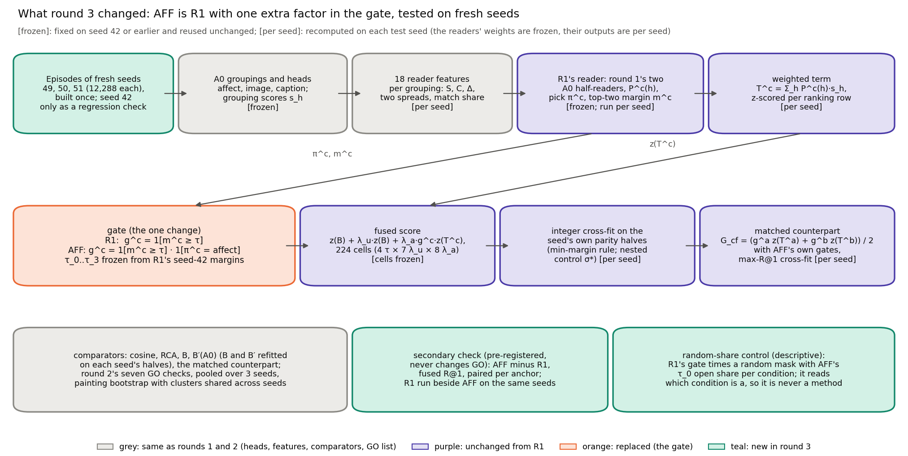
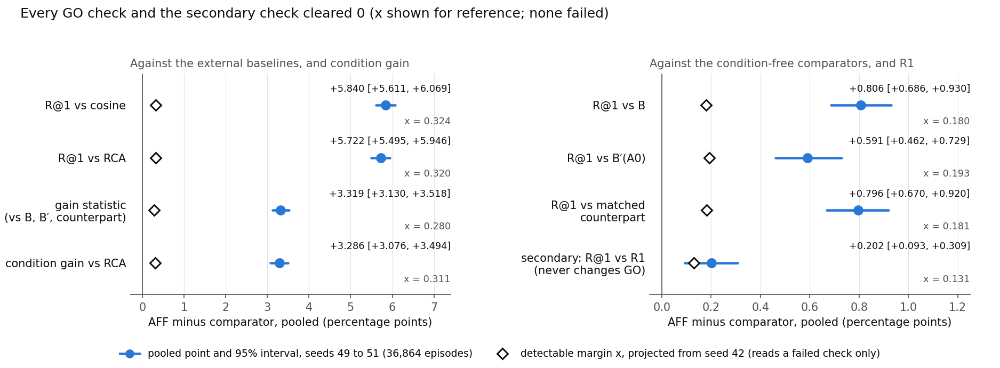
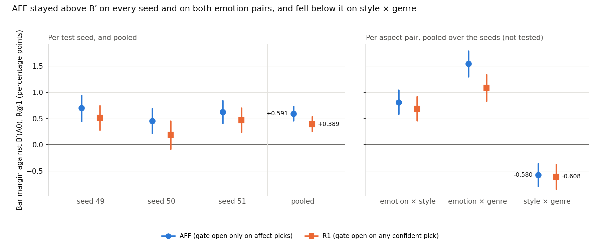
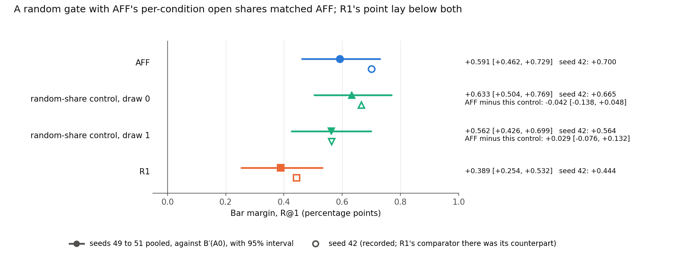

# CoSiR v2 reader fix, round 3: one-sided affect steering on R1, tested on fresh episode seeds 49 to 51 (GO)

**Report date:** 2026-11-21. Like the folder date `20261121`, this is a sequence number in this line of work, not a
calendar date. The run took place on 2026-10-06 from 19:10 (round-3 tab started) to 21:17 (descriptive pass written),
Amsterdam time; the rule was applied at 21:16.
**Status:** confirmatory test under the committed decision rule. **Verdict: GO.** All seven pre-registered checks have
pooled 95% lower bounds above 0 on the fresh episode seeds 49, 50 and 51, and the pre-registered secondary check (AFF
against R1) passes. The claim is the rule's §6.10 (§3.5 below). The multiplicity disclosure of rule §6.11 (§10) applies
to every AFF number in this report. The decision quantities are the GO checks and the secondary check (§5.2, §6.1);
the seed-42 regression checks (§4) checked the code; everything else is descriptive and decides nothing. The
whole-branch final review (commit dc52401) confirmed the GO with fixes, all applied in this revision (§11.6).
**Records:** binding rule `src/test/20261121_round3_affect_gate/DECISION_RULE.md` (commit fab5ae1, SHA-256
2d311dbe…5925); spec `docs/superpowers/specs/2026-10-06-round3-affect-gate-design.md` (commit 728f5d7); handoff
`docs/superpowers/handoffs/2026-10-06-round3-affect-gate-handoff.md`; plan
`docs/superpowers/plans/2026-10-06-round3-affect-gate.md`; run log `20261121_round3_affect_gate_log.md`; rule check
`rule_check/opus_rule_check.md`; independent re-derivation `rederive/rd3_phase1_report.md` and `rd3_phase2_report.md`;
task briefs, reports and reviews in `.superpowers/sdd/2026-10-06-round3-affect-gate/` (ledger `progress.md`). Commits
since 3b71e2f: 728f5d7 (spec), fab5ae1 (rule), 83b51f4, a4b1af9, f1d6d25, 137d46f, 05fca40, 7ece674, d38f1f9 (code,
tests and the re-derivation's phase 1), 2f8c784 (seeds built), e48cd9c (verdict and phase 2), 66d68a0 (descriptive
pass); `results/` is gitignored. Figures, `figure_data.json` and their script `build_figures.py` are in
`docs/reports/assets/2026-11-21_round3_affect_gate/`. Paths without a folder are under
`src/test/20261121_round3_affect_gate/`. Earlier reports of this line: [round 1](2026-11-18_reader_fix_csd.md),
[round 2](2026-11-19_reader_fix_round2.md), [the brainstorm](2026-11-20_r1_levers_brainstorm.md); this report defines
every term it uses.

## Summary

CoSiR v2 scores an image and a caption under an aspect that is shown only through example pairs. A label-free
**reader** estimates which pseudo-aspect grouping the example pairs share, and its weighted grouping score is fused with
B, the best condition-free score of the project. Two development rounds on seed 42 ended without a candidate at the
development bar of +0.5. The best reader, R1 (round 1's learned reader with a confidence gate, on configuration A0),
reached +0.444 against its matched counterpart in round 1's 224-cell family (+0.472 in round 2's 896 cells). An
exploratory brainstorm then traced R1's margin to one place, lifting
the emotion candidate on the emotion side, and proposed **AFF**: R1 with its gate opened only when the reader picks
the affect grouping. AFF reached +0.700 on seed 42, but it was found there by a search of about 50 variants. The user
therefore sent it straight to the fresh episode seeds 49, 50 and 51 under a pre-registered rule, with R1 run beside it.

**The verdict is GO.** Pooled over the three seeds (36,864 episodes on 5,195 anchor paintings), AFF's fused reader beat
every comparator on R@1 and on condition gain. The table also gives each check's detectable margin x, projected from
seed 42 before any test seed was built; the rule uses x only to read a failed check, and none failed.

*Table S1. The rule's seven GO checks and its secondary check, pooled over seeds 49 to 51 (R@1 or condition gain, in
percentage points, with 95% painting-bootstrap intervals).*

| Check: AFF's fused reader minus … | Point [95% interval] | x (reads a failed check only) | Pass |
|---|---|---|---|
| cosine, R@1 | +5.840 [+5.611, +6.069] | 0.324 | yes |
| RCA, R@1 | +5.722 [+5.495, +5.946] | 0.320 | yes |
| B, R@1 | +0.806 [+0.686, +0.930] | 0.180 | yes |
| B′(A0), R@1 (the strongest condition-free comparator, so this is the bar margin) | +0.591 [+0.462, +0.729] | 0.193 | yes |
| AFF's matched counterpart, R@1 | +0.796 [+0.670, +0.920] | 0.181 | yes |
| condition gain of B, B′(A0) and the counterpart, all 0 (gain statistic) | +3.319 [+3.130, +3.518] | 0.280 | yes |
| RCA, condition gain | +3.286 [+3.076, +3.494] | 0.311 | yes |
| *secondary, never changes GO:* R1's fused reader, R@1 | +0.202 [+0.093, +0.309] | 0.131 | yes |

The rule's prior, written before any test number, expected a pooled bar margin of about +0.3 (half the median of AFF's
variant cluster on seed 42, +0.63) and said a large fresh-seed margin would be a surprise. The outcome, +0.591, kept 84%
of AFF's seed-42 value, and its lower bound (+0.462) sat above the prior's expected point. All seven checks also passed
on each seed alone; the bar margins were +0.700, +0.452 and +0.623.

Four descriptive results qualify the GO.

- **R1 would also have passed.** Through the same pipeline, R1 cleared all seven checks pooled, with a bar margin of
  +0.389 [+0.254, +0.532] against B′(A0). AFF's +0.202 over R1 passed the secondary check; §6.3 discusses how much of it
  reflects R1's own per-seed cell choice.
- **The pooled claim rests on the two emotion pairs.** AFF's bar margin was +0.810 on emotion × style, +1.544 on emotion
  × genre and −0.580 [−0.793, −0.363] on style × genre, where AFF also fell below B (−0.336, interval excluding 0) and,
  in its point, below its counterpart (−0.149 [−0.348, +0.051]). A0 has no grouping that carries style apart from genre,
  and the reader still picked affect in 77.6% of the style × genre conditions whose supports show style.
- **The gain comes from a one-sided gate.** A random gate that opens R1's gate with AFF's open share in each condition
  (80.6% of condition a, 29.7% of condition b), and therefore reads which condition is a, matched AFF: AFF minus the
  control was −0.042 [−0.138, +0.048] and +0.029 [−0.076, +0.132] for two draws (rule §9: reported only; the user
  decides what follows). The control is not a method. It shows that the per-condition asymmetry, not the choice of
  episodes within a condition, carries the gain. Our reading: AFF's label-free part is a visual-contrast rule that
  steers when the visual groupings agree more on the contrasts than on the supports. On this benchmark that is the
  emotion side of the two emotion pairs, where steering pays, and the style side of style × genre, where it costs R@1
  (−0.580 against B′(A0)).
- **The gain has an either-rate cost.** Against its counterpart, AFF bought +3.319 of condition gain and paid 1.727 of
  either rate, 0.52 per unit of gain, the same ratio as on seed 42.

An independent re-derivation with its own code agreed with the implementation on all 229 compared quantities of the
test, every pooled point and bound bit for bit.

*Sources: `results/test_verdict.{json,txt}`, `results/go_pooled.json`, `results/descriptive.{json,txt}`,
`results/sensitivity.json`, `rederive/rd3_phase2_report.md`, the rule's header (prior). The 84% and the cost ratios are
our arithmetic, recorded with the other report diagnostics in `figure_data.json`.*

## 1. Terms and setup

**The task.** An **episode** has a **query** (one image, or one caption, of an anchor painting), 4 **support pairs**,
4 **contrast pairs** and 13 **candidates** in the other modality. The supports share a value of aspect A, the contrasts
a value of aspect B. Candidate p_A shares the query's value of A, p_B its value of B, and 11 negatives share neither.
Under **condition a** the target is p_A; under **condition b** supports and contrasts swap and the target is p_B. Each
episode gives four rankings (two conditions, two directions). The aspects are emotion, style and genre on ArtELingo,
giving three **aspect pairs**: emotion × style, emotion × genre and style × genre, where the first aspect is A. So
condition a is the emotion side in the two emotion pairs and the style side in style × genre.

**Episode seeds.** One seed draws 12,288 episodes (4,096 per pair) from the selection rows. **Seed 42** is the
development draw (4,602 anchor paintings) and has been read many times. The **test seeds** 49, 50 and 51 were built
once each for this round; pooled they hold 36,864 episodes on 5,195 of the 6,451 selection paintings. They are new
episodes, not new paintings.

**Metrics** (per episode, averaged over its four rankings, pooled over the three pairs, in percentage points).

| Term | Meaning |
|---|---|
| R@1 | the target ranks strictly first (ties miss; chance 7.69%) |
| other-aspect rate | the other aspect's candidate ranks first |
| condition gain | R@1 minus the other-aspect rate; exactly 0 for any scorer that ignores the condition |
| either rate | R@1 plus the other-aspect rate, so **R@1 = (either + gain) / 2** |
| interval | 95% percentile interval of a bootstrap over anchor paintings (5,000 resamples, seed 42), cross-fit choices held fixed. Pooled over the test seeds, the per-anchor values of seeds 49, 50 and 51 are concatenated and a painting that anchors episodes on several seeds is one cluster |

**The label-free reader.**

| Term | Meaning |
|---|---|
| grouping, A0 | a partition of the scorer-train rows built without evaluation labels. **A0** = (affect, image, caption): *affect* is Leiden communities on GoEmotions caption probabilities (41 groups); *image* and *caption* are k-means with 64 clusters on CLIP image or caption features |
| head, s_h | a logistic regression on frozen CLIP ViT-B/32 features predicting a row's group from its image or its caption; the grouping score s_h(q, k) is the product of the query's and the candidate's posteriors |
| Δ_h, reader features | Δ_h is the mean agreement over the 4 support pairs minus that over the 4 contrast pairs; under condition b it is exactly −Δ_h of condition a. The reader sees 18 features per (episode, condition): per grouping the support and contrast agreements, Δ, two spreads and a match share |
| half-reader, P^c(h) | round 1's two multinomial logistic regressions, each trained on practice episodes from one painting half of the scorer-train rows; P^c(h) is their mean probability that grouping h is the one the supports share under condition c |
| T^c, pick π^c, margin m^c | the **weighted term** T^c = Σ_h P^c(h)·s_h; the pick is arg max_h P^c(h) (ties to affect); m^c is the largest minus the second-largest P^c(h) |
| τ_0 to τ_3 | R1's thresholds, the 0th, 25th, 50th and 75th percentiles of R1's 24,576 seed-42 margins, frozen for every seed |
| **R1** | round 1's learned reader with the confidence gate g^c = 1[m^c ≥ τ] |
| **AFF** | R1 with the gate opened only on affect picks: g^c = 1[m^c ≥ τ] · 1[π^c = affect] |
| told mapping, pick accuracy | the evaluation-label map emotion → affect, style → image, genre → image; pick accuracy is how often π^c equals the told grouping (chance 1/3). A diagnostic only |
| redundancy with B | for grouping h, the mean over ranking rows of the Pearson correlation over the 13 candidates between z(s_h) and z(B); label-free. It is the recorded reason for allowing only affect to steer |

**Fusion, comparators and the decision.**

| Term | Meaning |
|---|---|
| B | the best condition-free score of the project: cosine, the method-A factor term and an averaged head agreement over E2's three k-means groupings, fused with weights cross-fitted on the seed's parity halves |
| B′(A0) | B rebuilt with the averaged agreement taken over A0's own groupings; it depends on the seed only, never on the reader |
| cosine, RCA | the external baselines: CLIP cosine, and RCA, the strongest raw metric learned from the example pairs |
| cell | one (τ index, λ_u, λ_a); the fused score is z(B) + λ_u·z(B) + λ_a·g^c·z(T^c), z a per-row z-score taken before the gate; 224 cells = 4 τ × 7 λ_u × 8 λ_a |
| cross-fit, tune half | episodes split by index parity; the cell chosen on tune half h scores the other half. The fused reader takes the cell with the largest min(ρ − ρ_ctrl, γ) in integer hit counts (ρ the hits, γ the hits minus other-aspect hits, ρ_ctrl the hits of the best weight on z(B) alone, chosen with the nested control σ*) |
| matched counterpart, G_cf | the same 224 cells with the gated term replaced by G_cf = (g^a·z(T^a) + g^b·z(T^b)) / 2 under the reader's own gates, so only the condition is removed; it picks its cells by the most hits, the rule most favourable to a control |
| margin, bar comparator, bar margin | margin: fused reader minus its counterpart, R@1, paired per anchor. Bar comparator: whichever of B′(A0), the counterpart and B has the largest mean R@1 in the scope (seed, or pooled); bar margin: fused reader minus it |
| gain statistic | the fused reader's condition gain minus its counterpart's (0 by construction), so its gain over B, B′ and the counterpart alike |
| development bar | round 2's: bar margin at least +0.5, its lower bound above 0, and the gain statistic's lower bound above 0. Recorded for AFF on seed 42 only |
| round-1 R-c | round 1's best candidate; R1 on the 224 cells is round-1 R-c exactly |

**Terms of the test.**

| Term | Meaning |
|---|---|
| GO checks | seven pooled checks that must all have a 95% lower bound above 0 (§3.4) |
| secondary check | AFF's fused R@1 minus R1's, paired per anchor, pooled; pre-registered, never changes GO |
| sensitivity projection, x | from AFF's seed-42 per-episode differences, the projected pooled standard error SE over three seeds; x = 2.80·SE is the detectable margin. It reads a failed check only |
| frozen-cell line | each test seed scored with the cells seed 42's cross-fits chose, instead of its own; descriptive |
| random-share control | R1's gates times a random mask that keeps AFF's τ_0 open share in each condition, two draws; it reads which condition is a, so it is a mechanism control and never a method |

*Sources: `DECISION_RULE.md` §1 (glossary), §2, D1 to D15, §6, §7; round 2's report §1.*

## 2. How we got here

**Round 1** (run 2026-10-06 02:51 to 03:43) tested seven readers on seed 42 under a committed rule. None cleared the
development bar. The best, round-1 R-c, reached +0.444 [+0.216, +0.674] against its matched counterpart with a gain
statistic of +2.667 [+2.325, +3.012], so no fresh-seed test was built.

**Round 2** (15:43 to 17:01) varied the reader's probabilities (R2 adapted to seed 42 without labels, R3 retrained on
impure practice episodes) and added a top-k restriction, in one 896-cell family with R1 beside them. Again no candidate
cleared the bar: R1 reached +0.472 [+0.240, +0.703], R2 +0.116 and R3 +0.077. On round 1's 224 cells R1 is round-1
R-c exactly (+0.444). The user decided to keep improving R1 and to leave the grouping redesign (design L) for later.

**The brainstorm** (18:16 to 18:40, exploratory, seed 42) read R1's stored arrays. R1's margin came from the two emotion
conditions (fused minus counterpart +1.40 on emotion × style a and +2.70 on emotion × genre a), where the condition-free
score ranks the emotion target first only 10 to 13% of the time. Image and caption picks never paid: their grouping
scores are highly redundant with B (row correlation 0.62 to 0.71, against 0.35 to 0.38 for affect). Among about 50
label-free variants, 15 declared oracles and 2 controls, its rank-1 idea was **AFF**: open R1's gate only on affect
picks. On seed 42 AFF reached +0.700 [+0.460, +0.937] against B′(A0) and +0.256 [+0.043, +0.462] over R1, and sixteen
one-sided variants spanned +0.42 to +0.72 (median +0.63). Its main caveat was a random gate with AFF's per-condition
open share, which reached +0.665 and +0.564: the gain seemed to come from steering one side, not from the reader's
choice of episodes.

**The user's decision** (2026-10-06, about 19:00): test AFF as a pre-registered round with R1 beside it, straight on
the fresh seeds 49 to 51, since seed 42 could not serve as its development data. The spec's seven open points were then
settled with the user one at a time: affect frozen by name with its label-free reason recorded; seed 42 as regression
checks only; round 2's seven GO checks; AFF minus R1 as a pre-registered secondary check; R1 run in full on the test
seeds, descriptive; the sensitivity projection logged only; the random-share control as a descriptive ride-along; the
disclosure with a stated prior.

*Table 1. The run, in Amsterdam time (from the run log).*

| Time | Step |
|---|---|
| 19:10 | round-3 tab started from the handoff |
| 19:11 to 19:21 | the seven open points settled with the user |
| 19:22 | spec committed (728f5d7) and approved |
| 19:28 | rule drafted from the spec, with round 2's rule as the template |
| 19:32 to 19:45 | fresh Opus checker on the draft rule: 2 blocking, 7 should-fix, 16 nits (§11.1) |
| 19:51 | all 25 findings applied; rule committed (fab5ae1) |
| 19:52 | shared constants (83b51f4): all 36 input SHA-256s and the τ assert pass |
| 19:54 | bundle stream (Opus), fusion and statistics stream (Sonnet) and re-derivation phase 1 (Opus) dispatched in parallel |
| 20:05 | re-derivation phase 1: every seed-42 target exact; sensitivity projection reproduced |
| 20:00 to 20:31 | task reviews and one fix round each for the fusion stream (137d46f) and the bundle stream (7ece674) |
| 20:50 to 20:52 | **seed-42 regression checks passed** (134 comparisons, §4) |
| 20:54 | end-to-end wiring smoke test passed on smoke seeds 9001 to 9003 |
| 20:58 | runner stream review approved; seed build launched |
| 20:58 to 21:08 | seeds 49, 50, 51 built (one invocation of `run_r3_build.py`, which ran `run_baselines.py` once per seed) and hash-checked |
| 21:08 to 21:10 | GO pass (GO quantities only) |
| 21:14 | re-derivation phase 2: 229 quantities agree |
| 21:16 | **rule applied: GO** |
| 21:17 | descriptive pass (rule §7) |
| 21:49 | this report committed (02215b8) with §11.6 as a placeholder; whole-branch final review dispatched |
| 22:29 | final review: CONFIRMED WITH FIXES (§11.6); fix wave applied to this report afterwards |

*Sources: round 1's and round 2's reports (Summary, §2); the brainstorm (Summary, §2.1, §3.1, §6), with its +1.41 and
+2.69 as recomputed from round-1 R-c's arrays by the final review (N5: +1.40 and +2.70); the handoff §2; the spec §1;
the rule header; the run log (all times).*

## 3. Method

### 3.1 What AFF changes

AFF keeps every ingredient of R1 and changes one factor of the gate (Figure 1). The reader, its features, its weighted
term, its thresholds, the 224 cells, both cross-fit rules and the counterpart recipe are R1's. R1 steers whenever the
reader is confident, whatever it picks. AFF steers only when the confident pick is affect, the A0 grouping least
redundant with B. Since an episode's two conditions see mirrored evidence (Δ^b = −Δ^a), the affect pick and therefore
AFF's gate open mostly on one side: on seed 42 at τ_0, 80.9% of condition-a values and 29.5% of condition-b values.
The gate reads only the reader's own pick and margin and treats the two conditions identically, so AFF is label-free.

*Figure 1. Round 3 against R1. Grey: the same as rounds 1 and 2 (heads, features, comparators, GO list). Purple:
unchanged parts of R1. Orange: replaced (the gate). Teal: new in round 3 (the fresh-seed test, the secondary check and
the random-share control). Tags mark what was frozen from seed 42 and what was recomputed on each test seed.*

**Affect is frozen by name.** The rule records a label-free reason: affect is the A0 grouping least redundant with B.
On seed 42 the redundancies were 0.353 (image query) and 0.383 (caption query) for affect, 0.618 and 0.665 for caption,
and 0.715 and 0.709 for image. The criterion was stated after affect was seen to pay, so it explains the choice and
does not protect it; the fresh seeds do.

### 3.2 Frozen and per-seed pieces

*Table 2. What the test held fixed and what it recomputed on each test seed (rule §6.3).*

| Frozen from seed 42 or earlier | Recomputed on each test seed's own episodes and parity halves |
|---|---|
| the two half-readers with their scalers | the 18 reader features, P^c(h), T^c, picks and margins |
| τ_0 to τ_3 (R1's seed-42 margin percentiles) | the gates: that seed's margins and picks against the frozen τ |
| the affect restriction | B and B′(A0), refitted with the same recipes |
| the 224-cell family: λ grid, cell order, tie rules | the nested control σ* |
| the standard heads and posteriors | the fused reader's min-margin cross-fit |
| the method-A checkpoint behind B | the counterpart's max-R@1 cross-fit |

Per-seed cross-fitting is part of the method's definition, and the counterpart had the same freedom; the intervals hold
the picks fixed. The frozen-cell line (§9.1) shows what the seed-42 cells would have given instead.

### 3.3 Comparators and baselines

Each result below names its baseline. **B′(A0)**, the condition-free score built on AFF's own groupings, was the
strongest condition-free comparator on every test seed and pooled (pooled R@1 18.288, against 18.083 for AFF's
counterpart and 18.073 for B), so the bar margin is AFF minus B′(A0) throughout. **AFF's matched counterpart** removes
only the condition from AFF's own fused score. **R1** is the previous best reader, run through the same pipeline. The
external baselines cosine (pooled R@1 13.040) and RCA (13.158) put the numbers in context. The pooled means of cosine,
RCA and R1's fused reader (18.677) were computed by the figure script from the stored per-anchor arrays.

### 3.4 The rule

**GO** required all seven checks, pooled over the three seeds, to have a 95% lower bound strictly above 0 (rule §6.5):

- five R@1 checks: AFF's fused reader minus cosine, RCA, B, B′(A0) and AFF's matched counterpart;
- the gain statistic, which is also the gain difference against cosine, B and B′, counted once;
- condition gain, AFF's fused reader minus RCA.

The **secondary check** (rule §6.6), AFF's fused R@1 minus R1's, passes with a lower bound above 0 and never changes
GO. A failed check would have been read on its own: "inconclusive at a detectable margin of x" if its point was above
0, "AFF did not beat …" otherwise. Until the verdict was written, only the per-seed bundles, the per-anchor arrays of
AFF's fused reader and counterpart, of R1's fused reader, of B, B′(A0), cosine and RCA, the chosen cells and the pooled
GO quantities were computed. Per-seed and per-pair numbers, R1's counterpart, gate shares, pick accuracy, the
frozen-cell line and the control came only after it (rule §6.4).

### 3.5 The claim the rule licenses

A GO shows that AFF, a reader on A0 that steers only when it picks the affect grouping, beats each comparator, pooled
over the three aspect pairs, on new episodes drawn from the same 6,451 selection paintings. It does not show transfer
to new paintings (the held split stays reserved for the paper test) or a margin on each aspect pair. The passed
secondary check adds that AFF beats R1 on the same episodes. For the paper: the groupings were built without evaluation
labels, and AFF was selected on seed 42 (§10).

*Sources: `DECISION_RULE.md` D5 to D12, §4, §6.3 to §6.11; the spec §2; `results/descriptive.json`
(`item2_bar_margin_cells_frozen.AFF_bar_margin_pooled.comparator_mean_r1`); `figure_data.json` (`pooled_mean_r1`).*

## 4. Seed 42: the regression checks

Seed 42 was AFF's discovery data, so the rule used it only to check the code. The baselines here are round 1's stored
arrays and the brainstorm's recorded numbers: the new seed-parameterised pipeline had to reproduce both exactly before
any seed was built. The run passed all 134 comparisons at 20:52 (Table 3).

*Table 3. Seed-42 regression checks (rule §5), all at full precision.*

| Item | What had to match | Comparisons | Result |
|---|---|---|---|
| 1. Bundle | round 1's `load_bundle`: episodes, parity, anchor paintings, pair index, cosine, B and B′(A0) scores and per-anchor arrays, the A0 posteriors, the grouping scores, the 18 features of both conditions, the affect head; cosine and RCA of `per_anchor_seed42.npz`; the six D7 redundancy values | 66 | exact |
| 2. R1 = round-1 R-c | T^c, margins, picks; τ recomputed equal to `rc_tau.json`; cells 116 and 119 (fused), 58 and 123 (counterpart); σ* 0 and 0; all per-anchor arrays; bar margin +0.4435221354166667 [0.21646171563312194, 0.6735669710776852] against the counterpart; gain statistic 2.667236328125 [2.325087836946873, 3.012361650695922] | 40 | exact |
| 3. AFF = the brainstorm | fused R@1 19.136555989583336, counterpart 18.39599609375, comparator B′(A0); bar margin 0.6998697916666667 [0.4598852740816973, 0.9371680126852968]; margin 0.7405598958333333; gain statistic 3.110758463541667; either −1.629638671875; per-pair bar margins 0.9765625, 1.45263671875, −0.32958984375; cells 39 and 119 (fused), 149 and 10 (counterpart); σ* 0 and 0; AFF minus R1 0.21769205729166666 (fused R@1) and 0.25634765625 (bar margin); τ_0 gate open on 9,941 and 3,627 of 12,288 values | 24 | exact |
| 4. Development bar for AFF | bar margin ≥ +0.5; its lower bound > 0; the gain statistic's lower bound > 0 | 4 | all three clauses hold |

Item 4 clears, which records only that the code reproduced the brainstorm's selection; it selects nothing. **The
disclosure of §10 applies:** AFF was chosen on seed 42 from about 50 label-free variants, so its seed-42 numbers are
inflated by an unknown amount, and the median of its one-sided cluster (+0.63) is a better guide than +0.700.

The brainstorm had scored in float64 and this pipeline scores in float32. The rule check had already shown that the two
give identical integer statistics in all 224 × 12,288 entries for both readers, so no near-tie could reorder a cell,
and item 3 matched to the last bit. The D7 check also passed: affect had the smallest redundancy with B in both
directions, with the six values equal to the rule's.

*Sources: `results/regression_check.json` (134 comparisons, by item 66, 40, 24 and 4; `D13_AFF`, `redundancy_D7`);
`DECISION_RULE.md` §5; `rule_check/opus_rule_check.md` (float32 against float64); the run log (20:50 to 20:52).*

## 5. The test on seeds 49, 50 and 51

### 5.1 Build and sensitivity

Before any seed was built, the rule projected each check's pooled standard error from AFF's seed-42 per-episode
differences (a one-way split of the variance by anchor painting, three independent draws of the same anchor
distribution). The detectable margins x ran from 0.180 (against B) to 0.324 (against cosine). Against the three
condition-free comparators they were 0.180 to 0.193, below the prior's expected bar margin of +0.3, and 0.131 for the
secondary check. The seeds were then built by one invocation of `run_r3_build.py` (20:58 to 21:08), which ran
`run_baselines.py` once per seed. All nine new per-pair episode SHA-256s were distinct from each other and from the 15
of seeds 42, 43, 45, 47 and 48, and `codes_provenance.json` kept its recorded SHA-256 before and after each build. The
build logs, which print the cosine and RCA tables, were not opened.

### 5.2 The GO checks

The baseline for the headline is B′(A0), the strongest condition-free comparator, with AFF's matched counterpart and B
beside it and the external baselines below.

*Table 4. The seven GO checks and the secondary check, pooled (36,864 episodes, 5,195 painting clusters), beside the
sensitivity projection made from seed 42 before the build. "Projected" is 1.96·SE; "realised" is half the width of the
pooled interval.*

| Check (AFF minus …) | Point [95% interval] | x | Projected half-width | Realised half-width | Seed-42 point |
|---|---|---|---|---|---|
| cosine, R@1 | +5.840 [+5.611, +6.069] | 0.324 | 0.227 | 0.229 | +6.175 |
| RCA, R@1 | +5.722 [+5.495, +5.946] | 0.320 | 0.224 | 0.225 | +5.756 |
| B, R@1 | +0.806 [+0.686, +0.930] | 0.180 | 0.126 | 0.122 | +0.795 |
| B′(A0), R@1 | +0.591 [+0.462, +0.729] | 0.193 | 0.135 | 0.134 | +0.700 |
| matched counterpart, R@1 | +0.796 [+0.670, +0.920] | 0.181 | 0.127 | 0.125 | +0.741 |
| gain statistic | +3.319 [+3.130, +3.518] | 0.280 | 0.196 | 0.194 | +3.111 |
| RCA, condition gain | +3.286 [+3.076, +3.494] | 0.311 | 0.218 | 0.209 | +3.007 |
| secondary: R1's fused reader, R@1 | +0.202 [+0.093, +0.309] | 0.131 | 0.091 | 0.108 | +0.218 |

All seven lower bounds were above 0, the lowest being +0.462 (against B′(A0)), so the verdict was GO; no bound lay
within 1e-12 of 0. The projection held: every realised half-width was within 5% of the projected one, except the
secondary check's, which was 18% wider. The rule uses x only to read a failed check, and none failed.

*Figure 2. The seven GO checks and the secondary check, pooled over seeds 49 to 51, with 95% intervals (blue) and each
check's detectable margin x projected from seed 42 before the build (hollow diamond). Note the two x-axis scales.*

**Why the margins held.** Against B′(A0), AFF fell from +0.700 on seed 42 to +0.591, a loss of 0.109, within the 0.1 to
0.2 R@1 of selection inflation that the brainstorm guessed from its cluster's spread and smaller than seed 42's own
half-width (0.239). Against B and the counterpart the margins hardly moved (+0.795 to +0.806 and +0.741 to +0.796),
and the gain statistic rose (+3.111 to +3.319). The comparators themselves were lower on the test seeds (B′(A0) 18.437
on seed 42 against 18.288 pooled, B 18.341 against 18.073), and AFF's fused R@1 fell with them (19.137 to 18.880). The
condition-dependent part of the score, which no comparator has, kept its size. The prior's halving heuristic came from
two earlier fresh-seed tests of other methods (round 2's report §8) and did not hold here; R1's margin against B′(A0)
also kept most of its seed-42 value (§6.2).

*Sources: `results/test_verdict.json`, `results/go_pooled.json`, `results/sensitivity.json` (`x`, `half_width`,
`seed42_half_width`); `results/build_seed{49,50,51}.json` (hash check); `rederive/rd3_phase1_report.md` §6 (seed-42
points); realised half-widths and ratios from `figure_data.json` (`sensitivity_vs_realised`).*

### 5.3 Per seed

*Table 5. AFF per test seed (descriptive). The bar comparator was B′(A0) on every seed. Either is AFF's either rate
minus its counterpart's.*

| Seed | B′(A0) R@1 | AFF fused R@1 | Bar margin vs B′(A0) | Margin vs counterpart | Gain statistic | Either | AFF minus R1 |
|---|---|---|---|---|---|---|---|
| 49 | 18.231 | 18.931 | +0.700 [+0.448, +0.940] | +0.850 [+0.617, +1.080] | +3.593 | −1.892 | +0.185 [+0.008, +0.365] |
| 50 | 18.337 | 18.789 | +0.452 [+0.216, +0.685] | +0.702 [+0.493, +0.911] | +3.267 | −1.864 | +0.262 [+0.078, +0.461] |
| 51 | 18.296 | 18.919 | +0.623 [+0.407, +0.842] | +0.836 [+0.635, +1.042] | +3.097 | −1.424 | +0.159 [−0.022, +0.342] |
| pooled | 18.288 | 18.880 | +0.591 [+0.462, +0.729] | +0.796 [+0.670, +0.920] | +3.319 | −1.727 [−1.907, −1.546] | +0.202 [+0.093, +0.309] |
| 42 (regression) | 18.437 | 19.137 | +0.700 [+0.460, +0.937] | +0.741 [+0.520, +0.960] | +3.111 | −1.630 | +0.218 [+0.064, +0.371] |

All seven checks passed on every seed alone, with the lowest per-seed lower bound +0.216 (B′(A0) on seed 50). The
secondary check passed on seeds 49 and 50 and failed on seed 51 alone. Seed 49's bar margin equals seed 42's to full
precision (+0.6998697916666667). This is a coincidence of integer counts: on both seeds the fused reader won a net 344
of 49,152 rankings over B′(A0), from different levels (18.931 against 18.231 on seed 49, 19.137 against 18.437 on seed
42) and different episodes.

*Table 6. Cells chosen by the cross-fits (cell: τ index, λ_u, λ_a); the cell chosen on tune half h scores the other
half. σ* = 0 on both halves of every seed.*

| Seed | AFF fused, half 0 / half 1 | AFF counterpart | R1 fused | R1 counterpart |
|---|---|---|---|---|
| 42 | 39: τ_0, 4, 16 / 119: τ_2, 0, 16 | 149: τ_2, 4, 4 / 10: τ_0, 0.5, 0.5 | 116: τ_2, 0, 2 / 119: τ_2, 0, 16 | 58: τ_1, 0, 0.5 / 123: τ_2, 0.5, 1 |
| 49 | 119: τ_2, 0, 16 / 63: τ_1, 0, 16 | 158: τ_2, 8, 8 / 156: τ_2, 8, 2 | 127: τ_2, 0.5, 16 / 93: τ_1, 4, 4 | 54: τ_0, 16, 8 / 66: τ_1, 0.5, 0.5 |
| 50 | 62: τ_1, 0, 8 / 127: τ_2, 0.5, 16 | 114: τ_2, 0, 0.5 / 137: τ_2, 2, 0.25 | 14: τ_0, 0.5, 8 / 151: τ_2, 4, 16 | 114: τ_2, 0, 0.5 / 11: τ_0, 0.5, 1 |
| 51 | 118: τ_2, 0, 8 / 119: τ_2, 0, 16 | 115: τ_2, 0, 1 / 170: τ_3, 0, 0.5 | 117: τ_2, 0, 4 / 68: τ_1, 0.5, 2 | 115: τ_2, 0, 1 / 170: τ_3, 0, 0.5 |

On the test seeds AFF's fused reader always chose τ_1 or τ_2 with a heavy term weight (λ_u 0 or 0.5, λ_a 8 or 16).
Seed 42's half-0 cell (τ_0, λ_u 4) was never chosen again. R1's choices spread more widely, from cell 14 (τ_0, gate
open on almost every value) to cell 151 (λ_u 4); §6.3 shows that this cost R1 on seed 50.

*Sources: `results/descriptive.{json,txt}` (items 1 and 2, `chosen_cells`); `results/regression_check.json` (seed 42);
the net 344 rankings is our arithmetic (0.6998697916666667% of 49,152).*

## 6. The secondary check and R1 on the fresh seeds

The baseline here is R1, the previous best reader, scored on the same episodes with the same pipeline.

### 6.1 The secondary check

AFF's fused R@1 minus R1's was +0.202 [+0.093, +0.309] pooled, so the pre-registered secondary check passed: AFF beat R1
on the same episodes. Its interval was the one wider than projected (§5.2). Per seed it was +0.185, +0.262 and +0.159,
with seed 51's interval reaching −0.022. Since AFF and R1 shared the bar comparator B′(A0) everywhere, the difference in
bar margin was the same +0.202.

### 6.2 R1's own seven checks (descriptive)

*Table 7. R1 through the same pipeline, pooled (its counterpart cross-fitted only after the verdict, rule §7 item 3).
Descriptive; R1 gives no second verdict.*

| Check: R1's fused reader minus … | Test seeds, pooled | Seed 42 |
|---|---|---|
| cosine, R@1 | +5.638 [+5.419, +5.864] | +5.957 [+5.589, +6.330] |
| RCA, R@1 | +5.520 [+5.296, +5.747] | +5.538 [+5.162, +5.907] |
| B, R@1 | +0.604 [+0.471, +0.745] | +0.578 |
| B′(A0), R@1 (bar margin) | +0.389 [+0.254, +0.532] | +0.482 [+0.236, +0.727] |
| its matched counterpart, R@1 | +0.519 [+0.390, +0.651] | +0.444 [+0.216, +0.674] |
| gain statistic | +2.521 [+2.335, +2.708] | +2.667 [+2.325, +3.012] |
| RCA, condition gain | +2.488 [+2.287, +2.696] | +2.563 [+2.173, +2.954] |

R1 cleared all seven checks pooled, so R1 would also have earned a GO under this list. Its bar margin on seed 42 was
+0.444 against its counterpart, which was the stronger comparator there (18.475 against B′(A0)'s 18.437). Against
B′(A0) it went from +0.482 on seed 42 to +0.389 pooled, keeping 81% of its value, close to AFF's 84%. Per seed it was
+0.515, +0.189 [−0.079, +0.452] and +0.464, so on seed 50 alone R1 would have failed the B′(A0) check. R1's either cost
against its own counterpart was 1.482 (our arithmetic, 2 × margin − gain), 0.59 per unit of gain, against AFF's 0.52.

### 6.3 How much of AFF minus R1 is the reader, and how much the cell choice

With seed 42's chosen cells applied to every test seed (the frozen-cell line, §9.1), AFF's bar margin barely changed
(+0.585 against +0.591 cross-fitted), while R1's rose to +0.495 against +0.389. The frozen-cell AFF minus R1 was
therefore +0.090 [+0.005, +0.177] (a descriptive quantity outside the rule's §6.9 and §7 lists, computed by the
descriptive pass, not pre-registered, decides nothing), under half of the pre-registered +0.202. Most of the gap came
from seed 50, where R1's cross-fit chose cells 14 and 151 and reached +0.189, against +0.460 with seed 42's cells. That
is tune-half noise of the kind round 2 saw with the top-k cells: cells chosen on one half of the seed's episodes did
worse on the other half than seed 42's cells did.

*Figure 3. Bar margin against B′(A0) per test seed and pooled (left), and per aspect pair pooled over the seeds
(right), for AFF and R1, with 95% intervals. Per-pair results are not tested.*

**Reading.** The secondary check says AFF beat R1 on these episodes, as pre-registered. Two facts limit what it adds: R1
alone also passed the GO list, and with the cells held fixed AFF's lead over R1 was +0.090 with a lower bound of +0.005
(the descriptive quantity above, which decides nothing). AFF's gate is the better of the two on this evidence: the
pre-registered secondary result is +0.202 [+0.093, +0.309], and the one change in the gate is cheap. About two thirds of
AFF's margin over B′(A0) (+0.389 of +0.591) is the margin R1 already had.

*Sources: `results/test_verdict.json` (`secondary`); `results/descriptive.{json,txt}` (item 1 per seed, item 2
`AFF_minus_R1_bar_margin`, `frozen_cell_line`, item 3); round 2's report Table 2 (R1 against B on seed 42, +0.578);
seed-42 R1 minus B′(A0), R1's seed-42 differences from cosine and RCA (the final review's N9, recomputed by the figure
script) and the either arithmetic from `figure_data.json` (`seed42_R1_minus_Bprime`, `seed42_R1_vs_external`,
`R1_test_either_vs_own_counterpart`, `either_cost_per_unit_gain`).*

## 7. Per aspect pair

The rule licenses no per-pair claim. The baselines per pair are the pooled bar comparator B′(A0), B, AFF's counterpart
and R1.

*Table 8. AFF per aspect pair, pooled over the three seeds (12,288 episodes per pair). Descriptive, not tested.*

| AFF minus … | emotion × style | emotion × genre | style × genre |
|---|---|---|---|
| cosine, R@1 | +3.302 | +8.211 | +6.006 |
| RCA, R@1 | +3.367 | +7.992 | +5.806 |
| B, R@1 | +1.025 [+0.816, +1.230] | +1.729 [+1.511, +1.949] | −0.336 [−0.526, −0.149] |
| **B′(A0), R@1 (bar margin)** | **+0.810 [+0.585, +1.041]** | **+1.544 [+1.298, +1.787]** | **−0.580 [−0.793, −0.363]** |
| its matched counterpart, R@1 | +0.627 [+0.416, +0.833] | +1.910 [+1.681, +2.147] | −0.149 [−0.348, +0.051] |
| gain statistic | +0.999 | +6.189 | +2.769 |
| RCA, condition gain | +0.913 | +6.156 | +2.787 |
| R1, R@1 | +0.120 [−0.045, +0.285] | +0.458 [+0.266, +0.652] | +0.028 [−0.159, +0.214] |
| *R1's own bar margin* | +0.690 [+0.461, +0.915] | +1.086 [+0.834, +1.337] | −0.608 [−0.847, −0.373] |
| *AFF's bar margin on seed 42* | +0.977 | +1.453 | −0.330 |

**Style × genre is negative against B, B′(A0) and the counterpart.** AFF's bar margin there was −0.580, with an
interval that excludes 0; against B it was −0.336, also excluding 0; against its own counterpart −0.149, with an
interval that reaches +0.051. The pooled GO therefore rests on the two emotion pairs: +0.810 and +1.544 against B′(A0)
outweigh −0.580 in the mean over the three pairs. Style × genre was also worse than on seed 42 (−0.330), while emotion ×
genre held (+1.453 to +1.544) and emotion × style fell (+0.977 to +0.810). AFF's lead over R1 sat on emotion × genre
(+0.458); on the other two pairs its interval included 0.

*Table 9. Where the R@1 came from, per pair, against B′(A0) (whose condition gain is 0). Since R@1 = (either +
gain) / 2, a change in R@1 is a change in condition gain plus a change in either rate; the other-aspect rate is R@1
minus gain. Computed by the figure script from the stored per-anchor arrays.*

| Pair | Reader | R@1 | Condition gain | Other-aspect rate | Either rate |
|---|---|---|---|---|---|
| emotion × style | AFF | +0.810 | +0.999 | −0.189 [−0.412, +0.034] | +0.621 [+0.263, +0.982] |
| | R1 | +0.690 | +0.936 | −0.246 [−0.466, −0.029] | +0.444 [+0.084, +0.802] |
| emotion × genre | AFF | +1.544 | +6.189 | −4.645 [−4.942, −4.359] | −3.101 [−3.499, −2.720] |
| | R1 | +1.086 | +4.793 | −3.707 [−3.988, −3.429] | −2.620 [−3.014, −2.236] |
| style × genre | AFF | −0.580 | +2.769 | −3.349 [−3.612, −3.092] | −3.929 [−4.280, −3.568] |
| | R1 | −0.608 | +1.833 | −2.441 [−2.695, −2.191] | −3.050 [−3.435, −2.668] |

**Why the pairs differ.** On emotion × style AFF raised R@1 by 0.810 while the other-aspect rate changed little (−0.189,
interval including 0): it moved first places to the target mostly from negatives, so its either rate rose. On emotion ×
genre it took 4.645 points of first place away from the other aspect's candidate and raised R@1 by 1.544. On style ×
genre it took 3.349 points away from the other aspect's candidate and still lost 0.580 of R@1: those first places went
to negatives, and some targets lost first place as well. The condition gain of +2.769 there is real but buys no R@1,
because demoting the other aspect's candidate below a negative is R@1-neutral at best (round 2, §2).

Our reading of the mechanism, from the reader's picks. In style × genre, condition a has supports that share a style
and contrasts that share a genre. A0 has no grouping that carries style apart from genre: the told mapping sends both
to the image grouping, and the brainstorm found that genre dominates the image grouping. The reader nevertheless picked
affect in 77.6% of style × genre condition-a values, almost as often as in emotion × style condition a (78.4%), where
the supports really share an emotion, and AFF's gate opened there at τ_0 on the same 77.6%. Its pick of image there,
the told grouping, was 9.1%. So AFF steered the style side with the affect term, which lifts candidates that share the
query's affect group, and in a style × genre episode that group says nothing about which candidate shares the style.
Part of the deficit against B′(A0) is also the comparator's own edge: B′(A0) was 0.244 above B on style × genre (our
arithmetic, −0.336 minus −0.580), and the fused score is built on B. R1 shows the same pattern with less gain (−0.608
against B′(A0)), as every A0 reader of rounds 1 and 2 did.

*Sources: `results/descriptive.{json,txt}` (item 1 `per_pair_pooled`, item 2 `per_pair_r1`, item 3 `bar_margin_pooled`,
item 4 `per_pair_open_count`, item 5 `pick_share.per_pair_condition`); Table 9 and the per-pair open shares from
`figure_data.json` (`per_pair_vs_Bprime`, `AFF_tau0_open_share_per_pair_condition`); the brainstorm §2.1 and §3.2
(the image grouping and genre); round 2's report §2.*

## 8. Mechanism: the random-share control

The baselines here are the random-share control, which steers with R1's gate at AFF's per-condition open share but on
random episodes, and R1.

**What the control is.** On each test seed s and draw r, the control kept R1's gate (and R1's weighted term) on a
random subset of episodes: keep^c = 1[u < share_c] with u from `numpy.random.default_rng(100·s + r)`, where share_c is
the share of the seed's episodes with AFF's τ_0 gate open in condition c (80.1% to 80.9% of condition a and 29.5% to
30.0% of condition b across the seeds). Its gates were R1's gates times keep^c at every τ; the 224 cells, the cross-fit,
its own matched counterpart and the comparators were AFF's. The control **reads which condition is a**, which no
method may do, so it is a mechanism control and never a candidate.

*Figure 4. Bar margin against B′(A0), pooled over seeds 49 to 51, for AFF, the two draws of the random-share control and
R1, with 95% intervals (filled); hollow markers are the seed-42 values (the brainstorm's controls used other generators
and a float32 share; R1's seed-42 value is against its counterpart, its bar comparator there).*

*Table 10. The control against AFF, pooled (descriptive).*

| Scorer | Bar margin vs B′(A0) | Gain statistic | AFF minus this scorer, fused R@1 (= bar margin) | Seed 42 bar margin |
|---|---|---|---|---|
| AFF | +0.591 [+0.462, +0.729] | +3.319 | | +0.700 |
| control, draw 0 | +0.633 [+0.504, +0.769] | +3.240 | −0.042 [−0.138, +0.048] | +0.665 |
| control, draw 1 | +0.562 [+0.426, +0.699] | +3.096 | +0.029 [−0.076, +0.132] | +0.564 |
| R1 | +0.389 [+0.254, +0.532] | +2.521 | +0.202 [+0.093, +0.309] | +0.444 (vs counterpart) |

**What it shows.** The control matched AFF within noise: the two paired differences straddle 0 (−0.042 and +0.029), each
with a half-width of about 0.1, and the control's two draws bracket AFF. R1's point lay below both. At τ_0 AFF and the
control open the gate on the same share of each condition; what differs is which episodes inside a condition get steered
(and, at the higher thresholds, how R1's confidence gate thins the control's set). AFF steers the episodes where the
reader confidently picks affect, the control steers random ones. So the reader's choice of episodes within a condition
added nothing we could measure: both paired intervals lie within −0.138 and +0.132 R@1. What carried the gain was the
per-condition asymmetry: AFF's τ_0 gate opened on 80.6% of condition-a values and 29.7% of condition-b values pooled,
against 100.0% and 99.99% for R1's τ_0 gate and 64.5% and 35.9% at τ_2.

**The rule's reading.** Rule §9 has a row for this case, "the random-share control matches or beats AFF", and it
applies: draw 0's point (+0.633) is above AFF's (+0.591), and both paired differences straddle 0. Under §9 the result is
reported only, it gives no second verdict, and the user decides what follows.

**Why one side pays.** In the two emotion pairs condition a is the emotion side, where the condition-free score ranks
the target first only 10 to 13% of the time (seed 42, brainstorm §2.1) and where affect, the grouping least redundant
with B, carries what B lacks. On the b side the targets are style or genre, which B already ranks, and the brainstorm
found that R1's steering there bought nothing (+0.01 and −0.26 R@1 over its counterpart on the two emotion pairs'
condition b, seed 42, as the final review recomputed them from round-1 R-c's arrays). A gate that opens mostly on
condition a therefore spends the either-rate cost where it buys R@1 in the two emotion pairs. In style × genre the same
asymmetry puts the steering on the style side, where it costs R@1 (§7).

**What the affect pick tracks: visual contrast.** AFF's gate opened on 78.4%, 85.8% and 77.6% of condition a and on
41.9%, 22.0% and 25.2% of condition b in the three pairs, so the affect pick fell on condition a about as often in style
× genre, where condition a shows style, as in the emotion pairs. The brainstorm read the pick as a side detector ("the
contrasts of this side are visually coherent, so the supports show the non-visual aspect"). A final-review diagnostic,
label-free and outside §7's list (`final_review/fr3_side.py`, pooled over seeds 49 to 51), fits that reading. When both
visual groupings had Δ < 0 (the contrasts agree more than the supports), the reader picked affect in 95.1%, 96.1% and
93.4% of condition a in the three pairs, against 57.0%, 60.7% and 50.2% otherwise (condition b: 89.7%, 74.0% and 76.8%
against 32.1%, 18.1% and 18.4%). The mean affect Δ in condition a was about 0 (+0.003, +0.002 and −0.001), against
−0.021, −0.033 and −0.026 for image.

Our reading: AFF's label-free part is a visual-contrast rule: it steers when the visual groupings agree more on the
contrasts than on the supports. On this benchmark that is the emotion side of the two emotion pairs, where steering
pays, and the style side of style × genre, where it costs R@1 (−0.580 against B′(A0)). The control shows that this
per-condition asymmetry, not the choice of episodes within a condition, carries the gain. Whether the side it picks pays
depends on the benchmark's pair order, since condition a is the emotion side in two of the three pairs. The evidence
does not support saying that AFF recognises emotion supports.

**Per pair** (our arithmetic from the per-pair bar margins; no intervals, not tested), AFF minus the control was +0.037
and +0.031 on emotion × style, +0.157 and +0.279 on emotion × genre, and −0.319 and −0.222 on style × genre. The
reader's selection may help a little on emotion × genre, where its gate was more one-sided (85.8% and 22.0%) than the
control's (about 80% and 30%), and hurt on style × genre; we have no test of either. These offsets cancel in the pooled
number.

*Sources: `DECISION_RULE.md` §7 item 7; `results/descriptive.{json,txt}` (item 7 `shares`, `draws`, item 4 gate shares);
the brainstorm §2.1 and §3.1; per-pair differences and open shares from `figure_data.json` (`random_share_per_pair`,
`AFF_tau0_open_share_per_pair_condition`).*

## 9. Frozen-cell line, gate shares, pick accuracy and redundancy

All of this section is descriptive and was computed after the verdict.

### 9.1 The frozen-cell line

*Table 11. Each test seed scored with the cells seed 42's cross-fits chose (the cell chosen on seed-42 tune half h
scores the test seed's episodes of parity 1 − h), against the per-seed cross-fit. Bar margins against B′(A0).*

| Scorer | Cells (fused; counterpart) | Pooled | Seed 49 | Seed 50 | Seed 51 | Seven checks pooled |
|---|---|---|---|---|---|---|
| AFF, per-seed cross-fit | Table 6 | +0.591 [+0.462, +0.729] | +0.700 | +0.452 | +0.623 | all pass |
| AFF, seed-42 cells | 39, 119; 149, 10 | +0.585 [+0.455, +0.719] | +0.730 | +0.450 | +0.576 | all pass |
| R1, per-seed cross-fit | Table 6 | +0.389 [+0.254, +0.532] | +0.515 | +0.189 | +0.464 | all pass |
| R1, seed-42 cells | 116, 119; 58, 123 | +0.495 [+0.362, +0.633] | +0.602 | +0.460 | +0.423 | all pass |
| AFF minus R1, per-seed cross-fit | | +0.202 [+0.093, +0.309] | +0.185 | +0.262 | +0.159 | |
| AFF minus R1, seed-42 cells (see the note) | | +0.090 [+0.005, +0.177] | +0.128 | −0.010 | +0.153 | |

*Note: the last row is a descriptive quantity outside the rule's §6.9 and §7 lists, computed by the descriptive pass,
not pre-registered, decides nothing. We keep it as a caveat on the size of the secondary check.*

AFF's result did not depend on the per-seed cell choice: with seed 42's cells it passed all seven checks pooled, with a
gain statistic of +3.162 against +3.319 cross-fitted. Its per-pair bar margins with the frozen cells were +0.960, +1.390
and −0.594, the same pattern as Table 8.

### 9.2 Gate open shares

*Table 12. Share of (episode, condition) values with the gate open, pooled over the test seeds (label-free), overall /
condition a / condition b, in %.*

| τ | AFF | R1 |
|---|---|---|
| τ_0 | 55.15 / 80.60 / 29.69 | 100.00 / 100.00 / 99.99 |
| τ_1 | 46.99 / 72.79 / 21.18 | 75.00 / 83.71 / 66.29 |
| τ_2 | 35.58 / 59.72 / 11.44 | 50.20 / 64.50 / 35.91 |
| τ_3 | 18.97 / 34.86 / 3.08 | 25.11 / 36.35 / 13.86 |

On seed 42 AFF's τ_0 shares were 80.9% and 29.5% and R1's τ_2 shares 64.4% and 35.6%, so the frozen thresholds and
reader behaved on the test seeds as on seed 42. On a test seed a margin below τ_0 closes R1's τ_0 gate, which happened
for 2 of 36,864 condition-b values. AFF's fused cells all sat at τ_1 or τ_2 (Table 6), where its gate opened on 72.8%
or 59.7% of condition a and 21.2% or 11.4% of condition b.

### 9.3 Pick accuracy

Under the told mapping the reader's pick was right in 51.4% [51.1, 51.8] of conditions (chance 33.3%; seed 42: 51.3%),
and in both conditions of the same episode 25.1% of the time. Per pair, condition a / condition b: emotion × style
78.4 / 37.3, emotion × genre 85.8 / 52.0, style × genre 9.1 / 45.8. Picks by condition: in condition a, affect 80.6%,
image 6.0%, caption 13.4%; in condition b, affect 29.7%, image 45.0%, caption 25.3%. Pick accuracy enters no rule, and
round 2 showed it to be a poor guide to the bar margin. AFF uses only whether the pick is affect.

### 9.4 Redundancy with B on the test seeds

*Table 13. The D7 criterion on each test seed (image query / caption query). Affect stayed the least redundant grouping
on every seed in both directions.*

| Seed | Affect | Image | Caption |
|---|---|---|---|
| 42 (rule) | 0.353 / 0.383 | 0.715 / 0.709 | 0.618 / 0.665 |
| 49 | 0.385 / 0.403 | 0.727 / 0.729 | 0.633 / 0.691 |
| 50 | 0.395 / 0.403 | 0.727 / 0.729 | 0.637 / 0.693 |
| 51 | 0.420 / 0.421 | 0.742 / 0.755 | 0.662 / 0.719 |

The criterion was not re-chosen on the test seeds; it would have named affect on each of them.

*Sources: `results/descriptive.{json,txt}` (item 2 `frozen_cell_line`, item 4, item 5, item 6); round 2's report
Table 1 (R1's seed-42 τ_2 shares); `DECISION_RULE.md` D7 and §5 item 3.*

## 10. Disclosures and limitations

- **Selection on seed 42** (rule §6.11, reported with every AFF number of this round). AFF was found among about 50
  label-free variants read on seed 42, beside 15 declared oracles (with labels) and 2 controls. The median of its
  one-sided cluster (+0.63, range +0.42 to +0.72) is a better guide than its +0.700. The fresh seeds 49 to 51 are the
  protection, and the frozen-cell line (§9.1) accompanies the test.
- **New episodes, not new paintings.** The test seeds draw from the same 6,451 selection paintings as seed 42. The GO
  makes no transfer claim; the held split stays reserved for the paper test.
- **No per-pair claim.** The rule tests only the pooled checks. On style × genre AFF was below B, B′(A0) and its
  counterpart (§7).
- **One reader family and one configuration.** Every number uses round 1's A0 half-readers on (affect, image, caption);
  AFF on other readers was seen only in the brainstorm, on seed 42.
- **The control reads condition identity.** The random-share control matched AFF, but it knows which condition is a; it
  is a mechanism control, never a method (§8).
- **The either-rate cost.** AFF paid 1.727 [1.546, 1.907] of either rate against its counterpart for +3.319 of gain; R@1
  rose because the gain exceeded that cost ((3.319 − 1.727) / 2 = +0.796, the margin).
- **The secondary check's size.** The pre-registered secondary result is +0.202 [+0.093, +0.309]. With seed 42's cells
  on every test seed, AFF minus R1 was +0.090 [+0.005, +0.177], a descriptive quantity outside the rule's §6.9 and §7
  lists, computed by the descriptive pass, not pre-registered, decides nothing; we report it as a caveat on the size of
  the secondary check. R1 alone also passed the seven checks (§6).
- **The prior.** It expected about +0.3; the outcome, +0.591, was about twice that, and the prior had said a large
  fresh-seed margin would be a surprise. The prior was written before the test and governs nothing; we report it because
  it was pre-registered.
- **Report diagnostics.** The per-pair decomposition of Table 9, the pooled means of cosine, RCA and R1's fused reader,
  R1's seed-42 margin over B′(A0), the either-cost ratios, the per-pair AFF-minus-control differences and the per-pair
  open shares were computed after the verdict by `build_figures.py` from the stored per-anchor arrays and summaries; no
  new scorer was run and nothing was decided by them. The script first re-derives the seven pooled checks and the
  secondary check (points and intervals) and the per-pair bar margins of AFF and R1 from the same arrays and asserts
  that they equal the stored values. The final review's diagnostics quoted here (the Δ shares of §8, R1's seed-42
  differences from cosine and RCA in Table 7, which the figure script also recomputes, and the corrected brainstorm
  quotes of §2 and §8) are likewise outside §7's list and decide nothing.
- **No held rows were read and no GPU was used.** All runs were CPU only, at most three processes.

*Sources: `DECISION_RULE.md` §6.10, §6.11, header (prior); `results/descriptive.json`; `build_figures.py`.*

## 11. Verification and process

### 11.1 The rule check

Before its commit, a fresh Opus reviewer checked the draft rule against the spec, round 2's rule and final review, the
handoff and the brainstorm's code and results. It verified all 36 SHA-256s and reproduced every seed-42 number of §5
items 2 and 3 through the float32 path at full precision, with float32 and float64 integer statistics identical in all
224 × 12,288 entries for both readers. It returned 2 blocking findings, 7 should-fix and 16 nits.

- *B1:* the rule's condition-a open share of 80.90006709098816% was a float32 mean, so a correct float64
  implementation would have failed the regression check; the exact share is 9,941 of 12,288, and the rule now compares
  counts.
- *B2:* the wiring smoke test sat before the seed-42 checks and needed `sensitivity.json`, which did not exist yet; it
  moved after the sensitivity projection, and smoke runs now print no metric of any scorer.
- *Should-fix:* the bar comparator's scope (chosen once per scope; per-pair numbers use the scope's comparator), the
  bundle's call sequence with the smoke flag never passed to the frozen components, input SHA-256 checks on every seed,
  a per-check NO-GO reading, the control's episode count, the re-derivation's scope and x, and crashed builds.

All 25 findings were applied before the commit at 19:51.

### 11.2 Implementation, task reviews and fixes

Subagents implemented three streams against the committed rule; the main session launched every real run.

| Stream | Commits | Tests | Task review | Fix round |
|---|---|---|---|---|
| fusion and statistics (Sonnet) | a4b1af9, 137d46f | 22 synthetic tests | Opus: 2 important (the fused-only path still cross-fitted R1's counterpart internally, against §6.4; the sensitivity unit), 4 minors promoted | fixed in 137d46f; scoped re-review (Sonnet): all addressed |
| bundle (Opus) | 05fca40, 7ece674 | 18 tests (10 on smoke seed 9001), 21 after the fix; 7 guard mutations | Opus: 1 important (the seed-42 dry check logged round 1's known seed-42 step-1 values through `load_bundle`; no AFF number) | fixed in 7ece674; scoped re-review (Sonnet): addressed |
| runners, seed build, rule application, wiring test (Opus) | d38f1f9 | 32 unit tests, 16 guard mutations, the wiring test | Opus: approved, 0 critical, 0 important; two additions accepted (a flag for §8's report-then-record path, a separate reader-array cache) | none needed |

The seed-42 regression run (§4) was launched at 20:50, in parallel with the runner stream's review, which approved the
code at 20:58 with no change. The end-to-end **wiring smoke test** (20:54) ran the build, the GO pass, the rule
application and the descriptive pass on smoke seeds 9001 to 9003 (64 episodes per pair) against the real
`sensitivity.json`. A deliberate wiring mutation (AFF's gated term passed where the counterpart expects G_cf) fired the
condition-free assertion, and the logs carried no decimal number.

### 11.3 The re-derivation, phase 1 (seed 42)

A separate agent that neither wrote nor read the implementation re-derived §5 items 1 to 4 with its own code (20:05),
importing only the loaders and frozen components the rule lists. Every value agreed with the rule's targets bit for
bit, including the bundle (checked against stored references without calling `load_bundle`), R1 = round-1 R-c, AFF's
numbers, the open counts 9,941 and 3,627, the D7 values and D13's clauses. It also reproduced the sensitivity
projection, which the implementation's own run (20:52) then matched. One substitution was recorded: B's averaged head
agreement was computed with `uniform_probe_scores` instead of `run_n6.n6_terms`, whose third output it is; B was
identical.

### 11.4 The re-derivation, phase 2 (test seeds)

After the GO pass, the same agent built its own bundles for seeds 49 to 51, ran its own families and pooled checks,
hashed its outputs, and only then opened the implementation's files (21:11 to 21:14). It agreed on all 229 compared
quantities: 105 per-anchor arrays, 51 bundle pieces, 24 pick, margin and gate arrays, 12 chosen cells and σ*, 9
alignment arrays, 16 pooled points, bounds and pass flags, and 12 metadata items. Every pooled point and bound was
identical (difference 0.0). It also passed the §6.2 hash check and found no lower bound within 1e-12 of 0.

### 11.5 Process notes

- The rule allowed phase 1 to run during implementation; it computed only the seed-42 targets the rule already states.
- Smoke runs printed no metric value to the console. Under a pre-flight ruling, run_baselines' own smoke-build logs hold
  its scorer tables for the smoke draws, read only with grep. Round 1's known seed-42 values appear in the dry-check
  output and in the red-test log of its fix (7ece674).
- Phase 2 of the re-derivation was authorised at 21:08:40, while the GO pass was still running (`go_pooled.json` was
  written at 21:09:59); rule §8 places phase 2 after the GO pass. Its first step, the hash check, ran at 21:11 and its
  bundles at 21:11 to 21:13, so the order had no effect.
- Rule §8 (steps 10 and 11), the plan and the spec put the final review, its fix wave and the scoped re-review before
  the report. This report was committed first (02215b8, with §11.6 as a placeholder) and the final review then covered
  it; a ruling line in the SDD ledger and the run log records this.
- Nothing reserved for after the verdict was computed before it: R1's counterpart was not cross-fitted in the GO pass
  (asserted by the runner and checked by its review), and phase 2 skipped it too.
- The deferred minor findings of the task reviews (untested guards, a boundary-flag binding, naming) changed no number;
  they are listed in the SDD ledger.
- Tests to add before the code is reused (final review N11 and §4): a GO-pass assertion that `cl == groups[anchor]` and
  that AFF's family sees AFF's τ_0 open counts (mutations M09, M10); the §5-order test (M20); a test of the ρ_ctrl term
  in the fused cross-fit criterion (M06); and tests for the other survivors, the descriptive pass's cache-reproduces-GO
  check (M27), the pick tie rule (M28) and the GO pass's episode-hash cross check (M31).

### 11.6 The whole-branch final review

The whole-branch final review (Opus, fresh context; `final_review/final_review.md`, commit dc52401) **CONFIRMED the GO
WITH FIXES**. It rebuilt seeds 42, 49, 50 and 51 independently with its own code from the allowed loaders. All 862
automated comparisons with the stored results were bit-identical (691 on the test seeds, 171 on seed 42 and the bundle
caches), and it checked about 250 further numbers of this report at the precision shown. It found 0 blocking, 3
should-fix and 11 nit findings, all in the report text, with no change to any number, verdict or code: S1 the mechanism
wording (§8 and the Summary), S2 the §9 row for the control, S3 the label of the frozen-cell AFF minus R1, and N1 to
N11. All were applied in this fix wave. Its 32 mutations on scratch copies caught every named guard; the 6 survivors
(M06, M09, M20, M27, M28, M31) are covered for this round by the run's own records, the seed-42 regression, the phase-2
re-derivation or the review, and are listed for reuse (§11.5).

A scoped re-review of this fix wave follows: [outcome to be added].

*Sources: `rule_check/opus_rule_check.md`; `.superpowers/sdd/2026-10-06-round3-affect-gate/progress.md` and
`task-{1,2,3}-review.md`, `task-{1,2}-rereview-1.md`; `rederive/rd3_phase1_report.md`, `rd3_phase2_report.md`;
`final_review/final_review.md` (§1 to §5, N4, N6, N10, N11); the run log; the timestamps of
`rederive/out/PHASE2_AUTHORISED` and `results/go_pooled.json`.*

## 12. What follows

**What the rule says.** All seven checks pass: GO within the claim of §3.5, with the disclosure of §10. The secondary
check passes. Two rows of the outcome table apply: the GO row (all seven checks pass) and "the random-share control
matches or beats AFF" (draw 0 +0.633 against AFF's +0.591; both paired differences straddle 0), which is reported only
and leaves what follows to the user. Seeds 49 to 51 have now been read; seeds 52 and later are free in the episode-seed
ledger.

**The user's open choices** (the user decides):

1. **The held-split paper test.** The held split is reserved for the paper test. AFF, with every piece frozen as in this
   round, is the only candidate of this line that has passed a pre-registered fresh-seed test (R1's pass was
   descriptive).
2. **Style × genre.** The pooled claim rests on the emotion pairs. Options are to accept and disclose the style × genre
   loss, to add a label-free abstention on style × genre (brainstorm idea 4) or a detector with CSD evidence (idea 2),
   or the deferred grouping work for a style signal (design L). Any change to the method needs its own pre-registered
   fresh-seed round on seeds 52 and later before the held split, since seeds 49 to 51 no longer test a changed method.
3. **How to describe the mechanism.** Our reading: AFF's label-free part is a visual-contrast rule: it steers when the
   visual groupings agree more on the contrasts than on the supports. On this benchmark that is the emotion side of the
   two emotion pairs, where steering pays, and the style side of style × genre, where it costs R@1 (−0.580 against
   B′(A0)). The control shows that this per-condition asymmetry, not the choice of episodes within a condition, carries
   the gain. The paper's account of the method should say so.
4. **AFF or R1.** AFF beat R1 by +0.202 (pre-registered; +0.090 with frozen cells, a descriptive quantity outside the
   rule's lists), and R1 also passed. The paper can present AFF as R1 plus a one-line gate change, with R1 as its
   ablation.

**Our view** (ours, not a decision). The fresh-seed result is stronger than we expected: AFF kept 84% of its seed-42 bar
margin over B′(A0). We would take AFF, frozen as tested, to the held-split paper test, and describe it plainly: its
label-free part is a visual-contrast rule that steers when the visual groupings agree more on the contrasts than on the
supports, which on this benchmark is the emotion side of the two emotion pairs (where steering pays) and the style side
of style × genre (where it costs R@1). We would not tune it further on these seeds. Style × genre is the clearest
weakness: if the user wants it addressed before the paper test, a single pre-registered abstention variant on seeds 52
to 54 seems the cheapest route, and the brainstorm's detector AUCs (0.61 to 0.65 for style × genre) suggest a modest
ceiling.

*Sources: `DECISION_RULE.md` §6.10, §9 (the GO row and the random-share row); `docs/superpowers/episode_seed_ledger.md`
(via the run log, 21:00 to 21:08); `final_review/final_review.md` S1, S2; the brainstorm §2.4, §3.2, §3.4; §6 to §8 of
this report.*