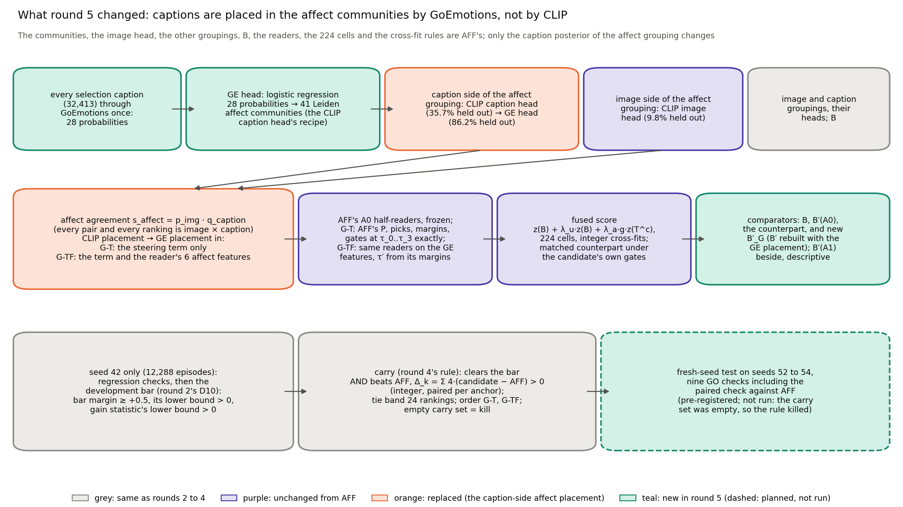
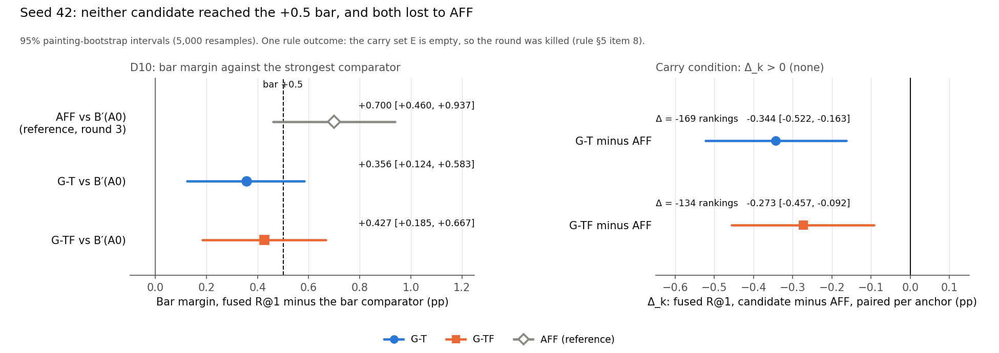
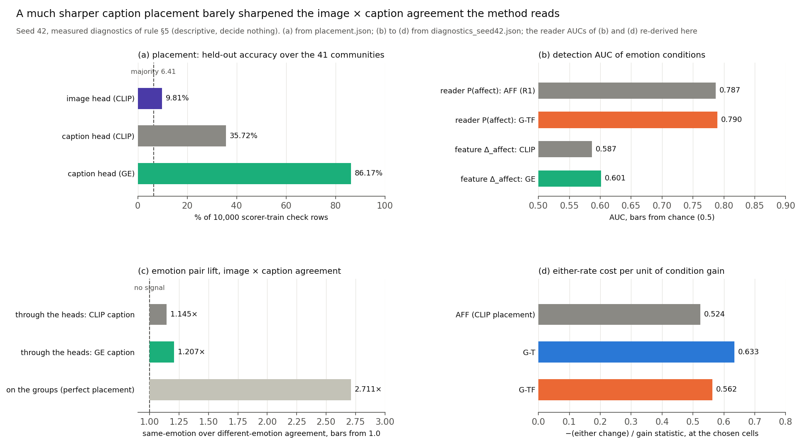
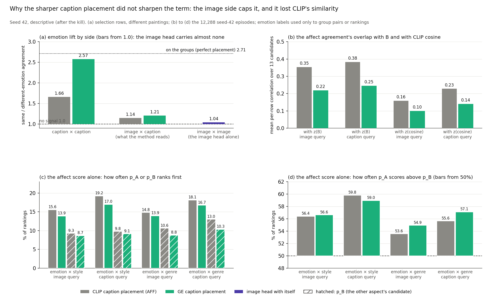
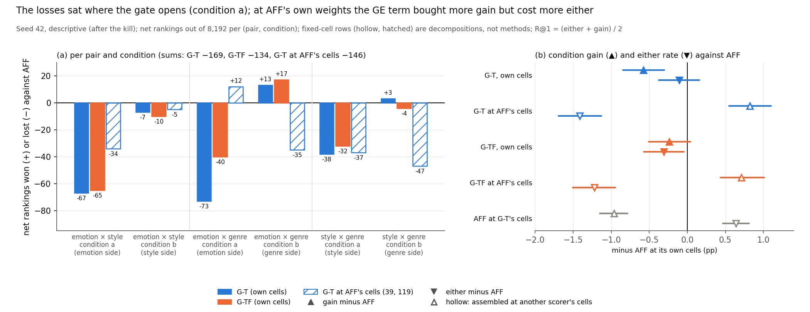
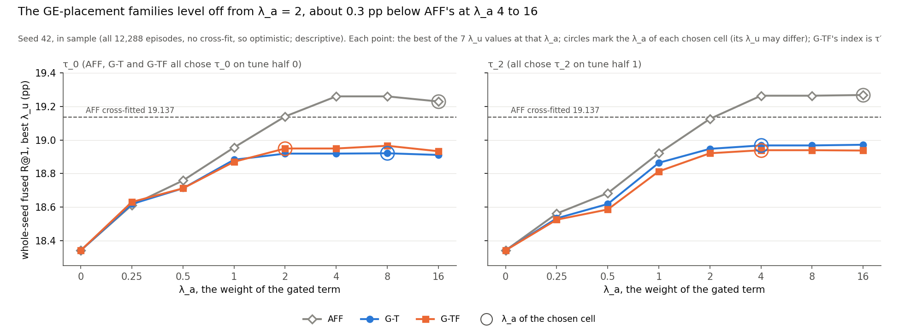

# CoSiR v2 reader fix, round 5 (idea 3): GoEmotions placement of captions on AFF, developed on seed 42 (kill: neither candidate beat AFF)

**Report date:** 2026-11-23. Like the folder date `20261123`, this is a sequence number in this line of work, not a
calendar date. The round ran on 2026-10-07 from 07:43 (tab started) to 18:34 (kill recorded), Amsterdam time.
**Status:** development step under the committed decision rule. **Outcome: kill** (rule §5 item 8). Neither candidate
cleared the development bar (D10 clause 1), and both lost to AFF in paired fused R@1 on seed 42, so the carry set was
empty, no test seed was built, seeds 52 and later stay free, and AFF (round 3's one-sided affect steering, frozen as
tested) stays the current best. The decision quantities are the three clauses of the development bar and the paired
differences Δ_k against AFF (§5). The seed-42 regression checks (§4) checked the code. The measured diagnostics of the
rule (§5.2) are descriptive, and §6 was computed after the kill and decides nothing. An independent re-derivation, in
its own code, agreed with the implementation on all 492 compared quantities (§8.3). The whole-branch final review
confirmed the kill with a third derivation in its own code: 976 comparisons, none failed (§8.5).
**Records:** binding rule `src/test/20261123_idea3_goemotions/DECISION_RULE.md` (commit 750e06f, SHA-256
19e59fc7…735e); spec `docs/superpowers/specs/2026-10-07-idea3-goemotions-design.md` (commit 393c3c2); plan
`docs/superpowers/plans/2026-10-07-idea3-goemotions.md` (750e06f); handoff
`docs/superpowers/handoffs/2026-10-07-idea3-goemotions-handoff.md`; run log `20261123_idea3_goemotions_log.md`; rule
check `rule_check/opus_rule_check.md`; independent re-derivation `rederive/rd5_stageA_report.md` and
`rederive/rd5_phase1_report.md`; final review `final_review/final_review.md`; task briefs, reports and review diffs in
`.superpowers/sdd/2026-10-07-idea3-goemotions/` (ledger `progress.md`). Commits since the handoff (63e0934): 393c3c2
(spec), 750e06f (rule, rule check, plan), 687f5ac, 1183658, 20d7ce0, ee0bfb7, e3d5c7a, 5bf40f4, a2466b5, fba8a45,
ce095c4, b9a7d28, 575c844, c8ec8ca, ba256d8, 7542d36 (code, tests and fix rounds), e6bd95a and ad7fc3d (the two SHA-256
constants), 345fbb0 (re-derivation, its agreement and the kill in the log), 4a1a22c (run-log time corrections), 2668601
(final-review tests, after the run; no number changed); `cache/`, `results/` and
`rederive/results/` are gitignored. Figures, `figure_data.json`, the rebuild behind §6 (`why_rebuild.py`,
`why_rebuild.json`) and `build_figures.py` are in `docs/reports/assets/2026-11-23_idea3_goemotions/`. Paths without a
folder are under `src/test/20261123_idea3_goemotions/`. Earlier reports of this line: [round 1](2026-11-18_reader_fix_csd.md),
[round 2](2026-11-19_reader_fix_round2.md), [the brainstorm](2026-11-20_r1_levers_brainstorm.md),
[round 3](2026-11-21_round3_affect_gate.md), [round 4](2026-11-22_round4_aff_vetoes.md); this report defines every
term it uses.

## Summary

CoSiR v2 scores an image and a caption under an aspect that is shown only through example pairs. **AFF** is a
label-free reader that adds a weighted grouping term to B, the project's standard condition-free score, only when it
picks the affect grouping (41 Leiden communities of the captions' GoEmotions emotion probabilities). Round 3 tested it
on the fresh episode seeds 49 to 51 and it passed, with a bar margin of +0.591 [+0.462, +0.729] R@1 against B′(A0).
Round 4's three vetoes on its gate did not beat it; they could only change where AFF steers. One idea of the
brainstorm was left that changes the steering term itself.

**What we tried (idea 3).** AFF reads the affect grouping through two CLIP heads: an image head (9.81% held-out
accuracy over the 41 communities) and a caption head (35.72%). We replaced the caption head by a **GE head**, a logistic
regression from each caption's 28 GoEmotions probabilities to the communities, which reached **86.17%** on the same
check rows. Two candidates, each with its own matched counterpart:

- **G-T** uses the GE placement in the steering term only; its reader, picks, margins and gates are AFF's exactly;
- **G-TF** uses it in the term and in the reader's six affect features (with thresholds τ′ re-centred on its own
  margins).

A candidate was to be carried to the fresh seeds 52 to 54 only if it cleared round 2's development bar against the
strongest of B, B′(A0), B′_G (B′ rebuilt with the GE placement) and its counterpart, and also beat AFF in paired fused
R@1 on seed 42 (Δ_k > 0).

*Table S1. The decision numbers on seed 42 (R@1, percentage points, 95% painting-bootstrap intervals). Δ_k is the net
number of the 49,152 seed-42 rankings (12,288 episodes, four rankings each) that the candidate won over AFF.*

| Scorer | Fused R@1 | Bar comparator | Bar margin | D10 clauses (point ≥ +0.5; lower bound > 0; gain lower bound > 0) | Δ_k against AFF: rankings; pp | Carried |
|---|---|---|---|---|---|---|
| AFF (reference) | 19.137 | B′(A0) | +0.700 [+0.460, +0.937] | all hold | | |
| G-T | 18.793 | B′(A0) | +0.356 [+0.124, +0.583] | clause 1 fails | −169; −0.344 [−0.522, −0.163] | no |
| G-TF | 18.864 | B′(A0) | +0.427 [+0.185, +0.667] | clause 1 fails | −134; −0.273 [−0.457, −0.092] | no |

**The carry set was empty, so the rule killed the round.** Both candidates failed the +0.5 bar, and both lost to AFF
with intervals that exclude 0. B′_G (18.398) fell 0.039 [−0.206, +0.122] below B′(A0) (18.437), so B′(A0) stayed the
bar comparator. This is what the prior, written before any number, expected: "the gain is small at best, because every
agreement multiplies the sharper caption posterior by the weak image head" (spec §6), and "a kill at the carry would
not surprise us" (rule header). The prior underrated G-T's loss: it did not expect G-T to move AFF's R@1 by much, and
G-T lost 0.344 pp.

**Why a much sharper placement did not help** (descriptive, seed 42, computed after the kill; it decides nothing):

- **The image side capped it.** Every agreement the method reads pairs one image with one caption. The GE placement
  raised the emotion lift between captions from 1.66 to 2.57 (the communities themselves reach 2.71), but the image
  head on its own carries almost none (1.04), so the image × caption lift moved only from 1.145 to 1.207.
- **The GE agreement lost part of the similarity the CLIP agreement carried** (a descriptive association). The CLIP
  caption head and the CLIP image head read the same embedding space. Their agreement overlapped with B (per-row
  correlation 0.35 and 0.38) and with CLIP cosine (0.16 and 0.23); the GE agreement less (0.22 and 0.25; 0.10 and 0.14).
  Used alone as a ranking, the GE agreement put the emotion candidate p_A first less often in all four (emotion pair,
  direction) cells, for example 17.0% against 19.2%, and still told p_A from the other-aspect candidate about as well as
  before.
- **The GE term cost more either rate per unit of gain.** It needed less weight for its gain, but each unit of gain cost
  more either rate. At AFF's own cells it bought 0.82 pp more condition gain than AFF but lost 1.42 pp of either rate.
  The cross-fit moved to cells with 2.4 to 4 times less term weight relative to B, and in sample the GE families level
  off about 0.3 pp below AFF's at every weight from λ_a = 4 up.
- **The losses sat where the gate opens.** Condition a of the three pairs cost G-T 178 net rankings and condition b
  won back 9.
- **Not supported:** a same-painting explanation. The GE agreement between a painting's image and another annotator's
  caption of it was as high, relative to other paintings, as the CLIP agreement's (1.28 against 1.26).

*Sources: `results/dev_seed42.json`, `results/carry.json`, `results/placement.json`, `DECISION_RULE.md` (header prior,
D6 to D10, §5); §6 numbers from `figure_data.json` (`descriptive`), which collects `why_rebuild.json`.*

## 1. Terms and setup

**The task.** An **episode** has a **query** (one image, or one caption, of an anchor painting), 4 **support pairs**,
4 **contrast pairs** and 13 **candidates** in the other modality. Each example pair is cross-item: the image of one
row and the caption of another row, from different paintings, that share a value of one aspect. The supports share a
value of aspect A, the contrasts a value of aspect B. Candidate p_A shares the query's value of A, p_B its value of B,
and 11 negatives share neither. Under **condition a** the target is p_A; under **condition b** supports and contrasts
swap and the target is p_B. Each episode gives four **rankings** (two conditions, two directions: an image query,
**i2t**, or a caption query, **t2i**). The aspects are emotion, style and genre on ArtELingo, giving three **aspect
pairs**: emotion × style, emotion × genre and style × genre, where the first aspect is A. We call condition a of the
two emotion pairs **the emotion side**.

**Seed 42** draws 12,288 episodes (4,096 per pair) on 4,602 anchor paintings of the selection rows (32,413 rows on
6,451 paintings). It is the development draw of this line and has been read very many times, including AFF's discovery.
The fresh **test seeds** 52, 53 and 54 were reserved for this round and were not built.

**Metrics** (per episode, averaged over its four rankings, pooled over the three pairs, in percentage points).

| Term | Meaning |
|---|---|
| R@1 | the target ranks strictly first (ties miss; chance 7.69%) |
| other-aspect rate | the other aspect's candidate ranks first |
| condition gain | R@1 minus the other-aspect rate; exactly 0 for any scorer that ignores the condition |
| either rate | R@1 plus the other-aspect rate, so **R@1 = (either + gain) / 2** |
| interval | 95% percentile interval of a bootstrap over anchor paintings (5,000 resamples, seed 42), cross-fit choices held fixed |
| net rankings | Σ over episodes of 4 × (R@1 difference): rankings won minus rankings lost, an integer out of 49,152 (8,192 per pair and condition) |

**The reader and AFF** (unchanged from round 3).

| Term | Meaning |
|---|---|
| grouping, A0 | a partition of the scorer-train rows built without evaluation labels. **A0** = (affect, image, caption): *affect* is the 41 Leiden communities of the scorer-train rows on their 28 GoEmotions caption probabilities; *image* and *caption* are k-means with 64 clusters on CLIP image or caption features |
| head, placement | a logistic regression that predicts a row's group from its image or its caption. A **placement** is the resulting posterior over the groups; the affect grouping has an image head and a caption head on frozen CLIP ViT-B/32 features |
| agreement, s_h | the grouping score s_h(q, k): the dot product of the query's and the candidate's posteriors, always one image with one caption. For affect, s_affect = p_img · Q(caption), p_img the image head's posterior and Q the caption placement |
| S_h, C_h, Δ_h | the mean agreement of grouping h over the 4 support pairs (S) and over the 4 contrast pairs (C), each pair's image with its caption; Δ_h = S_h − C_h. Condition b swaps S and C |
| half-reader, P^c(h) | round 1's two multinomial logistic regressions on 18 features per (episode, condition) (six per grouping: S, C, Δ, the two spreads and the arg-max match share), each trained on practice episodes from one painting half; P^c(h) is their mean probability that the supports share grouping h under condition c |
| T^c, π^c, m^c | the weighted term T^c = Σ_h P^c(h)·s_h; the pick π^c = arg max_h P^c(h); the margin m^c, largest minus second-largest P^c(h) |
| τ_0 to τ_3 | the 0th, 25th, 50th and 75th percentiles of R1's 24,576 seed-42 margins, frozen |
| **R1** | round 1's learned reader with the confidence gate g^c = 1[m^c ≥ τ]; round 1 called this scorer R-c, and "round-1 R-c" means its stored arrays and numbers |
| **AFF** | R1 with the gate opened only on affect picks: g^c = 1[m^c ≥ τ] · 1[π^c = affect]; round 3's candidate, frozen as tested |
| redundancy | the mean over ranking rows of the Pearson correlation, over the 13 candidates, of z(s_h) and z(B) (round 3's D7; label-free) |

**New in this round.**

| Term | Meaning |
|---|---|
| GoEmotions file | the 28 sigmoid probabilities of SamLowe/roberta-base-go_emotions for each of the 32,413 selection captions, computed once (`cache/r5_goemotions_selection.npz`) |
| **GE head**, Q_GE | a multinomial logistic regression from the 28 GoEmotions probabilities to the 41 communities, fitted with the CLIP caption head's recipe (the same 60,000 scorer-train rows, C = 1, lbfgs, cap 300) on the stored scorer-train probabilities; Q_GE is its posterior on the selection captions, the **GE placement** |
| Q_CLIP | the CLIP caption head's posterior, the **CLIP placement** that AFF uses |
| **G-T** | AFF with s_affect computed from Q_GE in the steering term only; P, m, π and the gates are AFF's (asserted) |
| **G-TF** | AFF with Q_GE in the term and in the six affect features of the reader (S, C, Δ, the two spreads and the arg-max match share), the frozen half-readers on these features, and its own thresholds |
| τ′_0 to τ′_3 | G-TF's thresholds: the 0th, 25th, 50th and 75th percentiles of its own 24,576 seed-42 margins, frozen for later seeds |
| **B′_G** | B′(A0)'s condition-free recipe rebuilt with the GE placement |
| fixed-cell decomposition | a scorer's terms assembled at another scorer's chosen cells (§6.5); a diagnostic, not a method |

**Fusion, comparators and the decision.**

| Term | Meaning |
|---|---|
| B | the project's standard condition-free score: cosine, the method-A factor term (the centred factor term of the method-A checkpoint, a factor model trained on scorer-train rows) and an averaged head agreement over three k-means groupings, fused with weights cross-fitted on the seed's parity halves |
| **B′(A0)**, B′(A1) | B rebuilt with the averaged agreement over A0's groupings (the probe term), or over A1's, which add the csd style grouping (Leiden communities of the paintings' CSD embeddings; CSD, Contrastive Style Descriptors, is a pretrained style-embedding model); B′ = z(cosine) + λ_u·z(method-A term) + λ_a·z(probe term), cross-fitted |
| cell | one (τ index, λ_u, λ_a); the fused score is z(B) + λ_u·z(B) + λ_a·g^c·z(T^c), z a per-row z-score taken before the gate; 224 cells = 4 τ × 7 λ_u × 8 λ_a. Since λ_u multiplies z(B), the ranking depends on λ_a / (1 + λ_u), the **relative term weight** |
| cross-fit, tune half | episodes split by index parity; the cell chosen on tune half h scores the other half. The fused reader takes the cell with the largest min(ρ − ρ_ctrl, γ) in integer hit counts (round 2's rule) |
| **matched counterpart**, G_cf | the same 224 cells with the gated term replaced by G_cf = (g^a·z(T^a) + g^b·z(T^b)) / 2 under the candidate's own term and gates, so only the condition is removed; it picks its cells by the most hits |
| bar comparator, **bar margin** | the bar comparator is whichever of B′_G, B′(A0), the counterpart and B has the largest mean R@1 (ties in that order); the bar margin is the fused reader minus it, paired per anchor |
| margin | fused reader minus its own matched counterpart, paired per anchor |
| **gain statistic** | the fused reader's condition gain minus its counterpart's (0 by construction) |
| **D10**, development bar | round 2's bar: (1) bar margin point at least +0.5; (2) its lower bound above 0; (3) the gain statistic's lower bound above 0 |
| **Δ_k** | Σ over seed 42's episodes of 4 × (candidate k's fused R@1 minus AFF's), an integer; its point in pp is 100·Δ_k / 49,152. "Beats AFF" means Δ_k > 0 |
| **carry**, **kill** | E = the candidates that clear D10 and have Δ_k > 0; a non-empty E carries its best member (ties within 24 rankings go to G-T) to the test seeds; an empty E is a kill |
| either cost per unit of gain | −(either change against the counterpart) / gain statistic, at the chosen cells; AFF's is 0.524 |

*Sources: `DECISION_RULE.md` §1, §2, D1 to D11, §5; round 4's report §1; the brainstorm §1; `src/eval/aspect_episodes.py`
(cross-item example pairs).*

## 2. How we got here

**Round 3** (2026-10-06) tested AFF on the fresh seeds 49 to 51 and gave **GO**: bar margin +0.591 [+0.462, +0.729]
against B′(A0). **Round 4** (2026-10-07, 00:17 to 02:36) tried three vetoes on AFF's gate and was killed on seed 42
(Δ_k −18, −18 and −34). Its report concluded that gating can only redistribute AFF's steering, and that idea 3 was the
only remaining idea that could raise what steering buys on the emotion side.

**Idea 3** (the brainstorm, §3.3). The affect communities carry emotion strongly when every row is placed perfectly
(pair lift 2.71, the Leiden report §4) and weakly through the heads (1.145), and the CLIP caption head reaches only
35.72%. On R1, the margin over the counterpart was larger with a caption query (+0.671) than with an image query
(+0.216), which suggested the caption side carries the usable affect signal. A sharper caption placement should need
less weight for the same gain, which is where AFF's either cost sits (0.52 either per unit of gain, brainstorm §2.2).
The brainstorm named the risk: the counterpart might absorb part of a sharper condition-free similarity.

**The user's decisions** (handoff §2, not reopened): round 4's kill stands; idea 3 before the held-split paper test, so
that both held reads stay available; a cheap measured step on seed 42 before any fresh-seed round; the process of
rounds 3 and 4.

**The spec** (07:45 to 08:04, open points settled with the user one at a time):

1. Idea 3 is not the parked grouping redesign (design L): the communities, the image head, the other groupings and B
   stay as they are; only the caption placement changes.
2. The placement is a logistic head on the 28 GoEmotions probabilities with the CLIP caption head's recipe (the user
   chose it from three options, before any number).
3. Two candidates in one development family, G-T and G-TF.
4. Round 4's carry on seed 42 (D10 and Δ_k > 0); the detection AUCs descriptive; the test on seeds 52 to 54
   pre-registered in the same rule.
5. Comparators: B, B′(A0), B′_G and each candidate's counterpart; B′(A1) beside, descriptive.
6. GoEmotions once on the selection captions, on the local GPU under the shared lock if free, otherwise on CPU.

**The rule check.** A fresh Opus reviewer checked the draft rule before its commit (§8.1): 0 blocking, 5 should-fix and
14 nits, all applied. It reproduced every stated constant through the float32 path without computing any number of
G-T, G-TF or B′_G.

*Table 1. The round, in Amsterdam time (from the run log and the SDD ledger; commit times from git).*

| Time | Step |
|---|---|
| 07:43 | tab `idea3-goemotions` started from the handoff; GPU free, load 0.3 |
| 07:45 to 08:04 | the handoff's open points settled with the user; both design sections approved |
| 08:05 | spec committed (393c3c2); the user approved it at about 08:10 and rule drafting was dispatched to an Opus subagent |
| 09:33 | draft rule written (747 lines); the controller read it in full |
| 09:36 to 09:59 | fresh Opus rule check: 0 blocking, 5 should-fix, 14 nits |
| 10:01 | all 19 findings applied; rule, rule check and plan committed (750e06f) |
| 15:58 | the user chose subagent-driven execution |
| 16:03 to 18:19 | Tasks 0 to 5 implemented with task reviews and fix rounds (§8.2); re-derivation stage A (16:03 to 16:22, earlier rounds' targets only) |
| 16:08 to 16:26 | process lapse: `.pyc` files in rounds 1 to 3's read-only folders; 16 deleted by the controller at 16:26 (§7) |
| 16:27 to 16:33 | process lapse: Task 3's mutation run patched two modules in place (§7) |
| 17:39 to 17:41 | all eight list-A test files pass together: 373 tests |
| 17:41 | GPU held by another project (MultiMAE training, pid 959679); GoEmotions on CPU by rule D2 |
| 17:42 to 17:48 | **GoEmotions step** on CPU: item 2 passes; 32,413 captions; SHA-256 committed (e6bd95a) |
| 17:48 to 17:50 | **placement step**: item 3 passes; GE head converged in 139 iterations; **held-out accuracy 86.17%**; SHA-256 committed (ad7fc3d) |
| 17:49 to 17:50 | re-derivation phase 1 (stage B) ran; its numbers withheld until the implementation's `carry.json` existed |
| 18:19 to 18:23 | Tasks 0 to 5 complete with clean reviews; all eight list-A test files pass together: 403 tests |
| 18:23 to 18:25 | **seed-42 run** on CPU at 7542d36: items 1 to 4 pass (361 comparisons); development step; carry set empty; console "KILL (pending the phase-1 agreement, rule §8)" |
| 18:27 | the controller checked the re-derivation's imports against rule §8's list: conforms |
| 18:34 | phase-1 agreement: 492 quantities identical; **kill recorded** (345fbb0) |

*Sources: round 4's report (Summary, §9); the brainstorm §2.2 and §3.3; the Leiden report §3 and §4; the handoff §2
to §5; the spec §1; the run log (all times); the ledger; `rule_check/opus_rule_check.md`; `git log`.*

## 3. Method

### 3.1 What idea 3 changes

Both candidates keep every ingredient of AFF except the caption side of the affect grouping (Figure 1). The communities,
the image head, the image and caption groupings, B, the frozen A0 half-readers, the 224 cells, both cross-fit rules
and the counterpart recipe are AFF's.

*Figure 1. Round 5 against AFF. Grey: the same as rounds 2 to 4 (seed-42 development, the bar, the carry). Purple:
unchanged parts of AFF. Orange: replaced (the caption placement of the affect grouping, and what reads it). Teal: new in
round 5 (the GoEmotions pass, the GE head, B′_G); the dashed teal box is the fresh-seed test, pre-registered and not
run.*

**The placement.** GoEmotions (SamLowe/roberta-base-go_emotions, 28 sigmoid labels, batch 256, max_length 64) was run
once on the 32,413 selection captions, joined as the affect line's post-hoc script joins them. The GE head was fitted on
the same 60,000 scorer-train rows the CLIP heads were fitted on, with the stored scorer-train GoEmotions probabilities
as input (raw, no normalisation) and the communities as labels. The communities were themselves built by Leiden on a
kNN graph of these same 28 probabilities, so a head on this input predicts them well partly by construction. The CLIP
heads predict them from another space.

**The two candidates.** s_affect(q, k) is the image head's posterior of the image times the placement of the caption,
in both directions. G-T recomputes only this score, so its term is T^c = Σ_h P^c(h)·s_h with AFF's P^c and the new
s_affect, and its gates equal AFF's at every τ index and condition (asserted in the run). G-TF also recomputes the six
affect features of the reader from the GE placement. The frozen half-readers then see features of another distribution,
so their probabilities, picks and margins shift; τ′ re-centres the thresholds on G-TF's own margins (label-free).

### 3.2 Comparators

Each result below names its baseline. **AFF** is the reference for both candidates (Δ_k, paired per anchor). The bar
comparator is the strongest of **B′_G**, **B′(A0)**, the candidate's **matched counterpart** and **B**. B′_G and the
counterpart are rebuilt with the same placement, so any condition-free value of the GE agreement is credited to a
comparator, the matched-control lesson of this project. A larger comparator set raises clause 1's bar-margin point; it
need not raise clause 2's lower bound, since the max-mean comparator can pair less noisily than another (rule check
N11). **B′(A1)** (18.805 on seed 42) is reported beside AFF and each candidate and decides nothing.

### 3.3 The development bar, Δ_k and the carry

As in round 4: D10 (bar margin at least +0.5 with a lower bound above 0, gain statistic's lower bound above 0) and
Δ_k > 0, an exact integer comparison with AFF on the same episodes; candidates within 24 net rankings of the best are
tied, ties to G-T; an empty carry set is a kill. Had a candidate been carried, the rule would have built seeds 52 to 54
once each and required all nine GO checks, pooled, to have a lower bound above 0, among them the candidate minus AFF.
None of this ran.

### 3.4 What was frozen, and the prior

The GoEmotions file, the GE head and Q_GE, the A0 half-readers, τ_0 to τ_3 and G-TF's τ′, the affect restriction, the
224-cell family with its tie rules, the heads and the recipes of B, B′(A0) and B′_G were frozen from seed 42 or
earlier. The prior, written into the rule before any number: "We expect a small gain at best. Every agreement and every
grouping score pairs one image with one caption, so s_affect multiplies the sharper caption posterior by the image
head's"; for G-T, "we do not expect it to move AFF's seed-42 R@1 by much in either direction"; for G-TF's readers, "we
cannot predict the direction of that shift from what we have"; and "a kill at the carry would not surprise us; a GO
would". The brainstorm's suggested detection bar
(an AUC above 0.83) is not a bar in the rule.

*Sources: `DECISION_RULE.md` header (prior), D2 to D10, §5, §6; the spec §2 to §4; the brainstorm §3.3;
`rule_check/opus_rule_check.md` N11.*

## 4. Seed 42: the regression checks and the re-derivation

The baselines here are the stored numbers of rounds 1 to 4, the brainstorm and the told-oracle line: before any
GE-placement number was computed, the new code path had to reproduce them exactly. A guard (rule D11) refused every
function that can take the GE placement until items 1 to 4 had passed and been recorded; the diagnostics were further
refused until `results/carry.json` existed. The seed-42 run passed all 361 comparisons (Table 2).

*Table 2. Seed-42 regression checks (rule §5 items 1 to 4), all at full precision.*

| Item | What had to match | Comparisons | Result |
|---|---|---|---|
| 1. Bundle, R1, AFF, B′(A1) | round 3's bundle against round 1's `load_bundle` (episodes, B, B′(A0), the A0 posteriors, stack and features, the D7 redundancy values); round 4's A1 extension (B′(A1) mean 18.804931640625); R1 = round-1 R-c (cells 116, 119 and 58, 123; bar margin +0.444); AFF = round 3's targets (fused 19.137, counterpart 18.396, bar margin +0.700, cells 39, 119 and 149, 10; τ_0 open counts 9,941 and 3,627); all R1 and AFF arrays equal round 4's `seed42_arrays.npz` | 184 | exact |
| 2. GoEmotions | re-asserted from the GoEmotions step: a rerun of 2,048 scorer-train captions on CPU within 1e-4 of the stored CUDA probabilities (largest difference 4.47e-6, mean 3.49e-8, none above 1e-5); 32,413 non-empty selection captions in selection order; the file's SHA-256 equal to the committed constant | 20 | pass |
| 3. Placement function | the placement function fed CLIP caption or image features equals `fit_one_head`'s posteriors exactly (NaN pattern included), with 35.72% and 9.81%, `classes_` 0 to 40, the draw's SHA-256 and the head record of `told_oracle.json` | 21 | exact |
| 4. The CLIP placement through this round's code | with Q_CLIP passed in: the extension equals the bundle's stack, features and B′(A0); G-T's and G-TF's readers give AFF's P, T, m and π, τ′ = τ element by element, AFF's gates, cells, σ* and arrays; the records give AFF's numbers with Δ_k = 0; the pair-lift code reproduces `told_oracle.json` (1.1445184466303795 and the two contrast ratios); the AUC code gives 0.7870951145887375 | 136 | exact |

After release, D5's positive check showed, with booleans only, that the GE extension used Q_GE: its affect slice
equalled an independent einsum from Q_GE and the image posterior, and differed from the bundle's on at least one
episode, as did feature columns 0 to 5.

**The independent re-derivation** (phase 1) was written by an agent that never read the implementation, in its own code,
importing only what rule §8 lists; the controller checked its import lines against that list at 18:27. Stage A
(16:20 to 16:22) reproduced 76 of 76 earlier-round targets, among them R1, AFF, τ, item 3 with its own placement
function and item 4's τ and B′ parts. Stage B ran a CPU spot check of 1,024 selection captions against the GoEmotions
file (largest difference 3.28e-7), fitted its own GE head (86.17%, 139 iterations, no fallback) and computed every
development number, the D10 clauses, the Δ_k and the carry. It found the kill on its own, and its results stayed out of
the ledger and the run log until the implementation's run had written `carry.json`. At 18:34 it compared 492 quantities
with the implementation's files: 222 discrete values, 142 values in pp, 24 τ and τ′ values and 104 arrays, Q_GE among
them. Every one was identical; the largest difference was 0. Seven planted perturbations were each caught, and neither
side found a boundary case.

*Sources: `results/regression_check.json` (361 comparisons: 184, 20, 21 and 136 by item); `results/run_r5_seed42.log`;
`cache/r5_goemotions_selection.json` (item 2); `results/placement.json` (item 3); `results/dev_seed42.json`
(`positive_check_D5`); `rederive/rd5_stageA_report.md` §1 and §4, `rederive/rd5_phase1_report.md` §1, §3, §6, §7; the run
log (18:27, 18:34).*

## 5. The development step on seed 42

The baseline for both candidates is AFF, scored on the same episodes by the same code, with each candidate's
condition-free comparators beside it.

### 5.1 The decision numbers

*Table 3. The two candidates beside AFF on seed 42 (R@1 and condition gain in percentage points, 95%
painting-bootstrap intervals). Cells: fused, then counterpart, for tune halves 0 / 1; σ* = 0 on both halves for every
scorer.*

| | AFF (reference) | G-T | G-TF |
|---|---|---|---|
| Fused R@1 | 19.137 | 18.793 | 18.864 |
| Counterpart R@1 | 18.396 | 18.329 | 18.235 |
| Comparator means: B′_G / B′(A0) / B | (B′_G not in its set) / 18.437 / 18.341 | 18.398 / 18.437 / 18.341 | 18.398 / 18.437 / 18.341 |
| Bar comparator | B′(A0) | B′(A0) | B′(A0) |
| **Bar margin** | +0.700 [+0.460, +0.937] | +0.356 [+0.124, +0.583] | +0.427 [+0.185, +0.667] |
| Margin against its counterpart | +0.741 [+0.520, +0.960] | +0.464 [+0.267, +0.663] | +0.629 [+0.423, +0.837] |
| **Gain statistic** | +3.111 [+2.780, +3.456] | +2.531 [+2.232, +2.837] | +2.873 [+2.559, +3.200] |
| Either change against its counterpart | −1.630 | −1.603 | −1.615 |
| D10 clauses 1 / 2 / 3 | yes / yes / yes | **no** / yes / yes | **no** / yes / yes |
| **Δ_k against AFF** (net rankings) | | **−169** | **−134** |
| Δ_k in pp | | −0.344 [−0.522, −0.163] | −0.273 [−0.457, −0.092] |
| Episodes better / worse than AFF | | 814 / 967 | 864 / 979 |
| Fused cells (τ index, λ_u, λ_a) | 39 (τ_0, 4, 16) / 119 (τ_2, 0, 16) | 46 (τ_0, 8, 8) / 117 (τ_2, 0, 4) | 12 (τ′_0, 0.5, 2) / 117 (τ′_2, 0, 4) |
| Counterpart cells | 149 (τ_2, 4, 4) / 10 (τ_0, 0.5, 0.5) | 101 (τ_1, 8, 4) / 25 (τ_0, 2, 0.25) | 67 (τ′_1, 0.5, 1) / 164 (τ′_2, 16, 2) |
| τ_0 gate open, condition a / b (of 12,288) | 9,941 / 3,627 | 9,941 / 3,627 | 9,825 / 3,431 |
| Minus B′(A1) (18.805), beside | +0.332 [+0.048, +0.625] | −0.012 [−0.290, +0.270] | +0.059 [−0.223, +0.351] |

G-TF's thresholds were τ′ = 2.4383e-05, 0.21725, 0.47370 and 0.74248, close to AFF's τ = 3.8685e-05, 0.21702, 0.47974
and 0.75026. The integer sums behind the means (Σ 4·R@1 over 49,152 rankings) were 9,406 for AFF, 9,237 for G-T, 9,272
for G-TF, 9,243 for B′(A1), 9,062 for B′(A0), 9,043 for B′_G and 9,015 for B.

*Figure 2. Left: the bar margin of each scorer against its bar comparator, B′(A0) for all three, with the +0.5 bar
(dashed); AFF is the reference (hollow diamond). Right: Δ_k, each candidate's fused R@1 minus AFF's, paired per anchor;
the carry needed a point above 0.*

**The carry.** Both candidates failed clause 1 (+0.356 and +0.427 against +0.5) and passed clauses 2 and 3. Both Δ_k
are negative, with intervals that exclude 0. So E was empty, M undefined and nothing was carried: **kill** (rule §5 item
8). No boundary case arose: no D10 value lies within 1e-12 of its threshold and no Δ_k is 0. No test seed was built, the
sensitivity projection of rule §6.1 (defined only for a carried candidate) was not computed, and seeds 52 and later stay
free.

**B′_G.** B′_G was 0.039 [−0.206, +0.122] below B′(A0) (19 net rankings) and 0.057 [−0.072, +0.192] above B. Both
differences are within noise. Since B′(A0) remained the largest comparator, keeping B′_G in the set changed nothing on
seed 42.

*Table 4. Per-pair bar margins on seed 42 (descriptive, not tested; each against B′(A0)).*

| Scorer | emotion × style | emotion × genre | style × genre |
|---|---|---|---|
| AFF | +0.977 [+0.579, +1.378] | +1.453 [+1.034, +1.876] | −0.330 [−0.709, +0.055] |
| G-T | +0.525 [+0.134, +0.920] | +1.086 [+0.678, +1.490] | −0.543 [−0.921, −0.170] |
| G-TF | +0.519 [+0.117, +0.938] | +1.312 [+0.881, +1.735] | −0.549 [−0.929, −0.177] |

Both candidates were below AFF on every pair: by 0.452 [0.134, 0.766] (G-T) and 0.458 [0.134, 0.780] (G-TF) on
emotion × style, 0.366 [0.043, 0.690] and 0.140 [−0.178, 0.457] on emotion × genre, and 0.214 [−0.080, 0.506] and 0.220
[−0.074, 0.527] on style × genre (fused R@1, paired per anchor). The style × genre weakness of AFF did not improve, and its
point estimate got slightly worse.

*Sources: `results/dev_seed42.json` (every number of Tables 3 and 4, τ′, B′_G, the beside lines), `results/carry.json`;
the integer sums, the better / worse counts, B′_G minus B and the per-pair differences from `figure_data.json`
(`descriptive`: `int_sums`, `minus_AFF`, `BprimeG_minus_BprimeA0`, `BprimeG_minus_B`). `build_figures.py` re-derives
every decision number of Table 3 from `results/seed42_arrays.npz` and asserts that each equals `dev_seed42.json` or
`carry.json` exactly, except the chosen cells, σ* and τ′, which it checks between `seed42_arrays.npz` and
`dev_seed42.json`.*

### 5.2 The measured diagnostics

The rule fixed four diagnostics before any number; they are descriptive and decide nothing (Figure 3).

*Figure 3. (a) Held-out placement accuracy over the 41 communities on the same 10,000 scorer-train check rows. (b)
Detection AUC of emotion conditions. (c) Emotion pair lift through the image × caption agreement on selection rows. (d)
Either cost per unit of condition gain at the chosen cells. Bars start at a meaningful baseline (0, chance 0.5, or no
signal 1.0).*

*Table 5. The measured diagnostics, CLIP placement (AFF) against GE placement.*

| Diagnostic | CLIP placement (AFF) | GE placement | Reference |
|---|---|---|---|
| Placement accuracy, held out | caption head 35.72% | GE head 86.17% | image head 9.81%; majority 6.41%; uniform 2.44% |
| Detection AUC of the reader's P(affect) (rule's diagnostic a) | 0.787 (R1, AFF) | 0.790 (G-TF) | the brainstorm's suggested 0.83 |
| Feature AUC of Δ_affect (b) | 0.587 | 0.601 | |
| Pair lift, same over different emotion (c) | 1.145 | 1.207 | on the groups 2.711 |
| Contrast ratio, emotion × style / emotion × genre (c) | 1.071 / 1.038 | 1.126 / 1.093 | |
| Either cost per unit of gain (d) | 0.524 (AFF) | 0.633 (G-T), 0.562 (G-TF) | |

The detection AUCs use the brainstorm's definition: positives are condition a of the two emotion pairs, negatives the
other four (pair, condition) values, 24,576 values pooled. A placement 2.4 times as accurate moved the detection AUC by
0.003, the feature AUC by 0.014 and the image × caption lift from 1.145 to 1.207, far from the 2.711 of a perfect
placement. Per unit of gain, the sharper term cost more either rate (0.633 and 0.562 against 0.524).

*Table 6. Diagnostic (d), the sharper term: fused minus counterpart R@1 per pair and condition, and per query
direction (seed 42, pp; the candidate columns in brackets give the candidate minus AFF, paired).*

| | AFF | G-T (minus AFF) | G-TF (minus AFF) |
|---|---|---|---|
| emotion × style, a | +1.672 | +0.928 (−0.745 [−1.355, −0.134]) | +0.940 (−0.732 [−1.349, −0.121]) |
| emotion × style, b | −0.159 | +0.195 (+0.354 [−0.074, +0.769]) | +0.061 (+0.220 [−0.207, +0.645]) |
| emotion × genre, a | +3.198 | +2.502 (−0.696 [−1.312, −0.085]) | +2.917 (−0.281 [−0.895, +0.322]) |
| emotion × genre, b | +0.061 | −0.049 (−0.110 [−0.579, +0.365]) | +0.342 (+0.281 [−0.187, +0.761]) |
| style × genre, a | −0.342 | −0.598 (−0.256 [−0.800, +0.282]) | −0.427 (−0.085 [−0.642, +0.465]) |
| style × genre, b | +0.012 | −0.195 (−0.208 [−0.639, +0.217]) | −0.061 (−0.073 [−0.526, +0.383]) |
| image query (i2t) | +0.566 | +0.366 (−0.199 [−0.496, +0.095]) | +0.614 (+0.049 [−0.250, +0.356]) |
| caption query (t2i) | +0.916 | +0.562 (−0.354 [−0.652, −0.058]) | +0.643 (−0.273 [−0.569, +0.024]) |

The emotion side lost most of the margin, and the caption-query direction, where the brainstorm expected the gain, lost
more than the image-query direction. The chosen cells moved to lighter term weights (Table 3): G-T's λ_a fell from 16 to
8 and 4, G-TF's to 2 and 4.

*Sources: `results/placement.json` (accuracies); `results/diagnostics_seed42.json` (a) to (d), its orientation block
(AFF's +0.566 and +0.916 equal `bs_09_direction.json`); `build_figures.py` re-derives (a) from the stored P and (d)'s
either cost from the per-anchor arrays and asserts both against `diagnostics_seed42.json`.*

## 6. Why the sharper placement did not help (descriptive)

Everything in this section was computed after the kill. `why_rebuild.py` rebuilt the seed-42 bundle and the GE extension
with the round's own code (CPU only, writing only `why_rebuild.json` beside it). Before keeping any number it checked
that the rebuild reproduced the stored run exactly: AFF's, G-T's and G-TF's gates at every τ index, τ′, B′_G's
per-anchor arrays and all six fused and counterpart per-anchor arrays, re-assembled at their stored cells.
`build_figures.py` computed the rest from `results/seed42_arrays.npz`. The evaluation labels group rows, pairs and
rankings and enter no scorer, as in every per-pair number. Seed 42 is development data. Nothing here decides anything,
and the fixed-cell assemblies of §6.5 are decompositions, not methods. They, and the rankings by the affect score alone
in §6.2, are scorings outside the rule's family, made after the kill for explanation only; rule §5's "no other variant"
sentence governs the development step, which they do not touch.

We tested five hypotheses (Table 11, end of the section).

### 6.1 The image side caps the agreement (hypothesis 1: supported)

Every quantity the method reads pairs one image with one caption: the support and contrast agreements, and the
grouping score of every ranking (an image query with caption candidates, or the reverse). So s_affect = p_img · Q(t),
and a sharper Q helps only as far as p_img carries the same signal.

*Table 7. Sharpness of the three posteriors on the 32,413 selection rows, and emotion lift of their agreements
(selection rows, pairs on different paintings, same emotion over different emotion).*

| | image head | caption head, CLIP | caption head, GE |
|---|---|---|---|
| mean largest probability | 0.103 | 0.261 | 0.692 |
| mean entropy (nats; uniform 3.71) | 3.32 | 2.69 | 0.89 |
| lift, the caption placement with itself | | 1.656 | 2.575 |
| lift, image head × caption placement (what the method reads) | | 1.145 | 1.207 |
| lift, image head with itself | 1.043 | | |

*Figure 4. (a) Emotion lift of the agreement by side. (b) Redundancy of z(s_affect) with z(B) and with z(cosine), per
query direction. (c) With the affect score alone as the ranking: how often p_A (solid) or p_B (hatched) ranks first in
the emotion pairs. (d) How often the affect score puts p_A above p_B. Grey: CLIP placement (AFF); aqua: GE placement.*

On the caption side alone the GE placement almost reaches the communities' own lift (2.575 against 2.711), as its 86%
accuracy suggests. The image head carries almost none: two images of different paintings that share an emotion agree
only 4% more than two that do not, and in the emotion pairs' contrasts the image agreement favours the same style or
genre over the same emotion (contrast ratios 0.965 and 0.941). Multiplying by it, the GE placement's lift fell from
2.575 to 1.207, while the CLIP placement's fell from 1.656 to 1.145. A 55% stronger caption-side lift became a 5%
stronger agreement. One reading, which we did not test here: an image is shared by annotators who felt different
emotions, so an image-side affect posterior is limited by the painting itself (the brainstorm's step 0a found the image
head already at half of a small same-painting ceiling).

### 6.2 The CLIP agreement carried similarity that the GE agreement lost (hypothesis 2: consistent in part)

The CLIP caption head and the CLIP image head are both linear readouts of CLIP's shared image and text space, so their
posteriors co-vary with what CLIP cosine measures. The GE head reads emotion words only.

*Table 8. Redundancy of the affect agreement (mean per-row correlation over the 13 candidates, seed 42).*

| | image query (i2t) | caption query (t2i) |
|---|---|---|
| z(s_affect) with z(B), CLIP placement | 0.353 | 0.383 |
| z(s_affect) with z(B), GE placement | 0.219 | 0.246 |
| z(s_affect) with z(cosine), CLIP placement | 0.159 | 0.228 |
| z(s_affect) with z(cosine), GE placement | 0.100 | 0.141 |
| gated term z(T^a) with z(B) where the gate is open as scored, AFF (8,623 values) | 0.534 | 0.575 |
| the same, G-T (the same 8,623 values) | 0.351 | 0.413 |
| G-T's term with AFF's term on those values | 0.689 | 0.729 |

The image and caption groupings' redundancies are unchanged by construction (0.71 and 0.62 to 0.67 with B). The GE
placement cut the affect agreement's overlap with B by about a third, and on the values where the gate is open G-T's
gated term correlates only 0.69 to 0.79 with AFF's (0.69 and 0.73 on condition a, 0.73 and 0.79 on condition b).

**What that overlap was worth.** Ranking the 13 candidates by the affect score alone shows what each agreement does in
the task (Figure 4c and d). In all four (emotion pair, direction) cells the GE agreement put p_A first less often than
the CLIP agreement (image query: 13.9% against 15.6% on emotion × style, 13.9% against 14.8% on emotion × genre;
caption query: 17.0% against 19.2%, 16.7% against 18.1%), and p_B first less often too (8.7 to 10.3% against 9.3 to
13.0%). On style × genre it put p_B first on 10.4% and 10.6% of rankings against 12.3% and 13.2%. Yet it told p_A from
p_B about as well: p_A scored above p_B on 54.9% to 59.0% of rankings under the GE placement and 53.6% to 59.8% under
the CLIP placement, better on emotion × genre and worse on emotion × style with a caption query. So the GE agreement
kept the emotion contrast between the two aspect candidates and lost part of what lifts both of them above the 11
negatives, which is what B and cosine also do. This is a descriptive association: no scoring here isolates the lost
similarity as the cause of the R@1 loss, and lower redundancy with B is, on its own, what round 3's D7 treated as a
virtue.

**The same-painting variant of this hypothesis is not supported.** If the CLIP agreement's extra value were a
same-painting match, its agreement between a painting's image and another annotator's caption of the same painting
(with a different emotion, 75,210 such pairs) should exceed the GE agreement's. Relative to pairs on different
paintings with different emotions, it did not: 1.260 for the CLIP placement, 1.283 for the GE placement (the image head
with itself: 1.350). The arg-max of an image's posterior matched that of its own caption on 16.7% of rows under the
CLIP placement and 11.2% under the GE placement, but the agreements themselves (a row's image with its own caption,
relative to different paintings) were 1.308 and 1.352. So the overlap with B comes from similarity across paintings,
of the kind cosine measures between a query and other paintings' items; the same-painting check does not show it.

### 6.3 B′_G fell below B′(A0) (hypothesis 3: consistent, within noise)

B′ fuses cosine, the method-A term and the averaged agreement over A0's groupings (the probe term), with cross-fitted
weights. With the GE placement in the probe term, the cross-fit gave it a lighter weight: λ_a 4 on both tune halves,
against 16 and 8 for B′(A0) (λ_u 8 and 16 against 16 and 16). B′_G ended 0.039 [−0.206, +0.122] below B′(A0), 19 net
rankings: −0.110 on emotion × style, −0.037 on emotion × genre and +0.031 on style × genre, all within noise. This fits
§6.2 (an agreement with less overlap with retrieval similarity adds less condition-free value) but does not by itself
show it.

### 6.4 Where the rankings were lost (hypothesis 4)

*Table 9. Net rankings against AFF per pair and condition, each scorer at its own cells (of 8,192 per pair and
condition; R@1 in pp with its interval).*

| Pair, condition (side) | G-T | G-TF | G-T at AFF's cells (§6.5) |
|---|---|---|---|
| emotion × style, a (emotion) | −67 (−0.818 [−1.385, −0.244]) | −65 (−0.793 [−1.360, −0.217]) | −34 |
| emotion × style, b (style) | −7 (−0.085 [−0.394, +0.208]) | −10 (−0.122 [−0.444, +0.183]) | −5 |
| emotion × genre, a (emotion) | −73 (−0.891 [−1.489, −0.292]) | −40 (−0.488 [−1.070, +0.098]) | +12 |
| emotion × genre, b (genre) | +13 (+0.159 [−0.098, +0.413]) | +17 (+0.208 [−0.061, +0.473]) | −35 |
| style × genre, a (style) | −38 (−0.464 [−0.981, +0.060]) | −32 (−0.391 [−0.922, +0.132]) | −37 |
| style × genre, b (genre) | +3 (+0.037 [−0.217, +0.302]) | −4 (−0.049 [−0.316, +0.210]) | −47 |
| **total** | **−169** | **−134** | **−146** |

*Figure 5. (a) Net rankings against AFF per pair and condition: G-T and G-TF at their own cells, and G-T assembled at
AFF's cells (hatched). (b) Condition gain (▲) and either rate (▼) against AFF, at own cells (filled) and at another
scorer's cells (hollow), with 95% intervals.*

**The losses sat where the gate opens.** As scored, AFF's gate (and so G-T's) is open on 8,623 condition-a values and
2,448 condition-b values. Where a gate is shut the fused score is (1 + λ_u)·z(B) and ranks as B, so a candidate whose
gates are AFF's can differ from AFF only on values where steering happens (the final review checked this on seed 42: no
ranking of G-T differs from AFF's where the gate is shut). For G-T this part holds by construction; the content is the
asymmetry per open value: condition a lost 178 rankings on 8,623 open values and condition b gained 9 on 2,448 (G-TF:
−137 and +3). The two emotion sides cost G-T 140 rankings, the place where AFF's steering pays most (round 4 §6.3). G-TF
lost less on emotion × genre's emotion side (−40 against −73) and about the same elsewhere.

**Gain against either.** Against AFF at their own cells, G-T lost 0.580 [0.303, 0.844] of condition gain and 0.108
[−0.160, 0.374] of either rate; its other-aspect rate rose by 0.236. G-TF lost 0.238 [−0.042, 0.507] of gain and 0.307
[0.047, 0.572] of either rate. Since R@1 = (either + gain) / 2, these give −0.344 and −0.273.

### 6.5 The weights: the cells moved, and no weight closes the gap (hypothesis 5)

**The chosen cells moved.** Because λ_u multiplies z(B), what matters is the relative term weight λ_a / (1 + λ_u). AFF
chose 3.2 (cell 39) and 16 (cell 119); G-T chose 0.89 (cell 46) and 4 (cell 117); G-TF chose 1.33 (cell 12) and 4
(cell 117). The τ indices did not move: every scorer chose τ_0 (τ′_0) on tune half 0 and τ_2 (τ′_2) on tune half 1, so
G-T steered on exactly AFF's values.

**The fixed-cell decomposition.** Assembling one scorer's term at another's chosen cells separates the term from the
weight (Table 10). At AFF's own cells (heavy weight), G-T's term bought 0.822 [0.547, 1.100] pp more condition gain
than AFF's but lost 1.416 [1.131, 1.694] pp of either rate, −0.297 [−0.489, −0.104] in R@1 (−146 rankings). At the
same weight the sharper term is more condition-selective, and its either cost outweighs the extra gain. At that weight it
won on the emotion side of emotion × genre (+12) and lost everywhere else, condition b included (−35 and −47). AFF
itself, assembled at G-T's lighter cells, lost 80 rankings (gain −0.964, either +0.639): AFF's term prefers the heavy
weight that G-T's could not afford.

*Table 10. The fixed-cell decomposition (fused R@1 against AFF at its own cells, seed 42; descriptive).*

| Assembly | Cells | Fused R@1 | Net rankings vs AFF | Gain vs AFF | Either vs AFF |
|---|---|---|---|---|---|
| G-T at its own cells | 46, 117 | 18.793 | −169 | −0.580 | −0.108 |
| G-T at AFF's cells | 39, 119 | 18.840 | −146 | +0.822 [+0.547, +1.100] | −1.416 [−1.694, −1.131] |
| G-TF at its own cells | 12, 117 | 18.864 | −134 | −0.238 | −0.307 |
| G-TF at AFF's cells | 39, 119 | 18.880 | −126 | +0.710 [+0.435, +1.009] | −1.223 [−1.503, −0.947] |
| AFF at G-T's cells | 46, 117 | 18.974 | −80 | −0.964 [−1.148, −0.783] | +0.639 [+0.469, +0.810] |
| AFF at G-TF's cells | 12, 117 | 19.055 | −40 | −0.649 [−0.807, −0.492] | +0.486 [+0.341, +0.630] |

Either way of ordering the decomposition, the term accounts for most of G-T's loss: −146 of −169 at AFF's weights, or
−89 (G-T's −169 minus AFF's −80) at G-T's weights.

*Figure 6. Whole-seed fused R@1 of each scorer's 224-cell family (in sample, no cross-fit, so optimistic), the best
λ_u at each λ_a, at the two τ indices the cross-fits chose; circles mark the λ_a of each chosen cell. Dashed: AFF's
cross-fitted 19.137.*

**No weight closes the gap.** In sample, with the best of the seven λ_u at each λ_a, AFF's family rises to 19.23 to
19.27 at λ_a 4 to 16, while the GE families level off from λ_a = 2: G-T at 18.91 to 18.92 (τ_0) and 18.97 (τ_2),
G-TF at 18.93 to 18.97 and 18.94. The gap at λ_a 4 to 16 is 0.30 to 0.34 pp for G-T. The best in-sample cell of each
GE family (18.972 for G-T, cell 151; 18.966 for G-TF, cell 38) is 0.17 below AFF's cross-fitted fused R@1 and 0.30
below AFF's own best in-sample cell (19.269, cell 119). So the answer to the spec's question "does the sharper term need
less weight for its gain?" is yes, but the lighter weight did not make the gain cheaper. In sample, G-T reaches about 3
pp of condition gain at about half of AFF's relative term weight (1.78 against 3.2 at τ_0, cells 47 and 39; 2 against 4
at τ_2, cells 116 and 117), yet at that gain its either rate is about 0.6 pp lower (34.76 against 35.44; 34.93 against
35.51), so its fused R@1 is about 0.3 pp lower (18.91 against 19.23; 18.95 against 19.27). From λ_a = 0.5 up the GE
families stay below AFF's at every weight; at λ_a 0.25 on τ_0 they sit 0.006 (G-T) and 0.018 (G-TF) above it (on τ_1,
not plotted, G-TF sits 0.020 above).

### 6.6 G-TF: the reader barely moved

G-TF's reader, fed the GE features, picked as AFF's did on 95.0% of (episode, condition) values (92.3% to 98.1% per
pair and condition). Its share of affect picks fell by 0.6 to 1.9 points per (pair, condition), and as scored its gate
was open on 8,473 condition-a and 2,311 condition-b values, against AFF's 8,623 and 2,448; it closed more on condition
b (emotion × genre: 535 against 585). Its detection AUC rose by 0.003 (Table 5). The distribution shift the rule's prior
could not predict turned out small. Its term is G-T's agreement under slightly different probabilities, so the reasons
of §6.1 to §6.5 apply to it. G-TF lost 35 fewer net rankings than G-T, mostly on the emotion side of emotion × genre;
the two Δ_k intervals overlap.

### 6.7 The hypotheses in short

*Table 11. The hypotheses we tested after the kill, and what the numbers show.*

| Hypothesis | Test | Result |
|---|---|---|
| 1. Every agreement multiplies by the weak image head | lifts by side (Table 7) | **supported**: caption-side lift 1.66 → 2.57, image head 1.04, image × caption 1.145 → 1.207 |
| 2. The CLIP agreement carries CLIP's cross-modal similarity, which the GE agreement lacks | redundancy with B and cosine; the affect score alone (Table 8, Figure 4) | **consistent** (descriptive) with lost similarity across paintings (overlap with B 0.35 to 0.38 → 0.22 to 0.25; p_A and p_B first less often, p_A against p_B unchanged); **not supported** as a same-painting match (1.260 against 1.283) |
| 3. B′_G below B′(A0) for the same reason | B′'s weights and per-pair differences | consistent (probe weight 16 and 8 → 4 and 4) but within noise (−0.039 [−0.206, +0.122]) |
| 4. The losses sit where steering happens | net rankings per pair and condition (Table 9) | **supported** (by construction for G-T; the content is the a/b asymmetry): condition a −178 on 8,623 open values, condition b +9 on 2,448 |
| 5. The sharper term needs less weight for its gain, and so pays less either rate (the brainstorm's §3.3) | chosen cells, fixed-cell decomposition, in-sample family (Table 10, Figure 6) | **first half supported, second not**: at AFF's cells +0.82 gain, and in sample about half the relative weight for a 3 pp gain; but at AFF's cells −1.42 either, and in sample 0.6 pp less either at matched gain, so a family ceiling about 0.3 pp lower from λ_a = 4 up |

*Sources (§6): `why_rebuild.json` (rebuild check, per-cell, fixed-cell, in-sample family, affect score alone, redundancy,
pair lifts, same-painting agreement, sharpness, B′ weights), collected with the arrays' breakdowns in `figure_data.json`
(`descriptive`: `minus_AFF`, `BprimeG_minus_BprimeA0`, `GTF_reader_vs_AFF`, `in_sample_family`, `fixed_cells`,
`per_cell_minus_AFF`); `results/diagnostics_seed42.json`; the brainstorm §2.1 (redundancy of the image and caption
groupings), §3.3; round 4's report §6.3.*

## 7. Disclosures and limitations

- **Seed 42 is development data, read many times.** AFF was found on it among about 50 label-free variants, and idea 3
  was proposed from seed-42 observations (the brainstorm §3.3, among them R1's +0.216 and +0.671 by direction). The
  kill is a result on development data: the two candidates, as designed, did not improve AFF on the episodes they were
  developed on. Both Δ_k intervals exclude 0, but a fresh-seed loss was not measured.
- **The GoEmotions model is now applied to every caption at inference.** GoEmotions is the affect grouping's own
  external source; the method now runs a RoBERTa pass per caption, the query's or the candidate's.
- **ArtELingo captions are the annotators' explanations of their emotion,** so a caption's GoEmotions probabilities are
  close to its emotion label. The method reads only the caption, which is the task's own input, and no evaluation label.
  A method built on this placement would be reading close to the answer on the caption side; on seed 42 it did not help.
- **An earlier pass over held captions.** An exploratory percept-branch pilot of 2026-09-22
  (`experiment/percept_topic_pipeline:src/test/20260923_artelingo_buddy_analysis/run_affect_pilot.py`) passed every
  `artelingo_train` caption through GoEmotions, held and selection rows included. Nothing of it was read in this round.
  In the v2 line this round is the first to pass selection captions through the model.
- **GoEmotions ran on CPU.** At 17:41 the GPU was held by the MultiMAE project's training run (pid 959679, under the
  shared lock); by rule D2 the step ran on CPU, nothing of that session was touched, and the file was frozen. The stored
  scorer-train probabilities the GE head was trained on were computed on CUDA; the rule check measured a CPU rerun
  within 4.5e-6 of them, and the device was fixed by availability before any number, so it is not a forking path.
- **The placement accuracy is partly by construction.** The communities were built on the same 28 GoEmotions
  probabilities that the GE head reads, so 86.17% measures how well the GE head recovers the partition from its own input
  space; it says nothing new about how much emotion the communities carry.
- **One placement recipe, one GE head, two candidates.** The user chose the recipe from three options before any number
  (a soft kNN posterior and a nearest-centroid placement were not tried). Retrained readers, caption × caption
  agreements and other variants were not tried, and under the rule could not be.
- **The §6 breakdowns** use the pair and emotion labels to group, were computed after the kill and decide nothing. The
  fixed-cell assemblies and the in-sample family curves are decompositions of the candidates' own families, not new
  methods; in-sample numbers are optimistic.
- **Process lapses** (details in §8.4). None changed a number: the real run was made on committed code, the
  re-derivation reproduced every compared quantity in its own code, and so did the final review's third derivation.
  1. *`.pyc` files in read-only folders.* Implementation test runs without `PYTHONDONTWRITEBYTECODE=1` created `.pyc`
     files at 16:08:55 to 16:08:57 in rounds 1, 2 and 3's read-only folders (`common`, `rb_build`, `rb_eval`,
     `rb_features`, `r2_fusion`, `r3_*`) and from 16:08 to 16:23 in this round's folder. Rule §8 (lapse 4) required
     the prefix on every call, so this repeated round 4's N11. Task 4's implementer reported pytest runs from 16:05 to
     16:20 without it. The controller deleted the 16 files created after 15:55 at 16:26 (round 1's older
     `rc_core.pyc` of 2026-10-06 was kept) and reminded the active implementers.
  2. *A mutation run in place.* Task 3's first-round mutation run patched `r5_bundle.py` and `r5_fusion.py` in place
     from 16:27 to 16:33. Other tasks' test runs in that window could have imported a mutant. No committed result
     depends on such a run: later reviews, the 403-test run and the real run used committed code (7542d36).
  3. *A shape bug that two reviews missed.* Task 0's `clip_from_bundle` read `hit["post"]["affect"]["txt"]` from
     round 3's process cache of the affect heads, which stores `_HEADS[k]["post"] = {"img", "txt"}`: on a real bundle
     it would have raised a KeyError. Fix round 1's tests used a wrong synthetic shape, and both Task 0 reviews passed
     them. Task 3's implementer found it while wiring the real bundle; Task 0's fix round 2 (a2466b5) fixed it with
     real-shape tests and a check on a real smoke bundle (seed 9001), and Task 4's fix round corrected the same wrong
     shape in its diagnostics test fixture.
- **No held rows were read, no test seed was built, and only the GoEmotions step was eligible for the GPU** (it ran on
  CPU). Every run of this round was on CPU.

*Sources: `DECISION_RULE.md` header, D2, D3, §6.11, §8 (lapses), §10; the spec §6; `rule_check/opus_rule_check.md` N1,
N3, N13; the run log (16:08 to 16:23, 17:41); the ledger (process lapse, process note, Task 0 reopened, Task 4 fix
round); `cache/r5_goemotions_selection.json`.*

## 8. Verification and process

### 8.1 The rule check

Before its commit, a fresh Opus reviewer checked the draft rule (747 lines) against the spec, the handoff, round 4's and
round 3's rules, round 4's rule check and final review, round 4's report §7 and §8.4, and every code path the draft
names (09:36 to 09:59, one CPU process, 117 s). It verified the SHA-256 of all 36 rows of D12 as drafted (the committed
rule has 38; `r5_common` asserts all 38, and the final review re-verified them), the header's three, the 36 inputs of
round 3's constants, the 22 of round 4's and round 1's 9. It reproduced through the float32 path τ, R1, AFF, B′(A1), AFF
minus B′(A1), the CLIP heads (posteriors, 176 and 154 iterations, accuracies, draw), the 13 pair statistics, the AUC
0.7870951145887375 and item 4's CLIP-placement path. It ran GoEmotions only on the 2,048 scorer-train captions of the
regression sample and computed no number of G-T, G-TF or B′_G.

**Verdict: fix before commit, 0 blocking, 5 should-fix, 14 nits.**

- *Should-fix:* S1 a code owner and tests for the sensitivity projection; S2 the re-derivation's phase-2 inputs (each
  test seed's `run_baselines.py` outputs); S3 G-TF's reader and F_G on a test seed only if G-TF were carried; S4 a
  positive check that the GE extension uses Q_GE (D5's positive check, §4); S5 the precedence list restricted to the
  sections that do not contradict this rule.
- *Nits* (14), among them: N1 the GoEmotions tolerance tightened from 1e-3 to 1e-4 after a measured CPU against CUDA
  maximum of 4.5e-6; N3 the percept-branch pilot disclosed; N4 pinning the model snapshot and the annotation path; N5
  `run_gonogo.py` and `wikiart_genre.py` added to D12; N8 τ′ = `rc_core.thresholds(m′)[0]` with a count of 24,576; N10
  a fingerprint of the whole `bundle.post`; N11 the qualification of "keeping both B′ can only raise the bar" (§3.2);
  N13 the CPU or GPU choice is not a forking path; N14 the held-overlap assertion and τ′'s SHA-256 recorded in
  `carry.json`.

All 19 findings were applied by the controller and the rule committed at 10:01 (750e06f).

### 8.2 Implementation, task reviews and fixes

Subagents implemented the code against the committed rule; the main session launched every real run.

| Task | Commits | Tests | Task review | Fix rounds |
|---|---|---|---|---|
| 0. shared constants and the guard (Sonnet) | 687f5ac, 1183658, a2466b5, 7542d36 | 33, then 35, 37 | Sonnet: 2 Important (a vacuous by-value check, a forgeable placement object), minors | 3: (1) 6 addressed, re-review Sonnet; (2) reopened for the `_HEADS` shape bug Task 3 found, re-review Sonnet; (3) a test made stale by the SHA-256 commits, re-review Haiku |
| 1. GoEmotions step (Sonnet) | 20d7ce0, 5bf40f4 | 23, then 24 (stub model) | Sonnet: approved, 0 Critical or Important, 6 minors | 1: 2 addressed (each row guard isolated, the CUDA tag branch), re-review Haiku |
| 2. placement step (Sonnet) | ee0bfb7, fba8a45 | 9, then 20; item 3 checked on real CLIP data | Sonnet: approved; the runner path untested | 1: 4 addressed (stubbed runner tests, refusals, path-only input, a cap-failure record), re-review Sonnet |
| 3. GE extension and candidates (Opus) | b9a7d28, 575c844 | 88 in its two files (125 with the shared file's 37), then 107; 31 mutations caught, 16 guard deletions caught | Opus: spec not met (F_G computed on every seed), 1 more Important (the positive check's own guard unpinned), minors | 1: 6 addressed, re-review Sonnet |
| 4. records, carry, diagnostics (Sonnet) | e3d5c7a, ce095c4 | 42, then 55 | Opus: spec not met; 5 Important (D10 not pinned through the record function, a CLIP-object bypass of the guard, G-TF's cells described with AFF's τ, the old `_HEADS` shape in a fixture, under-tested per-direction terms); 11 surviving mutants | 1: 5 Important and 4 minors addressed, mutants re-run (all killed but 2 judged equivalent), re-review Opus |
| 5. seed-42 runner (Opus) | c8ec8ca, ba256d8 | 130, then 160 runner tests; 39 of 40, then 20 of 20 mutants; dry run items 1 to 4 pass | Opus: approved, 0 Critical or Important, 4 minors | 1: 5 addressed before the real launch, re-review Sonnet |
| 7. re-derivation (Opus) | 345fbb0 | 52 synthetic checks | (its agreement, §8.3) | stage A rerun once for a fault in its own check (`bar_v`) |

All eight list-A test files of rule §10 passed together twice: 373 tests at 17:39 to 17:41, before the GoEmotions step
as rule §8 step 2 requires, and 403 tests at 18:20 to 18:23 after the last fix rounds. In between, a run at 18:17 had
one failure (`test_constants`, made stale by the two SHA-256 commits), which Task 0's third fix round repaired
(7542d36). The real seed-42 run was launched at 18:23 on 7542d36. Task 6 (the test-seed code and its list-B tests) was
not written: the rule pre-registers it only for a carried candidate (§8 step 7), so this was no departure. Twenty minor
findings were deferred, each recorded in the ledger (among them: a guard that re-fingerprints the whole placement on
every call, a brittle input count test, the agreement-line pattern not anchored to its table frame, two pick paths that
tests set equal); none can change a number of this run. One of the twenty (Task 0: `clip_from_bundle` raising KeyError
on an odd `_HEADS` shape) was closed by Task 0's second fix round. The final review's mutation run confirmed that two of
Task 4's minors (the cell descriptions, and the order of `sharper_term`'s AFF difference) survived every test. Neither
changed a number of this run, and the fix wave added tests that kill both (2668601, §8.5).

### 8.3 The re-derivation and its agreement

See §4. The re-derivation closed round 4's two process gaps: it wrote its own code (`rd5_*.py`; importing only the
loaders and frozen components of rule §8, checked by the controller at 18:27), and its results were kept from the
implementers (withheld from the ledger and the log until `carry.json` existed; the log recorded only that phase 1 had
finished, 17:49 to 17:50, and its results file's SHA-256). Stage A wrote `rd5_stageA.json` at 16:17 to 16:20 with one
failed check of its own (it had read the stored `bar_v` as the comparator's R@1, while it is the per-anchor bar margin),
corrected the check and reran as `rd5_stageA_fix1.json` (16:20 to 16:22), with no computed array changed. Its comparison
at 18:34 covered every field of `placement.json`, `dev_seed42.json` and `carry.json`, all 104 arrays of
`seed42_arrays.npz`, Q_GE and the matching fields of `regression_check.json`; 1,935 leaves of the implementation's files
had no counterpart, each with a stated reason (self-check flags, constants checked against files, provenance). By the
rule, the measured diagnostics are re-derived by the final review, not by the re-derivation.

### 8.4 Process notes and rulings

The user chose subagent-driven execution at 15:58; the controller made these rulings itself.

**Rulings the controller made** (every `Ruling:` line of the SDD ledger, in order, with what it costs if wrong):

1. Work on `main`, no worktree (the user authorised scoped commits to main). *If wrong:* none.
2. Tasks 1 to 4 in parallel after Task 0 (disjoint files, explicit-path commits; round 4's precedent), against the
   skill's sequential default. *If wrong:* a commit retry or a rework if an interface drifts.
3. The re-derivation in two stages: stage A (own code, earlier rounds' targets, synthetic tests) beside Task 0, stage B
   once the GoEmotions file existed. *If wrong:* none.
4. Other sessions committed to `main` concurrently; every implementer commits by explicit path only. *If wrong:* a
   stray file in a commit.
5. Tasks 1 to 4 dispatched at 16:06 while Task 0's review ran. *If wrong:* a small rework if Task 0's fix round
   changed an interface (it tightened the guard; Tasks 3 and 4's implementers were told).
6. Task 0's forgeable placement object fixed with a module-private mint, not parked. *If wrong:* a little extra code.
7. Task 0's minors M1, M2 and M4 promoted into its fix round. *If wrong:* minutes.
8. Task 1's minors 1 and 2 promoted (tests that passed with a guard deleted; an untested CUDA branch). *If wrong:*
   minutes.
9. Task 1's minor 3 (an item-2 failure record blocks a rerun) accepted as intended by rule §9. *If wrong:* one manual
   file deletion.
10. Task 2's runner-path tests, refusals, path-only input and cap-failure record promoted. *If wrong:* minutes.
11. The old `_HEADS` shape in `test_r5_diag.py` fixed in Task 4's fix round, not Task 0's. *If wrong:* none (Task 4
    could not complete with failing tests).
12. Task 4's minors promoted (carry SHA-256 required, a key-set check, no conditional skip, the carry recomputing D10).
    *If wrong:* minutes.
13. No bundle cache on seed 42; per-seed caches decided only if a candidate were carried. *If wrong:* none now.
14. Task 5 dispatched at 16:38 while Task 3's review and Task 4's re-review ran. *If wrong:* a Task 5 rework.
15. Task 3's Important 1 (F_G on every seed) fixed in Task 3 rather than left to Task 6. *If wrong:* a little extra code.
16. Task 3's minors 3, 4, 6 and 7 promoted (unpinned guards). *If wrong:* minutes.
17. A stricter gate for the sensitivity path accepted: it opens only on a log line with "phase-1 agreement", the
    SHA-256 of `carry.json` and no "pending". *If wrong:* one log line in the right form.
18. Task 5's minors 1 to 4 and three nits promoted before the real launch. *If wrong:* about 30 minutes of delay.
19. The format of the controller's agreement log line fixed. *If wrong:* the ledger states no cost; the sensitivity gate
    of ruling 17 would not have opened on a wrongly formed line, and it never had to (kill).

Other notes:

- The KILL console line said "pending the phase-1 agreement" (18:25), and the kill was recorded only after the
  agreement (18:34), as rule §8 requires; round 4's corresponding minor is closed.
- The re-derivation's code was committed after its comparison (345fbb0); its results file's SHA-256 had been in the log
  since phase 1 finished.
- The controller first logged the placement step's launch as 17:50 and phase 1's finish as 17:55, an estimate (the
  ledger keeps "~17:55"). The report draft found the mismatch with the step's own log (item 3 passing at 17:49:43) and
  the re-derivation's report (17:49 to 17:50), and the controller corrected the log at 19:01 (4a1a22c) to 17:48 and
  17:49 to 17:50. No order or number depends on it.
- This report was drafted after the kill and before the whole-branch final review; its fix wave was applied before
  the commit (rule §8 step 8). It does not add its `reports_sum.md` row; the controller adds it.
- Storage left behind, gitignored, nothing near 1 GB: `cache/` 9.3 MB, `results/` 2.0 MB, `rederive/results/` 11 MB;
  this report's assets folder 1.3 MB.

### 8.5 The whole-branch final review

A fresh Opus reviewer checked the whole branch from 19:02 to 19:40, CPU only and at most two processes, writing only
under `final_review/` and its scratch folder. **Verdict: CONFIRMED WITH FIXES.** The kill is true. It reported 0
blocking findings, 2 should-fix and 8 nits; none changes a decision number.

**The third derivation.** The reviewer recomputed the development step in its own code (`fr5_derive.py`, 19:11 to
19:13). It imported only what rule §8 allows a re-derivation: round 1's `common.load_bundle`, `rb_build.load_readers`,
`zscore_rows`, `crossfit_condition_free`, `uniform_probe_scores`, `cluster_bootstrap` and the `src.data` loaders; an
import-time assertion refused any `r5_*`, `rd*`, `r2_*` to `r4_*`, `rb_eval`, `bs_*` or `run_r*` module. Its own code
covered the GE head (draw, check rows, fit with scikit-learn called directly, fallback rule, scatter, accuracy), the 18
features, P, T, margins, picks, τ and τ′, every gate, the 224 cells' integer statistics, σ*, both cross-fits, the
per-anchor metrics, the comparators, D10, Δ_k and the carry, the measured diagnostics (a) to (d) and the §6 numbers of
this report. Before any GE number it reproduced R1, AFF, τ, σ*, B′(A0) and the D7 redundancy values exactly. It wrote
and hashed its results at 19:13 and compared at 19:14: **976 comparisons, none failed** (128 discrete, 601 in pp, 100
τ, AUC and ratio values, 147 arrays), against the rule's targets, round 4's arrays, the implementation's files, the
re-derivation's files and this report's `why_rebuild.json`. The largest difference was 4.7e-15 pp, against the
brainstorm's float64 path for AFF's per-direction margin; against the implementation it was 5.6e-17 pp. Δ_k was −169
and −134, the D10 clauses the same, and the carry set empty: kill.

**The doubts it settled.**

1. *Ties in the cross-fits.* Three of the four candidate fused picks were ties at the maximum criterion (G-T half 1:
   cells 117 and 134; G-TF half 0: 12 and 29; G-TF half 1: 117 and 134), each between rank-equivalent cells with the
   same relative weight. Every alternative gives the same fused R@1 and Δ_k, so the tie rule changes nothing, §6.5's
   reading of the weights included.
2. *The GoEmotions file.* Its own CPU spot check on a third sample (512 selection rows, rng 11) differed from the file
   by at most 3.43e-7; the same captions against the next row's stored probabilities differed by 0.963, so the check
   would catch a misalignment.
3. *The report.* Every number of the Summary, Tables S1 and 1 to 11 and §4 to §6 matched a file or its derivation at
   the precision shown. `build_figures.py`, run on a scratch copy, passed all assertions and wrote a byte-identical
   `figure_data.json`.
4. *Nothing of a test seed.* No episode, per-anchor or baseline file of seeds 52 to 54 exists; `codes_provenance.json`
   is unchanged (8e6a517b…bfaf); the seed ledger last changed in round 3 ("52 and later | free") and the held ledger
   is unchanged; `results/` holds no build, sensitivity or boundary file. The rule and the spec are unchanged since
   their commits, the GoEmotions and placement code did not change after their one-shot runs, the dry runs logged no
   decimal number, and no `.pyc` of this round remains in a read-only folder.

**Mutation tests.** On scratch copies of the round-5 code, the 403 list-A tests killed 38 of 41 mutations. Three
survived, none affecting this run's numbers:

| Mutation | What it changes | Killed now by (2668601) |
|---|---|---|
| G3 | `require()` no longer refuses a `clip` placement that carries the GE array (redundant: the two constructor checks are pinned) | `test_require_refuses_a_minted_clip_carrying_the_ge_array` (a clip minted through `r5_guard._MINT` around the GE array) |
| T1 | `dev_record`'s cell descriptions swap fused and counterpart picks (deferred minor T4-1) | `test_dev_record_cell_text_keeps_fused_and_counterpart_picks_apart` (fpick ≠ cpick) |
| T3 | `sharper_term` takes AFF minus the candidate (deferred minor T4-2) | `test_sharper_term_minus_aff_is_candidate_minus_aff` (AFF's family differs from the candidate's) |

A fourth test pins `chosen_cells` with fpick ≠ cpick. We checked each of the three on a scratch copy: it passes on the
committed code and fails under its mutation. With them, the eight list-A files pass 407 tests (19:40 to 19:43). The
reviewer's own derivation had already shown that this run's cell descriptions and every minus-AFF value of
`diagnostics_seed42.json` are right.

**The findings and this fix wave.**

| Finding | What it was | Where applied |
|---|---|---|
| S1 | §6.5 answered the spec's question "does the sharper term need less weight for its gain?" with no, against the report's own numbers; "lower at every weight" was false at λ_a 0.25 on τ_0 | §6.5 (the corrected answer: yes, but the gain was not cheaper), Table 11 row 5, the Summary's third bullet |
| S2 | timing statements left stale by the run-log correction (4a1a22c), and the commit missing from the header | Table 1, §8.3, §8.4, the header |
| N1 | "supported" for hypothesis 2 rests on a descriptive association | §6.2 heading and text, Table 11 row 2, "Our view" |
| N2 | hypothesis 4 holds by construction for G-T | §6.4, Table 11 row 4 |
| N3 | the §6 scorings sit outside the rule's family | §6 introduction |
| N4 | D12 has 38 rows in the committed rule | §8.1 |
| N5 | CSD, R-c and the method-A factor term undefined | §1 |
| N6 | two sentences of "Our view" claimed more than development data shows | §9 |
| N7 | §8.2 did not say which deferred minors the mutation run closed or confirmed | §8.2 |
| N8 | three surviving mutations | tests, commit 2668601 (above) |

**Deferred minors.** The ledger has 20 deferred minors and no parked item. None had to be fixed before this report:
the third derivation confirms every number they could touch. One (Task 0: `clip_from_bundle` raising KeyError on an
odd `_HEADS` shape) was closed by Task 0's second fix round, and two (Task 4's T4-1 and T4-2) are now closed by the
tests above. Before this code runs on a test seed or in a later round, five should be fixed: a misaligned-mapping test
that mostly exercises the non-finite guard, the per-seed cache loader's missing cross-check against round 4's records,
the carry keeping stored rather than recomputed boundary flags, the untested missing-metric direction of the
re-assembly check, and the agreement-line pattern not anchored to its table frame. The rest are speed, warnings, or
one-shot steps already done.

*Sources: `rule_check/opus_rule_check.md`; `.superpowers/sdd/2026-10-07-idea3-goemotions/progress.md` (tasks, reviews,
fix rounds, rulings, deferred minors, the process lapse and note) and `task-{0..5}-report.md`; the run log (with
4a1a22c); `rederive/rd5_stageA_report.md` §1, `rederive/rd5_phase1_report.md` §2, §5, §7; `final_review/final_review.md`
and its `out/` files (`fr5_agreement.json`, `fr5_extra.json`, `fr5_goemo_spot.json`, `mutations.json`); commit
2668601; `git log`.*

## 9. What follows

**What the rule says.** No candidate cleared the development bar with Δ_k > 0: **kill** (rule §5 item 8 and the §9
row). No test seed was built, seeds 52 and later stay free, AFF frozen as tested stays the current best, and the
seed-42 results go to the user, who decides what follows.

**The user's open choices** (the user decides):

1. **The held-split paper test with AFF frozen.** AFF is still the only method of this line that passed a
   pre-registered fresh-seed test, and both held reads remain unspent. This is the step deferred twice (rounds 4 and 5).
2. **How B′(A1) enters that test** (a GO check, a reported comparator, or not at all). On seed 42 (development data)
   AFF is +0.332 [+0.048, +0.625] above it, a lower bound just above zero, and both GE candidates were level with it
   (−0.012 and +0.059). The choice should be fixed before that test is written.
3. **Idea 3's untried variants.** The why-section bears on them directly:
   - *Retrained readers on GE features (G-R).* G-TF's frozen readers already picked as AFF's on 95% of values and
     detected emotion conditions as well (0.790 against 0.787); retraining could move the picks, but the term would
     still be an image × caption agreement, capped by the image head (§6.1) and costing more either rate per unit of
     gain (§6.5). §6 does not support it.
   - *Caption × caption agreement.* On captions alone the GE placement nearly reaches the communities' lift (2.575
     against 2.711). The candidates of a ranking are in the other modality, so this cannot enter the steering term, but
     it could enter the detector (do the four support captions share a community?). Round 4 found little left to gain
     from a better detector under AFF's affect-only gate, so §6 supports this only as a detector experiment, not as a
     fix of the term.
4. **The grouping redesign (design L).** Still the route to a real style signal for style × genre, which this round
   made slightly worse. §6.1 adds that any affect steering through image × caption agreement is limited by how much
   emotion an image carries.

**Our view** (ours, not a decision). Idea 3 as designed is spent, and we think the reason lies in the structure of the
agreement. We doubt a better caption placement can fix an agreement whose other factor, the image head, carries almost
no emotion, and the CLIP placement seems to have been useful partly because it also carried CLIP's similarity. We would
not run another round on the affect term. We would take AFF, frozen as tested, to the held-split paper test, after
deciding how B′(A1) enters it. For the paper, this round is a useful negative result: a placement 2.4 times as accurate
made the method worse on seed 42, which, on development data, is consistent with AFF's gain coming from where it steers,
with the affect grouping as a weak but cross-modal signal. The style × genre weakness we would disclose, with the
grouping redesign as the route to fix it.

*Sources: `DECISION_RULE.md` §5 item 8, §9; `docs/superpowers/episode_seed_ledger.md` (52 and later free); the
handoff §2 (held-read budget); round 4's report §6.5 and §9; §5 and §6 of this report.*
