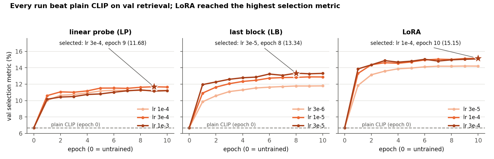
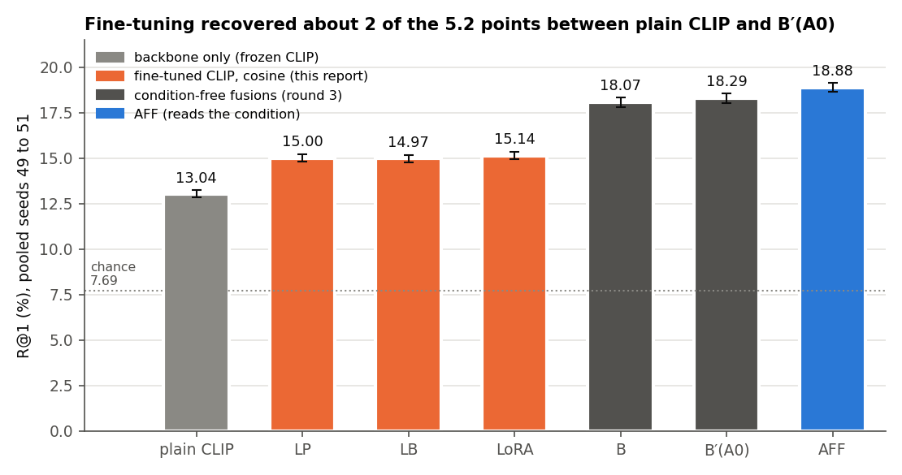
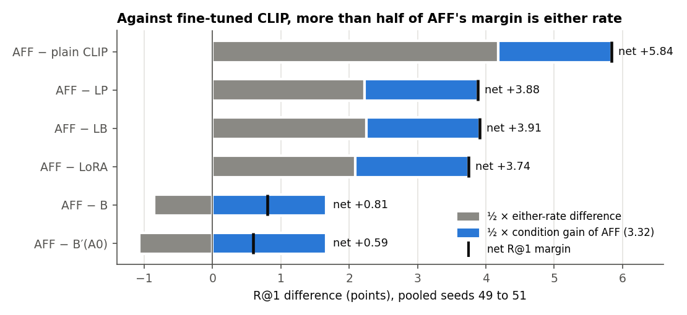
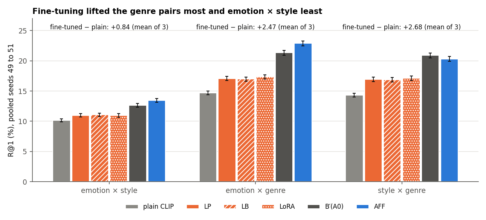

# Lightweight CLIP fine-tuning on ArtELingo as a condition-free comparator: about +2 R@1 over plain CLIP, still 3.2 to 3.3 below B′(A0) and 3.7 to 3.9 below AFF

**Report date:** 2026-11-24. Like the folder date `20261124`, this is a sequence number in this line of work, not a
calendar date. The work ran on 2026-10-07 from 08:12 (workspace and first dispatches) to 09:47 (independent recompute
and run log committed), Amsterdam time; the nine training runs ran from 09:09 to 09:29.
**Status:** descriptive comparison. The spec fixed the data use, variants, grids and val-only selection before any run
and states that these numbers decide nothing; how the comparator enters the ArtELingo held test is the user's call.
Seeds 49 to 51 were already read by round 3, so nothing here is a test. The whole-branch final review confirmed the
report with fixes, all applied in this revision (§7.7).
**Records:** spec `docs/superpowers/specs/2026-10-07-clip-lightweight-ft-design.md` (commit f472cc3); plan
`docs/superpowers/plans/2026-10-07-clip-lightweight-ft.md` (470f6aa); CVPR readiness memo
`docs/reports/stage/2026-10-07_cvpr_readiness.md` §2 (where the comparator was proposed and adopted); run log
`20261124_clip_lightweight_ft_log.md`; SDD ledger, task briefs, reports and reviews in
`.superpowers/sdd/2026-10-07-clip-lightweight-ft/` (ledger `progress.md`, run tags `runs.txt`); run outputs
`res/cluster_jobs/<tag>/code/outputs/clipft/<variant>_lr<lr>/`; evaluation `results/eval.json` (SHA-256
4204be40…6a18b) and `results/eval.log`; independent recompute `rederive/rd_ft_report.md`. Commits: f472cc3 (spec and
memo), 470f6aa (plan), dea7902 and 1dc45a3 (evaluation), 13ca045 (data), c9e97b8 and 92dfdc6 (cluster scripts),
1d713e1 and 65bb2f4 (trainer; the runs used 65bb2f4), 63efe4a (folder `.gitignore`), e98f21d and c5708ab (recompute),
d98407b (run log); `results/` and `res/` are gitignored. Figures, `figure_data.json` and their script
`build_figures.py` are in `docs/reports/assets/2026-11-24_clip_lightweight_ft/`. Paths without a folder are under
`src/test/20261124_clip_lightweight_ft/`. AFF and its comparators come from
[round 3](2026-11-21_round3_affect_gate.md); this report defines every term it uses.

## Summary

AFF, the label-free reader of round 3, beat every condition-free comparator on fresh ArtELingo episodes, but its whole
gain sat on the two emotion pairs, and its margin over the strongest comparator, B′(A0), was +0.59 R@1. A reviewer
could ask whether a CLIP adapted to ArtELingo's emotion-laden captions would close that margin on its own. The CVPR
readiness memo (§2) recommended measuring it before the held test, and the user adopted a lightweight version.

We trained CLIP ViT-B/32 on the scorer-train image-caption pairs (183,694 captions of 36,518 paintings) with the
symmetric CLIP contrastive loss, using no evaluation label and never using a held row (no held image loaded, no held feature extracted). There were three variants: a
linear probe on the frozen features (LP), the last transformer block of each encoder (LB) and LoRA adapters (LoRA).
Each variant ran at three learning rates for 10 epochs on one DAS6 GPU, nine runs in all, and its model was selected
on val image-caption retrieval only, then scored by cosine on the aspect episodes.

*Table S1. Pooled over the fresh episode seeds 49 to 51 (36,864 episodes on 5,195 anchor paintings; R@1 and either
rate in %, differences in points with 95% painting-bootstrap intervals).*

| Scorer | R@1 [95%] | Either rate | AFF minus it, R@1 [95%] | It minus plain CLIP, R@1 [95%] |
|---|---|---|---|---|
| plain CLIP (frozen ViT-B/32, cosine) | 13.04 [12.86, 13.23] | 26.08 | +5.84 [+5.61, +6.07] | |
| LP, fine-tuned (cosine) | 15.00 [14.79, 15.22] | 30.00 | +3.88 [+3.68, +4.09] | +1.96 [+1.79, +2.13] |
| LB, fine-tuned (cosine) | 14.97 [14.77, 15.18] | 29.94 | +3.91 [+3.71, +4.12] | +1.93 [+1.75, +2.10] |
| LoRA, fine-tuned (cosine) | 15.14 [14.92, 15.36] | 30.27 | +3.74 [+3.54, +3.96] | +2.10 [+1.91, +2.28] |
| B (best condition-free score of the project, named in round 3; B′(A0) is now stronger) | 18.07 [17.83, 18.33] | 36.15 | +0.81 [+0.69, +0.93] | |
| B′(A0) (strongest condition-free comparator) | 18.29 [18.04, 18.54] | 36.58 | +0.59 [+0.46, +0.73] | |
| AFF | 18.88 [18.63, 19.13] | 34.44 | | |

- **Fine-tuning helped, by about 2 points.** All three variants lifted plain CLIP by +1.93 to +2.10 R@1, every
  interval above 0, and they landed within 0.17 points of each other. That recovered 37% to 40% of the 5.25-point gap
  between plain CLIP and B′(A0).
- **It stayed well below the condition-free floor.** Each fine-tuned cosine was 3.15 to 3.32 points below B′(A0)
  (LoRA −3.15 [−3.34, −2.97], the closest), and AFF stayed +3.74 to +3.91 above it. Every per-seed difference had the
  same sign, with intervals excluding 0.
- **The lift went to the genre candidate, not the emotion candidate.** Fine-tuning raised the rate at which the genre candidate ranks first by
  +4.2 to +5.3 points, and the emotion candidate's by +0.02 to +0.98. So it lifted the two genre pairs (+2.31 to +2.82)
  and barely moved emotion × style (+0.78 to +0.90). The memo had expected the floor to rise most on emotion.
  On emotion × genre it did rise, by +2.31 to +2.68, but through the genre candidate, and AFF stayed +5.53 to +5.90
  ahead there.
- **Its condition gain is 0 by construction**, so its R@1 is half its either rate. Against the fine-tuned cosines,
  56% to 58% of AFF's margin came from either rate, which in our reading AFF inherits from B (including B's
  example-centred factor term), and the rest (1.66 points) from AFF's condition gain.
- **The grid edges are small against the gap.** LB's best learning rate was its grid's largest, and LoRA's best epoch
  was its last. The last steps there were worth +0.45 and +0.03 points of val retrieval. Even at the steepest observed
  conversion (0.39 R@1 per val point), that is at most about 0.2 R@1 against a 3.15-point gap. Descriptively, the
  best epochs of all nine runs scored 14.97 to 15.14 pooled R@1 (final review), so the conclusion does not depend on
  which grid point selection picked.
- **The cache-path reference is clean.** LB and LoRA read images from a uint8 cache whose features differ slightly from
  the frozen cache. Untrained CLIP through that path scored 13.03, or −0.01 [−0.02, +0.00] against plain CLIP, so the
  fine-tuned-minus-plain differences are not distorted.

**Conclusion (descriptive, decides nothing).** In its lightweight forms, a CLIP contrastively adapted to ArtELingo did
not approach the condition-free floor that AFF is measured against, and its gain came through the genre candidate. Our view is that it
belongs in the held test as a reported baseline, while B′(A0) and B′(A1) remain the strongest condition-free
comparators and the floors for AFF (§9). The user decides.

An independent recompute with its own code agreed with `eval.json` on all 531 compared quantities (maximum difference
0.0 points) and reproduced the selection. This report's figure script re-derived all 896 point estimates in
`eval.json` and 50 of its intervals, again exactly. The whole-branch final review re-derived all 3,595 numeric values
of `eval.json` with its own code (maximum difference 0.0) and confirmed the report with fixes, applied here.

*Sources: `results/eval.json` (pooled block); round 3 report Table S1 (the AFF-minus intervals for plain CLIP, B and
B′(A0)); `figure_data.json` (per-side rates, decomposition, grid edges, gap share; computed by the figure script);
`rederive/rd_ft_report.md`.*

## 1. Terms and setup

**The task** (as in round 3). An **episode** has a **query** (one image, or one caption, of an anchor painting), 4
**support pairs**, 4 **contrast pairs** and 13 **candidates** in the other modality. The supports share a value of
aspect A, the contrasts a value of aspect B. Candidate p_A shares the query's value of A, p_B its value of B, and 11
negatives share neither. Under **condition a** the target is p_A; under **condition b** supports and contrasts swap and
the target is p_B. Each episode gives four rankings (two conditions, two directions). The aspects are emotion, style and
genre, giving three **aspect pairs**: emotion × style, emotion × genre and style × genre, where the first aspect is A.

**Episode seeds.** One seed draws 12,288 episodes (4,096 per pair) from the selection rows. **Seed 42** is the
development draw. **Seeds 49, 50 and 51** were built once for round 3's test and were read there; pooled they hold
36,864 episodes on 5,195 anchor paintings. Here they are descriptive.

**Metrics** (per episode, averaged over its four rankings, pooled over the three pairs, in percentage points).

| Term | Meaning |
|---|---|
| R@1 | the target ranks strictly first (ties miss; chance 7.69%) |
| other-aspect rate | the other aspect's candidate ranks first |
| condition gain | R@1 minus the other-aspect rate; exactly 0 for any scorer that ignores the condition |
| either rate | R@1 plus the other-aspect rate: how often an aspect-sharing candidate ranks first. So **R@1 = (either + gain) / 2** |
| per-side first-place rate | for a condition-free scorer only (new in this report): how often p_A (or p_B) ranks first, averaged over the two directions. Its ranking is the same under both conditions, so its R@1 is the mean of the two sides |
| interval | 95% percentile interval of a bootstrap over anchor paintings (5,000 resamples, seed 42). Pooled over seeds 49 to 51, the per-anchor values are concatenated and a painting that anchors episodes on several seeds is one cluster |

**Scorers.**

| Term | Meaning |
|---|---|
| plain CLIP | cosine of the frozen CLIP ViT-B/32 projection features in the project's feature cache (`openai/clip-vit-base-patch32`) |
| B | the best condition-free score of the project (named in round 3; B′(A0) is now stronger): cosine, the centred factor term of the method-A checkpoint (a sparse image-caption factor basis trained label-free on ArtELingo) and the head agreement averaged over three k-means-64 groupings (GoEmotions caption probabilities, CLIP image features, CLIP caption features), fused with weights cross-fitted on the seed's parity halves |
| B′(A0) | B rebuilt with the averaged agreement taken over A0's own groupings (affect, image, caption; affect is Leiden communities on GoEmotions caption probabilities). It depends on the seed only. The strongest condition-free comparator on seeds 49 to 51 |
| B′(A1) | B′ with the CSD style grouping added (round 4); measured on seed 42 only, where it was stronger than B′(A0) |
| AFF | round 3's method: a label-free reader that picks which grouping the support pairs share, fused with B, with its gate opened only when it picks the affect grouping. Condition gain 3.32 pooled |
| LP, linear probe | one 512 × 512 linear map per modality (no bias, initialised to the identity) on the frozen projection features, trained with the contrastive loss (not a classifier on labels) |
| LB, last block | the last transformer layer, the final layer norm and the projection of each encoder |
| LoRA | rank-16 adapters (α 32, dropout 0.05) on the query, key, value and output projections of every attention layer of both encoders |
| fine-tuned cosine | the cosine of a selected variant's projection features, scored exactly as plain CLIP |
| val selection metric | the mean of val image→caption R@1 (an image query is correct if its top caption among all 30,872 val captions belongs to its painting) and caption→image R@1 (the top image among the 6,152 val paintings is the caption's own) |
| cache-path reference | untrained CLIP whose image features are recomputed from the uint8 image cache that LB and LoRA train on (`ft:CLIPcache` in `eval.json`). It isolates the preprocessing path from the training |

*Sources: spec §3 to §5; round 3 report §1 (task, metrics, B, B′(A0), AFF); `2026-11-18_reader_fix_csd.md` §1 (B's
ingredients); `ft_eval.py` (either = R@1 + other-aspect rate); `figure_data.json` (per-side rates).*

## 2. How we got here

The v2 line asks whether a label-free method can read which aspect a few example pairs share and rank cross-modal
candidates under it. After the factor method's NO-GO, the reader-fix rounds built AFF. Round 3 confirmed AFF on the
fresh seeds 49 to 51 (bar margin +0.59 [+0.46, +0.73] over B′(A0), condition gain +3.32) and found that the pooled
result rests on the two emotion pairs. Round 4 tried three vetoes on AFF's gate and none beat AFF.

The CVPR readiness memo (2026-10-07, §2) then asked whether a CLIP fine-tuned on ArtELingo is needed as a comparison.
Its answer was that it is not a headline competitor, since backbone fine-tuning is out of the plan's scope. But a cheap
contrastive fine-tune on scorer-train image-caption pairs should join the condition-free comparators before the held
test, "because it could raise the floor exactly where AFF gains". AFF's absolute R@1 is 18.88 against plain CLIP's
13.04, and a model trained on ArtELingo's emotion-explaining captions might have closed much of that on emotion.

The user adopted the comparator on 2026-10-07 in three lightweight forms (linear probe, last block, LoRA), with no full
fine-tuning, on the DAS6 nodes 404, 405 and 411 (up to 9 GPUs). The spec fixed the protocol before any run, with no
decision rule. The question here is how far a label-free, ArtELingo-adapted CLIP cosine gets on the same episodes,
next to AFF and its comparators.

*Sources: CVPR memo Summary and §2; round 3 report Summary and §7; round 4 report Summary; spec §1.*

## 3. Method

### 3.1 Data use

| Split (rows, paintings) | Use here |
|---|---|
| scorer-train (183,694 rows, 36,518 paintings) | training pairs |
| val (30,872 rows, 6,152 paintings) | model selection by image-caption retrieval |
| selection (32,413 rows, 6,451 paintings) | features for the aspect episodes (evaluation) |
| held (61,744 rows, 12,281 paintings) | **not touched**: no image loaded, no feature extracted |

- No emotion, style or genre label is used by the data cache, the trainer or selection; only images and captions. The
  aspect episodes are read only by the evaluation script, after selection.
- Held rows stay untouched. Every row comes from the three non-held splits of `artelingo_splits`. The cache builder
  refuses a painting that also has held rows (Task 1's test), and the trainer's row check refuses a held row (Task 2's
  test). The final review confirmed on the real data that the cache's 49,121 paintings are exactly those of
  scorer-train, val and selection, with no held painting or leakage group among them.
- The 49,121 images of the scorer-train, val and selection paintings were preprocessed once with the CLIP processor's
  resize and 224-pixel centre crop, before normalisation, into a uint8 image cache (7.39 GB, at
  `/data/SSD2/pre_extract/artelingo_clip224/`, SHA-256s recorded). Its normalised output matched the CLIP processor to
  a maximum difference of 2.4e-7. The launcher verified the cache's SHA-256 on each node before training. There was no
  augmentation.
- Rows follow the feature-row order (`data.sample_ids`); the caption of row i is
  `annotations[sample_ids[i]]["caption"]`. Task 2's fix round added a test that pins each training item's image and
  caption to its row.

### 3.2 Objective, sampler and variants

All variants used the symmetric CLIP InfoNCE loss with a learnable temperature initialised from CLIP's `logit_scale`
(capped at ln 100; CLIP's initial value equals the cap, so in LB and LoRA the temperature stayed within 0.01 of it),
on the projection outputs, L2-normalised for the loss and for scoring. Each epoch drew **one
caption per painting** (36,518 pairs), shuffled with seed (0, epoch), so a batch of 256 never held two captions of the
same painting and no same-painting caption was a negative. An epoch was 143 steps and a run 1,430 steps.

The optimiser was AdamW (default betas) with linear warm-up over the first 72 steps (5%), then cosine decay to 0.
Weight decay was 0.1 on LB's weight matrices and 0 elsewhere (biases, layer norms, LP, LoRA). LB and LoRA trained in
bf16 autocast and LP in fp32 (the spec said mixed precision; Task 2's review moved the 512 × 512 map to fp32, at no
cost); val retrieval and the saved features were computed in fp32. Every run used training
seed 0.

*Table 1. The three variants (trainable parameter counts from `run_record.json`, each including the temperature).*

| Variant | What is trained | Trainable parameters | Input | Learning rates | Epoch time on one RTX A6000 |
|---|---|---|---|---|---|
| LP | two 512 × 512 maps (identity at step 0) | 524,289 | the frozen cached features (no images) | 1e-4, 3e-4, 1e-3 | about 0.5 s |
| LB | last layer, final layer norm and projection of each encoder | 10,898,177 | image cache and captions | 3e-6, 1e-5, 3e-5 | about 16 s (first epoch 40 s) |
| LoRA | rank-16 adapters in all 24 attention layers | 1,966,081 | image cache and captions | 3e-5, 1e-4, 3e-4 | about 51 s (first epoch 74 s) |

LoRA's first epoch took 74 s and later epochs about 51 s (`metrics.json`). LP at step 0 reproduces the frozen features exactly (its epoch-0 features equal the cache with
maximum difference 0).

### 3.3 Selection

After every epoch, each run computed the val selection metric. Per variant, the selected model is the (learning rate,
epoch) with the highest selection metric over epochs 1 to 10, with ties to the smaller learning rate and then the
earlier epoch. The aspect episodes were never used for selection or early stopping. There were no ties.

### 3.4 Evaluation

For each selected model, `ft_eval.py` placed the selection-row features in feature-row order (NaN elsewhere) and scored
the cosine with `src.eval.aspect_scorers.cosine_scores` and `src.eval.aspect_metrics.per_anchor` on the stored episodes
of seeds 42, 49, 50 and 51. It asserted each episode file's SHA-256 against its record and that plain CLIP through the
same path equals the stored cosine arrays. The AFF, B and B′(A0) per-anchor arrays come from round 3's stored results
(seeds 49 to 51) and round 4's seed-42 arrays (with B′(A1)), aligned by anchor painting and pair. Intervals use
`cluster_bootstrap` (5,000 resamples, seed 42). `eval.json` does not name its input files; the run log's 09:35 rows
record the selection and the exact `ft_eval.py` command with its four inputs, and the recompute and the figure script both found that only those runs'
`features.npz`, with the selected LB run's `features_epoch0.npz` as the cache-path reference, reproduce `eval.json`
(any LB or LoRA epoch-0 file gives the same arrays). No other scorer was rebuilt on the fine-tuned features: B or AFF on
fine-tuned features belongs with the second-backbone check (K4).

*Sources: spec §2 to §5; plan (global constraints, Tasks 1 to 4); `final_review/final_review.md` (held guards, real-data
check, temperature, LP precision); run log 08:25 to 08:28; `run_record.json` of each
run (parameters, schedule, weight decay, precision); `metrics.json` (epoch times); `ft_eval.py`; ledger (Task 1 to 4
reviews).*

## 4. Training curves and the selected models

*Figure 1. Val selection metric (mean of image→caption and caption→image R@1, in %) per epoch for each variant and
learning rate; epoch 0 is untrained CLIP, and the star marks the selected model.*

*Table 2. Each run's best epoch (val selection metric in %, epochs 1 to 10).*

| Variant | lr | Best epoch | Val selection | Image→caption R@1 | Caption→image R@1 |
|---|---|---|---|---|---|
| plain CLIP (frozen cache) | | 0 | 6.68 | 7.41 (456 / 6,152) | 5.95 (1,838 / 30,872) |
| LP | 1e-4 | 6 | 11.25 | | |
| **LP** | **3e-4** | **9** | **11.68** | 15.52 (955) | 7.84 (2,421) |
| LP | 1e-3 | 8 | 11.30 | | |
| LB | 3e-6 | 10 | 11.79 | | |
| LB | 1e-5 | 9 | 12.89 | | |
| **LB** | **3e-5** | **8** | **13.34** | 17.78 (1,094) | 8.89 (2,744) |
| LoRA | 3e-5 | 9 | 14.21 | | |
| **LoRA** | **1e-4** | **10** | **15.15** | 20.25 (1,246) | 10.05 (3,103) |
| LoRA | 3e-4 | 10 | 15.08 | | |

Every run beat plain CLIP on val retrieval from its first epoch. The selected models raised the selection metric from
6.68 to 11.68 (LP), 13.34 (LB) and 15.15 (LoRA), about 1.7 to 2.3 times plain CLIP. Image→caption retrieval gained
more than caption→image in every case. On the cache path, untrained CLIP scored 6.69 (457 and 1,839 correct), one
query more in each direction than the frozen cache.

**Grid edges.** Two selections sit on an edge of the fixed grid.

- **LB's best learning rate (3e-5) is the grid's largest.** Its best selection rose by +1.10 val points from 3e-6 to
  1e-5 and by +0.45 from 1e-5 to 3e-5, so the steps were shrinking. A larger rate might add a little more.
- **LoRA's best epoch (10) is the last.** The 1e-4 run went 15.01, 15.12 and 15.15 over epochs 8 to 10, so the last
  epoch added +0.03 val points. The schedule decays to 0 at epoch 10, so a longer run would also stretch the decay. The 3e-4 run also peaked at epoch 10, and LB's unselected 3e-6 run did too.

**Their size against the gap to B′(A0).** The pooled gap of each fine-tuned cosine to B′(A0) is 3.15 to 3.32 R@1. We
converted val points into R@1 with two ratios from our own numbers (our arithmetic; `figure_data.json`):

- from plain to fine-tuned, R@1 rose 0.25 (LoRA) to 0.39 (LP) points per val point;
- across the selected variants, LoRA's 3.47-point val lead over LP bought 0.14 R@1, or 0.04 per val point.

At the steeper rate, repeating LB's last learning-rate step would add about 0.18 R@1, and LoRA's last epoch about
0.01. Closing even LoRA's 3.15-point gap at that rate would take about 8 more val points, nearly as many as LoRA gained
over plain CLIP in the first place (8.5). At the cross-variant rate it would take far more. These figures are a
linear extrapolation that we did not measure, but at either rate the edges are far too small to explain a gap of three
points.

Descriptively (final review, after selection), the best epochs of all nine runs scored 14.97 to 15.14 pooled R@1
(−3.15 to −3.32 against B′(A0)). Within the grid, a higher val score did not mean a higher R@1: LB 3e-6 had val 11.79
and R@1 15.05, against val 13.34 and R@1 14.97 for the selected LB 3e-5. So the conclusion does not depend on which
grid point selection picked.

*Sources: `res/cluster_jobs/<tag>/.../metrics.json` and `run_record.json` (tags in the ledger's `runs.txt`); run log
09:35 (selection); `rederive/rd_ft_report.md` (Selection); `figure_data.json` (`runs`, `selected`, `grid_edges`); `final_review/final_review.md` (all-runs check). The figure
script re-derived the selection from the integer counts and asserted it equals each `run_record.json`.*

## 5. Episode results

### 5.1 Pooled: the ladder

*Figure 2. R@1 pooled over seeds 49 to 51 (36,864 episodes), with 95% painting-bootstrap intervals. Grey: frozen
CLIP; orange: the three fine-tuned cosines; dark grey: B and B′(A0); blue: AFF.*

*Table 3. Fine-tuned cosines against their baselines, pooled over seeds 49 to 51 (points, 95% intervals).*

| Difference | LP | LB | LoRA |
|---|---|---|---|
| fine-tuned minus plain CLIP, R@1 | +1.96 [+1.79, +2.13] | +1.93 [+1.75, +2.10] | +2.10 [+1.91, +2.28] |
| fine-tuned minus plain CLIP, either | +3.92 [+3.57, +4.26] | +3.86 [+3.50, +4.21] | +4.19 [+3.82, +4.57] |
| fine-tuned minus B′(A0), R@1 | −3.29 [−3.47, −3.11] | −3.32 [−3.50, −3.14] | −3.15 [−3.34, −2.97] |
| fine-tuned minus B′(A0), either | −6.58 [−6.94, −6.22] | −6.64 [−7.01, −6.27] | −6.31 [−6.69, −5.93] |
| AFF minus fine-tuned, R@1 | +3.88 [+3.68, +4.09] | +3.91 [+3.71, +4.12] | +3.74 [+3.54, +3.96] |
| AFF minus fine-tuned, either | +4.44 [+4.11, +4.80] | +4.50 [+4.16, +4.86] | +4.17 [+3.81, +4.54] |

The three variants were practically equal: their R@1 spans 14.97 to 15.14 and their intervals overlap (we did not
compute paired differences between variants).
The 3.5-point spread in val retrieval between LP and LoRA (Table 2) did not carry over to the episodes. Fine-tuning
recovered 37% (LB), 37% (LP) and 40% (LoRA) of the 5.25 points between plain CLIP and B′(A0). B itself was still
2.94 to 3.10 points above every fine-tuned cosine (point arithmetic from Table S1).

### 5.2 Per seed

*Table 4. R@1 per seed and pooled (%). Seed 42 is the development draw; B′(A1) exists on seed 42 only.*

| Scorer | 42 | 49 | 50 | 51 | Pooled 49 to 51 |
|---|---|---|---|---|---|
| plain CLIP | 12.96 | 13.06 | 12.97 | 13.08 | 13.04 |
| cache-path reference | 12.95 | 13.05 | 12.96 | 13.09 | 13.03 |
| LP | 15.19 | 14.93 | 15.11 | 14.95 | 15.00 |
| LB | 15.02 | 14.91 | 15.09 | 14.90 | 14.97 |
| LoRA | 15.21 | 15.11 | 15.27 | 15.03 | 15.14 |
| B | 18.34 | 18.04 | 18.13 | 18.05 | 18.07 |
| B′(A0) | 18.44 | 18.23 | 18.34 | 18.30 | 18.29 |
| B′(A1) | 18.80 | | | | |
| AFF | 19.14 | 18.93 | 18.79 | 18.92 | 18.88 |

*Table 5. Either rate per seed and pooled (%). For every scorer except AFF, either = 2 × R@1.*

| Scorer | 42 | 49 | 50 | 51 | Pooled 49 to 51 |
|---|---|---|---|---|---|
| plain CLIP | 25.92 | 26.12 | 25.95 | 26.17 | 26.08 |
| LP | 30.38 | 29.87 | 30.22 | 29.90 | 30.00 |
| LB | 30.05 | 29.82 | 30.19 | 29.80 | 29.94 |
| LoRA | 30.41 | 30.21 | 30.55 | 30.05 | 30.27 |
| B | 36.68 | 36.07 | 36.26 | 36.11 | 36.15 |
| B′(A0) | 36.87 | 36.46 | 36.67 | 36.59 | 36.58 |
| B′(A1) | 37.61 | | | | |
| AFF | 35.16 | 34.27 | 34.31 | 34.74 | 34.44 |

*Table 6. Paired R@1 differences per seed (points, 95% intervals).*

| Difference | 42 | 49 | 50 | 51 |
|---|---|---|---|---|
| AFF minus LP | +3.94 [+3.61, +4.28] | +4.00 [+3.66, +4.34] | +3.68 [+3.34, +4.02] | +3.97 [+3.65, +4.31] |
| AFF minus LB | +4.11 [+3.78, +4.45] | +4.02 [+3.67, +4.37] | +3.69 [+3.36, +4.03] | +4.02 [+3.68, +4.38] |
| AFF minus LoRA | +3.93 [+3.58, +4.27] | +3.82 [+3.47, +4.18] | +3.52 [+3.17, +3.87] | +3.89 [+3.55, +4.24] |
| LP minus plain | +2.23 [+1.94, +2.51] | +1.87 [+1.58, +2.15] | +2.14 [+1.84, +2.43] | +1.87 [+1.58, +2.15] |
| LB minus plain | +2.06 [+1.78, +2.34] | +1.85 [+1.56, +2.13] | +2.12 [+1.82, +2.41] | +1.82 [+1.53, +2.10] |
| LoRA minus plain | +2.24 [+1.93, +2.55] | +2.04 [+1.74, +2.34] | +2.30 [+1.99, +2.61] | +1.94 [+1.65, +2.24] |
| LP minus B′(A0) | −3.25 [−3.55, −2.94] | −3.30 [−3.60, −2.99] | −3.23 [−3.53, −2.92] | −3.34 [−3.64, −3.04] |
| LB minus B′(A0) | −3.41 [−3.72, −3.11] | −3.32 [−3.63, −3.01] | −3.24 [−3.55, −2.94] | −3.40 [−3.71, −3.09] |
| LoRA minus B′(A0) | −3.23 [−3.54, −2.91] | −3.12 [−3.45, −2.81] | −3.06 [−3.38, −2.75] | −3.27 [−3.58, −2.95] |

On every seed, fine-tuning added 1.82 to 2.30 points over plain CLIP and stayed 3.06 to 3.41 below B′(A0), with every
interval excluding 0. On seed 42, B′(A1) (18.80) was 3.60 to 3.78 points above the fine-tuned
cosines (point arithmetic). The spread of each fine-tuned R@1 across the four seeds (0.19 to 0.26 points) is small
against the gaps it would have to close.

### 5.3 Condition gain 0: what the fine-tuned R@1 can and cannot buy

The fine-tuned cosine ranks the 13 candidates the same way under both conditions. Whichever aspect candidate it puts
first is the target in one condition and the distractor in the other. So its condition gain is exactly 0, its R@1
equals its other-aspect rate (15.00, 14.97 and 15.14 for LP, LB and LoRA), and its R@1 is half its either rate. Fine-tuning can
raise R@1 only by putting an aspect-sharing candidate first more often, at two points of either rate per point of R@1.
That is what it did: +3.86 to +4.19 either for +1.93 to +2.10 R@1 (Table 3).

AFF is not bound by this. Its condition gain of 3.32 adds 1.66 points of R@1 on top of half its either rate. Because
R@1 = (either + gain) / 2, AFF's margin over any condition-free scorer splits into half the either-rate difference plus
1.66.

*Figure 3. AFF's pooled R@1 margin over each condition-free scorer, split into half the either-rate difference (grey)
and half AFF's condition gain (blue); the black tick marks the net margin.*

*Table 7. The same split, pooled over seeds 49 to 51 (points).*

| AFF minus | Either difference | ½ × either | ½ × gain | Net R@1 margin | Share from either |
|---|---|---|---|---|---|
| plain CLIP | +8.36 | +4.18 | +1.66 | +5.84 | 72% |
| LP | +4.44 | +2.22 | +1.66 | +3.88 | 57% |
| LB | +4.50 | +2.25 | +1.66 | +3.91 | 58% |
| LoRA | +4.17 | +2.08 | +1.66 | +3.74 | 56% |
| B | −1.71 | −0.85 | +1.66 | +0.81 | |
| B′(A0) | −2.14 | −1.07 | +1.66 | +0.59 | |

Against B and B′(A0), AFF pays either rate (−1.71 and −2.14) and wins only through its condition gain. This is round
3's either-rate cost. Against the fine-tuned cosines, AFF is ahead on both counts: it finds an aspect-sharing candidate
4.2 to 4.5 points more often, and it also reads the condition. In our reading, AFF's either rate comes from B, its fused base
(including B's example-centred factor term), so B's condition-free terms account for more than half of AFF's margin
over a fine-tuned CLIP.

To match AFF's pooled R@1 of 18.88 without reading the condition, a scorer would need an either rate of 37.76. That is
above B′(A0)'s 36.58 and 7.5 to 7.8 points above the fine-tuned cosines. AFF's other-aspect rate (15.56) was in fact
slightly above the fine-tuned cosines' (+0.43 to +0.59 pooled): AFF puts the distractor first a little more often than
they do, and the target first much more often.

### 5.4 Per aspect pair

*Figure 4. R@1 per aspect pair, pooled over seeds 49 to 51 (12,288 episodes per pair), with 95% intervals. The text
above each group is the mean fine-tuned-minus-plain lift of the three variants.*

*Table 8. R@1 per aspect pair, pooled over seeds 49 to 51 (%).*

| Scorer | emotion × style | emotion × genre | style × genre |
|---|---|---|---|
| plain CLIP | 10.15 | 14.67 | 14.30 |
| LP | 10.98 | 17.08 | 16.94 |
| LB | 11.05 | 16.98 | 16.87 |
| LoRA | 10.93 | 17.35 | 17.13 |
| B | 12.43 | 21.15 | 20.64 |
| B′(A0) | 12.64 | 21.33 | 20.89 |
| AFF | 13.45 | 22.88 | 20.31 |
| AFF's condition gain | 1.00 | 6.19 | 2.77 |

*Table 9. Paired R@1 differences per aspect pair, pooled over seeds 49 to 51 (points, 95% intervals).*

| Difference | emotion × style | emotion × genre | style × genre |
|---|---|---|---|
| LP minus plain | +0.83 [+0.57, +1.10] | +2.41 [+2.10, +2.71] | +2.63 [+2.33, +2.94] |
| LB minus plain | +0.90 [+0.64, +1.17] | +2.31 [+2.00, +2.62] | +2.57 [+2.26, +2.87] |
| LoRA minus plain | +0.78 [+0.50, +1.06] | +2.68 [+2.36, +2.99] | +2.82 [+2.50, +3.14] |
| LP minus B′(A0) | −1.66 [−1.93, −1.39] | −4.26 [−4.59, −3.92] | −3.95 [−4.27, −3.63] |
| LB minus B′(A0) | −1.59 [−1.88, −1.31] | −4.35 [−4.69, −4.03] | −4.01 [−4.35, −3.69] |
| LoRA minus B′(A0) | −1.71 [−2.00, −1.43] | −3.99 [−4.33, −3.66] | −3.76 [−4.09, −3.43] |
| AFF minus LP | +2.47 [+2.17, +2.77] | +5.80 [+5.43, +6.17] | +3.37 [+3.02, +3.72] |
| AFF minus LB | +2.40 [+2.09, +2.73] | +5.90 [+5.53, +6.27] | +3.43 [+3.07, +3.78] |
| AFF minus LoRA | +2.52 [+2.21, +2.84] | +5.53 [+5.17, +5.91] | +3.18 [+2.82, +3.54] |

**Which pair gained most.** Fine-tuning lifted the two genre pairs about three times as much as emotion × style: +2.31
to +2.68 on emotion × genre, +2.57 to +2.82 on style × genre, and +0.78 to +0.90 on emotion × style, the one pair
without genre.

**Which candidate gained.** A condition-free R@1 is the mean of two per-side first-place rates, so the per-pair lift
can be split by side (Table 10, computed by the figure script, points only).

*Table 10. Per-side first-place rates, pooled over seeds 49 to 51 (%), and the lift of each fine-tuned cosine over
plain CLIP.*

| Pair, candidate first | plain CLIP | LP | LB | LoRA | Lift (range of the three) |
|---|---|---|---|---|---|
| emotion × style, emotion candidate | 9.92 | 10.90 | 10.88 | 10.69 | +0.77 to +0.98 |
| emotion × style, style candidate | 10.38 | 11.07 | 11.23 | 11.18 | +0.69 to +0.84 |
| emotion × genre, emotion candidate | 8.80 | 9.08 | 8.98 | 8.82 | +0.02 to +0.28 |
| emotion × genre, genre candidate | 20.54 | 25.07 | 24.98 | 25.87 | +4.44 to +5.33 |
| style × genre, style candidate | 8.74 | 9.45 | 9.66 | 9.45 | +0.71 to +0.92 |
| style × genre, genre candidate | 19.86 | 24.42 | 24.09 | 24.80 | +4.22 to +4.94 |

The lift went to the genre candidate. Where genre competes with emotion, the emotion candidate gained between +0.02
(LoRA) and +0.28 (LP), while the genre candidate gained +4.4 to +5.3. Emotion and style gained under one point
wherever they appeared. Plain CLIP already favoured the genre candidate more than two to one over emotion or style,
and fine-tuning widened that. The memo expected a fine-tune on emotion-laden captions to "raise the condition-free floor
most on emotion". On these episodes it raised the emotion candidate least. At the pair level, the floor rose least on
emotion × style (+0.78 to +0.90), but on emotion × genre it rose +2.31 to +2.68, about as much as on style × genre,
almost entirely through the genre candidate.

**Against AFF per pair.** AFF's lead over the fine-tuned cosines was largest on emotion × genre (+5.53 to +5.90). There
the fine-tune left the emotion side flat, and AFF's condition gain was largest (6.19). On style × genre, AFF is below
B′(A0) (−0.58 in round 3) but still 3.18 to 3.43 above the fine-tuned cosines, because B's terms carry it there.

### 5.5 Why fine-tuning lifts plain CLIP by about 2 points yet stays well below B

We see three reasons. The first two are our reading of the numbers above; the third uses component numbers from an
earlier report.

1. **The objective rewards instance matching; the episodes reward aspect sharing.** The contrastive loss teaches CLIP
   to match a painting to its own captions, with every other painting in the batch as a negative, including paintings
   that share its emotion, style or genre. The episodes instead reward ranking first a different painting that shares
   one aspect. Val retrieval, which measures the instance task, rose 1.7 to 2.3 times. Episode R@1 rose 15% to 16%;
   LoRA's 3.5-point val lead over LP bought 0.14 R@1, and LB's lead over LP on val reversed on the episodes (§4,
   §5.1).
2. **Captions discriminate paintings by content, and genre is content.** Within a batch of 256 paintings, the words
   that tell one painting's caption from another's are mostly about what is depicted. The emotion a caption explains is
   shared by many paintings in the same batch, so it helps little to pick the right one. Genre categories (portrait,
   landscape, religious painting and so on) are largely what is depicted. The per-side split fits this: the
   fine-tuned space put same-genre paintings first far more often, and same-emotion paintings barely more often
   (Table 10). This is our reading; we did not run an ablation that isolates it.
3. **B's extra terms are trained on ArtELingo, built for cross-item sharing, and use the episode's examples.** B fuses cosine with two ArtELingo
   components that group different paintings by a shared property. One is the centred factor term of the method-A
   checkpoint. The other is head agreement over three k-means groupings, one of them on GoEmotions caption
   probabilities, which brings external emotion supervision. On the seed-42 development episodes, the 2026-11-08 report
   measured each alone: the factor term T_N1u reached 17.95 R@1 and the condition-free head agreement T_6u 16.96. The
   factor term also centres the query on the episode's own 8 example items, which a cosine never sees. The 2026-11-08
   final review found 17.95 with that centring, against 16.85 on 8 random items and 17.14 on the global selection-row
   mean, so part of B's lead over any cosine comes from using the episode's examples (possibly through the
   value-disjoint construction), not only from better features. The fine-tuned cosines reached 15.02 to 15.21 on seed
   42. Each of B's trained terms alone beat them, and fused with cosine they reach 18.34 (B, seed 42). These component
   numbers are quoted from that report and were not re-derived here.

B's lead over the fine-tuned cosines lies in either rate: 36.15 against 29.94 to 30.27 pooled, and per pair 24.85 against
21.87 to 22.10 (emotion × style), 42.30 against 33.96 to 34.69 (emotion × genre) and 41.29 against 33.75 to 34.25
(style × genre). The gap is widest on the two genre pairs, where both B and the fine-tune gained most over plain CLIP.

*Sources (§5): `results/eval.json` and `eval.log` (all R@1, either, other, gain and difference values with intervals);
round 3 report §7 (AFF's style × genre bar margin −0.580); `figure_data.json` (`decomposition_AFF_minus`,
`per_side_first_place_rates_pooled`, `gap_share_recovered_plain_to_Bp0`, `seed42_Bp1_minus_ft_r1`,
`either_needed_by_a_condition_free_scorer_to_match_AFF_r1`; computed by the figure script);
`docs/reports/auto/v2/2026-11-08_new_method_quick_checks.md` §5 (T_N1u on seed 42 and its final reviewer's centring
probe, quoted) and §8 (T_6u, quoted); CVPR
memo §2 (the expectation on emotion).*

## 6. The cache-path reference

LB and LoRA train on images, so they read the uint8 image cache rather than the frozen feature cache. Untrained CLIP
through the cache path does not give exactly the frozen features. The ledger's ruling therefore had every run also
save its untrained (epoch-0) val and selection features, `features_epoch0.npz`. That gives a reference that differs
from plain CLIP only in the preprocessing path.

*Table 11. Cosine between cache-path and frozen-cache features of untrained CLIP, per row (computed by the figure script
from the selected LB run's `features_epoch0.npz`).*

| Rows | Modality | Mean cosine | 0.1th percentile | Minimum | Rows (paintings) below 0.999 |
|---|---|---|---|---|---|
| selection (32,413) | image | 0.999991 | 0.99914 | 0.99561 | 21 (4) |
| val (30,872) | image | 0.999987 | 0.99909 | 0.98236 | 29 (6) |
| selection and val | caption | 1.000000 | 1.000000 | 1.000000 | 0 |

- Caption features are identical and image features differ slightly. Task 2's report traced it, as a likely cause, to the
  preprocessing backend of the original feature extraction (Task 1's review saw a one-level uint8 difference between
  PIL and torchvision resizing). The final review found that the uint8 cache equals a fresh decode exactly (48
  paintings), while a fresh stock-processor feature differs from the frozen cache by a minimum cosine of 0.9996 (24
  rows). So the shift lies between the original extraction's preprocessing and today's processor, not in the
  cache.
- This corrects the ledger, which records "cosine mean 0.999991, min 0.99909". That minimum was measured on
  a sample of 512 val paintings (Task 2's report). Over all rows, the minimum is 0.99561 on the selection rows and
  0.98236 on the val rows (as each LB and LoRA `run_record.json` also records for val); the mean stands. Four
  selection paintings and six val paintings differ by more than 0.001.
- On the episodes the reference equals plain CLIP. Pooled R@1 was 13.03 against 13.04: −0.01 [−0.02, +0.00]
  (either −0.02 [−0.04, +0.01]). Per seed it was −0.02 to 0.00, and per pair −0.02 to 0.00. On val, the cache path
  scored 6.69 against 6.68 (one more correct query per direction).
- So the comparison is not distorted: LB's and LoRA's fine-tuned-minus-plain differences (+1.93 and +2.10) include
  a preprocessing shift of at most about 0.01 points. LP is not affected at all, since it trains on the frozen features
  and its epoch-0 features equal them exactly. The six LB and LoRA epoch-0 files hold identical
  arrays, and so do the three LP files.

*Sources: ledger (ruling on `features_epoch0.npz`); `.superpowers/sdd/2026-10-07-clip-lightweight-ft/task-2-report.md`
(Concerns 1); `run_record.json` (`checks.epoch0_vs_cached_val_features`); `results/eval.json` (`ft:CLIPcache`,
comparisons `CLIPcache`); `rederive/rd_ft_report.md`; `figure_data.json` (`cache_path_vs_frozen_cosine`);
`final_review/final_review.md` (fresh decode, stock-processor cosine, identical epoch-0 arrays).*

## 7. Verification and process

### 7.1 Task reviews and fix rounds

The plan ran subagent-driven in four implementation tasks, each reviewed for spec compliance and quality. Three needed
one fix round, and every re-review was clean.

| Task (implementer) | Review | Findings | Fix round | Re-review |
|---|---|---|---|---|
| 1, data and image cache (Sonnet) | Opus: spec ✅, approved | 0 Critical or Important, 7 Minor (6 deferred, 1 forwarded to Task 2) | none needed | |
| 2, trainer (Opus) | Opus: spec ✅, approved with one Important | I1: no test pinned training-pair alignment (the code was correct); 6 Minor | round 1: 8 items (I1, the epoch-0 features ruling and the six minors) | clean, all addressed |
| 3, cluster launcher and data sync (Sonnet) | Sonnet: spec ❌ | the cache SHA-256 was checked only behind a flag; 3 Minor | round 1: 3 items | clean |
| 4, evaluation (Sonnet) | Opus: spec ❌, changes requested | I1: the either rate was missing and misdefined as the other-aspect rate; 7 Minor | round 1: 8 items (either = R@1 + other per anchor, stored-cosine and selection-row asserts, a shuffled-file self-check, seed-42 per-pair rows) | clean |

Without Task 4's fix, the other-aspect rate would have been published under the either-rate label, a wrong number in
a paper-facing table.

### 7.2 Rulings

The ledger records eight rulings by the controller (its `Ruling:` lines), each with its cost if wrong:

1. Task 4 ran in parallel with Task 1 (disjoint files; the features file layout was fixed in the plan).
2. Task 2 waited for Task 1's interface and Task 3 for Task 2's command line (wall time only).
3. Task 4's seven minors were promoted into its fix round, since four of them tightened the row-alignment risk the
   evaluation exists to guard and all were cheap.
4. The real image-cache build started while Task 1's review ran (deterministic, refuses to overwrite; a builder bug
   would have cost one rebuild). The review found none.
5. Task 3 was then dispatched in parallel with Task 2 after all, with the trainer's command line fixed in both
   dispatches.
6. The launcher verifies the cache SHA-256 by default, about a minute per job, with an opt-out for local smoke runs
   only.
7. Every run also saves its epoch-0 features, to give LB and LoRA a matched untrained reference (§6).
8. Task 2's minors M1, M2, M3 and M5 joined its fix round with I1 and ruling 7; M4 was handled by the fix commit's
   subject and M6 by a clearer message.

### 7.3 Independent recompute

An Opus agent wrote `rederive/rd_ft.py` without reading `ft_eval.py`, its tests or the results. It recorded its
output's SHA-256 in commit e98f21d before opening `eval.json`. Its own code covered the selection, a val-retrieval check
of each features file, row placement, cosine scoring and the per-anchor metrics. It shared only the bootstrap and the
episode container with the implementation.

It agreed with `eval.json` on 531 compared quantities, with a maximum absolute difference of 0.0 points, and its
selection was identical. Of the nine runs' `features.npz` files, only the selected runs' reproduce the fine-tuned rows
of `eval.json`. It did not recompute the single-scorer intervals, the condition gain, the per-pair interval comparisons
or the seed-42 per-pair block.

### 7.4 The figure script

`build_figures.py` re-derived the numbers in this report from the stored outputs and asserted them against
`eval.json`. That made a third derivation, sharing the library scoring, metric and bootstrap code with `ft_eval.py`. It
covered:

- every point estimate in `eval.json` (896: every scope, scorer, comparison and metric, including gain and the seed-42
  per-pair block), maximum difference 0.0;
- the 50 plotted intervals (pooled R@1 of each scorer, the pooled differences, the per-pair R@1), exactly;
- the selection, from the integer counts in `metrics.json`, against each `run_record.json`;
- the run tags against the ledger's `runs.txt`, and the trainable parameter counts.

The final review re-ran it from a scratch copy and got a byte-identical `figure_data.json`.

### 7.5 Incidents

- **`main` was pushed to GitHub, with the user's approval.** The spec and plan said commits stay local ("never
  pushed"). The cluster tool deploys code to the nodes by pushing, so at 08:52 the user approved pushing `main` (109
  commits ahead of origin) through `cluster sync`, first at 63efe4a. The runs used 65bb2f4, synced the same way. The
  final review found `origin/main` at 65bb2f4, so nothing was pushed after these deploy pushes.
- **A pull fetched 29.95 GB of old files.** The first pull of node411 (LoRA 3e-5) also fetched nine old
  `test_backbone_embeddings.pt` files from node411's results folder (exp18, the combiner study) onto the system disk.
  The controller removed them by birth time, keeping only files born after 09:29. The originals remain on node411, and
  the system disk was back to 221 GB free; the final review found no copy under `res/` born on 2026-10-07. The cause is the cluster tool's pull fallback: `cluster pull --tag` on a
  script job, which has no Hydra results key, falls back to the whole remote results folder. The ledger does not
  record a fix to the tool.
- **A harmless NFS cleanup traceback.** The LB and LoRA smoke jobs, and all six LB and LoRA runs, printed
  multiprocessing temp-dir cleanup tracebacks at exit (`OSError: [Errno 16] Device or resource busy` on `.nfs`
  files). They came after the outputs were written, and every job exited 0. The deferred fix is
  `TMPDIR=/local/wding/tmp/<tag>` in `run_clipft.sh`.

### 7.6 Storage

The image cache (7.39 GB) is in this project's feature-cache folder on `/data/SSD2`. The nine pulled run folders
(about 0.5 GB each, 4.6 GB in all) are under `res/cluster_jobs/` on the system disk. Eight of the nine
`features_epoch0.npz` files hold arrays identical to another copy, about 2.1 GB of the 4.6 GB. Keeping only the
selected LB run's copy, the one the evaluation and the figures read, would free that space, but `rederive/rd_ft.py`
reads all nine, so clean-up is the user's call. This report's assets are under 1 MB.

### 7.7 Final review

A whole-branch final review (Opus 5.5, 2026-10-07 10:09 to 10:30, `final_review/final_review.md`) re-derived with
its own code:

- data and cache integrity: the splits are disjoint, the cache's paintings are exactly those of scorer-train, val and
  selection, and 48 random paintings rebuilt from the WikiArt JPEGs equal the cache (maximum uint8 difference 0);
- training-pair alignment through the trainer's own path (images, caption tokens and the sampler on the real index;
  0 mismatches);
- the selection, and val retrieval from every run's `features.npz` (exact counts);
- all 3,595 numeric values of `eval.json` (points, interval bounds and cluster counts in every scope), maximum
  difference 0.0;
- an end-to-end CPU re-encoding from each selected `best_params.pt`, maximum relative error 1.7e-6 against
  `features.npz`;
- every table of this report (58 of 58 rows).

It also ran 26 guard mutations against the test suites and 23 were caught. The three survivors are defence-in-depth
checks whose property holds on the real data. One of them is `split_index`'s own held-overlap check, still untested
(Task 1's deferred minor); the review advises adding that test before the held test reuses this code.

**Verdict: CONFIRMED WITH FIXES.** The review raised 4 should-fix items and 13 nits, all in the report text and the
commit step. S1 corrected the pair-level wording on emotion × genre, S2 added the caveat that B's factor term is
centred on the episode's examples, and S4 corrected the held-guard sentence. S3, force-adding `figure_data.json`
(which the root `.gitignore` excludes), is done at commit. All were applied in this one fix wave.

Its descriptive check (decides nothing) scored the best-epoch features of all nine runs: pooled R@1 spans 14.97 to
15.14, so the conclusion does not depend on the selection. On storage, `res/cluster_jobs/` holds about 4.6 GB on the
system disk, of which about 2.1 GB is duplicate epoch-0 features (§7.6); the user decides on clean-up.

Two process notes. The first diff package given to the reviewer was empty (a controller shell slip) and was
regenerated during the review. The review also asked for the `ft_eval.py` inputs in the run log's 09:35 row (nit 10);
the run log now records the command, and §3.4 points to it. The CVPR memo's §2 now records this outcome (plan Task 6).

*Sources: ledger `progress.md` (reviews, fix rounds, rulings, user decision 08:52, incident); `task-*-review.md` and
`task-*-rereview-1.md`; run log (08:53 to 09:33); `rederive/rd_ft_report.md`; `res/cluster_jobs/<tag>/job.log` and
`status.json` (tracebacks, exit codes); `figure_data.json` (`eval_points_compared`, `runs_txt_check`);
`final_review/final_review.md` (§7.7, the push and pull checks in §7.5, the storage figure in §7.6).*

## 8. Disclosures and limitations

- **One training seed.** Every run used seed 0. Run-to-run variance from the seed is unmeasured. The three variants
  landing within 0.17 R@1 of each other suggests the result is not fragile, but it does not measure that variance.
- **Fixed small grids, with edges.** Three learning rates per variant, 10 epochs, batch 256, no augmentation, one
  weight-decay setting. LB's best learning rate is its grid's largest, and LoRA's best epoch is its last (§4). Both
  edge steps were small in val retrieval and, by our extrapolation, far below the gap to B′(A0). All nine runs' best
  epochs scored 14.97 to 15.14 pooled R@1 (final review, descriptive).
- **Lightweight fine-tuning only, by the user's choice.** There was no full fine-tuning. The result says nothing
  about a fully fine-tuned CLIP.
- **ViT-B/32 only.** A larger or different backbone was not tried. Whether B and AFF keep their lead on a fine-tuned or
  larger backbone is the second-backbone question (K4).
- **Seeds 49 to 51 were already read by round 3.** AFF was selected on seed 42 and tested once on 49 to 51. The
  fine-tuned numbers on those seeds are descriptive: no new test seed was built, and nothing here is a confirmatory
  test. The intervals are per comparison, without multiplicity correction.
- **B′(A1) on seed 42 only.** The stronger floor of round 4 has no seed 49 to 51 arrays, so the fine-tuned cosines are
  compared with it on the development seed alone.
- **Selection on instance retrieval.** The spec fixed val image-caption retrieval as the selection metric, so the
  episodes stayed clean. A metric closer to the episode task might pick a different epoch or learning rate. Across the
  selected variants, val retrieval barely moved episode R@1 (§4), so we expect little change.
- **Cosine only.** B or AFF were not rebuilt on the fine-tuned features.
- **Example-aware comparators.** B and B′ ignore the condition but use the episode's example items (the factor term is
  centred on them). A cosine, fine-tuned or not, uses only the query and the candidates, so the gap to B and B′ mixes
  better features with example-aware scoring.
- **Numbers in §5.5 are quoted, not re-derived** (T_N1u 17.95, T_6u 16.96 and the centring probe's 16.85 and 17.14
  on seed 42, from the 2026-11-08 report).

## 9. What follows

*Our view; the user decides.*

- For the held test, a fine-tuned CLIP is a reported baseline, not the strongest condition-free comparator. It sits
  between plain CLIP and B on every seed, and on every pair pooled and on seed 42. B′(A0) and B′(A1) remain the relevant floors for AFF. If one
  variant is reported, LoRA had the highest pooled R@1 (15.14), though the three are practically equal.
- For the paper, the reviewer question in the memo ("a fine-tuned CLIP would do as well") now has a measured
  answer for lightweight fine-tuning: no. Its gain came through the genre candidate, not the emotion candidate. On
  emotion × genre that still raised the floor by +2.3 to +2.7, yet AFF stayed +5.5 to +5.9 ahead there. In our
  reading, more than half of AFF's margin over it comes from either rate carried by B's condition-free terms (§5.3,
  §5.5).
- Decisions for the user:
  1. whether the fine-tuned CLIP joins the held-test comparator list, and as one variant or all three;
  2. whether a stronger fine-tune (full fine-tuning, or a larger backbone) is worth funding. Our view is not before
     the held test, given a 3.2-point gap, edges worth about 0.2 by linear extrapolation, and a nine-run spread of 0.17;
  3. whether B or AFF on fine-tuned features goes into K4 (days of rebuild; memo Table 2).

The CVPR memo's §2 records this outcome.

*Sources: CVPR memo §2 (Table 2, recommendation) and §4 (reviewer attacks); spec header (descriptive, the user's
call); §4 to §6 above.*
