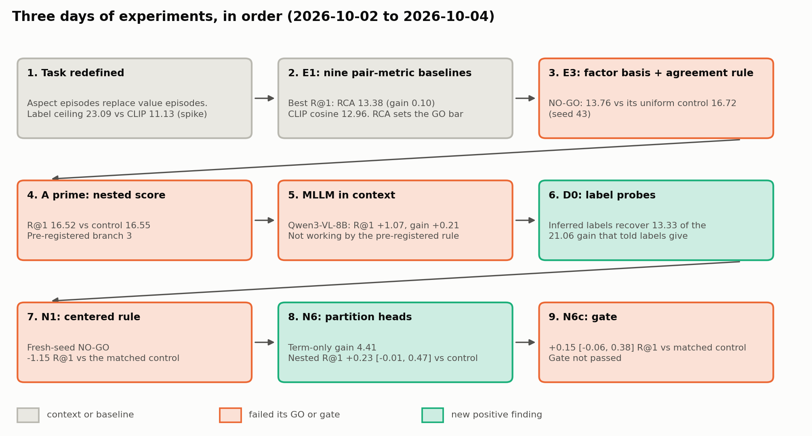
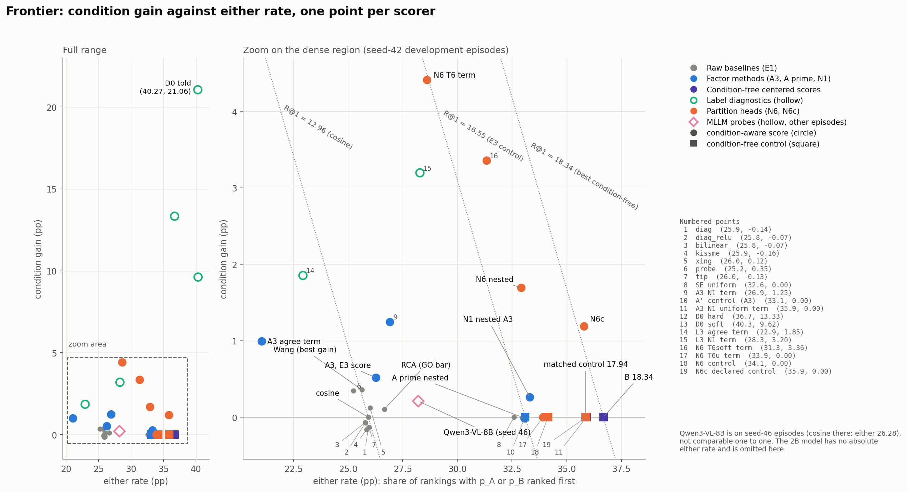
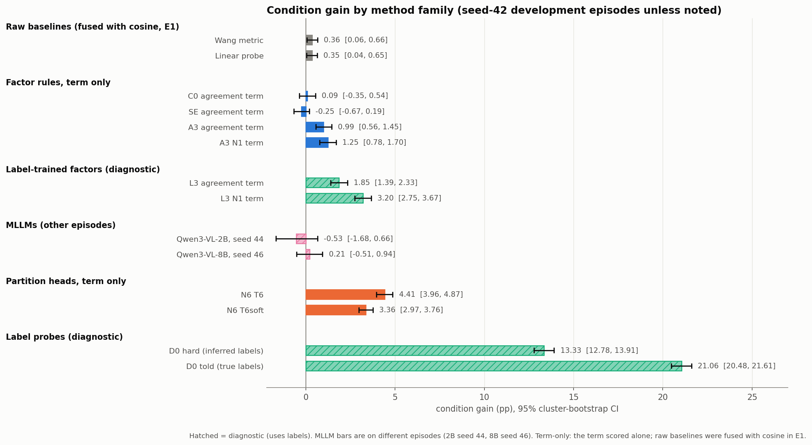
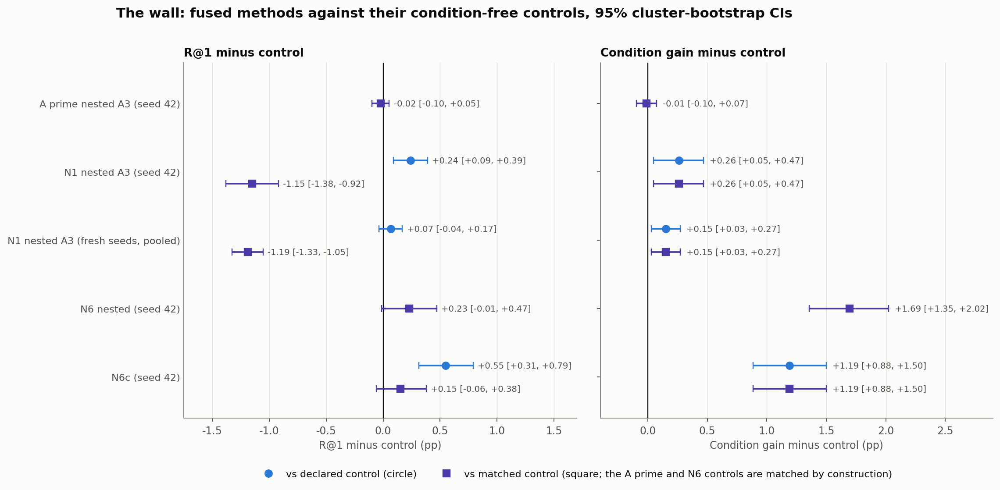
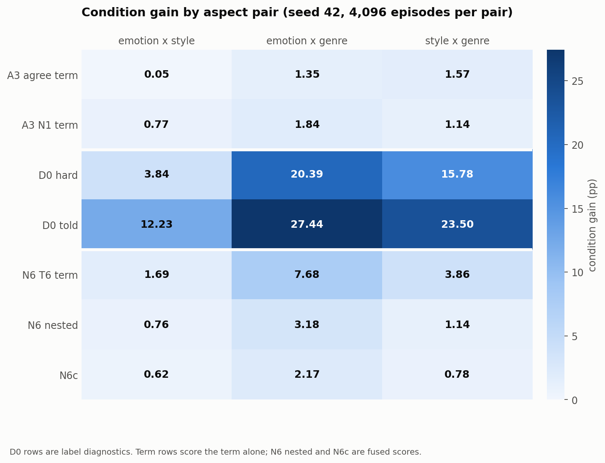

# Reading an unnamed aspect from four example pairs: method attempts, controls and outcomes (2 to 4 October 2026)

**Stage report, CoSiR v2.** Self-contained summary of three days of work towards a CVPR submission (abstract 10
November 2026). Every number below comes from a reviewed report or result file named in the section's sources;
95% intervals resample anchor paintings (5,000 resamples, seed 42) unless stated otherwise.

## Abstract

We study *example-conditioned aspect similarity across modalities*: a system receives a query (an artwork image or a
caption), four image and caption pairs that agree on an unnamed aspect (for example emotion or style) and four pairs
that agree on a different aspect, and must rank captions (or images) by agreement with the query on the demonstrated
aspect. On ArtELingo the task is learnable in principle: label-supervised probes, told which aspect is meant, reach
R@1 30.66 against 12.96 for CLIP cosine on our development episodes. Over three days we tested a learned factor basis
read by a training-free agreement rule (method A), a repaired fusion of it (A′), in-context multimodal LLMs (2B and 8B),
and five further readers and fusions. None passed its pre-registered test. The common failure is arithmetic:
R@1 = (either rate + condition gain) / 2, and every scorer trained without ArtELingo labels that reads the condition lost nearly as much *either rate* (how often some aspect-sharing candidate ranks first) as it gained in *condition gain* (how often the conditioned
candidate wins over the other aspect's), or more, so none beat its matched control on R@1 with a lower bound above 0 (best +0.23 [−0.01, 0.47]). Two results change the outlook. The first is that the condition can be read: inferring
the aspect from the pairs keeps 63% of the told probes' gain, and a reader on cross-modal heads trained without ArtELingo labels (the affect partition is distantly supervised by a GoEmotions classifier whose categories name 6 of the 8 evaluation emotions, and the image clusters carry style and genre, Table 4) on k-means partitions reaches a condition gain of 4.41 [3.96, 4.87], 3.5 times the best rule on the learned factor codes (1.25) and 4.5 times method A's own rule (0.99). The second is that condition-free
scores that use the examples without reading the condition rose from 16.55 to 18.34 R@1, so the bar for a method is now higher and better defined (with a caveat about the episode construction, Section 11.3). We describe the task, the protocol, each attempt with its baseline, the controls that caught
two false passes, and what a passing method has to do.

## 1. Introduction

Similarity between an image and a text is usually a single number. People, however, compare things *in a respect*:
two paintings can be alike in mood and unlike in style. Prior work fixes the respect by name (conditional similarity
networks, instruction embedders) or by training on one respect at a time. We ask whether a model can be told the
respect only by examples, the way a curator would show a few pairs and say "similar like these", and whether it can
apply that respect across modalities, ranking captions for an image or images for a caption.

The CVPR plan (spec of 2 October, revised after an automated multi-persona LLM review, ARS) set three contributions: the task and its
benchmark (C1), a method (C2: a shared sparse image and text factor basis read by a training-free agreement rule) and
an analysis of how aspects are carried by the two modalities (C3). It also fixed in advance what would count as a GO for
the method and what paper each outcome leads to (Table 1).

*Table 1. Pre-registered branches of the plan (spec §4).*

| Branch | Condition | Paper |
|---|---|---|
| 1, GO | the method beats backbone-only cosine, the best raw "metric from pairs" baseline (RCA) and its own condition-free control on both R@1 and condition gain (95% lower bounds above 0) on a fresh episode draw | method paper |
| 2 | no GO, but an in-context MLLM has both lower bounds above 0 against cosine | benchmark paper with the MLLM as the scorer |
| 3 | neither | analysis and negative-results paper |

The three days covered: redefining the task after two spikes (Section 3); nine baselines (Section 4); method A and its
GO test (Section 5); a repair (Section 6); MLLM probes (Section 7); a literature-checked list of new candidates
(Section 8); three quick checks and two follow-ups run overnight on 4 October (Sections 9 and 10). Figure 2 shows the
chain. Section 11 puts all scorers on one plot and explains the common failure; Section 12 lists what the process
caught; Section 13 the limits.

*Figure 2. The three days as a chain of experiments, each with its headline number. Grey: context and baselines;
orange: an attempt that failed its pre-registered GO or gate; teal: a positive finding.*

**Main findings.**

1. **The task is learnable but not by the methods tried.** Told label probes reach R@1 30.66 and condition gain 21.06
   on the development episodes (cosine 12.96 and 0). No method trained without ArtELingo labels beat its matched condition-free control on R@1 with a lower bound above 0 (best: N6 +0.23 [−0.01, 0.47], N6c +0.15 [−0.06, 0.38]), although fused condition gains reached 1.69 [1.35, 2.02].
2. **Method A failed its GO** on fresh episodes: R@1 13.76 against 13.53 for cosine and 16.72 for its own
   condition-free control, gain 0.26 [−0.04, 0.56]. Its agreement term alone selects the aspect (gain 0.97) but finds
   aspect-sharing candidates less often than cosine (either 21.4 against 27.1).
3. **Every repair hit the same wall.** A nested fusion (A′), factors trained on the labels as a diagnostic, a centered rule (N1), a
   find-then-select cascade (N2) and two head-based readers (N6, N6c) all landed within 0.3 R@1 of, or below, their
   matched condition-free controls.
4. **The condition can be read.** With label probes, the aspect inferred from the pairs keeps 63% of the told gain.
   With cross-modal heads on k-means partitions trained without ArtELingo labels (the affect partition is distantly supervised by a GoEmotions classifier whose categories name 6 of the 8 evaluation emotions, and the image clusters carry style and genre, Table 4), the reader's condition gain is 4.41 (A3's rule: 0.99).
5. **The condition-free bar rose.** Centering factor codes on the episode's example items, and averaging partition
   heads, lifted the best score that ignores the condition to 18.34 R@1 (RCA 13.38), part of which may come from how
   the episodes are built (Section 11.3).
6. **Controls matter.** Two configurations passed against a control that removed more than the condition; matched
   controls (the same score with only the condition removed) removed both passes: N1 fell 1.15 [0.92, 1.38] below its matched control, and N6c's margin shrank from +0.55 [0.31, 0.79] to +0.15 [−0.06, 0.38].

## 2. Task, data and protocol

### 2.1 The aspect episode

*Figure 1. One aspect episode. The query has values on aspects A and B. Four support pairs (teal) share a value of A
among themselves (each an image of one painting with a caption of another), four contrast pairs (orange) do the same for
B. Candidate p_A shares the query's value of A, p_B its value of B, eleven negatives (grey) share neither; all 13 candidates differ from the query on the third aspect. Swapping
supports and contrasts must move p_B to the top.*

An *aspect episode* (spec §5.1) consists of:

- a **query**: an image or a caption of one painting;
- **4 support pairs**, each an image of one painting with a caption of another painting (*cross-item*), the two sharing
  a value of the conditioned aspect A; the four pairs show four different values, never the query's own (*value-disjoint*);
- **4 contrast pairs** built the same way for a second aspect B;
- **13 candidates** in the other modality: p_A shares the query's value of A, p_B its value of B, 11 negatives share
  neither; all 13 candidates differ from the query on the third aspect. All 30 rows of an episode come from 30 different paintings.

Under condition A the target is p_A; swapping supports and contrasts (condition B) makes p_B the target. The aspect is
never named. On ArtELingo the aspects are **emotion** (8 values, the catch-all "something else" removed), **style**
(23 values with at least 30 selection paintings) and **genre** (10 values, from WikiArt via ArtGAN), giving three aspect
pairs: emotion × style, emotion × genre and style × genre. We draw 4,096 episodes per pair, 12,288 per *episode seed*.

### 2.2 Data

ArtELingo (English): 308,723 image and caption rows over 61,402 paintings. Every item is represented by frozen CLIP
ViT-B/32 image or caption features; no backbone is fine-tuned. Rows are split by painting:

*Table 2. Splits (spec §2.3).*

| Split | Rows | Paintings | Use |
|---|---:|---:|---|
| scorer-train | 183,694 | 36,518 | training any model or probe |
| selection | 32,413 | 6,451 | all development and test episodes of this stage |
| val | 30,872 | | unused |
| held | 61,744 | 12,281 | reserved for the final paper test; not read for aspect episodes |

Episodes are drawn from selection rows only, so every development or test number below is on paintings no model was
trained on. Different episode seeds reuse the same 6,451 selection paintings: a fresh seed is a fresh draw of episodes,
not of paintings.

### 2.3 Metrics

For each ranking (two directions, image to caption and caption to image, times two conditions):

- **R@1**: the target ranks strictly first; ties count as misses. Chance is 1/13 = 7.69%.
- **Other-aspect rate**: the other aspect's candidate ranks first.
- **Condition gain** = R@1 − other-aspect rate. It is exactly 0 for any scorer that ignores the condition, whatever its
  R@1.
- **Either rate** = R@1 + other-aspect rate: how often *some* aspect-sharing candidate ranks first.

From the last two, **R@1 = (either + gain) / 2**. This identity organises the whole stage: a scorer can raise R@1 by
finding aspect-sharing candidates more often or by choosing the conditioned one more often, and a scorer that reads the
condition must not lose more of the first than it gains in the second.

### 2.4 Uncertainty, seeds and pre-registration

Intervals resample anchor paintings (clusters), so an episode's dependence on its painting is respected. Development
used episode seed 42; tests used fresh seeds (43 for method A; 45, 47 and 48 for N1). A ledger records every use of
every seed. Each decision rule was committed to git before the numbers it governs were read; two exceptions are disclosed in Section 12 (Addendum 1 was committed two minutes after the N1 test had been computed but before its outputs were read; N6c's comparison with its declared control (cosine plus A3's centered term, R@1 17.94; +0.55) was already known from an exploratory run), and each stage ended
with a whole-branch review on the most capable model that re-derived every load-bearing number from the stored
per-anchor arrays with independent code.

### 2.5 Baselines and controls

- **Backbone only (cosine)**: CLIP cosine of query and candidate; condition gain 0 by construction.
- **Raw metric from pairs** (E1, Section 4): nine ways to turn example pairs into a metric (KISSME, RCA, Xing and CVS from the literature; the others are generic or our own). The best on seed
  42, **RCA**, is the *GO bar*.
- **Condition-free control**: the method's own score with the condition removed. A **matched** control removes only the
  condition and keeps every other ingredient of the score (same terms, same weight budget). Section 9.2 shows why the
  word "matched" matters.
- **Label-probe reference** (diagnostic, never a method): logistic probes trained on the evaluation labels of 60,000
  scorer-train rows; an item is represented by its class posteriors.

*Sources: spec `docs/superpowers/specs/2026-10-02-cosir-v2-cvpr-publication-plan-design.md` §2 to §6 and §10;
[E0 evaluation setup](../auto/v2/2026-10-29_aspect_eval_setup.md); episode ledger `docs/superpowers/episode_seed_ledger.md`.*

## 3. How the task was arrived at

**Value episodes measured recognition, not similarity.** The first benchmark conditioned on a *value* ("sad, like
these"): supports carried the query's own label. A prototype of the supports that ignored the query entirely scored
R@1 22.83 on these episodes, and adding the query raised it by only 0.57 [0.20, 0.96]; the best raw-CLIP probe (24.10)
beat our factor model SE (the C0 factor recipe plus value-condition episodes from GoEmotions affect clusters; 21.22) by 2.87 [2.14, 3.64]. The supports gave the answer away, so we redefined the condition to
show an *aspect* through values the query does not have.

**On aspect episodes the factor models did nothing, but labels showed headroom.** On 4,096 emotion × style aspect
episodes (no third-aspect constraint), CLIP cosine reached 11.13 R@1 and SE with the agreement rule 11.32 (+0.20
[−0.12, 0.50]); every other factor model and the raw-feature rule stayed at CLIP level. Label probes told the aspect
reached 23.09. Only a privileged reference given the label *names* as text prompts gained (12.63, +1.51 [0.94, 2.09]).

**The modalities carry the aspects unevenly.** Probes predict emotion from captions far better than from images (56.9%
against 35.2%) and style from images far better than from captions (60.8% against 25.4%). Four frozen backbones (CLIP,
SigLIP 2, PE-Core, Qwen3-VL-Embedding-2B) moved the weak side by at most 1.5 points (emotion from images 35.1 to 36.6;
style from captions 25.4 to 26.3) while moving the strong side by up to 11, so the asymmetry is not specific to one backbone; whether it comes from the modalities or from how the ArtEmis captions were collected is not separated. A cross-modal match is capped by the weaker side. We kept CLIP for all method work.

**Novelty.** A literature search found no paper that defines the task, but every ingredient exists: per-query weights
from a few examples (Contextual Visual Similarity, Wang et al. 2016), metric learning from pairs (Xing 2002, RCA, KISSME
2012), one example pair defining a relation (MARS, ICLR 2023), in-context text embedders. Our agreement rule reads as "a
few-shot, cross-modal, diagonal KISSME", so the novelty claim rests on the task and the combination, stated "to our
knowledge" within the search bounds.

*Sources: [support-baseline spike](../auto/v2/2026-10-22_support_baseline_spike.md);
[aspect-episode spike](../auto/v2/2026-10-23_aspect_episode_spike.md); [novelty check](../auto/v2/2026-10-24_aspect_task_novelty_check.md);
[backbone check](../auto/v2/2026-10-25_backbone_check.md); [literature review](../auto/v2/2026-10-21_cvpr_literature_review.md).*

## 4. Baselines: nine ways to read pairs, none separates the aspects (E1)

E1 ran nine raw-feature baselines on the 12,288 seed-42 and seed-43 episodes: the agreement rule on raw CLIP dimensions
(signed and rectified), a bilinear form, KISSME and RCA on a 32-component whitened PCA basis, Xing's metric, Wang et
al.'s per-query weights, a per-episode logistic probe on pair products, and a Tip-Adapter style cache. Each was fused with
cosine as z(cos) + λ·z(term), λ cross-fitted on the two halves of the episodes.

*Table 3. E1 on seed 42 (seed 43 in brackets where it matters). Cosine R@1 12.96 (13.53).*

| Scorer | R@1 | Condition gain |
|---|---|---|
| cosine | 12.96 [12.67, 13.26] | 0 |
| **RCA (GO bar)** | 13.38 [13.08, 13.69] | 0.10 [−0.08, 0.29] |
| Wang et al. (CVS) | 12.99 | 0.36 [0.06, 0.66] (seed 43: 0.30 [0.06, 0.55]) |
| per-episode probe | 12.79 | 0.35 [0.04, 0.65] |
| other six | 12.85 to 13.06 | −0.16 to 0.12 |
| SE codes, uniform weights (condition-free) | **16.30** [15.96, 16.63] | 0 |

No baseline separated the aspects: every gain stayed within 0.4 points of 0. The last row matters most. A factor
term with *uniform* weights, which ignores the condition, lifted R@1 by 3.3 points through the either rate alone. An
R@1 lift is therefore not evidence of reading the condition, and every method must beat its own condition-free control.
The ranking of the nine baselines was not stable across seeds (RCA fell below cosine on seed 43 by its mean of R@1 and
gain).

*Sources: [E1 baselines](../auto/v2/2026-10-30_aspect_baselines.md).*

## 5. Method A: a factor basis trained on pseudo-aspect episodes (E2, E3)

### 5.1 The method

*Figure 3. Method A against the earlier factor models. Grey: unchanged from the C0 recipe; purple: the shared
architecture; teal: new in method A; orange (dashed): replaced.*

Two small encoders map frozen CLIP image and caption features into a shared space of 32 non-negative factors (the
*codes*). The *agreement rule* turns the 4 + 4 example pairs into factor weights without training,
w = ReLU(mean over supports of a_I ⊙ a_T − mean over contrasts of a_I ⊙ a_T), L1-normalised, where a_I and a_T are the
image and caption codes of a pair; the *agreement term* of a candidate is Σ_l w_l q_l c_l. The score is
z(cos) + λ·z(term). Training adds, to the earlier C0 recipe (InfoNCE pair agreement, decorrelation, sparsity), a
*pseudo-aspect episode loss*: ranking cross-entropy through the agreement rule on episodes whose "aspects" are label-free
k-means partitions of the scorer-train rows (E2): **affect** (k-means on GoEmotions probabilities of the captions),
**image** (k-means on CLIP image features) and **caption** (k-means on CLIP caption features), 64 clusters each, in banks of
65,536 episodes. No evaluation label is used. The partitions are, however, aspect-shaped (Table 4).

*Table 4. Adjusted mutual information between the label-free partitions and the evaluation labels (scorer-train rows,
shuffled-label null about 0.00001).*

| Partition | Emotion | Style | Genre |
|---|---:|---:|---:|
| affect | 0.204 | 0.016 | 0.023 |
| image | 0.037 | 0.318 | 0.397 |
| caption | 0.057 | 0.058 | 0.161 |

### 5.2 The GO test

Six runs (A1 to A6: loss weights, factor count, swap term, sparsity) were trained for 2,000 steps each; the pre-registered
pick rule chose A3 (aspect loss weight 3) on seed 42 (R@1 13.39, gain 0.52 [0.19, 0.87]). On fresh seed-43 episodes, scored
once:

*Table 5. E3's GO test, seed 43 (12,288 episodes, 4,575 anchor paintings).*

| Comparator | Its R@1 | A3 minus it, R@1 | A3 minus it, gain |
|---|---|---|---|
| cosine | 13.53 | +0.23 [0.00, 0.46] | +0.26 [−0.04, 0.56] |
| RCA (GO bar) | 13.52 | +0.24 [0.00, 0.48] | +0.32 [0.01, 0.64] |
| A3's uniform-weight control | **16.72** | **−2.96 [−3.29, −2.64]** | +0.26 [−0.04, 0.56] |

**NO-GO.** The gain halved from the pick draw (0.52 to 0.26) and A3 lost almost 3 points of R@1 to its own control. The
held-out-aspect test (K8: a run trained on the affect and image partitions only, with no caption partition and no genre label, though its image partition carries genre, AMI 0.397, tested on genre pairs) also failed, and so did its
positive control, so it did not isolate the held-out aspect. A 2B MLLM probe also failed (Section 7), and the
pre-registered map pointed to branch 3.

### 5.3 Why it failed (post hoc)

Scored alone, A3's agreement term did select the conditioned aspect: condition gain 0.97 [0.53, 1.41] on seed 43 and 0.99
on seed 42, about one point above SE and C0. But it ranked an aspect-sharing candidate first in only 21.4% of rankings,
against 27.1% for cosine and 33.4% for the uniform control. With R@1 = (either + gain) / 2, beating the control's 16.72 at
the term's either rate would need a gain of about 12 points. The training loss also stayed 1.0 to 4.4% below its
constant-score value throughout: the model barely fitted the pseudo-aspect episodes.

*Sources: [E2 partitions](../auto/v2/2026-10-31_pseudo_partitions.md); [E3 go/no-go](../auto/v2/2026-11-01_aspect_factor_gonogo.md)
§2 to §7, §6.1, §11.*

## 6. Repair A′: keep the condition-free term, add the conditioned one

The user chose to try a repair before branch 3. An automated two-seat methodology review of the repair order (ARS) returned Major
Revision with twelve rule changes, including a pick rule aligned with the binding comparison: the old criterion,
mean(R@1, gain) = either/4 + 3·gain/4, could prefer a cell that adds 1.0 gain while losing 2.9 either and 0.95 R@1.

**Method A′** kept A's codes and rule and changed the test score to a *nested score*
z(cos) + λ_u·z(T_u) + λ_a·z(T_a), where T_u is the uniform-weight term and T_a the agreement-weighted term, so that the
condition-free term's either rate is kept and the conditioned term is added on top. Weights came from a 56-cell grid,
cross-fitted with a *min-margin* rule: on each tuning half, pick the cell maximising min(R@1 − the control's R@1, gain).
The control is z(cos) + σ·z(T_u).

- **Pilot on A3 (seed 42):** R@1 16.52 against its control 16.55, gain −0.01 [−0.10, 0.07]. One tuning half picked the
  control itself; across the 56 cells no cell with any weight on T_a beat the control's best R@1, and every cell with a
  gain above 0.5 had R@1 at most 14.26 (Figure 4 of the A′ report).
- **Label-trained factors (diagnostic H3):** trained on the evaluation labels with A3's settings, the term's gain roughly
  doubled (L3: 1.85 against A3's 0.99 on seed 42) but its either rate stayed below cosine (22.93 against 25.92) and its
  nested gain was 0.01 to 0.05, below the pre-registered bar of 0.218.

The pre-registered decision was **branch 3, stop the repair**.

*Figure 4. A′ on A3, seed 42: the 56 weight cells as seven rows; weight on the conditioned term buys gain only by losing
either rate at least as fast (from the A′ report).*

*Sources: [ARS repair-order review](../auto/v2/2026-11-04_ars_repair_order_review.md);
[A′ diagnostics](../auto/v2/2026-11-05_method_repair_diagnostics.md).*

## 7. In-context multimodal LLMs

We gave Qwen3-VL the episode in context: four example pairs, four counter-example pairs (each an image and a caption of
two artworks), the query and 13 lettered candidates, with the instruction to pick the candidate "alike to the query in
the same respect as the example pairs"; candidates were scored by the logit of their letter, with letters permuted per
episode.

*Table 6. MLLM probes against cosine on the same episodes (pre-registered rule: "works" if both lower bounds are above 0).*

| Model | Episodes | R@1 minus cosine | Gain | Either minus cosine | Works |
|---|---|---|---|---|---|
| Qwen3-VL-2B (fixed prompt) | seed 44, 900 | +0.22 [−1.13, 1.53] | −0.53 [−1.68, 0.66] | | no |
| Qwen3-VL-8B | seed 46, 1,800 | +1.07 [0.17, 1.93] | +0.21 [−0.51, 0.94] | +1.93 [0.25, 3.51] | no |

The 8B model found aspect-sharing candidates more often than cosine but did not choose the demonstrated aspect, so branch 2
was not met either.

*Sources: [E3 §9](../auto/v2/2026-11-01_aspect_factor_gonogo.md); `src/test/20261106_mllm_probe_8b/` (pre-registration and log).*

## 8. New candidates and the literature check

With the user's decision deferred, we drafted six candidates from the failure analysis and checked each against the
literature with an automated research pipeline (six scans and a synthesis):

*Table 7. Candidates (all "partially exist": every ingredient is published, the combination for this task was not found).*

| Id | Idea | Treatment |
|---|---|---|
| N1 | centered agreement rule: weights from the covariance of image and caption codes across the support pairs | run (a variant of KISSME and CCA) |
| N2 | find then select: rank by the condition-free score, reorder only the top k by the condition | run (retrieve then rerank) |
| N3 | concept-group basis from an LLM attribute vocabulary | deferred behind a privileged reference |
| N4 | meta-trained set-encoder conditioner | dropped (evidence that such adapters fit pseudo tasks, not real ones) |
| N5 | name the aspect with an MLLM, embed with the name | deferred behind a privileged reference |
| N6 | cross-modal classifier heads on the label-free partitions, head chosen by the pairs | run if the diagnostic D0 passes |

The synthesis ordered a diagnostic first (D0: can the aspect be read at all when items are well represented?), then N1 and
N2, then N6. A spec fixed the three checks and a decision table; the user approved it and set D0's threshold.

*Sources: `src/test/20261107_new_method_candidates/` (`candidates_draft.md`, `scan_N1.md` to `scan_N6.md`, `synthesis.md`);
spec `docs/superpowers/specs/2026-10-04-new-method-quick-checks-design.md`.*

## 9. Quick checks D0, N1, N2 and the fresh-seed test (night of 3 to 4 October)

### 9.1 D0: the aspect can be read from the pairs when items carry aspect blocks

D0 represents every item by label-probe posteriors. *Told* scores the posterior dot product on the conditioned aspect;
*Inferred* picks the aspect whose posteriors agree most within the support pairs minus within the contrast pairs.

*Table 8. D0 on seed 42.*

| Scorer | R@1 | Gain | Either |
|---|---|---|---|
| cosine | 12.96 | 0 | 25.92 |
| Told (labels, aspect given) | 30.66 [30.16, 31.16] | 21.06 [20.48, 21.61] | 40.27 |
| Inferred, hard pick | 25.02 [24.58, 25.48] | 13.33 [12.78, 13.91] | 36.70 |
| Inferred, soft weights | 24.97 [24.52, 25.41] | 9.62 [9.12, 10.11] | 40.31 |

Inferred kept 63% of Told's gain (the pre-registered threshold for "close" was 50%). The hard pick was right in 59% of
rankings (chance 33%), but only 38% on emotion × style, where Inferred kept 31% of Told's gain; on emotion × genre it kept
74% and on style × genre 67%. Emotion and style are weak in opposite modalities, so their within-pair agreements separate
poorly.

### 9.2 N1: a pass against the wrong control

Alone on A3's codes, the centered rule found aspect-sharing candidates more often than the agreement rule (either 26.91
against 21.04; cosine 25.92) at a similar gain (1.25 against 0.99). Inside A′'s nested score, N1 on A3 reached R@1 16.79
against the declared control's 16.55: +0.24 [0.09, 0.39], gain +0.26 [0.05, 0.47]. It was the only one of nine
configurations to pass, so the table sent it to a test on three fresh seeds.

**The fresh-seed test was NO-GO** (seeds 45, 47, 48 pooled, 36,864 episodes): R@1 minus the control +0.07 [−0.04, 0.17],
gain minus RCA's +0.14 [−0.02, 0.29]. The gain halved again from the pick draw (0.26 to 0.15).

**The final review then showed the pass was spurious.** The declared control used the *uncentered* uniform term, so it
removed two things at once: the condition and N1's centering of the query on the episode's 8 example items. N1's own
condition-free version, the centered uniform term, is by itself the strongest condition-free scorer we had measured
(R@1 17.95). Against the *matched* control (the same nested family with N1's term replaced by its condition-free
version), N1 lost 1.15 [0.92, 1.38] R@1 on seed 42 and 1.19 [1.05, 1.33] on the test seeds. Re-applying the table with
matched controls sent the work to N6.

### 9.3 N2: reranking a short list did not protect the either rate

Both aspect candidates were in the control's top 2, 3 and 5 in 4.7, 10.9 and 25.8% of rankings. Reordering only the top k
by a conditioned term lost R@1 at every k (agreement term: −2.29 to −4.58; N1's term: −0.46 to −1.91) while adding
0.4 to 0.7 gain, because the term promoted negatives inside the short list.

*Sources: [quick-checks report](../auto/v2/2026-11-08_new_method_quick_checks.md) §4 to §7 and its addenda in
`src/test/20261108_new_method_quick_checks/`.*

## 10. N6 and N6c: a reader that works, a fusion that does not yet

**N6** trains, for each of E2's three label-free partitions (so the heads are trained without ArtELingo labels) and each modality, a logistic head (64 classes) on CLIP
features of 60,000 scorer-train rows; an item is represented by its three head posteriors. The reader is D0's rule over
the three partitions; the condition-free version averages the three heads.

*Table 9. N6 on seed 42.*

| Scorer | R@1 | Gain | Either |
|---|---|---|---|
| N6 reader term alone | 16.51 [16.15, 16.87] | **4.41 [3.96, 4.87]** | 28.61 |
| N6 condition-free term alone | 16.96 [16.60, 17.30] | 0 | 33.91 |
| N6 nested (cosine, condition-free term, reader term) | 17.30 [16.94, 17.66] | 1.69 [1.35, 2.02] | 32.91 |
| its control | 17.07 [16.73, 17.42] | 0 | 34.15 |

The reader's gain of 4.41 is the largest condition gain without ArtELingo labels measured in the project during the stage (the best factor rule 1.25;
factors trained on the evaluation labels 3.20 with N1's rule; the 8B MLLM 0.21); two exploratory contrastive readers scored alone after the stage reached 5.10 and 6.07 (`src/test/20261109_fix_diagnostics/results/diagnose_fixes.txt`), but they did worse once fused (Section 14). Inside the nested score, N6 beat its
control on gain but not reliably on R@1 (+0.23 [−0.01, 0.47]; the lower bound stayed at or below 0 for all of
bootstrap seeds 0 to 99), so it failed its pre-registered pass. The reader picked the affect partition for most
emotion-conditioned rankings and the image partition for most style- and genre-conditioned ones, except the style
condition of style × genre, where image clusters carry genre more than style and the reader picked affect.

**N6c** came from an exploratory look at seed 42: N6's reader term placed on the strongest condition-free base
(cosine plus A3's centered uniform term, R@1 17.94) reached 18.49. Committed as a new configuration after the exploratory look, before its matched control was computed, with a gate
against its matched control (the same score with N6's reader replaced by its averaged heads), it reached R@1 +0.15
[−0.06, 0.38] over that control (18.34), so the gate failed and no test seed was spent.

Two overnight rulings by the controller are disclosed here. Addendum 2 §4 said no further method would be built overnight after N6 failed; the controller overrode that line for N6c, adopted the matched control, and took the "build N6" step that the committed decision rule had not named (rulings in the quick-checks log).

*Figure 5. Either rate against condition gain for the N6 scorers on seed 42 (from the quick-checks report). Reading
scorers (orange) sit up and to the left of the condition-free ones (blue); dotted lines are constant R@1.*

*Sources: [quick-checks report](../auto/v2/2026-11-08_new_method_quick_checks.md) §8; `ADDENDUM_2_N6.md`,
`ADDENDUM_3_N6C.md`, `explore_n6.py` in `src/test/20261108_new_method_quick_checks/`.*

## 11. Synthesis: one frontier, one wall

### 11.1 All scorers on one plot

*Figure 6. Every scorer of the stage on the seed-42 development episodes: condition gain (y) against either rate (x). Dotted
lines are constant R@1 (cosine 12.96, E3's control 16.55, the best condition-free score 18.34). Hollow markers: label diagnostics (seed 42) and the MLLM (seed 46). See `FIGURES.md` in the assets folder for the full key.*

Figure 6 separates three groups. Condition-free scores (gain 0) moved right along the x axis, from cosine (either 25.9)
to the uniform factor term (33.1), the centered term (35.9) and the centered term plus averaged heads (36.7). Scorers that
read the condition moved up but also left: A3's rule alone at gain 1.0 and either 21.0, N6's reader at 4.4 and 28.6,
label probes at 13.3 and 36.7 (inferred) or 21.1 and 40.3 (told). Fusions sit within 0.25 R@1 of their own family's condition-free control (A′ −0.02, N6 +0.23, N6c +0.15), except N1, 1.15 below its matched control.

*Figure 7. Condition gain of each reader scored alone (term only), with 95% intervals. Scored alone, except the raw baselines, which E1 fused with cosine; the C0 and SE bars are their agreement terms alone (seed 42). Hatched bars use evaluation labels and are diagnostics, not methods.*

### 11.2 Why every fusion lands on the wall

*Figure 8. R@1 (left) and condition gain (right) of each fused method minus its condition-free control, with 95%
intervals; where a declared and a matched control exist, both are shown. The controls of A′ and N6 are already matched (the same terms with the condition removed) and are drawn as matched squares.*

A fused score beats its matched control only if it adds more condition gain than it loses either rate. The measured
trades were close to even (Figure 8): N6c added 1.19 gain and lost 0.88 either (net +0.15 R@1); N6 nested added 1.69 and
lost 1.23 (net +0.23); A′ on A3 added nothing and lost nothing (gain −0.01, R@1 −0.02): one tuning half picked the control itself and the other put a small weight (0.25 against 4) on the conditioned term. Our reading, supported only by the exploratory analysis of Section 14: part of the loss comes from wrong aspect picks and from a representation that is weak in one modality (emotion from images, style from captions), which promote negatives; but reading costs either rate even when the pick is right (D0 below; Section 14). D0's condition-free counterpart (the mean of the three label-probe scores) has an either rate of 45.08 (R@1 22.54); Told keeps 40.27 and Inferred-hard 36.70, so reading the condition costs either rate even with label posteriors (−4.81 [−5.36, −4.26] for Told and −8.38 [−8.93, −7.85] for Inferred-hard), but the gain outruns the cost (Inferred-hard beats the counterpart by 2.48 [2.11, 2.84] R@1, Told by 8.12 [7.75, 8.50]). In every reader we measured, reading the condition cost either rate, and only a large enough gain outpaced that cost.

*Figure 9. Condition gain by aspect pair for the main readers (seed 42).*

Where reading works is consistent across methods (Figure 9): gains were smallest on emotion × style for every reader and largest on emotion × genre for six of the seven (A3's agreement term peaked on style × genre, 1.57 against 1.35), matching D0's pick accuracy (77% against 38%).

### 11.3 The condition-free bar and its caveat

The strongest condition-free score rose from 16.55 (E3's uniform control) to 17.94 (centered factor term) and 18.34 (plus
averaged heads), against 13.38 for RCA, and the first replicated on the fresh seeds (17.75 pooled). These scores use the
examples but not the condition: both conditions share the same 8 example items. A probe by the final reviewer (seed 42,
decides nothing) found that centering on 8 random items instead gives 16.85 and on the global mean 17.14, against 17.95 on
the episode's own examples. Because the examples are value-disjoint from the query by construction, part of the lift may
come from the benchmark's construction rather than from the representation; this needs its own control before it is a
finding.

## 12. Process: what the reviews caught

- **An automated multi-persona LLM review of the plan** (ARS: five seats of one model family, no human reviewer; Major Revision) made condition gain co-primary, added the
  condition-free control, the clustered bootstrap, the held-out aspect test and the MLLM baseline. Without it, the
  condition-blind uniform term (16.30 R@1, Section 4) would have passed the original GO rule.
- **An automated two-seat methodology review of the repair order (ARS)** replaced a pick criterion that rewarded trading R@1 for gain.
- **Whole-branch final reviews** re-derived every number from the stored arrays with independent code. They found the
  confounded N1 control (Section 9.2), several overclaims in reports and two false sentences; all were corrected before
  the results were reported.
- **Disclosed exceptions to pre-registration:** Addendum 1 was committed two minutes after the N1 test had been computed but before its outputs were read; N6c's comparison with its declared control (cosine plus A3's centered term, R@1 17.94; +0.55) was already known from an exploratory run. Addendum 2 §4 said no further method would be built overnight after N6 failed; the controller overrode that line for N6c, adopted the matched control, and took the "build N6" step that the committed decision rule had not named (rulings in the quick-checks log).
- **Seeds:** development on seed 42; seed 43 spent on E3's test; 44 and 46 on MLLM probes; 45, 47 and 48 on N1's test.
  Fresh seeds start at 49.

## 13. Limitations

- One dataset (ArtELingo, English), one backbone (CLIP ViT-B/32) for all methods, three aspects. CUB, SemArt and GeneCIS
  were prepared but not run.
- Every method used one model seed; picks were made on one development draw (seed 42), and development seed 42 was
  reused across many analyses.
- Fresh seeds are fresh draws of episodes on the same 6,451 selection paintings; held rows were not read.
- Intervals cluster anchor paintings only; candidate and example paintings recur across episodes.
- The label-free partitions are shaped like the evaluation aspects (Table 4), and the affect partition uses an emotion
  classifier trained on external labels.
- The overnight follow-ups (N6, N6c) were chosen after seeing development results; their seed-42 numbers are
  exploratory, and N6c's gate failed before any test.

## 14. What a passing method has to do, and a first diagnosis

The numbers point to one requirement: add selection without losing aspect-finding. A method must add more condition gain than it loses either rate against the strongest condition-free score B (R@1 18.34, either 36.68): the told partition does (gain 4.56 for an either loss of 1.57); N6's reader does not by a reliable margin (0.79 for 0.41).

To find which part blocks this, we ran exploratory diagnostics on seed 42 after the stage (`src/test/20261109_fix_diagnostics/`; they decide nothing). Each variant was added on top of B (N6c's matched control: cosine, A3's centered uniform term and the averaged heads, max-R@1 cross-fit; R@1 18.34, either 36.68) with A′'s min-margin cross-fit against B. Each reader also got a condition-free counterpart T_cf, the mean of its two condition scores, fused on B with a max-R@1 cross-fit (the condition-free counterpart of the min-margin rule); the difference between the fused reader and its counterpart is the margin from reading the condition (the counterpart's gain is 0, so the margin's gain equals the fused gain).

*Table 10. Exploratory, seed 42: what N6's reader needs to clear the condition-free bar. "Fused" is the variant fused on B; "counterpart" is T_cf fused on B; all columns in pp.*

| Variant added on top of B | Fused minus B: R@1 | gain | either | Counterpart minus B: R@1 | either | Fused minus counterpart: R@1 | either |
|---|---|---|---|---|---|---|---|
| N6 reader (trained without ArtELingo labels, hard pick) | +0.19 [0.01, 0.38] | 0.79 [0.52, 1.05] | −0.41 [−0.70, −0.12] | +0.05 [−0.05, 0.15] | +0.10 [−0.09, 0.29] | **+0.14 [−0.04, 0.32]** | −0.51 [−0.76, −0.25] |
| contrastive reader (picked partition minus contrast-like partition) | +0.07 [−0.08, 0.22] | 0.53 | −0.39 | not computed | not computed | not computed | not computed |
| same heads, partition told (emotion to affect, style and genre to image) | +1.50 [1.22, 1.79] | 4.56 [4.21, 4.93] | −1.57 [−2.03, −1.08] | +0.35 [0.16, 0.55] | +0.70 [0.32, 1.09] | **+1.14 [0.90, 1.41]** | −2.27 [−2.66, −1.88] |
| label-probe reference (diagnostic, not a bound) | +12.28 [11.81, 12.75] | 20.55 [19.99, 21.09] | +4.00 [3.35, 4.68] | +5.62 [5.27, 5.97] | +11.24 [10.53, 11.95] | +6.66 [6.31, 7.00] | −7.23 [−7.70, −6.76] |

The heads are good enough; the reader's choice of partition is not. Told the right partition, the same heads trained without ArtELingo labels clear B by 1.50 R@1 against +0.19 for N6's reader fused the same way. Part of that comes from the condition-free side: the told term with the condition removed already adds 0.35 [0.16, 0.55] on its own. The margin from reading the condition is therefore +1.14 [0.90, 1.41] R@1 for the told partition against +0.14 [−0.04, 0.32] for N6's label-free reader. The told term pays 2.27 either for 4.56 gain, so its gain outruns its either cost; it is not free. The label-free reader picks the told partition in 52% of rankings and is right under both conditions in only 28% of episodes. In those episodes the fusion gains +1.16 [0.80, 1.54] R@1 and 2.21 gain with no detectable either loss (+0.12 [−0.43, 0.66]); in the others it loses 0.61 [0.29, 0.94] either. The wrong picks are concentrated where the partitions are ambiguous: under the style condition of style × genre the reader picks the image partition in only 17% of rankings, and even the told mapping cannot separate style from genre, because both live in the image clusters (Table 4). A contrastive reader and a top-k cascade with N6's reader did not help (cascades lost 0.55 to 2.59 R@1).

Caveats on this analysis:

- For each partition h, the reader's statistic Δ_h (mean within-pair agreement over the support pairs minus over the contrast pairs) under condition b is exactly the negative of its value under condition a, and the told mapping sends style and genre to the image partition, so no style × genre episode can have both picks right. The 28% both-correct episodes come from emotion × style and emotion × genre only (1,576 and 1,883 of 3,459 episodes, none from style × genre), and the subset is selected after the fact.
- On those same 3,459 episodes the told-partition fusion, whose picks are right everywhere, lost 3.01 [2.09, 3.93] either, so the small either change of N6's reader there holds only at the small weight the cross-fit gave it.
- B's cross-fit picks were tuned on the same parity halves the fusion reuses (a small second-order leak), and seed 42 was reused for every analysis.
- N6's reader on B nominally clears B (+0.19 [0.01, 0.38]) in this exploratory look, but the lower bound sits at 0 under another bootstrap stream; it is not a pass.
- The pick accuracy of any reader that takes the argmax of Δ_h and uses the told mapping is capped at 83.3% pooled (100% on emotion × style and emotion × genre, 50% on style × genre, because of the antisymmetry), and both picks can be right in at most 66.7% of episodes; the label-free reader reached 52.4% pick accuracy and 28.1% both-correct.

The handoff (`docs/superpowers/handoffs/2026-10-04-fix-the-reader-handoff.md`) turns this into a plan: a reader that
chooses the aspect correctly (calibrated on label-free pseudo-aspect episodes), a partition that separates style from
genre, a matched control for each, and a test on fresh seeds 49 to 51.

## Appendix A. Glossary

| Term | Meaning |
|---|---|
| aspect episode | query, 4 support pairs, 4 contrast pairs, 13 candidates (Section 2.1) |
| condition gain | R@1 minus other-aspect rate; 0 for any condition-free scorer |
| either rate | R@1 plus other-aspect rate; R@1 = (either + gain) / 2 |
| codes | 32 non-negative factors per item from method A's encoders |
| agreement rule | weights = ReLU(support agreement − contrast agreement) per factor |
| nested score | z(cos) + λ_u·z(condition-free term) + λ_a·z(conditioned term), min-margin cross-fit |
| matched control | the same score with only the condition removed |
| D0 | label-probe diagnostic: Told vs Inferred aspect |
| N1, N2, N6, N6c | centered rule; find-then-select cascade; partition-head reader; N6 on the centered base |
| GO bar | RCA, the best raw baseline on seed 42 |
| B | best condition-free score (cosine, A3's centered uniform term and the averaged heads; R@1 18.34, either 36.68) |
| C0, SE | earlier factor models: C0 = factor recipe without condition training; SE = C0 plus value-condition episodes from GoEmotions affect clusters |
| RCA | relevant component analysis, a metric learned from pairs |
| KISSME | a metric learned from similar and dissimilar pairs by comparing their covariances |
| z(·) | per-episode z-score over the 13 candidates |
| ARS | automated research and review pipeline of LLM personas (no human reviewer) |
| E0 to E3 | experiment numbers of the plan (E0 setup, E1 baselines, E2 partitions, E3 method A and its GO test) |
| L3 | factors trained on the evaluation labels (diagnostic) |
| T_cf | condition-free counterpart of a reader: the mean of its two condition scores (Section 14) |

## Appendix B. Reproducibility

- Code: `src/eval/aspect_episodes.py`, `aspect_metrics.py`, `aspect_scorers.py`, `aspect_nested.py`,
  `aspect_quick_checks.py`; runners under `src/test/20261030_aspect_baselines/`, `20261101_aspect_factor_gonogo/`,
  `20261105_method_repair_diagnostics/`, `20261106_mllm_probe_8b/`, `20261108_new_method_quick_checks/`, `20261109_fix_diagnostics/` (`diagnose_fixes.py`, `diagnose_counterparts.py`).
- Results: per-anchor arrays and JSON summaries in each folder's `results/` (gitignored); figures of this report are
  built by `docs/reports/assets/2026-10-04_aspect_conditioned_similarity_methods/prep_figure_data.py` and
  `make_figures.py` from those files. The fix diagnostics of Section 14 stored summaries only (no per-anchor arrays).
- Decision records: `DECISION_RULE.md`, `TEST_CONFIG.md`, `ADDENDUM_1.md` to `ADDENDUM_3_N6C.md` and the
  `PREREGISTRATION.md` files of E3, A′ and the 8B probe; episode ledger `docs/superpowers/episode_seed_ledger.md`.
