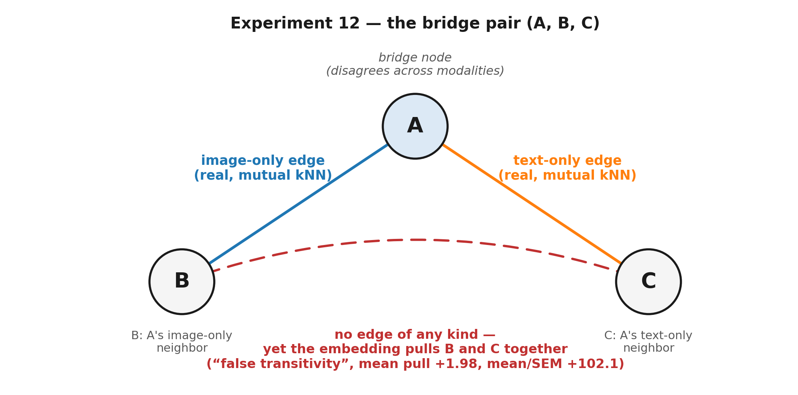

# Conditional Buddies — Why does training sometimes hurt, and what should default settings be?

**Framing:** This week tracked down the cause of last week's biggest open mystery, stress-tested the buddy graph's honesty, and found two new levers (K and the fusion module) that move real numbers.

**Date:** 2026-09-02
**Branch:** `experiment/condition_drift_retrieval_correlation`

---

## The headline: two mysteries explained, two new levers found

**Last week:** freezing the buddy-derived condition table beat continued training on held-out image-to-text retrieval, by a lot — and we didn't know why. Separately, we were worried the buddy graph might be pulling unrelated samples together through indirect "friend of a friend" chains.

**This week:**

| Thread | Bottom line |
|---|---|
| **Bridge diagnostic (12) + positive control (14)** | The graph does pull indirectly-linked samples together — but it still favors a real, direct connection by ~31% |
| **`combine_side="txt"` check + symmetric fix (13)** | The training-hurts-retrieval mystery is explained: it's a side-effect of the fusion module only touching one side, not a property of the buddy graph itself |
| **Buddy-supervision attribution (15)** | Found *which* part of training erodes the graph's honesty, and fixed part of it |
| **K ablation (16)** | The neighbor-count setting used everywhere should scale with dataset size — and the predicted fix wins on real retrieval |
| **Fusion-module search** | The *type* of fusion module matters far more than how big the buddy vector is |

All retrieval numbers below use paired same-seed comparisons and the `mean/SEM` significance read (≥2 is "real"); the measured noise floor is ~0.1–0.7 R1.

---

## Experiment 12: does the buddy graph invent relationships it shouldn't?

**Some vocabulary first, since this experiment is about graph structure:**
- A **bridge node** is a sample where the "nearest neighbors by image" and "nearest neighbors by caption text" don't agree — e.g. its image looks like one group of photos, but its caption reads like a different group's captions.
- **False transitivity** is the concern that if sample B and sample C are each linked to the same bridge node A, the model might start treating B and C as related to *each other* — even though nothing ever actually connected B to C directly. Like assuming two of your friend's other friends must know each other, just because they both know your friend.

**Test:** 80.2% of RedCaps-150k samples turned out to be bridge nodes. For 5,000 sampled (B, C) pairs that share a bridge node but were never themselves connected, we measured how much closer the trained embedding pulls them versus a matched pair that shares nothing.

**Result:** the pull is large and nearly universal — 91.4% of pairs got pulled closer, by a wide, statistically clear margin — but it barely tracks how much B and C's neighborhoods *actually* overlap in content (correlation ≈ 0.08, explaining under 1% of the variation). **Visualized in 4 figures**: a bar chart of node-type counts, the pull-distance distribution, a scatter of "real overlap vs. pull," and retrieval-rank change by node type (`docs/reports/assets/polysemy_bridges/`).

A deeper look (pooling 6 independently-trained runs instead of just one) found this pull isn't just cosmetic — it has a small, real effect on retrieval ranking, but almost entirely for one specific subgroup of bridge nodes (those linked only through images, not captions), not the general population.

**Verdict:** this is a real, worth-stating limitation — the embedding does connect samples that were never actually linked — but not evidence that anything is broken; it's exactly the kind of soft "guilt by association" a smoothing/graph-based method is expected to produce.

---

## Experiment 14: giving Experiment 12 a fair test — does a real connection actually count for more?

**Why this matters:** Experiment 12 never had a comparison case where two samples *were* really, directly connected — every pair it measured was, by construction, indirectly-linked-at-best. This experiment fixes that gap by adding a **positive control**: pairs that share a bridge node *and* are also directly connected by a real edge ("closed triangles"), compared against pairs that share a bridge node but have **no connection of any kind**.

**Result:** genuinely-connected pairs pull together **~31% harder** than genuinely-unconnected pairs (+3.18 vs. +2.42 in embedding-distance units, stable across 3 sampling seeds, mean/SEM +119.7). A same-day review caught that the first pass's "unconnected" group was actually 52% contaminated by pairs that *did* share some other kind of connection — correcting this **widened** the gap, i.e. the model discriminates real from artificial connections even more clearly than first measured. A follow-up breakdown found a clean, graded pattern: pairs connected in *both* image and text pull hardest, then image-only, then text-only, then no connection at all — a dial, not a switch.

**Verdict:** the buddy graph is not blind to the difference between a real relationship and an accidental one — it still favors direct evidence by a real margin, even though (per Experiment 12) it doesn't ignore indirect evidence entirely.

---

## A quick side-test: is the training-hurts-retrieval effect caused by which side we fuse the label into?

**Why we ran this:** every training run so far fuses the trainable per-sample signal into the **image** embedding only, leaving text untouched. That's a plausible explanation for two odd patterns we'd seen: image-to-text retrieval (not text-to-image) is the one that gets worse with more training, and one specific subgroup of samples is the one most affected.

**Test:** re-ran the exact same freeze-vs-train comparison, but fusing into the **text** side instead.

**Key result:** switching sides did **not** flip which retrieval direction gets worse (image-to-text retrieval is still the one that regresses) — but the effect shrank to about **1/11th** its original size. The specific-subgroup pattern, on the other hand, **did** flip exactly as predicted. So: fusing into one side only is clearly *amplifying* the problem, but not the sole cause of it — which is exactly what Experiment 13 (next) was built to test directly.

---

## Experiment 13: removing the one-sided fusion makes the problem disappear

**Test:** instead of just switching which side gets the trainable signal, this test removed the asymmetry altogether — one shared setup that fuses the signal into **both** image and text sides equally, with every related training term made symmetric too.

**Result:**

| | Fuse into image only (original) | Fuse into text only (side-test) | Fuse into both, symmetrically |
|---|---:|---:|---:|
| Image-to-text effect of continued training | **−4.67 R1** (a real, reproducible regression) | −0.40 R1 (much smaller, still real) | **+0.53 R1 (statistically noise — gone)** |

**Verdict:** this is the strongest evidence yet that continued training does *not* generically hurt retrieval — the regression we'd been reporting was substantially an artifact of only ever conditioning one side of the model, not a real property of training on buddy-graph structure. This reframes last week's headline finding and is good news for the publication story: it removes a worry about the training procedure itself, not about the buddy graph.

---

## Experiment 15: figuring out *why* the graph's honesty erodes during training, then fixing part of it

**The question:** Experiment 14 showed the buddy embedding starts out able to tell a real connection from an artificial one. Does that ability survive training, and if it erodes, which part of the training recipe is responsible?

**What we found, in three steps:**

1. **It does erode** — measuring the same "real vs. artificial connection" discrimination ratio at the start versus the end of training, both the normal and the frozen-table training arms lose almost exactly the same amount of discrimination (from a ratio of 2.48 down to ~2.26) — **even in the frozen arm, where none of the buddy-specific training terms are switched on.** That means ordinary retrieval training itself, not anything buddy-specific, is the main cause of the erosion.
2. **Testing each buddy-specific ingredient separately** found only one of three actually helps: a smoothness penalty does nothing measurable; a contrastive term that keeps buddy-neighbors close does help, recovering a small but real slice of the lost discrimination; and turning on a self-refreshing version of the graph **completely cancels that gain** — because the refreshed graph can mistake training-induced closeness for a "new" real connection and reinforce it, a feedback loop.
3. Making that surviving contrastive term "type-aware" — favoring genuinely-strong connections over weaker ones, and excluding synthetic patch-up edges — recovered a further, smaller, real slice of discrimination on top.

**Bottom line:** most of the erosion comes from ordinary training pressure, not from buddy-specific mechanisms; of the tools available today, only one (kept static, not self-refreshed) helps, and only partially. A more targeted fix — explicitly pushing genuinely-unconnected pairs apart — is now planned and approved, motivated by this measured, only-partially-closed gap rather than a hunch.

---

## Experiment 16: the neighbor-count setting (K) should scale with dataset size

**Test:** every RedCaps result so far fixes "K=30 nearest neighbors" as a shared setting, inherited from a one-off check on a different dataset. This week checked, cheaply and without any training, how K should change as the dataset grows — then validated the prediction with real training runs.

**Result:** a structural analysis predicted K should rise gently with dataset size (K≈35 at 300k, K≈39 at 500k — far short of scaling proportionally). Training at the predicted K=39 on the 500k dataset beat the universal K=30 default by **+0.97 R1 on image-to-text retrieval** (mean/SEM +14.5) — the single cleanest, most confidently real result of the week, and it landed exactly where the cheap structural prediction said it would.

---

## Combiner architecture: the *type* of fusion module matters far more than its size

**Test:** a literature-grounded search (composed-image-retrieval, FiLM, LoRA-style methods) tried three alternative ways to fuse the tiny trainable buddy vector into the frozen CLIP embedding, in place of today's unvalidated default module.

**Result:** a **rank-16 low-rank residual adapter** beat today's default by **+3.1 R1** on held-out retrieval while staying comparatively robust when the buddy vector has to be *predicted* rather than looked up (the realistic deployment case). Two other candidates won by a similar margin on held-out retrieval but **collapsed by 14–28 R1** in that deployment case — a large, reproducible failure. Separately, sweeping the buddy vector's size (8 vs. 16 vs. 32 dimensions) changed nothing. **Reading:** keeping the fusion module small and constrained is what makes conditioning safe to deploy; letting it touch the whole embedding is not. This needs validation at full training scale before it becomes the new default.

---

## What this means for the publication story

Two long-standing worries are now understood rather than just flagged:

- The "training hurts retrieval" result is now explained as **mostly a side-effect of one-sided fusion**, not a property of the buddy graph — good news, since it removes a caveat about the graph itself.
- The "does the graph invent relationships" worry is now **quantified and partially attributed**: the graph still favors real connections by ~31%, the erosion during training is mostly ordinary training pressure rather than a buddy-specific flaw, and a targeted fix is scoped.

Two new, validated levers appeared this week — the neighbor-count K should scale (gently) with dataset size, and the fusion module's *shape*, not its size, controls whether conditioning survives deployment. Neither is adopted as a new default yet; both are flagged for validation at full scale.

---

## Next steps

1. Scope and run the targeted fix for Experiment 15 (pushing apart genuinely-unconnected pairs), now that we know reweighting alone only partially closes the gap.
2. Validate the low-rank fusion module at the project's real training scale before considering it as the new default.
3. Investigate *why* one-sided fusion specifically causes the regression (Experiment 13 shows removing it removes the effect, not the mechanism).
4. Decide whether the K=39-at-500k result needs a third confirming seed before it goes in the paper.

## Questions

**Current publication-safe claim, unchanged:** buddy-graph structure is a robust, content-grounded initializer and a better in-model starting point than the generic alternative.

**This week's sharper question:** now that the training-hurts-retrieval mystery is explained away, what's the cleanest way to state the buddy graph's own remaining honesty gap (real-vs-artificial-connection discrimination) as a limitation rather than a flaw?
