# Weekly report, 22 to 30 September 2026: from a buddy-based PercepT to CoSiR v2

*Covers 22 September to the morning of 30 September. It starts one day before the [previous weekly report](2026-09-23_percept_topic_pipeline.md) ended, because the buddy-versus-PercepT comparison began on 22 September; those two days are re-told here so the whole comparison can be read in one place. Two lines of work ran in parallel: the percept line on branch* `experiment/percept_topic_pipeline` *(§2, §3), and the CoSiR v2 redesign on main (§4).*

## Contents

1. Summary
2. Starting point, 22 to 24 September: PercepT as the baseline, and the buddy graph's emotion problem
3. The buddy model inside PercepT's pipeline, 25 to 30 September
4. CoSiR v2, 28 to 30 September
5. Discussion
6. Next steps
7. Appendix: reproducing the figures

## 1 Summary

CoSiR aims at conditional image-text similarity: whether an image and a caption match should depend on a condition, such as a shared emotion or a shared style, and the conditions should be discovered from the data rather than hand-labelled. This week we asked two questions on ArtELingo, a WikiArt dataset whose captions carry human emotion labels.

The first question was whether CoSiR's buddy graph can do the job of PercepT (arXiv 2606.03345), a recent method that forms emotion-aware topics from image-text data. We replicated PercepT on our split and used it as the baseline throughout. The buddy side reached PercepT's level on held-out agreement with human labels (emotion AMI 0.1241 against 0.1252, genre 0.2406 against 0.2486) and did so without the anti-collapse penalty that PercepT needed on our data; its topics are also evenly used, while PercepT leaves a third of its topics empty on held-out paintings. PercepT stays ahead on geometric cluster separation. On Stage 2 accuracy it first looked ahead once both image-only classifiers were tuned the same way (0.9226 against 0.8534 macro AUC), but that comparison used 40 against 16 topics and different held-out labels. A matched head-to-head at equal topic counts, which finished on the evening of 30 September, does not reproduce PercepT's lead. Ranked by Stage 2 AUC alone, buddy's winners score higher on the test half (0.993 against 0.966 at 16 topics, 0.994 against 0.960 at 40) but keep less emotion structure (emotion AMI 0.060 against 0.079 and 0.110); among trials that keep a common level of emotion structure, we detected no Stage 2 difference (§3.6). Along the way an independent review found two bugs in our own PercepT code, and a large sweep produced a winner whose success turned out to be an artefact of how it was scored.

The second question came out of the first: topic classification is not CoSiR's target. On 28 September we stopped patching the old CoSiR model and rebuilt it as CoSiR v2, which scores an image and a text under a condition given by a few example pairs. In 34 hours the first design went through four of its five planned stages. Its factor layer turned out to have collapsed to about one dimension; we found the cause (one loss term) and repaired it. On held-out paintings the repaired factors improve human-label conditional retrieval over the collapsed ones by +4.5 and +4.2 R@1 points (i2t, t2i) and over plain CLIP by +6.1 and +6.0. A trained scorer on top of the repaired factors did not beat the zero-parameter rule it started from, and a cross-validated oracle showed why: with these factors frozen, no fixed weighting per human label beats that rule by a measurable margin. The next step, decided this morning, is to make the factors themselves condition-aware.

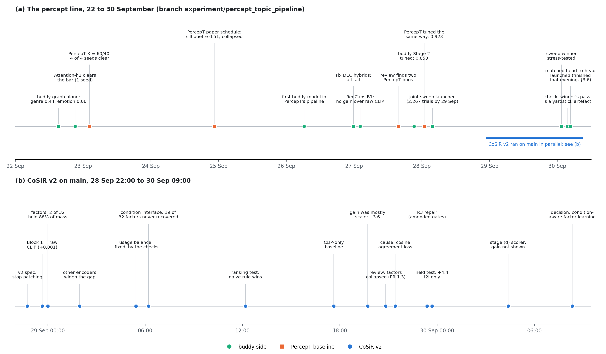

*Figure 1. The week at a glance. (a) The percept line over nine days. Green circles are buddy-side results, orange squares PercepT-baseline results. (b) CoSiR v2 on main, which ran in parallel from the evening of 28 September; its time axis is stretched because fifteen steps happened in 34 hours.*

*Table 1. Headline results of the week, each next to the baseline it was judged against.*

| Question                                                          | Our result                                              | Baseline                                                               | Verdict                                                                           |
| ----------------------------------------------------------------- | ------------------------------------------------------- | ---------------------------------------------------------------------- | --------------------------------------------------------------------------------- |
| Stage 1: held-out label agreement (emotion / genre AMI)           | buddy model 0.1241 / 0.2406, 3 of 4 seeds clear the bar | PercepT replication 0.1252 / 0.2486, 4 of 4 seeds (before the bug fix) | level; the corrected PercepT was not re-tested over seeds (§3.3)                  |
| Stage 1: does it need an anti-collapse term?                      | no                                                      | PercepT needs a balance term the paper does not have                   | buddy ahead                                                                       |
| Stage 1: topic occupancy on held-out paintings                    | 19 of 19 topics used, median 523 paintings              | 21 of 67 topics empty, median 13                                       | buddy ahead                                                                       |
| Stage 1: silhouette, same sample and code                         | 0.0416                                                  | 0.4973                                                                 | PercepT ahead                                                                     |
| Stage 2: image-only macro AUC, both mappers tuned the same way    | 0.8534 (16 topics)                                      | 0.9226 (40 topics)                                                     | superseded: topic counts and labels not matched (next row)                        |
| Stage 2 at matched topic counts, test half, K = 16 / 40           | plain AUC 0.9931 / 0.9937 (emotion AMI 0.060); with an emotion floor 0.9462 / 0.9550 | PercepT plain AUC 0.9664 / 0.9604 (emotion AMI 0.079 / 0.110); with the floor 0.9435 / 0.9598 | buddy ahead on plain AUC but with less emotion; no difference detected at equal emotion (§3.6) |
| v2: repaired factors R3, held human-label episodes, R@1 i2t / t2i | 17.6 / 20.9                                             | collapsed R0 13.1 / 16.7; CLIP only 11.5 / 14.9                        | R3 ahead of both; the condition-specific part is significant in t2i only          |
| v2: trained scorer G3 vs the naive rule                           | condition-use gain +0.83 / +1.61, CIs include 0         | naive rule, 0 by definition                                            | not shown; the swap-test pass is reproduced by the naive rule at G3's CLIP weight |

## 2 Starting point, 22 to 24 September: PercepT as the baseline, and the buddy graph's emotion problem

On 22 September we read PercepT (arXiv 2606.03345) and asked whether CoSiR's buddy graph could find the same kind of topics. Two lines of work started that day and ran side by side. One replicated PercepT on ArtELingo, so that we would have a baseline measured on our own data and split (§2.2). The other tried to make the buddy graph sensitive to emotion, which it turned out not to be (§2.3 to §2.5). On 24 September the two were compared for the first time on the same held-out paintings (§2.6).

### 2.1 Data and measures used throughout

ArtELingo contains WikiArt paintings with captions written by human annotators; each annotator also picked one of nine emotions (amusement, awe, contentment, excitement, anger, disgust, fear, sadness, something else). We use the English captions and build one node per painting. The split is fixed for §2 and §3: 61,402 training paintings (308,723 caption rows) and 9,365 held-out paintings from the validation and test sets (46,813 rows). No painting appears on both sides. (§4 uses its own painting-grouped split, described there.)

Labels are used only to score results, never to train, except where a row is marked "supervised". A painting's emotion label is the majority vote of its roughly five annotators. Genre (landscape, portrait, religious painting and six more) comes from the ArtELingo-28 release and exists for 1,303 paintings: 1,144 in training and 159 held out. The two labels are close to independent in the data (AMI 0.07 between genre and emotion), so a grouping that follows one will not follow the other for free.

Every method starts from the same frozen features. CLIP ViT-B/32 gives a 512-d image feature and a 512-d text feature per caption; a painting's text feature is the mean over its captions. The affect signal comes from a RoBERTa model fine-tuned on GoEmotions, a Reddit dataset with 28 emotion categories, run over the captions. It was never trained on ArtELingo.

We score groupings with three measures:

- AMI (adjusted mutual information) measures how well a grouping agrees with a human labelling, from 0 (chance) to 1 (identical). It is our main measure.
- Silhouette ignores labels and asks whether each painting is closer to its own group than to the nearest other group, from -1 to 1. It is PercepT's headline metric.
- Macro AUC scores Stage 2, an image-only model that predicts the Stage 1 topic. It is averaged over topics, and 0.5 is a guess.

The pass criterion is the **held-out Pareto bar**, fixed on 22 September before any learned model was trained: held-out emotion AMI above 0.1236 and held-out genre AMI above 0.1954, both at once. The two numbers are the best emotion AMI among the graph fusions (late fusion, §2.4) and the genre AMI of hierarchical refinement (§2.4), both measured before any learned model existed, so clearing the bar means improving on both at once. A PercepT run counts as collapsed when more than half of its topics each hold under 1% of the paintings. Seed tests use seeds 42, 7, 123 and 2024.

### 2.2 The baseline: PercepT, and what "DEC" means here

PercepT forms topics in two stages. Stage 1 uses the image and the captions without labels; Stage 2 trains an image-only model to predict the Stage 1 topic. Figure 2 shows Stage 1 as we replicated it.

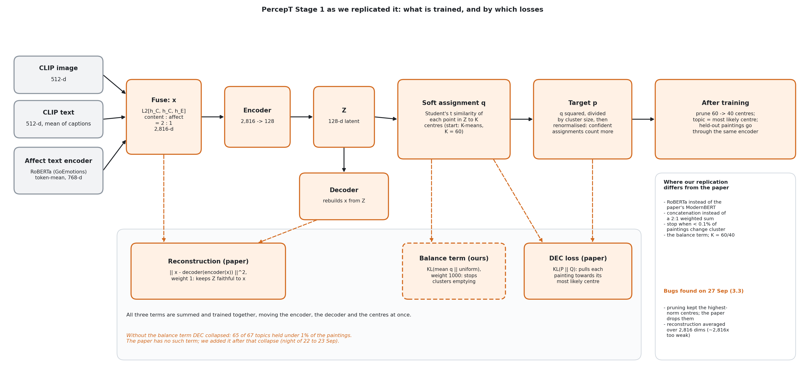

*Figure 2. PercepT Stage 1 in our replication. Content and affect are fused into one 2,816-d vector x and compressed by an autoencoder into a 128-d space Z. Three losses are trained together: reconstruction and DEC come from the paper, and the balance term (dashed) is our addition. The box on the right lists where we depart from the paper and two bugs that an independent review found later (§3.3).*

DEC (deep embedded clustering) is the part that forms topics. Each painting gets a soft membership q over K centres in Z, computed from its distance to each centre. DEC then builds a sharper target p by squaring q and renormalising, and trains the encoder and the centres so that q moves towards p. Confident memberships become more confident with every epoch, which is why we call it self-sharpening below. Nothing in DEC keeps the clusters balanced, and a large cluster can absorb its neighbours. PercepT's reconstruction loss keeps Z tied to the input, and it is the only counterweight in the paper's recipe.

On our data that counterweight was far too weak. Table 2 traces the replication.

*Table 2. PercepT replication on the held-out paintings. "Seeds" counts runs that clear the Pareto bar.*

| PercepT configuration                                      | Date   | Emotion AMI | Genre AMI | Silhouette   | Seeds   | Collapsed                     |
| ---------------------------------------------------------- | ------ | ----------- | --------- | ------------ | ------- | ----------------------------- |
| Paper losses only, K = 100 centres pruned to 67            | 22 Sep | 0.0363      | 0.3081    | 0.8550       | 0 / 1   | yes, 65 of 67 topics under 1% |
| + balance term λ = 1000, K = 100/67                        | 23 Sep | 0.1235      | 0.2089    |              | 1 / 4   | no                            |
| + balance term λ = 1000, K = 60/40 (**standing config**)   | 23 Sep | 0.1252      | 0.2486    | not measured | 4 / 4   | no                            |
| same, 14 seeds                                             | 24 Sep | 0.1242      | 0.2517    | not measured | 10 / 14 | no                            |
| Paper's own training schedule, no balance term, K = 100/67 | 24 Sep | 0.1092      | 0.3288    | 0.5120       | 0 / 1   | yes, 50 of 67 under 1%        |

The first run collapsed. At convergence the DEC loss was about 760 times larger than the reconstruction loss, so self-sharpening met no resistance. (Much of that imbalance was a bug we found only on 27 September: our reconstruction term was averaged over the 2,816 input dimensions, which made it about 2,816 times weaker than the paper's; see §3.3.) We added a balance term, a penalty on the gap between the average membership and a uniform one. At weight 1 it pointed the right way but was far too weak (64 of 67 topics still under 1%). Clusters stopped emptying only from weight 1,000 on, and even then only one seed of four cleared the bar. Reducing the number of centres was what made the result repeatable: with 60 centres pruned to 40, every one of four seeds cleared both thresholds. We call this the standing config. A 14-seed run on 24 September was more cautious: 10 of 14 seeds cleared, and the misses were all on emotion, which sits right at the threshold (14-seed range 0.1157 to 0.1289).

The first row carries a lesson that matters in §3.1. The collapsed run has the highest silhouette in the table, 0.855. Silhouette rewards a few large, well-separated clusters, and collapse produces exactly that. On 24 September we also ran the paper's own training schedule (noise on Z during pretraining and a cosine learning-rate decay) without our balance term. It reached silhouette 0.51 and genre AMI 0.33, but it missed the emotion threshold and still collapsed.

Stage 2 also has a PercepT baseline. The mapper attention-pools the 50 CLIP patch tokens of the image with one learned query and predicts topic scores with a linear head. With single-label targets and learning rate 1e-3 it reached a held-out macro AUC of 0.5690 (four-seed mean 0.5709). With multi-label targets (every topic whose membership exceeds 1.2/40) and learning rate 3e-3 it reached 0.8256 over four seeds.

We therefore took the standing config as the baseline for the whole buddy-versus-PercepT comparison: held-out emotion AMI 0.1252, genre AMI 0.2486, four of four seeds. A buddy-based method has to match or beat it on this split before it is worth writing up. On 27 September a review found two bugs in our PercepT code that changed these numbers; §3.3 reports the corrected baseline, and this section reports the numbers as they stood on 24 September.

### 2.3 The buddy graph on its own follows genre, not emotion

The buddy graph links two paintings when each is among the other's 20 nearest neighbours in CLIP space, in the image features or in the text features. Leiden community detection then splits the graph into groups of densely linked paintings and chooses the number of groups itself. On the training paintings it found 28 communities. Their agreement with genre was high (AMI 0.4384) and their agreement with emotion was low (AMI 0.0593), a seven-fold gap. The gap held under every check we ran. Arabic and Chinese emotion labels for the same paintings gave AMI 0.057 to 0.060. Dropping the 26% of paintings whose majority vote was a tie raised emotion AMI only to 0.0758. Within a single genre, emotion AMI stayed at or below 0.137.

Figure 4 (top row) shows what the communities contain. In the genre panel almost every column has one strongly red cell: each community is mostly one genre. In the emotion panel most cells stay close to the overall mix; the largest shifts are in contentment, which is 36% of all paintings, and in a few small communities.

Against the baseline, the plain buddy graph is far behind on emotion: 0.059 against PercepT's 0.146 on the same training paintings (standing config, seed 42), while PercepT keeps genre AMI at 0.326. The buddy graph needed an emotion signal.

### 2.4 Five ways to add emotion, and what each cost in genre

Figure 3 shows where each attempt feeds the emotion signal into the pipeline. All numbers in this subsection are training-split AMI, because these methods were screened on training paintings first. Only the learned students in §2.5 were also measured on held-out paintings.

*Figure 3. The buddy-side methods tried on 22 September, from (a), the content-only reference, to (f), the learned student that §2.5 develops. Teal marks what each method adds or changes relative to (a). The right column gives training-split AMI for emotion and genre.*

Early fusion (b) appends the 28 GoEmotions probabilities to the text features with a weight w before the neighbour search. It traded one label for the other. As w rose from 0 to 4, emotion AMI rose from 0.059 to 0.116 while genre AMI fell from 0.438 to 0.087. No weight reached the target we had set in advance (emotion above 0.177 with genre kept above 80% of 0.438).

Two checks asked whether the affect signal itself was the limit. A graph built from the affect vectors alone reached emotion AMI 0.118, barely above the best early fusion, so fusion was not hiding a stronger signal. ArtELingo's own emotion classifier, a BERT trained on these very labels, reached 0.169 on held-out paintings. That is the only fairly measured result above 0.15, but it needs emotion labels to train, which the unsupervised setting and CoSiR's other dataset (RedCaps) do not have. We keep it as a supervised reference and nothing more.

Attempt (e) is the one place on 22 September where the buddy side used PercepT's DEC. We replaced Leiden with a small autoencoder (28 to 16 dimensions) and DEC with 28 centres, on the affect vectors alone. The first run stopped at a fixed 100 epochs while both losses were still rising, so its result (0.1258) could not be trusted. With a convergence rule (stop when fewer than 0.1% of paintings change cluster; it stopped at epoch 185) DEC reached emotion AMI 0.1492, against 0.1180 for Leiden on the same input, and no cluster collapsed. The clustering method does matter somewhat (+26% relative). But genre stayed at 0.055, because the input carries no content, and the result stayed below the 0.177 target. We did not carry DEC forward.

Late fusion (c) builds the content graph and the affect graph separately and takes the union of their edges. It reached emotion 0.1236 and genre 0.1394, the best emotion score among the graph fusions (b) to (d). The community sizes show why genre dropped: the union merged content communities (28 became 21, and the smallest grew from 6 to 324 paintings), because affect edges bridge them. Taking the intersection instead left 98.96% of paintings without any edge. The two graphs almost never agree on who a painting's close neighbours are.

Hierarchical refinement (d) keeps the 28 content communities as parents and lets affect split paintings only inside a parent. It reached emotion 0.1072, far above a control that splits the same parents into the same sizes at random (0.0362), so the emotion signal is real. Its genre AMI (0.1954) was close to the same control's (0.2014), so most of the genre loss came from cutting 28 groups into about 400 smaller ones, whatever the signal used to cut them.

These attempts left one question open. Do content and affect share any structure, when their neighbour graphs barely overlap? A canonical correlation analysis (CCA) answered it. The top held-out correlation between the content and affect features was 0.7285, against 0.0699 when the pairing is shuffled. The two views disagree about exact neighbours but agree on broad directions of variation. So we learned a joint space instead of combining graphs, which is method (f).

*Table 3. Training-split AMI of the 22 September methods, with PercepT on the same training paintings as the baseline.*

| Method                             | Emotion AMI     | Genre AMI       | Note                                   |
| ---------------------------------- | --------------- | --------------- | -------------------------------------- |
| (a) Content-only buddy graph       | 0.0593          | 0.4384          | reference                              |
| Affect-only graph                  | 0.1180          | 0.0396          | affect ceiling without labels          |
| (b) Early fusion, w = 1 / w = 4    | 0.0759 / 0.1160 | 0.4025 / 0.0867 | trade-off                              |
| (c) Late fusion, union             | 0.1236          | 0.1394          | sets the emotion threshold             |
| (d) Hierarchical refinement        | 0.1072          | 0.1954          | sets the genre threshold               |
| (e) DEC on the affect vectors      | 0.1492          | 0.0554          | no content in the input                |
| (f) Linear student                 | 0.1284          | 0.2799          | first to beat both thresholds on train |
| (f) Attention-h1 student           | 0.1351          | 0.2397          | §2.5                                   |
| PercepT, standing config (seed 42) | 0.1462          | 0.3258          | baseline                               |
| PercepT, paper's schedule          | 0.1373          | 0.3902          | collapsed                              |

### 2.5 A student trained by both graphs: from Linear to Attention-h1

The student is a small network that maps each painting to a 32-d vector z. It takes two inputs: the CLIP content features (image and text, normalised, reduced to 50 dimensions by PCA) and the 28 affect probabilities. The buddy graph and the affect graph act as teachers. Every edge of either graph is a positive pair, the other paintings in the batch serve as negatives, and the student is trained with one InfoNCE loss per teacher, weighted equally. After training we build a neighbour graph on z and run Leiden, exactly as for the buddy graph. So this student adds no DEC loss and no cluster centre; it changes only the space in which the graph is built. Figure 6b in §3.1 shows its full architecture. The fusion study called its first two versions "Stage 1" and "Stage 2". To avoid a clash with PercepT's stages we use the names from the later architecture sweep: Linear, MLP-64, MLP-128, Attention-h4 and Attention-h1.

*Table 4. Learned students on the held-out paintings (seed 42), against the PercepT baseline.*

| Model                                     | What changed                                        | Emotion AMI              | Genre AMI                | Clears the bar        |
| ----------------------------------------- | --------------------------------------------------- | ------------------------ | ------------------------ | --------------------- |
| Linear                                    | linear projection per input, scalar gate mixes them | 0.1095                   | 0.2901                   | no, emotion 11% short |
| MLP-64                                    | two-layer heads, 64 hidden units                    | 0.1046                   | 0.2087                   | no                    |
| MLP-128                                   | two-layer heads, 128 hidden units                   | 0.1114                   | 0.1604                   | no                    |
| Linear, content loss weighted 1.5 / 2 / 3 | stronger content teacher                            | 0.0912 / 0.0848 / 0.0631 | 0.3796 / 0.4072 / 0.4246 | no                    |
| Attention-h4                              | gate replaced by 4-head self-attention              | 0.1216                   | 0.1875                   | no, genre 0.008 short |
| **Attention-h1**                          | gate replaced by 1-head self-attention              | **0.1249**               | **0.2404**               | **yes**               |
| PercepT standing config (4 seeds)         | baseline                                            | 0.1252                   | 0.2486                   | yes, 4 of 4           |

Linear was the first model to beat both thresholds on training paintings (0.1284 and 0.2799), but on held-out paintings its emotion AMI fell to 0.1095. Its diagnostics ruled out the obvious failure: the gradient was split almost evenly between the two teachers (content share 0.50) and the gate never saturated, so neither teacher was being ignored. More capacity per input made both scores worse (MLP-64, then MLP-128), which ruled out the idea that the student was too small. Giving the content teacher more weight only slid the model back towards the content-only graph: genre rose to 0.42 and emotion fell to 0.06.

That left the mixing step. Replacing the scalar gate with self-attention over the two 32-d projections helped only with one head. Four heads split the same 32 dimensions into four slices of 8, and Attention-h4 missed the genre threshold by 0.008. Attention-h1 kept the whole space in one head and cleared both thresholds: held-out emotion 0.1249, genre 0.2404. It was the first buddy-side model to do so.

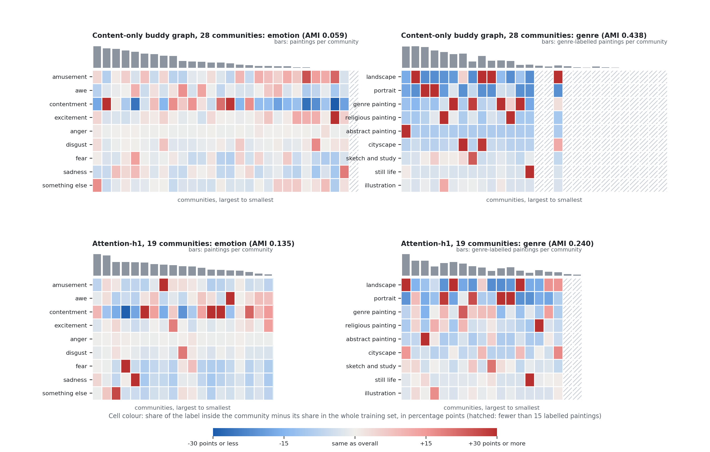

*Figure 4. What the communities contain, on the training paintings. Each column is one community, largest first; the grey bars give its size. A cell's colour is the label's share inside the community minus its share in the whole training set, in percentage points. Top: the content-only buddy graph, with near-pure genre columns and a flat emotion panel. Bottom: Attention-h1, with more emotion structure and less, but still clear, genre structure.*

Figure 4 shows the trade the student made, and one number per panel summarises it. Take each community's most common label, note its share inside the community, and average over communities weighted by size. For emotion this is 0.383 in the content-only graph, hardly above the 0.361 that contentment alone reaches over all paintings, and 0.468 for Attention-h1, where single communities now gather fear, sadness, awe or amusement. For genre it falls from 0.698 to 0.511 (the most common genre overall has 0.218), so genre structure weakens but stays far from random; landscape, portrait, religious painting, abstract painting and still life still have communities of their own. This matches the AMI change: emotion from 0.059 to 0.135 on training paintings, genre from 0.438 to 0.240.

### 2.6 Where the two lines stood on 24 September

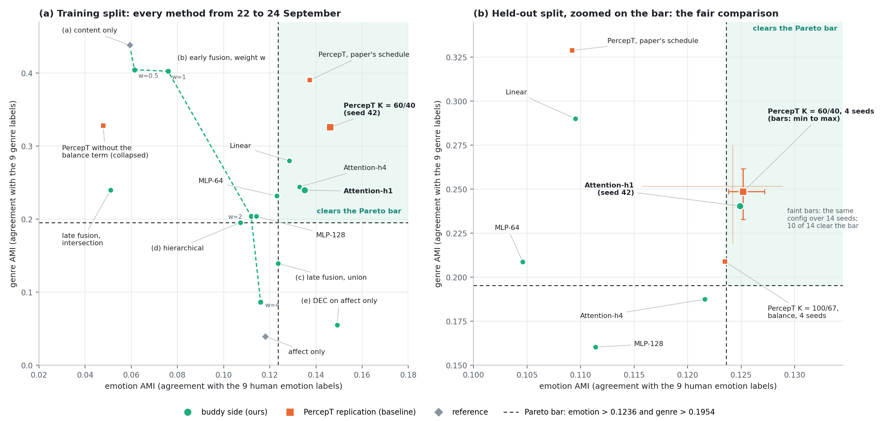

*Figure 5. Emotion AMI against genre AMI. (a) Training split, every method from §2.4 and §2.5 with PercepT on the same paintings. (b) Held-out split, zoomed on the bar. PercepT's standing config is shown over 4 seeds (solid bars) and 14 seeds (faint bars). Outside the zoomed view: PercepT without the balance term (0.036, 0.308), Linear with content weight 3 (0.063, 0.425), and the supervised emotion classifier (0.169, 0.014).*

Figure 5b is the comparison that counts. It supports three conclusions.

On held-out label agreement, the best buddy-side model and the PercepT baseline sit at the same point. Attention-h1 is 0.0003 lower on emotion and 0.008 lower on genre, and both gaps are smaller than PercepT's own spread across seeds (emotion 0.1157 to 0.1289, genre 0.2192 to 0.2750 over 14 seeds). Neither method is ahead on this measure.

The buddy side got there without an anti-collapse fix. PercepT reached the bar only with a balance term the paper does not have, and the paper's own schedule without it collapsed. Attention-h1 has no such term.

Both methods sit right at the emotion threshold and well below the supervised reference (0.169). Among the methods that keep genre above its threshold, held-out emotion AMI reached about 0.12 to 0.13 by either route, without labels.

Three things were still unknown on 24 September. Attention-h1 had one seed against PercepT's four. Its silhouette had never been compared with PercepT's. And it had never been run inside PercepT's two-stage pipeline, so there was no Stage 2 number. §3.1 fills all three gaps.

Because the last weekly report left it unclear, Table 5 lists which models in this report use a DEC loss.

*Table 5. Where DEC appears.*

| Model                                                                         | Uses a DEC loss?                                                          |
| ----------------------------------------------------------------------------- | ------------------------------------------------------------------------- |
| PercepT replication, every configuration                                      | yes: DEC and reconstruction, plus our balance term in the standing config |
| Buddy graph + Leiden, and the fusions (a) to (d)                              | no                                                                        |
| (e) DEC on the affect vectors, 22 Sep                                         | yes, on the 28-d affect vectors only; not carried forward                 |
| Learned students, including Attention-h1 and the first buddy model of §3.1    | no: InfoNCE on graph edges, then Leiden                                   |
| Six hybrids that attach a DEC loss to Attention-h1's embedding, 26 Sep (§3.2) | yes; all six failed                                                       |

*Sources: [affect investigation](../stage/2026-09-22_artelingo_affect_investigation.md) (§2.3, §2.4 b and e, supervised reference); [fusion-mechanism investigation](../stage/2026-09-22_artelingo_fusion_mechanism_investigation.md) (§2.4 c, d, CCA; §2.5 Linear, MLP-64, content weight); architecture sweep* `learned_student_arch_sweep_pilot_report.md` *(MLP-128, Attention-h4, Attention-h1); [PercepT Stage 1](../stage/2026-09-23_artelingo_percept_stage1.md) and [Stage 2](../stage/2026-09-23_artelingo_percept_stage2.md) stage reports; pilot reports* `percept_stage1_pilot_report.md`*,* `percept_stage1_extended_seed_pilot_report.md` *and* `percept_stage1_faithful_recipe_pilot_report.md` *in [auto/percept/pilots/20260922_percept_topic_pipeline](../auto/percept/pilots/20260922_percept_topic_pipeline/). Figure 4 is computed from* `painting_community_table.json` *and* `attention_h1_embedding_snapshot.npz` *on branch* `experiment/percept_topic_pipeline`*; its AMIs reproduce the reported 0.0593 / 0.4384 and 0.1351 / 0.2397 exactly.*

## 3 The buddy model inside PercepT's pipeline, 25 to 30 September

### 3.1 The first buddy model: a buddy graph in place of PercepT's autoencoder and DEC

#### Why we tried it

By 24 September, Attention-h1 matched PercepT's standing config on held-out label agreement (§2.6), but only as a stand-alone clustering on one seed. The work in this section ran from the night of 25 September to the early hours of 27 September. It asked whether the buddy graph plus the Attention-h1 student can take over Stage 1 from PercepT's autoencoder and DEC, with Stage 2 left exactly as it is.

We expected it might, for one reason. Both methods start from the same neighbourhood information (which paintings resemble which), but the buddy model uses it directly as a training signal, while DEC has to rediscover it by sharpening its own guesses. §2.2 showed where that leads on our data: without the balance term DEC collapsed. A method that never self-sharpens should not need the term.

#### What the model looks like

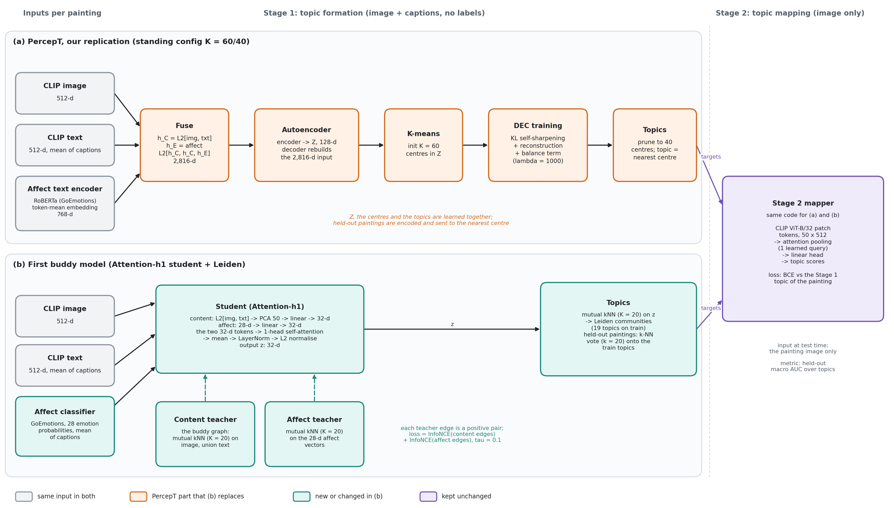

*Figure 6. Stage 1 and Stage 2 in our PercepT replication (a) and in the first buddy model (b). Grey inputs are identical in both. Orange boxes are the PercepT components that (b) removes; teal boxes are what (b) puts in their place. The Stage 2 mapper (purple) is the same code in both, so any Stage 2 difference comes from the topics it is trained on.*

Both pipelines see the same things for each painting: its CLIP image feature, the mean CLIP text feature of its captions, and the captions read by the same GoEmotions RoBERTa. PercepT takes that model's 768-d internal embedding. The buddy model takes its 28 output probabilities, averaged over the painting's captions, because that is the affect input the fusion study had validated (§2.4).

In the buddy model (Figure 6b) there is no autoencoder and no cluster centre. The two teacher graphs are built once, before training. The student is Attention-h1 as described in §2.5, and Leiden on a neighbour graph of z produces the topics. Leiden found 19 topics on the training paintings; we did not set this number. Table 6 lists the differences one by one.

*Table 6. Stage 1 in PercepT and in the first buddy model.*

|                               | PercepT (our replication)                                     | First buddy model                                                                                 |
| ----------------------------- | ------------------------------------------------------------- | ------------------------------------------------------------------------------------------------- |
| Learned space                 | Z, 128-d, from an autoencoder                                 | z, 32-d, from the Attention-h1 student                                                            |
| Training signal               | rebuild the input, plus DEC sharpening, plus our balance term | keep teacher-graph neighbours close (two InfoNCE losses)                                          |
| Affect input                  | 768-d RoBERTa embedding                                       | 28 GoEmotions probabilities from the same model                                                   |
| Number of topics              | chosen by us: 60 centres, pruned to 40                        | found by Leiden: 19                                                                               |
| Guard against collapse        | balance term, λ = 1000                                        | none                                                                                              |
| Topic for a held-out painting | nearest centre                                                | independent Leiden run on held-out data at first; k-NN vote onto train topics after the fix below |
| Stage 2                       | attention-pooling mapper over 50 CLIP patch tokens            | the same mapper, unchanged                                                                        |

#### What we measured

The data, split, labels, measures and Pareto bar are those of §2.1. Three things are new. We repeated Attention-h1 over the four seeds PercepT had been tested on. We compared silhouette on identical samples. And we trained PercepT's Stage 2 mapper on the buddy topics.

#### Results

*Table 7. Stage 1 on the 9,365 held-out paintings. PercepT rows are the baseline from §2.2; buddy rows are new.*

| Stage 1 method                                              | Emotion AMI | Genre AMI | Silhouette   | Seeds clearing the bar | Needs a balance term |
| ----------------------------------------------------------- | ----------- | --------- | ------------ | ---------------------- | -------------------- |
| PercepT, standing config (K = 60/40, λ = 1000), 4-seed mean | 0.1252      | 0.2486    | not measured | 4 / 4                  | yes                  |
| PercepT, paper's schedule (K = 100/67), seed 42             | 0.1092      | 0.3288    | 0.5120       | 0 / 1                  | no, but collapsed    |
| Buddy model, Leiden re-run on held-out data, 4-seed mean    | 0.1241      | 0.2406    | 0.0397       | 3 / 4                  | no                   |
| Buddy model, same, seed 42                                  | 0.1249      | 0.2404    |              | 1 / 1                  | no                   |
| Buddy model, k-NN vote onto train topics, seed 42           | 0.1364      | 0.2530    |              | 1 / 1                  | no                   |

The seed test confirmed §2.6. The buddy model's four-seed means are 0.001 below the baseline on emotion and 0.008 below on genre, it clears the bar in three seeds of four against PercepT's four of four, and its per-seed range is narrow (emotion 0.1213 to 0.1264, genre 0.2289 to 0.2544). It needs no balance term to get there.

We hit two problems along the way.

The first one was structural. Leiden labels only the nodes of the graph it is given, so it cannot place a new painting into an existing community. Our first held-out numbers therefore came from a separate Leiden run on a held-out graph. That is fine for AMI, but the held-out topics then have nothing to do with the training topics, and Stage 2 needs a single topic vocabulary shared by training and evaluation. We fixed it with a k-NN vote: a held-out painting takes the most common topic among its 20 nearest training paintings in z (the same K the buddy graph uses). This did not cost accuracy. At seed 42 both AMIs went up (emotion from 0.1249 to 0.1364, genre from 0.2404 to 0.2530), and every held-out painting now carries a label from the 19 training topics. (§3.6 shows that part of this rise comes from the vote itself, which reads higher than an independent re-clustering; the two ways of scoring must not be mixed.)

The second problem was silhouette, where PercepT's paper schedule scored 0.51 and the buddy model 0.04. The two numbers came from different spaces and samples, so we re-scored both on the same 6,000 held-out paintings with the same code. The gap held (0.4973 against 0.0416). Figure 7 shows how differently the two sets of topics fill up on held-out data.

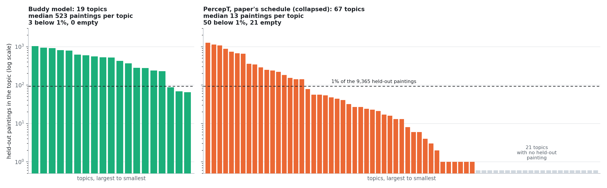

*Figure 7. Held-out paintings per topic, largest topic first, log scale. The dashed line marks 1% of the 9,365 held-out paintings. Buddy topics come from the k-NN vote; PercepT topics are nearest surviving centres of the paper-schedule run. Recomputed from the saved snapshots; the counts match the audit report.*

The buddy model's 19 topics are all used (median 523 paintings, 3 under 1%). PercepT's 67 are not: 21 receive no held-out painting at all, 50 hold under 1%, and the median topic holds 13 paintings. The 17 topics above 1% hold 93% of the held-out paintings, and the largest 7 hold 69%. §2.2 already showed that such a partition scores a high silhouette: the fully collapsed run reached 0.855. So silhouette and label agreement disagree about which Stage 1 is better, and at this point we could not tell which of the two matters more for Stage 2.

The last step was to plug the buddy topics into Stage 2. We trained PercepT's unchanged mapper on the 19 buddy topics, with single-label targets, learning rate 1e-3 and 100 epochs. That is the setting of PercepT's own single-label Stage 2 run (0.5690, §2.2), so this was the matched comparison at the time. The buddy topics reached a held-out macro AUC of 0.5978: 0.098 above guessing and 0.029 above PercepT. By the early hours of 27 September the buddy model looked like a working replacement for PercepT's Stage 1, level on Stage 1 labels, behind on silhouette and slightly ahead end to end.

That end-to-end lead did not hold, and the warning sign was already in PercepT's own Stage 2 results: with multi-label targets, changing only the learning rate had moved its AUC from 0.6894 to 0.8256. Neither 0.5978 nor 0.5690 was close to what the mapper can do. The next sections follow what happened. We made six attempts to borrow DEC's sharpening to close the silhouette gap (§3.2). An independent review found two bugs in our PercepT code, which moved the Stage 2 comparison to a near tie (§3.3). Last, once both mappers were tuned, PercepT pulled ahead, 0.9226 against 0.8534 (§3.4).

*Sources: [master report, §1 to §3 and §6a](../auto/percept/2026-09-26_artelingo_buddy_vs_percept_stage1.md); [PercepT Stage 2 stage report](../stage/2026-09-23_artelingo_percept_stage2.md) (0.5690, 0.6894, 0.8256); pilot code in* `src/test/20260923_artelingo_buddy_analysis/` *on branch* `experiment/percept_topic_pipeline` *(*`run_learned_student_arch_sweep_pilot.py` *for the student,* `run_attention_h1_baseline_seed_stress_pilot.py` *for the seed test,* `run_heldout_label_transfer_pilot.py` *for the k-NN vote,* `run_buddy_percept_matched_silhouette_audit_pilot.py` *for the silhouette audit,* `run_buddy_stage2_pilot.py` *for Stage 2). Figure 7 is computed from* `attention_h1_embedding_snapshot.npz` *and* `percept_stage1_faithful_recipe_snapshot.npz` *by* `docs/reports/assets/prep_2026-09-30_weekly_figure_data.py`*.*

### 3.2 Six attempts to borrow DEC's sharpening, and why none worked (24 to 28 September)

#### Why we tried it

PercepT's silhouette lead comes from DEC, the one mechanism the buddy model does not have (Table 5). If a DEC-style loss were added on top of Attention-h1's embedding, the buddy topics might become as well separated as PercepT's while keeping their label agreement and their even occupancy. The first four attempts ran on 26 September before the matched audit of §3.1 and were motivated by the unmatched gap (0.0392 against 0.5120); the last two ran after it.

Two cheaper changes came first. A third InfoNCE loss that treats same-community pairs as positives (24 September) raised silhouette from 0.039 to 0.088 at seed 42, but emotion AMI fell to 0.1165, below the bar. Porting PercepT's cosine learning-rate schedule (26 September) was the one change that cost nothing: over four paired seeds silhouette rose in every seed (by 0.0069 on average), emotion by 0.0036 and genre moved by -0.0010, and the seed count clearing the bar stayed at three of four. Combining the two gave the best genre AMI of any buddy variant (0.3011, four-seed mean) but missed the emotion threshold in every seed (mean 0.1160).

#### The six attempts

Figure 8 puts every attempt next to the buddy baseline and next to PercepT, on all three measures. Each attempt was screened at seed 42 over three loss weights and then run over four seeds, unless marked otherwise.

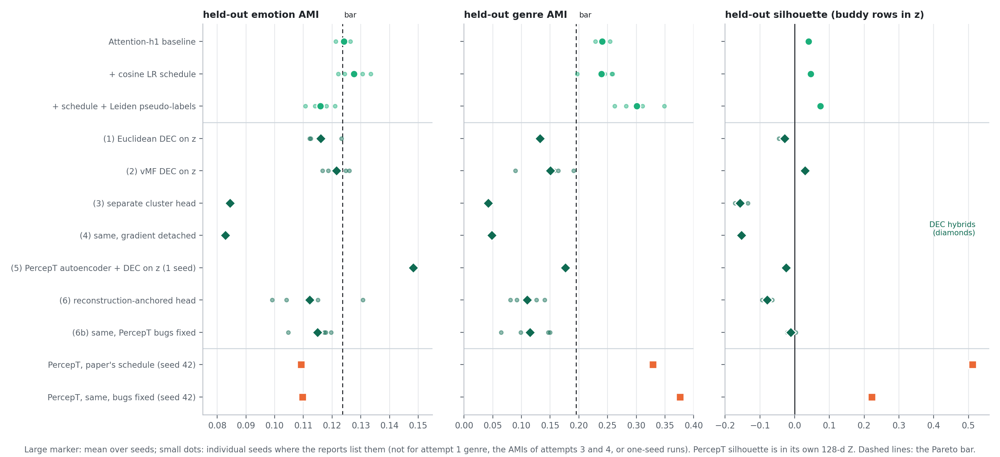

*Figure 8. Held-out emotion AMI, genre AMI and silhouette for the buddy variants (green circles, top), the six DEC hybrids (diamonds, middle) and PercepT (orange squares, bottom). Large markers are means; small dots are the individual seeds where the reports list them. Silhouette is measured in the buddy embedding z for every buddy row, and in PercepT's own 128-d space for the PercepT rows.*

Each attempt was designed to answer the failure of the one before it:

1. Euclidean DEC on z. PercepT's own clustering loss, applied directly to the 32-d student embedding. Silhouette turned negative in all four seeds (mean -0.029) and both AMIs fell (0.116 and 0.132). At seed 42 the starting K-means partition scored +0.052, so DEC training itself drove separation down. Our diagnosis was geometry: z lives on a unit sphere, while DEC's kernel assumes an unconstrained Euclidean space.
2. vMF DEC. The same loss with a cosine kernel that matches the sphere. Silhouette became positive in all four seeds (0.030), which supported the geometry diagnosis, but it stayed below the plain baseline (0.040) and neither AMI cleared the bar in any seed.
3. A separate cluster head. A small MLP maps z into an unconstrained space where Euclidean DEC runs as in PercepT. This was the worst result so far: silhouette -0.157, genre AMI 0.042, collapse in all four seeds. We blamed the DEC gradient flowing back into the student.
4. The same head with its input detached, so that DEC can no longer touch the student. Silhouette stayed at -0.153 and the head's own space reached only 0.002, which falsified the gradient-leak diagnosis. The new diagnosis was that DEC alone has nothing to anchor it, and PercepT's anchor is reconstruction.
5. PercepT's full autoencoder and DEC, fed the frozen buddy embedding instead of its 2,816-d input (one seed). Emotion AMI was high (0.148) but genre missed the bar (0.177) and 44 of 67 topics received no held-out painting. The partition scored 0.49 silhouette in PercepT's latent space and -0.025 back in z. The 128-d latent is four times wider than its 32-d input, so the decoder can rebuild the input without the encoder separating anything.
6. A reconstruction-anchored head that is narrower than its input (32 to 16 dimensions) and rebuilds the same 32-d vector. It controlled for every failure above and still failed: silhouette -0.079, both AMIs about 0.11, no seed clears the bar.

After the bug fixes of §3.3 we re-ran attempt 6 with the correct pruning and loss scale (6b, 28 September). Silhouette improved from -0.079 to -0.012 and both AMIs rose slightly, but still no seed cleared the bar. Attempts 1 to 5 were not re-run with the fixes.

Across six mechanisms the pattern is the same: whenever a DEC loss shapes the buddy embedding, separation and label agreement go down together. We closed this direction. Two more capacity-style checks point the same way. Widening the student from 32 to 64 and 128 dimensions raised genre AMI (0.29, 0.33) and effective rank (20 to 46), but lowered emotion AMI (0.115, 0.109) and silhouette (0.037, 0.025). And a softer Stage 2 target (vote fractions instead of one topic) changed nothing downstream.

#### Does the silhouette gap matter downstream?

If PercepT's well-separated but uneven topics were more useful, a classifier that goes through them should predict human labels better. We tested that directly. For each system we trained the same image-only mapper to predict its topics, fed its held-out topic probabilities to the same logistic regression, and predicted the human labels (emotion on a 50/50 split of the held-out paintings, genre by 5-fold cross-validation over the 159 labelled ones). A raw feature control (the mean of the 50 patch tokens) sets the ceiling.

*Table 8. Downstream probe, one seed, one split. Percentages are the share of the raw-feature control's AMI that each topic bottleneck keeps.*

| Features fed to the probe           | Emotion AMI             | Genre AMI    |
| ----------------------------------- | ----------------------- | ------------ |
| Buddy topics (19)                   | 0.0231 (34% of control) | 0.2625 (77%) |
| PercepT topics (67, paper schedule) | 0.0221 (32%)            | 0.2973 (87%) |
| Raw patch features (control)        | 0.0685                  | 0.3399       |

The twelve-fold silhouette gap turns into a genre edge of 0.035 AMI for PercepT and a tie on emotion. Both topic bottlenecks lose about two thirds of the emotion signal that the raw features carry. So neither silhouette nor occupancy decides usefulness here; the one real downstream difference is a small genre advantage for PercepT. (The PercepT arm used the code before the bug fixes of §3.3 and was not re-run.)

*Sources: [master report §4, §6](../auto/percept/2026-09-26_artelingo_buddy_vs_percept_stage1.md); [silhouette-gap brainstorm](../auto/percept/2026-09-26_buddy_silhouette_gap_brainstorm.md); pilot reports* `attention_h1_{noise_schedule, leiden_pseudo_contrastive, dec_hybrid, vmf_dec_hybrid, decoupled_cluster_head, decoupled_cluster_head_detached}_pilot_report.md`*,* `percept_on_buddy_embedding_pilot_report.md`*,* `reconstruction_anchored_cluster_head_pilot_report.md`*,* `dshared_capacity_sweep_pilot_report.md`*,* `buddy_percept_downstream_probe_pilot_report.md`*,* `soft_stage2_target_pilot_report.md` *in [pilots/20260923_artelingo_buddy_analysis](../auto/percept/pilots/20260923_artelingo_buddy_analysis/);* `reconstruction_anchored_cluster_head_fixed_pilot_report.md` *in [pilots/20260927_deep_stage_analysis](../auto/percept/pilots/20260927_deep_stage_analysis/).*

### 3.3 An independent review found two bugs in our PercepT baseline (27 September)

On 27 September we asked an outside reviewer (a separate model with no stake in the result) to audit both the PercepT code and our comparisons. We checked each of its findings against the paper and the code before acting on it. Table 9 lists the ones that matter.

*Table 9. Review findings and what we did with them.*

| Finding                                                                                                                                                             | Status                                                                                                          |
| ------------------------------------------------------------------------------------------------------------------------------------------------------------------- | --------------------------------------------------------------------------------------------------------------- |
| Centre pruning kept the 67 centres with the largest norm; the paper's Algorithm 1 discards large-norm centres as the unused ones                                    | verified against the paper; fixed                                                                               |
| Reconstruction used `mse_loss` with its default mean, which also divides by the 2,816 input dimensions, so the anchor was about 2,816 times weaker than the paper's | verified; fixed (sum over dimensions)                                                                           |
| Our Stage 2 comparison cited the 0.5690 run and left out PercepT's 14-seed 0.8290                                                                                   | partly accepted: 0.8290 uses multi-label targets and is not comparable to 0.5978, but it should have been shown |
| Captions were averaged per painting, which removes PercepT's per-caption targets                                                                                    | not addressed yet                                                                                               |
| The Pareto bar was set from buddy-side numbers; under the harmonic mean of the two AMIs the two systems tie                                                         | not adopted; see below                                                                                          |
| No train/held-out leakage, citations exact, seeds independent                                                                                                       | clean                                                                                                           |

With both bugs fixed, PercepT's numbers moved in both directions (Table 10). The loss balance changed as intended: at convergence the DEC loss is now 0.365 against a reconstruction loss of 0.140, where before it was 0.391 against 0.00008.

*Table 10. PercepT before and after the fixes (held-out, seed 42).*

| PercepT run                       | Emotion AMI | Genre AMI | Silhouette | Topics under 1% | Stage 2 macro AUC |
| --------------------------------- | ----------- | --------- | ---------- | --------------- | ----------------- |
| paper schedule, before            | 0.1092      | 0.3288    | 0.5120     | 50 of 67        |                   |
| paper schedule, fixed             | 0.1097      | 0.3764    | 0.2224     | 45 of 67        |                   |
| standing config K = 60/40, before | 0.1238      | 0.2617    |            | 7 of 40         | 0.5690            |
| standing config K = 60/40, fixed  | 0.1094      | 0.2798    |            | 11 of 40        | 0.5925            |

Three consequences follow for the comparison with the buddy model.

PercepT's silhouette lead shrank from 0.51 to 0.22 but did not disappear, and its genre AMI rose to 0.376, well above the buddy model's 0.24. The paper schedule is still collapsed and still misses the emotion threshold.

The Stage 2 comparison became a near tie: buddy 0.5978 against PercepT 0.5925, a margin of 0.005 instead of 0.029.

The baseline itself weakened. With the fixes, the standing config's seed-42 emotion AMI fell from 0.1238 to 0.1094, below the bar. Its "four of four seeds" was never re-tested with the fixed code, so on Stage 1 label agreement we can no longer say the corrected PercepT clears the bar at all; the buddy model does, in three of four seeds. That is a real point in the buddy model's favour, and it rests on one fixed PercepT seed.

The fairness point in the review deserves a number. The Pareto bar was built from buddy-side fusion results, so it could favour the buddy side. Scored instead by the harmonic mean of emotion and genre AMI, a neutral single number, the buddy model reaches 0.164, PercepT's standing config 0.167 and the fixed paper schedule 0.170 (our computation). By that yardstick the systems are within 0.006 of each other, and PercepT is slightly ahead because of its higher genre AMI.

*Sources: [independent review](../auto/percept/2026-09-27_agy_independent_percept_review.md); master report §6b;* `percept_stage1_faithful_recipe_fixed_pilot_report.md` *and* `percept_stage2_fixed_pilot_report.md` *in [pilots/20260922_percept_topic_pipeline](../auto/percept/pilots/20260922_percept_topic_pipeline/).*

### 3.4 Stage 2: a tuning race, and its reversal (27 to 28 September)

With the Stage 2 comparison at a near tie, we analysed where buddy's Stage 2 lost accuracy and fixed it step by step. Figure 9 follows the headline number through the evening of 27 September.

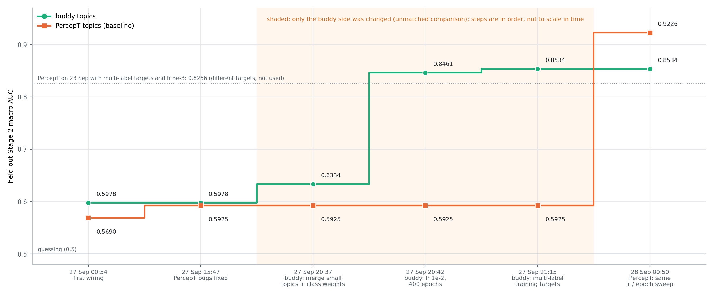

*Figure 9. The headline Stage 2 comparison over time (held-out macro AUC, single-label evaluation targets). Shaded steps changed only the buddy side, so the comparison was unmatched there. The last step gives PercepT's mapper the same tuning.*

The analysis found that buddy's per-topic AUC correlates with topic size (Pearson r = 0.53, p = 0.019, 19 topics): its three smallest topics (87, 69 and 65 held-out paintings) pull the average down. Three changes followed, each tested over four mapper seeds:

1. Merge the three smallest topics into their nearest neighbours (19 to 16 topics) and weight the loss by inverse topic frequency: 0.6334.
2. Tune the mapper's learning rate and epochs, which had never been touched: 1e-2 and 400 epochs gave 0.8461. The best point sits at the edge of the grid and was still rising.
3. Train on richer multi-label targets (every topic whose k-NN vote share is at least 0.15 of the painting's top share): 0.8534. The first run of this step scored each model against its own multi-label targets, which made every variant look worse than the baseline; a review caught the mismatch, and re-scoring against the same single-label targets gave the adopted number.

At that point buddy led PercepT's fixed 0.5925 by 0.26, but only the buddy mapper had been tuned. We flagged the asymmetry after each step and closed it on the night of 28 September: the same learning-rate and epoch sweep applied to PercepT's mapper reached 0.9226 over four seeds. The comparison reversed, 0.8534 against 0.9226, and the result is not an evaluation artefact (every PercepT topic has at least 36 held-out positives and the targets are single-label in both).

Two things keep this reversal from being the final word. First, the topic counts differ: 16 for buddy, 40 for PercepT. A K sweep on the frozen buddy embedding showed that macro AUC moves with the number of topics (K = 33: 0.857; K = 17: 0.841; K = 9: 0.883; K = 4: 0.908), rising steeply at small K, so AUC is only comparable at matched K. Second, only the mapper grid was matched; the training targets and Stage 1 were not. §3.6 describes the matched head-to-head built to settle it, and under it PercepT's lead does not hold.

One more lever was tested and failed. Up-weighting the affect teacher's loss (2, 4 and 8 times) lowered emotion AMI from 0.1306 to at most 0.1180 and destroyed genre AMI (0.035 or less), so equal weighting stays.

*Sources: master report §6c to §6h;* `deep_stage_analysis_report.md`*,* `candidate1_`**,* `candidate2_mapper_sweep_pilot_report.md`*,* `candidate3_k_sweep_pilot_report.md`*,* `candidate4_`**,* `candidate6_affect_upweight_pilot_report.md` *and* `percept_mapper_symmetric_sweep_pilot_report.md` *in [pilots/20260927_deep_stage_analysis](../auto/percept/pilots/20260927_deep_stage_analysis/).*

### 3.5 Does the recipe transfer? The RedCaps B1 pilot (27 September)

RedCaps (Reddit images with captions) is CoSiR's other main dataset. It has no emotion or genre labels, so the pilot used the subreddit as a stand-in label and measured "lift": how much more often a graph edge joins two items from the same subreddit than chance would predict. Only the content teacher can be built without labels, so B1 is a single-teacher student (image and text tokens, one attention head, trained on the RedCaps buddy graph with K = 30), on 120,000 training items with 15,000 for validation. The predeclared bar: the student must match every raw-feature control, and attention must beat plain averaging.

*Figure 10. (a) Subreddit lift of a kNN graph built on the validation embeddings. Grey bars need no training. (b) Number of Leiden communities on the teacher graph as the resolution is lowered, before and after linking isolated nodes.*

The pilot failed all three criteria. The trained student's validation graph reached a lift of 18.4, below raw CLIP image features (24.3) and raw image-plus-text features (27.1). Its communities were also degenerate: 304 of 326 held under 1% of the items.

Our first diagnosis was Leiden's resolution. A resolution sweep refuted it: lowering the resolution 200-fold moved the community count only from 1,423 to 1,397 (Figure 10b). The real cause was the graph. It has 1,397 connected components, 1,354 of them single nodes, and Leiden cannot merge across components. Linking every isolated node to its nearest neighbour fixed the fragmentation (71 communities for the graph-only arm, 46 for the student), but not the verdict: the student still did not beat raw CLIP. A last check confirmed that the subreddit is a noisy label. 64% of validation items have their nearest neighbour in a different subreddit, and near-duplicate subreddits exist (dogpictures and lookatmydog have centroid similarity 0.999).

On RedCaps, then, the content-only student adds nothing over the CLIP features it is trained from, a result §4.3 reproduces on ArtELingo. We stopped the RedCaps work there.

*Sources: [method-improvement brainstorm](../auto/percept/2026-09-27_method_improvement_and_redcaps_brainstorm.md); [B1 result and diagnosis](../auto/percept/2026-09-27_redcaps_b1_result_and_diagnosis.md); pilot reports in [pilots/20260927_redcaps_topic_formation](../auto/percept/pilots/20260927_redcaps_topic_formation/).*

### 3.6 A large joint sweep, a yardstick artefact, and the matched head-to-head (28 to 30 September)

#### The sweep

Instead of tuning one knob at a time, we searched Stage 1 and Stage 2 together. The sweep ran a Bayesian search over 20 hyperparameters (13 for Stage 1 and topic formation, 7 for the Stage 2 mapper), one seed per trial, on nine cluster GPUs for about 36 hours and 2,267 trials. Its objective was Stage 2 macro AUC, but only if the trial also cleared the Pareto bar; otherwise the trial scored -1. The ten best trials that merge small topics and end with at most 45 topics were then run over four seeds.

The sweep used a re-implemented harness rather than the pilot scripts, and a final review found it differs in ways that matter: the teacher graph is a single kNN graph on PCA-reduced features without the union and repair steps, the InfoNCE negatives are all training nodes instead of the batch, and the optimiser and stopping rule differ. It also measured the bar's two AMIs with the k-NN vote, with the vote size k itself tuned, while the bar was set with independent re-clustering.

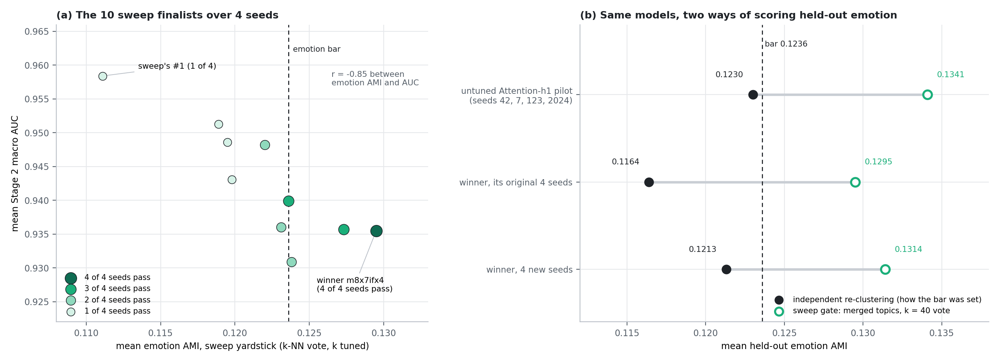

*Figure 11. (a) The ten sweep finalists over four seeds: mean emotion AMI on the sweep's own yardstick against mean Stage 2 AUC; darker and larger markers pass the gate in more seeds. (b) The winner and the untuned pilot, each scored both ways: independent re-clustering (black), the way the bar was set, and the sweep's merged topics with a k = 40 vote (green rings).*

The four-seed test exposed a winner's curse. Four of the sweep's six highest-ranked trials, including the top two, pass the gate in only one seed of four, and that one seed is always 42, the seed the sweep scored them on. Among the finalists, emotion AMI and AUC trade off (r = -0.85). One trial, `m8x7ifx4`, passed in all four seeds with AUC 0.9355 and 13 to 16 topics. It uses four attention heads and a 64-d embedding, so it is not the one-head Attention-h1.

A confirmation check on 30 September then scored the winner and the untuned pilot both ways (Figure 11b). On independent re-clustering the winner clears the emotion threshold in one of eight seeds (four original, four new), with mean 0.1189; the untuned pilot averages 0.1230. On the sweep's yardstick both read about 0.01 higher, and the gap between the two yardsticks is larger than any emotion difference between the models. The winner's four-of-four pass is therefore an artefact of the yardstick, and it is no better than the untuned pilot on emotion by either measure. Its real gains are genre AMI (about 0.30 against 0.24) and Stage 2 AUC (0.9376 on new seeds). The check found one more confound: the same pilot at seed 42 gives emotion 0.1187 and genre 0.2639 on the cluster GPUs, against 0.1249 and 0.2404 on the local GPU, so the pilot clears the bar in two of four seeds on the cluster instead of three. Every comparison since runs on the cluster only.

#### The matched head-to-head

The sweep could not answer the question that §3.4 left open, so we designed a matched comparison, approved in its main decisions by the user on the night of 30 September:

- one validated harness for both systems, each with its native inputs, at two matched topic counts (K = 16 and K = 40), giving four cells;
- the same Stage 2 search space for both, and an equal budget of 300 Bayesian trials per cell, each scored on two seeds;
- the held-out paintings split in half: a val half for selection (4,686 paintings) and a test half (4,679) touched once at the end (it was not used for selection here, but it belongs to the held-out set that §3.1 to §3.5 tuned on);
- selection by Stage 2 AUC on val, a four-seed stress test of each cell's top five, and five fresh test seeds for each winner.

Before launch, each port was checked against the original code. The buddy port reproduces the pilot bit for bit over four seeds; the PercepT port reproduces the fixed §3.4 result (tuned AUC 0.9258 against 0.9226); the shared Stage 2 reproduces both systems' saved results (0.8534 and 0.9226). The four sweeps ran from 04:40 to 20:58 on 30 September and finished all 1,200 trials.

*Figure 12. The matched head-to-head. (a, b) Every finished sweep trial: val-half Stage 2 AUC (mean of two search seeds) against independent emotion AMI on the val half. Filled green: buddy with the sweep-harness Stage 1; open green: buddy with the pilot-faithful Stage 1; orange: PercepT. Large stars and crosses mark the cell winners of the two selections. (c) The eight winners on the test half: mean AUC over five fresh seeds with its 95% interval, and mean emotion AMI below each marker.*

*Table 10b. The matched head-to-head on the test half (five seeds per winner). Differences are buddy minus PercepT, with Welch 95% intervals.*

| Selection | K | Buddy AUC | PercepT AUC (baseline) | Difference | Emotion AMI, buddy / PercepT |
|---|---:|---:|---:|---|---|
| plain AUC (approved protocol) | 16 | 0.9931 | 0.9664 | +0.027 [+0.014, +0.040] | 0.060 / 0.079 |
| plain AUC (approved protocol) | 40 | 0.9937 | 0.9604 | +0.033 [+0.025, +0.041] | 0.060 / 0.110 |
| emotion floor (secondary) | 16 | 0.9462 | 0.9435 | +0.003 [-0.013, +0.018] | 0.121 / 0.120 |
| emotion floor (secondary) | 40 | 0.9550 | 0.9598 | -0.005 [-0.013, +0.004] | 0.128 / 0.120 |

The approved selection ranks trials by val AUC alone. Under it buddy wins at both topic counts, on the val stress runs as well as on test (+0.025 and +0.030 on val), but it wins by giving up emotion: its winners keep emotion AMI 0.060 on test against PercepT's 0.079 and 0.110, and both use the sweep-harness Stage 1 with the affect loss weight at the bottom of its range (0.25). Topics like these are easy to predict from the image because they carry little emotion. Across all buddy trials AUC falls as emotion AMI rises (r = -0.70 at K = 16 and -0.74 at K = 40), while across PercepT's trials the two are nearly unrelated (r = -0.10 and -0.06).

Because the interim look showed that buddy's lead came with emotion AMI near 0.05, we added a secondary selection: only trials at or above a common emotion floor were eligible. The rule fixed the floor on val data before any test run (the largest value that still leaves ten trials in every cell, 0.1117), and the selection was otherwise the same as the primary one. Under it we detected no Stage 2 difference on either half (val +0.004 and +0.001, test +0.003 and -0.005). With five seeds this is not equivalence: the test intervals exclude a buddy advantage above about 0.018 (K = 16) or 0.004 (K = 40) and a PercepT advantage above about 0.013. At equal AUC, buddy's floor winners never showed less emotion than PercepT's: level on test (0.121 against 0.120, 0.128 against 0.120), about 0.02 higher on val. A genre difference that appeared on test (PercepT about 0.10 higher) did not replicate on val, so we do not claim it.

The pilot-faithful buddy, the model this report calls the first buddy model, was rarely drawn by the search (25 and 20 of 300 trials, of which 23 and 20 finished with a score). Its best val AUCs (0.952 at K = 16 and 0.940 at K = 40) trail PercepT's best (0.974 and 0.969), which came from about 300 trials each. Its trials sit at higher emotion AMI (medians 0.112 and 0.113) than PercepT's (0.094 and 0.098), and they supplied 8 of the 10 emotion-floor finalists; at K = 16 its best finalist showed no detectable difference from PercepT on val (0.9463 against 0.9438, difference +0.002 [-0.023, +0.028], four seeds). The search therefore covered buddy's high-emotion region thinly, and a search restricted to that region is still open.

*Sources: [matched head-to-head report](../auto/percept/2026-09-30_matched_percept_buddy_h2h.md) (revised after its final whole-branch review, which caught the unreplicated genre claim); master report [§6i to §6k](../auto/percept/2026-09-26_artelingo_buddy_vs_percept_stage1.md); its logs and summaries in [pilots/20260930_matched_h2h](../auto/percept/pilots/20260930_matched_h2h/) and [pilots/20260930_harness_confirmation](../auto/percept/pilots/20260930_harness_confirmation/); [sweep handoff](../auto/percept/2026-09-28_buddy_percept_sweep_handoff.md) and [sweep log](../auto/percept/pilots/20260928_buddy_percept_sweep/); spec* `docs/superpowers/specs/2026-09-30-matched-percept-buddy-h2h-design.md` *on branch* `experiment/percept_topic_pipeline`*. Figure 12 is drawn from the branch's* `src/test/20260930_matched_h2h/sweep_runs.json` *(final dump) and its test logs.*

### 3.7 Where the percept line stands

*Table 11. The buddy model against the PercepT baseline, on every measure this week produced.*

| Measure                                              | Buddy model                                                      | PercepT replication                                                    | Reading                                                                       |
| ---------------------------------------------------- | ---------------------------------------------------------------- | ---------------------------------------------------------------------- | ----------------------------------------------------------------------------- |
| Held-out label agreement, emotion / genre AMI        | 0.1241 / 0.2406, 3 of 4 seeds (local GPU; 2 of 4 on the cluster) | 0.1252 / 0.2486, 4 of 4 before the fix; fixed seed 42: 0.1094 / 0.2798 | level; the fixed baseline misses the emotion threshold at its one tested seed |
| Harmonic mean of the two AMIs                        | 0.164                                                            | 0.167 (standing), 0.170 (fixed paper schedule)                         | level, PercepT slightly ahead through genre                                   |
| Anti-collapse term needed                            | no                                                               | yes                                                                    | buddy ahead                                                                   |
| Held-out occupancy                                   | all 19 topics used                                               | 21 of 67 empty (before fix), 45 of 67 under 1% (after)                 | buddy ahead                                                                   |
| Silhouette                                           | 0.04                                                             | 0.50 before the fix, 0.22 after                                        | PercepT ahead                                                                 |
| Downstream genre probe (share of raw-feature signal) | 77%                                                              | 87% (before fix)                                                       | PercepT slightly ahead                                                        |
| Stage 2 AUC, same tuning, unmatched K                | 0.8534 at K = 16                                                 | 0.9226 at K = 40                                                       | superseded by the matched rows below                                          |
| Stage 2 AUC at matched K, plain AUC (test, K 16 / 40) | 0.9931 / 0.9937, emotion AMI 0.060                               | 0.9664 / 0.9604, emotion AMI 0.079 / 0.110                             | buddy ahead, but only by giving up emotion                                    |
| Stage 2 AUC at matched K, emotion floor 0.1117 (test) | 0.9462 / 0.9550, emotion AMI 0.121 / 0.128                       | 0.9435 / 0.9598, emotion AMI 0.120 / 0.120                             | no difference detected (95% intervals +-0.016 and +-0.009)                              |
| Stage 2 AUC, pilot-faithful buddy only (val, best trial) | 0.952 / 0.940 (23 and 20 scored trials)                      | 0.974 / 0.969 (about 300 trials each)                                  | PercepT ahead; the pilot-faithful buddy was searched far less                 |
| Transfer to RedCaps                                  | no gain over raw CLIP                                            | not tested                                                             | negative                                                                      |

The buddy model is a credible replacement for PercepT's Stage 1: it reaches the same label agreement with a simpler, collapse-free mechanism and uses all of its topics. It is not better on the metrics PercepT optimises. At matched topic counts, buddy wins Stage 2 AUC only with variants that give up emotion structure; at equal emotion we detected no Stage 2 difference. Whether either system is better for CoSiR depends on whether emotion structure or image predictability is the goal, which is the question §4 took up.

## 4 CoSiR v2, 28 to 30 September

*The v2 report files carry the plan's own date sequence in their names (2026-10-01 to 2026-10-14); all of this work was done between 28 September 22:44 and 30 September 08:20. Times below are commit times.*

### 4.1 Why we rebuilt

Until 27 September, CoSiR attached a small trainable vector to every training sample, initialised it from the buddy graph, and let a combiner mix it into the frozen CLIP image feature (Figure 13a). Eighteen numbered experiments had patched that design, and the training script had grown past a thousand lines of modes and regularisers that could not be removed without breaking older experiments. The last of them, Experiment 18, ended in a trade-off it never resolved: cluster separation rose to a silhouette of 0.55 to 0.70, while image-to-text R@1 fell to about 10.4, against about 17.8 for plain CLIP. A literature review listed four structural limits: a per-sample vector has no shared vocabulary, a condition predictor trained from the query alone creates a train/deploy mismatch, one small vector is an opaque explanation, and one pooled CLIP feature cannot pick out local evidence.

The percept line added a fifth. Topic classification, which is what Stage 1 plus Stage 2 does, is not CoSiR's target. CoSiR is closer to GeneCIS (arXiv 2306.07969): what counts as similar should change with a condition. The user set two differentiators from GeneCIS. The conditions should be discovered from the data, without a hand-designed taxonomy, and the similarity should link images and texts, where GeneCIS links images with images. A second review pointed out that a router computed from the query alone cannot express a condition that changes while the query stays fixed, and proposed learning a shared set of image-text factors and selecting factors from a few example pairs. On 28 September we decided to stop patching, strip the codebase to its data infrastructure (47,160 lines removed) and rebuild it block by block, validating each block before building the next.

### 4.2 The first v2 design

*Figure 13. CoSiR v2 as first designed on 28 September. (a) The old CoSiR, whose condition table, combiner and predictor v2 removes. (b) Block 1, the buddy model's Stage 1 rebuilt with only the content teacher; its Stage 2 topic mapper is not carried over. (c) Block 2, "Candidate A": shared factors, a condi*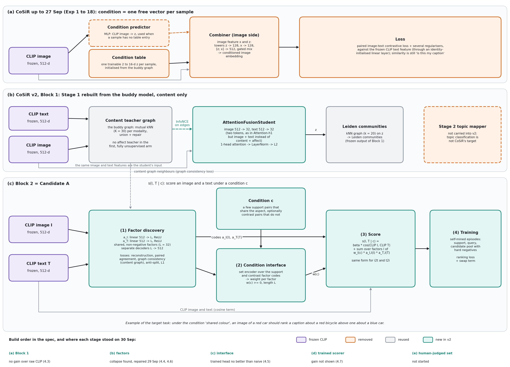*tion interface, a conditional score and self-mined training episodes. The strip at the bottom shows the planned build order and where each stage stood on 30 September.*

The target task is a score s(I, T | c) for an image I and a text T under a condition c. A condition is a handful of support pairs that share some aspect, optionally with contrast pairs that do not; for image-to-text retrieval the score ranks captions for a fixed image and condition, and for text-to-image the reverse. The design has four parts:

1. Factor discovery. Two linear encoders map the frozen CLIP image and text features into the same 32 non-negative factors, trained to rebuild the CLIP features, to give a pair's image and text similar factors, to respect the Block 1 graph neighbourhoods, and not to split into image-only and text-only halves.
2. Condition interface. A small set encoder reads which factors are active in the supports and not in the contrasts and outputs one weight per factor, w(c).
3. Score. s(I, T | c) = β · cos(CLIP image, CLIP text) + Σ over factors of w_l(c) · a_I,l(I) · a_T,l(T), the same form in both directions.
4. Training. Episodes mined automatically from the factor and graph structure (supports, a query and a candidate pool with hard negatives), trained with a ranking loss plus a swap term that asks the ranking to reverse when the condition changes. Mining conditions from the data itself stays within the "no hand-labelled conditions" constraint.

The build order was (a) Block 1, (b) factor discovery, (c) the condition interface, (d) the trained score and (e) a new human-judged evaluation set.

### 4.3 Block 1: the rebuilt Stage 1 is as good as raw CLIP, and no better

Block 1 rebuilt the buddy model's student with the content teacher only, as the fully unsupervised arm; the affect arm was planned second and was never built. Its two tokens are the CLIP image and text features rather than content and affect, and it runs on all 308,723 caption rows with a K = 30 buddy graph (3,130,544 edges). The matched baseline is the same Leiden clustering applied to the raw CLIP features.

*Figure 14. (a) In-sample emotion AMI of Leiden communities on raw features and on the trained Block 1 student, for four encoder pairs; numbers over the bars are the gains. (b) For CLIP, training 50 times longer does not move the student away from raw CLIP.*

The rebuilt student reached emotion AMI 0.0369 against 0.0358 for raw CLIP, a gain of 0.001. Training 10 and 50 times longer only moved it closer to raw CLIP (Figure 14b). The likely reason is circular: the teacher graph is a CLIP neighbour graph, so the student learns to restate CLIP. If so, a teacher graph from other encoders should leave the student more room. Replacing both encoders (DINOv2, SigLIP or a supervised ViT for images, e5 for text) widened the gain in every case, up to +0.021 with the supervised ViT (Figure 14a), which supports the diagnosis without proving it, since text and image encoders changed together. We kept CLIP for the factor work. Two facts qualify every number here: they are in-sample, on caption rows rather than paintings, and without the affect teacher that Attention-h1 had. So Block 1 is not comparable with Attention-h1's 0.124, and its pre-registered held-out checks were never run.

Block 1's output also turned out to feed nothing downstream: the factor layer of Candidate A was trained on the raw CLIP features, and only the Block 1 graph entered its loss.

### 4.4 Factor discovery: the first checks said "fixed"

The factor encoders were trained with five losses at once (reconstruction, pair agreement as the cosine between a pair's image and text codes, graph consistency, a small L1 sparsity term and an anti-split term). The first run on 29 September at 00:00 had no dead factors and one modality-private factor, but two of its 32 factors carried 87.7% of all activation mass. Nothing in the loss targeted that failure.

Three fixes followed in five hours, each against the one before:

*Table 12. Fixing the concentration of mass (all rows are in-sample).*

| Run    | Change                                             | Top-2 mass | Factors spanning communities | Reconstruction error (relative L2, image / text) |
| ------ | -------------------------------------------------- | ---------- | ---------------------------- | ------------------------------------------------ |
| Task 3 | first run                                          | 87.7%      | 59%                          | 0.554 / 0.510                                    |
| Task 4 | + usage-balance loss + PCA whitening of the inputs | 8.7%       | 78%                          | 0.993 / 0.993 (against whitened targets)         |
| Task 5 | whitening kept to 99% of variance (433 components) | 7.8%       | 97%                          | 0.991 / 0.992                                    |
| Task 6 | usage-balance loss only, no whitening              | 7.9%       | 100%                         | 0.561 / 0.515                                    |

Task 4 changed two things at once and destroyed reconstruction; Task 5 showed that whitening itself was the problem; Task 6 isolated the usage-balance loss and kept reconstruction. By every check we had defined, Task 6 fixed the factors. That recipe, later called R0, became the input to everything in §4.5.

### 4.5 The condition interface, and a chain of diagnostics that pointed back at the factors

#### Recovery, confusion and balance (29 September, 06:00 to 11:30)

The first condition interface was a set encoder with 82 parameters: for each factor it reads the mean support code, the mean contrast code and a flag, and one small shared MLP turns these into the factor's weight. It was trained to recover which factor an episode was mined from. It recovered the right factor in 22% of held episodes (chance 3%), but 19 of 32 factors were never recovered at all. A confusion analysis showed why: five factors absorbed 69% of all predictions whatever the true target was. A class-balanced retrain changed almost nothing (23%, still 16 factors never predicted), and a separability analysis found no factor-level statistic that explained which factors were dead. In hindsight the raw cosines between the factors' columns were already 0.995 to 0.9999, the signature of the collapse found later that day, but at the time we did not read them that way.

#### Ranking instead of recovery (12:11 to 19:43)

An outside review then pointed out that no step had measured what the interface is for: ranking candidates under a condition. We built that test on mined episodes, each with 13 candidates (chance 7.7% R@1), and compared four weightings: the trained head, a naive rule with no parameters (the support mean minus the contrast mean, clipped at zero), uniform weights that ignore the condition, and CLIP alone.

The first numbers were striking (naive rule 57.6% i2t R@1 against uniform 40.2%) and misleading. The trained head's weights were a thousand times larger than the naive rule's, so each weighting balanced the CLIP term differently. Once every weighting was normalised to sum to one and each was given its own best CLIP weight β, the naive rule's lead over uniform shrank to +3.6 [+1.7, +5.6] R@1 points (i2t) and +3.2 [+1.2, +5.3] (t2i). The trained head was indistinguishable from the same head given the wrong condition, and it reversed a ranking correctly in 0 of 61 condition swaps, against 13 and 15 for the naive rule. Figure 17a in §4.6 shows the scale-fair numbers.

The failure lay in the training objective, not the head. A head fitted to reproduce the naive rule reproduced its ranking exactly; a head trained from scratch with a ranking loss reached 56.1 and 53.5 R@1 and reversed 41 and 44 of the 61 swaps. The same analysis found the deeper problem: 374 of the 496 factor pairs correlated at |r| ≥ 0.9, and the first principal component held 89% of the variance. The factors were copies of one axis.

#### The code review (committed 20:50)

A full code review that evening confirmed it with the right number. The participation ratio, which counts how many dimensions carry the variance, was 1.32 for image codes and 1.33 for text codes, against about 40 for the CLIP features themselves. The four checks that had passed Task 6 all measure how activation is spread across factors, and 32 copies of one axis spread evenly pass them all. The review found a second problem: the row split used since the ranking test separated captions, not paintings, so 99.5% of held-out rows had their exact image in the training set. We stopped before stage (d) and planned a repair.

### 4.6 The collapse, its cause, and the repair (29 September, 20:47 to 23:41)

The repair plan added nine pass/fail gates on the factor geometry, including participation ratio of at least 8, no factor pair above |r| = 0.9, a readout check that the codes keep CLIP's information, a sparsity cap, and a pair-retrieval check. It also moved everything to a painting-grouped split (216,107 / 30,872 / 61,744 rows for train, validation and held; every exact-key leakage count is 0).

*Figure 15. (a, b) Correlations between the 32 factors for the collapsed R0 recipe and the repaired R3. (c) Share of variance per principal component; R0 puts 89% in the first. (d) Removing one loss term at a time from R0: only removing the cosine agreement term lifts the participation ratio above the gate.*

A one-change-at-a-time diagnosis named the cause (Figure 15d). With reconstruction alone the codes are not collapsed (participation ratio 3.2), so the added losses cause it. Removing the cosine agreement term alone lifts the ratio to 17.1 and passes 8 of 9 gates; every other single change to R0 leaves it between 1.2 and 1.6. The mechanism is simple once seen: for non-negative codes, the cheapest way to make every pair's image and text codes point the same way is to make every item point the same way. The usage-balance term did not cause the collapse; it kept 32 copies of the one axis alive.

The repair grid tried nine recipes (Figure 16). Replacing cosine agreement with InfoNCE, where a pair's codes must match each other better than they match other items in the batch, fixes the geometry; a decorrelation penalty adds a little.

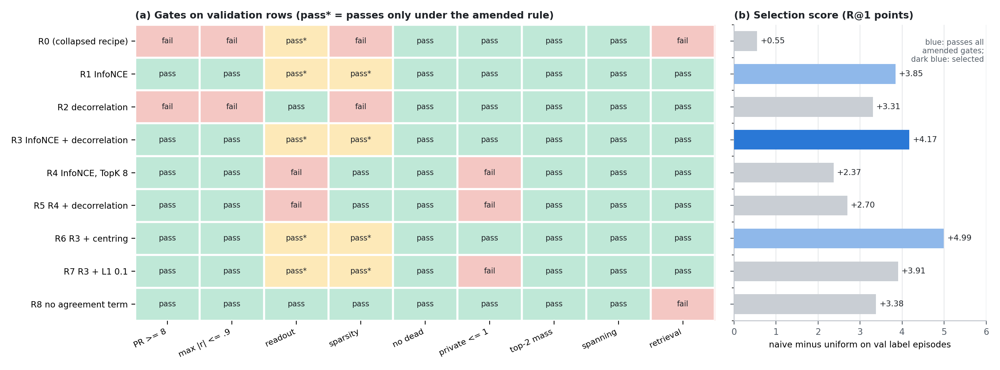

*Figure 16. (a) The nine gates for each recipe on validation rows. "pass*" marks a gate passed only under the rule as amended after the stop. (b) The selection score: how much the naive rule beats uniform weights on validation human-label episodes, in R@1 points.*

Under the gates as pre-registered, no recipe passed all nine, and the plan required a stop. The binding gates were the text-side readout floor, which the best InfoNCE recipes missed by 0.015 to 0.016 and the collapsed R0 recipe itself had never met, and the sparsity cap, which they missed at 44 to 49% active codes against 37.5%. The user amended both after seeing the validation results only: the readout must be no worse than R0's, and the sparsity cap became 50%. Three recipes then passed all nine. R6 scored highest (+4.99), R3 was within the pre-registered one-point tie band (+4.17), and the tie-break on readout chose R3 (InfoNCE plus decorrelation) by 0.0012. Seeds 43 and 44 passed all nine amended gates too (+3.71 and +4.28), and on held rows R3's participation ratio is 21.8 / 20.7 with no factor pair above |r| = 0.46. The amendment is a real caveat: the repaired claim rests on participation ratio, redundancy and retrieval, which R3 passes under the original thresholds, while its sparsity passes the new cap by only 1.3 points.

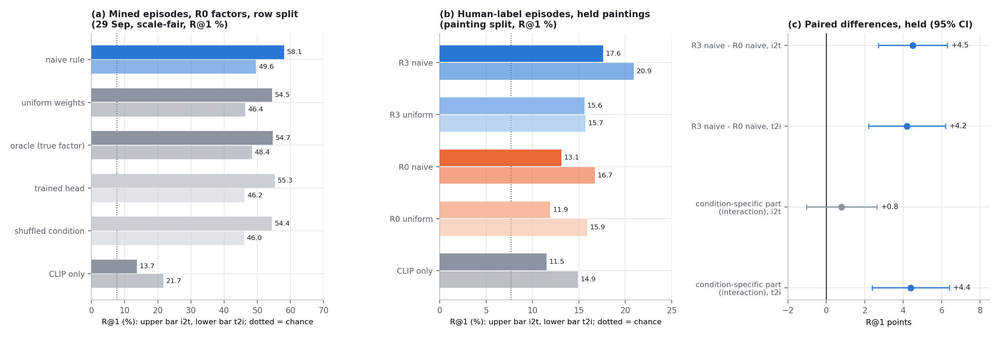

*Figure 17. (a) The 29 September ranking test on mined episodes with the collapsed factors, after scale-fair normalisation. (b) The pre-registered held test on human-label episodes with the repaired R3 and the collapsed R0 factors, on the painting-grouped split. (c) Paired differences with 95% bootstrap intervals; the interaction row is the part of R3's gain that depends on the condition.*

The held test then asked whether repaired factors use human conditions better (Figure 17b, c). Each episode takes an anchor painting, one positive and four supports that share its emotion or art style, four contrasts and twelve random negatives that do not carry the label at all; the episodes are identical for every model, so every difference is paired. R3 with the naive rule beats R0 with the naive rule by +4.5 [+2.7, +6.3] R@1 points in i2t and +4.2 [+2.2, +6.2] in t2i, and beats CLIP alone by +6.1 and +6.0. But part of that gain would appear even without a condition, since R3 with uniform weights also beats R0 with uniform weights in i2t (+3.8). The condition-specific part, the interaction (R3 naive − R3 uniform) − (R0 naive − R0 uniform), is +4.39 [+2.39, +6.40] in t2i and +0.78 [−1.03, +2.64] in i2t. Using the condition better than the collapsed factors is therefore shown in t2i only; in i2t, 83% of R3's gain does not depend on the condition. The pre-registered primary criterion (R3 naive better than R0 naive) was met. The swap criterion was formally not met, but it carries no information, because R0 had only 9 valid swap pairs against R3's 256.

### 4.7 Stage (d): training the scorer on frozen R3 factors (30 September, 02:53 to 05:00)

#### What was trained

Stage (d) asked whether a trained scorer uses the condition better than the naive rule, on the frozen R3 factors. To make that a clean question, the scorer starts as the naive rule exactly and can change only two things: a correction to each factor's gap, computed by one tiny MLP shared by all 32 factors, and the CLIP weight β. It has 403 parameters (Figure 18).

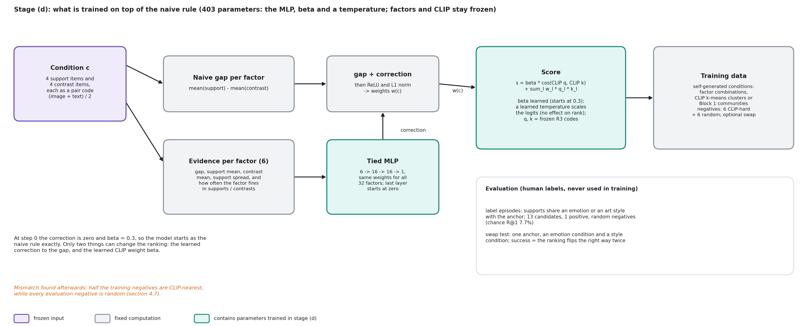

*Figure 18. The stage (d) scorer. Grey is the naive rule; teal is what training can change. The factors and CLIP stay frozen.*

Training used only self-generated conditions, from three sources: random combinations of R3 factors, k-means clusters of the CLIP features, and Block 1 communities. Each training episode had four positives, six CLIP-nearest hard negatives and six random negatives. Five runs (G1 to G5, with and without the swap term) were compared on a fresh 15% selection split carved out of the training paintings, because the validation split had already been used to choose R3. The criteria were pre-registered: the condition-use gain Δ (how much more a model's R@1 drops when given the wrong condition, compared with the naive rule's drop) must have a 95% interval above zero in both directions on held paintings, and on a new human swap test (same anchor, an emotion condition and a style condition) the model must reverse the ranking correctly more often than the naive rule.

#### Selection

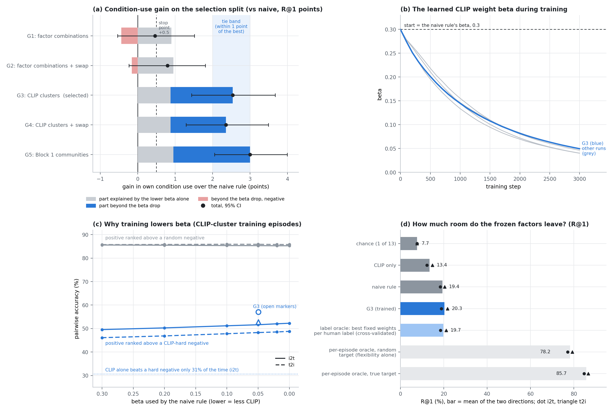

*Figure 19. Stage (d) on the selection split. (a) The condition-use gain of each run over the naive rule, split into the part that a lower β alone produces and the part beyond it. (b) β fell from 0.3 to about 0.05 in every run and was still falling. (c) Why: on training episodes, lowering β helps the positive beat CLIP-hard negatives, while it does nothing against random ones. (d) The room left by the frozen factors: a cross-validated oracle that picks the best fixed weights per human label is no better than the naive rule.*

Conditions from CLIP clusters (G3, +2.54 [+1.44, +3.67]) and Block 1 communities (G5, +3.00) beat the naive rule on the selection split; factor combinations did not transfer (G1, +0.46), and the swap term never helped. G5 scored highest, but G3 and G4 were inside the one-point tie band, and the pre-registered tie-break (no swap term, then the earlier run) chose G3.

The post-hoc analysis explains a third of the gain. Every run pushed β down, from 0.3 to about 0.05 (Figure 19b). The naive rule with β simply set to G3's 0.05 already gains +0.88 of G3's +2.54, and the rest (+1.66 [+0.55, +2.80]) is what the learned correction adds, mostly in t2i and for art style. The reason for the drop is a mismatch between training and evaluation (Figure 19c). Half of each training episode's negatives are the CLIP-nearest items, which CLIP alone ranks above the positive 65 to 71% of the time, so the loss rewards trusting CLIP less. The evaluation episodes use random negatives, where CLIP helps.

The oracle analysis (Figure 19d) set the ceiling. An oracle that fits the best weights to each episode reaches 85.7% R@1, but the same oracle fitted to a random wrong target still reaches 78.2%, so that ceiling measures flexibility and says nothing about the factors. The informative oracle picks one fixed weighting per human label, cross-validated. It reaches 18.4 / 21.0 R@1 against the naive rule's 18.4 / 20.4. With these factors frozen, no fixed per-label weighting beats the naive rule by a margin we can measure.

#### The held test

*Figure 20. The pre-registered held test. (a) Criterion 1, G3's condition-use gain over the naive rule on held paintings, for the judged seed and two replications, with the selection-split values as open markers. (b) Criterion 2, the human swap test on held paintings, and, on the selection split, the naive rule at G3's β.*

Criterion 1 was not met: G3's gain on held paintings is +0.83 [−1.12, +2.78] (i2t) and +1.61 [−0.54, +3.81] (t2i), and seeds 43 and 44 look the same. The test was underpowered: if the true gain equalled the selection-split value, the chance of both intervals clearing zero was about 0.38, and the held intervals contain the selection values. So the gain is not shown, which is different from shown to be absent.

Criterion 2 was met as pre-registered: G3 reverses the ranking correctly in 26.0% of held swap episodes against the naive rule's 19.6% (+6.4 [+4.2, +8.5]), in all three seeds. The post-hoc check removes the credit. On the selection split, the naive rule at G3's β reaches 25.1%, the same as G3 (G3 minus β-matched naive: +0.05 [−2.10, +2.20]). The swap-test pass comes from the lower CLIP weight, which any rule could have, and not from the trained correction.

### 4.8 Where v2 stands

The first v2 design survived as a structure and changed inside. Block 1 turned out to restate CLIP. The factor layer collapsed through one loss term, and its repair, R3, is the week's clearest v2 result: on held human-label episodes it beats the collapsed factors (+4.5 / +4.2 R@1) and plain CLIP (+6.1 / +6.0), with a condition-specific gain over the collapsed factors in t2i (+4.4). The trained condition interface did not add measurably to the naive rule, first because the recovery objective taught it nothing, then because the ranking-trained scorer's apparent gains came partly from lowering β. The label oracle points at the factors themselves as the limit. The human-judged evaluation set of stage (e) does not exist yet; everything above used human emotion and art-style labels as stand-in conditions.

Against its baselines, v2 as of 30 September improves on CLIP and on its own collapsed version, and ties the zero-parameter naive rule. On 30 September at 08:20 the user chose the next step: make the factors condition-aware during training, carrying forward the lessons of stage (d).

*Sources: [architecture rethink](../literature/2026-09-28_architecture_rethink_literature_brainstorm.md) and [GeneCIS synthesis](../auto/v2/2026-09-28_stage1_genecis_synthesis_brainstorm.md) brainstorms; spec* `docs/superpowers/specs/2026-09-28-cosir-v2-ground-up-redesign.md`*; [Block 1](../auto/v2/2026-09-28_block1_stage1_validation.md); [cross-encoder ablation](../auto/v2/2026-09-29_block1_cross_encoder_ablation.md); [factor discovery](../auto/v2/2026-09-28_candidate_a_factor_discovery_validation.md), [balance fix](../auto/v2/2026-09-29_candidate_a_factor_balance_fix.md), [reduced-rank whitening](../auto/v2/2026-09-30_candidate_a_reduced_rank_whitening.md), [usage balance](../auto/v2/2026-09-30_candidate_a_usage_balance_no_whitening.md); [condition interface](../auto/v2/2026-10-01_candidate_a_condition_interface_validation.md), [confusion](../auto/v2/2026-10-02_candidate_a_condition_confusion_diagnostic.md), [balanced retrain](../auto/v2/2026-10-03_candidate_a_condition_recovery_balanced_retrain.md), [separability](../auto/v2/2026-10-04_candidate_a_factor_separability_diagnostic.md), [ranking](../auto/v2/2026-10-05_candidate_a_condition_ranking_evaluation.md), [CLIP-only](../auto/v2/2026-10-06_candidate_a_clip_only_baseline.md), [naive-rule mechanism](../auto/v2/2026-10-07_candidate_a_naive_rule_mechanism.md); [code review](../auto/v2/2026-09-29_code_review.md); [collapse diagnosis](../auto/v2/2026-10-09_candidate_a_factor_collapse_diagnosis.md), [factor repair](../auto/v2/2026-10-11_candidate_a_factor_repair.md), [held evaluation](../auto/v2/2026-10-12_candidate_a_condition_eval_repaired_factors.md); [stage (d) selection](../auto/v2/2026-10-13_candidate_a_stage_d_selection.md) and [final test](../auto/v2/2026-10-14_candidate_a_stage_d_final.md); handoff* `docs/superpowers/handoffs/2026-09-30-candidate-a-factor-learning-handoff.md`*. Figures 15 to 20 are drawn from the result files under* `src/test/2026100`* *and* `src/test/2026101`* *(local, gitignored), copied into* `docs/reports/assets/2026-09-30_weekly/data/`*.*

## 5 Discussion

The percept line gave a clear answer to its first question. A buddy graph with a student trained by two teacher graphs forms topics that agree with human emotion and genre labels as well as our PercepT replication does, and it does so without the anti-collapse term that PercepT needed on our data and with every topic in use. That is enough to call the buddy model a working Stage 1. It is not enough for a publication claim that it beats PercepT, for three reasons that this week made concrete.

The comparisons were fragile in ways we did not expect. Our PercepT baseline carried two bugs for five days, and after the fix its standing config missed the emotion threshold at the one seed tested. The same code gives different AMIs on two kinds of GPU (0.1249 against 0.1187 at seed 42). Two ways of scoring held-out emotion differ by about 0.01, more than most of the differences between models. Macro AUC depends on the number of topics. A publishable comparison needs both systems in one validated harness, at matched topic counts, on the same hardware, with one scoring rule fixed in advance, which is what the matched head-to-head did. Under it PercepT's Stage 2 lead did not hold.

The Pareto bar favoured the buddy side. It was built from buddy-side fusion numbers, and under a neutral summary (the harmonic mean of the two AMIs) PercepT is marginally ahead because of its genre AMI. The buddy model's strength is balance and simplicity; its scores are level with PercepT's.

Stage 2 AUC rewards the wrong thing for CoSiR. In the head-to-head, the highest AUCs come from topics with almost no emotion structure, and across buddy trials AUC falls as emotion agreement rises (r = -0.70 and -0.74). A Stage 2 win would say that topics are easy to predict from the image, not that they capture conditions. This is one reason the project moved to v2.

For v2 the week's lesson is about measurement as much as modelling. Every early v2 check passed on a factor layer that had collapsed to one dimension, because the checks measured how activation was spread rather than how many dimensions carried it. The first ranking gain was a scale artefact; the first split leaked 99.5% of images; the first swap-test pass came from the CLIP weight. Each was caught by a review, a control or a diagnostic we added after a surprising number, and the reports record the corrections. The one post-hoc rule change (the amended gates) is stated where it applies, and the claims that depend on it are separated from those that do not.

What stands after these corrections is modest and solid: repaired factors improve human-label conditional retrieval over plain CLIP and over their collapsed version on held paintings, and, in t2i, they use the condition better. What does not stand yet is any benefit of training the condition interface.

## 6 Next steps

1. Finish the matched head-to-head. Done on the evening of 30 September (§3.6): under matched conditions PercepT's Stage 2 lead does not hold; buddy leads plain AUC only by giving up emotion, and at equal emotion we detected no difference.
2. Re-test the corrected PercepT standing config over seeds with the fixed code, so that the Stage 1 baseline in Table 11 rests on more than one seed.
3. Condition-aware factor learning (the user's decision this morning). Carry forward from stage (d): freeze β or pre-register the naive rule at the learned β as the baseline, match training negatives to evaluation negatives, size the test from selection-split variance, and use the cross-validated label oracle as the main diagnostic. Human labels stay evaluation-only; the held split has now been read twice, so a fresh evaluation set is needed.
4. Write the v2 publication plan, which replaces the archived conditional-buddies plan, with the claims this week can and cannot support.
5. Housekeeping: promote §6j, §6k and the head-to-head report to main. Done on 1 October with `scripts/promote_reports.py`; the head-to-head spec and plan remain on the percept branch.

## 7 Appendix: reproducing the figures

All figures are built by `docs/reports/assets/build_2026-09-30_weekly_figures.py` (run it with a figure name, or with no argument for all) into `docs/reports/assets/2026-09-30_weekly/`. Figures that plot per-item data read small JSON files in `docs/reports/assets/2026-09-30_weekly/data/`, which `docs/reports/assets/prep_2026-09-30_weekly_figure_data.py` computes from the local, gitignored snapshots and result files named in each section's sources. Every recomputed number was checked against the report it came from: community AMIs (0.0593 / 0.4384, 0.1351 / 0.2397, 0.1249 / 0.2404), held-out occupancy (0 of 19 and 21 of 67 empty, medians 523 and 13), the head-to-head trial counts, and the stage (d) aggregates. Figures 5, 8 to 11, 14 and 17 are drawn from the values printed in the cited reports; Figure 1 uses commit times.