# From a buddy-based PercepT to CoSiR v2

Weekly report

Two lines of work: the buddy model against a PercepT baseline on ArtELingo, and the CoSiR v2 redesign

Notes: This deck summarises the weekly report of the same name in docs/reports/weekly/. Every number here is in that report with its source.

---

## Overview of the work

- Replicated PercepT, a recent emotion-aware topic method, on ArtELingo as the baseline
- Built a buddy-graph replacement for PercepT's topic formation and compared the two on the same held-out paintings
- Tuned both systems end to end, tested transfer to RedCaps, and ran a matched head-to-head at equal topic counts
- Rebuilt CoSiR as v2: an image-text score under a condition given by a few example pairs
- Found and repaired a collapse in v2's factor layer, then tested a trained condition scorer on top of it

Notes: The first three points are the percept line; the last two are CoSiR v2. The percept line asks whether CoSiR's buddy graph can do the job of PercepT's topic formation. CoSiR v2 moves from topic classification to conditional similarity, which is CoSiR's actual target.

---

## Results overview against baselines

| Measure | Ours | Baseline |
|---|---|---|
| Stage 1 label agreement, emotion / genre AMI | 0.1241 / 0.2406 | PercepT 0.1252 / 0.2486 |
| Anti-collapse term needed | **none** | PercepT: a balance term |
| Held-out topics under 1% of paintings | 3 of 19 | PercepT: 7 of 40 |
| Cluster separation (silhouette) | 0.0416 | PercepT: **0.4973** |
| Stage 2 AUC, same tuning, unmatched (superseded) | 0.8534 (16 topics) | PercepT: 0.9226 (40 topics) |
| Stage 2, matched topics, plain AUC (16 / 40) | **0.993 / 0.994**, emotion 0.060 | PercepT: 0.966 / 0.960, emotion **0.079 / 0.110** |
| Stage 2, matched topics, equal emotion | 0.946 / 0.955 | PercepT: 0.944 / 0.960 |
| v2 repaired factors, held human-label R@1 (i2t / t2i) | **17.6 / 20.9** | collapsed factors 13.1 / 16.7; CLIP 11.5 / 14.9 |
| v2 trained scorer, condition-use gain (i2t / t2i) | +0.8 / +1.6, intervals include 0 | naive rule |

Notes: Bold marks the better side where one side is clearly ahead; rows left plain are level. On plain AUC buddy is ahead but keeps less emotion structure, so each side is bold on one part of that row. AMI measures agreement between discovered topics and human labels, from 0 (chance) to 1 (identical). Stage 1 forms topics; Stage 2 predicts them from the image alone. The silhouette comparison uses PercepT's paper-schedule run, each system in its own embedding space.

---

## Experimental setup: data, measures and pass criterion

- ArtELingo: WikiArt paintings with captions; each annotator picks one of 9 emotions; genre known for 1,303 paintings
- Split: 61,402 training paintings, 9,365 held out, no overlap; labels only score results, never train
- Features: frozen CLIP ViT-B/32 (image, caption) and a GoEmotions RoBERTa read over the captions
- Pass criterion, fixed in advance: held-out emotion AMI > 0.1236 and genre AMI > 0.1954, both at once (the "Pareto bar")

Notes: Emotion and genre are nearly independent in the labels (AMI 0.07 between them), so a grouping that follows one does not follow the other for free. Silhouette measures how well separated clusters are, without labels; it is PercepT's headline metric. Seed tests use seeds 42, 7, 123 and 2024.

---

## Report on the PercepT baseline and its losses

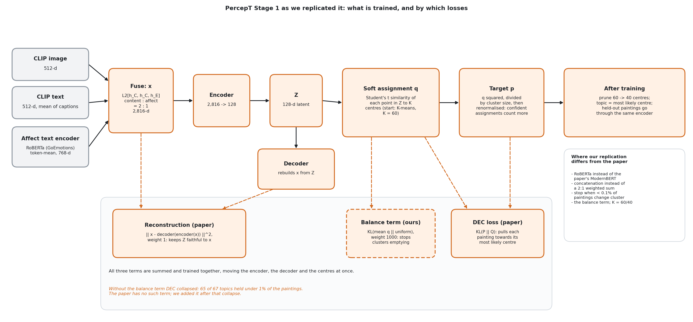

- DEC sharpens soft cluster memberships every epoch; without a counterweight it collapsed: 65 of 67 topics under 1% of paintings
- A balance term (weight 1000) plus 60 centres pruned to 40 cleared the bar in 4 of 4 seeds: the standing config, our baseline
- The collapsed run had the highest silhouette of all (0.855): silhouette rewards a few big clusters

Notes: DEC (deep embedded clustering) builds a sharper target from the current soft assignments and trains towards it. The paper has no balance term; we added it after the collapse. The paper's own training schedule without it reached silhouette 0.51 but collapsed and missed the emotion threshold.

---

## Experiment on adding emotion to the buddy graph

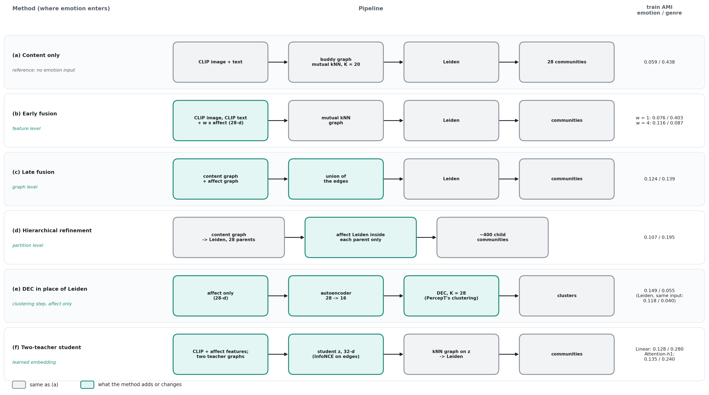

- Buddy graph + Leiden communities alone: genre AMI 0.438, emotion only 0.059 (PercepT on the same paintings: 0.146)
- Every graph-level fusion traded genre for emotion
- DEC in place of Leiden raised emotion (0.149), but only on emotion inputs, with genre near zero
- Content and affect share global structure (CCA 0.73 against 0.07 shuffled), so we learned a joint space: method (f)

Notes: The buddy graph links two paintings when each is among the other's 20 nearest neighbours in CLIP space. Leiden splits the graph into densely linked groups and picks their number itself. All numbers on this slide are training-split AMI; the held-out comparison follows.

---

## Experiment on a student trained by two teacher graphs

| Student (held-out, seed 42) | Emotion AMI | Genre AMI | Clears the bar |
|---|---:|---:|---|
| Linear gate | 0.1095 | 0.2901 | no |
| MLP heads (64, 128 hidden) | 0.1046, 0.1114 | 0.2087, 0.1604 | no |
| Attention, 4 heads | 0.1216 | 0.1875 | no |
| Attention, 1 head (Attention-h1) | 0.1249 | 0.2404 | yes |
| PercepT standing config (4 seeds) | 0.1252 | 0.2486 | yes, 4 of 4 |

- More capacity per input made things worse; the mixing step was what mattered

Notes: The student maps each painting to a 32-d vector. The buddy graph and an emotion graph act as teachers: every edge is a positive pair for an InfoNCE loss. Leiden then runs on a neighbour graph of the student's vectors. There is no DEC loss and no cluster centre. Four heads split 32 dimensions into slices of 8, which cost genre.

---

## Report on what the communities contain

- How to read it: each column is one community, largest on the left; the grey bar above it is its size (in genre panels, its number of genre-labelled paintings)
- Each cell is one label: red means the label is more common inside the community than overall, blue less common, white the same; hatched columns have too few labelled paintings
- Top row: plain buddy graph, near-pure genre columns and flat emotion. Bottom row: Attention-h1, where communities gather fear, sadness, awe or amusement
- Size-weighted share of each community's top emotion: 0.383 → 0.468; top genre: 0.698 → 0.511

Notes: The colour scale is the label's share inside the community minus its share in the whole training set, in percentage points, capped at plus or minus 30. Left panels show emotions, right panels genres. The shift matches the AMI change on training paintings: emotion 0.059 → 0.135, genre 0.438 → 0.240.

---

## Results of the first comparison with PercepT

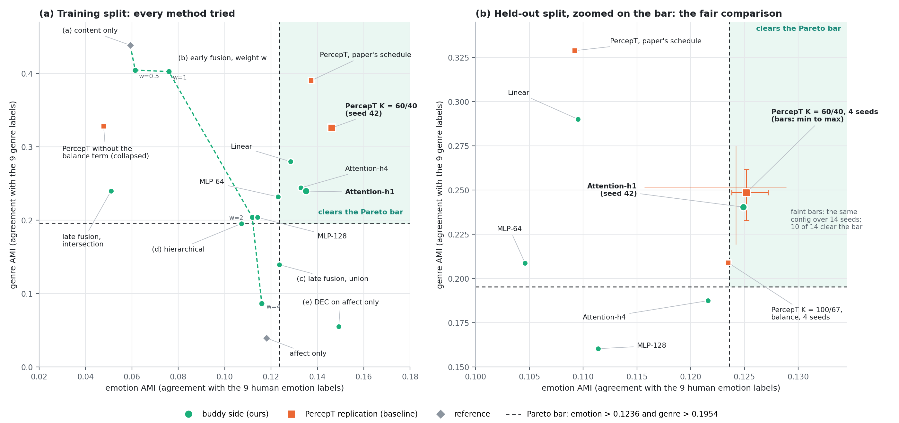

- Held out, Attention-h1 and PercepT differ by 0.0003 (emotion) and 0.008 (genre), less than PercepT's own seed spread
- The buddy side needed no anti-collapse term
- Still open at this point: more seeds, silhouette, and a Stage 2 test

Notes: Panel (b) is the fair comparison. PercepT's standing config is shown over 4 seeds (solid bars) and 14 seeds (faint bars, 10 of 14 clear). Both methods sit right at the emotion threshold, well below a supervised emotion classifier (0.169).

---

## Report on the first buddy model in PercepT's pipeline

| Model | Uses a DEC loss? |
|---|---|
| PercepT replication | yes: DEC + reconstruction (+ our balance term) |
| Buddy model and its student | no: InfoNCE on graph edges, then Leiden |
| Six DEC hybrids | yes, attached to the student; all failed |

Notes: Orange boxes are the PercepT parts that the buddy model replaces; teal boxes are what replaces them. Stage 2, the image-only topic mapper, is the same code for both, so any Stage 2 difference comes from the topics. Leiden picked 19 topics; we did not set that number.

---

## Results of Stage 1 against the PercepT baseline

| Held-out Stage 1 | Emotion AMI | Genre AMI | Seeds clearing |
|---|---:|---:|---|
| PercepT standing config (4 seeds) | 0.1252 | 0.2486 | 4 of 4 |
| Buddy model (4 seeds) | 0.1241 | 0.2406 | 3 of 4 (2 of 4 on cluster GPUs) |
| Buddy, k-NN vote onto train topics (seed 42) | 0.1364 | 0.2530 | 1 of 1 |

- Leiden cannot place a new painting in an existing community, so Stage 2 had no shared topic list
- Fix: a held-out painting takes the majority topic of its 20 nearest training paintings
- The vote reads about 0.01 higher than re-clustering; the two must not be mixed

Notes: PercepT assigns held-out paintings to their nearest trained centre; the buddy numbers in row 2 come from re-clustering the held-out graph, so the protocols differ slightly. On the cluster GPUs the buddy model's mean emotion AMI is 0.1230, just below the bar, so "level" is the strongest claim.

---

## Results on topic occupancy and cluster separation

- Buddy: all 19 topics used, 3 under 1%. PercepT standing config: 7 of 40 under 1%, none empty
- PercepT's collapsed paper-schedule run, shown here, leaves 21 of 67 topics empty
- Silhouette, same sample and code: 0.0416 (buddy, in its space) against 0.4973 (PercepT, in its space)

Notes: The dramatic contrast in the figure is with PercepT's collapsed run, not with the baseline. Silhouette depends on the space it is measured in, so the comparison is indicative.

---

## Experiment on adding a DEC loss to the buddy model

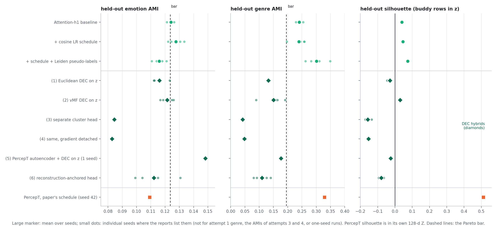

- Each attempt answered the previous failure: sphere geometry, then gradient leakage, then a missing reconstruction anchor
- Two of those diagnoses were falsified by the next attempt; separation and label agreement fell together every time
- A downstream probe: the 12-fold silhouette gap became a 0.035 genre-AMI edge for PercepT and a tie on emotion

Notes: The one free improvement was PercepT's cosine learning-rate schedule: silhouette up in every seed (0.0069 on average), bar clearance unchanged. The probe fed each system's predicted topics to the same classifier of human labels; both topic sets kept only about a third of the emotion signal in the raw image features.

---

## Experiment on Stage 2 tuning for both systems

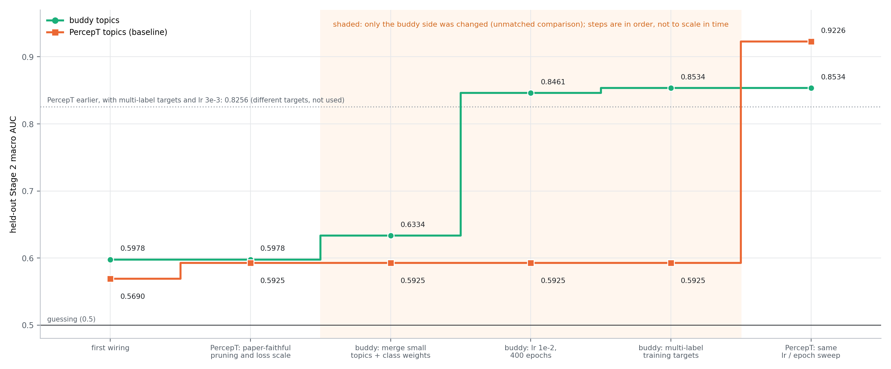

- Buddy climbed from 0.598 to 0.853 by merging small topics, tuning its mapper and using richer targets
- Shaded steps changed only the buddy side; once PercepT's mapper got the same tuning it reached 0.923
- Not settled then: topic counts (16 against 40) and training targets still differed; the matched head-to-head later removed PercepT's lead

Notes: AUC moves with the number of topics (on the buddy embedding, 33 topics give 0.857 and 4 give 0.908), so it is only comparable at matched topic counts. That is why the matched head-to-head was built.

---

## Experiment on transfer to RedCaps

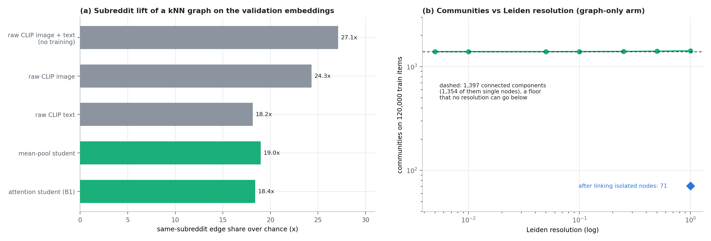

- RedCaps has no emotion labels; the subreddit served as a stand-in and a content-only student was tested
- The trained student (lift 18.4) fell below raw CLIP features (24.3 to 27.1)
- The tiny communities came from 1,397 disconnected pieces of the graph, not from Leiden's resolution

Notes: Lift is how much more often a graph edge joins two items from the same subreddit than chance predicts. Linking isolated nodes reduced the fragmentation but did not change the verdict. The subreddit is also a noisy label: 64% of items have their nearest neighbour in another subreddit.

---

## Experiment on a joint hyperparameter sweep

- 2,267 trials over Stage 1 and Stage 2; four of the six best passed the bar only at the seed they were selected on
- The 4-of-4 winner clears the emotion threshold in 1 of 8 seeds when scored the way the bar was set
- Same code, different GPU: one seed moves by 0.006 (emotion) and 0.024 (genre); all runs now on one cluster

Notes: The sweep scored held-out emotion with the k-NN vote and a tuned vote size, which reads about 0.01 higher than the re-clustering the bar was set with. That gap is larger than the emotion differences between models. The winner's real gains are genre AMI (0.30) and Stage 2 AUC.

---

## Report on the matched head-to-head

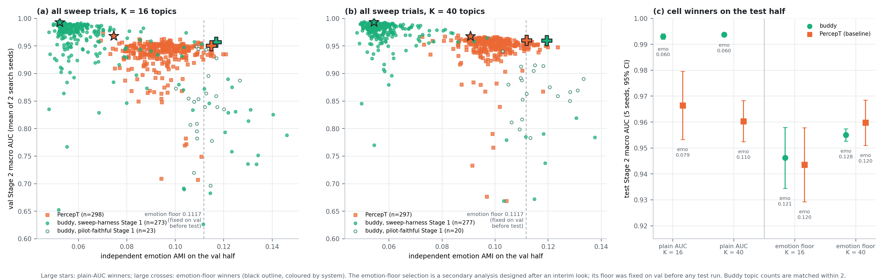

- One validated harness, 16 and 40 topics, 300 trials per cell; select on one held-out half, test once on the other
- By AUC alone buddy wins (0.993 vs 0.966; 0.994 vs 0.960) but keeps less emotion (AMI 0.060 vs 0.079 / 0.110)
- At equal emotion: no difference detected (+0.003, -0.005); PercepT's earlier Stage 2 lead does not hold

Notes: Both ports were checked against the original code before launch (buddy bit-exact, PercepT 0.9258 against 0.9226). Plain AUC is the approved protocol. The emotion-floor selection is secondary: it was designed after an interim look showed buddy's lead came with emotion AMI near 0.05, and its floor (0.1117) was fixed on the val half before any test run. A genre difference seen on test did not replicate on val, so it is not claimed. The pilot-faithful buddy was drawn in only about 20 of 300 trials per cell but supplied 8 of the 10 emotion-floor finalists.

---

## Results summary of the percept line

| Measure | Buddy model | PercepT baseline |
|---|---|---|
| Label agreement (emotion / genre AMI) | 0.1241 / 0.2406 | 0.1252 / 0.2486 |
| Harmonic mean of the two AMIs | 0.164 | 0.164 to 0.167 |
| Anti-collapse term | **none** | needed |
| Topics under 1% (held out) | 3 of 19 | 7 of 40 |
| Silhouette | 0.04 | **0.50** |
| Stage 2 AUC by AUC alone (16 / 40 topics) | **0.993 / 0.994**, emotion 0.060 | 0.966 / 0.960, emotion **0.079 / 0.110** |
| Stage 2 AUC at equal emotion (secondary) | 0.946 / 0.955 | 0.944 / 0.960 |

- A credible, simpler, collapse-free Stage 1; ahead on Stage 2 AUC only by giving up emotion, with no difference detected at equal emotion

Notes: Bold marks the side that is clearly ahead. For CoSiR the deeper point is that Stage 2 AUC rewards topics that are easy to predict from the image, not topics that capture conditions such as emotion. That led to the v2 redesign.

---

## Report on the CoSiR v2 design

- Old CoSiR: 18 experiments of patches; the last one traded retrieval (i2t R@1 10.4 against CLIP's 17.8) for cluster separation
- Target: s(I, T | c), an image-text score under a condition given by a few example pairs
- Four parts: shared factors, a condition interface, the score, self-mined training episodes

Notes: The score is beta times the CLIP cosine plus a condition-weighted product of image and text factor codes. Conditions are mined from the data, with no hand-made taxonomy, and link images with texts, unlike GeneCIS, which links images with images. The codebase was stripped to its data infrastructure (47,160 lines removed) and rebuilt block by block.

---

## Experiment on Block 1, the rebuilt Stage 1

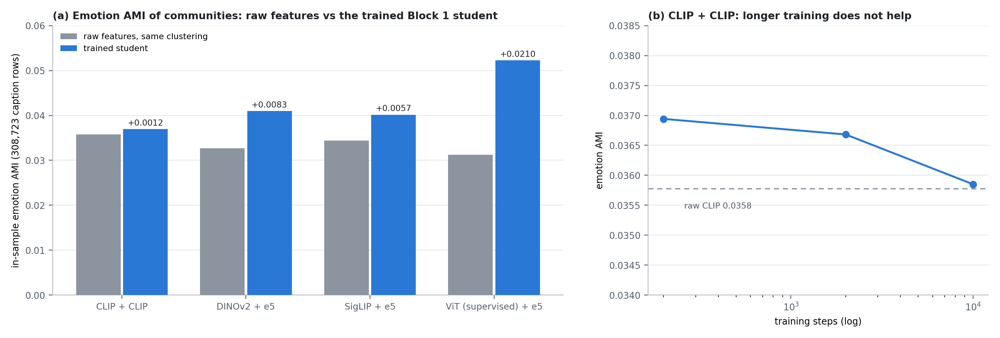

- Content-only student on CLIP: 0.0369 against raw CLIP's 0.0358; longer training moves it back to CLIP
- Likely cause: the teacher graph is itself a CLIP graph, so the student restates CLIP
- Other encoders widen the gap (up to +0.021); CLIP was kept for the factor work

Notes: These are in-sample numbers on caption rows, without the emotion teacher, so they are not comparable with Attention-h1's 0.124. The same result appeared on RedCaps.

---

## Report on the early factor and condition checks

| Step | What it showed | What it really meant |
|---|---|---|
| Factor discovery, usage balance | two of 32 factors held 88% of mass; balance "fixed" it | the checks measured spread, not dimensions |
| Condition recovery | 22% correct, 19 of 32 factors never recovered | five factors absorbed the predictions |
| Ranking test | naive rule +17 R@1 over uniform weights | mostly a scale artefact: +3.6 after normalising |
| Trained interface | no better than a shuffled condition | the recovery objective taught it nothing |
| Code review | participation ratio 1.3 (CLIP: about 40) | the factors were near-copies of one direction |

- The row split also leaked: 99.5% of held-out rows had their exact image in training

Notes: The participation ratio counts how many dimensions carry the variance. A corrected readout showed the codes still hold CLIP information, but in directions with about 10^4 times less variance: a collapse of geometry and scale more than of information. We stopped before training a scorer and planned a repair on a painting-grouped split.

---

## Experiment on the cause of the factor collapse

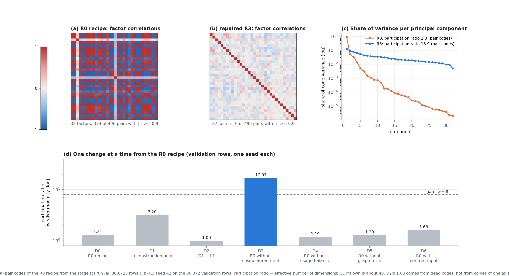

- Removing the cosine pair-agreement term alone lifts the participation ratio from 1.3 to 17.1
- Likely mechanism: for non-negative codes, the easiest way to align every pair is to align every item
- Repair: InfoNCE agreement (pairs must beat other items) plus decorrelation

Notes: Each diagnosis variant is a single seed. With reconstruction alone the codes only just escape the collapse rule (3.2 against 3). The usage-balance term did not cause the collapse; it kept 32 near-copies alive.

---

## Experiment on repairing the factors

- Pre-registered gates: no recipe passed all nine, so the plan stopped
- Two gates were amended (readout no worse than the collapsed recipe; sparsity cap 50%); R3 was chosen by tie-break
- R3 replicates over two more seeds; on held rows its participation ratio is 21.8 / 20.7

Notes: The binding gates were a text readout floor that the collapsed recipe itself never met, and a sparsity cap missed at 44 to 49% active codes. The repaired claim rests on the gates R3 passes under the original thresholds: participation ratio, redundancy and pair retrieval.

---

## Results of the repaired factors on human-label conditions

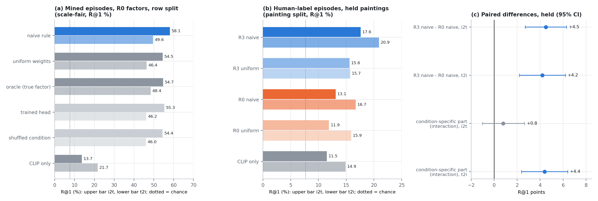

- Held paintings, conditions from human emotion and art style: R3 naive +4.5 / +4.2 R@1 over R0, +6.1 / +6.0 over CLIP
- The condition-specific part (interaction) is significant in t2i only: +4.4 [+2.4, +6.4]; i2t +0.8 [-1.0, +2.6]
- Pre-registered primary criterion met

Notes: Each episode: one anchor, a positive and four supports sharing the label, four contrasts and twelve negatives without it; 13 candidates, chance 7.7%. The naive rule weights each factor by support mean minus contrast mean and has no parameters. In i2t, 83% of R3's gain does not depend on the condition.

---

## Report on the stage (d) trained scorer

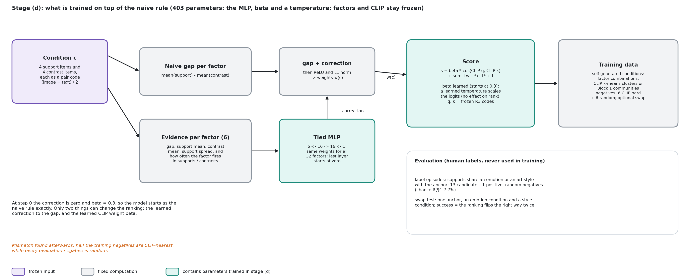

- 403 parameters: a tiny correction to each factor's weight, the CLIP weight beta and a temperature
- Trained only on self-generated conditions (factor combinations, CLIP clusters, Block 1 communities)
- Pre-registered: the condition-use gain must clear zero in both directions on held paintings, plus a human swap test

Notes: At step 0 the scorer equals the naive rule exactly, so any change is attributable to training. The condition-use gain is how much more a model's accuracy drops than the naive rule's when it is given the wrong condition. Half the training negatives are CLIP-nearest; all evaluation negatives are random, a mismatch found afterwards.

---

## Results of stage (d) selection

- CLIP-cluster and community conditions beat naive (+2.5, +3.0); factor combinations did not; G3 chosen by tie-break
- Every run pushed beta from 0.3 to about 0.05; that alone explains a third of G3's gain
- A cross-validated best weighting per human label is no better than naive: the frozen factors look like the limit

Notes: Hard training negatives are CLIP-nearest, so the loss rewards trusting CLIP less; at evaluation CLIP helps. The per-episode oracle (85.7%) is uninformative, since a random target also reaches 78.2%. G5, from Block 1 communities, was the only run with a swap-test gain beyond its beta drop; it was not held-tested.

---

## Results of the stage (d) held test

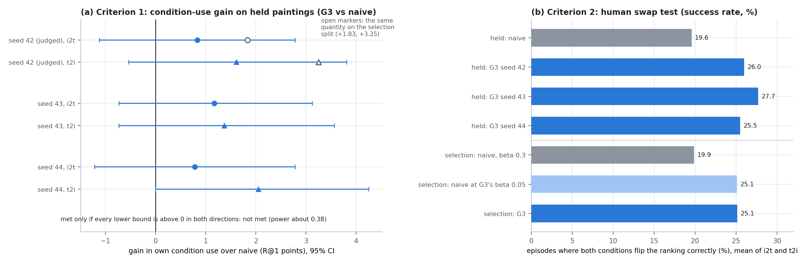

- Criterion 1: +0.8 [-1.1, +2.8] (i2t) and +1.6 [-0.5, +3.8] (t2i); not met, with power about 0.38
- Criterion 2: swap success 26.0% against 19.6%, met as registered
- But the naive rule at G3's beta matches G3 on the selection split (25.1% both)

Notes: "Not shown" is different from "shown to be absent": if the true gain equalled the selection value, both intervals would clear zero only 38% of the time. The swap-test pass reflects the lower CLIP weight, which any rule could have.

---

## Results summary of CoSiR v2

- Improves on CLIP and on its own collapsed version on held human-label conditions, with a condition-specific gain in t2i
- The trained condition interface ties the zero-parameter naive rule on the repaired factors
- The label oracle suggests the frozen factors limit emotion and style conditioning
- Decision: make the factors themselves condition-aware during training

Notes: The planned human-judged evaluation set does not exist yet; human emotion and art-style labels served as stand-in conditions. The held split has now been read by two final tests, so new evaluation data needs a decision.
