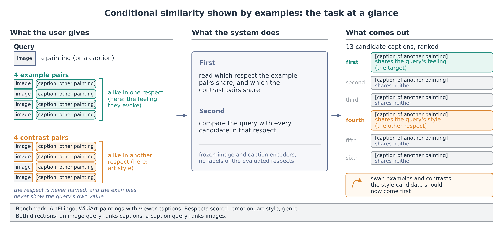
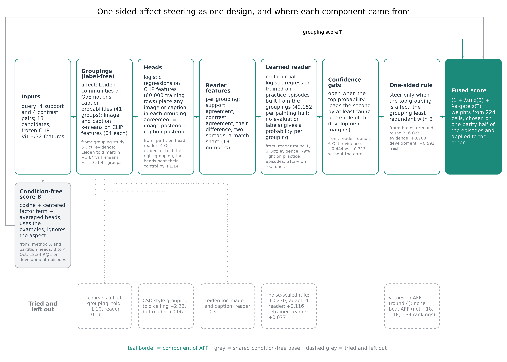
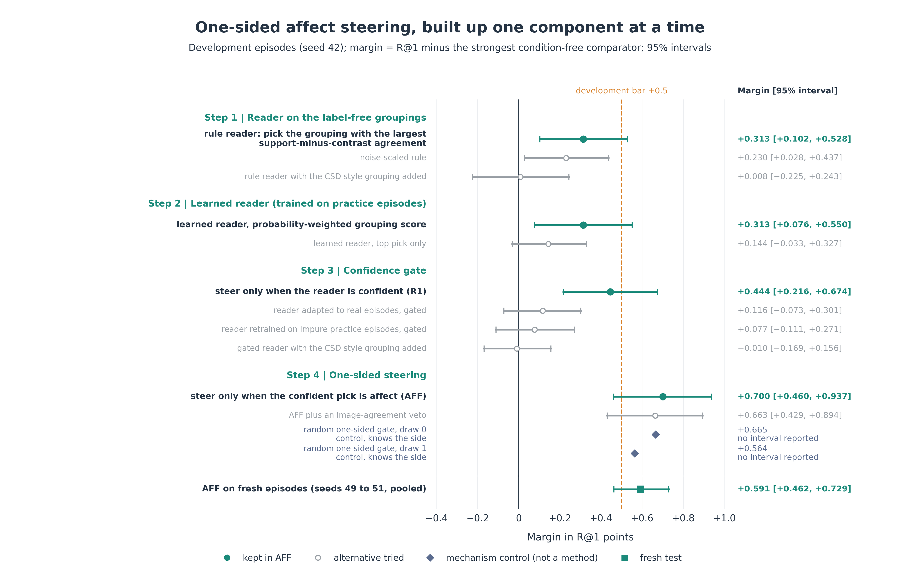

# Weekly report, 1 to 7 October 2026: the factor line stopped, the task became aspect episodes, and one-sided affect steering passed its fresh test

> Written 7 October 2026 (drafts v1 to v3 in `drafts/`). CoSiR v2, main branch. Covers 1 to 7 October, with the factor-learning steps of
> 30 September to 1 October as a lead-in (the [previous weekly report](2026-09-30_percept_buddy_to_v2.md) ended on
> 30 September at 08:20). Every number comes from the report linked in its section. Lines marked **Verdict
> (reference)** are our reading of the results; they decide nothing.

## Summary

- **The factor line stopped as a way to read the condition.** The last factor model passed its held test on 1 October,
  but on 2 October we found that this test measured few-shot recognition of a label, not conditional similarity. On a
  fair test the factors ignored the condition, and method A, which trained them for it, failed its pre-registered GO
  test on 3 October. Their condition-free part survives inside the bar every later method had to beat.
- **The task was reframed.** The condition now names an *aspect* (emotion, style or genre) through example pairs whose
  values differ from the query's, and every result is scored on condition gain and against a matched control. This
  became the problem definition of the CVPR plan (abstract 10 November).
- **Of four method branches, only the middle one passed** (the middle line of Figure 6). Metric learning from pairs,
  in-context multimodal LLMs and method A with its repairs all failed. The line built on label-free groupings and a
  learned reader produced the week's one pass.
- **One-sided affect steering (AFF) passed all seven pre-registered checks on 36,864 fresh episodes.** Its R@1 was 18.88
  against 18.29 for the strongest scorer that ignores the condition, +0.591 [+0.462, +0.729].
- **The pass has limits.** The gain sits on the two pairs that involve emotion, AFF loses on style × genre (−0.580), a
  random gate that steers the same side as often did as well, its parent reader (without the one-sided restriction)
  also passed, and the test used new episodes from the development paintings, not the held paintings.
- **In our reading, the novelty lies mostly in the task and its protocol.** AFF itself is a modest method: a side detector whose only
  emotion signal comes from an external emotion classifier (GoEmotions) run over the captions, never from our labels.

## Idea and contributions

### Background

Image and text models such as CLIP reduce the match between an image and a caption to one number. That number is
fixed: it cannot say that two things are alike *in one respect* and unlike in another, the way two paintings can share
a mood but not a style. Work on *conditional similarity* lets the respect vary. Early methods learn one mask or subspace
per respect from labelled examples (conditional similarity networks); later ones infer the respects from labelled
triplets without condition labels, on images only (SCE-Net, DiscoverNet); recent ones take the respect as a text phrase,
either with a fine-tuned CLIP (GeneCIS) or on a frozen vision and language encoder (CLAY, CRL). All of them need a name
for the respect or supervision tied to it, and nearly all compare images with images.

### The problem: conditional similarity between images and captions

CoSiR asks for a similarity between an image and a caption that depends on a condition: are these two alike *in this
respect*? The use cases are users who hold examples of a relation but cannot or will not name it: a designer whose mood
board pairs images with captions that "go together", a searcher who marks image and caption pairs that match, or a
curator who wants more captions written the way a set of examples is written.

### Our approach: show the respect by examples

The condition is given by a few example image and caption pairs that agree in the wanted respect, plus a few contrast
pairs that agree in a different one. Three rules make this a test of reading the respect rather than copying it:

- the respect is never named;
- the examples never show the query's own value (if the query is sad, the examples show other feelings), so the system
  must work out *which respect* the examples share and apply it to the query;
- each example pair joins an image of one artwork with a caption of another, so the pairs carry the respect, not an
  identity.

The system must not use the human labels it is evaluated on; it may use any label-free signal in the data and external
models, which must be stated.

### The setup at a glance



*Figure 1. The task in one picture. A user gives a query, four example pairs that are alike in one respect and four
contrast pairs that are alike in another; the system ranks candidates of the other modality by agreement with the query
in the shown respect. Swapping examples and contrasts should swap which candidate comes first.*

The system receives a query (a painting or a caption), the example pairs and the contrast pairs, and ranks 13
candidates of the other modality. Among them, one shares the query's value of the shown respect (the target) and one
shares its value of the contrasted respect (a distractor); the rest share neither. Every episode is scored in both
directions (an image query ranking captions, a caption query ranking images) and under both conditions (examples and
contrasts swapped). §2 gives the formal definitions and the measures.

### Data

The main benchmark is **ArtELingo** (English part): WikiArt paintings with captions written by viewers, 308,723 image
and caption rows over 61,402 paintings. Each caption comes with the emotion its writer felt; each painting has an art
style, and genre labels (from WikiArt) cover about 81% of the paintings; episodes that involve genre use only those. We score three respects (8 emotions, 23 styles, 10 genres) and so three respect pairs: emotion ×
style, emotion × genre and style × genre. The paintings are split once: 36,518 for training, 6,451 for development and
fresh test episodes, 12,281 held back for the paper's final test, and a validation split that is not used here. Emotion is carried mainly by the captions and
style by the images (§2.3), so a cross-modal match is bounded by the weaker side. The plan adds CUB-200 birds with human
captions (50 species unseen in training; respects such as colour and bill shape), SemArt (catalogue text: type, school,
timeframe) and GeneCIS as a transfer diagnostic; none has been run for the current method.

### Our method so far

Our current best method is **one-sided affect steering (AFF)** (§4). It starts from a strong score that uses the
examples but ignores which respect they show, and adds a second score only when a label-free *reader* is confident that
the example pairs share the *affect* grouping, a clustering of the captions by an external emotion classifier
(GoEmotions). The reader is trained on practice episodes built from label-free groupings of the training data, so no
evaluation label is used. On fresh ArtELingo episodes AFF ranked the right candidate first in 18.88% of rankings,
against 18.29% for the strongest score that ignores the condition and 13.04% for plain CLIP: +0.59 points, about 3%
relative, with all of the gain on the two respect pairs that involve emotion and a loss on style × genre (§4.4).

*Terms.* In the rest of the report a respect is called an **aspect** (emotion, style, genre) and its setting a
**value** (a particular emotion, style or genre).

### Goal (the plan's target, not yet reached)

A method that reads the respect from the examples and, on the held data of several datasets, beats the backbone alone,
the best metric learned from the example pairs and its own score with the condition removed, on both R@1 and
condition gain, without using labels of the evaluated respects. The target venue is CVPR (abstract 10 November, paper
16 November).

### Novelty

- **The task.** To our knowledge, no paper defines a cross-modal similarity whose respect is fixed at test time only by
  value-disjoint, cross-item image and caption examples, with contrast pairs on another respect. Each neighbour has one
  property: per-query weights from a few examples, on images only (Contextual Visual Similarity); metrics learned from
  pairs (Xing, RCA, KISSME); a relation defined by one example pair (MARS); a respect named in text, image to image
  (GeneCIS, CLAY, CRL); respects discovered without labels, on images (SCE-Net, DiscoverNet).
- **What we do not claim as new:** inferring a notion of similarity from examples, test-time reweighting, retrieval by
  an example relation, label-free condition discovery, and distant emotion supervision (EmotionCLIP). The method's
  claim is "no labels from the evaluation taxonomy", with the external emotion classifier stated.
- **The protocol.** Condition gain (zero for any scorer that ignores the condition) and matched controls separate
  reading the condition from merely finding related candidates. Without them a score that ignores the condition looks
  strong: on our development episodes one reached 18.34 R@1 against cosine's 12.96.

### Contributions

*Table 1. The plan's three contributions: what we have on 7 October, and what a full success would add.*

| Contribution | What we have now | What a full success would add |
|---|---|---|
| **C1. Task, benchmark and protocol** | defined and run on ArtELingo: episode builder and splits, condition gain, matched controls, nine metric-from-pairs baselines, two in-context MLLMs, a condition-free bar; development and fresh episodes | released episode files, splits, label joins and evaluation code for ArtELingo, CUB, SemArt and GeneCIS; confirmatory held tests (each held split read once) on the first three, GeneCIS as a transfer diagnostic |
| **C2. Method** | one-sided affect steering (AFF), label-free, beat every pre-registered condition-free comparator on fresh ArtELingo episodes (+0.591 R@1, condition gain +3.3), with its mechanism analysed; it loses on style × genre | a method that passes the plan's main claim (K2): on the held splits of ArtELingo, CUB and SemArt it beats the backbone alone, the best metric from pairs and its own condition-removed control on both R@1 and condition gain, with the plan's correction for testing several comparisons; the same gains on a second backbone (K4). Per-pair results and comparisons with a fine-tuned CLIP and in-context MLLMs are reported beside these, not required |
| **C3. Analysis** | emotion in captions and style in images across four backbones; why reading the condition costs either rate (R@1 = (either + gain) / 2); told ceilings; label-free reading reduces to choosing a side | the same analysis across annotation protocols (ArtEmis captions against SemArt catalogue text), and whether showing the respect by examples beats naming it, per respect (K3) |

> Sources: CVPR plan [§3, §4](../../superpowers/specs/2026-10-02-cosir-v2-cvpr-publication-plan-design.md#3-problem-definition-approved),
> [literature review](../literature/2026-10-21_cvpr_literature_review.md) §1, [novelty check](../literature/2026-10-24_aspect_task_novelty_check.md),
> [readiness memo](../stage/2026-10-07_cvpr_readiness.md) §3, §4.

## How we got here

CoSiR asks whether an image and a caption match *in a given respect*: two paintings can be alike in mood and unlike in
style. CoSiR v2, rebuilt on 28 September, scores an image and a caption under a condition given by a few example pairs.
Last week ended with a decision: make the shared image and caption factors condition-aware during training.

The methods below use ArtELingo (WikiArt paintings with viewer captions, each caption labelled with the viewer's
emotion; style and genre belong to the painting) and frozen CLIP ViT-B/32 features, plus two external signals where
stated (the GoEmotions emotion classifier and the CSD style encoder). Evaluation labels only score results, except in
diagnostics marked as such (label probes, label-trained factors); one check (§2.3) compares other backbones.


*Figure 2. The week, one row per day (00:00 to 24:00, Amsterdam time). Shape marks the kind of step, colour its
outcome, black diamonds the user's decisions. Much of the work ran overnight. The full table of steps is in the
[summary draft](drafts/2026-10-07_summary_draft.md#1-timeline).*

The rest of the report follows four questions: what happened to the factor line (§1), how the task was reframed (§2),
which side branches were tried and why they failed (§3), and why the middle line's result counts as a GO, against what,
and what is new about it (§4). §5 is a short go/no-go checklist and §6 the status at the end of the week.

**Terms used throughout** (full definitions in §2.1 and §2.2, and a glossary at the end):

- **R@1**: the share of rankings in which the right candidate comes first, in percent; differences are in points.
- **Value episode** (used until 2 October): a few example pairs show one value, such as "sad", and the system ranks
  candidates for a query. **Aspect episode** (from 2 October): 4 example pairs (supports) show an unnamed aspect through
  values the query does not have, 4 contrast pairs show another aspect, and 13 candidates are ranked. The two kinds of
  episode give R@1 on different scales.
- **Condition gain**: how much more often the shown aspect's candidate comes first than the other aspect's; exactly 0
  for a scorer that ignores the condition. **Either rate**: how often a candidate sharing either aspect comes first.
- **Condition**: which of an episode's two aspects the examples show; swapping supports and contrasts gives the second
  condition. **Anchor painting**: the painting the query comes from.
- **Matched control**: the same score with only the condition removed. **B**: the best score that uses the examples
  but ignores which aspect they show (the condition-free bar).
- **Development episodes**: one reused draw of episodes (seed 42), used to choose methods. **Fresh episodes**: new
  draws (seeds 43 and later), each used for one test. **Held paintings**: a separate set reserved for the paper's final
  test. They have not been read for aspect episodes; their last read was SE's value-episode test on 1 October.
- Model names: **SE**, **C0** and **R3** are versions of the shared image and caption factors; **method A** trained
  them for aspects; **AFF** is the week's passing method (§4).

## 1. The factor line: what the last results showed, and why it stopped

### 1.1 The last factor results looked good

On 30 September and 1 October we trained the shared factors with condition episodes. The first design (painting-level
agreement and CLIP-image-cluster episodes, a 2 × 2 grid) stopped: no cell qualified. The CLIP-image-cluster episodes
raised pooled R@1 by +1.44 over the matched control, all of it from style (+3.61 on style conditions), but broke the
emotion guard and the sparsity gate.

The second design, **SE**, trained the factors on condition episodes built from two label-free sources: clusters of
the captions' GoEmotions emotion scores (GoEmotions is a public Reddit emotion classifier, never trained on ArtELingo)
and clusters of CLIP image features. Against its matched control C0 (the same factors without condition training) it
passed the held test on fresh held episodes (under the revised rule, in which sparsity had become report-only; SE's
caption codes still exceeded the cap):

| SE minus C0, held episodes (8,192 per label) | R@1 [95% interval] |
|---|---|
| emotion conditions | +2.08 [+1.51, +2.62] |
| style conditions | +0.65 [+0.07, +1.21] |

> Sources: [factor-learning selection](../auto/v2/2026-10-16_candidate_a_factor_learning_selection.md),
> [affect factor learning, held test](../auto/v2/2026-10-19_candidate_a_affect_factor_learning_held.md).

### 1.2 The test measured recognition, not conditional similarity

These were **value episodes**: the examples show one value ("sad, like these"): the 4 support pairs carry the query's own
label, while the contrast pairs and the distractors lack it. On 2 October a check with simple baselines showed that the examples give the
answer away (Figure 3a):

- a prototype of the examples that never looks at the query scored 22.83 R@1, already above SE's 21.22;
- adding the query moved it by only +0.57 [+0.20, +0.96];
- a logistic probe fitted on the example pairs (raw CLIP features) scored 24.10, +2.87 [+2.14, +3.64] above SE.

The first v2 result reads the same way. On held value episodes the repaired factors R3 (last week's fix of a
collapsed factor layer) reached 17.6 / 20.9 R@1 (image to caption / caption to image) against 11.5 / 14.9 for CLIP,
but R3 with the condition ignored already reached 15.6 / 15.7. The part that depends on the condition (+2.0 / +5.2)
measured recognition of the value from the supports, the shortcut above.

The value-episode numbers in this section and the aspect-episode numbers below come from different tasks, so their R@1
levels are not comparable with each other.

> Sources: [support-set baseline spike](../auto/v2/2026-10-22_support_baseline_spike.md), stage report
> [§3](../stage/2026-10-04_aspect_conditioned_similarity_methods.md#3-how-the-task-was-arrived-at).

### 1.3 On a fair test the factors ignored the condition

On **aspect episodes** (§2.1), where the examples show an aspect through values the query does not have, no factor
model chose the aspect. On 4,096 emotion × style episodes SE scored 11.32 against CLIP's 11.13 (+0.20 [−0.12, +0.50]);
C0, R3 and a raw-CLIP agreement rule were also at CLIP level (Figure 3b); only a privileged reference that is given the
aspect's label names as text gained (12.63). The task itself was not the obstacle: label probes told the aspect reached
23.09.

The factors still raised R@1, but only by finding candidates that share *some* aspect with the query. With the
condition removed (uniform weights), SE's factor term reached 16.30 R@1 against cosine's 12.96 on the development
episodes, at a condition gain of exactly 0.

> Sources: [aspect-episode spike](../auto/v2/2026-10-23_aspect_episode_spike.md),
> [E1 baselines](../auto/v2/2026-10-30_aspect_baselines.md).

### 1.4 Method A tried to train the factors for aspects, and failed its GO test

Method A trained the shared factors on label-free *pseudo-aspect episodes* so that a training-free rule could read the
aspect from the example pairs (§3.2 describes the experiment). On fresh episodes its own condition-free control beat it
by 2.96 R@1 (Figure 3c), so it failed its pre-registered GO test on 3 October. A repair that added the conditioned term
on top of the condition-free one (A′) reached 16.52 against its control's 16.55; factors trained on the evaluation
labels, as a diagnostic, doubled the term's condition gain (1.85 against 0.99), but inside the fused score their
condition gain was only 0.01 to 0.05, below the pre-registered bar of 0.218. The pre-registered decision stopped the
repair the same day.


*Figure 3. (a) Value episodes: the examples alone nearly solve them. (b) Aspect episodes: every factor model stays at
CLIP level, while label probes show headroom. (c) Method A's GO test: its own condition-free control beats it. Hatched
bars use evaluation labels and are references, not methods.*

> Sources: [E2 partitions](../auto/v2/2026-10-31_pseudo_partitions.md),
> [E3 go/no-go](../auto/v2/2026-11-01_aspect_factor_gonogo.md),
> [repair diagnostics](../auto/v2/2026-11-05_method_repair_diagnostics.md).

**Verdict (reference).** As a way to read the condition, the factor line ended on 3 October. Its condition-free part
survives: a centered version of method A's factor term is one of the three ingredients of B, the condition-free score
every later method had to beat (§3.5).

## 2. The reframe: aspect episodes and the CVPR plan

### 2.1 The decision and the task

**The decision (2 October, the user's).** Value episodes were dropped as the main task, because the examples alone
solve them (§1.2). The condition now names an **aspect**, never a value, and the examples never carry the query's own
value, so a system has to read *which respect* the examples share and apply it to the query. Two findings of the same
morning made this a viable task: on aspect episodes every factor model sat at CLIP level, yet label probes reached
23.09 against CLIP's 11.13 (§1.3), so the task is hard and learnable. The same day the user also fixed the benchmarks
(ArtELingo first, then CUB, SemArt and GeneCIS) and the method to try first (method A). The user noted that this
framing departs from CoSiR's original storyline but is clearer and more specific.

An **aspect episode** has:

- a **query**: one painting's image (ranking captions) or one viewer's caption (ranking images);
- **4 support pairs**: each an image of one painting with a caption of another, the two agreeing on a value of aspect
  A and differing on B; the four pairs show four different values, none of them the query's;
- **4 contrast pairs**, built the same way for a second aspect B;
- **13 candidates** in the other modality: p_A shares the query's value of A, p_B its value of B, 11 negatives share
  neither. All 13 differ from the query on the third aspect; the example pairs are not controlled on it.

Emotion is labelled per viewer (each caption has its writer's emotion), style and genre per painting.

Swapping supports and contrasts makes p_B the target. The aspect is never named. ArtELingo gives three aspects (8
emotions, 23 styles, 10 genres) and three **aspect pairs**: emotion × style, emotion × genre and style × genre. One
**episode seed** draws 12,288 episodes from the 6,451 selection paintings; seed 42 is the development draw, and later
seeds are fresh draws for tests. The 12,281 held paintings stay reserved for the paper's final test.


*Figure 4. One aspect episode. Teal: support pairs (aspect A); orange: contrast pairs (aspect B); grey: negatives.
Swapping supports and contrasts must move p_B to the top. From the stage report of 4 October.*

### 2.2 How a result is measured

Each episode gives four rankings (two conditions, two directions):

| Measure | Meaning |
|---|---|
| R@1 | the target ranks first (chance 7.7%) |
| other-aspect rate | the other aspect's candidate ranks first |
| **condition gain** | R@1 minus the other-aspect rate; exactly 0 for any scorer that ignores the condition |
| **either rate** | R@1 plus the other-aspect rate: how often *some* aspect-sharing candidate ranks first |

From these, **R@1 = (either rate + condition gain) / 2**. A scorer can raise R@1 by finding aspect-sharing candidates
more often or by choosing the conditioned one more often. A scorer that reads the condition gains only if its condition
gain outgrows what it loses in either rate. This identity explains most of §3 and §4.

Two rules came from the plan's review and hold for every result below:

- **Matched control**: each method is compared with the same score with *only* the condition removed. On 4 October a
  method (the centered rule of Table 2) passed a control that also removed a second ingredient, and lost 1.15 R@1 to the
  matched one.
- **Condition-free bar**: B is the best score that uses the examples but ignores which aspect they show. A method must
  beat B, B rebuilt on the method's own groupings (B′; written B′(A0) for the groupings without the style grouping of
  §4.3 and B′(A1) with it), and its matched control.

On aspect episodes, intervals are 95% bootstrap intervals over anchor paintings (5,000 resamples), with fitted models
and cross-fit choices held fixed; candidate and example paintings recur across episodes and are not clustered. The
earlier value-episode tests (§1) resampled episodes.

### 2.3 What the data allow

Emotion is carried mainly by the captions and style by the images (genre was not part of this check). A cross-modal match is
capped by the weaker side. Four frozen backbones barely move the weak side (emotion read from images 35.1 to 36.6,
style read from captions 25.4 to 26.3) while moving the strong side by up to 11 points (Figure 5). The asymmetry is not
specific to one backbone; whether it comes from the modalities or from how the captions were collected is not
separated.


*Figure 5. Probe accuracy for each aspect read from each modality, for four frozen backbones. The spread across
backbones is written under each group.*

The task is learnable when items carry one block of features per aspect. With label-probe posteriors as items (a
diagnostic that uses the labels), inferring the aspect from the example pairs reached 25.02 R@1 on the development
episodes, 2.48 [2.11, 2.84] above the same probes with the condition ignored (22.54); cosine scores 12.96 on the same
episodes. Measured by condition gain, the inferred aspect kept 63% of what the probes reach when told the aspect
(13.33 against 21.06; R@1 30.66 when told).

> Sources: [backbone check](../auto/v2/2026-10-25_backbone_check.md), stage report
> [§9.1](../stage/2026-10-04_aspect_conditioned_similarity_methods.md#91-d0-the-aspect-can-be-read-from-the-pairs-when-items-carry-aspect-blocks).

### 2.4 The plan and its review

The CVPR plan (written 2 October, revised 3 October) set three contributions:

| Claim | Content |
|---|---|
| C1 | the task, its benchmark and its protocol |
| C2 | a method that reads the aspect from the examples (in the plan: shared sparse image and caption factors read by a training-free agreement rule, which became method A) |
| C3 | an analysis of how the aspects are carried by the two modalities |

A pre-registered GO test chose between three papers: a method paper (the method beats cosine, RCA and its own
condition-free control on R@1 and on condition gain), a benchmark paper (an in-context multimodal LLM works while our
method does not), or an analysis paper (neither).

An automated five-seat review (ARS, one model family, no human reviewer) returned Major Revision. It made condition
gain co-primary and added the condition-free control, the clustered bootstrap, a held-out-aspect test and the MLLM
baseline. Without these changes, SE's condition-blind factor term (16.30 R@1 against 12.96) would have passed the
original GO rule.

**Status.** The task framing is settled. The paper's framing (method paper, ArtELingo-centred paper, or benchmark and
analysis paper) has been on hold since 7 October.

> Sources: [CVPR plan](../../superpowers/specs/2026-10-02-cosir-v2-cvpr-publication-plan-design.md) §3, §4, §10;
> [ARS plan review](../auto/v2/2026-10-27_ars_plan_review.md).

## 3. The side branches: three roots that failed


*Figure 6. The experiment tree of the week. Teal: worked or kept; orange: failed or stopped; slate: diagnostic; dashed:
in progress. Dotted arrows show what failed methods left in the condition-free bar B. Node ids (N0 to N25) match the
[summary draft](drafts/2026-10-07_summary_draft.md#3-what-each-branch-tried-and-why-it-worked-or-failed).*

*Table 2. The three side branches and the middle line of Figure 6, left to right, with the best result of each against its own comparator.*

| Branch | What it tried | Best result | Comparator | Outcome |
|---|---|---|---|---|
| Metric from pairs (left) | nine ways to learn a metric from the example pairs, including the classic metric-learning methods KISSME, RCA and Xing's, per-query weights, probes and a cache of the examples | RCA 13.38 R@1; every condition gain within 0.4 of 0 | cosine 12.96 | no baseline separates the aspects; RCA became the GO bar |
| Method A and its repairs (left) | factors with an agreement rule (method A), a nested repair (A′), a centered rule (N1), find then select (N2) | best: the centered rule, +0.24 against a control that also removed its centering; −1.15 against its own matched control | declared, then matched control | none passed both R@1 and condition gain against its matched control |
| **Middle line** | label-free groupings, heads that place images and captions in them, a learned reader, and finally one-sided affect steering | AFF +0.591 [+0.462, +0.729] on fresh episodes | strongest condition-free scorer | **GO** (§4) |
| In-context MLLM (right) | Qwen3-VL 2B and 8B given the whole episode in the prompt | 8B: R@1 +1.07 [+0.17, +1.93], gain +0.21 [−0.51, +0.94] | cosine | finds aspect-sharing candidates, does not pick the shown aspect |

> Sources: [E1 baselines](../auto/v2/2026-10-30_aspect_baselines.md), stage report
> [§4 to §10](../stage/2026-10-04_aspect_conditioned_similarity_methods.md#4-baselines-nine-ways-to-read-pairs-none-separates-the-aspects-e1).

Each side branch is described below at its root only, in a short subsection: the idea, the setting and method, and the
result. The MLLM probe gets more detail, since its input and output differ most from the other methods. Follow-ups are
named in Table 2 and not described. The middle line, which produced the week's one pass, is §4.

### 3.1 Metric learned from the example pairs (E1, 2 to 3 October)

**Idea.** The classic answer to "similar like these pairs": fit a similarity metric on the episode's own example pairs
and rank the candidates with it.

**Setting and method.** Nine scorers on frozen CLIP features, each estimated within the episode it scores:
per-dimension agreement weights (signed and rectified), a bilinear form, KISSME, RCA (relevant component analysis,
which whitens the features by the spread of the support-pair differences), Xing's metric, Wang et al.'s per-query
weights (Contextual Visual Similarity), a per-episode logistic probe and a Tip-Adapter-style cache of the examples.
Each was fused with CLIP cosine, z(cos) + λ · z(term), with λ chosen on one half of the episodes and applied to the
other. They ran on the development episodes (seed 42) and one fresh draw (seed 43); the best on seed 42 by the mean of
R@1 and condition gain became the plan's GO bar.

*Table 3. The metric-from-pairs baselines on the development episodes (seed 42).*

| Scorer | R@1 | Condition gain |
|---|---|---|
| cosine (CLIP) | 12.96 [12.67, 13.26] | 0 |
| **RCA, the GO bar** | 13.38 [13.08, 13.69] | 0.10 [−0.08, 0.29] |
| Wang et al. | 12.99 | 0.36 [0.06, 0.66] |
| per-episode logistic probe | 12.79 | 0.35 [0.04, 0.65] |
| the other six | 12.85 to 13.06 | −0.16 to 0.12 |

**Result.** No baseline separated the aspects: every condition gain stayed within 0.4 points of 0, and the best, RCA,
reached 13.38 R@1 against cosine's 12.96. The report's hypothesis: raw CLIP mixes the aspects across its dimensions, so
four value-disjoint pairs mostly estimate the values shown rather than the aspect they share.

> Sources: [E1 baselines](../auto/v2/2026-10-30_aspect_baselines.md) §1 to §3; `src/eval/pair_metric_baselines.py`.

### 3.2 Method A: factors trained on pseudo-aspect episodes (E2 and E3, 3 October)

**Idea.** Learn shared image and caption factors in which each aspect occupies its own factors, so that a simple rule
can read the aspect from four example pairs.

**Setting and method.** Two linear encoders with a ReLU map frozen CLIP image and caption features to 32 non-negative
factors. At test time a training-free *agreement rule* weights each factor by how much more the support pairs agree on
it than the contrast pairs, and the weighted factor match is fused with cosine. To train without labels, three
label-free k-means partitions of the training rows (the captions' GoEmotions probabilities, CLIP image features, CLIP
caption features; 64 clusters each) stood in for the aspects and generated 65,536 *pseudo-aspect episodes*; a ranking
loss on them was added to the previous week's factor recipe. Of six training runs, the pre-registered pick, A3, was
tested once on fresh episodes (seed 43). GO required R@1 and condition gain both above cosine, RCA and A3's own
condition-removed control, with every lower bound above 0.

*Table 4. Method A's GO test (fresh seed 43).*

| Comparator | Its R@1 | A3 minus it, R@1 | A3 minus it, condition gain |
|---|---|---|---|
| cosine | 13.53 | +0.23 [+0.00, +0.46] | +0.26 [−0.04, +0.56] |
| RCA, the GO bar | 13.52 | +0.24 [+0.00, +0.48] | +0.32 [+0.01, +0.64] |
| A3's own condition-free control | 16.72 | **−2.96 [−3.29, −2.64]** | +0.26 [−0.04, +0.56] |

**Result.** NO-GO: A3's own condition-free control beat it by 2.96 R@1. Its term did select the aspect (condition gain
0.97 alone) but found aspect-sharing candidates less often than cosine (21.4% of rankings against 27.1%; its control
33.4%), and training barely fitted the pseudo-aspect episodes. Of the follow-ups (a nested repair, a centered rule,
find then select), none passed both R@1 and condition gain against its matched control.

> Sources: [E2 partitions](../auto/v2/2026-10-31_pseudo_partitions.md), [E3 go/no-go](../auto/v2/2026-11-01_aspect_factor_gonogo.md)
> §2 to §6; `src/model/factors.py`, `src/train/aspect_loss.py`.

### 3.3 In-context multimodal LLM (3 October)

**Setting.** Two frozen instruction-tuned models, Qwen3-VL-2B and Qwen3-VL-8B, on draws of the same selection
paintings that no other method used: 2B on seed 44 (300 episodes per aspect pair, 900 in all, 802 anchor paintings;
the reported run, with a fixed prompt, re-scored the episodes of an earlier run), 8B on a separate seed 46 (600 per
pair, 1,800 in all, 1,507 anchor paintings). Each is compared with CLIP cosine on the same episodes.

**What it does.** The whole episode goes into one prompt, and the model answers with a letter:

1. the instruction: "Each example pair shows an image and a caption of two different artworks that are alike in one
   respect. The counter-example pairs are alike in a different respect. Pick the candidate that is alike to the query in
   the same respect as the example pairs. Answer with one letter." No aspect is named;
2. "Example pairs:", the 4 support pairs, each as an image followed by the caption of another artwork;
3. "Counter-example pairs:", the 4 contrast pairs in the same form;
4. "Query:", the query image (when ranking captions) or the query caption (when ranking images);
5. "Candidates:", 13 candidates lettered A to M: captions as text lines, or 13 images placed inline in the same context
   (21 images in such a prompt);
6. "Answer:".

The prompt, as the model reads it (images are inserted where marked; a caption query and image candidates replace
the query image and the candidate captions when images are ranked):

```text
Each example pair shows an image and a caption of two different artworks that are alike in one respect. The
counter-example pairs are alike in a different respect. Pick the candidate that is alike to the query in the same
respect as the example pairs. Answer with one letter.

Example pairs:
Pair 1: image<image>
caption: <caption of another artwork>
  ... pairs 2 to 4
Counter-example pairs:
Pair 1: image<image>
caption: <caption of another artwork>
  ... pairs 2 to 4
Query:
<image>
Candidates:
A. <caption>
  ... B to M
Answer:
```

Each candidate's score is the model's next-token logit for its letter. The letters are permuted for every episode,
condition and direction and mapped back, so a preference for a letter cannot pass for a choice. The second condition
swaps the two example blocks, so R@1 and condition gain are computed exactly as for every other scorer. The models ran in bfloat16 with images capped at 200,704 pixels; the 8B run finished on a
DAS6 GPU node.

**How it was evaluated.** Pre-registered: the probe "works" only if both the R@1 difference and the condition-gain
difference against cosine have pooled 95% lower bounds above 0.

*Table 5. The in-context MLLM probes against cosine on the same episodes.*

| Model | Episodes | R@1 | R@1 minus cosine | Condition gain | Either rate minus cosine | Works |
|---|---|---|---|---|---|---|
| Qwen3-VL-2B | seed 44, 900 | 13.50 | +0.22 [−1.13, +1.53] | −0.53 [−1.68, +0.66] | not reported | no |
| Qwen3-VL-8B | seed 46, 1,800 | 14.21 | +1.07 [+0.17, +1.93] | +0.21 [−0.51, +0.94] | +1.93 [+0.25, +3.51] | no |

**Result.** Neither model works under the rule. The 8B model found aspect-sharing candidates more often than cosine but
did not reliably choose the shown aspect; the 2B model was within noise of cosine on both measures. With no in-context
model working, the plan's benchmark-paper branch stayed closed.

> Sources: [E3 go/no-go](../auto/v2/2026-11-01_aspect_factor_gonogo.md) §9, stage report
> [§7](../stage/2026-10-04_aspect_conditioned_similarity_methods.md#7-in-context-multimodal-llms);
> `src/eval/mllm_reranker.py`, `src/test/20261106_mllm_probe_8b/PREREGISTRATION.md`.

### 3.4 What the failed roots have in common

By R@1 = (either rate + condition gain) / 2, a method has to do two things: find candidates that share an aspect with
the query (either rate) and choose the one the examples point to (condition gain). Each root failed on a different
part:

*Table 6. The three failed roots on the two parts of R@1.*

| Root | Choosing the shown aspect (condition gain) | Finding aspect-sharing candidates (either rate) | R@1 against its comparator |
|---|---|---|---|
| metric from pairs (best: RCA, seed 42) | +0.10 [−0.08, +0.29] | near cosine's (R@1 0.42 above cosine at a gain near 0) | 13.38 against cosine's 12.96 |
| method A (A3, seed 43) | +0.26 [−0.04, +0.56] in the fused score; 0.97 for the term alone | term alone 21.4 against cosine's 27.1 and its control's 33.4 | −2.96 against its own control |
| in-context MLLM (8B, seed 46) | +0.21 [−0.51, +0.94] over cosine | +1.93 [+0.25, +3.51] over cosine | +1.07 against cosine |

The metric baselines did neither; method A chose a little but lost much more in finding; the MLLM found more but did
not choose. The middle line (§4) is the only one that kept the finding of a strong condition-free score and added
choosing on top.

### 3.5 The condition-free bar rose all week

Each failed method left a condition-free ingredient, so the score a method must beat kept rising (development episodes,
seed 42). The two external baselines head the table; the rest ignore the condition by construction.

| Scorer | R@1 | What it adds |
|---|---|---|
| cosine (CLIP ViT-B/32) | 12.96 | the backbone alone (external baseline) |
| RCA | 13.38 | a metric learned from the example pairs (external baseline; condition gain +0.10, not separating the aspects) |
| SE factor term, uniform weights | 16.30 | shared factors, condition ignored |
| method A's control | 16.55 | method A's factors, condition ignored (16.72 on fresh seed 43, Table 4) |
| cosine + centered factor term (nested) | 17.94 | the factor term centered on the episode's example items (17.95 alone) |
| **B** | **18.34** | + the averaged partition heads |
| B′(A0) | 18.437 | B rebuilt on the Leiden affect, image and caption groupings |
| B′(A1) | 18.805 | B rebuilt with the CSD style grouping added |

Part of the lift from centering may come from how the episodes are built: the examples come from the same population as
the negatives, so centering on them lifts both aspect-sharing candidates together. A probe found 16.85 when centering on
8 random items, against 17.95 on the episode's own examples. The effect cancels in a method's margin over its matched
control, which centers the same way, but not in B's lift over cosine.

> Sources: stage report [§11.3](../stage/2026-10-04_aspect_conditioned_similarity_methods.md#113-the-condition-free-bar-and-its-caveat),
> round 4 report §5.

**Verdict (reference).** Yes, only the middle line passed. The factor-based branches hit the same wall (condition gain
no larger than the either rate it cost); the metric-from-pairs baselines did not separate the aspects at all; the MLLM
found aspect-sharing candidates more often than cosine but did not reliably choose the shown aspect. On the middle line, four of its five tested steps failed (the partition-head
reader and reader rounds 1, 2 and 4); round 3 passed. Our reading of why: AFF spends the either-rate cost mostly
where B is weakest, the emotion side.

## 4. The middle line: one-sided affect steering

This section reads the middle line backwards. It starts where the line ended: one-sided affect steering (AFF) and its
fresh test (§4.1). It then describes AFF as a single design (§4.2) and explains each component with the evidence from
the steps that led to it, presented as ablations rather than as a chronology (§4.3). §4.4 and §4.5 analyse where the
gain sits and what carries it.

### 4.1 The result: AFF passed its fresh test

In one sentence, AFF scores every candidate with the condition-free score B and, only when a label-free reader is
confident that the example pairs share the *affect* grouping, adds the reader's probability-weighted mix of the three
grouping scores, in which affect then carries the largest weight (§4.2 gives the details). Its parent, the gated reader R1, which steers whenever it is confident whatever
grouping it picks, also passed the same seven checks; what the one-sided restriction adds rests on the secondary
check (+0.202, below) and on the per-pair and control analyses of §4.4 and §4.5.

AFF was found among about 50 variants on the development episodes, so its development numbers say little. The test
protected against that:

- the decision rule, its checks and its prior were committed before the test episodes were built;
- three never-used episode seeds (49, 50, 51): 36,864 episodes on 5,195 anchor paintings;
- the development episodes served only to check that the new code reproduced the old numbers (which it did exactly)
  and to fix the reader and its thresholds; the blend weights and the comparators B and B′ were fitted anew on each
  fresh seed, as the method defines (with the development weights frozen instead, the margin was +0.585);
- an independent re-derivation with its own code agreed on every decision number, and the final review confirmed the
  verdict.

GO required all **seven checks** to have a pooled 95% lower bound above 0: five R@1 checks (AFF against cosine, RCA, B,
B′(A0) and its own matched control) and two condition-gain checks (against the condition-free scorers, whose gain is 0,
counted once; and against RCA).

*Table 7. AFF on the fresh episodes, pooled over seeds 49 to 51.*

| AFF minus … | Comparator's R@1 | Difference [95% interval] |
|---|---|---|
| *AFF itself* | *18.88* | |
| cosine, R@1 | 13.04 | +5.840 [+5.611, +6.069] |
| RCA, R@1 | 13.16 | +5.722 [+5.495, +5.946] |
| B, R@1 | 18.07 | +0.806 [+0.686, +0.930] |
| **B′(A0), R@1: the strongest condition-free comparator** | **18.29** | **+0.591 [+0.462, +0.729]** |
| AFF's matched control, R@1 | 18.08 | +0.796 [+0.670, +0.920] |
| condition gain over B, B′(A0) and the control (all 0) | | +3.319 [+3.130, +3.518] |
| condition gain over RCA | | +3.286 [+3.076, +3.494] |
| *secondary, not a GO check: the gated reader (R1)* | 18.68 | +0.202 [+0.093, +0.309] |


*Figure 7. The seven GO checks and the secondary check, pooled over the fresh seeds, with 95% intervals.*

All seven checks also passed on each seed alone (margins over B′(A0): +0.700, +0.452, +0.623). The rule's prior
expected about +0.3, because earlier fresh tests had roughly halved development effects; AFF kept 84% of its
development margin (+0.700 to +0.591). The development value was the best of a search, so this says the shrinkage was
smaller than feared; the verdict rests on the fresh number alone. AFF's condition gain cost about 0.52 points of
either rate per point of gain.

Two results limit what the secondary check adds. The gated reader R1 alone also passed all seven checks (margin +0.389
[+0.254, +0.532]). With the blend weights chosen on the development episodes reused unchanged, AFF's lead over R1
shrank from +0.202 to +0.090 [+0.005, +0.177] (descriptive, not pre-registered).

> Sources: [round 3 report](../auto/v2/2026-11-21_round3_affect_gate.md) §3 to §6, §9.

### 4.2 The design



*Figure 8. One-sided affect steering as one design. Each component lists what it does and the step and evidence that
put it there; dashed boxes are alternatives that were tried and left out.*

AFF scores the 13 candidates of one ranking (one episode, one condition, one direction). It has a condition-free base
(step 2) and a steering branch (steps 3 to 8) that is added to it only when its gate opens (step 9). Nothing in it
uses evaluation labels.

1. **Features.** The query, the 8 example pairs and the 13 candidates are represented by frozen CLIP ViT-B/32
   features (512 dimensions, image or caption).
2. **Condition-free base B.** CLIP cosine, a centered factor term (method A's factors with uniform weights, centered on
   the episode's 8 example items) and the head agreement averaged over three k-means groupings, fused with weights fitted
   on half of the episodes (18.34 R@1 on the development episodes). B uses the examples but not the condition.
3. **Groupings.** Three label-free partitions of the 183,694 training rows: *affect*, Leiden communities (a graph
   clustering method) of a k = 20 nearest-neighbour graph on each caption's 28 GoEmotions probabilities (a public
   RoBERTa classifier fine-tuned on Reddit comments), with communities under 200 rows merged, 41 groups; *image* and
   *caption*, k-means with 64 clusters on the CLIP image or caption features.
4. **Heads.** For each grouping and each modality, a logistic regression on CLIP features, fitted on 60,000 training
   rows, predicts a row's group from its image alone or its caption alone. Its output is a posterior p_h. The
   *agreement* of an image i and a caption t on grouping h is p_h(i) · p_h(t), and the *grouping score* of candidate k
   for query q is s_h(q, k) = p_h(q) · p_h(k).
5. **Reader features.** For each grouping: the mean agreement over the 4 support pairs (S_h), over the 4 contrast pairs
   (C_h), their difference Δ_h, the spread of each, and the share of support pairs whose image and caption fall in the
   same top group; 18 numbers per (episode, condition). Swapping supports and contrasts flips the sign of Δ_h.
6. **Learned reader.** A multinomial logistic regression maps the 18 features to a probability P(h) that the supports
   share grouping h. It is trained on *practice episodes* built from the groupings themselves: the supports share a
   group of one grouping and the contrasts a group of another, so the answer is known without labels (16,384 per
   grouping pair, 49,152 per painting half; one reader per half of the training paintings, probabilities averaged).
   The weighted grouping score is T = Σ_h P(h) · s_h.
7. **Confidence gate.** The gate is open when the top probability leads the second by at least τ, where τ is one of
   the 0th, 25th, 50th and 75th percentiles of that lead on the development episodes, frozen before the test.
8. **One-sided rule.** The gate also requires the top grouping to be affect. Because the two conditions of an episode
   see mirrored evidence (Δ_h flips sign), the affect pick, and so the gate, opens mostly on one side: at the loosest
   threshold, 80.6% of first conditions and 29.7% of second ones on the fresh episodes. The *first condition* shows the
   pair's first aspect: emotion in emotion × style and in emotion × genre, style in style × genre.
9. **Fused score.** (1 + λ_u) · z(B) + λ_a · gate · z(T), where z is a z-score over the 13 candidates. The weights and τ
   come from 224 cells (4 τ × 7 λ_u × 8 λ_a); the episodes are split by index parity, and the cell chosen on one half
   (the one that maximises the smaller of its R@1 lift over B and its condition gain) scores the other half. When the
   gate is closed the score is B alone.

The **matched control** uses the same 224 cells with the gated term replaced by its average over the two conditions,
so it keeps every ingredient but cannot follow the condition; it picks its cells by R@1, the rule most favourable to a
control. **B′(A0)** is B rebuilt with the head agreement averaged over AFF's own three groupings.

> Sources: [round 1](../auto/v2/2026-11-18_reader_fix_csd.md) §1, [round 3](../auto/v2/2026-11-21_round3_affect_gate.md)
> §1 and §3, [grouping report](../auto/v2/2026-11-12_partition_quality_leiden_communities.md) §2 and §4.

### 4.3 Why each component is there

Figure 9 builds AFF up one component at a time on the development episodes, with the alternatives tried at each step.
Every value is a margin over the strongest condition-free comparator of its own configuration (B′(A0), B or the
matched control, whichever is highest; B′(A1) for the rows with the CSD grouping). The round-2 alternatives were
selected over a larger family of 896 fusion cells instead of 224, so differences between rows describe the path that was
taken and are not isolated component effects.



*Figure 9. Margin over the strongest condition-free comparator as AFF's components are added (teal), with the
alternatives tried at each step (grey) and the random one-sided gate as a control (slate). Development episodes, except
the last row; each row is measured against its own configuration's strongest comparator.*

**Fusing the reader onto B.** Reading the condition alone loses either rate. With heads on the first (k-means)
groupings, the reader's grouping score alone reached a condition gain of 4.41 [3.96, 4.87], but an R@1 of 16.51 against
16.96 for the same heads averaged over the groupings (condition-free), because its either rate fell from 33.91 to 28.61.
A method that reads the condition therefore needs a strong condition-free score underneath, and AFF falls back to B
whenever its gate is closed.

**The groupings.** The affect clusters carried emotion, but little of it survived the heads: two rows with the same
emotion shared a k-means affect cluster 2.17 times as often as two rows with different emotions, but their mean
image and caption agreement through the heads was only 1.11 times as large. Leiden communities on the same GoEmotions probabilities were more coherent:

| Affect grouping (image and caption groupings unchanged) | Told margin over matched control | Reader margin over matched control |
|---|---|---|
| k-means, 64 groups | +1.14 [0.90, 1.41] | +0.14 [−0.04, 0.32] |
| k-means, 41 groups (control for the group count) | +1.10 [0.81, 1.40] | +0.16 [0.00, 0.33] |
| **Leiden communities, 41 groups** | **+1.64 [1.37, 1.92]** | **+0.35 [0.15, 0.57]** |

*Told* means the scorer is given the right grouping from the labels (emotion to affect, style and genre to image), a
ceiling and not a method. Leiden communities for the image and caption groupings made the reader worse (−0.32). A
style grouping from CSD, a pretrained style encoder, raised the told ceiling to +2.23 [1.93, 2.56] (+2.26 with CSD
features in the image head), the highest measured, because it is the first grouping that tracks style at least as well as genre. But the reader on it fell to
+0.06 (its margin over its matched control), and the readers of Figure 9 lost margin with it (margins over the
strongest comparator, which for these rows includes B′(A1): rule reader +0.008, gated reader −0.010 [−0.169, +0.156]). It lifted the
condition-free comparators as much as the readers, and the reader picked it for genre conditions (70.5% of emotion ×
genre genre conditions). AFF therefore uses the three groupings without CSD; CSD survives only in the stronger
comparator B′(A1).

**The heads, and where the bottleneck was.** Told the right grouping, the heads beat their matched control by +1.14
(k-means) and +1.64 (Leiden), while the label-free reader picked the right grouping in only 52.4% and 54.7% of rankings. So, given
the right grouping, the groupings and heads carried enough signal; the reader's choice was the block, which is what the
next three components address.

**The learned reader.** The first reader was a rule: pick the grouping with the largest Δ_h. Coarse groupings give
large and noisy Δ, so they win by chance; with a random fourth grouping in the set, the rule picked it in 27% to 37% of
the conditions where the right grouping's signal was weak. The learned reader replaces the rule with a classifier
trained on practice episodes. It was right in about 79% of held-out practice episodes and agreed with the told grouping in
51.3% of real development episodes. The two score different targets (the exact generating grouping against a
label-derived mapping), so the gap is not a pure transfer loss. By itself it added no margin: its probability-weighted score matched the rule (+0.313 both). It is kept because it
gives probabilities, which the confidence gate needs. Four alternatives did worse: the top pick only (+0.144), a noise-scaled rule (+0.230), a reader adapted to
the real episodes' feature scale (+0.116; more confident, less accurate, 47.2% right) and a reader retrained on impure
practice episodes (+0.077; more accurate, 55.7%, but flatter probabilities and half the gain).

**The confidence gate.** Scoring only the most confident cases let the cross-fit weight the reader's score more where
it is reliable; both halves chose the median threshold. Against the same reader without the gate (development
episodes, each against its own matched control):

| | Condition gain | Either rate change | R@1 margin |
|---|---|---|---|
| learned reader, no gate | +2.112 | −1.343 | +0.385 |
| learned reader with the confidence gate (R1) | +2.667 | −1.780 | +0.444 |

The gate bought more condition gain than it cost in either rate, and its margin of +0.444 fell 0.056 short of the
development bar.

**The one-sided rule.** Taking the gated reader's margin apart (exploratory) located nearly all of it on the emotion side
of the two emotion pairs:

- the condition-free score puts the emotion target first only 10 to 13% of the time, against about a third for a genre
  target, so lifting emotion candidates pays;
- the reader added +1.40 (emotion × style) and +2.70 R@1 (emotion × genre) over its control on that side;
- steering with the image or caption grouping never paid: their scores correlate 0.62 to 0.71 with B, against 0.35 to
  0.38 for affect, so B already holds what they add.

Restricting the gate to affect picks gave +0.700 [+0.460, +0.937] on the development episodes. A random gate that
opens each side as often as AFF does (a control that knows which side is which) already reached +0.665 and +0.564 there
(two random draws), a first sign that the side, not the reader's choice within it, carries the gain (§4.5). It was the top-ranked
of about 50 label-free variants, so that value is inflated; the fresh test gave +0.591 and +0.202 over the gated reader
(§4.1). The affect grouping was fixed by name before the test, with a label-free reason recorded (it is the grouping
least redundant with B); that reason was stated after affect was seen to pay, so only the fresh test protects it.

**Refinements after the GO.** Three vetoes that can only switch AFF's steering off were developed on the development
episodes under a new committed rule (round 4, 7 October). A veto had to clear the development bar against its floor
(the condition-free comparator it must beat; a veto that reads CSD faces B′(A1) = 18.805) and win more rankings than it
loses against AFF:

| Veto on AFF's gate | Floor | Margin over the floor | Net rankings against AFF, of 49,152 |
|---|---|---|---|
| abstain when examples and contrasts both agree strongly on the image grouping | B′(A0) 18.437 | +0.663 [+0.429, +0.894] | −18 |
| steer only if a second reader that also sees CSD picks affect | B′(A1) 18.805 | +0.295 [+0.010, +0.578] | −18 |
| both | B′(A1) 18.805 | +0.262 [−0.016, +0.541] | −34 |

None beat AFF. Every veto also switched off emotion-side steering that paid: those switch-offs cost 42, 29 and 65
rankings, while all others won back only 24, 11 and 31. AFF itself is only +0.332 [+0.048, +0.625] above B′(A1) on the
development episodes, and below it on style × genre.

> Sources: stage report [§10, §14](../stage/2026-10-04_aspect_conditioned_similarity_methods.md#10-n6-and-n6c-a-reader-that-works-a-fusion-that-does-not-yet),
> [grouping report](../auto/v2/2026-11-12_partition_quality_leiden_communities.md) §3 to §9,
> [round 1](../auto/v2/2026-11-18_reader_fix_csd.md) §3 and §4, [round 2](../auto/v2/2026-11-19_reader_fix_round2.md),
> [brainstorm](../auto/v2/2026-11-20_r1_levers_brainstorm.md) §2, [round 4](../auto/v2/2026-11-22_round4_aff_vetoes.md) §5 and §6.

### 4.4 Where the gain sits

The pooled GO rests on the two emotion pairs. On style × genre AFF fell below the strongest condition-free comparator
(Figure 10). Split by the R@1 identity (R@1 = (either + gain) / 2), the pairs differ in how first places moved:

*Table 8. AFF minus B′(A0) per aspect pair, pooled over the fresh seeds (descriptive, not tested).*

| Pair | R@1 | Condition gain | Other-aspect rate | Either rate |
|---|---|---|---|---|
| emotion × style | +0.810 [+0.585, +1.041] | +0.999 | −0.189 [−0.412, +0.034] | +0.621 [+0.263, +0.982] |
| emotion × genre | +1.544 [+1.298, +1.787] | +6.189 | −4.645 [−4.942, −4.359] | −3.101 [−3.499, −2.720] |
| style × genre | −0.580 [−0.793, −0.363] | +2.769 | −3.349 [−3.612, −3.092] | −3.929 [−4.280, −3.568] |

- On emotion × style AFF moved first places to the target mostly from negatives, so its either rate rose.
- On emotion × genre it took 4.6 points of first place from the genre candidate and gained 1.5 R@1.
- On style × genre it also took first places from the other candidate (3.3 points), but they went to negatives.
  There the first condition shows style, and the reader picked affect in 77.6% of those first conditions, about as
  often as in the first (emotion) condition of emotion × style (78.4%). The affect grouping is not built to carry style.


*Figure 10. AFF's margin over the strongest condition-free comparator per aspect pair, fresh episodes (from the
6 October briefing).*

### 4.5 What carries the gain

A **random one-sided gate** kept R1's gate on random episodes, opening each condition as often as AFF does. It knows
which condition is first, which no method may, so it is a mechanism control. It matched AFF: AFF minus the control was
−0.042 [−0.138, +0.048] and +0.029 [−0.076, +0.132] for its two random draws (Figure 11).


*Figure 11. Margin over the strongest condition-free comparator on the fresh episodes for AFF, the two draws of the
random one-sided gate, and R1 (from the 6 October briefing).*

So the gain comes from steering mostly one side, not from which episodes within a side get steered. AFF finds that side
without labels. A label-free diagnostic, run after the verdict, shows what its affect pick follows:

*Table 9. How often the reader picked affect in first conditions, split by whether both visual groupings (image and
caption) agree more on the contrasts than on the supports (fresh episodes, pooled).*

| Pair | Contrasts agree more on both visual groupings | Otherwise |
|---|---|---|
| emotion × style | 95.1% | 57.0% |
| emotion × genre | 96.1% | 60.7% |
| style × genre | 93.4% | 50.2% |

Our reading (not tested further): the affect pick behaves like a visual-contrast rule. It fires when the contrasts
look alike and the supports do not. In the emotion pairs that is the emotion side, where steering pays; in style ×
genre it is the style side, where it costs.

> Sources: round 3 report [§7](../auto/v2/2026-11-21_round3_affect_gate.md#7-per-aspect-pair) and
> [§8](../auto/v2/2026-11-21_round3_affect_gate.md#8-mechanism-the-random-share-control).

### 4.6 What the GO covers, and what it does not

| | The rounds' bar (met) | The paper's bar (not met) |
|---|---|---|
| Data | fresh episode draws from the 6,451 selection paintings | the held paintings, read once |
| Datasets | ArtELingo | ArtELingo, CUB and SemArt held splits, Holm-corrected per backbone |
| Comparators | cosine, RCA, B, B′(A0), matched control | the same, plus examples against names (K3) and a second backbone (K4) |
| Status | GO on 6 October | ArtELingo held test not built (the budget is one main read and one reserve read of the held paintings; 0 of 2 used); CUB and SemArt not started for this method |

The effect is small in R@1 (+0.59, about 3% relative) and large in condition gain (+3.3). So far AFF's gain comes
only from the two pairs with emotion, the one aspect that is not visual; whether the mechanism transfers to datasets
whose aspects are visual (CUB: colours and bill shape; SemArt: type, school, timeframe) is untested.

> Sources: [CVPR readiness memo](../stage/2026-10-07_cvpr_readiness.md) §1, §3.

### 4.7 What is new about AFF

The novelty of the task, the protocol and the analysis is set out under *Novelty* in the introduction. For AFF itself
the claim is modest. Its parts are label-free groupings, a reader trained on practice episodes and a one-sided gate
fused with a condition-free score. In our reading it is in effect a label-free side detector, since the random-gate control shows
that choosing the side carries the gain and AFF chooses it without labels. Label-free condition discovery (SCE-Net,
DiscoverNet) and distant emotion supervision (EmotionCLIP) are prior art, and the GoEmotions classifier behind the
affect grouping is external and frozen; its 28 categories name 6 of the 8 evaluation emotions.

> Sources: [CVPR literature review](../literature/2026-10-21_cvpr_literature_review.md),
> [novelty check](../literature/2026-10-24_aspect_task_novelty_check.md), readiness memo §4.

**Verdict (reference).** AFF counts as a GO under the rule written for it: it beat every pre-registered condition-free
comparator on fresh episodes, by a margin that held up better than predicted. The stronger, style-aware B′(A1) was not
part of that test. What it shows is that steering one side with a
label-free affect signal beats the condition-free bar on ArtELingo, not that the model reads emotion from the
examples. Its novelty is the task and protocol it was tested under more than the method itself.

## 5. Go/no-go checklist

The plan set a go/no-go on 9 October that chooses between three papers: a method paper (the method passes the main
claim), a benchmark paper (an in-context MLLM works where our method does not), or an analysis paper (neither).
Status on 7 October:

*Table 10. Go/no-go items and their status. "Required" items come from the plan's main claim (K2); the others are
checks reported beside it.*

| Item | Kind | Status | Where |
|---|---|---|---|
| task, protocol and baselines in place on ArtELingo | required | done | §2, §3 |
| a method beats every pre-registered condition-free comparator on fresh development-painting episodes | step towards the held test | met (AFF) | §4.1 |
| ArtELingo held test (one main and one reserve read of the held paintings) | required | not run (0 of 2 reads used) | §4.6 |
| CUB and SemArt held tests | required | not started | §4.6 |
| same gains on a second backbone (K4) | required | not run for this method (its features are extracted) | §4.6 |
| positive on every aspect pair | reported, not required | not met (style × genre −0.580) | §4.4 |
| against the style-aware comparator B′(A1) on fresh episodes | reported; its role is the user's decision | not tested | §4.3 |
| against a fine-tuned CLIP | reported comparator | in progress (spec and plan written) | §6 |
| examples against names, per aspect (K3) | reported | open (an early spike favoured names on emotion) | |
| an in-context MLLM works where our method does not | decides the benchmark-paper branch | did not happen (neither model works) | §3.3 |
| the paper's framing chosen | decision | on hold (the user's) | §6 |

*Table 11. The paper options and what each still needs.*

| Option | Source | Still needs |
|---|---|---|
| method paper (GO) | plan, branch 1 | the held tests on ArtELingo, CUB and SemArt and the second backbone, all passing |
| ArtELingo-centred paper | readiness memo | the ArtELingo held test, the fine-tuned CLIP comparator, the analysis |
| benchmark and analysis paper | plan, branch 3 | the release and the analysis; no method needs to pass |
| benchmark paper with an MLLM as the scorer | plan, branch 2 | not available: no in-context MLLM worked |

> Sources: CVPR plan [§4](../../superpowers/specs/2026-10-02-cosir-v2-cvpr-publication-plan-design.md#4-contributions-and-claims-approved),
> [readiness memo](../stage/2026-10-07_cvpr_readiness.md) §3 and §6.

## 6. Status at the end of the week

- **Current best:** AFF, frozen exactly as tested in round 3.
- **In progress:** idea 3, placing captions in the affect grouping by their own GoEmotions probabilities (spec
  committed, its own tab); a lightweight fine-tuned CLIP comparator (linear probe, last block, LoRA on DAS6; spec and
  plan committed, implementation started).
- **Not started:** the ArtELingo held test; CUB and SemArt for this method.
- **Open decisions (the user's):**
  - the paper's framing (on hold): a method paper, an ArtELingo-centred paper, or a benchmark and analysis paper;
  - the style-aware comparator B′(A1) in the held test: a pass check, a reported comparator, or left out;
  - style × genre: disclose the loss, or take up a redesign of the groupings for a real style signal.

## Glossary

| Plain name | Meaning | Name in the full reports |
|---|---|---|
| value episode | examples show one value ("sad, like these") | label episode |
| aspect episode | examples show an unnamed aspect through values the query lacks; 4 support, 4 contrast pairs, 13 candidates | aspect episode |
| condition gain | R@1 minus the other aspect's first-place rate; 0 for any condition-free scorer | condition gain, gain statistic |
| either rate | how often a candidate sharing either aspect comes first | either rate |
| matched control | the same score with only the condition removed | matched counterpart |
| condition-free bar | the best score that uses the examples but ignores the aspect | B; B′(A0), B′(A1) |
| grouping | a split of the training rows built without evaluation labels | partition (E2), grouping |
| affect grouping | Leiden communities of GoEmotions caption probabilities (41 groups) | affect |
| CSD style grouping | Leiden communities of CSD style embeddings (17 groups) | csd, configuration A1 |
| head | logistic regression placing an image or caption in a grouping | head |
| reader | picks the grouping the support pairs share | reader |
| told | given the right grouping from the labels; a ceiling | told oracle |
| gated learned reader | reader trained on practice episodes, used only when confident | R-c (round 1), R1 |
| one-sided affect steering | the gated reader, steering only on affect picks | AFF |
| development episodes | the reused draw of 12,288 episodes | episode seed 42 |
| fresh episodes | never-used draws from the same paintings | seeds 49 to 51 |
| development bar | margin at least +0.5 with lower bound above 0, earns a fresh test | D10 |
| centered rule | factor weights from how image and caption codes co-vary across the support pairs | N1 |
| find then select | rerank only the condition-free top few by the condition | N2 |
| partition-head reader | heads on the three label-free groupings, read by the agreement rule | N6; on the centered base N6c |
| RCA | relevant component analysis, a metric learned from the example pairs; the plan's GO bar | RCA |
| KISSME, Xing's metric | classic metric-learning methods fitted on similar and dissimilar pairs | E1 scorers |
| agreement rule | factor weights = support-pair agreement minus contrast-pair agreement, per factor | agreement rule |
| pseudo-aspect episode | an episode built from a label-free partition instead of a label, for training | bank episode (E2) |
| practice episode | a pseudo-aspect episode used to train the learned reader | bank |
| Leiden communities | groups found by the Leiden graph-clustering method on a nearest-neighbour graph | Leiden |
| ARS | an automated review pipeline of LLM personas (one model family, no human reviewer) | ARS |
| K3, K4 | the plan's claims "examples beat names" and "holds on a second backbone" | K3, K4 |
| held-read budget | the held paintings may be read once for the main test and once in reserve | held ledger |

## Sources

- Stage report, 2 to 4 October: [aspect-conditioned similarity methods](../stage/2026-10-04_aspect_conditioned_similarity_methods.md)
- [Grouping quality and Leiden communities](../auto/v2/2026-11-12_partition_quality_leiden_communities.md) (5 October)
- Reader rounds: [round 1](../auto/v2/2026-11-18_reader_fix_csd.md), [round 2](../auto/v2/2026-11-19_reader_fix_round2.md),
  [brainstorm](../auto/v2/2026-11-20_r1_levers_brainstorm.md), [round 3](../auto/v2/2026-11-21_round3_affect_gate.md),
  [round 4](../auto/v2/2026-11-22_round4_aff_vetoes.md)
- [CVPR readiness memo](../stage/2026-10-07_cvpr_readiness.md) (7 October)
- Briefings: [reader fix](../../user_read/2026-10-06_reader_fix.md),
  [affect steering](../../user_read/2026-10-06_reader_fix_affect_steering.md),
  [round 4](../../user_read/2026-10-07_round4_vetoes.md)
- Detailed timeline and experiment tree: [summary draft](drafts/2026-10-07_summary_draft.md)
