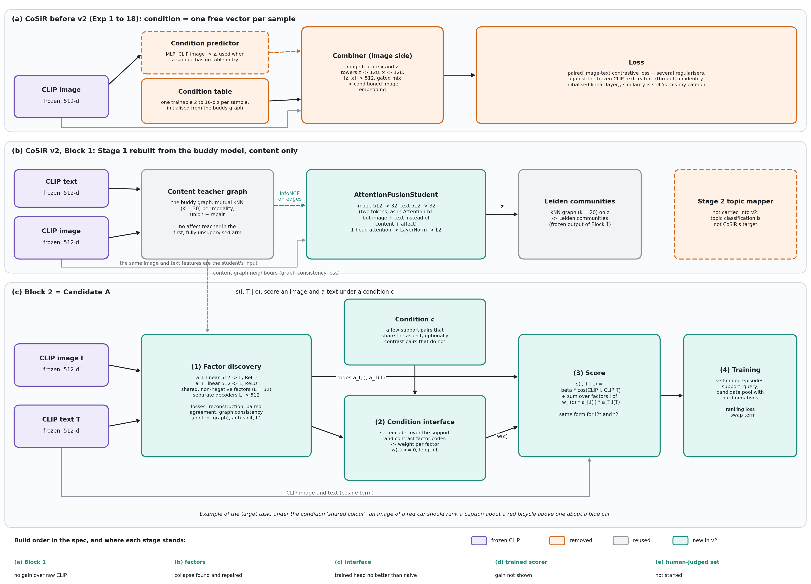
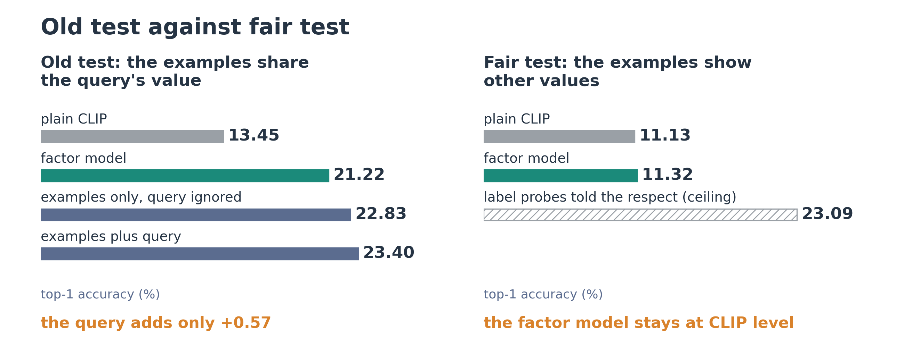
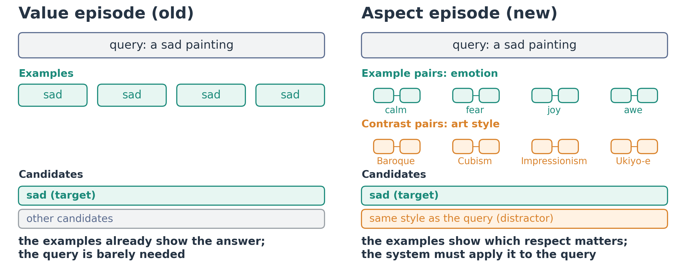
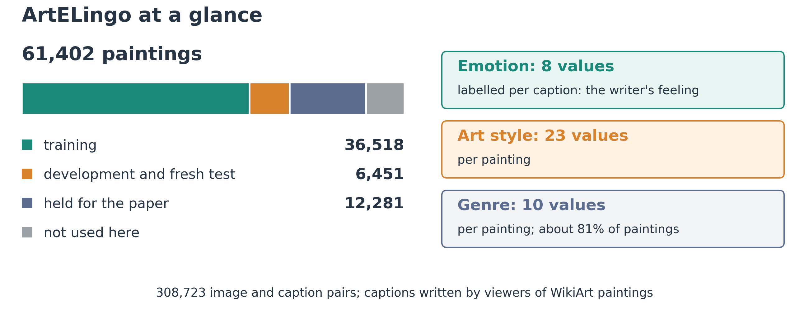
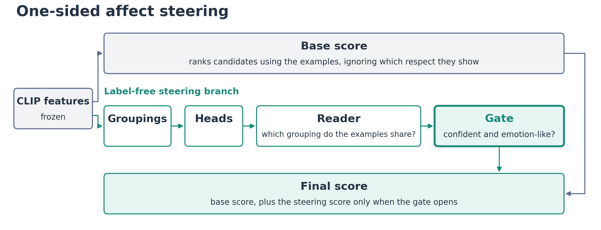
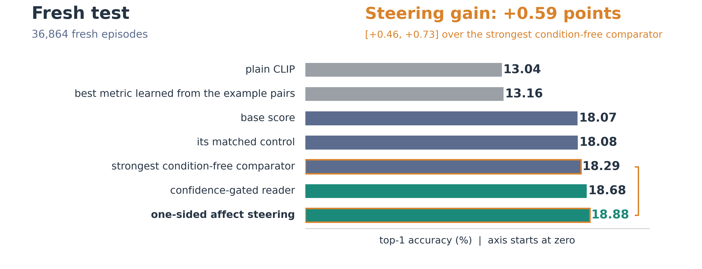
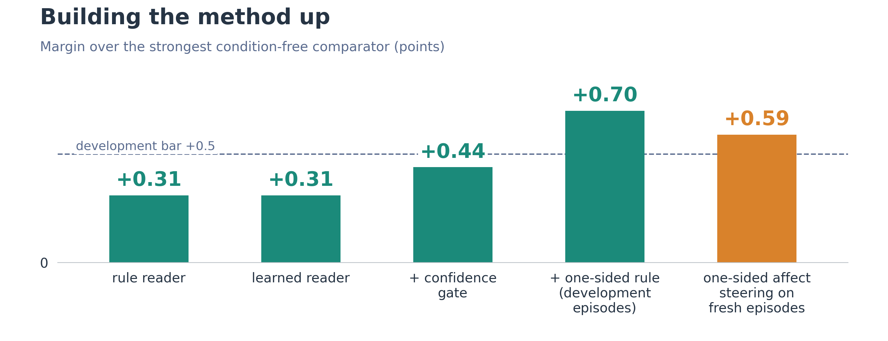

# CoSiR weekly report, 7 October 2026

CoSiR v2: similarity in a respect shown by examples

From factor learning to one-sided affect steering on ArtELingo

Notes: This deck summarises the weekly report docs/reports/weekly/2026-10-07_aspect_task_to_affect_steering.md. Every number is taken from that report and its sources. Abbreviations are avoided in the text; some figures still use the short names (for example R@1 for top-1 accuracy).

---

## Experiment on factor learning with condition examples



- CoSiR v2 maps frozen CLIP image and caption features into a small set of shared factors
- A condition, given by example image and caption pairs, decides which factors matter for a match
- The factors were trained with condition examples built from emotion clusters of the captions and from image clusters, without human labels
- On held-out test examples this beat the same factors without condition training: emotion +2.08 points of top-1 accuracy, style +0.65

Notes: The design figure is last week's CoSiR v2 design. Part (c) is the factor model: two small encoders map CLIP image and caption features to 32 non-negative factors; the condition is read from support pairs and contrast pairs; the score is CLIP cosine plus a condition-weighted factor match. The good result is the affect-signal factor learning held test (+2.08 [+1.51, +2.62] on emotion conditions, +0.65 [+0.07, +1.21] on style conditions, against the same factors without condition training). The emotion signal came from an external classifier, GoEmotions, run over the captions.

---
## Pitfall in the factor-learning test



Left: the old test, where the examples share the query's own value. Right: the fair test, where the examples show other values.

- In the old test, every example pair carried the query's own label ("sad, like these"): the examples gave the answer away
- A prototype of the examples that never looks at the query scored 22.83, above the factor model's 21.22; adding the query added only 0.57
- On the fair test, where the examples show the respect through other values, no factor model beat plain CLIP (11.32 against 11.13)
- Training the factors for the fair test (method A) also failed: its own condition-free version beat it by 2.96 points

Notes: The bars are top-1 accuracy in percent. In the fair test, label probes told the respect reached 23.09 (hatched bar), so the task is learnable; the factors simply did not capture it. Lesson: a gain in top-1 accuracy is not evidence of reading the condition unless it is compared with the same score with the condition removed.
---

## Plan for the CVPR publication


- Revised once after an automated multi-reviewer critique
- A go or no-go decision chooses between a method paper, a benchmark paper and an analysis paper
- Deadlines for the abstract, the paper and the supplementary material are marked in the timeline
- Held-out test data are read once, at the end, for the paper

Notes: The timeline shows the planned experiments by phase with decision points (dashed) and hard deadlines (solid). The three possible papers: a method paper if our method passes on held-out data of three datasets; a benchmark paper if an in-context multimodal language model solves the task while our method does not; otherwise an analysis paper.

---

## Background on conditional similarity

- Image and text models such as CLIP give one similarity number for an image and a caption
- People compare things in a respect: two paintings can share a mood but not a style
- Conditional similarity lets the respect vary, but existing methods need the respect named or labelled:
  - one learned mask per labelled respect (conditional similarity networks)
  - respects discovered from labelled triplets, images only (SCE-Net, DiscoverNet)
  - the respect written as a text phrase (GeneCIS, CLAY, CRL)
- Almost all of them compare images with images, not images with captions

Notes: This is the background of the idea. The gap we target: a respect that is shown, not named, and a match across modalities (image to caption and caption to image).

---

## Idea of showing the respect by examples

- The user gives a few example image and caption pairs that are alike in the wanted respect
- and a few contrast pairs that are alike in a different respect
- The system finds which respect the examples share and ranks candidates of the other modality by it
- Use cases: a designer's mood board of images and captions that "go together"; a searcher marking pairs that match; curating captions written like a set of examples
- The system never sees human labels of the respects it is tested on

Notes: The idea stays close to conditional similarity itself: the condition is the respect, and examples are the most natural way for a user who cannot or will not name it. Any label-free signal (for example an external emotion classifier) may be used and must be stated.

---

## Overview of the task


- The user gives a query, four example pairs and four contrast pairs
- The system reads the shared respect and ranks thirteen candidates
- The candidate that shares the query's feeling should come first; swapping examples and contrasts should bring the style candidate to the top

Notes: The figure is deliberately non-mathematical. In the real benchmark the respects are emotion, art style and genre, and every episode is scored in both directions: an image query ranks captions, a caption query ranks images.

---

## Setting of the aspect episode


- A query: one painting's image (ranking captions) or one viewer's caption (ranking images)
- Four support pairs agree on a value of respect A (for example four different emotions); four contrast pairs do the same for respect B
- Thirteen candidates: one shares the query's value of A (the target), one its value of B (the other respect), eleven share neither
- Three rules: the respect is never named; the examples never show the query's own value; each pair joins an image of one painting with a caption of another

Notes: In this deck "respect" is called an aspect (emotion, style, genre) and its setting a value (a particular emotion, style or genre). Each episode gives four rankings: two conditions (supports and contrasts swapped) times two directions. One draw of episodes holds 12,288 episodes, 4,096 for each aspect pair.

---
## Setting: from value episodes to aspect episodes



- Value episode (old): the examples share the query's own value, so the answer is visible without the query; the query added only 0.57
- Aspect episode (new): the examples show the shared respect through other values; the system must find the respect and then apply it to the query
- The contrast pairs show a second respect, so a candidate that shares only that respect is a built-in distractor
- This rule makes the benchmark measure conditional similarity rather than few-shot recognition of a label

Notes: This slide connects the pitfall of the factor-learning test to the task design: the old value episodes are the reason the factor results looked good, and the aspect episode of the previous slide is the fix. It is also a claim of the benchmark: the value-disjoint rule closes a shortcut that a reviewer would look for first.
---

## Measures for the task

| Measure | Meaning |
|---|---|
| top-1 accuracy | the target ranks first (chance 7.7%) |
| other-respect rate | the other respect's candidate ranks first |
| condition gain | top-1 accuracy minus the other-respect rate; exactly zero for any scorer that ignores the condition |
| either rate | top-1 accuracy plus the other-respect rate: some aspect-sharing candidate ranks first |

- Top-1 accuracy = (either rate + condition gain) / 2
- A method must find aspect-sharing candidates and choose the one the examples point to
- Reading the condition usually costs some either rate, so it pays only if the condition gain is larger

Notes: Example: over 100 rankings, the target comes first 19 times and the other respect's candidate 17 times; the condition gain is 2, the either rate 36, and top-1 accuracy is (36 + 2) / 2 = 19. Intervals throughout are 95% bootstrap intervals over the paintings the queries come from.

---

## Controls and comparators

- **Matched control**: every method is compared with the same score with only the condition removed
- **Condition-free bar**: the best score that uses the examples but ignores which respect they show (18.34 against 12.96 for plain CLIP on the development episodes)
- **External baselines**: plain CLIP, nine metrics learned from the example pairs, in-context multimodal language models
- **Fresh episodes and pre-registration**: methods are chosen on one development draw; the decision rule is written down before a single test on never-used episodes

Notes: Why matched controls matter: one method passed a control that removed two things at once and then lost 1.15 points to its matched control. Without condition gain and matched controls, a condition-free score would have passed the original plan's go rule.

---
## Dataset: ArtELingo



- WikiArt paintings with captions written by viewers: 308,723 image and caption pairs over 61,402 paintings
- Three respects: emotion (8 values, per caption), art style (23 values, per painting), genre (10 values, per painting, about 81% of paintings)
- Split by painting, so no painting is in two splits; the held paintings are kept for the paper's final test
- Emotion lives mainly in the captions and style in the images, for four different backbones, so a cross-modal match is bounded by the weaker side

Notes: The three respects give three aspect pairs: emotion and style, emotion and genre, style and genre. Emotion is labelled per viewer: each caption carries the feeling of the viewer who wrote it. The plan adds CUB birds with human captions, SemArt and GeneCIS; none has been run for the current method yet.
---

## Novelty against prior work

| Neighbour | What it shares with us | What it lacks |
|---|---|---|
| Contextual Visual Similarity | weights from a few examples | images only; examples share the value |
| metric learning from pairs (Xing, RCA, KISSME) | a metric from example pairs | no unnamed respect, no contrast pairs |
| MARS | a relation shown by one example pair | not cross-modal conditional similarity |
| GeneCIS, CLAY, CRL | conditional similarity | the respect is named in text; image to image |
| SCE-Net, DiscoverNet | respects without condition labels | images only |

- To our knowledge, the first cross-modal similarity whose respect is fixed only by value-disjoint, cross-item image and caption examples, with contrast pairs
- Not claimed as new: inferring similarity from examples, label-free condition discovery, distant emotion supervision

Notes: The novelty claim rests on the task and its combination of properties, stated "to our knowledge" within the literature search. The protocol (condition gain, matched controls, swap test) is part of the contribution.

---

## Contributions, now and at full success

| Contribution | What we have now | What a full success would add |
|---|---|---|
| Task, benchmark, protocol | defined and run on ArtELingo with nine metric baselines, two multimodal language models and a condition-free bar | released benchmark on ArtELingo, CUB, SemArt and GeneCIS; held tests read once |
| Method | one-sided affect steering beats every pre-registered condition-free comparator on fresh episodes (+0.59 points) | the same on the held data of three datasets and a second backbone |
| Analysis | emotion in captions, style in images; why reading the condition costs either rate | across annotation protocols; examples against names for each respect |

Notes: The full-success column follows the plan's main claim: on the held data of ArtELingo, CUB and SemArt, beat plain CLIP, the best metric learned from pairs and the method's own condition-removed control on both top-1 accuracy and condition gain. Per-pair results and other comparators are reported beside it.

---

## Experiment on in-context multimodal language models: setting

- Qwen3-VL in two sizes (2 billion and 8 billion parameters), frozen, given the whole episode in one prompt
- Input: an instruction, four example pairs, four counter-example pairs, the query and thirteen candidates lettered A to M (captions as text, or thirteen images in the same context)
- Output: the model's next-token score for each letter; letters are shuffled per episode and mapped back
- Pre-registered success: both top-1 accuracy and condition gain above plain CLIP, with interval lower bounds above zero

```text
Each example pair shows an image and a caption of two different artworks that are alike in one respect. The
counter-example pairs are alike in a different respect. Pick the candidate that is alike to the query in the same
respect as the example pairs. Answer with one letter.
Example pairs:        Pair 1: image<image>  caption: <caption>   ... pairs 2 to 4
Counter-example pairs: Pair 1: image<image>  caption: <caption>   ... pairs 2 to 4
Query: <image>
Candidates: A. <caption>   ... B to M
Answer:
```

Notes: The second condition swaps the two example blocks, so condition gain is computed as for every other method. Images were capped at 200,704 pixels and the models ran in bfloat16; a caption-query prompt holds 21 images. The 2 billion model ran on 900 episodes, the 8 billion model on 1,800 fresh episodes.

---

## Experiment on in-context multimodal language models: results

| Model | Top-1 accuracy | Against plain CLIP | Condition gain | Either rate against CLIP | Works? |
|---|---|---|---|---|---|
| Qwen3-VL, 2 billion | 13.50 | +0.22 [−1.13, +1.53] | −0.53 [−1.68, +0.66] | not reported | no |
| Qwen3-VL, 8 billion | 14.21 | +1.07 [+0.17, +1.93] | +0.21 [−0.51, +0.94] | +1.93 [+0.25, +3.51] | no |

- The 8 billion model put an aspect-sharing candidate first more often than CLIP
- It did not reliably choose the respect the examples showed: its condition gain is indistinguishable from zero
- With no in-context model working, the plan's benchmark-paper option closed

Notes: Read with the identity top-1 accuracy = (either rate + condition gain) / 2: the larger model improved the either part, not the choosing part. The two other failed branches (nine metrics learned from the example pairs, and method A's trained factors) failed in other ways: the metrics did neither; method A chose a little but lost much more in finding.

---
## Method of one-sided affect steering: design



- Example: the query is a painting, the support pairs share a feeling, the contrast pairs share an art style
- The base score ranks the candidates with CLIP similarity and two terms that use the examples, the same whatever respect they show
- The steering branch checks how the support pairs and the contrast pairs fall into three label-free groupings and decides which grouping the supports share
- If it is confident that the shared grouping is the emotion-like one, candidates whose groups match the query's get a boost; otherwise the base score ranks alone

Notes: The next slide gives each component in detail. Nothing uses evaluation labels; the only emotion signal is the external GoEmotions classifier behind the emotion-like grouping. The emphasised gate is the one-sided rule that defines the method.
---

## Method of one-sided affect steering: components

- **Groupings**: three label-free clusterings of the 183,694 training rows: an emotion-like grouping (graph communities of each caption's emotion scores from GoEmotions, 41 groups), and image and caption groupings (64 clusters of CLIP features each)
- **Heads**: logistic regressions on CLIP features place any image or caption in each grouping; two items agree when their group probabilities overlap
- **Learned reader**: a classifier trained on practice episodes built from the groupings themselves (so the answer is known without labels) predicts which grouping the example pairs share
- **Confidence gate**: steer only when the reader's top grouping clearly leads the second
- **One-sided rule**: steer only when that top grouping is the emotion-like one; otherwise keep the base score
- **Fusion**: the steering weight is chosen on one half of the episodes and applied to the other

Notes: Why one-sided: the two conditions of an episode see mirrored evidence, so the gate opens mostly on one side (about 81% of first conditions, 30% of second ones). In the two emotion pairs the first condition is the emotion side, where the base score is weakest: it puts the emotion target first only 10 to 13% of the time.

---
## Test of one-sided affect steering on fresh episodes



- The decision rule and its seven checks were written down before the test episodes were built
- Three never-used draws: 36,864 episodes on 5,195 paintings
- Every check passed: one-sided affect steering beat plain CLIP, the best metric from pairs, the base score, the strongest condition-free comparator and its own matched control, on top-1 accuracy and on condition gain
- An independent re-computation with separate code agreed on every decision number

Notes: The headline: 18.88 against 18.29 for the strongest condition-free comparator (+0.59 [+0.46, +0.73]), against 13.04 for plain CLIP. Condition gain +3.32. All seven checks also passed on each draw alone, and the margin kept 84% of its development value, where earlier fresh tests had halved.
---
## Ablation of one-sided affect steering



- The learned reader alone matched the simple rule; it was kept because the confidence gate needs its probabilities
- The confidence gate doubled the condition gain and raised the margin to +0.44, just short of the +0.5 development bar
- Steering only on emotion-like picks spent the cost only where it pays: +0.70 on development episodes, +0.59 on fresh ones
- Alternatives tried at each step (other readers, a style grouping, vetoes) did worse; they are listed in the report

Notes: Each bar is a margin over the strongest condition-free comparator of its configuration; the development values come from one reused draw of episodes, so the fresh-test bar is the one that counts.
---

## Analysis of where the gain sits

| Aspect pair | Margin over the strongest condition-free comparator |
|---|---|
| emotion and style | +0.810 [+0.585, +1.041] |
| emotion and genre | +1.544 [+1.298, +1.787] |
| style and genre | −0.580 [−0.793, −0.363] |

- The gain sits on the two pairs with emotion; style and genre lose, since no grouping carries style apart from genre
- A random gate that steers the same side as often matched it: the gain comes from steering the right side, which the method finds without labels
- The effect is small in top-1 accuracy (+0.59, about 3% relative) and large in condition gain (+3.3)
- Its parent (the confidence-gated reader) also passed; the one-sided rule added +0.20 on the same episodes

Notes: In our reading the method is a label-free side detector: its emotion pick fires when the contrast pairs look alike and the example pairs do not, which in the emotion pairs is the emotion side. Three vetoes tried afterwards on the development episodes did not improve it.

---

## Ongoing work and plan

- **Caption placement (idea 3)**: place captions in the emotion-like grouping by their own emotion scores, aiming at a sharper emotion signal; specification written, running in its own session
- **Fine-tuned CLIP comparator**: three lightweight variants (linear probe, last block, low-rank adapters) on the DAS6 cluster, to check whether in-domain tuning alone raises the condition-free floor
- **Held-out test**: one main and one reserve read of the 12,281 held paintings, not used yet
- **Not started**: CUB and SemArt for this method, a second backbone
- **Open decisions**: the paper's framing (on hold), how the style-aware comparator enters the held test, how to treat style and genre

Notes: Go or no-go status at the end of the week: the method passes the step before the held test; the method paper still needs held tests on three datasets; the benchmark-paper option closed because no multimodal language model worked; an analysis paper remains available, and the readiness memo adds an ArtELingo-centred paper in between.
