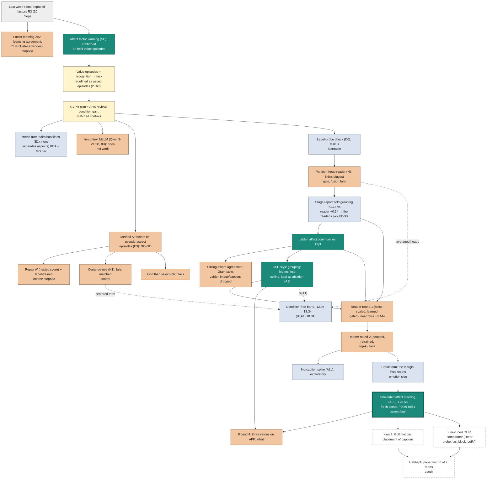

# CoSiR v2, 1 to 7 October: weekly summary (draft for organizing the report)

> Draft of 7 October 2026, not yet a report and not indexed. Covers 1 to 7 October, with the 30 Sep to 1 Oct
> factor-learning steps as a lead-in (the previous weekly report ended on 30 Sep at 08:20). Facts from the week's
> reports; links in each section.

## 1. Timeline

*Figure 1. One row per day (00:00 to 24:00); shape marks the kind of step, colour its outcome, black diamonds the user's decisions.*

Times are Amsterdam time. "(commit)" is when a step was recorded in git, "(run)" the run window stated in the report, and "~" or a word such as "evening" marks an approximate time from session notes. Decisions are in bold.

| Date | Time | What happened | Outcome | Source |
|---|---|---|---|---|
| 30 Sep (lead-in) | 15:15 (commit) | Factor headroom probe (lead-in). | The label oracle reached 49.8% versus repaired factors at 20.5%. | [source](../../auto/v2/2026-10-15_candidate_a_factor_headroom_probe.md) |
| 30 Sep (lead-in) | 17:45 to 18:19 (commits) | Factor learning: painting-level agreement crossed with CLIP-image-cluster condition episodes (lead-in). | No cell qualified: style episodes failed the emotion guard and sparsity gate. | [source](../../auto/v2/2026-10-16_candidate_a_factor_learning_selection.md) |
| 1 Oct (lead-in) | 00:40 to 02:06 (commits) | Affect-signal factor learning (SE): GoEmotions affect clusters plus CLIP image clusters (lead-in). | Held emotion improved +2.08 and style +0.65 over the matched control. | [source 1](../../auto/v2/2026-10-18_candidate_a_affect_factor_learning_selection.md); [source 2](../../auto/v2/2026-10-19_candidate_a_affect_factor_learning_held.md) |
| 2 Oct | 02:53 (commit) | Last weekly report committed. | The previous weekly report was recorded. | [source](../../weekly/2026-09-30_percept_buddy_to_v2.md) |
| 2 Oct | 04:02 (commit) | Support-set baseline spike. | The query-free prototype scored 22.83; adding the query gave only +0.57. | [source](../../auto/v2/2026-10-22_support_baseline_spike.md) |
| 2 Oct | 04:04 (commit) | CVPR literature review. | No prior paper defined the task to our knowledge; label-free condition discovery already existed. | [source](../../auto/v2/2026-10-21_cvpr_literature_review.md) |
| 2 Oct | 04:39 (commit) | Aspect-episode spike. | No factor model selected the aspect: affect factors scored 11.32 versus CLIP at 11.13. | [source](../../auto/v2/2026-10-23_aspect_episode_spike.md) |
| 2 Oct | 05:01 (commit) | Novelty check. | The task and combination were new to our knowledge; the individual ingredients existed. | [source](../../auto/v2/2026-10-24_aspect_task_novelty_check.md) |
| 2 Oct | day (brainstorm, progress note 16:29) | **User:** The condition specifies an aspect, not a value; choose method A, ArtELingo primary, plus CUB, SemArt and GeneCIS. | The task became aspect episodes. | [source](../../../superpowers/specs/2026-10-02-cosir-v2-cvpr-publication-plan-design.md) |
| 2 Oct | 18:59 (commit) | Frozen-backbone check. | Emotion lived mainly in captions and style in images; weak-side probes stayed flat. | [source](../../auto/v2/2026-10-25_backbone_check.md) |
| 2 Oct | 19:22 (commit) | CVPR publication plan: claims, baselines, GO bar and schedule. | The plan was written. | [source](../../../superpowers/specs/2026-10-02-cosir-v2-cvpr-publication-plan-design.md) |
| 2 Oct | 21:57 (commit) | ARS plan review: Major Revision. | Condition gain became co-primary, with a condition-free control and stronger evaluation requirements. | [source](../../auto/v2/2026-10-27_ars_plan_review.md) |
| 3 Oct | 00:31 (commit) | Plan revision 2. | The plan was revised. | [source](../../../superpowers/specs/2026-10-02-cosir-v2-cvpr-publication-plan-design.md) |
| 3 Oct | 02:04 to 04:51 (commits, overnight) | Baselines, label-free partitions and method A built and run (E0 to E3); held-out-aspect and in-context probes failed. | Method A NO-GO: it lost 2.96 R@1 to its own uniform-weight control; RCA (13.38 vs cosine 12.96) became the GO bar. | [source 1](../../auto/v2/2026-10-30_aspect_baselines.md); [source 2](../../auto/v2/2026-10-31_pseudo_partitions.md); [source 3](../../auto/v2/2026-11-01_aspect_factor_gonogo.md) |
| 3 Oct | 13:54 (commit) | **User:** Repair method A (A′) before giving up. | A repair was requested. | session notes |
| 3 Oct | 15:30 to 17:07 (commits) | ARS repair-order review; nested score (A′) and label-trained factors as a diagnostic. | The nested score reached 16.52 versus its control at 16.55; the pre-registered decision stopped the repair. | [source 1](../../auto/v2/2026-11-04_ars_repair_order_review.md); [source 2](../../auto/v2/2026-11-05_method_repair_diagnostics.md) |
| 3 Oct | 20:51 (commit) | In-context probe with Qwen3-VL-8B. | It gained +1.07 R@1 over cosine, but condition gain was only +0.21. | [source](../../stage/2026-10-04_aspect_conditioned_similarity_methods.md) |
| 3 Oct | evening | **User:** Not branch 3 yet; try new methods first. | Candidates N1 to N6 were drafted and checked against the literature. | [source](../../stage/2026-10-04_aspect_conditioned_similarity_methods.md) |
| 4 Oct | 03:09 to 05:08 (commits, overnight, fully automate) | Label-probe check (D0), centered rule (N1), find then select (N2), partition-head readers (N6, N6c). | The centered rule (N1) lost 1.15 to its matched control; the partition reader (N6) reached condition gain 4.41 but its fusion beat its control by only +0.23. | [source](../../auto/v2/2026-11-08_new_method_quick_checks.md) |
| 4 Oct | 14:50 to 15:23 (commits) | Stage report final-reviewed: readers lost either rate as they gained condition gain. | Told the grouping, the heads gained +1.14 over their counterpart; the reader gained +0.14. | [source](../../stage/2026-10-04_aspect_conditioned_similarity_methods.md) |
| 5 Oct | 03:04 (commit) | Stage report revised after a design Q&A. | No number changed. | [source](../../stage/2026-10-04_aspect_conditioned_similarity_methods.md) |
| 5 Oct | 12:57 to 15:01 (commits) | Grouping quality: partition profile, Leiden affect communities and grouping sweep. | Leiden gained +1.64 when told the grouping versus k-means at +1.10. | [source](../../auto/v2/2026-11-12_partition_quality_leiden_communities.md) |
| 5 Oct | by 15:01 (recorded in the draft report) | **User:** The grouping component is not well shaped; redesign it before returning to bars and readers. | Grouping redesign became the next step. | [source](../../auto/v2/2026-11-12_partition_quality_leiden_communities.md) |
| 5 Oct | 15:01 to 21:44 (commits) | Redesign: literature synthesis, initial checks and style groupings; placeability adopted, other additions dropped. | The CSD style grouping reached told gain +2.23, but the reader fell to +0.06. | [source](../../auto/v2/2026-11-12_partition_quality_leiden_communities.md) |
| 6 Oct | night (before 01:20) | **User:** Plan (a), fix the reader with the CSD grouping in the set. | Reader repair was chosen. | session notes |
| 6 Oct | 01:20; 02:25 (~, memory) | ARS methodology review: Major Revision; **User:** Adopt all fixes. | The methodology fixes were adopted. | [source](../../auto/v2/2026-11-17_ars_reader_fix_plan_review.md) |
| 6 Oct | 02:51 to 03:43 (run) | Reader round 1: noise-scaled, learned and confidence-gated readers, with and without CSD. | No candidate cleared: the best margin was +0.444 versus the +0.5 bar. | [source](../../auto/v2/2026-11-18_reader_fix_csd.md) |
| 6 Oct | 07:59 to 15:53 (commits) | Round 1 report final-reviewed; user-read briefing written and checked. | The report and briefing were reviewed. | [source](../../../user_read/2026-10-06_reader_fix.md) |
| 6 Oct | 15:43 to 17:01 (run; rule applied 16:57) | Reader round 2: adaptation, retraining on impure practice episodes and top-k restriction. | No candidate cleared: the unchanged gated reader reached +0.472 versus the +0.5 bar. | [source](../../auto/v2/2026-11-19_reader_fix_round2.md) |
| 6 Oct | 18:11 (~, memory) | **User:** Not design L now; keep improving the gated reader (R1). | Work continued on the gated reader. | session notes |
| 6 Oct | 18:18 (commit) | Exploratory no-caption spike (A1c): affect, image and CSD groupings. | The pooled margin fell to +0.256 from +0.444. | session notes |
| 6 Oct | 18:16 to 18:46 | Exploratory gated-reader levers brainstorm; one-sided affect steering (AFF) emerged. | Development margin reached +0.700 on seed 42, inflated by selection. | [source](../../auto/v2/2026-11-20_r1_levers_brainstorm.md) |
| 6 Oct | 19:10 | **User:** Send one-sided affect steering straight to fresh seeds, with the gated reader beside it. | A fresh test was requested. | session notes |
| 6 Oct | 19:10 to 21:17 (run; verdict 21:16) | Round 3: one-sided affect steering on fresh episode draws, with the gated reader beside it. | GO: affect steering reached 18.88 versus the strongest condition-free scorer at 18.29. | [source](../../auto/v2/2026-11-21_round3_affect_gate.md) |
| 6 Oct | 22:29 to 23:34 (commits) | Round 3 final review confirmed with fixes; user-read briefing covered rounds 1 to 3. | The result was confirmed with fixes. | [source](../../../user_read/2026-10-06_reader_fix_affect_steering.md) |
| 7 Oct | 00:02 (~, memory) | **User:** Option B, improve the method before the held-split paper test. | The held test was deferred for method improvements. | session notes |
| 7 Oct | 00:17 to 02:36 (run) | Round 4: image-agreement abstention, a CSD-informed second reader and both together. | Killed: no veto beat one-sided affect steering (net −18, −18 and −34 rankings of 49,152). | [source](../../auto/v2/2026-11-22_round4_aff_vetoes.md) |
| 7 Oct | 03:39 to 03:55 (commits) | Round 4 report final-reviewed; user-read briefing written. | The veto report and briefing were reviewed. | [source](../../../user_read/2026-10-07_round4_vetoes.md) |
| 7 Oct | before 07:43 | **User:** Idea 3, GoEmotions placement of captions, before the held test, to keep both held reads. | Caption placement was prioritized. | session notes |
| 7 Oct | 07:56 (commit) | CVPR readiness memo: the plan still needs held splits; CUB and SemArt had not started. | Contributions ranked task and protocol, then analysis, then method. | [source](../../stage/2026-10-07_cvpr_readiness.md) |
| 7 Oct | ~08:00 | **User:** Hold paper framing; adopt a lightweight fine-tuned CLIP comparator using linear probe, last block and LoRA, with no full fine-tuning. | The lightweight comparator was adopted. | [source 1](../../stage/2026-10-07_cvpr_readiness.md); [source 2](../../../superpowers/specs/2026-10-07-clip-lightweight-ft-design.md) |
| 7 Oct | 08:05 to 08:16 (commits) | Caption-placement spec committed; CLIP fine-tuning spec, plan and evaluation script in progress. | No results yet. | [source 1](../../../superpowers/specs/2026-10-07-idea3-goemotions-design.md); [source 2](../../../superpowers/specs/2026-10-07-clip-lightweight-ft-design.md) |

## 2. Experiment history

Start at the top and follow the middle path as we changed the task, then the reader. Teal marks what worked or was kept, orange what failed, and slate a diagnostic; dashed boxes mark work in progress or pending.
Dotted arrows show the ingredients that failed methods left in the condition-free bar, the best score that uses the examples but ignores which aspect they show (B).
Grey is the starting point and pale yellow a change of task or plan. The thicker border marks the current best.

Vector version: [flowchart.svg](../../assets/2026-10-07_weekly_draft/flowchart.svg).

The source below renders in viewers with Mermaid support; the PNG above is the same graph.

## 3. What each branch tried, and why it worked or failed

R@1, the rate at which the target comes first, obeys **R@1 = (either rate + condition gain) / 2**.
Condition gain is target-first minus other-aspect-first; either rate counts either aspect coming first, so a gain can be cancelled by finding fewer aspect-sharing candidates.

### Lead-in, factor learning [N1, N2]

We stopped the crossed factor-learning selection because style episodes cost emotion and broke the sparsity gate, while painting-level agreement lowered both. Affect factor learning (SE) added GoEmotions affect clusters, supplying the emotion signal the CLIP-based factors lacked; held emotion improved +2.08 R@1 over the matched control (C0).

> Source: [factor selection](../../auto/v2/2026-10-16_candidate_a_factor_learning_selection.md), [held affect-factor test](../../auto/v2/2026-10-19_candidate_a_affect_factor_learning_held.md).

### The reframe [N3]

On value episodes, such as “sad, like these,” the supports gave the answer away: a prototype ignoring the query reached 22.83, and adding the query improved it by only 0.57. We therefore changed to aspect episodes, where examples showed the aspect through values the query did not have. Factor models still failed to select the aspect, while label probes showed headroom; the backbone check placed emotion mainly in captions and style mainly in images.

> Source: [support baseline](../../auto/v2/2026-10-22_support_baseline_spike.md), [aspect spike](../../auto/v2/2026-10-23_aspect_episode_spike.md), [backbone check](../../auto/v2/2026-10-25_backbone_check.md).

### Plan and review [N4]

The plan review made condition gain co-primary and required matched controls. Without that change, the condition-blind uniform factor term would have passed the original rule: 16.30 R@1 versus cosine at 12.96.

> Source: [plan review](../../auto/v2/2026-10-27_ars_plan_review.md), [publication plan](../../../superpowers/specs/2026-10-02-cosir-v2-cvpr-publication-plan-design.md).

### Baselines and in-context models [N5, N6]

The metric-from-pairs baselines did not separate the aspects. The larger multimodal language model, given examples in its prompt, gained +1.07 R@1 over cosine, but condition gain was only +0.21 with an interval spanning zero: it found aspect-sharing candidates without reliably choosing the demonstrated aspect.

> Source: [aspect baselines](../../auto/v2/2026-10-30_aspect_baselines.md), [stage report](../../stage/2026-10-04_aspect_conditioned_similarity_methods.md).

### Method A and its repairs [N7 to N10]

Method A selected the aspect weakly but lost aspect-sharing candidates, finishing 2.96 R@1 below its own condition-free control; the nested repair (A′) bought condition gain by losing either rate. The centered rule (N1) seemed to pass because its declared control also removed centering, but it lost 1.15 to the matched control. Find then select (N2) promoted negatives during short-list reranking. We kept the lesson that a control must remove only the condition, and the centered condition-free term survived into the bar.

> Source: [method A test](../../auto/v2/2026-11-01_aspect_factor_gonogo.md), [repair diagnostics](../../auto/v2/2026-11-05_method_repair_diagnostics.md), [quick checks](../../auto/v2/2026-11-08_new_method_quick_checks.md).

### Label-probe check and partition reader [N11, N12]

The label-probe check (D0) kept 63% of the told-aspect gain when inferring the aspect from example pairs, showing that reading worked when items carried a block per aspect. The partition-head reader (N6) built those blocks without labels, but fusion beat its matched control by only +0.23, with a lower bound below zero. Its averaged heads survived into the condition-free bar.

> Source: [quick checks](../../auto/v2/2026-11-08_new_method_quick_checks.md).

### The diagnosis [N13]

Told the right grouping, the heads beat their counterpart by +1.14; with the label-free reader, they beat it by only +0.14. The heads were good enough, but the reader's choice blocked progress.

> Source: [stage report](../../stage/2026-10-04_aspect_conditioned_similarity_methods.md).

### Groupings [N14 to N16]

We kept Leiden affect communities because they were more emotion-coherent than k-means, and dropped sibling-aware agreement, Gram style and Leiden image/caption additions. The style grouping (CSD) tracked style at least as well as genre and raised told-grouping improvement to +2.23 over the counterpart, but the reader's improvement fell to +0.06. The extra grouping also lifted condition-free comparators, and the reader picked it for genre conditions.

> Source: [grouping quality and redesign](../../auto/v2/2026-11-12_partition_quality_leiden_communities.md).

### Reader rounds 1 and 2 [N17, N18]

The learned reader picked well on practice episodes built from the groupings, but only about half the time on real episodes. The confidence-gated reader (R1) improved condition gain but paid most of it back in either rate: +0.444 over the bar comparator versus the required +0.5. Adaptation made the reader more confident but less accurate, while retraining made it more accurate but flatter; both lowered the margin.

> Source: [reader round 1](../../auto/v2/2026-11-18_reader_fix_csd.md), [reader round 2](../../auto/v2/2026-11-19_reader_fix_round2.md).

### The brainstorm [N20]

Taking the gated reader's margin apart showed that it came from lifting the emotion candidate when examples showed emotion, where the condition-free scorer was weakest. Steering with image or caption groupings never paid because the bar already used that information. The exploratory no-caption spike (A1c, graph node N19) improved style × genre (episodes whose examples share a style and whose contrasts share a genre) but lost emotion with genre and lowered the pooled margin.

> Source: [reader-levers brainstorm](../../auto/v2/2026-11-20_r1_levers_brainstorm.md); session notes for the no-caption spike.

### One-sided affect steering [N21]

We steered only when the reader picked the affect grouping; one-sided affect steering (AFF) passed every pre-registered check on fresh episode draws, gaining +0.591 R@1 over the strongest condition-free scorer. A random gate steering the same side as often did as well, so the evidence supported a side detector, a visual-contrast rule, rather than an emotion reader. It still lost on style × genre, at −0.58 versus the condition-free scorer. The unchanged gated reader also passed descriptively.

> Source: [fresh-seed affect-steering test](../../auto/v2/2026-11-21_round3_affect_gate.md).

### Round 4 [N22]

The vetoes could only switch steering off, and every label-free veto also removed emotion-side steering that paid. None beat one-sided affect steering; the CSD-informed vetoes additionally faced a stronger condition-free floor rebuilt with their own groupings (B′).

> Source: [affect-steering vetoes](../../auto/v2/2026-11-22_round4_aff_vetoes.md).

### The condition-free bar [NB]

Failed methods left useful condition-free ingredients: the centered factor term and the averaged partition heads. Together they raised the bar a method must beat from 12.96 (cosine) to 18.34 (B), and rebuilding it with the style grouping raised it to 18.81 (B′(A1), seed 42). One-sided affect steering's +0.59 is measured against this raised bar, not against cosine, which is why it is the week's main result.

> Source: [stage report](../../stage/2026-10-04_aspect_conditioned_similarity_methods.md), [veto comparators](../../auto/v2/2026-11-22_round4_aff_vetoes.md).

### Where it stands [N23 to N25]

One-sided affect steering, frozen as tested, is the current best. Caption placement aims to sharpen the caption-side affect term so the same gain needs less weight, while the lightweight fine-tuned CLIP comparator checks whether in-domain adaptation alone raises the emotion-side floor. The held-split paper test remains pending.

> Source: [readiness memo](../../stage/2026-10-07_cvpr_readiness.md), [caption-placement design](../../../superpowers/specs/2026-10-07-idea3-goemotions-design.md), [lightweight comparator design](../../../superpowers/specs/2026-10-07-clip-lightweight-ft-design.md).

## 4. Open now

- Caption placement (Idea 3) and the lightweight CLIP comparator are in progress; their specs were committed, with no results yet. [Designs: caption placement](../../../superpowers/specs/2026-10-07-idea3-goemotions-design.md), [CLIP comparator](../../../superpowers/specs/2026-10-07-clip-lightweight-ft-design.md).
- The held-split paper test is pending, with both held reads preserved; CUB and SemArt had not started. [Readiness memo](../../stage/2026-10-07_cvpr_readiness.md).
- Paper framing remains on hold by the user's decision. How the bar rebuilt with the style grouping enters the held test, and how to handle style × genre, remain user decisions. [Readiness memo](../../stage/2026-10-07_cvpr_readiness.md); session notes.
