# Weekly report, 1 to 7 October 2026: the factor line stopped, the task became aspect episodes, and one-sided affect steering passed its fresh test

> Draft v1, written 7 October 2026. CoSiR v2, main branch. Covers 1 to 7 October, with the factor-learning steps of
> 30 September to 1 October as a lead-in (the [previous weekly report](../2026-09-30_percept_buddy_to_v2.md) ended on
> 30 September at 08:20). Every number comes from the report linked in its section. Lines marked **Verdict
> (reference)** are our reading of the results; they decide nothing.

## Summary

- **The factor line stopped as a way to read the condition.** The last factor model passed its held test on 1 October,
  but on 2 October we found that this test measured few-shot recognition of a label, not conditional similarity. On a
  fair test the factors ignored the condition, and method A, which trained them for it, failed its pre-registered GO
  test on 3 October. Their condition-free part survives inside the bar every later method had to beat.
- **The task was reframed.** The condition now names an *aspect* (emotion, style or genre) through example pairs whose
  values differ from the query's, and every result is scored on condition gain and against a matched control. This
  became the problem definition of the CVPR plan (abstract 10 November).
- **Of four method branches, only the middle one passed** (the middle line of Figure 5). Metric learning from pairs,
  in-context multimodal LLMs and method A with its repairs all failed. The line built on label-free groupings and a
  learned reader produced the week's one pass.
- **One-sided affect steering (AFF) passed all seven pre-registered checks on 36,864 fresh episodes.** Its R@1 was 18.88
  against 18.29 for the strongest scorer that ignores the condition, +0.591 [+0.462, +0.729].
- **The pass has limits.** The gain sits on the two pairs that involve emotion, AFF loses on style × genre (−0.580), a
  random gate that steers the same side as often did as well, its parent reader (without the one-sided restriction)
  also passed, and the test used new episodes from the development paintings, not the held paintings.
- **The novelty lies mostly in the task and its protocol.** AFF itself is a modest method: a side detector distantly
  supervised by a GoEmotions classifier.

## How we got here

CoSiR asks whether an image and a caption match *in a given respect*: two paintings can be alike in mood and unlike in
style. CoSiR v2, rebuilt on 28 September, scores an image and a caption under a condition given by a few example pairs.
Last week ended with a decision: make the shared image and caption factors condition-aware during training.

The methods below use ArtELingo (WikiArt paintings with viewer captions, each caption labelled with the viewer's
emotion; style and genre belong to the painting) and frozen CLIP ViT-B/32 features, plus two external signals where
stated (the GoEmotions emotion classifier and the CSD style encoder). Evaluation labels only score results, except in
diagnostics marked as such (label probes, label-trained factors); one check (§2.3) compares other backbones.

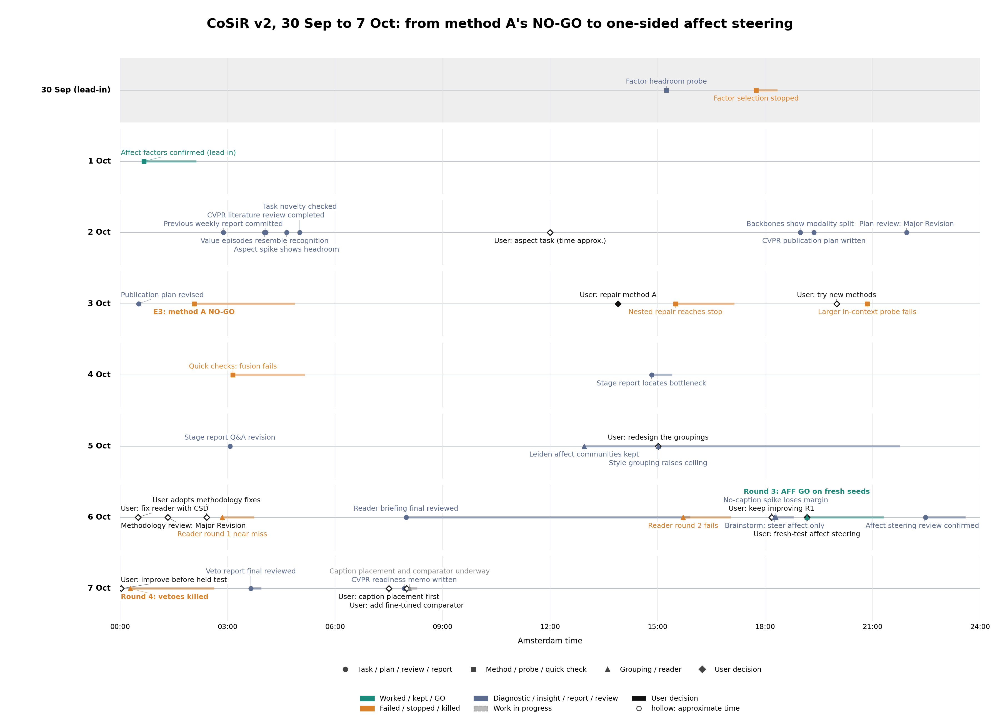

*Figure 1. The week, one row per day (00:00 to 24:00, Amsterdam time). Shape marks the kind of step, colour its
outcome, black diamonds the user's decisions. Much of the work ran overnight. The full table of steps is in the
[summary draft](2026-10-07_summary_draft.md#1-timeline).*

This report follows four questions: what happened to the factor line (§1), how the task was reframed (§2), which
method branches were tried and why only one passed (§3), and why the one that passed counts as a GO, against what, and
what is new about it (§4).

**Terms used throughout** (full definitions in §2.1 and §2.2, and a glossary at the end):

- **R@1**: the share of rankings in which the right candidate comes first, in percent; differences are in points.
- **Value episode** (used until 2 October): a few example pairs show one value, such as "sad", and the system ranks
  candidates for a query. **Aspect episode** (from 2 October): 4 example pairs (supports) show an unnamed aspect through
  values the query does not have, 4 contrast pairs show another aspect, and 13 candidates are ranked. The two kinds of
  episode give R@1 on different scales.
- **Condition gain**: how much more often the shown aspect's candidate comes first than the other aspect's; exactly 0
  for a scorer that ignores the condition. **Either rate**: how often a candidate sharing either aspect comes first.
- **Matched control**: the same score with only the condition removed. **B**: the best score that uses the examples
  but ignores which aspect they show (the condition-free bar).
- **Development episodes**: one reused draw of episodes (seed 42), used to choose methods. **Fresh episodes**: new
  draws (seeds 43 and later), each used for one test. **Held paintings**: a separate set reserved for the paper's final
  test. They have not been read for aspect episodes; their last read was SE's value-episode test on 1 October.
- Model names: **SE**, **C0** and **R3** are versions of the shared image and caption factors; **method A** trained
  them for aspects; **AFF** is the week's passing method (§4).

## 1. The factor line: what the last results showed, and why it stopped

### 1.1 The last factor results looked good

On 30 September and 1 October we trained the shared factors with condition episodes. The first design (painting-level
agreement and CLIP-image-cluster episodes, a 2 × 2 grid) stopped: no cell qualified. The CLIP-image-cluster episodes
raised pooled R@1 by +1.44 over the matched control, all of it from style (+3.61 on style conditions), but broke the
emotion guard and the sparsity gate.

The second design, **SE**, trained the factors on condition episodes built from two label-free sources: clusters of
the captions' GoEmotions emotion scores (GoEmotions is a public Reddit emotion classifier, never trained on ArtELingo)
and clusters of CLIP image features. Against its matched control C0 (the same factors without condition training) it
passed the held test on fresh held episodes (under the revised rule, in which sparsity had become report-only; SE's
caption codes still exceeded the cap):

| SE minus C0, held episodes (8,192 per label) | R@1 [95% interval] |
|---|---|
| emotion conditions | +2.08 [+1.51, +2.62] |
| style conditions | +0.65 [+0.07, +1.21] |

> Sources: [factor-learning selection](../../auto/v2/2026-10-16_candidate_a_factor_learning_selection.md),
> [affect factor learning, held test](../../auto/v2/2026-10-19_candidate_a_affect_factor_learning_held.md).

### 1.2 The test measured recognition, not conditional similarity

These were **value episodes**: the examples show one value ("sad, like these"): the 4 support pairs carry the query's own
label, while the contrast pairs and the distractors lack it. On 2 October a check with simple baselines showed that the examples give the
answer away (Figure 2a):

- a prototype of the examples that never looks at the query scored 22.83 R@1, already above SE's 21.22;
- adding the query moved it by only +0.57 [+0.20, +0.96];
- a logistic probe fitted on the example pairs (raw CLIP features) scored 24.10, +2.87 [+2.14, +3.64] above SE.

The first v2 result reads the same way. On held value episodes the repaired factors R3 (last week's fix of a
collapsed factor layer) reached 17.6 / 20.9 R@1 (image to caption / caption to image) against 11.5 / 14.9 for CLIP,
but R3 with the condition ignored already reached 15.6 / 15.7. The part that depends on the condition (+2.0 / +5.2)
measured recognition of the value from the supports, the shortcut above.

The value-episode numbers in this section and the aspect-episode numbers below come from different tasks, so their R@1
levels are not comparable with each other.

> Sources: [support-set baseline spike](../../auto/v2/2026-10-22_support_baseline_spike.md), stage report
> [§3](../../stage/2026-10-04_aspect_conditioned_similarity_methods.md#3-how-the-task-was-arrived-at).

### 1.3 On a fair test the factors ignored the condition

On **aspect episodes** (§2.1), where the examples show an aspect through values the query does not have, no factor
model chose the aspect. On 4,096 emotion × style episodes SE scored 11.32 against CLIP's 11.13 (+0.20 [−0.12, +0.50]);
C0, R3 and a raw-CLIP agreement rule were also at CLIP level (Figure 2b). The task itself was not the obstacle: label
probes told the aspect reached 23.09.

The factors still raised R@1, but only by finding candidates that share *some* aspect with the query. With the
condition removed (uniform weights), SE's factor term reached 16.30 R@1 against cosine's 12.96 on the development
episodes, at a condition gain of exactly 0.

> Sources: [aspect-episode spike](../../auto/v2/2026-10-23_aspect_episode_spike.md),
> [E1 baselines](../../auto/v2/2026-10-30_aspect_baselines.md).

### 1.4 Method A tried to train the factors for aspects, and failed its GO test

**Method A** trained the shared factors on *pseudo-aspect episodes*: episodes built like the real ones, but from three
label-free clusterings of the training rows (affect from GoEmotions, image and caption from CLIP) instead of labels. A
training-free agreement rule read the factor weights from the example pairs. Of six training runs, the pre-registered
pick A3 was tested once on fresh episodes (seed 43, Figure 2c), against cosine (plain CLIP), RCA (relevant component
analysis, the best metric learned from the example pairs and the plan's GO bar) and its own condition-free control:

| Comparator | Its R@1 | A3 minus it, R@1 | A3 minus it, condition gain |
|---|---|---|---|
| cosine | 13.53 | +0.23 [+0.00, +0.46] | +0.26 [−0.04, +0.56] |
| RCA, the GO bar | 13.52 | +0.24 [+0.00, +0.48] | +0.32 [+0.01, +0.64] |
| A3's own condition-free control | 16.72 | **−2.96 [−3.29, −2.64]** | +0.26 [−0.04, +0.56] |

**NO-GO.** The agreement term did select the aspect (condition gain 0.97 [0.53, 1.41] alone), but it ranked an
aspect-sharing candidate first (its either rate) in only 21.4% of rankings, against 27.1% for cosine and 33.4% for its
control. Since R@1 = (either rate + condition gain) / 2 (§2.2), a gain of about 1 point could not make up for that.

A repair (A′) kept the condition-free term and added the conditioned one on top. It reached 16.52 against its control's
16.55; factors trained on the evaluation labels, as a diagnostic, doubled the term's gain (1.85 against 0.99), but
inside the fused score their condition gain was only 0.01 to 0.05, below the pre-registered bar of 0.218. The pre-registered decision stopped the repair on 3 October.

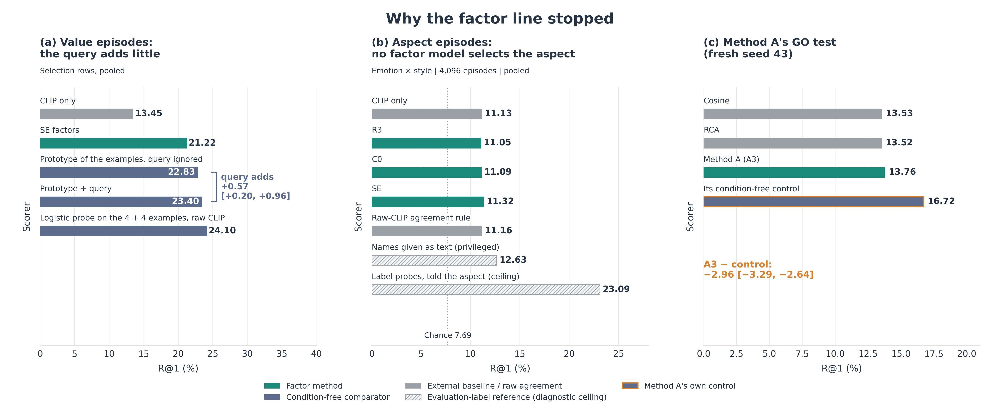

*Figure 2. (a) Value episodes: the examples alone nearly solve them. (b) Aspect episodes: every factor model stays at
CLIP level, while label probes show headroom. (c) Method A's GO test: its own condition-free control beats it. Hatched
bars use evaluation labels and are references, not methods.*

> Sources: [E2 partitions](../../auto/v2/2026-10-31_pseudo_partitions.md),
> [E3 go/no-go](../../auto/v2/2026-11-01_aspect_factor_gonogo.md),
> [repair diagnostics](../../auto/v2/2026-11-05_method_repair_diagnostics.md).

**Verdict (reference).** As a way to read the condition, the factor line ended on 3 October. Its condition-free part
survives: a centered version of method A's factor term is one of the three ingredients of B, the condition-free score
every later method had to beat (§3.3).

## 2. The reframe: aspect episodes and the CVPR plan

### 2.1 The decision and the task

**The decision (2 October, the user's).** Value episodes were dropped as the main task, because the examples alone
solve them (§1.2). The condition now names an **aspect**, never a value, and the examples never carry the query's own
value, so a system has to read *which respect* the examples share and apply it to the query. Two findings of the same
morning made this a viable task: on aspect episodes every factor model sat at CLIP level, yet label probes reached
23.09 against CLIP's 11.13 (§1.3), so the task is hard and learnable. The same day the user also fixed the benchmarks
(ArtELingo first, then CUB, SemArt and GeneCIS) and the method to try first (method A). The user noted that this
framing departs from CoSiR's original storyline but is clearer and more specific.

An **aspect episode** has:

- a **query**: one painting's image (ranking captions) or one viewer's caption (ranking images);
- **4 support pairs**: each an image of one painting with a caption of another, the two agreeing on a value of aspect
  A and differing on B; the four pairs show four different values, none of them the query's;
- **4 contrast pairs**, built the same way for a second aspect B;
- **13 candidates** in the other modality: p_A shares the query's value of A, p_B its value of B, 11 negatives share
  neither. All 13 differ from the query on the third aspect; the example pairs are not controlled on it.

Emotion is labelled per viewer (each caption has its writer's emotion), style and genre per painting.

Swapping supports and contrasts makes p_B the target. The aspect is never named. ArtELingo gives three aspects (8
emotions, 23 styles, 10 genres) and three **aspect pairs**: emotion × style, emotion × genre and style × genre. One
**episode seed** draws 12,288 episodes from the 6,451 selection paintings; seed 42 is the development draw, and later
seeds are fresh draws for tests. The 12,281 held paintings stay reserved for the paper's final test.

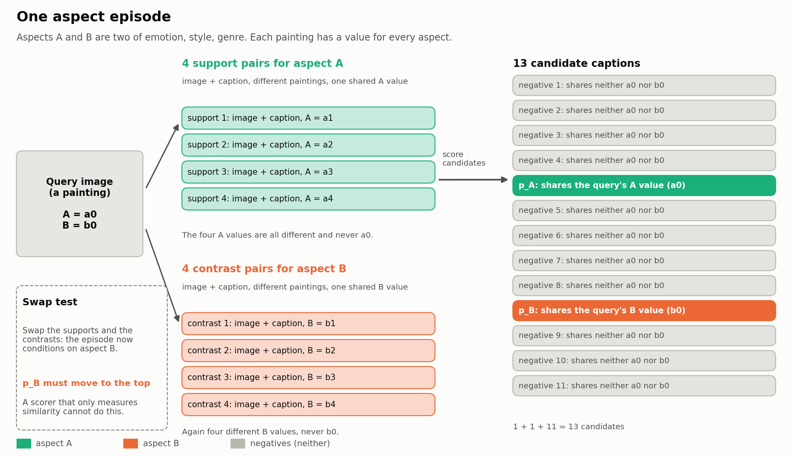

*Figure 3. One aspect episode. Teal: support pairs (aspect A); orange: contrast pairs (aspect B); grey: negatives.
Swapping supports and contrasts must move p_B to the top. From the stage report of 4 October.*

### 2.2 How a result is measured

Each episode gives four rankings (two conditions, two directions):

| Measure | Meaning |
|---|---|
| R@1 | the target ranks first (chance 7.7%) |
| other-aspect rate | the other aspect's candidate ranks first |
| **condition gain** | R@1 minus the other-aspect rate; exactly 0 for any scorer that ignores the condition |
| **either rate** | R@1 plus the other-aspect rate: how often *some* aspect-sharing candidate ranks first |

From these, **R@1 = (either rate + condition gain) / 2**. A scorer can raise R@1 by finding aspect-sharing candidates
more often or by choosing the conditioned one more often. A scorer that reads the condition gains only if its condition
gain outgrows what it loses in either rate. This identity explains most of §3.

Two rules came from the plan's review and hold for every result below:

- **Matched control**: each method is compared with the same score with *only* the condition removed. On 4 October a
  method passed a control that also removed a second ingredient, and lost 1.15 R@1 to the matched one (§3.1).
- **Condition-free bar**: B is the best score that uses the examples but ignores which aspect they show. A method must
  beat B, B rebuilt on the method's own groupings (B′; written B′(A0) for the groupings without the style grouping of
  §3.2 and B′(A1) with it), and its matched control.

On aspect episodes, intervals are 95% bootstrap intervals over anchor paintings (5,000 resamples), with fitted models
and cross-fit choices held fixed; candidate and example paintings recur across episodes and are not clustered. The
earlier value-episode tests (§1) resampled episodes.

### 2.3 What the data allow

Emotion is carried mainly by the captions and style by the images (genre was not part of this check). A cross-modal match is
capped by the weaker side. Four frozen backbones barely move the weak side (emotion read from images 35.1 to 36.6,
style read from captions 25.4 to 26.3) while moving the strong side by up to 11 points (Figure 4). The asymmetry is not
specific to one backbone; whether it comes from the modalities or from how the captions were collected is not
separated.

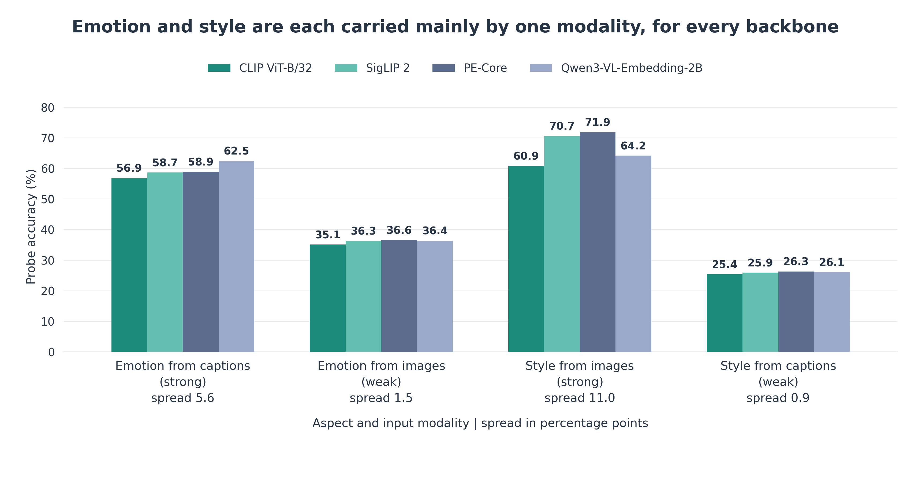

*Figure 4. Probe accuracy for each aspect read from each modality, for four frozen backbones. The spread across
backbones is written under each group.*

The task is learnable when items carry one block of features per aspect. With label-probe posteriors as items (a
diagnostic that uses the labels), inferring the aspect from the example pairs reached 25.02 R@1 on the development
episodes, 2.48 [2.11, 2.84] above the same probes with the condition ignored (22.54); cosine scores 12.96 on the same
episodes. Measured by condition gain, the inferred aspect kept 63% of what the probes reach when told the aspect
(13.33 against 21.06; R@1 30.66 when told).

> Sources: [backbone check](../../auto/v2/2026-10-25_backbone_check.md), stage report
> [§9.1](../../stage/2026-10-04_aspect_conditioned_similarity_methods.md#91-d0-the-aspect-can-be-read-from-the-pairs-when-items-carry-aspect-blocks).

### 2.4 The plan and its review

The CVPR plan (written 2 October, revised 3 October) set three contributions:

| Claim | Content |
|---|---|
| C1 | the task, its benchmark and its protocol |
| C2 | a method that reads the aspect from the examples (in the plan: shared sparse image and caption factors read by a training-free agreement rule, which became method A) |
| C3 | an analysis of how the aspects are carried by the two modalities |

A pre-registered GO test chose between three papers: a method paper (the method beats cosine, RCA and its own
condition-free control on R@1 and on condition gain), a benchmark paper (an in-context multimodal LLM works while our
method does not), or an analysis paper (neither).

An automated five-seat review (ARS, one model family, no human reviewer) returned Major Revision. It made condition
gain co-primary and added the condition-free control, the clustered bootstrap, a held-out-aspect test and the MLLM
baseline. Without these changes, SE's condition-blind factor term (16.30 R@1 against 12.96) would have passed the
original GO rule.

**Status.** The task framing is settled. The paper's framing (method paper, ArtELingo-centred paper, or benchmark and
analysis paper) has been on hold since 7 October.

> Sources: [CVPR plan](../../../superpowers/specs/2026-10-02-cosir-v2-cvpr-publication-plan-design.md) §3, §4, §10;
> [ARS plan review](../../auto/v2/2026-10-27_ars_plan_review.md).

## 3. One week of method branches: only the middle line passed

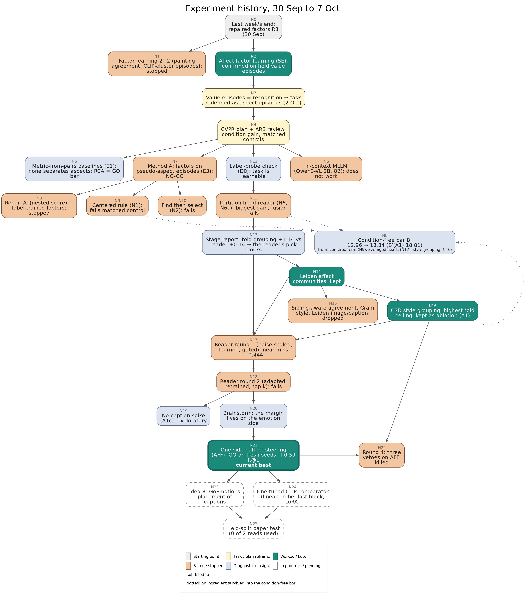

*Figure 5. The experiment tree of the week. Teal: worked or kept; orange: failed or stopped; slate: diagnostic; dashed:
in progress. Dotted arrows show what failed methods left in the condition-free bar B. Node ids (N0 to N25) match the
[summary draft](2026-10-07_summary_draft.md#3-what-each-branch-tried-and-why-it-worked-or-failed).*

*Table 1. The four branches of Figure 5, left to right, and the best result of each against its own comparator.*

| Branch | What it tried | Best result | Comparator | Outcome |
|---|---|---|---|---|
| Metric from pairs (left) | nine ways to learn a metric from the example pairs, including the classic metric-learning methods KISSME, RCA and Xing's, per-query weights, probes and a cache of the examples | RCA 13.38 R@1; every condition gain within 0.4 of 0 | cosine 12.96 | no baseline separates the aspects; RCA became the GO bar |
| Method A and its repairs (left) | factors with an agreement rule (method A), a nested repair (A′), a centered rule (N1), find then select (N2) | best: the centered rule, +0.24 over a control that turned out to be confounded | own matched control | all below or level with their matched controls |
| **Middle line** | label-free groupings, heads that place images and captions in them, a learned reader, and finally one-sided affect steering | AFF +0.591 [+0.462, +0.729] on fresh episodes | strongest condition-free scorer | **GO** (§4) |
| In-context MLLM (right) | Qwen3-VL 2B and 8B given the whole episode in the prompt | 8B: R@1 +1.07 [+0.17, +1.93], gain +0.21 [−0.51, +0.94] | cosine | finds aspect-sharing candidates, does not pick the shown aspect |

> Sources: [E1 baselines](../../auto/v2/2026-10-30_aspect_baselines.md), stage report
> [§4 to §10](../../stage/2026-10-04_aspect_conditioned_similarity_methods.md#4-baselines-nine-ways-to-read-pairs-none-separates-the-aspects-e1).

### 3.1 The wall: reading the condition costs either rate

Figure 6 puts each method of the week beside its own condition-free control on the development episodes. Reading the
condition always lowered the either rate, so a method gained R@1 only where its condition gain was larger still. Table 2
shows the trade for the methods whose reports split it.

*Table 2. What each method added in condition gain, what it lost in either rate, and the net R@1 over its matched
control (R@1 = (either + gain) / 2).*

| Method | Episodes | Condition gain added | Either rate change | R@1 over matched control |
|---|---|---|---|---|
| centered rule (N1) | development | | | −1.15 [−1.38, −0.92] |
| partition-head reader (N6) | development | +1.69 | −1.23 | +0.23 [−0.01, +0.47] |
| N6 on the centered base (N6c) | development | +1.19 | −0.88 | +0.15 [−0.06, +0.38] |
| gated learned reader (R-c, round 1) | development | +2.667 | −1.780 | +0.444 [+0.216, +0.674] |
| one-sided affect steering (AFF) | development | +3.111 | −1.630 | +0.741 [+0.520, +0.960] |
| one-sided affect steering (AFF) | fresh, pooled | +3.319 | −1.727 [−1.907, −1.546] | +0.796 [+0.670, +0.920] |

The centered rule first looked like a pass (+0.24) against a control that dropped its centering as well as the
condition; the matched control removed that pass, and on fresh episodes it was NO-GO. This is why every comparison
since uses matched controls. Method A's own term is not in the table: alone it found an aspect-sharing candidate in
21.4% of rankings against 33.4% for its control (fresh seed 43).

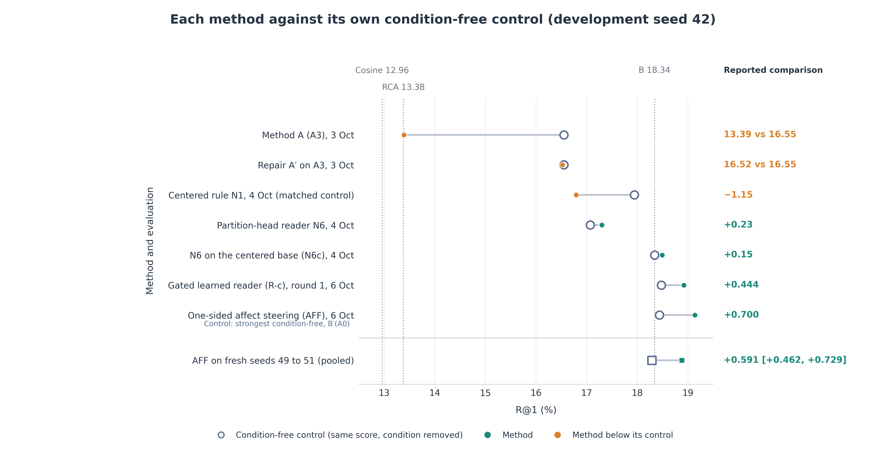

*Figure 6. R@1 of each method and of its condition-free control on the development episodes (seed 42), in the order
they were tried; the last row is AFF on the fresh episodes. Dotted lines: cosine, RCA and B on seed 42.*

> Sources: stage report [§9 to §11](../../stage/2026-10-04_aspect_conditioned_similarity_methods.md#9-quick-checks-d0-n1-n2-and-the-fresh-seed-test-night-of-3-to-4-october),
> [quick checks](../../auto/v2/2026-11-08_new_method_quick_checks.md), round 1 and round 3 reports.

### 3.2 The middle line, step by step

**Partition heads (4 October).** The partition-head reader (N6) placed every image and caption into the three
label-free groupings with logistic regressions on CLIP features (the *heads*), and a reader picked the grouping on
which the support pairs agree more than the contrast pairs.
Scored alone, the reader reached a condition gain of 4.41 [3.96, 4.87], the largest without labels so far, but once
fused it did not clear its control (+0.23 [−0.01, +0.47]).

**Where the block was.** Told the right grouping from the labels (a ceiling, not a method), the same heads beat their
matched control by +1.14 [0.90, 1.41]; the label-free reader beat it by +0.14 [−0.04, 0.32], and picked the right grouping in 52.4% of
rankings. The heads were good enough; the reader's choice was the block.

**Groupings (5 October).** The affect k-means clusters carried emotion (same-emotion pairs shared a cluster 2.17 times
as often as other pairs), but little survived the heads (1.11 times). Replacing them with Leiden communities on the same
GoEmotions probabilities (Leiden is a graph clustering method) raised the told margin; a style grouping built from CSD,
a pretrained style encoder, raised it further, but the label-free reader on it fell to about 0 (Figure 7):

| Grouping set | Told margin over the matched control | Label-free reader's margin over the matched control |
|---|---|---|
| k-means affect, 64 groups | +1.14 [0.90, 1.41] | +0.14 [−0.04, 0.32] |
| k-means affect, 41 groups (control) | +1.10 [0.81, 1.40] | +0.16 [0.00, 0.33] |
| Leiden affect communities, 41 groups | +1.64 [1.37, 1.92] | +0.35 [0.15, 0.57] |
| Leiden + CSD style grouping | +2.23 [1.93, 2.56] | +0.06 [−0.15, 0.28] |
| Leiden + a random fourth grouping (control) | +0.67 [0.40, 0.95] | +0.25 [0.09, 0.42] |

The CSD grouping is the first that tracks style at least as well as genre, so the told ceiling rose on style × genre.
The reader could not use it: the extra grouping lifted the condition-free comparators too, and the reader picked it for
genre conditions (70.5% of emotion × genre genre conditions).

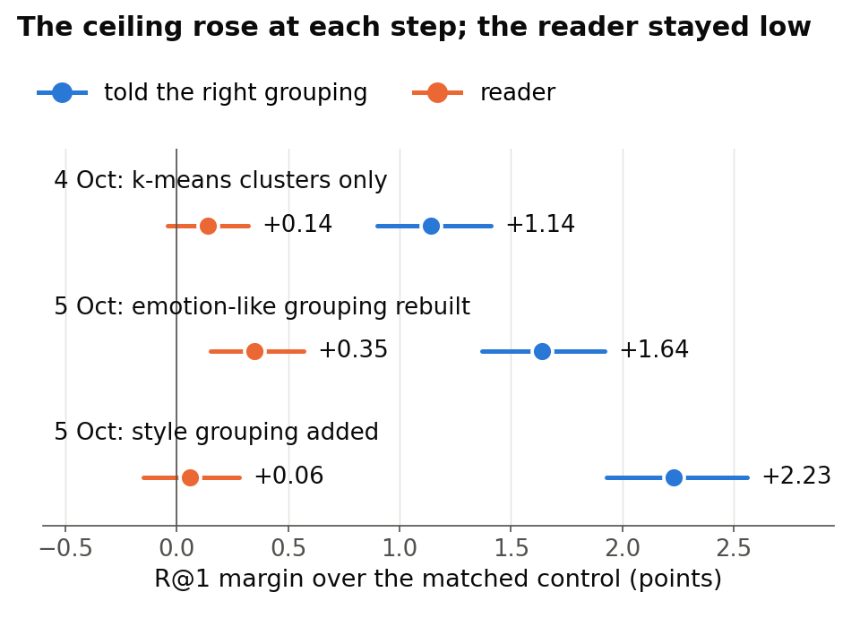

*Figure 7. Told ceiling and label-free reader, as margins over the matched control, at three grouping steps (from the
6 October briefing).*

**Reader rounds 1 and 2 (6 October).** Each ran under a decision rule committed before any result, on the development
episodes, against a development bar: a margin of at least +0.5 R@1 over the strongest condition-free comparator, with
its lower bound above 0, and a condition gain whose lower bound is also above 0. Clearing it would earn one test on
fresh episodes.

| Round | Reader | Margin over the strongest condition-free comparator | Note |
|---|---|---|---|
| 1 | old rule (largest support-minus-contrast agreement) | +0.313 [+0.102, +0.528] | reference |
| 1 | noise-scaled rule | +0.230 [+0.028, +0.437] | picked the empty control grouping more often |
| 1 | learned reader, probability-weighted | +0.313 [+0.076, +0.550] | right pick about 79% on practice episodes, 51.3% on real ones |
| 1 | **learned reader with a confidence gate (R-c)** | **+0.444 [+0.216, +0.674]** | doubled the condition gain (+2.667), paid most of it in either rate |
| 2 | the same gated reader (R1), in a larger family | +0.472 [+0.240, +0.703] | no change to the reader |
| 2 | reader adapted to real episodes | +0.116 [−0.073, +0.301] | more confident, less accurate (pick 47.2%) |
| 2 | reader retrained on impure practice episodes | +0.077 [−0.111, +0.271] | more accurate (55.7%) but flatter, half the gain |

No reader cleared +0.5, so no fresh test was built. With the CSD grouping in the set no margin rose clearly, and most fell.

**Where the margin lived (6 October, exploratory).** Taking the gated reader's margin apart on the development
episodes located nearly all of it in one place, the emotion side of the two emotion pairs (Figure 8):

- there the condition-free score puts the emotion target first only 10 to 13% of the time, against about a third for a
  genre target, so lifting emotion candidates pays;
- the reader added +1.40 (emotion × style) and +2.70 R@1 (emotion × genre) over its counterpart on that side;
- steering with the image or caption grouping never paid: their scores correlate 0.62 to 0.71 with B, against 0.35 to
  0.38 for affect, so B already holds what they add.

Of about 50 label-free variants, the brainstorm ranked AFF first: steer only when the reader picks the affect grouping. It reached
+0.700 [+0.460, +0.937] on the development episodes, a value inflated by the search, so it went straight to a fresh
test (§4).

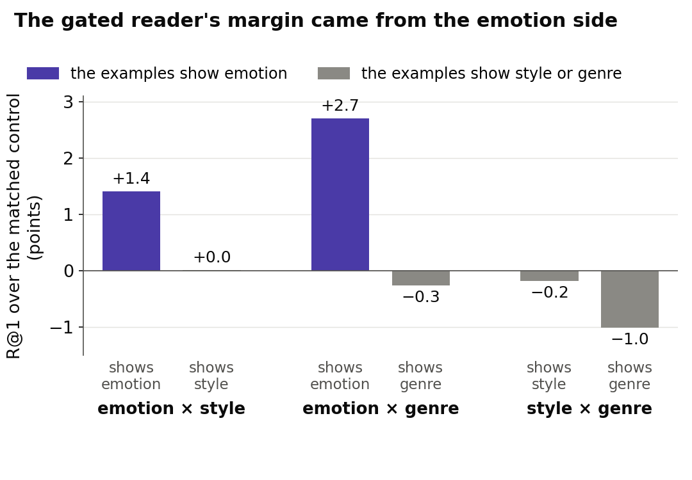

*Figure 8. The gated reader's R@1 minus its matched control's, by aspect pair and by what the examples show
(development episodes, exploratory; from the 6 October briefing).*

> Sources: [grouping quality report](../../auto/v2/2026-11-12_partition_quality_leiden_communities.md) §3 to §9,
> [round 1](../../auto/v2/2026-11-18_reader_fix_csd.md), [round 2](../../auto/v2/2026-11-19_reader_fix_round2.md),
> [brainstorm](../../auto/v2/2026-11-20_r1_levers_brainstorm.md) §2.

### 3.3 The condition-free bar rose all week

Each failed method left a condition-free ingredient, so the score a method must beat kept rising (development episodes,
seed 42). The two external baselines head the table; the rest ignore the condition by construction.

| Scorer | R@1 | What it adds |
|---|---|---|
| cosine (CLIP ViT-B/32) | 12.96 | the backbone alone (external baseline) |
| RCA | 13.38 | a metric learned from the example pairs (external baseline; condition gain +0.10, not separating the aspects) |
| SE factor term, uniform weights | 16.30 | shared factors, condition ignored |
| method A's control | 16.55 | method A's factors, condition ignored |
| centered factor term | 17.94 | the factor term centered on the episode's example items |
| **B** | **18.34** | + the averaged partition heads |
| B′(A0) | 18.437 | B rebuilt on the Leiden affect, image and caption groupings |
| B′(A1) | 18.805 | B rebuilt with the CSD style grouping added |

Part of the lift from centering may come from how the episodes are built: the examples come from the same population as
the negatives, so centering on them lifts both aspect-sharing candidates together. A probe found 16.85 when centering on
8 random items, against 17.95 on the episode's own examples. The effect cancels in a method's margin over its matched
control, which centers the same way, but not in B's lift over cosine.

> Sources: stage report [§11.3](../../stage/2026-10-04_aspect_conditioned_similarity_methods.md#113-the-condition-free-bar-and-its-caveat),
> round 4 report §5.

**Verdict (reference).** Yes, only the middle line passed. The factor-based branches hit the same wall (condition gain
no larger than the either rate it cost); the metric-from-pairs baselines did not separate the aspects at all; the MLLM
found aspect-sharing candidates more often than cosine but did not reliably choose the shown aspect. On the middle line, four of its five tested steps failed (the partition-head
reader and reader rounds 1, 2 and 4); round 3 passed. Our reading of why: AFF spends the either-rate cost mostly
where B is weakest, the emotion side.

## 4. One-sided affect steering: why it counts as a GO, against what, and what is new

### 4.1 What AFF does

AFF keeps every part of the gated reader R1 and changes one factor of its gate (Figure 9). R1 adds its grouping score
to B whenever the reader is confident. AFF adds it only when the reader is confident **and** its top grouping is affect.
Because the two conditions of an episode see mirrored evidence, the affect pick, and so AFF's gate, opens mostly on one
side: at its loosest threshold, 80.6% of first conditions and 29.7% of second ones on the fresh episodes (the stricter
thresholds the fit chose open less often on both sides). The *first condition* of an episode
shows the pair's first aspect: emotion in emotion × style and in emotion × genre, style in style × genre.

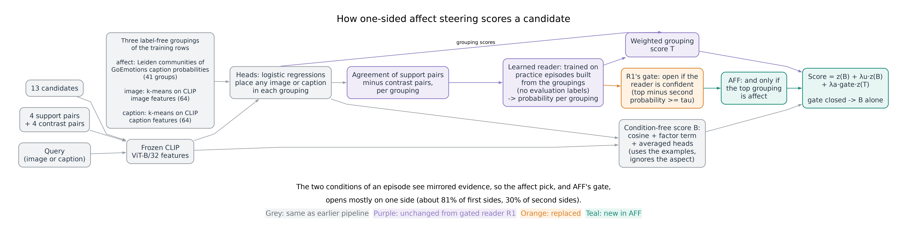

*Figure 9. How AFF scores a candidate. Grey: shared with the earlier pipeline; purple: unchanged from R1; orange: R1's
gate, which AFF replaces; teal: new in AFF.*

Nothing in AFF uses evaluation labels. The groupings were built without them, the reader was trained on practice
episodes generated from the groupings, and the affect grouping was fixed by name before the test, with a label-free
reason recorded (it is the grouping least redundant with B). That reason was stated after affect was seen to pay, so it
explains the choice; only the fresh test protects it.

### 4.2 The fresh test

AFF was found among about 50 variants on the development episodes, so its development numbers say little. The test
protected against that:

- the decision rule, its checks and its prior were committed before the test episodes were built;
- three never-used episode seeds (49, 50, 51): 36,864 episodes on 5,195 anchor paintings;
- the development episodes served only to check that the new code reproduced the old numbers (which it did exactly)
  and to fix the reader and its thresholds; the blend weights and the comparators B and B′ were fitted anew on each
  fresh seed, as the method defines (with the development weights frozen instead, the margin was +0.585);
- an independent re-derivation with its own code agreed on every decision number, and the final review confirmed the
  verdict.

GO required all **seven checks** to have a pooled 95% lower bound above 0: five R@1 checks (AFF against cosine, RCA, B,
B′(A0) and its own matched control) and two condition-gain checks (against the condition-free scorers, whose gain is 0,
counted once; and against RCA).

*Table 3. AFF on the fresh episodes, pooled over seeds 49 to 51.*

| AFF minus … | Comparator's R@1 | Difference [95% interval] |
|---|---|---|
| *AFF itself* | *18.88* | |
| cosine, R@1 | 13.04 | +5.840 [+5.611, +6.069] |
| RCA, R@1 | 13.16 | +5.722 [+5.495, +5.946] |
| B, R@1 | 18.07 | +0.806 [+0.686, +0.930] |
| **B′(A0), R@1: the strongest condition-free comparator** | **18.29** | **+0.591 [+0.462, +0.729]** |
| AFF's matched control, R@1 | 18.08 | +0.796 [+0.670, +0.920] |
| condition gain over B, B′(A0) and the control (all 0) | | +3.319 [+3.130, +3.518] |
| condition gain over RCA | | +3.286 [+3.076, +3.494] |
| *secondary, not a GO check: R1, R@1* | 18.68 | +0.202 [+0.093, +0.309] |

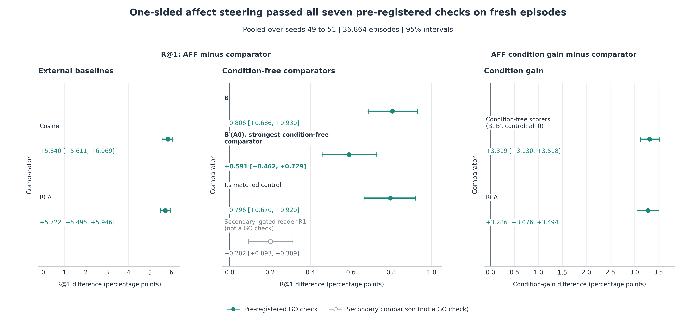

*Figure 10. The seven GO checks and the secondary check, pooled over the fresh seeds, with 95% intervals.*

All seven checks also passed on each seed alone (margins over B′(A0): +0.700, +0.452, +0.623). The rule's prior
expected about +0.3, because earlier fresh tests had roughly halved development effects; AFF kept 84% of its
development margin (+0.700 to +0.591). The development value was the best of a search, so this says the shrinkage was
smaller than feared; the verdict rests on the fresh number alone. AFF's condition gain cost about 0.52 points of
either rate per point of gain.

Two results limit what the secondary check adds. The gated reader R1 alone also passed all seven checks (margin +0.389
[+0.254, +0.532]). With the blend weights chosen on the development episodes reused unchanged, AFF's lead over R1
shrank from +0.202 to +0.090 [+0.005, +0.177] (descriptive, not pre-registered).

> Sources: [round 3 report](../../auto/v2/2026-11-21_round3_affect_gate.md) §3 to §6, §9.

### 4.3 Where the gain sits

The pooled GO rests on the two emotion pairs. On style × genre AFF fell below the strongest condition-free comparator
(Figure 11). Split by the R@1 identity (R@1 = (either + gain) / 2), the pairs differ in how first places moved:

*Table 4. AFF minus B′(A0) per aspect pair, pooled over the fresh seeds (descriptive, not tested).*

| Pair | R@1 | Condition gain | Other-aspect rate | Either rate |
|---|---|---|---|---|
| emotion × style | +0.810 [+0.585, +1.041] | +0.999 | −0.189 [−0.412, +0.034] | +0.621 [+0.263, +0.982] |
| emotion × genre | +1.544 [+1.298, +1.787] | +6.189 | −4.645 [−4.942, −4.359] | −3.101 [−3.499, −2.720] |
| style × genre | −0.580 [−0.793, −0.363] | +2.769 | −3.349 [−3.612, −3.092] | −3.929 [−4.280, −3.568] |

- On emotion × style AFF moved first places to the target mostly from negatives, so its either rate rose.
- On emotion × genre it took 4.6 points of first place from the genre candidate and gained 1.5 R@1.
- On style × genre it also took first places from the other candidate (3.3 points), but they went to negatives.
  There the first condition shows style, and the reader picked affect in 77.6% of those first conditions, about as
  often as in the first (emotion) condition of emotion × style (78.4%). The affect grouping says nothing about style.

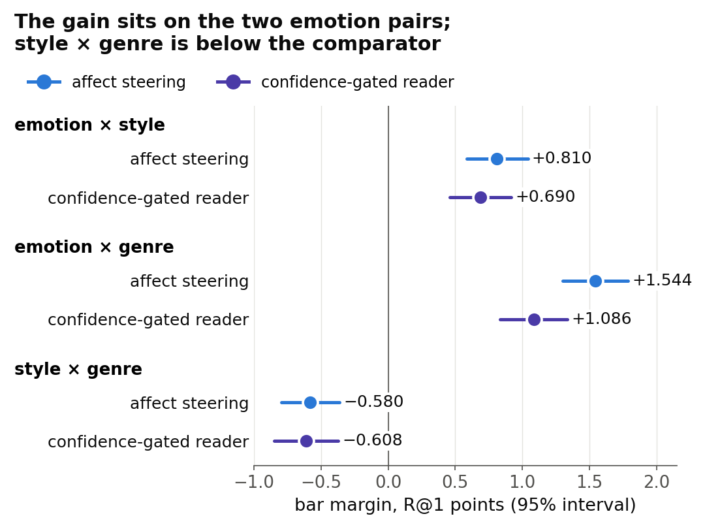

*Figure 11. AFF's margin over the strongest condition-free comparator per aspect pair, fresh episodes (from the
6 October briefing).*

### 4.4 What carries the gain

A **random one-sided gate** kept R1's gate on random episodes, opening each condition as often as AFF does. It knows
which condition is first, which no method may, so it is a mechanism control. It matched AFF: AFF minus the control was
−0.042 [−0.138, +0.048] and +0.029 [−0.076, +0.132] for its two random draws (Figure 12).

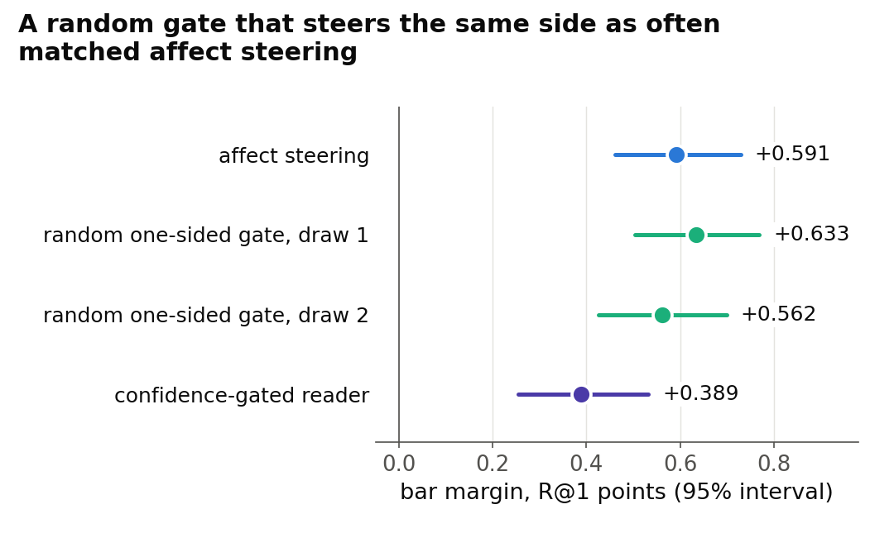

*Figure 12. Margin over the strongest condition-free comparator on the fresh episodes for AFF, the two draws of the
random one-sided gate, and R1 (from the 6 October briefing).*

So the gain comes from steering mostly one side, not from which episodes within a side get steered. AFF finds that side
without labels. A label-free diagnostic, run after the verdict, shows what its affect pick follows:

*Table 5. How often the reader picked affect in first conditions, split by whether both visual groupings (image and
caption) agree more on the contrasts than on the supports (fresh episodes, pooled).*

| Pair | Contrasts agree more on both visual groupings | Otherwise |
|---|---|---|
| emotion × style | 95.1% | 57.0% |
| emotion × genre | 96.1% | 60.7% |
| style × genre | 93.4% | 50.2% |

Our reading (not tested further): the affect pick behaves like a visual-contrast rule. It fires when the contrasts
look alike and the supports do not. In the emotion pairs that is the emotion side, where steering pays; in style ×
genre it is the style side, where it costs.

> Sources: round 3 report [§7](../../auto/v2/2026-11-21_round3_affect_gate.md#7-per-aspect-pair) and
> [§8](../../auto/v2/2026-11-21_round3_affect_gate.md#8-mechanism-the-random-share-control).

### 4.5 Round 4: switching AFF off where it hurts did not help

In the night of 7 October we tried three vetoes that can only switch AFF's steering off, developed on the development
episodes under a new committed rule. A veto had to pass two tests: clear the development bar against its **floor** (the
condition-free comparator it must beat; a veto that reads the CSD style grouping faces B′(A1), rebuilt with that
grouping), and win more of the 49,152 development rankings than it loses against AFF on the same episodes.

*Table 6. The three vetoes on the development episodes. "Net rankings" is rankings won minus rankings lost against
AFF.*

| Veto | Floor | Margin over the floor (bar +0.5) | Net rankings against AFF |
|---|---|---|---|
| image-agreement abstention | B′(A0) 18.437 | +0.663 [+0.429, +0.894] | −18 |
| a second reader that also sees the CSD grouping | B′(A1) 18.805 | +0.295 [+0.010, +0.578] | −18 |
| both | B′(A1) 18.805 | +0.262 [−0.016, +0.541] | −34 |

None beat AFF, so the round stopped before any fresh test. Every veto also switched off steering on the emotion side,
where it paid: switching off emotion-side cases cost 42, 29 and 65 rankings, while all other switch-offs won back only
24, 11 and 31. AFF itself is only +0.332 [+0.048, +0.625] above the style-aware comparator B′(A1) on the development
episodes, and below it on style × genre.

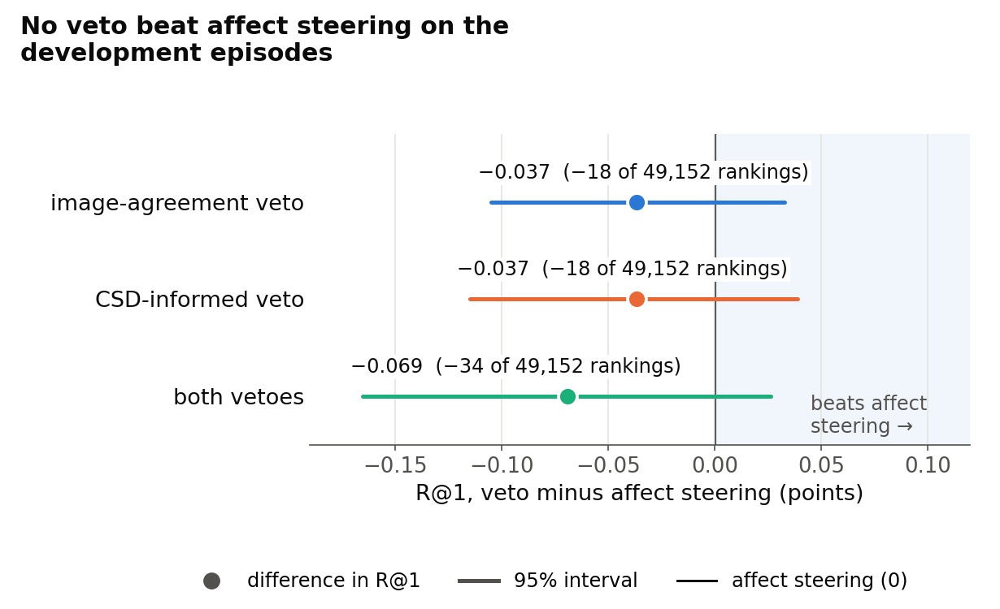

*Figure 13. R@1 of each veto minus AFF's on the development episodes, with 95% intervals (from the 7 October
briefing).*

> Sources: [round 4 report](../../auto/v2/2026-11-22_round4_aff_vetoes.md) §5, §6.

### 4.6 What the GO covers, and what it does not

| | The rounds' bar (met) | The paper's bar (not met) |
|---|---|---|
| Data | fresh episode draws from the 6,451 selection paintings | the held paintings, read once |
| Datasets | ArtELingo | ArtELingo, CUB and SemArt held splits, Holm-corrected per backbone |
| Comparators | cosine, RCA, B, B′(A0), matched control | the same, plus examples against names (K3) and a second backbone (K4) |
| Status | GO on 6 October | ArtELingo held test not built (the budget is one main read and one reserve read of the held paintings; 0 of 2 used); CUB and SemArt not started for this method |

The effect is small in R@1 (+0.59, about 3% relative) and large in condition gain (+3.3). So far AFF's gain comes
only from the two pairs with emotion, the one aspect that is not visual; whether the mechanism transfers to datasets
whose aspects are visual (CUB: colours and bill shape; SemArt: type, school, timeframe) is untested.

> Sources: [CVPR readiness memo](../../stage/2026-10-07_cvpr_readiness.md) §1, §3.

### 4.7 What is new

| Level | What we can claim | Closest prior work |
|---|---|---|
| Task and benchmark (C1) | to our knowledge, no paper defines example-conditioned, cross-item image and caption similarity with contrast pairs and value-disjoint examples | Contextual Visual Similarity (per-query weights from a few examples, image only); metric learning from pairs (Xing, RCA, KISSME); MARS (one example pair defines a relation); GeneCIS (a text condition, image to image) |
| Protocol | condition gain, matched controls, both directions, the swap test (swapping supports and contrasts must move the other candidate to the top); our own history shows why matched controls matter (the centered rule) | |
| Analysis (C3) | on ArtELingo, emotion is carried mainly by captions and style mainly by images, across four backbones; what reading a condition without labels achieves (it reduces to choosing a side, and pays only on the non-visual aspect) | |
| Method | label-free groupings, a reader trained on practice episodes, a one-sided gate fused with a condition-free score; in effect a label-free side detector (the random-gate control shows that choosing the side carries the gain, and AFF chooses it without labels) | label-free condition discovery (SCE-Net, DiscoverNet); distant emotion supervision (EmotionCLIP) |

The GoEmotions classifier behind the affect grouping is external and frozen, and its 28 categories name 6 of the 8
evaluation emotions.

> Sources: [CVPR literature review](../../literature/2026-10-21_cvpr_literature_review.md),
> [novelty check](../../literature/2026-10-24_aspect_task_novelty_check.md), readiness memo §4.

**Verdict (reference).** AFF counts as a GO under the rule written for it: it beat every pre-registered condition-free
comparator on fresh episodes, by a margin that held up better than predicted. The stronger, style-aware B′(A1) was not
part of that test. What it shows is that steering one side with a
label-free affect signal beats the condition-free bar on ArtELingo, not that the model reads emotion from the
examples. Its novelty is the task and protocol it was tested under more than the method itself.

## 5. Status at the end of the week

- **Current best:** AFF, frozen exactly as tested in round 3.
- **In progress:** idea 3, placing captions in the affect grouping by their own GoEmotions probabilities (spec
  committed, its own tab); a lightweight fine-tuned CLIP comparator (linear probe, last block, LoRA on DAS6; spec and
  plan committed, implementation started).
- **Not started:** the ArtELingo held test; CUB and SemArt for this method.
- **Open decisions (the user's):**
  - the paper's framing (on hold): a method paper, an ArtELingo-centred paper, or a benchmark and analysis paper;
  - the style-aware comparator B′(A1) in the held test: a pass check, a reported comparator, or left out;
  - style × genre: disclose the loss, or take up a redesign of the groupings for a real style signal.

## Glossary

| Plain name | Meaning | Name in the full reports |
|---|---|---|
| value episode | examples show one value ("sad, like these") | label episode |
| aspect episode | examples show an unnamed aspect through values the query lacks; 4 support, 4 contrast pairs, 13 candidates | aspect episode |
| condition gain | R@1 minus the other aspect's first-place rate; 0 for any condition-free scorer | condition gain, gain statistic |
| either rate | how often a candidate sharing either aspect comes first | either rate |
| matched control | the same score with only the condition removed | matched counterpart |
| condition-free bar | the best score that uses the examples but ignores the aspect | B; B′(A0), B′(A1) |
| grouping | a split of the training rows built without evaluation labels | partition (E2), grouping |
| affect grouping | Leiden communities of GoEmotions caption probabilities (41 groups) | affect |
| CSD style grouping | Leiden communities of CSD style embeddings (17 groups) | csd, configuration A1 |
| head | logistic regression placing an image or caption in a grouping | head |
| reader | picks the grouping the support pairs share | reader |
| told | given the right grouping from the labels; a ceiling | told oracle |
| gated learned reader | reader trained on practice episodes, used only when confident | R-c (round 1), R1 |
| one-sided affect steering | the gated reader, steering only on affect picks | AFF |
| development episodes | the reused draw of 12,288 episodes | episode seed 42 |
| fresh episodes | never-used draws from the same paintings | seeds 49 to 51 |
| development bar | margin at least +0.5 with lower bound above 0, earns a fresh test | D10 |
| centered rule | factor weights from how image and caption codes co-vary across the support pairs | N1 |
| find then select | rerank only the condition-free top few by the condition | N2 |
| partition-head reader | heads on the three label-free groupings, read by the agreement rule | N6; on the centered base N6c |
| RCA | relevant component analysis, a metric learned from the example pairs; the plan's GO bar | RCA |
| ARS | an automated review pipeline of LLM personas (one model family, no human reviewer) | ARS |
| K3, K4 | the plan's claims "examples beat names" and "holds on a second backbone" | K3, K4 |
| held-read budget | the held paintings may be read once for the main test and once in reserve | held ledger |

## Sources

- Stage report, 2 to 4 October: [aspect-conditioned similarity methods](../../stage/2026-10-04_aspect_conditioned_similarity_methods.md)
- [Grouping quality and Leiden communities](../../auto/v2/2026-11-12_partition_quality_leiden_communities.md) (5 October)
- Reader rounds: [round 1](../../auto/v2/2026-11-18_reader_fix_csd.md), [round 2](../../auto/v2/2026-11-19_reader_fix_round2.md),
  [brainstorm](../../auto/v2/2026-11-20_r1_levers_brainstorm.md), [round 3](../../auto/v2/2026-11-21_round3_affect_gate.md),
  [round 4](../../auto/v2/2026-11-22_round4_aff_vetoes.md)
- [CVPR readiness memo](../../stage/2026-10-07_cvpr_readiness.md) (7 October)
- Briefings: [reader fix](../../../user_read/2026-10-06_reader_fix.md),
  [affect steering](../../../user_read/2026-10-06_reader_fix_affect_steering.md),
  [round 4](../../../user_read/2026-10-07_round4_vetoes.md)
- Detailed timeline and experiment tree: [summary draft](2026-10-07_summary_draft.md)
