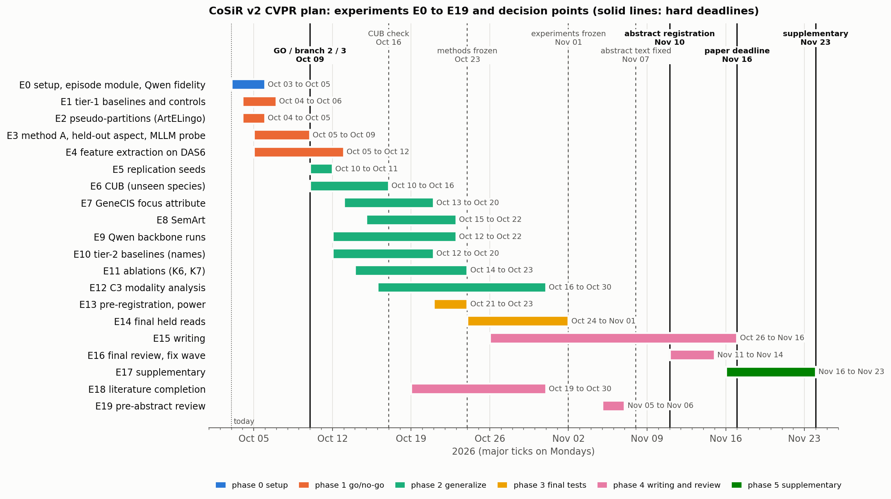

# CoSiR v2: CVPR publication plan (design)

**Date:** 2026-10-02
**Status:** revision 2 (2026-10-03). Sections approved by the user in brainstorming; then reviewed by a five-seat ARS
panel (Major Revision, two repairable blocks) and revised with the user's approval; §14 maps every required change.
**Revision 3 (2026-10-03, after the E3 NO-GO):** the user chose a method repair (A′) before giving up branch 1;
§15 defines A′, its diagnostics stage and its single GO test. §1 to §14 are unchanged and remain the record of
method A and its go/no-go.
**Revision 4 (2026-10-09, after affect steering's GO on fresh seeds):** the user moved the go/no-go one week, to
Fri Oct 16, and set the target: an ArtELingo-centred paper first, the full method paper when time and results allow
(§16).
**Replaces:** the archived conditional-buddies plan (`docs/archive/buddy_publication_plan/`) as the project's
publication target.

**In one paragraph.**
- **The problem.** We will submit CoSiR v2 to CVPR (paper deadline Nov 16) on a newly defined problem:
  *example-conditioned aspect similarity across modalities*. A user shows, by a few example image–caption pairs,
  *in which respect* two things should count as similar, for example "similar in the emotion they convey". The
  system then matches images with captions of other items in that respect.
- **Why the problem changed.** On 2026-10-02 we found that our previous evaluation (examples of a *value*, such as
  "sad, like these") is solved by a 4-shot classifier that ignores the query. We also found that our current model
  cannot yet do the *aspect* version, although supervised probes show the task is learnable.
- **The plan.** Train the model's shared image–text factors for aspect selection. A go/no-go on Oct 9 chooses
  between three paper branches: a method paper (GO), a benchmark paper if an in-context multimodal LLM can solve
  the task from the examples while our method cannot, or a downgraded venue if nothing works. The paper is then
  tested on four benchmarks and two frozen backbones, against the baselines a reviewer will ask for, with every
  claim scored on *condition gain* (a statistic that is exactly zero for any scorer ignoring the condition) as
  well as R@1. Each held-out test set is read once.

*Figure 1. Experiments E0 to E19 (§11) by phase, with decision points (dashed lines) and hard deadlines (solid lines).
Built by `assets/build_2026-10-02_cvpr_plan_timeline.py`; its rows mirror the §11 table.*

Terms in *italics* at first use are defined in the glossary (Appendix A).

---

## 1. Goal, venue and resources

**Goal.** Publish CoSiR v2 at CVPR. The user's four requirements for the paper are:
1. strong results;
2. a good storyline;
3. clear baselines on comparable benchmarks;
4. a precise problem definition with a clear method contribution and an explanation of why it works.

**Dates** (from the user).

| Milestone | Date |
|---|---|
| Abstract registration | Tue 2026-11-10 |
| Paper | Mon 2026-11-16 |
| Supplementary material | Mon 2026-11-23 |

**Compute.**
- **DAS6 GPU cluster.** The node and GPU count depend on what the user reserves: normally one node with up to 3
  GPUs, and 3 to 6 nodes when the cluster is idle.
  - Jobs go through the `cluster-run` CLI, and all node-side files live under `/local/wding/`.
- **Local RTX 3090.** It is shared with other Claude sessions and used for smoke tests and small runs. Every GPU job
  takes the shared lock `flock -n -o -E 75 /tmp/gpu0.lock`.
- **Long jobs** are launched by the main session in the background.

## 2. Background: what CoSiR is and how we got here

### 2.1 The research question

CoSiR studies **conditional image–text similarity**. Whether an image and a caption "match" should depend on a
*condition*, i.e. on what the user cares about.
- The direct ancestor is GeneCIS (Vaze, Carion and Misra, CVPR 2023). It ranks images for a reference image under a
  short text condition such as "colour". CoSiR's original `combiner.py` credits it.
- CoSiR set out to differ in two ways:
  1. **Conditions not drawn from a hand-designed list.** This is weaker now (§2.4).
  2. **Genuinely cross-modal similarity:** image against caption, rather than image against image.

### 2.2 Three lines of work

| Line | Period | What it was | Outcome |
|---|---|---|---|
| buddy | Jun to Sep 15 | per-sample condition vectors and a combiner on a "buddy graph" (mutual nearest neighbours across modalities) | archived plan; the condition mechanism stayed weak and asymmetric |
| percept | Sep 15 to 28 | ArtELingo affect work; a buddy-graph replacement for PercepT's (arXiv 2606.03345) topic stage | buddy topics matched PercepT on held-out label agreement; a matched head-to-head showed no PercepT lead. A side branch that showed the buddy graph works on an existing benchmark |
| **v2** | from Sep 28 | a ground-up rewrite, block by block (spec `2026-09-28-cosir-v2-ground-up-redesign.md`) | the subject of this plan |

### 2.3 CoSiR v2 as it stood on the morning of 2026-10-02

**Data: ArtELingo** (English part, `/data/PDD/artelingo/artelingo_train.json`).
- WikiArt paintings with ArtEmis-style annotations. Each annotation is one viewer's *emotion* label plus a caption
  explaining it ("the dark colours make me feel sad").
- 308,723 rows over 61,402 paintings. A *row* is one image–caption pair (the painting and one caption). Every
  painting also has one *art style* (Impressionism, Baroque and so on).
- We evaluate 8 emotions (the catch-all "something else" is excluded) and the art styles with at least 30
  paintings.

**Splits.** All splits are grouped by painting, so no painting crosses a split.

| Split | Rows | Paintings | Role |
|---|---:|---:|---|
| *scorer-train* | 183,694 | 36,518 | training factor models |
| *selection* | 32,413 | 6,451 | development; read many times |
| val | 30,872 | | unused in recent work |
| *held* | 61,744 | 12,281 | final tests only; read 3 times so far |

(Scorer-train and selection together form the 216,107-row train part.)

**Features.** Frozen CLIP ViT-B/32 image and caption embeddings, cached once. CLIP is never fine-tuned.

**Model (Candidate A).**
- Two small encoders map a row's image feature and caption feature into one shared space of 32 non-negative
  *factors*. An item's vector there is its *code*.
- A *condition* is given by 4 *support* pairs and 4 *contrast* pairs.
- The parameter-free *naive rule* turns them into factor weights:
  `w = ReLU(mean support pair code − mean contrast pair code)`, L1-normalized. A pair code is the mean of a row's
  image code and caption code.
- A query q and a candidate c (opposite modalities) score `0.3·cos(CLIP_q, CLIP_c) + Σ_l w_l q_l c_l`.

**Factor recipes.**
- **R0:** the first recipe. It collapsed to about one effective dimension through a cosine agreement loss.
- **R3:** the repair, with an InfoNCE pair loss plus decorrelation.
- **C0:** R3's recipe refit on scorer-train rows; the matched control.
- **SE:** C0 plus *condition episodes*. Each episode's condition comes, with probability ½ each, from 64 k-means
  clusters of a text emotion classifier's outputs on the captions (GoEmotions RoBERTa,
  `SamLowe/roberta-base-go_emotions`, 28 emotion probabilities) or from 64 k-means clusters of CLIP image features.
  Because the classifier is supervised, SE is *distantly supervised*, not label-free.

**Evaluation (label episodes).**
- An *anchor* (the query) has a target label: one emotion or one style.
- The 4 supports carry that label; the 4 contrasts do not.
- There are 13 *candidates*: one positive with the label, and 12 from paintings never given it.
- Metric: *R@1*, the share of episodes where the positive ranks first (chance 7.69%). Both directions are scored:
  *i2t* (image query, captions ranked) and *t2i* (caption query, images ranked).
- Held results (pooled R@1): CLIP only 13.16, R3 19.45, C0 19.88, SE 21.24. SE's emotion gain over C0 (+2.08) held
  at three seeds. A trained condition scorer did not beat the naive rule (stage (d)).

### 2.4 What changed on 2026-10-02

Six investigations, all on selection rows (held rows untouched), changed the plan.

| Report | Finding | Consequence |
|---|---|---|
| [CVPR literature review](../../reports/literature/2026-10-21_cvpr_literature_review.md) | No prior example-conditioned cross-item image–text similarity (to our knowledge). The naive rule is Rocchio relevance feedback (1971), and the weighted factor score is a Conditional Similarity Network (CSN, CVPR 2017) mask. Learning conditions without labels is taken (SCE-Net ICCV 2019, DiscoverNet CVPR 2022), and so is distant affect supervision (EmotionCLIP CVPR 2023) | drop "unsupervised condition discovery"; claim "no labels from the evaluation taxonomy". Also, PercepT uses a different emotion model (ModernBERT) and CLIP ViT-L/14, so our teacher must be named exactly |
| [support-baseline spike](../../reports/auto/v2/2026-10-22_support_baseline_spike.md) | A logistic probe fit on the 4+4 examples in raw CLIP space beats SE (24.10 vs 21.22). A prototype of the supports that **ignores the query** reaches 22.83; adding the query adds only +0.57 | label episodes test few-shot recognition of a *value*, not conditional similarity. The problem has to change |
| [aspect-episode spike](../../reports/auto/v2/2026-10-23_aspect_episode_spike.md) | On *aspect episodes* (§3), no factor model beats CLIP (SE 11.32 vs 11.13). Probes trained with labels reach about 23 (the *ceiling*). Emotion lives in captions and style in images | the task is learnable, but the factors must be trained for it. ArtELingo caps cross-modal matching through its weaker modality |
| [aspect novelty check](../../reports/literature/2026-10-24_aspect_task_novelty_check.md) | No paper defines the aspect task, but every ingredient exists. Closest: metric learning from pairs (Xing 2002, RCA 2005, KISSME 2012), Contextual Visual Similarity (arXiv 1612.02534), MARS (ICLR 2023), in-context text embedders | the novelty is the combination. Expected reviewer line: "a few-shot cross-modal diagonal KISSME" |
| [backbone check](../../reports/auto/v2/2026-10-25_backbone_check.md) | Across four frozen encoders, the weak-side probes barely move (emotion from images 35 to 37, style from captions 25 to 26). CUB's primary colour is read equally from images and captions | the asymmetry is in the data (claim C3). The user chose Qwen3-VL-Embedding-2B as the second backbone |
| [GeneCIS feasibility](../../reports/auto/v2/2026-10-20_genecis_feasibility.md) (Oct 1) | GeneCIS is usable for evaluation; its focus-attribute task names an aspect | GeneCIS focus attribute joins the benchmarks |

**Value versus aspect, by example.**
- **Value condition (old):** "sad, like these". The supports are 4 sad paintings, and the positive is the one sad
  candidate among 13. The supports alone find it; the query is nearly irrelevant.
- **Aspect condition (new):** "similar in emotion, the way these pairs are".
  - Supports: 4 pairs, each a fearful image matched with a fearful caption of *another* painting in another style,
    an awe image with an awe caption, and so on.
  - Contrasts: 4 pairs that share a style instead.
  - Query: a sad Baroque image.
  - The right answer is the caption that is sad but not Baroque; a caption that is Baroque but joyful is the
    distractor.
  - No support shows "sad". The model must work out *which respect* the examples share and then match the query on
    it. Swapping supports and contrasts makes the Baroque caption the right answer.

## 3. Problem definition (approved)

**Example-conditioned aspect similarity across modalities.**
- **Input:** a query x (an image or a caption) and a condition c = (S, C).
  - S holds a few *support pairs*: an image of one item and a caption of another item (*cross-item*) that agree on
    the wanted *aspect*, with any *values*.
  - C holds a few *contrast pairs* that agree on a different aspect.
- **Output:** a ranking of candidates y in the other modality by s(x, y | c). Candidates that share the query's
  value on the aspect demonstrated by S rank first.
- **Rules:**
  - The condition never shows the query's value and never names the aspect.
  - Both directions are scored.
  - **Swap test:** the same query and candidates under the swapped condition (S and C exchanged) must re-rank.
- **Task vs protocol.** The task is the first three bullets. Scoring both directions, the swap test and condition
  gain (§5.1) are evaluation choices, not properties of the task.

**Use case** (confirmed by the user on 2026-10-03). The interface fits a user who
holds examples of a relation but cannot or will not name it:
1. **Creative tools.** A designer's mood board pairs images with captions or tags that "go together", and the designer
   wants more images or texts that relate the same way.
2. **Relevance feedback.** While searching, users mark image–text pairs that match. This shows the wanted respect
   without anyone naming it.
3. **Dataset curation.** For example, find captions that describe images the way a set of curated affective alt-texts
   does.

We lead with (1) and (2). Whether examples actually beat names, and for which aspects, is measured rather than
assumed (K3).

**Against GeneCIS.** GeneCIS focus conditions name the aspect in text and compare image with image. Ours shows the
aspect by examples and compares image with caption.
- GeneCIS *focus attribute* (condition = an attribute type such as "colour") is the closest standard benchmark.
- *Focus object* conditions on a named object, which is a value, so it is supplementary only.

## 4. Contributions and claims (approved)

- **C1, task, benchmark and protocol.**
  - Novelty statement: *"to our knowledge, the first cross-modal similarity task in which the aspect is fixed at
    test time only by value-disjoint, cross-item image–caption examples, with contrast pairs on another aspect."*
  - The protocol is described separately as the evaluation, not the task: both directions, a paired swap test,
    condition gain and clustered statistics.
  - **Release:** episode files, splits, label joins and evaluation code for all four datasets, as a benchmark.
  - We cite the neighbours (metric learning from pairs, Contextual Visual Similarity, MARS, GeneCIS, CLAY, CRL,
    in-context embedders) and motivate value-disjoint examples by K1.
  - We do **not** claim that inferring a notion of similarity from examples, test-time reweighting, or
    relation-by-example retrieval is new.
- **C2, method.** A shared sparse image–text factor basis, trained on *pseudo-aspect episodes*, is the prior that
  makes it possible to estimate a similarity from just four example pairs at test time.
  - **Supervision, stated plainly:** the method uses no labels from the evaluation taxonomy, but on ArtELingo it is
    distantly supervised by a GoEmotions classifier whose categories name 6 of the 8 evaluation emotions.
  - Each ArtELingo pseudo-partition was chosen to resemble one evaluation aspect, and the paper says so. Whether
    the mechanism extends to an aspect with no matching partition is tested, not assumed (K8).
  - The training-free *agreement rule* is presented openly as a Rocchio/KISSME-style estimator (a contrast of
    cross-modal second moments), not as the novelty.
- **C3, analysis.** In the datasets we test, aspects are carried unevenly by the two modalities:
  - emotion by ArtEmis captions;
  - style by images;
  - colour by both.

  The weaker side bounds cross-modal matching, and the pattern holds across four backbones. We do **not** claim it is
  a property of modalities in general. On ArtELingo it is confounded with how the data were collected: captions are
  written to explain one viewer's emotion, and emotion labels are per viewer. E12 separates the two with a
  label-agreement reference (painting-majority emotion) and with SemArt's neutral catalogue text as a contrasting
  annotation protocol.

| # | Claim | Evidence | Status |
|---|---|---|---|
| # | Claim | Evidence (primary comparisons are in §10) | Status |
|---|---|---|---|
| K1 | On our earlier value episodes, a prototype of the supports that ignores the query beats our model, and the query adds little (+0.57 R@1) | prototype vs model, query ablation (selection rows) | **done** (support spike) |
| K2 | On ArtELingo, CUB and SemArt aspect episodes (both directions pooled), our method beats backbone-only, the best raw-feature metric-from-pairs baseline and the uniform-weight control on **both** R@1 and condition gain, under §10's multiplicity rule. Per-direction and per-aspect-pair results are reported, not claimed | pre-registered final reads | **not met at the E3 go/no-go** (ArtELingo selection rows, fresh seed-43 episodes; [E3 report](../../reports/auto/v2/2026-11-01_aspect_factor_gonogo.md)): the picked run A3 failed robustly against backbone only on condition gain (+0.26 [−0.04, +0.56]; lower bound above 0 in 0 of 100 bootstrap seeds) and against its uniform-weight control on R@1 (−2.96 [−3.29, −2.64]; 0 of 100); its pass against the GO bar (RCA) on both metrics is a Monte Carlo boundary case (both bounds above 0 in 74 of 100 seeds), as is its R@1 lower bound of exactly 0.000 against backbone only (above 0 in 29 of 100); NO-GO under every seed, so K2 is not carried in branches 2 and 3 |
| K3 | (outcome-neutral) Whether examples beat, match (within ±1.0 R@1) or lose to naming the aspect, separately for subjective and objective aspects, as typed in §10 before any example-vs-name result is seen | CRL, Qwen with the aspect in its instruction, privileged names, in-context MLLM | open; the appended spike favours names on emotion (13.3 vs 10.3) |
| K4 | K2's gains hold on Qwen3-VL-Embedding-2B | second backbone | open |
| K5 | GeneCIS focus attribute as a **transfer diagnostic** of a COCO-trained model (example protocol). A comparability claim against published rows is made only if the stretch text protocol lands, and then against the focus-attribute column (§5.4) | GeneCIS runs | open |
| K6 | The rule selects aspect factors, and the factors are shared across modalities | ablations, swap analysis, per-factor analysis, split-dictionary ablation | open |
| K7 | The gain comes from the *learned* basis: the same rule on learned factors beats it on raw features, PCA/NMF, SpLiCE and a sparse-autoencoder basis (**primary** comparison) | §10 | open; the raw-feature bar was measured at E3 ([E3 report](../../reports/auto/v2/2026-11-01_aspect_factor_gonogo.md)): the agreement rule on raw CLIP (diag, diag_relu) chose λ = 0 on both halves of the seed-43 episodes and equals backbone only, and the picked learned basis did not beat it (R@1 +0.23 [0.00, +0.46], gain +0.26 [−0.04, +0.56]); PCA, NMF, SpLiCE and SAE bases not run (E11); not carried after a NO-GO |
| K8 | The mechanism extends to an aspect with no matching training partition (leave-one-aspect-out, §6) | held-out-aspect test | **fails** at E3 ([E3 report](../../reports/auto/v2/2026-11-01_aspect_factor_gonogo.md)): H1 (AI bank, no caption partition, no genre label) gained +0.10 [−0.21, +0.40] condition gain on the genre pairs over its uniform-weight control (8,192 seed-43 episodes), so C2 narrows to selection among aspects represented in training. The failure does not isolate the held-out aspect: the positive control A1, trained with all three partitions, also failed to clear zero on the genre pairs (+0.42 [−0.02, +0.86]). Caveat: the image partition that H1 keeps carries genre (AMI 0.397), so even a pass would not have shown an unseen aspect |

**Decision branches on Oct 9** (EIC review W6). Each branch has its claim table fixed now.

| Branch | Condition | Paper | Claims carried | Venue |
|---|---|---|---|---|
| **1, GO** | §6 GO rule met | method paper | C1, C2, C3; K1 to K8 | CVPR |
| **2, NO-GO, MLLM works** | GO missed, and the in-context MLLM probe (§6) has a condition gain CI lower bound > 0 and an R@1 gain over backbone-only with CI lower bound > 0 | benchmark paper: a solvable, released task that embedders and metric-from-pairs fail while an MLLM given the examples partly succeeds | C1, C3; K1; K3 (with the MLLM as the example scorer); embedder and baseline tables | CVPR |
| **3, NO-GO, nothing works** | neither | an analysis and negative-results paper (the task, the value-episode shortcut, modality asymmetry across annotation protocols) | C1, C3, K1, K3 | a workshop or a datasets-and-benchmarks track, chosen with the user |

The user decides the switch on Oct 9 from the pre-registered numbers.

## 5. Benchmarks and protocols (approved)

### 5.1 Common protocol

- **Aspect episodes:**
  - an anchor, and 13 candidates: one sharing aspect A with the anchor (p_A), one sharing aspect B (p_B), and 11
    sharing neither;
  - two sets of 4 cross-item example pairs, P_A and P_B. Each pair shares one aspect, with values distinct from
    each other and from the anchor's;
  - condition A uses S = P_A, C = P_B; condition B swaps them;
  - every item in an episode comes from a distinct painting or photo. With three aspects, all three aspect pairs
    are used;
  - **third-aspect control:** where a dataset labels a third aspect, p_A, p_B and the 11 negatives all differ from
    the anchor on it, so the third aspect cannot stand in for the conditioned one. The realised balance is reported.
- **Primary metrics (both are required):**
  - **R@1:** the mean over both directions and all conditions.
  - ***Condition gain*** (review W1, EIC W1): for each anchor and direction, the target of condition A ranks first
    under A minus it ranks first under the swapped condition B, averaged over both targets. Equivalently, R@1 minus
    the other-aspect rate.
    - A scorer that ignores the condition ranks identically under A and B, so its condition gain is exactly 0 (CLIP
      included), however high its R@1.
    - A scorer that finds "shares some aspect with the anchor" can reach about 50% R@1 but still scores 0.
- **Secondary metrics:**
  - per condition, direction and aspect pair;
  - *swap success*: p_A above p_B under condition A *and* p_B above p_A under condition B, always reported next to
    R@1;
  - the other-aspect rate;
  - a 101-candidate gallery variant on ArtELingo and CUB.
- **Splits.** Factor training uses image–caption pairs and pseudo-partitions only, no labels. A labelled
  development split serves model selection. The test split is read within §10's budget.

### 5.2 Datasets, in priority order

| Dataset | Aspects | Captions | Test split | Notes |
|---|---|---|---|---|
| **ArtELingo** (primary) | emotion (8) × style (23) × genre (10; 81% of paintings labelled, §5.3) | human, affective | held rows, fresh-seed aspect episodes | asymmetric aspects; label-probe ceiling about 23 R@1 |
| **CUB-200-2011 + Reed et al. captions** (bird photos) | primary colour (15), bill shape (9), and wing colour (`has_wing_color`, chosen in E0: min(image, caption) probe accuracy 0.430 / 0.470 on the 30 development species against a majority rate of 0.276, margin +0.154; the other groups reach +0.008 to +0.055; caveat: labelled on only 532 development images, single development draw, low majority inflates the margin; [E0 report](../../reports/auto/v2/2026-10-29_aspect_eval_setup.md)) | human, 10 per image, written without species names | the standard zero-shot split's **50 unseen species**; development on 30 of the 150 training species, kept out of factor training | colour is symmetric across modalities; captions name colours. **Disclosure:** the backbone check scored attribute probes on CUB's standard test split, which spans all 200 species, so the 50 test species were read once in that diagnostic (no CoSiR model; recorded in the held ledger) |
| **GeneCIS focus attribute** | condition = attribute type | none (Visual Genome object crops) | the benchmark (2,000 templates) | image to image; see §5.4 |
| **SemArt** (paintings with catalogue descriptions) | type (10), school (26), timeframe (22) | catalogue text, artist names and dates scrubbed | official test (1,069 paintings); development = official val | main paper if on time, otherwise supplementary |
| GeneCIS focus object | condition = an object (value-type) | COCO | benchmark | supplementary only |
| Affection | | | | potential; the user will check |

**Data on disk** (`/data/SSD/`; downloaded 2026-10-02 by `scripts/download_benchmarks.sh`):
- `cub/` (11,788 images; captions in `captions/extracted/text_c10`);
- `semart/SemArt` (21,384 images);
- `visual_genome/VG_100K_all` (108,249 images, including all 23,640 GeneCIS attribute images);
- the GeneCIS COCO half, preprocessed earlier into `/data/PDD/genecis/`.

Our loaders pass the Visual Genome path themselves; the GeneCIS clone is not edited.

### 5.3 ArtELingo genre (resolved 2026-10-02: kept)

**Result of the coverage check** (`src/test/20261026_genre_coverage/`). ArtGAN's labels cover 81% of paintings in
every split. The smallest genre still has 149 paintings in selection and 296 in held.

| Split | Paintings | With genre |
|---|---:|---:|
| scorer-train | 36,518 | 29,593 (81.0%) |
| selection | 6,451 | 5,256 (81.5%) |
| held | 12,281 | 9,949 (81.0%) |

- The rule below passes, so **genre is the third ArtELingo aspect**. Genre episodes draw only from the labelled
  paintings.
- Class names come from ArtGAN's `WikiArt Dataset/Genre/genre_class` (no `.txt` extension; corrected by the
  [citation check](../../reports/auto/v2/2026-10-28_citation_check.md), E1). They agree with the mapping we recovered
  from the ArtELingo-28 genre names on all 9 ids that occur there (purity 1.0). Id 5 is `nude_painting`.

The original decision record follows.

- **Why keep it.** The user wants genre (subject matter: portrait, landscape, still life and so on). It is the one
  ArtELingo aspect visible in both modalities, which C3 needs as its within-dataset control. Three aspects also
  answer the objection that two aspects make the condition a binary switch.
- **The gap.** The genre labels on disk come from ArtELingo-28 and cover only 1,160 of 61,402 paintings. WikiArt's
  10-class genre labels are published with ArtGAN (`genre_train.csv`, `genre_val.csv`). The user runs that download
  (an egress hook needs their approval) into `/data/SSD/wikiart_genre/`.
- **Rule:** keep genre if, after joining by file name, at least half of the selection and held paintings are covered
  and every genre has at least 30 paintings in each of those splits.
  - Otherwise, use a coarse subject label derived from WikiArt tags (portrait, landscape, religious, still life),
    disclosed as derived.
  - If that also fails, keep two aspects.

### 5.4 GeneCIS protocols

1. **Example protocol (ours).** Image to image on image codes, with supports and contrasts drawn from other
   templates that share the condition. It is not comparable with published numbers.
2. **Text protocol (stretch).** A phrase-to-weights adapter `w = a_T(phrase)`. Only this protocol allows a
   comparability claim. We run only focus attribute, so the bar is the published **focus-attribute** R@1 at frozen
   ViT-B/32, not the four-task averages (review R2 W1, DA M4):

   | Method | Focus attribute | Four-task average (context only) |
   |---|---:|---:|
   | SEARLE (CIReVL's re-run, Table 3; SEARLE itself reports no GeneCIS result) | 18.9 | 14.4 |
   | CIReVL | 17.9 | 15.9 |
   | OSrCIR | 19.4 | 17.4 (independently reproduced at 14.0 in Paracosm arXiv 2602.00813**v1**, Table 3) |
   | STiTch (arXiv 2605.21261) | 21.1 | 18.4 |

   Without the text protocol, K5 is reported as a transfer diagnostic only. GeneCIS measures image-to-image
   transfer, not the cross-modal task.
3. **No development reads.** GeneCIS has no development split, so E7 builds and tests its pipeline on COCO-derived
   episodes (no GeneCIS template). The benchmark is read only once, in E14.

Always reported: image only, text only and image + text on our backbones. GeneCIS's CC3M training triplets are never
used.

## 6. Method A: aspect-trained factors (approved)

**Model.** The v2 structure is kept.
- Two small encoders map frozen backbone features of each modality into a shared sparse non-negative space R₊^L
  (L = 32; 64 is a grid point).
- Score: s = β·cos + Σ_l w_l a_I,l(x) a_T,l(y).
- The *agreement rule* replaces the naive rule, because the examples are now pairs that agree on an aspect:
  w = ReLU(mean over S of a_I(x_i) ⊙ a_T(y_i) − mean over C of a_I(x_j) ⊙ a_T(y_j)), L1-normalized.
  It keeps the factors on which support pairs co-activate more than contrast pairs. It is training-free at test
  time.

**Training: pseudo-aspect episodes.**
- Each training row carries cluster ids from K *pseudo-partitions*, i.e. clusterings that stand in for unknown
  aspects.
- Episodes copy §5.1 with clusters in place of labels. For a partition pair (k, k′):
  - supports are 4 cross-item pairs sharing a k-cluster different from the anchor's;
  - contrasts are 4 pairs sharing a k′-cluster;
  - candidates are one sharing only the anchor's k-cluster, one sharing only its k′-cluster, and negatives.
- **Losses:**
  - a ranking loss through the differentiable agreement rule, in both directions;
  - a swap term on the same episode with roles exchanged;
  - R3's pair agreement (InfoNCE) and decorrelation terms, so that codes stay cross-modal and do not collapse.
- **Why this could work where SE did not.** SE was only trained on value episodes, so it learned to recognise a
  value from supports. These episodes reward exactly what the aspect spike found missing:
  - putting the anchor's value on an aspect into *both* modalities' codes;
  - keeping aspects in separable factors that the rule can select.
- **What the basis must look like** (simulation, 2026-10-03, while writing the E0 to E5 plan):
  - The rule transfers across values only if all values of an aspect share factors, each value being a different
    pattern over the same factors. Value-specific factors give exactly zero condition gain under value-disjoint
    conditions (every candidate ties), against 0.20 to 0.32 for aspect-block codes.
  - Raw features that mix aspects defeat raw pair rules in the same way: 0.00 mixed, against 0.70 to 0.95 when each
    aspect has its own block of dimensions.
  - This is the mechanism behind C2 and K7: the learned basis must separate aspects into blocks of shared factors,
    which raw CLIP does not.

| Dataset | Pseudo-partitions (no evaluation labels) |
|---|---|
| ArtELingo | GoEmotions affect k-means of captions (emotion-like; distant supervision); backbone image k-means (style-like; adjusted mutual information 0.32 with style); caption-content k-means (genre-like). **Each is hand-matched to one evaluation aspect; disclosed.** |
| CUB (150 training species) | **generic** partitions only: backbone image k-means and whole-caption k-means, each at two granularities, with no part list or part-motivated design (review DA C1). Per-sentence caption k-means is reported as an ablation |
| SemArt | image k-means; description k-means |
| GeneCIS | a factor model trained on COCO train2014 pairs (none are GeneCIS images), with image and caption k-means |

**Held-out-aspect test** (review DA C1, validated; claim K8). It is pre-registered and runs in the go/no-go week.
- **Leave-one-aspect-out on ArtELingo:** train with the emotion-like and style-like partitions only (no
  caption-content partition), then evaluate the episodes that involve genre (genre × emotion, genre × style).
- **Rule:** K8 holds if genre-pair condition gain has a clustered 95% CI lower bound above 0 against the
  uniform-weight control. Otherwise C2 narrows to "selection among aspects represented in training", and the paper
  says so.
- **Generic partitions on CUB** (table above) give a second, cross-dataset test of the same question.
- **Supervision ablation:** an emotion run without the affect partition separates the GoEmotions signal from the
  rest (review R2 W4).

**Go/no-go.** Pre-registered before the first run; ArtELingo, CLIP B/32, selection rows; decided Fri Oct 9.
- **Grid and picking:** at most about 10 runs (partition set × L × loss weights), about 10 minutes each locally.
  The best run is **picked on seed-42** selection aspect episodes.
- **Fresh test episodes:** the GO test uses **fresh seed-43 episodes** from the same selection rows (the same rows,
  so the test is not independent of development; disclosed). Picking the best of about ten runs therefore does not
  inflate the result.
- **GO** if, on those fresh episodes and with the painting-clustered bootstrap of §10, the picked run beats
  **each** of the following on **both** R@1 and condition gain (95% CI lower bound above 0):
  - backbone-only (R@1 11.1, condition gain 0);
  - the best raw-feature metric-from-pairs baseline, fusion weight cross-fitted;
  - the *uniform-weight control*: our factors with uniform weights, i.e. the condition removed.
- **Strong GO:** R@1 at least 4 points above backbone-only (about 15 against 11.1), with condition gain at least
  +4 points. The label-probe reference (about 23) is a diagnostic, not a bound.
- **Early MLLM probe** (decides branch 2 vs 3, §4):
  - **Setup:** Qwen3-VL-2B-Instruct as an in-context reranker, given the 4 support and 4 contrast pairs, the query
    and the 13 candidates.
  - **Size:** 300 selection episodes per aspect pair, seed 44.
  - **Cost:** t2i prompts carry about 30 images each, so the 8B model is used only if time allows.
  - **Rule:** it "works" if condition gain and R@1 over backbone-only both have a CI lower bound above 0.
- **NO-GO:** GO is missed. The user chooses branch 2 or 3 (§4) from the numbers.
- **Replication:** a winner is re-run at seeds 43 and 44 before it moves to other datasets and Qwen.

**Risk R-pseudo** (flagged by the user): the pseudo-partitions are proxies, and the model may learn the episode
format or a selector among trained aspects rather than the aspects themselves. **It is now tested:**
- the held-out-aspect test and generic CUB partitions (K8);
- the uniform-weight control and condition gain (K2).

## 7. Backbones (approved)

- **Development** on CLIP ViT-B/32 (cached; runs take minutes).
- **Final tables** also on **Qwen3-VL-Embedding-2B**, the user's choice. It is a multimodal embedder built on a
  vision–language model that takes a task instruction at encoding time. That lets the "aspect named in the
  instruction" baseline run on the very same backbone.
- **Fidelity check first.** Our reimplementation (`src/test/20261025_backbone_check/extract.py`: transformers
  5.6.2, last-token pooling, default instruction, capped image resolution) must be checked against the official
  implementation before paper use. If it fails, fall back to PE-Core L/14.
- **Fidelity result (E0, 2026-10-29).** PASS on both stages after the preprocessing fix (the port now pre-resizes like `qwen_vl_utils`): image-to-caption top-1 agreement 48/50 on CUB images and on large ArtELingo images, cosine minimum 0.9996, so no PE-Core fallback. Features use max_pixels 524,288, below the official default 1,843,200 ([E0 report](../../reports/auto/v2/2026-10-29_aspect_eval_setup.md)).
- **Packages** go in `pip --target` directories, never into the CoSiR env.

## 8. Baselines (approved)

All baselines run on the same features and episodes.
- **On development splits,** fusion weights (and β) are cross-fitted: chosen on one half of the anchors (split by
  parity) and applied to the other, then swapped.
- **For final reads,** they are chosen on the development split and frozen. GeneCIS, which has no development
  split, takes them from the other datasets.

| Tier | Baseline | What it does | Reviewer question |
|---|---|---|---|
| 1 | backbone only | cosine of query and candidate | is conditioning needed at all? |
| 1 | uniform-weight control | our factors with uniform weights (the condition removed) | does the condition matter beyond the factors? (K2) |
| 1 | metric from pairs on raw features | estimate a similarity from the 4+4 example pairs directly on raw features: the diagonal agreement rule (signed and ReLU), low-rank KISSME with shrinkage (inverse covariance of similar pairs minus that of dissimilar pairs), RCA (whitening by within-pair variation), a Xing-style metric fit per episode, and Wang et al.'s per-query weights | "your rule is few-shot KISSME" |
| 1 | per-episode pair probe | a logistic probe fit on the 4 support vs 4 contrast pairs (pair features), scoring query–candidate pairs | "a fitted classifier beats a parameter-free rule" (restored, review R2 W2) |
| 1 | Tip-Adapter cache | training-free affinity to support pairs minus contrast pairs, plus β·cos | the standard training-free few-shot CLIP baseline (restored) |
| 1 | the agreement rule on unsupervised bases | PCA-32/64, NMF-32, SpLiCE sparse concept codes (on captions following its App. B.3; centering stated per modality) and a **sparse-autoencoder basis** (a TopK SAE trained jointly on image and caption features) instead of our factors | K7: is it the learned basis? (primary) |
| 1 | value prototype or Rocchio | mean of support items minus mean of contrasts | do value baselines fail on aspects? |
| 1 | C0, SE, R3 | our earlier factor recipes (ablation rows in the paper, not headline baselines) | what do aspect episodes add? |
| 2 | names, privileged | project items onto the true value names ("a painting that evokes fear", …) and compare | upper reference for naming |
| 2 | CRL (NeurIPS 2025) | an LLM lists an aspect's values from one word ("emotion"); project and compare | K3, training-free names |
| 2 | Qwen3-VL-Embedding with the aspect in its instruction | "represent this painting by the emotion it evokes" | would an instruction embedder make the method unnecessary? |
| 2 | **in-context MLLM reranker** (required) | Qwen3-VL-2B-Instruct given the same support and contrast pairs, the query and the candidates | would an MLLM given the same examples make the method unnecessary? (also decides branch 2) |
| 3 | label-probe reference | per-modality classifiers trained with the labels (converged, fixed thread count); a diagnostic reference, not a bound | distance to supervision |
| 3 | GeneCIS rows | published frozen-B/32 focus-attribute numbers (§5.4); image / text / image + text | K5 |
| stretch | CLAY (CVPR 2026) reimplementation; verbalise-then-name (an MLLM describes what the supports share, then a names baseline uses the description) | | strongest naming comparisons |

**Equal tuning.** Every baseline gets the same cross-fitted grid size as our method. A pick at a grid edge extends
the grid once, for every method alike.

**Out of the tables.**
- **Teacher-only:** GoEmotions cannot read images, so it cannot score cross-modal pairs. It becomes a text-side
  analysis inside C3.
- **PercepT** was a side branch that showed the buddy graph works on an existing benchmark and inspired v2's design.
  A buddy-vs-PercepT comparison is **optional and storyline-dependent** (supplement or analysis), never required.

## 9. Out of scope

- Fine-tuning the backbone.
- Evaluation labels in factor training.
- GeneCIS CC3M triplets.
- Merging percept-branch code.
- Codex (unless the user asks).
- Any held read outside §10.

## 10. Held budget and statistics (approved)

**Ledger.** Every read of a final split is logged in `docs/superpowers/held_ledger.md`: date, script SHA-256,
episode SHA-256 and purpose. Each final script refuses a second run.

| Dataset | Development | Final test | Budget |
|---|---|---|---|
| ArtELingo | selection rows (free to reuse) | held rows, fresh-seed aspect episodes (a new task on rows read 3 times before for value episodes) | 1 main + 1 reserve |
| CUB | 30 of the 150 training species | 50 unseen species | 1 + 1 |
| SemArt | official val | official test | 1 + 1 |
| GeneCIS | none (zero-shot; selection on the other datasets) | benchmark | 1 + 1 |

- **Main read:** one pre-registered run per dataset, covering all models and baselines on both backbones, with
  checkpoints, fusion weights, β and episode counts frozen.
- **Reserve read:** only for a pre-registered fix after a final-review finding, never for a second attempt at a
  better number.
- **Disclosures:**
  - ArtELingo's held rows shaped earlier design decisions.
  - CUB's 50 test species were read once by the backbone check's attribute probes.
  - The paper states both, and the ledger records them.

**Statistics.**
- **Primary metrics:** aspect R@1 and condition gain (§5.1), each the mean over directions and aspect pairs.
- **Uncertainty: a clustered bootstrap** (5,000 resamples; review R1 W2). The resampling unit is the anchor's
  cluster:
  - the painting, for ArtELingo and SemArt;
  - the species, for CUB (50 clusters, so wide intervals by design);
  - the reference image, for GeneCIS.

  A two-way (anchor cluster × candidate cluster) bootstrap is reported as a sensitivity check, together with the
  item-reuse rate per split.
- **Seeds:** our models train with 3 seeds. The headline is the 3-seed mean. Its CI resamples clusters and seeds
  together, and every seed is also reported.
- **Pre-declared primary comparisons** ("beats" means a CI lower bound > 0 on both primary metrics):
  - ours vs backbone only;
  - ours vs the best raw metric-from-pairs baseline;
  - ours vs the uniform-weight control;
  - K7: learned factors vs the best unsupervised basis.
- **Multiplicity:** the family is these four comparisons × {ArtELingo, CUB, SemArt}, per backbone, with
  Holm–Bonferroni within each family. K3 (examples vs names) and K8 (held-out aspect) are separate pre-declared
  families. GeneCIS and everything else are descriptive.
- **"Matches" (K3):** two one-sided tests at 90% CI, equivalence margin **±1.0 R@1 point**, fixed now.
- **Aspect typing for K3,** fixed now and independent of any model result (review R1 W18, R2 W5, R3 W3):
  - **subjective** means the label records an individual viewer's response, which annotators often disagree on:
    ArtELingo emotion;
  - **objective** means a curated catalogue fact or a physical attribute: style, genre, SemArt type, school and
    timeframe, and the CUB attributes.

  E12 reports annotator agreement on emotion (paintings with 3 or more annotations) as a check on the typing, not as
  a way to change it.
- **Power:** a simulation from the development split's clustered bootstrap. It picks the anchors per aspect pair
  needed to detect a true condition-gain difference of 2.0 points with at least 80% power at the Holm-adjusted α.
  The count is capped by the data (SemArt's test set has 1,069 paintings) and written into the E13
  pre-registration.
- **Swap success** is always shown next to R@1 and condition gain.

## 11. Experiment plan and schedule (approved)

| # | Experiment | Dates | Output or decision |
|---|---|---|---|
| E0 | **Setup:** a generic aspect-episode module (`src/eval/`) for all datasets, with the third-aspect control, condition gain and the clustered bootstrap, with tests; held ledger (including the CUB backbone-check read); genre coverage (§5.3, done); CUB third aspect group (the highest min(image, caption) probe gain over the majority rate, among `has_shape`, `has_wing_pattern`, `has_breast_pattern`, `has_wing_color`); Qwen fidelity check | Oct 3 to 5 | module; decisions recorded |
| E1 | Tier-1 baselines on ArtELingo selection aspect episodes (B/32), including the uniform-weight control, per-episode pair probe and Tip-Adapter cache | Oct 4 to 6 | baseline table; the bars for the go/no-go |
| E2 | ArtELingo pseudo-partitions (affect and image k-means exist; caption-content k-means is new) | Oct 4 to 5 | partitions and their agreement with the labels (diagnostic only) |
| E3 | Method A training and go/no-go (at most about 10 runs); held-out-aspect test (leave genre out); supervision ablation; early in-context MLLM probe (300 episodes per aspect pair) | Oct 5 to 9 | **GO / branch 2 / branch 3, Fri Oct 9** |
| E4 | DAS6 extraction: Qwen on all ArtELingo rows; B/32 and Qwen on SemArt, GeneCIS crops and COCO, COCO train2014 | Oct 5 to 12 | caches under `/data/SSD2/pre_extract/` |
| E5 | Replication seeds 43 and 44 on ArtELingo | Oct 10 to 11 | seed table |
| E6 | CUB: generic partitions, training, development evaluation | Oct 10 to 16 | **CUB check, Oct 16:** if A does not beat the baselines on CUB development, claims narrow to ArtELingo plus analysis |
| E7 | GeneCIS focus attribute: pipeline built and tested on COCO-derived episodes (no GeneCIS template read); COCO-trained factors; text protocol as stretch | Oct 13 to 20 | pipeline ready for E14 |
| E8 | SemArt: scrubbing, partitions, training, development | Oct 15 to 22 | main or supplementary |
| E9 | Qwen backbone runs on every dataset | Oct 12 to 22 | K4 |
| E10 | Tier-2 baselines: CRL, Qwen instruction names, privileged names, in-context MLLM reranker (aspect typing already fixed in §10) | Oct 12 to 20 | K3 |
| E11 | Ablations: rule on bases including the SAE basis (K7); no episodes vs value episodes; split-dictionary ablation, factor-group and swap analysis (K6); per-sentence CUB partitions | Oct 14 to 23 | ablation tables |
| E12 | C3 analysis: converged label-probe references across datasets and backbones; a painting-majority emotion reference and annotator agreement; SemArt's neutral catalogue text as an annotation-protocol contrast; emotion results split by GoEmotions coverage; GoEmotions text-side analysis | Oct 16 to 30 | analysis figures |
| E13 | Pre-registration and power for the final reads | Oct 21 to 23 | **methods frozen Oct 23** |
| E14 | Final reads, one main read per dataset | Oct 24 to Nov 1 | **main-paper experiments frozen Nov 1** |
| E15 | Writing: main-paper outline and page budget by Oct 26 (what moves to the supplement); full draft Nov 6; title and abstract fixed Nov 7; registration Nov 10 | Oct 26 to Nov 16 | the paper |
| E16 | Whole-branch final review (most capable model, re-deriving every load-bearing number) and fix wave | Nov 11 to 14 | review report |
| E17 | Supplementary: slipped datasets, GeneCIS focus object, 101-candidate galleries, stretch baselines, optional buddy vs PercepT | Nov 16 to 23 | supplementary |
| E18 | Literature completion: finish the novelty search (C-STS, Multiview Triplet Embedding and the other leads from the review) before the title and abstract are fixed | Oct 19 to 30 | updated novelty statement |
| E19 | Pre-abstract internal review of the story, claims and numbers (before the Nov 7 freeze) | Nov 5 to 6 | go-ahead for the abstract |

Every experiment ends with a report in `docs/reports/auto/v2/`, one row in `reports_sum.md`, a commit, and an update
of §4's claims table.

**Planning scope.**
- The first implementation plan covers **E0 to E5**, including E3's held-out-aspect test and MLLM probe, in task-level detail.
- E6 onward gets its own plan after a GO on Oct 9, informed by what E3 finds.
- After a NO-GO, the next plan follows the branch the user picks (§4): branch 2 plans the benchmark paper around
  the in-context MLLM, and branch 3 plans the analysis paper and its venue.

## 12. Risks

| ID | Risk | Mitigation or signal |
|---|---|---|
| **R-pseudo** | pseudo-aspect partitions are proxies; the model may learn the episode format or a selector among trained aspects | tested by the held-out-aspect test and generic CUB partitions (K8) and by condition gain against the uniform-weight control (K2); distant supervision disclosed |
| R-nogo | A fails on Oct 9 | three pre-declared branches (§4) with claim tables; the early MLLM probe decides branch 2 vs 3 |
| R-kissme | a raw-feature metric from pairs matches A | K7 fails and the basis is not the contribution; known by Oct 9 |
| R-names | names beat examples (already seen for emotion in the spike) | K3 is outcome-neutral with typing fixed in advance; the paper reports where examples win and where they don't |
| R-mllm | the in-context MLLM reranker is slow (about 30 images per t2i prompt) | 300-episode probe with the 2B model; full runs only where the branch needs them |
| R-ceiling | ArtELingo's ceiling is low (about 23) | relative gains; CUB colour as the symmetric case; C3 turns the cap into a finding |
| R-time | 4 datasets × 2 backbones in about 5 weeks | cut order: SemArt to the supplement, then the GeneCIS text protocol, then the 101-candidate galleries, then Qwen on SemArt |
| R-qwen | our reimplementation differs from the official one | E0 fidelity check; PE-Core fallback |
| R-infra | local GPU loss (happened 2026-10-02); a shared machine | DAS6 as backup; GPU lock; commit after every task |
| R-held | ArtELingo held rows shaped earlier design | fresh-seed episodes on a new task; disclosure |
| R-licence | CUB terms conflict (non-commercial vs cc-by); SemArt and GeneCIS are CC BY-NC | academic use; state the terms in the paper |
| R-concurrent | TPIPS, SteerViT, CLAY, Fioresi et al., COCO-Facet condition similarity on text | position on the example interface and the cross-modal score |

## 13. Conventions

- Implementation goes to Claude Code subagents sized to the task; the controller reviews each result.
- Reports follow the `docs/reports/` layout and the user's report rules: a real baseline beside every number,
  figures, paper-draft style, no dashes.
- Other sessions share main: stage files by explicit path.
- Experiment folders are `src/test/<sequence-date>_<name>/`. Edits to existing source get a change log in
  `.claude/yyyymmdd_log.md`.

---

## Appendix A. Glossary

| Term | Meaning here |
|---|---|
| agreement rule | the training-free rule of §6 that weights factors by how much support pairs co-activate them, minus contrast pairs |
| anchor (query) | the item a ranking is made for: an image (i2t) or a caption (t2i) |
| aspect / value | an aspect is a respect in which items can be similar (emotion, style, colour); a value is one setting of it (sad, Baroque, red) |
| backbone | the frozen encoder whose features everything builds on (CLIP ViT-B/32; Qwen3-VL-Embedding-2B) |
| β | weight of the backbone cosine in the score |
| candidate | one of the 13 items ranked in an episode, in the modality opposite the anchor |
| ceiling, label-probe reference | R@1 when factor codes are replaced by classifiers trained with the true labels: a diagnostic reference, not a bound (it varies with probe convergence) |
| clustered bootstrap | resampling whole clusters (paintings, species) rather than single anchors, because items recur across episodes |
| condition gain | R@1 under the correct condition minus R@1 of the same target under the swapped condition; exactly 0 for any scorer that ignores the condition |
| equivalence margin | the band (±1.0 R@1 point) within which "matches" is claimed, tested with two one-sided tests |
| held-out-aspect test (leave-one-aspect-out) | training without the partition that mirrors one aspect, then testing that aspect (K8) |
| in-context MLLM reranker | a multimodal LLM given the example pairs, the query and the candidates in one prompt, asked to pick the match |
| code / factor | an item's 32 non-negative numbers in the shared space / one of those dimensions |
| condition | what the user cares about, given here by support and contrast pairs |
| condition episode / pseudo-aspect episode | a training episode built from clusters instead of labels; value-type for SE, aspect-type for method A |
| contrast pair | an example pair that agrees on a different aspect than the one wanted |
| cross-fitting | choosing a tuning weight on one half of the anchors and applying it to the other half, so tuning does not flatter the result |
| cross-item pair | an image of one item with a caption of another item |
| distant supervision | training signal from an external supervised model (here a GoEmotions classifier), not from our labels |
| episode | one ranking problem: anchor, condition and candidates |
| held / selection / scorer-train rows | the final-test, development and training parts of ArtELingo (§2.3) |
| i2t / t2i | image query ranking captions / caption query ranking images |
| KISSME, RCA, Xing | classic ways to learn a similarity metric from similar and dissimilar pairs (2012, 2005, 2002) |
| naive rule | the earlier rule for value conditions: mean support pair code minus mean contrast pair code |
| pseudo-partition | a clustering of training rows that stands in for an unknown aspect |
| R@1 | share of episodes where the right candidate ranks first; chance is 1/13 = 7.69% |
| R0, R3, C0, SE | earlier factor recipes (§2.3) |
| Rocchio, CSN | relevance feedback (1971) and Conditional Similarity Networks (2017), the classic ancestors of our rule and score |
| support pair | an example pair that agrees on the wanted aspect |
| swap test / swap success | exchanging supports and contrasts must flip which aspect candidate wins |
| uniform-weight control | our factors with all weights equal, i.e. the condition removed |

## 14. Revision log: response to the ARS review (2026-10-03)

A five-seat ARS panel (journal fit, methodology, domain, perspective and devil's advocate) under the v3.6.2 sprint
contract returned **Major Revision**, with two repairable blocks and the devil's-advocate CRITICAL validated. The
record is in `src/test/20261027_ars_plan_review/` and the summary in
[the review report](../../reports/auto/v2/2026-10-27_ars_plan_review.md). The user approved every change below on
2026-10-03.

| Review item | Change |
|---|---|
| REV-01 (D1 block): condition-blind gains pass GO | condition gain as a co-primary metric (§5.1); uniform-weight control; GO requires both metrics (§6) |
| REV-20 (D1 block): anchor-only bootstrap | clustered bootstrap by painting, species or reference image; two-way sensitivity check (§10) |
| REV-21 (D1 block): no margin for "matches" | ±1.0 R@1 equivalence margin with two one-sided tests (§10) |
| REV-55 (D3 block, DA C1): no held-out aspect | leave-one-aspect-out test and generic CUB partitions; claim K8 with a narrowing rule (§4, §6) |
| REV-02, REV-35: K3 adverse evidence, typing after results | K3 outcome-neutral; aspect typing fixed now (§10) |
| REV-03: no use case | use-case paragraph, confirmed by the user (§3) |
| REV-04, REV-05, REV-37: K5 decidability, transfer, wrong column | K5 as a transfer diagnostic; focus-attribute bar; GeneCIS read only in E14 (§4, §5.4) |
| REV-06: incomplete novelty search | E18 literature completion before Nov 7 |
| REV-07, REV-38: missing in-context and probe baselines | in-context MLLM reranker required; per-episode probe and Tip-Adapter restored; verbalise-then-name as stretch (§8) |
| REV-08: undefined fallback | three decision branches with claim tables and venues (§4) |
| REV-09: evaluation counted as task | task vs protocol separated (§3, §4 C1) |
| REV-10, REV-23: C3 overreach, label construction | C3 narrowed; label-agreement reference and SemArt protocol contrast in E12 (§4, §11) |
| REV-11, REV-22: K2 and K7 wording | K2 restated against §10; K7 a primary comparison (§4, §10) |
| REV-28, REV-29: multiplicity, power | Holm family and power simulation defined (§10) |
| REV-39: no SAE basis | jointly trained TopK SAE basis in K7 (§8) |
| REV-40, REV-41: supervision understated, hand-matched partitions | C2 wording, disclosure, supervision ablation, emotion split by GoEmotions coverage (§4, §6, §11) |
| REV-32 (SC-33): third aspect | third-aspect control in episodes (§5.1) |
| SC-16, SC-17, SC-15: review after the abstract, no outline, one-item cut list | E19 pre-abstract review; outline and page budget in E15; cut order in R-time |
| SC-20: "ceiling" | renamed label-probe reference; strong GO stated against backbone-only (§6) |
| SC-25 (R1 W6): GeneCIS has no development split | E7 builds on COCO-derived episodes; GeneCIS read once in E14 |
| SC-37 (R1 W19): CUB test species read | disclosed in §5.2, §10 and the backbone report |
| Citation check E1, E2 and attributions | applied on 2026-10-02 (commit 410c673) |

Should-fix and consider items not listed here stay in the roadmap (`revision_roadmap.md`) and are handled in the
implementation plans or the writing phase.

## 15. Revision 3: the method repair A′ (2026-10-03)

**Why.** E3, the pre-registered go/no-go of method A (§6), ended NO-GO on 2026-10-03
([E3 report](../../reports/auto/v2/2026-11-01_aspect_factor_gonogo.md)). Its post-hoc analysis named two limits: the
agreement-weighted factor term selects the conditioned aspect (term-only condition gain about 1 point, above SE and
C0) but finds an aspect-sharing candidate less often than the cosine (either rate 21.4 against 27.1), while the
uniform term finds one more often (33.4); and the pseudo-aspect loss stayed 1% to 4% below its constant-score value.
The user chose a repair before branch 3. A methodology-focus ARS review of the repair order
([record](../../../src/test/20261104_ars_repair_order_review/editorial_decision.md)) returned Major Revision; the rules
below carry its required changes R1 to R12.

**Method A′ (a method change, not a repair of E3).** The factor model and the agreement rule of §6 are kept. The
test-time score becomes the *nested score*

  s = z(cos) + λ_u · z(T_u) + λ_a · z(T_a),

with T_u the uniform factor term (w = 1/L), T_a the agreement-weighted factor term of §6 and z the per-episode
z-score over the 13 candidates (`zscore_rows`). λ_u ∈ {0, 0.5, 1, 2, 4, 8, 16} and λ_a ∈ {0, 0.25, 0.5, 1, 2, 4, 8, 16}
(56 cells; a term with weight 0 is left out, so (0, 0) is the cosine and λ_u = 0 is §6's 1-D fusion).
- **Nested uniform control:** the same formula with T_a replaced by T_u, i.e. z(cos) + σ · z(T_u) over the 30 distinct
  sums σ = λ_u + λ_a, ascending. It removes the condition (gain 0 by construction), so GO against it asks whether the
  conditioned term adds R@1 and gain to the best unconditioned fusion.
- **Cross-fitting** by parity `np.arange(n) % 2` over the pooled episodes, as in §6. On each tuning half the control
  picks σ by R@1 (its gain is 0); the nested score picks the cell that maximises min(R@1 − R@1 of the control tuned on
  the same half, condition gain). Ties go to the first cell in row-major order (λ_u outer, λ_a inner, both
  ascending), and to the smaller σ for the control. Each half's pick scores the other half. (E3's mean(R@1, gain)
  criterion equals either/4 + 3·gain/4 and accepts cells that lose R@1 to the control; ARS W2.)

**Diagnostics stage before any A′ test** (rules pre-registered in
`src/test/20261105_method_repair_diagnostics/PREREGISTRATION.md`, committed before any run of the stage):
- **H1 pilot:** the nested score on the existing E3 checkpoints, seed-42 selection episodes only, with A3 as the
  pre-specified primary model and the other runs, C0 and SE as descriptive rows.
- **H3 learnability diagnostic:** the same architecture and loss trained on episodes built from the evaluation labels
  of **scorer-train** rows (bank LAB), plus a label-free matched-granularity bank. H3 is an upper-bound diagnostic.
  It is never a candidate, its checkpoints are excluded from every A′ candidate set by hash, no setting chosen on LAB
  passes into A′, and the paper reports it as a bound on selection among trained aspects.
- **H2 grid:** pre-registered with the stage, run only if the stage's joint decision table sends the project there,
  on pseudo banks only, behind a training-fit gate.

**The A′ GO test (unchanged rule, new draw, one look).**
- GO, strong GO and the three comparators are §6's: backbone-only cosine, the GO bar RCA (named on seed 42 in E1,
  not re-picked) and A′'s nested uniform control, each beaten on both R@1 and condition gain (painting-clustered 95%
  lower bound of the paired difference above 0, 5,000 resamples, bootstrap seed 42).
- The test reads fresh **seed-45** selection episodes (4,096 per aspect pair unless the A′ pre-registration sets a
  larger count for power), with cosine and RCA re-run on them by the E1 runner.
- **Seed 45 is scored once, for one A′ fixed in a pre-registration committed before any seed-45 file exists**
  (model, grid, pick rule, control, comparators, episode count, bootstrap). A failure ends the repair and the project
  takes branch 3. The test happens by Oct 12 at the latest. A GO gives branch 1 under §4.
- **Episode-seed ledger:** 42 development and picks; 43 spent (E3's test); 44 the 2B MLLM probe; 45 the A′ test;
  any 8B MLLM probe uses 46 or later.
- Held rows stay unread (ArtELingo held budget 0 of 2 used for aspect episodes).

**What the paper must report with any A′ result:** E3's NO-GO of method A; that the nested score came from a post-hoc
profile that included the spent seed-43 draw; the number of development looks at seed 42; that seed 45 draws its
episodes from the same 6,451 selection paintings as seeds 42 and 43 (a fresh-episode result, not a fresh-painting
one); and H3 as a label-trained upper bound only.

## 16. Revision 4: the paper target after affect steering (2026-10-09)

**Why.** Method A′ (§15) gave way to the reader line. Its current best, affect steering (AFF: round 1's learned reader,
with its grouping term added only when it picks the affect grouping), passed its pre-registered test on fresh seeds 49
to 51 in round 3: +0.591 [+0.462, +0.729] R@1 over B′(A0), the strongest condition-free scorer of that round
([round 3 report](../../reports/auto/v2/2026-11-21_round3_affect_gate.md)). Rounds 4 and 5 tried to improve it and
were killed at development. The go/no-go of §6 and §11 (Fri Oct 9) was settled early, by E3's NO-GO on 2026-10-03.
The [CVPR readiness memo](../../reports/stage/2026-10-07_cvpr_readiness.md) (§3) judged K2 on three datasets
unlikely by the deadline and an ArtELingo-centred paper feasible.

**The user's decision (2026-10-09), in their words:** "I will move the go-no-go date one week later. [...] I see hopes
from the affect steering and hope to do more. So we still first aiming for a ArtELingo-centred paper, but if there's
time/judge to go for a full paper I won't hesitate."

**What changes.**
- **The go/no-go moves one week, to Fri Oct 16** (user). It decides whether to go for the full method paper (K2 on the
  ArtELingo, CUB and SemArt held splits, plus K4) or to stay with the ArtELingo-centred paper (agent default reading of
  what it decides; the user may restate it).
- **The first target is an ArtELingo-centred paper** (user): the task and its protocol, the analysis, and AFF as a
  label-free method with an ArtELingo held test. K2 and its remaining items (CUB, SemArt, the second backbone) stay the
  route to the full paper, taken up as soon as time and results allow.
- **Resources** (user, 2026-10-09): three DAS6 nodes with nine GPUs in total, beside the local RTX 3090 (§1).
- **Held reads (amends §10's budget; user, 2026-10-09, after seeing the recommendation):** each held split may be read
  once per pre-registered final method and backbone, not once per dataset. Nothing is tuned or picked on held data
  (§8's frozen weights stand), the reserve read stays a fix after a final-review finding, every read is ledgered and
  reported, and the paper discloses the number of reads. So AFF reads the full ArtELingo held split now, and design L
  or the second backbone may read it later as their own pre-registered tests (constitution C5, amendment 2).
- §1 to §15 and Figure 1 are unchanged and remain the record of the plan as approved.

## Appendix B. Sources

- **Handoffs:** `docs/superpowers/handoffs/2026-10-02-cosir-v2-cvpr-publication-handoff.md`,
  `docs/superpowers/handoffs/2026-10-02-cvpr-plan-brainstorm-progress.md`.
- **v2 foundation spec:** `docs/superpowers/specs/2026-09-28-cosir-v2-ground-up-redesign.md`.
- **Reports:** everything in `docs/reports/auto/v2/` (the chain from 2026-10-04 to 2026-10-28, including the
  citation check and the ARS plan review), indexed in `docs/reports/reports_sum.md`.
- **ARS review record:** `src/test/20261027_ars_plan_review/` (cards, editorial decision, roadmap, provenance).
- **Code used so far:**
  - `src/model/factors.py`, `src/model/conditioning.py`;
  - `src/eval/label_episodes.py`, `src/eval/condition_eval.py`;
  - `src/test/20261018_affect_factor_learning/run_affect.py` (SE and C0);
  - `src/test/20261023_aspect_episode_spike/` (aspect episodes, ceilings);
  - `src/test/20261025_backbone_check/` (feature extraction for four backbones).
