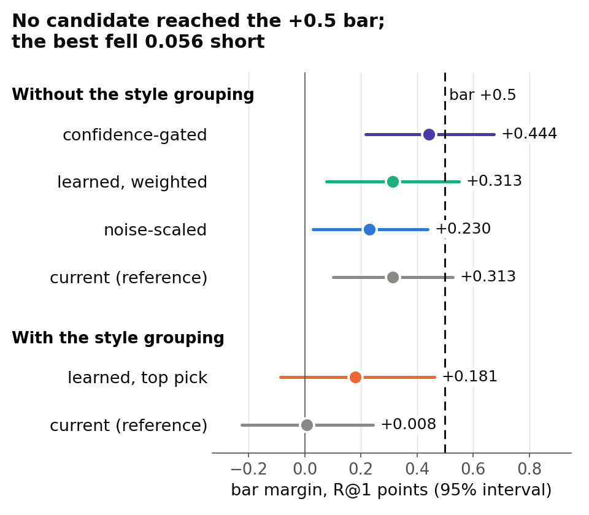
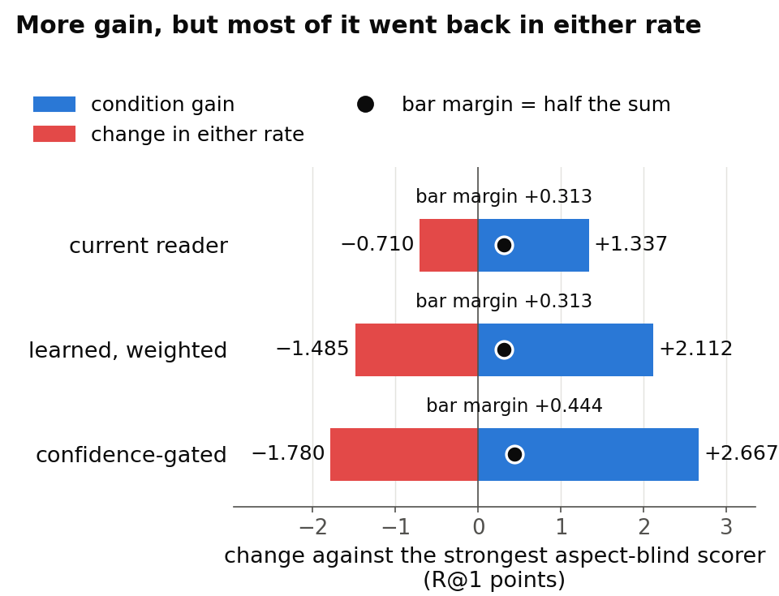
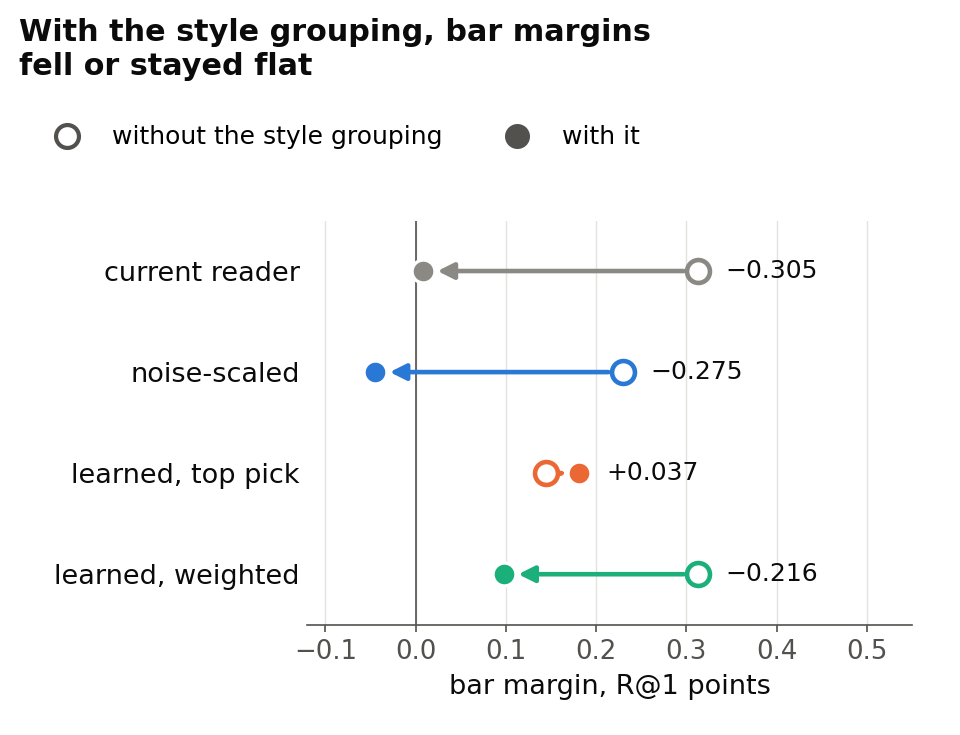

# No new reader cleared the pre-set bar; the best came within 0.06 points

> 6 October 2026. Full report, final-reviewed: [CoSiR v2 reader fix with the CSD style grouping](../reports/auto/v2/2026-11-18_reader_fix_csd.md)

## Summary

- We tried three new readers for CoSiR v2, the part that guesses which aspect a set of example pairs shares.
- None cleared the bar fixed in advance; the best, a confidence-gated reader, reached +0.444 against +0.5.
- The best new readers picked up the aspect much more strongly, but lost most of that because a candidate sharing either aspect came first less often.
- Keeping the style grouping in the set did not clearly help any reader.
- As the rule prescribes, no fresh test was built; every number comes from reused development episodes.
- We advise one more short reader round, with an analysis or benchmark paper as the fallback; the choice among three options is yours.

## How we got here

CoSiR v2, aimed at CVPR (abstract 10 November), ranks candidates under an aspect that is never named. In each **episode** (one ranking task) it ranks 13 captions for a painting's image, or 13 images for a caption. Four example pairs share one aspect (emotion, style or genre) and four contrasting pairs share another. Each episode is scored as four rankings: two **conditions** (which of the two aspects the examples show) times two directions.

The method never sees the dataset's emotion, style or genre labels. It holds a few **groupings** of the training data built without them: an emotion-like grouping from a caption emotion classifier, two clusterings of CLIP features and, since 5 October, a **style grouping** built from CSD, a pretrained encoder of visual style. The **reader** picks the grouping the examples seem to share, and the scorer ranks with it.

Since 4 October we have tracked two numbers on the reused development episodes, both as R@1 (the share of rankings with the right candidate first) above the **matched control**, the same scorer with only the aspect signal removed. One is the scorer **told** the right grouping from the labels, a ceiling rather than a method. The other is the label-free reader. The ceiling kept rising; the reader stayed low (Figure 1).

*Figure 1. Margin over the matched control in R@1 points, with 95% intervals, at three grouping steps (4 and 5 October).*

We insist on matched controls because an earlier method passed a looser control and failed a matched one. On 6 October we planned three new readers to close the gap. Two AI reviewers checked the plan between 00:30 and 01:20 and forced a sounder control for one of them. The decision rule was committed at 02:51, before any code existed; the first reader ran at 03:02 and the rule was applied at 03:43.

**The question:** does any new reader clear the pre-set bar? One that did would earn a one-off test on fresh, never-used episodes before the decision on Friday 9 October.

**How a reader is judged:**

- Its **bar margin** is its R@1 minus that of the strongest of three **aspect-blind scorers** (scorers that ignore which aspect the examples show):
  - the project's best aspect-blind scorer;
  - the same scorer recomputed with the reader's own set of groupings;
  - the reader's matched control.
- The **bar**: a bar margin of at least +0.5 with its 95% interval above 0, plus a clear gain from reading the aspect.
- The **current reader**, the one we already had, is the reference: +0.31 without the style grouping.
- Each new reader ran with and without the style grouping, except the gated one: seven candidates in all.

## 1. The noise-scaled reader

**Problem.** The current reader picks the grouping on which the example pairs agree most, relative to the contrasting pairs. Coarse groupings give large agreements that swing widely by chance, so they win by luck. An **empty grouping** (the style groups shuffled across paintings, so it carries nothing) was picked in 27% to 37% of the cases where the right grouping's signal was weak.

**Idea.** Divide each grouping's evidence by its own chance variation and pick the largest ratio, like a signal-to-noise score. The variation comes from how much agreement scatters from one example pair to the next, so it needs no labels and no training. A coarse grouping with big but noisy swings should then lose its edge.

The review replaced the first plan's divisor, which mixed signal into the scale, with this pure noise estimate. We also ran every reader on a **control set** in which the empty grouping replaces the style grouping: a reader whose scaling works should rarely pick it.

**Did it work.** No. It scored below the current reader on the same groupings, by a difference within the noise. Scaling held back the groupings whose evidence varies most, the image and style groupings, so it picked the right grouping less often. And the empty grouping varies so little that scaling inflated its noise to the size of real evidence. Development data only.

**Key evidence.** Compared with the current reader:

| | Current reader | Noise-scaled reader |
|---|---|---|
| Bar margin, without the style grouping | +0.313 | +0.230 |
| Bar margin, with it | +0.008 | −0.045 |
| Right grouping picked, without it | 54.7% | 47.1% |
| Empty grouping picked, in the control set | 20.3% | 30.5% |

> Full report, [section 4.1](../reports/auto/v2/2026-11-18_reader_fix_csd.md#41-r-a-the-noise-scale-makes-the-empty-grouping-competitive).

## 2. The learned reader

**Problem.** Noise is not the only failure. The style grouping looks like "the visual grouping" for both style and genre, so the current reader picked it in 70.5% of the cases where the examples showed genre against emotion, although the image clustering is the right grouping there. A fixed rule cannot learn which pattern of evidence points to which grouping.

**Idea.** Learn the choice. We built **practice episodes** from the groupings on training rows: the examples share a group of one grouping and the contrasts a group of another, so the right answer is known by construction. Each episode is summarised by six numbers per grouping (how much examples and contrasts agree, the difference, their spread, and how often a pair's image and caption land in the same group), and a small classifier learns to name the shared grouping.

Two copies, trained on two halves of the paintings, are averaged, and every setting was frozen before any development number. The reader scores in two ways: **top pick** uses the most probable grouping, and **weighted** mixes all groupings by their probability, which hedges when the reader is unsure. It was meant to fix both the noise and the style-for-genre confusion.

**Did it work.** Partly. The weighted version without the style grouping matched the current reader, and no version cleared the bar. On real episodes it picked the right grouping far less often than on practice ones. The real-episode score is stricter, though (it credits only one label-derived grouping per aspect), so the gap is not a pure transfer loss, and we did not separate its two possible causes. Development data only.

**Key evidence.** Bar margins against the current reader, and the practice-to-real gap (Figure 2):

| Bar margin | Without the style grouping | With it |
|---|---|---|
| Current reader (reference) | +0.313 | +0.008 |
| Learned, top pick | +0.144 | +0.181 |
| Learned, weighted | +0.313 | +0.098 |

*Figure 2. Right picks on held-out practice episodes (blue, one bar per copy) and real development episodes (orange); dashed lines are chance.*

> Full report, [section 4.2](../reports/auto/v2/2026-11-18_reader_fix_csd.md#42-r-b-a-learned-reader-that-transfers-only-partly-from-its-bank).

## 3. The confidence-gated reader

**Problem.** Even the learned reader picked the right grouping only about half the time on real episodes, and a wrong pick scores the candidates with the wrong grouping.

**Idea.** Use the reader only where it is sure. The gate opens when the top grouping's probability is clearly ahead of the second one (the gap passes a threshold, one of four fixed percentiles); otherwise the score falls back to the aspect-blind scorer alone. It was built on the best of the six other candidates, the weighted learned reader without the style grouping. The fitting chose the middle threshold, so the gate was open in half the cases.

The review made us fix its control. The first plan's control still carried some aspect signal; the committed one averages the whole gated score over both conditions, so it removes only the aspect signal.

**Did it work.** No, but it came closest:

- bar margin +0.444 [+0.216, +0.674] against the bar of +0.5: it put the right candidate first in 218 more of the 49,152 development rankings than its strongest comparator, where +0.5 needed 246;
- the interval includes +0.5, so the data show neither that its true margin is below the bar nor that it is above;
- against the current reader it gained +0.130, within the noise;
- it is the best of seven candidates on reused development data, and the rule puts that selection inflation at roughly 0.1 to 0.15.

**Key evidence.** Figure 3 shows the candidates against the bar. Figure 4 shows why the best fell short, using two quantities:

- **condition gain**: R@1 minus the rate at which the other aspect's candidate comes first (0 for any aspect-blind scorer);
- **either rate**: how often a candidate sharing either aspect comes first;
- exactly, R@1 = (either rate + condition gain) / 2, so reading the aspect pays only if the gain outruns the drop in either rate.

*Figure 3. Bar margins with 95% intervals; the other three candidates scored +0.144, +0.098 and −0.045.*

*Figure 4. Gain and either-rate change against the strongest aspect-blind scorer; the dot, the bar margin, is half their sum.*

The gated reader doubled the current reader's gain, but most of the extra went back in either rate. The loss sits in the episodes that set style against genre (bar margin −0.598), while both pairings with emotion were above +0.5.

> Full report, [section 3.2](../reports/auto/v2/2026-11-18_reader_fix_csd.md#32-what-the-fused-readers-gain-and-lose) and [section 4.3](../reports/auto/v2/2026-11-18_reader_fix_csd.md#43-r-c-the-gate-trades-either-rate-for-gain).

## 4. Keeping the style grouping in the set

**Problem.** Told the right grouping, the scorer gained more with the style grouping than without it (+2.23 against +1.64), but the current reader recovered none of that.

**Idea.** Keep the style grouping and let better readers use it. Any aspect-blind value it adds is credited to the comparators (through the recomputed scorer), so only reading counts. Each new reader ran with and without it, and the rule preferred a winner that used it.

**Did it work.** No. With the style grouping no bar margin rose clearly, and two fell (the current and noise-scaled readers). It lifted the aspect-blind scorers about as much as the readers, and it tracks style and genre about equally, so a reader cannot use it to tell them apart. These comparisons are descriptive (four of them, no correction for multiple tests), on development data.

**Key evidence.** Figure 5.

*Figure 5. Each arrow runs from a reader's bar margin without the style grouping (open circle) to with it (filled).*

> Full report, [section 4.4](../reports/auto/v2/2026-11-18_reader_fix_csd.md#44-the-csd-question-a1-against-a0).

## Advice (our view)

**Run one more short reader round under a new pre-registered rule** (a rule committed before any result), aimed at the two weaknesses we found:

- the either-rate cost, which we measured: for example, a fusion or gate that keeps the aspect-blind scorer's knack for finding aspect-sharing candidates while it reads the aspect;
- the learned reader's gap between practice and real episodes, a diagnosis not yet measured like for like.

Develop it without the style grouping and keep that grouping as an ablation. Plan about two days of work (our rough estimate), time-boxed to one week. Keep the three fresh episode draws for its test, and prepare the analysis or benchmark paper in parallel as the CVPR fallback.

Why: the best reader missed by 28 of 49,152 rankings, its weaknesses are identified (though why the either cost arises is a diagnosis, not a tested cause), and the pipeline is verified and reusable.

On the same groupings the told ceiling is 3.7 times the gated reader's margin (+1.64 against +0.444), so we see design L, which changes the groupings, as the less targeted option. That inference is our view: the ceiling uses labels, and better groupings might also make reading easier, which we have not tested.

The risk of another round is selection: each extra round on the same development episodes inflates its best result, and only the fresh test corrects for that.

## Next

- No candidate cleared the bar, so no test was built and the fresh episode draws are unused.
- The full report passed a final review that confirmed the verdict, and it is committed with the rule, code and run log.
- **Your decision**, one of the rule's three options:
  1. design L: a small model that refines the existing groupings jointly so each adds what the others lack, aimed at the style grouping's overlap with genre; not run yet;
  2. a change of course to an analysis or benchmark paper;
  3. another reader round under a new pre-registered rule (our advice).
- If you choose the third, the next step is the new rule, written and reviewed before any code.

## Glossary

| Plain name | Meaning | Full report's name |
|---|---|---|
| episode | one ranking task, scored as four rankings (two conditions × two directions) | episode |
| condition | which of the episode's two aspects the examples show | condition a / b |
| grouping | a split of the training data made without the dataset's labels | grouping |
| emotion-like grouping | 41 communities of caption emotion scores | affect |
| style grouping | 17 communities of CSD style features | csd |
| without / with the style grouping | the reader's set of groupings | A0 / A1 |
| empty grouping | style groups shuffled across paintings | rand |
| control set | the other groupings plus the empty one, in place of the style grouping | AR |
| reader | picks the grouping the examples share; the scorer ranks with it | reader |
| current reader | picks the grouping the example pairs favour most over the contrasting pairs | step-1 arg-max reader |
| noise-scaled reader | that evidence divided by its chance variation | R-a |
| learned reader, top pick / weighted | classifier trained on practice episodes; its top grouping, or a probability-weighted mix | R-b arg-max / R-b expected |
| confidence-gated reader | the weighted mix, used only where its top grouping is clearly ahead | R-c |
| practice episodes | made-up episodes built from the groupings, with a known answer | bank |
| told | given the right grouping from labels; a ceiling | told |
| R@1 | share of rankings with the right candidate first; differences in percentage points | R@1 |
| matched control | the same scorer with only the aspect signal removed | matched counterpart |
| aspect-blind scorers | best aspect-blind scorer, the same recomputed on the reader's groupings, the matched control | B, B′, matched counterpart |
| bar margin | R@1 minus the strongest aspect-blind scorer's | bar margin |
| bar | bar margin at least +0.5, its interval above 0, and a clear gain | development bar |
| condition gain | R@1 minus the other aspect's first-place rate | condition gain, gain statistic |
| either rate | how often a candidate sharing either aspect comes first | either rate |
| development episodes | the reused draw of 12,288 episodes | episode seed 42 |
| fresh test | one-off test on three never-used episode draws | fresh-seed test (seeds 49 to 51) |
| pre-registered rule | a decision rule committed before any result | decision rule |
| design L | a small model that refines the existing groupings jointly | design L |
