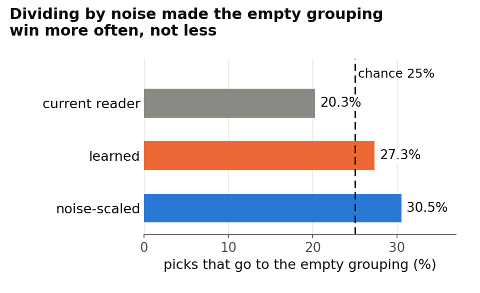
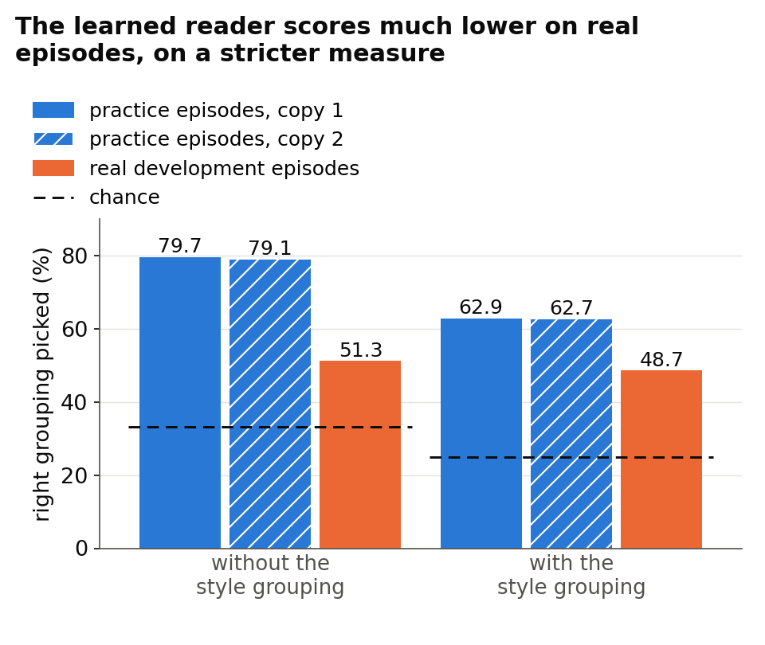

# No new reader cleared the pre-set bar; the best came within 0.06 points

Full report, final-reviewed: [CoSiR v2 reader fix with the CSD style grouping](../reports/auto/v2/2026-11-18_reader_fix_csd.md). Run on 6 October 2026. Reading time about 10 minutes.

## Executive summary

We tried three new versions of the **reader**, the part of CoSiR v2 that guesses which aspect the example pairs of an episode (one ranking task) share. One that cleared a development bar fixed in advance would have earned a one-off test on fresh, never-used episodes before the decision on Friday 9 October. None cleared it. The best, a confidence-gated reader, beat the strongest scorer that ignores the examples' aspect by +0.444 percentage points of R@1 (the share of rankings with the right candidate first), against a bar of +0.5; the current reader's margin on the same measure is +0.31. The gated reader and two learned-reader variants picked up the aspect up to twice as strongly as the current reader, but gave most of that back, because a candidate sharing either aspect came first less often. As the rule prescribes, no fresh test was built. All numbers come from development episodes we have reused many times; independent code and a final review re-derived every one except two intervals added later (Result 2), each computed twice independently. We advise one more reader round of about a week (our estimate) under a new rule committed before any code, with an analysis or benchmark paper prepared as the CVPR fallback (abstract 10 November). On Friday you choose between that, a late-fusion step that refines the existing groupings jointly (design L) and a change of course.

**Assumed background:** you know ML and roughly that CoSiR v2 scores image and caption similarity under an aspect shown only by example pairs, aiming at CVPR; this report re-explains the internal names, the grouping redesign, matched controls and the decision rule. Its question: did any new reader clear the pre-set bar, so the fresh test could run before Friday, and what does that mean for Friday's decision?

## Context

In each episode CoSiR v2 ranks 13 captions for a painting's image (or 13 images for a caption) under an aspect (emotion, style or genre) that is never named: four example pairs share one aspect, four contrasting pairs another. The method never sees the dataset's emotion, style or genre labels: it holds groupings of the training data built without them (an emotion-like grouping from a caption emotion classifier, two clusterings of CLIP features and, since 5 October, a style grouping built from CSD, a pretrained encoder of visual style), and the reader picks the grouping the examples seem to share. **Told** the right grouping from the labels (a ceiling, not a method), the scorer beats its **matched control**, the same scorer with only the aspect signal removed, by +2.23 R@1 points, while the reader managed +0.06 (Figure 1). We insist on matched controls because an earlier method passed a looser control and failed a matched one. This step tried to fix the reader under a decision rule committed before any code, after two AI reviewers checked the plan and forced a sounder control for one reader.

*Figure 1. Margin over the matched control (same scorer, aspect signal removed) in R@1 points, 95% bootstrap intervals; blue: told (right grouping given from labels), orange: the reader. The results use the bar margin (defined below), which is never larger: without the style grouping the current reader has +0.35 here, +0.31 as a bar margin.*

**How sure:** on the same groupings the told margin is +1.64 [1.37, 1.92] against the reader's +0.35 [0.15, 0.57], so reading looks like the bottleneck. These are development episodes, this run's new code reproduced the 5 October rows exactly, and the told scorer uses evaluation labels: a diagnostic ceiling, not a reachable target.

## Results

**What we tried.**

- **Current reader:** picks the grouping on which the example pairs agree most, relative to the contrasting pairs.
- **Noise-scaled reader:** divides that evidence by its chance variation from pair to pair.
- **Learned reader:** a small classifier trained on **practice episodes**, made-up episodes built from the groupings so that the shared grouping is known; it scores with its top grouping (top pick) or a probability-weighted mix (weighted).
- **Confidence-gated reader:** uses the weighted mix only where the top grouping is clearly ahead, and otherwise ignores the aspect.

The noise-scaled and learned readers ran with and without the style grouping, the gated reader on the best of those six: seven candidates, with the current reader as reference. The **bar margin** is a candidate's R@1 minus that of the strongest of three **aspect-blind scorers**: the project's best scorer that ignores the aspect, its rebuild on the reader's groupings, and the matched control. The **condition gain** is R@1 minus the rate at which the other aspect's candidate comes first (0 for an aspect-blind scorer); the **either rate** is how often a candidate sharing either aspect comes first. The rule asked for a bar margin of at least +0.5 with its interval above 0, and a gain interval above 0.

### 1. No reader cleared the bar; the best missed it by 0.056 points

**The confidence-gated reader came closest, at +0.444 against a bar of +0.5, and was not clearly better than the current reader.**

*Figure 2. Bar margin (R@1 above the strongest aspect-blind scorer; higher is better) with 95% intervals; the dashed line is the pre-set development bar, +0.5. Drawn: four of the seven candidates and, in grey, the current reader as reference; the other three (learned top pick without, learned weighted and noise-scaled with the style grouping) scored +0.144, +0.098 and −0.045.*

All seven candidates failed the +0.5 clause; three met the other two. The gated reader's +0.444 [+0.216, +0.674] means it put the right candidate first in 218 more of the 49,152 development rankings than the strongest aspect-blind scorer; +0.5 needed 246. Against the current reader it gained only +0.130 [−0.146, +0.410].

**How sure:** development data (one draw, read many times), a matched control, and a bar committed before any result. The miss is far smaller than the interval's half-width (about 0.23), so it does not show the true margin is below +0.5. The rule puts the inflation from picking the best of seven at roughly 0.1 to 0.15 R@1, and set the +0.5 bar to allow for the roughly halved effects of earlier fresh-seed tests (which measured condition gains, not these margins). Independent code and a final review re-derived every number. Full report, sections [3.1](../reports/auto/v2/2026-11-18_reader_fix_csd.md#31-the-main-table) and [4.3](../reports/auto/v2/2026-11-18_reader_fix_csd.md#43-r-c-the-gate-trades-either-rate-for-gain).

### 2. Three readers read the aspect up to twice as strongly, and paid most of it back

**The gated reader and two learned variants beat the current reader's condition gain, but most of the extra went back in either rate.**

Because R@1 = (either rate + condition gain) / 2 exactly, reading the aspect pays only if the gain outruns the drop in either rate. Against the strongest aspect-blind scorer, the gated reader gained +2.667 against the current reader's +1.337, and its either rate fell by 1.780 against 0.710 (Figure 3): of the 1.331 extra gain, 1.070 went back. Two learned variants reached +2.112 each; the other four candidates read the aspect less than the current reader.

*Figure 3. Blue: condition gain; red: change in either rate; both against the strongest aspect-blind scorer, without the style grouping. The black dot, the bar margin, is half their sum.*

| Gated reader | emotion × style | emotion × genre | style × genre |
|---|---|---|---|
| condition gain | +0.964 | +5.249 | +1.788 |
| change in either rate | +0.452 | −2.808 | −2.985 |
| bar margin | +0.708 | +1.221 | −0.598 |

The cost lands on the two **aspect pairs** (the two aspects an episode sets against each other) that include genre. On emotion × genre the large gain pays for it; on style × genre it does not, and that pair alone holds the average under +0.5.

**How sure:** every candidate's gain interval lies above 0 (gated: [+2.325, +3.012]). Against the current reader, the gated reader's extra gain (+1.331 [+0.942, +1.716]) and extra either cost (−1.070 [−1.469, −0.661]) are clear of 0 but post hoc: computed after the final review on the selected best candidate, not fixed in advance. The pair split is descriptive and untested. Development data, one draw. Full report, sections [3.2](../reports/auto/v2/2026-11-18_reader_fix_csd.md#32-what-the-fused-readers-gain-and-lose) and [3.4](../reports/auto/v2/2026-11-18_reader_fix_csd.md#34-per-aspect-pair).

### 3. Each building block showed a weakness

**Noise scaling held back the image and style groupings, and the learned reader scored much lower on real episodes than on practice ones, on a stricter measure.**

These are the groupings whose evidence varies most by chance. The noise-scaled reader's **pick accuracy** (how often it picks the label-derived right grouping) fell from 54.7% to 47.1% without the style grouping, mostly where image is right, and with it from 73.5% to 47.6% in the emotion × style episodes that show style. In a control set with an empty grouping (style groups shuffled across paintings), scaling inflated its tiny noise to the size of real evidence, so it won 30.5% of picks, against 20.3% under the current reader and 27.3% under the learned reader (Figure 4).

*Figure 4. Share of picks going to the empty grouping in the control set (lower is better); the dashed line is a uniform pick among four groupings.*

Without the style grouping, the learned reader named the shared grouping in about 79% of held-out practice episodes but picked the right grouping in only 51.3% of real ones; with it, about 63% against 48.7% (Figure 5). The real-episode score is stricter: it credits only one label-derived grouping per aspect. The gated reader inherits these picks.

*Figure 5. Right picks on held-out practice episodes (blue; the learned reader is two copies, each trained on half the paintings) and on real development episodes (orange). Chance is one grouping in three (33%) without the style grouping, one in four (25%) with it.*

**How sure:** diagnostics that decide nothing, reproduced by independent code. The two accuracies are not like for like (and genre is not a class in the practice episodes), so the gap is not a pure transfer loss; its two likely causes were not separated, and its cost in bar margin was not tested. Development data. Full report, sections [4.1](../reports/auto/v2/2026-11-18_reader_fix_csd.md#41-r-a-the-noise-scale-makes-the-empty-grouping-competitive) and [4.2](../reports/auto/v2/2026-11-18_reader_fix_csd.md#42-r-b-a-learned-reader-that-transfers-only-partly-from-its-bank).

### 4. The style grouping did not clearly raise any reader's bar margin

**Adding the style grouping lifted the aspect-blind scorers about as much as the readers, so no bar margin rose clearly.**

*Figure 6. Each arrow runs from a reader's bar margin without the style grouping (open circle) to its bar margin with it (filled), in R@1 points; the label gives the change. The gated reader has no row: it was built only without the style grouping.*

With the style grouping, the rebuilt aspect-blind scorer rose by +0.368 and the matched controls by +0.140 to +0.507, while the readers' own R@1 rose by +0.063 to +0.364. What it adds counts mostly as aspect-blind similarity, which the rule credits to the comparators. It also tracks style and genre about equally, so a reader cannot use it to tell them apart.

**How sure:** same episodes, paired comparisons, but descriptive under the rule: four comparisons with no correction for multiple tests. Two changes are below 0 with upper bounds of only −0.053 and −0.039 (current reader −0.305 [−0.553, −0.053], noise-scaled −0.275 [−0.512, −0.039]); learned weighted −0.216 [−0.483, +0.053] and learned top pick +0.037 [−0.238, +0.318] are within noise. Only the learned top pick's own R@1 rose clearly (+0.364 [+0.134, +0.597]). Development data. Full report, section [4.4](../reports/auto/v2/2026-11-18_reader_fix_csd.md#44-the-csd-question-a1-against-a0).

## Advice (our view)

**We recommend one more short reader round under a new pre-registered rule (committed before any result), aimed at the two weaknesses we found:** the either-rate cost, which we measured (for example, a fusion or gate that keeps the aspect-blind scorer's knack for finding aspect-sharing candidates while it reads the aspect), and the learned reader's practice-to-real gap, a diagnosis not yet measured like for like. Develop it without the style grouping and keep that grouping as an ablation, since adding it never clearly raised a bar margin. Time-box it to about a week, keep the three fresh, never-used draws of episodes (seeds 49 to 51) for its test, and prepare the analysis or benchmark paper in parallel as the CVPR fallback.

Why: the best reader missed by 28 rankings out of 49,152, and its weaknesses are identified, though why the either cost arises is a diagnosis, not a tested cause; the pipeline is verified and reusable. On the same groupings, the told ceiling (+1.64 over its matched control) is 3.7 times the gated reader's +0.444 over its matched control, which is also its strongest comparator. We read that as the bottleneck lying in reading the groupings, so we see design L, which changes the groupings, as the less targeted option. That inference is our view: the told ceiling uses labels, and better groupings might also make reading easier, which we have not tested.

Cost and risk: about two days of work in all (our rough estimate). Each extra round on the same development episodes inflates its best result (selection), and only the fresh draws correct for that.

## Where things stand and what's next

- The rule has been applied: no candidate cleared the bar, so no test was built and the fresh draws are unused.
- The full report passed a final review that confirmed the verdict, and it is committed with the rule, code and run log; this briefing is not.
- **Your decision on Friday 9 October**, among the rule's three options: (1) design L, a small late-fusion model that refines the existing groupings jointly so each adds what the others lack, aimed at the style grouping's overlap with genre; it has not been run yet; (2) a change of course to an analysis or benchmark paper; (3) another reader round under a new pre-registered rule (our advice).
- If you choose (3), the next step is the new rule, written and reviewed before any code.

## Glossary

| Plain name | Meaning | Full report's name |
|---|---|---|
| episode | one ranking task: query, 4 example and 4 contrasting pairs, 13 candidates | episode |
| reader | picks the grouping the examples share and scores with it | reader |
| current reader | picks the grouping the example pairs favour most over the contrasting pairs | step-1 arg-max reader |
| noise-scaled reader | that evidence divided by its chance variation | R-a |
| learned reader, top pick / weighted | classifier trained on practice episodes; its top grouping, or a probability-weighted mix | R-b arg-max / R-b expected |
| confidence-gated reader | the weighted mix, used only where its top grouping is clearly ahead | R-c |
| practice episodes | made-up episodes built from the groupings | bank |
| grouping | a split of the training data made without the dataset's labels | grouping |
| emotion-like grouping | 41 communities of caption emotion scores | affect |
| style grouping | 17 communities of CSD style features | csd |
| empty grouping | style groups shuffled across paintings | rand |
| without / with the style grouping | the reader's set of groupings | A0 / A1 |
| control set | the three groupings plus the empty one | AR |
| told | given the right grouping from labels; a ceiling | told |
| R@1 | share of rankings with the right candidate first (chance 7.69%); differences in percentage points | R@1 |
| condition gain | R@1 minus the other aspect's first-place rate | condition gain, gain statistic |
| either rate | how often a candidate sharing either aspect comes first | either rate |
| matched control | the same scorer with only the aspect signal removed | matched counterpart |
| aspect-blind scorers | best aspect-blind scorer, its rebuild, the matched control | B, B′, matched counterpart |
| bar margin | R@1 minus the strongest aspect-blind scorer's | bar margin |
| development bar | bar margin at least +0.5, its interval and the gain interval above 0 | development bar (rule item 3) |
| development episodes | the reused draw of 12,288 episodes, four rankings each | episode seed 42 |
| fresh draws, fresh test | never-used episode draws (seeds 49 to 51) and the one-off test on them | fresh-seed test (rule item 6) |
| pre-registered rule | a decision rule committed before any result | decision rule |
| design L | a small model that refines the existing groupings jointly (late fusion) | design L |
