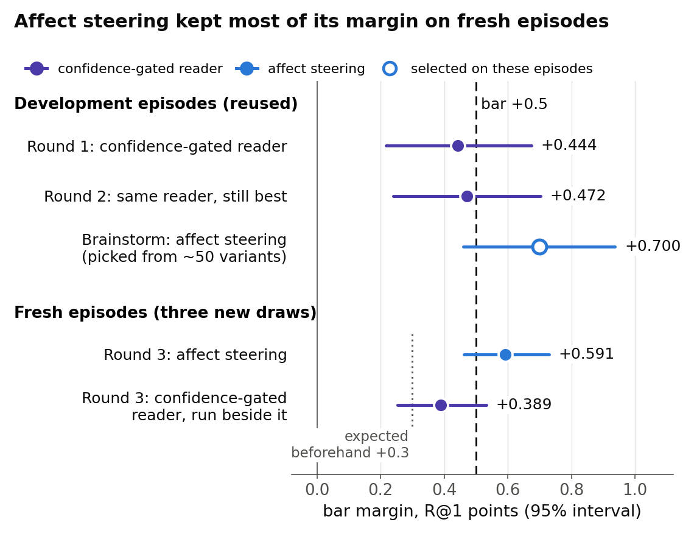

# One-sided affect steering passed the fresh test; its gain comes from steering one side

> 6 October 2026. Full report, final-reviewed: [CoSiR v2 reader fix, round 3: one-sided affect steering on fresh
> episodes](../reports/auto/v2/2026-11-21_round3_affect_gate.md). This briefing replaces the "Next" of the
> [round-1 briefing](2026-10-06_reader_fix.md).

## Summary

- Two development rounds of reader fixes ended just short of the pre-set bar, with round 1's confidence-gated reader still best.
- Taking that reader apart showed its margin came almost entirely from lifting emotion candidates when the examples show emotion.
- So we let it steer only when it picks the emotion-like grouping, and tested that once on three never-used episode draws.
- It passed every pre-registered check, beating the strongest aspect-blind scorer by 0.59 points of R@1, about twice what we expected.
- The gain sits on the two pairings with emotion, it does harm on style against genre, and a random one-sided gate did as well.
- We advise taking it, frozen, to the paper's final test on held-out paintings; four decisions are yours.

## How we got here

CoSiR v2, aimed at CVPR, ranks candidates under an aspect that is never named. In each **episode** (one ranking task)
it ranks 13 captions for a painting's image, or 13 images for a caption. Four example pairs share one aspect (emotion,
style or genre) and four contrasting pairs share another. The two aspects form the episode's **aspect pair**: emotion ×
style, emotion × genre or style × genre.

Each episode is scored under two **conditions**. In the first, the examples show the pair's first aspect and the
contrasts the second; in the second condition they swap. So the first condition is the emotion side in the two pairs
with emotion, and the style side in style × genre.

The method never sees the dataset's labels. It holds **groupings** of the training data built without them: an
**emotion-like grouping** from a caption emotion classifier, and clusterings of CLIP image and caption features. A
**reader** guesses which grouping the examples share. Its grouping score is added to the best **aspect-blind scorer**,
a score that ignores which aspect the examples show.

**How a reader is judged:**

- **R@1** is the share of rankings with the right candidate first; all differences are in percentage points.
- The **bar margin** is the reader's R@1 minus that of the strongest of three aspect-blind scorers: the project's best
  one, the same rebuilt on the reader's own groupings, and the **matched control** (the same reader with only the
  aspect information removed).
- The **bar**: on the reused development episodes, a bar margin of at least +0.5 with its 95% interval above 0, plus
  a clear gain from reading the aspect. Clearing it earns a one-off test on fresh episode draws.
- The **fresh test** gives GO only if seven checks all have 95% lower bounds above 0, pooled over three never-used
  draws: the reader against the three aspect-blind scorers and two simple baselines, plus two checks of its condition
  gain (defined in section 1).

All four steps ran on 6 October. Rounds 1 to 3 each ran under a decision rule committed before any result; the
brainstorm between rounds 2 and 3 was exploratory. Round 1 ran overnight, round 2 in the afternoon, the brainstorm and
round 3 in the evening, followed by a final review that rebuilt the results with its own code. **The question:** does the
brainstorm's idea hold on episodes it was never tuned on? Figure 1 shows the whole line.

*Figure 1. Bar margin of each step's best reader, with 95% intervals. The hollow marker was chosen on the episodes it
is scored on, so it is inflated. The +0.5 bar applies to development episodes only.*

## 1. Round 1: the learned reader and the confidence gate

**Problem.** The reader we had picks the grouping on which the example pairs agree most, compared with the contrasting
pairs. Told the right grouping from the labels, the scorer beat its matched control by 1.64 points; this reader's bar
margin was about 0.3. Groupings with only a few large groups give large agreement scores that swing widely by chance,
so they often won by luck.

**Idea.** Learn the choice instead. We built **practice episodes** from the groupings themselves: the examples share a
group of one grouping and the contrasts a group of another, so the right answer is known without any label. A small
classifier, the **learned reader**, reads a few numbers per grouping (how much the examples agree, how much the
contrasts agree, the difference, their spreads) and gives each grouping a probability.

The score mixes the groupings by these probabilities, which hedges when the reader is unsure. The **confidence gate**
goes one step further: it uses the reader's score only when the top grouping is clearly ahead of the second, and
otherwise falls back to the aspect-blind scorer. Round 1 also tried a noise-scaled form of the old reader, and ran the
other readers with and without a style grouping: seven candidates in all.

**Did it work.** No, but it came close: the confidence-gated reader missed the bar by 0.056, so no fresh test was built.
It doubled the old reader's **condition gain** (R@1 minus the rate at which the other aspect's candidate comes first),
but most of the extra went back in **either rate** (how often a candidate sharing either aspect comes first). R@1 is
half their sum. It was the best of seven, on development data only.

**Key evidence.** Bar margins on the development episodes:

| Reader | Bar margin [95% interval] |
|---|---|
| old reader (reference) | +0.313 |
| learned reader, probability mix | +0.313 |
| confidence-gated reader | +0.444 [+0.216, +0.674] |
| the bar | +0.5 |

> Round-1 full report, [section 4.3](../reports/auto/v2/2026-11-18_reader_fix_csd.md#43-r-c-the-gate-trades-either-rate-for-gain); the [round-1 briefing](2026-10-06_reader_fix.md) covers this round in detail.

## 2. Round 2: three reader fixes, none cleared

**Problem.** On real episodes the learned reader picked the right grouping (as the labels map aspects to groupings)
only about half the time, against about 80% on its practice episodes. Real episodes have lower, differently spread
agreement numbers than the practice ones. We also suspected that the gated reader put first candidates that the
aspect-blind scorer had ranked low.

**Idea.** Three fixes, each with the confidence gate built in, scored in one family beside the unchanged round-1 reader:

- the **adapted reader**: the same classifier, with its inputs rescaled to match the real episodes and its grouping
  frequencies re-estimated on them, both without labels;
- the **retrained reader**: trained again on deliberately impure practice episodes, in which only half of the example
  and contrasting pairs keep their group, a purity chosen to match the real episodes' numbers;
- the **top-k restriction**: first place may come only from the aspect-blind scorer's few best candidates.

The hope was that probabilities closer to real episodes would pick the right grouping more often, and that the
restriction would stop the reader from promoting long shots.

**Did it work.** No, on development data. The round-1 reader stayed best, 14 of 49,152 rankings short of the bar (its
small rise came from a weaker choice by its matched control). The two fixes lowered the margin by 0.36 and 0.40.

The retrained reader picked the right grouping more often than any earlier reader on these groupings yet scored
lowest: its probabilities were flatter and differed less between the conditions. The restriction removed about as many
right answers as it added.

**Key evidence.** On the development episodes (chance pick 33.3%):

| Reader | Bar margin [95% interval] | Right grouping picked |
|---|---|---|
| round-1 confidence-gated reader, unchanged | +0.472 [+0.240, +0.703] | 51.3% |
| adapted reader | +0.116 [−0.073, +0.301] | 47.2% |
| retrained reader | +0.077 [−0.111, +0.271] | 55.7% |

> Round-2 full report, [section 4.1](../reports/auto/v2/2026-11-19_reader_fix_round2.md#41-the-main-table) and [section 5](../reports/auto/v2/2026-11-19_reader_fix_round2.md#5-why-the-candidates-moved-or-did-not).

## 3. The brainstorm: where the margin comes from

**Problem.** Two rounds of tuning the reader's probabilities had not moved the best result, and we did not know which
part of the gated reader's margin carried real signal. You chose to keep improving that reader and to leave the
grouping redesign for later.

**Idea.** Instead of another fix, we took the gated reader's stored development results apart: by aspect pair, by
condition, and by the grouping it picked. One place carried nearly all of the margin, the condition in which the
examples show emotion (Figure 2). There the aspect-blind scorer puts the emotion target first only 10 to 13% of the
time, against about a third for a genre target, so lifting emotion candidates pays.

When the reader picked the image or caption grouping, steering never paid. Those groupings largely repeat what the
aspect-blind scorer already uses (CLIP similarity and image clusters): their scores correlate about 0.6 to 0.7 with
it, against under 0.4 for the emotion-like grouping. Steering with them only spends either rate.

Hence the top-ranked idea, **one-sided affect steering**: keep everything of the gated reader, but open the gate only
when its top pick is the emotion-like grouping. The two conditions of an episode see mirror-image evidence, so this
gate opens mostly in one of them, about 80% of first conditions against 30% of second ones. The brainstorm ranked
three further ideas, which come back under Advice.

**Did it work.** Only as a lead for a fresh test. On the development episodes affect steering cleared the bar (+0.700),
but it was the best of about 50 variants read on those same episodes, so that value is inflated; its family of sixteen
one-sided variants had a median of +0.63. The analysis also flagged a warning: a random gate opening at the same rate
on each side did nearly as well.

**Key evidence.** Figure 2.

*Figure 2. The confidence-gated reader's R@1 minus its matched control's, by aspect pair and by what the examples
show, on the development episodes (exploratory).*

> Brainstorm, [section 2.1](../reports/auto/v2/2026-11-20_r1_levers_brainstorm.md#21-the-margin-comes-from-lifting-emotion-on-the-emotion-side) and [section 3.1](../reports/auto/v2/2026-11-20_r1_levers_brainstorm.md#31-rank-1-one-sided-affect-steering).

## 4. Round 3: affect steering on fresh episodes

**Problem.** Affect steering was found on the development episodes, so its numbers there say little. Only episodes it
had never seen could show whether its edge is real.

**Idea.** We wrote one recipe down before building anything: the gated reader exactly as in round 1, with the gate
opened only on emotion-like picks. The emotion-like grouping was fixed by name, with a label-free reason recorded (it
repeats the aspect-blind scorer least), though that reason was stated after we saw it pay. The development episodes
served only to check that the new code reproduced the old numbers, which it did exactly.

The test drew three never-used sets of 12,288 episodes from the same paintings and ran them once, under the seven GO
checks. A secondary check, fixed in advance, asked whether affect steering beats the gated reader. The rule's prior
expected a bar margin of about +0.3, since earlier fresh tests had roughly halved development effects.

Two descriptive extras rode along: the gated reader, run in full beside it, and a **random one-sided gate** as a control
for the brainstorm's warning. That gate keeps the gated reader's gate on random episodes, opening each condition as
often as affect steering does. It knows which condition is which, which no method may, so it is a control and never a
method.

**Did it work.** Yes. All seven checks passed, pooled and on each draw alone, and the secondary check passed pooled.
The bar margin kept 84% of its development value, where the prior expected about half. Four caveats change what this
means:

- It was picked from about 50 variants on development data. The claim covers new episodes from the same paintings, not
  new paintings.
- The gated reader alone would also have passed (+0.389). Both readers pick their blend weights and gate threshold
  anew on each fresh draw. When the weights picked on the development episodes are reused unchanged instead, affect
  steering's lead over the gated reader shrinks from +0.20 to +0.09, mostly because the gated reader's own weight
  choice did poorly on one draw. This is a descriptive check, not pre-registered.
- The gain sits on the two emotion pairs; on style × genre affect steering fell below the strongest aspect-blind scorer
  (Figure 3).
- The random one-sided gate did as well (Figure 4).

**Key evidence.** Pooled over the three fresh draws:

| Affect steering minus … | R@1 points [95% interval] |
|---|---|
| strongest aspect-blind scorer (the bar margin) | +0.591 [+0.462, +0.729] |
| its matched control | +0.796 [+0.670, +0.920] |
| plain CLIP image-caption similarity (simple baseline) | +5.84 [+5.61, +6.07] |
| confidence-gated reader (secondary check) | +0.202 [+0.093, +0.309] |

*Figure 3. Bar margin per aspect pair on the fresh episodes, against the strongest aspect-blind scorer of the pooled
test. Per-pair results were not tested.*

**Why style × genre loses.** In its first condition the examples share a style and the contrasts a genre. No grouping
the reader has carries style apart from genre, yet it picked the emotion-like grouping in 78% of those conditions,
about as often as when the examples truly show emotion. Affect steering then lifts candidates that share the query's
emotion-like group, which says nothing about style.

*Figure 4. Bar margin on the fresh episodes, pooled, with 95% intervals. The random gate is a control that knows which
condition is which; it is not a method.*

**What carries the gain.** Affect steering minus the random gate was −0.04 and +0.03 points for the gate's two draws,
both within noise. So the reader's choice of which episodes to steer within a condition added nothing we could measure.
What pays is steering mostly one side: about 80% of first conditions and 30% of second ones, where the gated reader
alone steered both sides more evenly.

How does affect steering find that side without labels? A label-free check after the verdict showed that the reader
picks the emotion-like grouping mostly when the image and caption groupings agree more on the contrasting pairs than
on the examples, that is, when the contrasts look alike and the examples do not. Our reading of what follows:

- In the two emotion pairs this happens mostly on the emotion side, where the contrasts share a style or a genre and
  so look alike to these groupings. Steering pays there.
- In style × genre it happens mostly on the style side: genre dominates the image grouping, so contrasts sharing a
  genre look more alike than examples sharing a style. Steering costs there.

So the emotion-like pick behaves like a visual-contrast rule, not an emotion detector.

> Full report, [section 5.2](../reports/auto/v2/2026-11-21_round3_affect_gate.md#52-the-go-checks) (the checks), [section 6](../reports/auto/v2/2026-11-21_round3_affect_gate.md#6-the-secondary-check-and-r1-on-the-fresh-seeds) (the gated reader), [section 7](../reports/auto/v2/2026-11-21_round3_affect_gate.md#7-per-aspect-pair) (per pair), [section 8](../reports/auto/v2/2026-11-21_round3_affect_gate.md#8-mechanism-the-random-share-control) (the control) and [section 10](../reports/auto/v2/2026-11-21_round3_affect_gate.md#10-disclosures-and-limitations) (caveats).

## Advice (our view)

**We recommend the paper path: take affect steering, frozen exactly as tested, to the paper's final test on the
held-out paintings.** The two paths you can choose between:

**Option A, the paper path.** Affect steering is the only reader in this line that passed a pre-registered fresh test
(the gated reader's pass was descriptive). A pass on the held-out paintings would let the paper make round 3's claim
on new paintings: a reader built on groupings made without labels beats every aspect-blind scorer and both simple
baselines, pooled over the three aspect pairs.

The paper would disclose that it was selected on development data and that style × genre loses, describe it plainly
as one-sided steering chosen by a visual-contrast rule, and show the gated reader as its ablation. The risk: the claim
rests on two of the three pairs, and on the benchmark's choice of which aspect comes first in each pair.

**Option B, improve the method first.** The open problems and the brainstorm's remaining ideas:

- *Style × genre*, where affect steering does harm because the groupings hold no style signal apart from genre. Abstain
  there when both sides agree visually (cheap, but label-free detectors of style × genre are weak, and on these
  groupings the best case is no harm); use the style grouping only as evidence for when to steer; or the deferred
  grouping redesign, the only route to an actual style signal.
- *The either-rate cost*: affect steering pays about half a point of either rate for each point of condition gain. A
  sharper emotion signal on the caption side would need less weight for the same gain; it is the one idea that raises
  the ceiling rather than the share of it we recover.
- Any change needs its own pre-registered round on new episode draws before the held-out test, since the three fresh
  draws are spent.

**Why we prefer A.** The fresh result held better than we expected, and more tuning would happen on episodes already
read. On style × genre the best these groupings allow is no harm. If you want it addressed first, one pre-registered
abstention variant on new draws is the cheapest route, with a modest ceiling.

## Next

- Round 3 gave GO. The final review rebuilt the results with its own code, matched every stored number exactly, and
  asked only for text fixes, now applied. The three fresh draws are spent; new draws are free.
- **Your decisions:**
  1. **Paper path or method first.** (a) The held-out paper test with affect steering frozen as tested (our view);
     (b) one more pre-registered round on new draws, aimed at style × genre or the either-rate cost.
  2. **The random-gate result.** The rule had a row for the case where the random one-sided gate matches or beats
     affect steering, and it applies. The rule only reports it and gives no second verdict, so what follows is your call. In plain words:
     - the gain comes from steering one side, the first condition of each pair, far more often than the other;
     - the reader's emotion-like pick behaves like a visual-contrast rule, not an emotion detector;
     - the label-free method still stands: the random gate needs to know which condition is which, while affect
       steering finds that side without labels.

     Options: (a) accept it and describe the method this way in the paper (our view, and the full report's); (b) hold
     the held-out test until the mechanism is better understood, for instance how much the result depends on which
     aspect the benchmark lists first.
  3. **Which reader the paper presents.** Both passed. Affect steering beat the gated reader in the pre-registered
     check, by less when the development weights are reused. Options: affect steering with the gated reader as its ablation (our view), or
     the gated reader alone.
  4. **Style × genre.** Accept and disclose the loss; abstain on it; use style evidence in the gate; or the grouping
     redesign.
- If you choose the paper path, the next step is the held-out test with every piece frozen as in round 3.

## Glossary

| Plain name | Meaning | Full report's name |
|---|---|---|
| episode | one ranking task: 13 candidates, 4 example pairs, 4 contrasting pairs | episode |
| aspect pair | the two aspects an episode sets against each other | aspect pair (e×s, e×g, s×g) |
| first / second condition | examples show the pair's first aspect, or the second | condition a / b |
| grouping | a split of the training data made without the dataset's labels | grouping |
| emotion-like grouping | 41 communities of caption emotion scores | affect |
| image / caption grouping | k-means clusters of CLIP image or caption features | image / caption |
| style grouping | communities of CSD style features; an ablation | csd (configuration A1) |
| reader | guesses which grouping the examples share | reader |
| old reader | picks the grouping the examples favour most over the contrasts | step-1 arg-max reader |
| noise-scaled reader | the old reader's evidence divided by its chance variation | R-a |
| practice episodes | made-up episodes built from the groupings, with a known answer | bank |
| learned reader | classifier trained on practice episodes; mixes groupings by probability | R-b expected |
| confidence-gated reader | the learned reader, used only where its top grouping is clearly ahead | R-c (round 1), R1 (rounds 2 and 3) |
| adapted reader | learned reader with inputs rescaled to real episodes, without labels | R2 |
| retrained reader | learned reader trained on impure practice episodes | R3 |
| top-k restriction | first place only from the aspect-blind scorer's best few | k_top |
| one-sided affect steering | the gated reader, steering only when it picks the emotion-like grouping | AFF |
| random one-sided gate | control: gated reader on random episodes at affect steering's per-condition rate | random-share control |
| visual-contrast rule | our reading of what the emotion-like pick tracks | (section 8, our reading) |
| aspect-blind scorers | the best one, the same on the reader's groupings, the matched control | B, B′(A0), matched counterpart |
| matched control | the same scorer with only the aspect signal removed | matched counterpart |
| simple baselines | plain CLIP similarity, and a similarity learned from the example pairs | cosine, RCA |
| told | given the right grouping from labels; a ceiling | told |
| R@1 | share of rankings with the right candidate first; in percentage points | R@1 |
| bar margin | R@1 minus the strongest aspect-blind scorer's | bar margin |
| bar | bar margin at least +0.5, its interval above 0 and a clear condition gain, on development episodes | development bar |
| GO checks | seven pooled checks on fresh episodes, all lower bounds above 0 | GO checks |
| secondary check | affect steering against the gated reader; fixed in advance, never changes GO | secondary check |
| condition gain | R@1 minus the other aspect's first-place rate | condition gain, gain statistic |
| either rate | how often a candidate sharing either aspect comes first | either rate |
| development episodes | the reused draw of 12,288 episodes | episode seed 42 |
| fresh episodes | three never-used draws from the same paintings | test seeds 49, 50, 51 |
| new episode draws | draws not yet used | seeds 52 and later |
| development weights reused | blend weights and gate threshold picked on development episodes, reused unchanged on the fresh draws | frozen-cell line |
| blend weights | how strongly the reader's grouping score is added to the aspect-blind scorer; picked per draw | cell (λ_u, λ_a, τ) |
| held-out paintings | paintings reserved for the paper's final test | held split |
| pre-registered rule | a decision rule committed before any result | decision rule |
| grouping redesign | late-fusion refinement of the groupings | design L |
