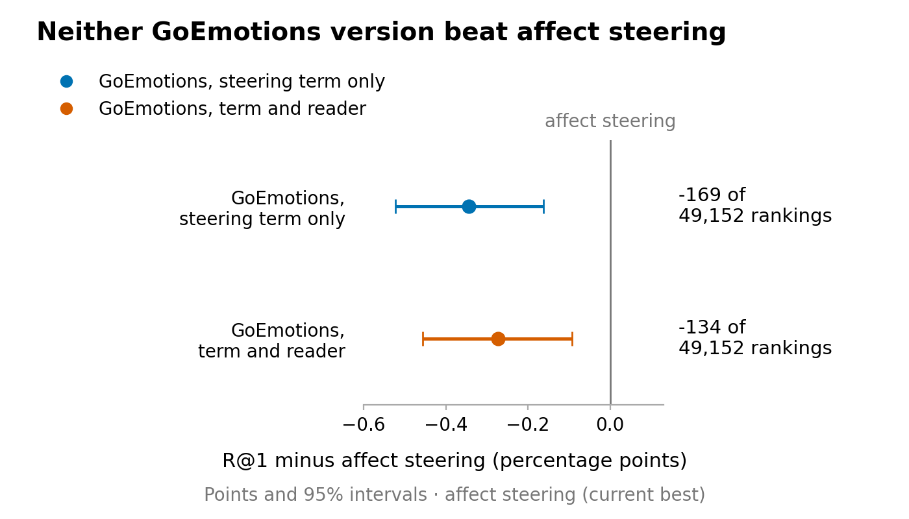
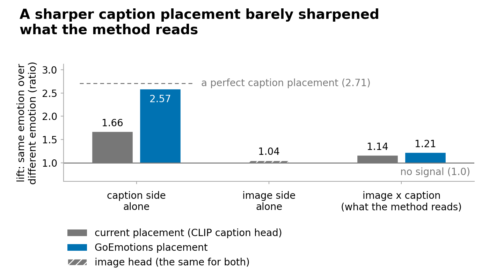
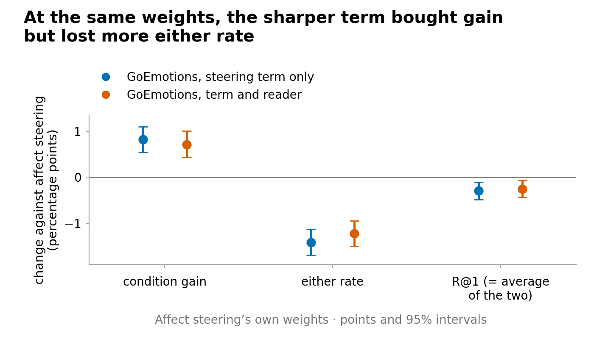

# Placing captions by their own emotion scores made affect steering worse; it stays our best reader

> 7 October 2026. Full report, final-reviewed: [CoSiR v2 reader fix, round 5 (idea 3): GoEmotions placement of
> captions on AFF, developed on seed 42](../reports/auto/v2/2026-11-23_idea3_goemotions.md). The story up to round 4 is
> in the [round-4 briefing](2026-10-07_round4_vetoes.md).

## Summary

- Affect steering places captions into its emotion-like grouping with a CLIP-based classifier that gets most of them wrong.
- We placed each caption by its own emotion scores instead: 86% right, against 36% (partly by construction, since the grouping came from those scores).
- Both versions we tried did worse than affect steering on the development episodes, with intervals below zero; no fresh test measured it.
- The new placement barely reached what the method reads; our check after the stop points to the image classifier, which every score also uses and which carries almost no emotion.
- So the pre-registered rule stopped the round: no fresh test was built, and affect steering, frozen as tested, stays the best.
- We advise the paper's held-out test with affect steering next, once you settle how the style-aware scorer enters it.

## How we got here

CoSiR v2, aimed at CVPR, ranks candidates under an aspect that is never named. In each **episode** (one ranking task)
it ranks 13 captions for a painting's image, or 13 images for a caption. Four example pairs share one aspect (emotion,
style or genre) and four contrasting pairs share another. On the **emotion side** of an episode, the examples share an
emotion. Results are in **R@1**, the share of rankings with the right candidate first, in percentage points.

The method never sees the dataset's labels. It holds **groupings**, splits of the training data built without them.
The **emotion-like grouping** is 41 communities of captions, formed from the scores of an off-the-shelf emotion
classifier for text called **GoEmotions**. A **reader** guesses which grouping the examples share, and its score is
added to an **aspect-blind scorer**, a score that ignores what the examples show.

**Affect steering**, our best reader, adds that score only when the reader is confident and picks the emotion-like
grouping. It passed a pre-registered test on fresh episode draws on 6 October. Round 4 then tried three ways of
switching it off where it hurts, during the night of 6 to 7 October; none helped. One idea from the brainstorm was left
that changes what steering adds rather than where it steers. You chose to test it before the paper test, so that both
held-out reads stay free. This round ran on 7 October from 07:43 to 18:34, under a rule committed before any result.
**The question:** does a sharper placement of captions into the emotion-like grouping make steering pay more?

## 1. Placing captions by their own emotion scores

**Problem.** The method never compares the groupings directly. It asks two small classifiers, **heads**, where an image
and a caption fall: one reads the image's CLIP features, the other the caption's. The caption head puts a caption in
its right emotion community only 36% of the time. The brainstorm argued that this blurs the steering signal, and that a
sharper signal would need less weight for the same gain, which is where steering's cost sits.

**Idea.** The communities themselves were built from each caption's GoEmotions scores. So a caption can be placed by
those scores directly, with no CLIP in between. We fitted a small classifier from the 28 GoEmotions scores to the 41
communities, the same way the CLIP caption head was fitted. On held-out training captions it placed 86% right, partly
by construction, since the communities were built from the same scores. The image head stayed as it was. You decided
this counts as a change of placement, so the parked redesign of the groupings stays open.

We built two versions on top of affect steering:

- **Term only.** The reader, its confidence and its decision to steer stay exactly as tested. Only the score that
  steering adds uses the new placement, so any change is the sharper score alone.
- **Term and reader.** The reader's emotion evidence also uses the new placement, so it can also steer in other places.

To keep the comparison fair, the aspect-blind scorer was rebuilt with the same placement, and each version got its own
**matched control**: the same score with only the example-reading removed.

A version had to pass two tests, as in round 4. The **bar**: beat the strongest aspect-blind scorer by at least 0.5
points of R@1, with an interval above zero and a clear gain from reading the examples. And **beat affect steering** on
the same episodes. Only then would it get a fresh test on three new episode draws.

The rule, written before any number, expected a small gain at best, because every score the method reads also uses the
weak image head. It said a stop at this step would not surprise us.

**Did it work.** No. Both versions missed the bar and both lost to affect steering, this time with intervals entirely
below zero (round 4's vetoes had lost within noise). The rule stopped the round: no fresh test, and affect steering stays
the best. Two caveats:

- This is development data, read many times, and affect steering was found on it.
- We tried one placement recipe, and the reader was not retrained on the new evidence.

**Key evidence.** On the development episodes (12,288 episodes, 49,152 rankings):

| Scorer | Bar margin (bar +0.5) | Net rankings against affect steering | Fresh test |
|---|---|---|---|
| affect steering (reference) | +0.70 | | |
| GoEmotions, term only | +0.36, misses | −169 | no |
| GoEmotions, term and reader | +0.43, misses | −134 | no |

The bar margin is R@1 minus that of the strongest aspect-blind scorer, which for all three was the usual one.

*Figure 1. R@1 of each version minus affect steering's, on the same development episodes, with 95% intervals. Going on
to a fresh test needed a point above zero.*

> Full report, [section 3.1](../reports/auto/v2/2026-11-23_idea3_goemotions.md#31-what-idea-3-changes) (the two
> versions), [section 5](../reports/auto/v2/2026-11-23_idea3_goemotions.md#5-the-development-step-on-seed-42) (the
> decision numbers and the measured diagnostics) and
> [section 7](../reports/auto/v2/2026-11-23_idea3_goemotions.md#7-disclosures-and-limitations) (caveats).

## 2. Why a much sharper placement did not help

**Problem.** The placement got more than twice as accurate, yet steering got worse. Before judging whether any variant
of the idea deserves more work, we needed to know where the sharpness went. This breakdown was made after the stop, on
the development episodes. It uses the labels only to sort cases, and decides nothing.

**Idea.** We tested three explanations.

- **The image side caps the signal.** Every score the method reads pairs one image with one caption. A caption-only
  check shows the new placement carries strong emotion signal, nearly as much as the communities themselves. But the
  image head carries almost none, and multiplying by it erased most of the gain (Figure 2). The reader's ability to
  spot an emotion side barely moved: its detection AUC (0.5 is chance, 1 is perfect) went from 0.787 to 0.790.
- **The old placement carried something extra.** Both CLIP heads read the same CLIP space, so their agreement also
  reflected how similar an image and a caption look to CLIP in general. That would help lift the right candidates
  above unrelated ones. The new agreement overlapped less with the aspect-blind scorer and, used alone, put the right
  candidate first less often. This is an association; we did not show it is the cause.
- **The weight did not save it.** The sharper score did need less weight for its gain: the chosen settings were two
  to four times lighter. But at affect steering's own settings it bought more **condition gain** (how much more often
  the target comes first than the other aspect's candidate) and lost more of the **either rate**, how often either of
  the two comes first (Figure 3). Scored on the whole development draw, an optimistic check, the new score's best
  setting stayed below affect steering's best.

**Did it work.** Partly, as an explanation. The lifts support the image-side cap, in a descriptive check made after the
stop; we did not test whether lifting the cap would help. The extra CLIP similarity fits the numbers but is not
proven. One variant of it was not supported: the old placement did not link a painting's image to another annotator's
caption of the same painting any better than the new one.

**Key evidence.**

*Figure 2. Emotion signal: how much more two items with the same emotion agree than two with different emotions. The
method's score multiplies the image side by the caption side. The dashed line is the most a caption placement could
reach.*

*Figure 3. Both GoEmotions versions scored at affect steering's own settings (its weights and confidence level), a
breakdown rather than a method: change against affect steering in condition gain, either rate and R@1, with 95%
intervals.*

> Full report, [section 6.1](../reports/auto/v2/2026-11-23_idea3_goemotions.md#61-the-image-side-caps-the-agreement-hypothesis-1-supported)
> (the image side), [section 6.2](../reports/auto/v2/2026-11-23_idea3_goemotions.md#62-the-clip-agreement-carried-similarity-that-the-ge-agreement-lost-hypothesis-2-consistent-in-part)
> (the CLIP similarity) and [section 6.5](../reports/auto/v2/2026-11-23_idea3_goemotions.md#65-the-weights-the-cells-moved-and-no-weight-closes-the-gap-hypothesis-5)
> (the weights).

## Advice (our view)

**We would stop work on the affect score and take affect steering, frozen exactly as tested, to the paper's held-out
test.** Before writing that test, settle how the style-aware aspect-blind scorer enters it.

- **Why stop here.** We think the limit sits on the image side. We doubt a better caption placement can fix a score
  whose other half carries almost no emotion, and the old placement seems to have helped partly through CLIP
  similarity. We do not expect a retrained reader to lift that cap; we did not test it.
- **What this round adds to the paper.** A placement more than twice as accurate made the method worse. On development
  data this is consistent with part of affect steering's gain coming from where it steers.
- **The style-aware scorer.** It is the aspect-blind scorer rebuilt with the style grouping, the strongest one we have.
  On the development episodes affect steering is only 0.33 points above it, with an interval just above zero. We would
  report it beside the result rather than make it a pass check. In our view it is not the matched comparison: it uses a
  pretrained style model that affect steering does not use. A reviewer will still see it.

## Next

- **Where things stand.** The round stopped at the development step. No fresh test was built, new episode draws and
  both held-out reads are still unused, and affect steering, frozen as tested on 6 October, stays the best.
- **The checks.** Three separate computations, the implementation, an independent re-derivation and the final review's
  own code, gave the same decision numbers: the ranking counts exactly, the percentages to rounding error.
- **Slips that changed no number** (all in the full report):
  - test runs left stray compiled files in earlier rounds' folders, which we deleted;
  - one helper briefly edited code in place while testing it; no committed result depends on it;
  - a bug in the code that reads the old placement, hidden by tests built on a wrong data shape, passed two reviews
    before another helper caught it, before any real run;
  - two times in the run log were wrong and are corrected.
- **Your decisions:**
  1. **What comes next.** (a) The held-out paper test with affect steering frozen (our view). (b) More method work:
     the grouping redesign for a real style signal, which this round does not change. (c) A small experiment using
     caption-to-caption agreement only to spot emotion sides; it could not fix the steering score. We would not run
     another round on the affect score.
  2. **The style-aware aspect-blind scorer in the paper test.** (a) One of the pass checks, which the test could fail
     on; (b) a comparator reported beside the result (our view); (c) left out. This has to be fixed before the test is
     written.
  3. **Style × genre.** (a) Disclose the loss in the paper, with the grouping redesign as the route to fix it (our view);
     (b) take up the grouping redesign now.
- If you choose the paper test, the next step is writing its rule, with every piece of affect steering frozen as in
  round 3, once decision 2 is settled.

## Glossary

| Plain name | Meaning | Full report's name |
|---|---|---|
| episode | one ranking task: 13 candidates, 4 example pairs, 4 contrasting pairs | episode |
| emotion side | the examples share an emotion | condition a of the emotion pairs |
| R@1 | share of rankings with the right candidate first; in percentage points | R@1 |
| grouping | a split of the training data made without the dataset's labels | grouping |
| emotion-like grouping | 41 communities of captions, from their GoEmotions scores | affect (partition_L) |
| GoEmotions | an off-the-shelf text classifier giving 28 emotion scores per caption | SamLowe/roberta-base-go_emotions |
| head | a small classifier placing an image or a caption into a grouping's communities | head |
| caption head (old) | the head reading the caption's CLIP features | CLIP caption head, Q_CLIP |
| new placement | the classifier from a caption's 28 GoEmotions scores to the communities | GE head, Q_GE |
| reader | guesses which grouping the examples share | reader (A0 half-readers) |
| affect steering | the confident reader, steering only when it picks the emotion-like grouping | AFF |
| term only | affect steering with the new placement in the score it adds | G-T |
| term and reader | the new placement also in the reader's emotion evidence | G-TF |
| aspect-blind scorer | a score that ignores which aspect the examples show | condition-free comparator (B, B′(A0), B′_G) |
| matched control | the same score with only the example-reading removed | matched counterpart |
| style-aware aspect-blind scorer | the aspect-blind scorer rebuilt with the style grouping added | B′(A1) |
| bar margin | R@1 minus the strongest aspect-blind scorer's | bar margin |
| bar | bar margin at least +0.5, interval above 0, and a clear gain from reading the examples | development bar, D10 |
| net rankings | rankings won minus rankings lost against affect steering, of 49,152 | Δ_k |
| condition gain | how much more often the target comes first than the other aspect's candidate | gain |
| either rate | how often the target or the other aspect's candidate comes first | either rate |
| detection AUC | how well the reader's emotion probability separates emotion sides from the rest | detection AUC |
| development episodes | the reused draw of 12,288 episodes | episode seed 42 |
| fresh test | one test on three new episode draws, for a version that passed | test seeds 52 to 54 |
| held-out paper test | the paper's final test on paintings never used | held split |
| round stopped | no version passed both tests, so no fresh test was built | kill |
