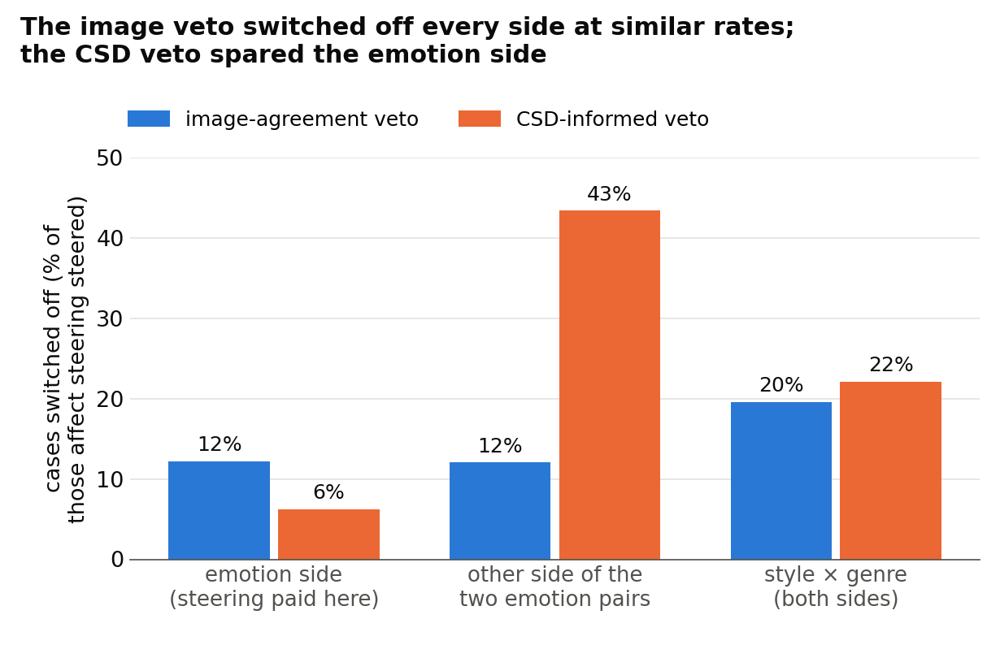

# Switching affect steering off in more places did not help; it stays our best reader

> 7 October 2026. Full report, final-reviewed: [CoSiR v2 reader fix, round 4: three vetoes on AFF's gate, developed on
> seed 42](../reports/auto/v2/2026-11-22_round4_aff_vetoes.md). The story up to round 3 is in the
> [round-3 briefing](2026-10-06_reader_fix_affect_steering.md).

## Summary

- Affect steering passed round 3's fresh test but does harm on style × genre; you chose to improve it before the paper test.
- We tried three vetoes that can only switch its steering off: one aimed at style × genre, one asking a style-aware reader to agree, and both.
- None beat affect steering on the development episodes; each lost by 18 to 34 of 49,152 rankings, within noise.
- So the pre-registered rule stopped the round before any fresh test, and affect steering, frozen as tested, stays the best.
- Every veto also switched off steering where it pays (the examples share an emotion); what it switched off elsewhere had cost little.
- We advise the paper's held-out test with affect steering, once you decide how a stronger, style-aware scorer enters it.

## How we got here

CoSiR v2, aimed at CVPR, ranks candidates under an aspect that is never named. In each **episode** (one ranking task)
it ranks 13 captions for a painting's image, or 13 images for a caption. Four example pairs share one aspect (emotion,
style or genre) and four contrasting pairs share another. The two aspects form the episode's **aspect pair**: emotion ×
style, emotion × genre or style × genre.

Each episode is scored on two **sides**. On the first, the examples show the pair's first aspect; on the second,
examples and contrasts swap. In the two pairs with emotion, the first side is the **emotion side**: the examples share
an emotion. A **case** is one side of one episode; steering is switched on or off case by case. Results are in
**R@1**, the share of rankings with the right candidate first; differences are in percentage points.

The method never sees the dataset's labels. Instead it holds **groupings**, splits of the training data built without
them:

- an **emotion-like grouping**, from a caption emotion classifier;
- an **image grouping** and a **caption grouping**, clusters of CLIP image and caption features;
- a **style grouping**, from a pretrained style model called CSD; affect steering (below) does not use it.

A **reader** guesses which grouping the examples share. Its score for that grouping is then added to an **aspect-blind
scorer**, a score that ignores what the examples show.

**Affect steering**, our best reader, adds that score only when two things hold. The reader gives each grouping a
probability, and it must be **confident**: its top grouping leads the second by at least a threshold. And its top
grouping must be the emotion-like one. In round 3 (6 October) it passed a pre-registered test on three never-used
episode draws. There it beat the strongest aspect-blind scorer by 0.59 points of R@1, averaged over all three aspect
pairs. Two weak spots remained:

- On style × genre alone it fell 0.58 points below that scorer. There its reader picked the emotion-like grouping in
  about 78% of the style sides, and that grouping says nothing about style.
- A random gate that steered each side as often did as well. So its edge over the aspect-blind scorer comes from
  steering mostly one side, not from which episodes within a side get steered.

You chose to improve the method before the paper test. Round 4 ran overnight, on 7 October from 00:17 to 02:36, under a
decision rule committed before any result. **The question:** can a label-free veto switch affect steering off where it
hurts, and so beat it?

**How a veto was judged.** Everything ran on the **development episodes**: the reused draw of 12,288 episodes, four
rankings each, on which affect steering itself was found.

Each veto has a **floor**, the aspect-blind scorer it must beat. A veto that does not read the style grouping gets the
**usual floor**, the strongest of the usual aspect-blind scorers, as affect steering does. A veto that reads it gets a
higher floor, the **style-aware aspect-blind scorer**: the same scorer rebuilt with the style grouping added, the
strongest aspect-blind scorer we have. You set this before any number. A veto then had to pass two separate tests:

- **The bar**, as in round 2: the **bar margin** (R@1 minus the floor's) at least +0.5 with its 95% interval above 0,
  plus a clear gain from reading which aspect the examples show.
- **Beating affect steering**, new this round: winning more of the 49,152 rankings than it loses against affect
  steering on the same episodes.

A veto that passed both would get one test on three fresh episode draws. If none passed, the round stops, no fresh test
is built, and affect steering stays the best.

## 1. Three vetoes on affect steering's gate

**Problem.** Affect steering does harm on style × genre, and the random gate showed that its edge comes from which side
it steers. If a label-free signal could tell when it is steering the wrong side, switching it off there should help.

**Idea.** A **veto** adds one more yes-or-no test to affect steering's decision to steer, so it can only switch
steering off, never on. Everything else stays as tested, including the reader and the family of **blend weights**.
These weigh the reader's score against the aspect-blind score and set the confidence threshold (one of four fixed
levels). They are picked on one half of the episodes and used to score the other half. We built three vetoes from two
of the brainstorm's ideas (numbered 4 and 2 there).

**The image-agreement veto** aims at style × genre. Its signal is how strongly both the examples and the contrasts
agree on the image grouping. Emotion is the non-visual aspect, so in an emotion pair the pairs that share an emotion
agree only weakly on it. Style and genre are both visual, so in style × genre both groups of pairs agree. Strong
agreement on both is therefore meant to mark a style × genre episode, and the veto then switches steering off on both
sides.

The cut-off, the top quarter of the development episodes by that signal, comes from the brainstorm. There it was the
best of four such abstentions on the confidence-gated reader that affect steering grew from.

**The CSD-informed veto** asks a second reader to agree: round 1's learned reader, given the style grouping as a fourth
choice. On the development episodes it had spotted emotion sides better than affect steering's own reader. Steering
happens only when both readers pick the emotion-like grouping. The style grouping only decides when to steer and never
enters the score. The third veto applies **both vetoes** at once.

The rule, written before any number, expected the two CSD-informed vetoes to fail against their stronger floor, and the
image veto to be the likeliest to go forward, beating affect steering by at most about 0.1 points.

**Did it work.** No. The image veto cleared the bar but lost to affect steering by 18 rankings. The two CSD-informed
vetoes missed the bar against the style-aware floor, and lost to affect steering too. With no veto left, the rule
stopped the round: no fresh test was built, and affect steering stays the best. The rule had said this outcome would
not surprise us. Three caveats:

- This is development data, read many times, and affect steering was found on it. Whatever luck its selection had sits
  in the cases it steers, and a veto can only remove those.
- All three losses are small and their intervals include zero (Figure 1). The vetoes did not help; this does not show
  that they harm.
- The floor did not decide it. Against the usual floor the CSD-informed vetoes' bar margins would have been above +0.5,
  and they would still have lost to affect steering.

**Key evidence.** On the development episodes:

| Scorer | Floor | Bar margin (bar +0.5) | Net rankings against affect steering, of 49,152 | Fresh test |
|---|---|---|---|---|
| affect steering (reference) | usual | +0.700 | | |
| image-agreement veto | usual | +0.663, clears | −18 | no: lost to affect steering |
| CSD-informed veto | style-aware | +0.295, misses | −18 | no |
| both vetoes | style-aware | +0.262, misses (interval also reaches below 0) | −34 | no |

Clearing the bar and beating affect steering were separate tests, and a veto needed both. The image veto beat its floor
by more than the bar asks, yet did slightly worse than affect steering itself, so it stopped there. Bar margins are
averaged over all three aspect pairs.

*Figure 1. R@1 of each veto minus affect steering's, on the same development episodes, with 95% intervals. Going on to
a fresh test needed a point above zero.*

> Full report, [section 3.1](../reports/auto/v2/2026-11-22_round4_aff_vetoes.md#31-what-the-vetoes-change) (the vetoes), [section 5](../reports/auto/v2/2026-11-22_round4_aff_vetoes.md#5-the-development-step-on-seed-42) (the development step) and [section 7](../reports/auto/v2/2026-11-22_round4_aff_vetoes.md#7-disclosures-and-limitations) (caveats).

## 2. Why no veto helped

**Problem.** The rule only says that the vetoes lost. To judge whether any other veto is worth a round, we needed to see
which cases (sides of episodes) each one switched off and what that cost.

**Idea.** Every veto ended up with affect steering's own blend weights, so it scores exactly like affect steering except
where it switched steering off. Its difference from affect steering is then exactly the effect of those switch-offs,
and we can split it by side. This breakdown was made after the stop, uses the dataset's labels to sort cases by side,
and decides nothing.

**Did it work.** It explains the loss, on development data only:

- **The emotion side paid, and every veto switched some of it off.** There the examples share an emotion and steering
  lifts the right candidate. Switching it off cost more than all other switch-offs won back (table below). One
  emotion-side episode switched off cancelled the gain of three to five style × genre episodes switched off.
- **The image signal barely told style × genre apart.** The image veto switched off 20% of the cases where affect
  steering steered on style × genre, and 12% on the emotion side (Figure 2). On style × genre, the episodes it closed
  had cost affect steering about as much as those it kept. It won back about a fifth of what switching off all steering
  there would have won, and lost more than that on the two emotion pairs.
- **The second reader told the sides apart, but what it switched off had cost little.** The CSD-informed veto switched
  off 6% of the emotion-side cases against 30% of all the others. Yet steering on the second side of the emotion pairs
  was close to neutral: the 757 episodes where it closed only that side won back 5 rankings net.
- **The CSD-informed vetoes faced a stronger floor.** The style-aware aspect-blind scorer is 0.37 points above the usual
  one, almost all of it on the pairs with style. Affect steering itself is only 0.33 above it, under the +0.5 bar. To
  clear the bar these vetoes needed 0.17 points more than affect steering, from switch-offs alone.

**Why the brainstorm's promise did not carry over.** On the confidence-gated reader, much of the image veto's earlier
gain came from a different pick of blend weights on one half of the episodes; measured without the half split, it was
about a third as large. Also, almost half of what the veto switched off there was on second sides, and affect steering
already does not steer on nine in ten of those, since there the reader had picked the image or caption grouping. What
is left for the veto on affect steering is mostly first sides, which in the emotion pairs is where steering pays.

**Key evidence.** Where the losses came from, and where each veto switched steering off.

*Net rankings won (+) or lost (−) against affect steering, by what the veto switched off (development episodes, out of
49,152).*

| What the veto switched off | Image-agreement veto | CSD-informed veto | Both vetoes |
|---|---|---|---|
| the emotion side alone | −42 | −29 | −65 |
| everything else, together | +24 | +11 | +31 |
| total | −18 | −18 | −34 |

*Figure 2. Of the cases where affect steering steered, the share each veto switched off, on the development episodes,
counted as each episode was actually scored. Both vetoes together switch off every case that either one does.*

> Full report, [section 6.3](../reports/auto/v2/2026-11-22_round4_aff_vetoes.md#63-what-closing-did-per-pair-and-per-side) (net rankings by side), [section 6.4](../reports/auto/v2/2026-11-22_round4_aff_vetoes.md#64-v4-what-the-abstention-closed) (the image veto), [section 6.5](../reports/auto/v2/2026-11-22_round4_aff_vetoes.md#65-v2-a-good-side-detector-with-little-to-gain) (the CSD-informed veto), [section 6.7](../reports/auto/v2/2026-11-22_round4_aff_vetoes.md#67-the-floor-for-v2-and-v24) (the floor) and [section 6.8](../reports/auto/v2/2026-11-22_round4_aff_vetoes.md#68-why-the-brainstorms-abstention-gain-on-r1-did-not-carry-over-to-aff) (the brainstorm).

## Advice (our view)

**We would stop the veto direction and take affect steering, frozen exactly as tested, to the paper's final test on
the held-out paintings.** Before writing that test, decide how the style-aware aspect-blind scorer enters it.

- **Why stop vetoing.** A veto can only remove some of affect steering's steering. Away from the emotion side, steering
  was close to neutral where the vetoes reached, so switching it off bought little. Every label-free signal we have also
  switched off some emotion-side steering that paid. With the current groupings this direction looks spent.
- **Why settle the style-aware scorer first.** It is now the comparator closest to affect steering: about 0.33 points
  below it on the development episodes, and above it on style × genre. A reviewer can ask for it, since the style
  grouping exists. If it becomes one of the test's pass checks (each must have its interval above zero), the test may
  fail on it.
- **If you want one more method step first,** idea 3 is the only one left that could raise the ceiling on the emotion
  side. It places captions in the emotion-like grouping by their own emotion scores, so it changes what steering buys
  rather than where it steers. The brainstorm put it at about half a day, and how well it detects emotion can be
  measured before any round is written.
- **Style × genre** we would disclose in the paper, with the grouping redesign as the route to a real style signal.

## Next

- **Where things stand.** Round 4 stopped at the development step. No fresh test was built, new episode draws are still
  unused, and affect steering, frozen as tested in round 3, stays the best.
- **The checks.** The final review confirmed the stop with a computation in its own code that matched every decision
  number exactly. It also found three process slips that changed no number: the recomputation made during the round
  reused round 3's code, the implementation saw that recomputation's early result, and tests for the fresh-test code,
  which never ran, were deferred after the stop.
- **Your decisions:**
  1. **Paper test now, or idea 3 first.** (a) The held-out paper test with affect steering frozen as tested (our
     view). (b) Idea 3 as its own measured step: measure how well it detects emotion and how much sharper the score
     gets, then decide whether a round on new episode draws is worth it. We would not run another veto round.
  2. **The style-aware aspect-blind scorer in the paper test.** (a) One of the pass checks, which the test could fail
     on; (b) a comparator reported beside the result; (c) left out. This has to be fixed before the test is written.
  3. **Idea 3 and the grouping redesign.** Whether idea 3 counts as part of the parked grouping redesign, a question
     the round's design left to you.
  4. **Style × genre.** (a) Disclose the loss in the paper, with the grouping redesign as the route to fix it (our
     view); (b) take up the grouping redesign now.
- If you choose the paper path, the next step is writing the held-out test, with every piece of affect steering frozen
  as in round 3, once decision 2 is settled.

## Glossary

| Plain name | Meaning | Full report's name |
|---|---|---|
| episode | one ranking task: 13 candidates, 4 example pairs, 4 contrasting pairs | episode |
| aspect pair | the two aspects an episode sets against each other | aspect pair (e×s, e×g, s×g) |
| first / second side | the examples show the pair's first aspect, or the second | condition a / b |
| emotion side | the first side of the two emotion pairs: the examples share an emotion | condition a of the emotion pairs |
| case | one side of one episode, where steering is on or off | (episode, condition) value |
| rankings | four per episode (two sides, two directions); 49,152 on the development episodes | rankings |
| grouping | a split of the training data made without the dataset's labels | grouping |
| emotion-like grouping | communities of caption emotion scores | affect |
| image / caption grouping | k-means clusters of CLIP image or caption features | image / caption |
| style grouping | communities of paintings by their CSD style embeddings | csd (with the others: A1) |
| CSD | Contrastive Style Descriptors, a pretrained style-embedding model | CSD |
| reader | guesses which grouping the examples share | reader |
| confident | the reader's top grouping leads the second by at least a threshold | margin m ≥ τ |
| confidence-gated reader | round 1's learned reader, used only where it is confident | R1 (round 1: R-c) |
| affect steering | the confidence-gated reader, steering only when it picks the emotion-like grouping | AFF |
| veto | one more yes-or-no test on affect steering's decision; can only switch steering off | veto |
| image-agreement veto | switches steering off when examples and contrasts both agree strongly on the image grouping | V4 (signal v, threshold v₇₅) |
| second reader | round 1's learned reader with the style grouping as a fourth choice | A1 reader, π_A1 |
| CSD-informed veto | steers only when the second reader also picks the emotion-like grouping | V2 |
| both vetoes | the two vetoes at once | V24 |
| share switched off | of the cases where affect steering steered, the share a veto switched off | closure share |
| counted as scored | each development episode at the confidence threshold it was actually scored with | as scored (cells 39 and 119) |
| blend weights | the weights of the reader's score and the aspect-blind score, plus the confidence threshold; picked on one half of the episodes to score the other | cell (τ, λ_u, λ_a), cross-fit |
| aspect-blind scorer | a score that ignores which aspect the examples show | condition-free comparator |
| usual floor | the strongest of the usual aspect-blind scorers | B′(A0) |
| style-aware aspect-blind scorer | the same scorer rebuilt with the style grouping added | B′(A1) |
| floor | the aspect-blind scorer a veto's bar margin is measured against | floor, bar comparator |
| R@1 | share of rankings with the right candidate first; in percentage points | R@1 |
| bar margin | R@1 minus the floor's | bar margin |
| bar | bar margin at least +0.5, interval above 0 and a clear gain from reading the aspect | development bar, D10 |
| net rankings | rankings won minus rankings lost against affect steering | Δ_k |
| round stopped | no veto passed both tests, so no fresh test was built | kill (empty carry set) |
| development episodes | the reused draw of 12,288 episodes | episode seed 42 |
| fresh episode draws | three draws reserved for a passing veto; not built | test seeds 52, 53, 54 |
| new episode draws | draws not yet used | seeds 52 and later |
| random gate | round 3's control: steers at random, each side as often as affect steering | random-share control |
| pass checks | the checks a test passes only if every interval is above zero | GO checks |
| held-out paintings | paintings reserved for the paper's final test | held split |
| ideas 2, 3, 4 | the brainstorm's ranked ideas: style evidence for the gate, caption emotion placement, abstention on style × genre | ideas 2, 3, 4 |
| grouping redesign | refinement of the groupings for a real style signal | design L |
| recomputation during the round | an independent rebuild of the numbers, compared with the implementation | re-derivation, phase 1 |
| final review | a fresh reviewer's check of the whole round, with its own code | whole-branch final review |
