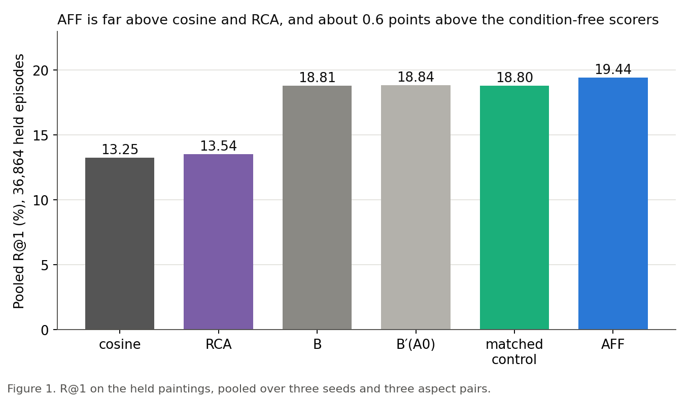
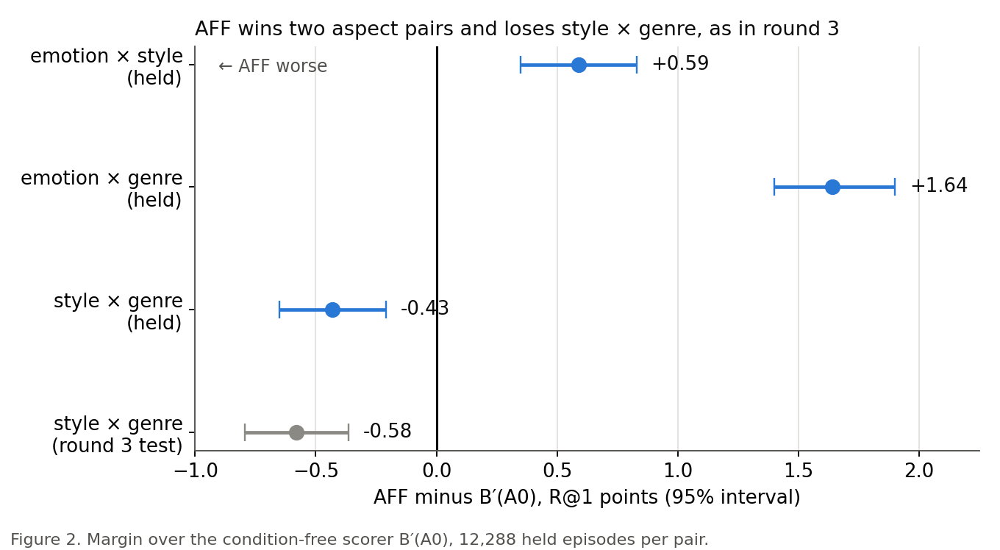

# On paintings never used for tuning, affect steering passes its test, but the gain over the plain scorers is small and only pooled

> 10 October 2026. Full report: [ArtELingo held test of AFF](../reports/auto/v2/2026-11-25_artelingo_held_test.md).

## Summary

- We ran the paper's final test of affect steering once, on held paintings that nothing was fitted, picked or tuned on.
- It passed all seven pre-registered checks, so the verdict is GO.
- Pooled over three aspect pairs it beats the plain scorers by about 0.6 R@1 points, and cosine by 6.19.
- Against the strongest plain scorer built with style, and against the same reader without the gate, it is not established.
- Per aspect pair it wins two and loses style × genre, which the next design (design L) targets.
- The claim is small and pooled; whether to write the paper around it is the decision due this week.

## How we got here

CoSiR ranks captions for a painting (or paintings for a caption) under an aspect that is never named. In each
**episode** (one ranking task) a few example pairs share one aspect, such as emotion, style or genre, and contrasting
pairs share another. The method has to work out which aspect the examples show and rank accordingly. A **reader**
guesses that aspect from the examples. Affect steering (AFF), chosen in round 3 on development data, adds the reader's
score only when the reader picks the emotion-like grouping.

Rounds 4 and 5 tried to improve it and were stopped at the development step, so AFF stayed as it was. A claim for the
paper has to be tested on paintings it has never seen, and the paper go/no-go is on Fri 2026-10-16, with the CVPR
abstract due 2026-11-10. This round is that test.

## 1. The held read

**Problem.** AFF was found among about 50 variants on development episodes. Any number from there is flattered by that
search, so the paper needs one clean look.

**Idea.** One **held read**: a single scoring of ArtELingo's held paintings (12,281 of them, kept apart from everything
used to fit, pick or tune), with every weight frozen on the development seed and the decision rule committed before
the read. We drew 12,288 episodes on each of three new seeds, 36,864 in all. AFF had to beat five scorers (cosine, RCA,
two condition-free scorers and its own matched control), and its condition gain had to exceed theirs. That makes seven
checks, tested together with a Holm correction, which keeps the error rate across all seven at the usual level.

**Did it work.** Yes, with a narrow claim. All seven checks pass, so the verdict is GO. The claim is pooled over the
three aspect pairs only. The two secondary checks, run after a GO and never changing it, are inconclusive:

- against B′(A1), the strongest condition-free scorer (it adds the style grouping), AFF is ahead by +0.14 [-0.03, +0.30];
- against R1, the same reader without the gate, it is ahead by +0.02 [-0.06, +0.11].

So the test does not show that the affect gate matters. The three seeds draw on nearly the same paintings, so their
agreement is not replication; the pooled interval already accounts for that. For the paper, the report advises citing
the wider two-way interval, which also resamples the target paintings (against B′(A0): +0.60 [+0.40, +0.79]).

**Key evidence.** The gain over the plain scorers is modest next to the gain over cosine and RCA. The condition gain,
which is 0 for any scorer that ignores the examples, is +3.06 [+2.87, +3.25] for AFF.

*Figure 1. R@1 on the held paintings, pooled over three seeds and three aspect pairs. B′(A1) and R1 are not drawn;
their margins are in the text above.*

> Full report: Results brief, Results (checks P1 to P7, S1, S2) and Disclosures.

## 2. Comparators added to make the claim fair

**Problem.** A reviewer will ask whether a language model or a fine-tuned CLIP does the same job without our reader.

**Idea.** We added external comparators, reported but never gating the verdict. DTS describes each aspect in words with
a language model and scores the words. DTS-N is told the true aspect name, a privileged ceiling variant. FT-LP, FT-LB
and FT-LoRA are fine-tuned CLIP models. MLLM is a Qwen3-VL-8B reranker, run on seed 52 only.

**Did it work.** On R@1 and condition gain none comes near AFF. One result changes how the paper must talk. On **swap
success** (both targets reorder when the condition swaps) the told-name DTS-N and the MLLM are above AFF, and R1 is
level with it.

**Key evidence.** Pooled R@1 with AFF at 19.44, and swap success:

| Comparator | R@1 | AFF minus it |
|---|---|---|
| DTS | 13.06 | +6.38 [+6.15, +6.59] |
| DTS-N | 12.15 | +7.29 [+7.03, +7.53] |
| fine-tuned CLIP (three variants) | 15.32 to 15.80 | +3.64 to +4.11 |
| MLLM (seed 52) | 14.50 | +4.94 [+4.56, +5.33] |

| Swap success | % | AFF minus it |
|---|---|---|
| AFF | 11.50 | |
| DTS-N | 16.43 | -4.93 [-5.29, -4.57] |
| MLLM (seed 52) | 13.08 | -1.61 [-2.19, -1.01] |

> Full report: Analysis, "External comparators" and "Swap success".

## 3. The per-pair picture

**Problem.** A pooled number can hide a pair where the method does harm. Round 3 found one.

**Idea.** The rule requires the per-pair result beside the pooled claim. We split the margin over B′(A0) by aspect
pair, 12,288 episodes each, after the verdict, so it decides nothing.

**Did it work.** AFF wins two pairs and loses one. The loss on style × genre is of similar size on new paintings as in
round 3 (-0.43 here, -0.580 there), so it is unlikely to be an accident of one set of paintings. That pair is what
design L targets. The claim stays pooled: no per-pair claim is licensed.

**Key evidence.** The same pattern holds against the other comparators; the clearest weakness is on style × genre,
where AFF is also 1.24 points below B′(A1).

*Figure 2. AFF minus B′(A0), R@1 points with 95% intervals, per aspect pair. The grey point is round 3's value.*

> Full report: Analysis, "Per pair, the pooled margin is two wins and a loss".

Our advice (open after giving your reading)

This is our view; you decide.

The pooled claim holds: the margins over B, B′(A0) and the matched control are about +0.6 on each seed (+0.58 to
+0.66), and the intervals stay above zero when candidate or target paintings are resampled too. The seeds share
paintings, so that agreement is not independent replication. The size is modest, it comes from emotion × style and
emotion × genre, and style × genre loses. We are fairly sure of the pooled sign over B, B′(A0) and the control. We are
not sure of any margin over B′(A1) or R1, and less sure the margin would survive another dataset.

We recommend design L as the next loop, because the style × genre loss is the clearest weakness and the go/no-go needs
to know whether it is fixable. In parallel, draft the ArtELingo-centred paper from the full report, with the per-pair
table beside the pooled claim.

## Next

**Where things stand.** The read is done and the verdict is GO. The full report has been through its final review; a
scoped re-review of the fixes may still change a few words. Disclosures about how AFF was found, the DTS tuning and
the style × genre loss travel with every AFF number.

**Your decisions:**

1. **Your reading of the results** (decision C), at the r6 read chat, before you open our advice above.
2. **The descriptive-pass fix.** The first descriptive pass stopped because the same phrase had two different language
   model answers across seeds. We rebuilt the held listings of seeds 53 and 54 with the earlier listings as caches,
   then finished the pass. The rule does not cover this, so it hands the call to you. It touches only the descriptive
   DTS rows, never the verdict, which rests on a file written before any DTS input was read. Options: (a) ratify;
   (b) do not ratify, and the DTS rows are marked unratified.
3. **The paper go/no-go.** Options: (a) an ArtELingo-centred paper around the small pooled claim, with
   style × genre shown beside it, no further compute; (b) wait for design L first, which would be a new held read,
   disclosed as designed after this one; (c) a second dataset or backbone, which needs new data preparation and a new
   held read.

Design L is the next loop whichever you choose.

## Glossary

| Term | Meaning | Full report's name |
|---|---|---|
| episode | one ranking task: 13 candidates, example pairs and contrasting pairs | episode |
| aspect pair | the two aspects an episode sets against each other | emotion × style, emotion × genre, style × genre |
| held rows | ArtELingo paintings reserved for the final test, never used to fit, pick or tune | held rows |
| held read | one pre-registered scoring of the held rows, ledgered | held read |
| R@1 | share of rankings with the right candidate first, in percentage points | R@1 |
| AFF | affect steering: the reader's score added only when it picks the emotion-like grouping; current best | AFF |
| R1 | the same reader, with no gate on which grouping it picks | R1 |
| cosine, RCA | plain CLIP similarity; a condition-aware baseline the report compares against | COS, RCA |
| B | the best condition-free scorer before the reader | B |
| B′(A0) | B rebuilt on the reader's three groupings | B′(A0) |
| B′(A1) | B′ with the style grouping added: the strongest condition-free scorer | B′(A1) |
| condition-free scorer | a score that ignores which aspect the examples show | condition-free comparator |
| matched control | a scorer's own score with only the condition removed | matched control |
| condition gain | R@1 for the right condition minus R@1 for the swapped one; 0 for condition-free scorers | condition gain |
| swap success | share of episodes where both targets reorder when the condition swaps | swap success |
| Holm | a correction for testing several checks at once, so the error rate holds across all seven | Holm |
| DTS, DTS-N | describe-then-score with a language model; DTS-N is told the true aspect name | DTS, DTS-N |
| FT-LP, FT-LB, FT-LoRA | three fine-tuned CLIP comparators | FT-LP / FT-LB / FT-LoRA |
| MLLM | a Qwen3-VL-8B reranker comparator | MLLM |
| design L | the planned grouping redesign aimed at style × genre | design L |
| claim test | a test that licenses only the text of its pre-registered claim | claim test |
