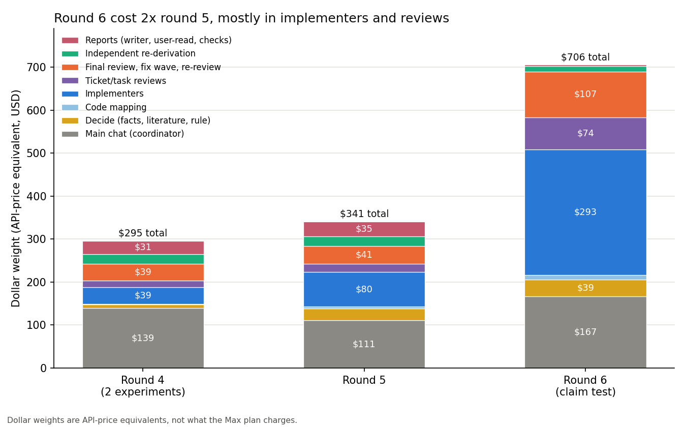
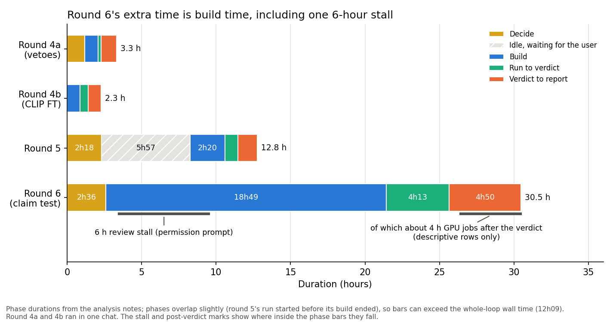

# Round 6 on Matt's chain cost about twice round 5 and took 2.5 times as long, and we found no sign that the engine caused it

> 2026-10-10 · Full report: [engine_switch_check](../reports/auto/process/2026-11-26_engine_switch_check.md) (CoSiR report names carry a sequence number, not the calendar date, so 2026-11-26 is not a future date)

## Summary

- We compared rounds 4 and 5 (built with the Superpowers workflow) with round 6 (the first loop on Matt Pocock's workflow): cost, GPU time and wall-clock time.
- Round 6 cost about twice round 5 ($706 against $341, in API-price terms) and took 30h31 against 12h09.
- The extra went into the build: long Opus implementers, subagents rewriting their cache while they waited, and one 6-hour stall.
- Quality did not drop: every final review confirmed the result with fixes, and no review changed a decision number.
- We found no sign that the engine caused the increase, so we advise keeping Matt's chain and changing how we use it.

## Terms used below

- **Engine**: a packaged way for the agent to turn a spec into code, that is, how tasks are cut, built and reviewed. We have used two: Superpowers (rounds 4 and 5) and Matt Pocock's chain (round 6).
- **Round, loop**: one pass of the research loop, from deciding what to do to the report. A *medium* loop is a standard one (rounds 4 and 5); a *claim test* is a full loop that tests a claim for the paper (round 6).
- **Ticket**: one buildable piece of the spec, given to a subagent (an *implementer*) and then checked by a second one (the *ticket review*).
- **Held read**: the one-time test on held-out data, whose result is the *verdict* (go or kill under the decision rule). *Descriptive rows* are extra table rows computed after the verdict, for description only. A *smoke run* is a quick trial run that checks the plumbing.
- **Re-derivation**: a second agent recomputing the decision numbers from the data. *Decision number*: a number the verdict rests on.
- **Cache**: the model provider's prompt cache, which lets a chat re-read its context cheaply; for subagents it lasts only 5 minutes.
- **Max plan**: your Claude subscription; the dollar figures here are API-price equivalents used only to compare token kinds, not what the plan charges.

## How we got here

CoSiR is the aspect-conditioned image-text similarity project aiming at CVPR. Rounds 4 and 5 were medium loops on Superpowers. Round 6, the one-time ArtELingo held-split test of AFF (our affect-steering method), was the first loop on Matt's chain. You asked whether the switch made things slower or more expensive, and what to change.

The rounds are not like for like: round 6 was one claim test (15 tickets, 43.6 GPU-hours on the cluster), against two medium loops in round 4 and one in round 5.

## What cost and time went where

**Problem.** Round 6 was much more expensive and slower, and it was unclear whether the new engine was to blame.

**Idea.** We extracted every chat's and subagent's token use, priced it at API rates, split it by role (coordinator, implementers, reviews, and so on) and laid the timelines side by side.

**Did it work.** Yes, with the not-like-for-like caveat above. Round 6 against round 5:

| | Round 5 | Round 6 |
|---|---|---|
| Dollar weight | $341 | $706 |
| Wall clock | 12h09 (5h57 idle) | 30h31 |
| Implementers, dollar weight | $80 | $293 |

**Key evidence.**

*Figure 1. Round 6's extra dollar weight sits mostly in implementers and reviews.*

*Figure 2. Round 6's extra time is build time, including a 6-hour stall. The GPU bracket lies inside "verdict to report". Round 5's phases overlap by about 40 minutes, so its bars add up to more than its 12h09.*

What drove it:

- Five very long implementers took 27% of round 6's input tokens; 14 of 16 implementers and all 14 ticket reviewers ran on Opus.
- Subagents that waited over 5 minutes lost their cache and rewrote their whole context: about $80, 11% of round 6's dollar weight.
- The coordinator's cost did not fall, because its calls tripled (2,422, against 764 in round 4 and 592 in round 5) while it babysat 89 cluster jobs.
- One review sat 6 hours on a permission prompt in an unattended chat and blocked the build.
- 28.8 GPU-hours (about 4 hours of wall time on nine GPUs) ran after the verdict, for descriptive rows only.

Our reading, on why the engine was not the cause: Matt-specific steps (code mapping, ticket writing) cost about $10 of $706. The increase sits in implementers, reviews and the coordinator, which both engines have, and in the round's larger size. We found no sign that the engine caused it; this is not a proven separation.

Quality held: final reviews found no blocking issue in any round, re-derivations agreed everywhere, and round 6's ticket reviews caught one blocking defect (a smoke run that would have wrongly unlocked the held read).

> Full report: Results, Analysis.

Our advice (open after giving your reading)

Our view: keep Matt's chain. The round's size, Opus on nearly every ticket, long implementers, cache rewrites and the stall drove the cost. The three changes with the largest expected effect (the full report lists seven; savings are rough estimates):

1. A watchdog for stuck subagents and no prompts in unattended chats (would have saved roughly 6 of 30.5 hours; no quality risk).
2. Tickets sized so an implementer ends under about 200k context (roughly 10 to 20% of a loop's cost; quality neutral or better).
3. No waits over about 4 minutes inside subagents (roughly $80 of cache rewrites; quality neutral).

Smaller ones: Sonnet for plumbing tickets, one queue script per GPU stage in run chats. We would keep the rule review before the build, ticket reviews on verdict code, the final whole-branch review with re-derivation, and Sonnet report drafting with an Opus claim review.

## Next

Decisions that are yours:

1. Keep Matt's chain, or switch back to Superpowers.
2. Which of the proposed changes to adopt (each needs your approval).
3. The descriptive GPU pass after the verdict (28.8 GPU-hours): more GPUs, a held subsample, or running it in the next chat. It changes what the descriptive table shows.
4. Codex in unattended chats: Codex is the other agent we can hand jobs to. The auto-mode permission check refused its command with the sandbox bypass, so Codex was never used in round 6. Either allow that command (the sandbox cannot run in this container) or drop Codex jobs from unattended chats.

## Glossary

- **Dollar weight**: tokens priced at API rates to compare token kinds.
- **Final whole-branch review**: the one review of the whole build before it is called done.
- **AFF**: affect steering, the method round 6 tested.
